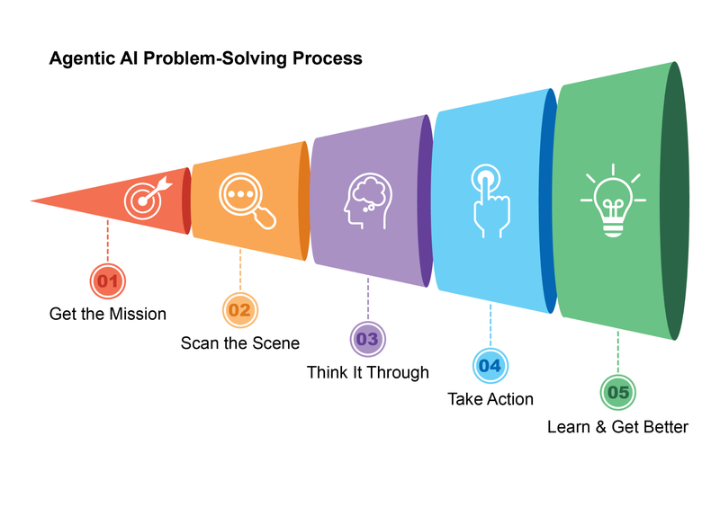
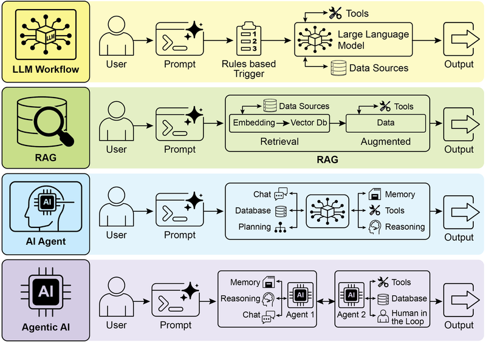
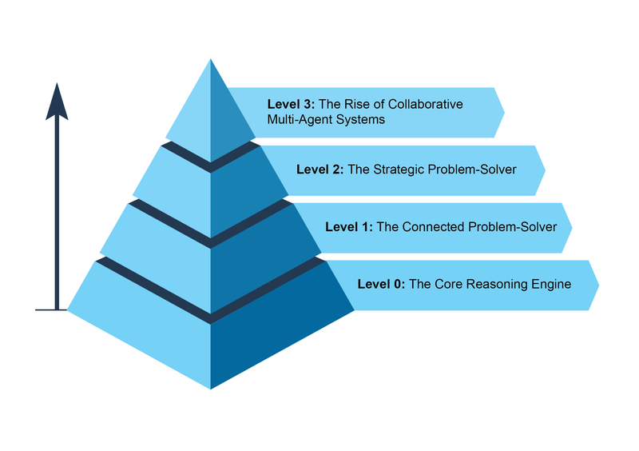
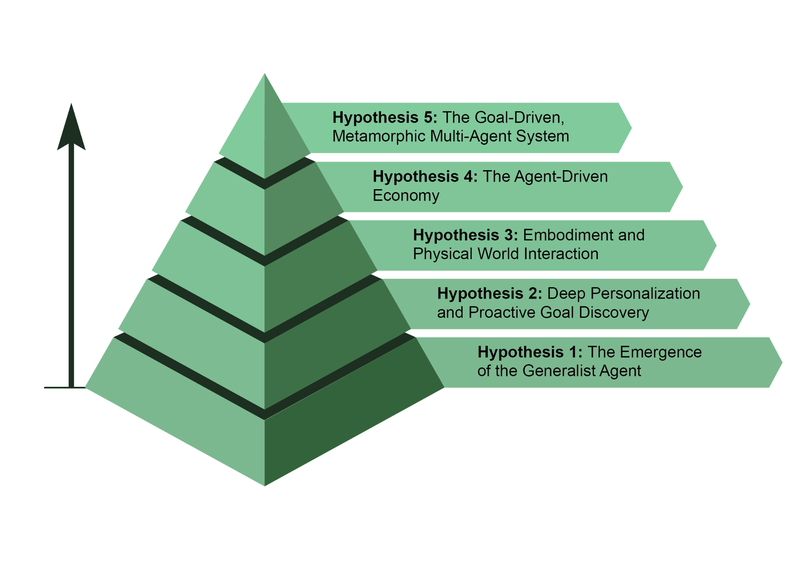

# 模块 00：课程导读——什么是 AI Agent

> 对应 PDF 第 10-22 页（Introduction + What makes an AI system an "agent"?）

---

## 概念地图

- **核心概念**（必须内化）：Agentic System 的定义与核心特征、Agent 复杂度等级（Level 0-3）
- **实操要点**（动手时需要）：本书 21 个设计模式的全景地图、三大开发框架（LangChain/CrewAI/Google ADK）
- **背景知识**（扩展理解）：Agent 技术的未来五大假说、从 LLM 到 Agentic AI 的演进路径

---

## 概念讲解

### 1. Agentic System（智能体系统）

**定义**：Agentic System 是一种能够**感知环境、自主决策、执行行动**来达成目标的计算系统。和传统软件按固定指令一步步走不同，Agent 具备灵活性和主动性——它能根据情况变化调整自己的行为。

**核心思想**：Agent 不是"更聪明的脚本"，而是从"告诉计算机怎么做"到"告诉计算机为什么做"的范式转变。

**直觉建立**：

想象一个传统软件是**地铁系统**——线路固定，站点固定，出了任何意外（施工、故障）整条线就瘫了。

而 Agent 更像一辆**装了 GPS 导航的汽车**。你告诉它目的地（目标），它自己决定走哪条路（规划），遇到堵车会绕路（适应），路上还能停下来加油或问路（工具使用），到了新城市还能记住好走的路线（记忆）。

> **类比边界**：GPS 导航只能走现有道路，而 Agent 理论上可以"创造新路径"（比如组合多个工具完成没见过的任务）。

**为什么重要/有效**：

Agentic System 之所以成为 AI 发展的前沿，是因为它让 LLM 从"一次性问答机器"变成了"能持续工作的助手"。原书列出了 Agent 的六大核心特征：

| 特征 | 含义 | 对应的日常体验 |
|------|------|---------------|
| **Autonomy**（自主性）| 不需要人一步步指挥 | 你给它一个大目标，它自己分解执行 |
| **Proactiveness**（主动性）| 会主动朝目标行动 | 不只是被动回答，还会主动提建议 |
| **Reactiveness**（响应性）| 能应对环境变化 | 遇到意外情况能调整方案 |
| **Goal-oriented**（目标导向）| 始终围绕目标工作 | 不会跑偏，每一步都在推进目标 |
| **Tool Use**（工具使用）| 能调用外部 API、数据库等 | 不止靠自己"想"，还能"查"和"做" |
| **Memory**（记忆）| 跨交互保留信息 | 上次聊的内容它还记得 |
| **Communication**（通信）| 与用户、其他系统或其他 Agent 进行沟通 | 能主动联系外部系统或协作 Agent |

**示例**：

原书举了一个客服场景的对比：
- **传统系统**：按固定脚本应答，遇到脚本没覆盖的问题就卡住
- **Agentic 系统**：理解用户提问的细微差别，自动访问知识库和订单系统，必要时追问澄清，主动解决问题甚至预判后续需求

**适用场景**：
- 需要多步骤推理和决策的复杂任务
- 需要与多个外部系统交互的工作流
- 需要根据动态环境调整策略的场景

---

### 2. 设计模式在 Agent 开发中的意义

**定义**：Agentic Design Patterns（Agent 设计模式）是经过验证的、可复用的解决方案模板，用于解决 Agent 设计和实现中反复出现的典型问题。

**核心思想**：就像建筑有建筑模式、软件有设计模式（如单例、工厂），Agent 开发也有自己的一套"标准解法"。这些模式不是死板的规则，而是经验的结晶。

**直觉建立**：

设计模式就像**菜谱**。你当然可以每次做菜都从零开始实验，但有了菜谱（模式），你就知道"红烧"这个技法适合什么食材、火候多大、调料放多少。每道具体的菜（你的 Agent 应用）可以在菜谱基础上灵活调整，但基本框架是被验证过的。

本书提出的 21 个设计模式就是 Agent 开发的"21 道标准菜谱"。

> **类比边界**：菜谱通常是线性的步骤，而设计模式之间可以自由组合、嵌套使用，更像乐高积木。

**为什么重要/有效**：

原书给出了四个核心价值：
1. **避免重复造轮子**：管理对话流、集成外部能力、协调多 Agent——这些问题别人已经踩过坑
2. **提供共同语言**：说"这里用 Routing 模式"，团队马上就懂你的架构意图
3. **提升鲁棒性**：模式中内置了错误处理和状态管理的最佳实践
4. **加速开发**：把精力放在业务逻辑上，而不是重新发明基础架构

**适用场景**：
- 任何规模的 Agent 开发项目
- 团队协作时需要统一的架构语言
- 从原型到生产的过渡阶段（模式提供了工程化的脚手架）

---

### 3. Agent 复杂度等级（Level 0-3）

**定义**：原书按能力递进将 Agent 分为四个等级，从"裸模型"到"多 Agent 协作系统"。

**核心思想**：Agent 不是"有或没有"的二元概念，而是一个连续的光谱。理解这个光谱帮你判断"我的场景需要多复杂的 Agent"。

**直觉建立**：

想象一个人在公司里的成长路径：

| 等级 | 类比 | 能力 |
|------|------|------|
| **Level 0** | **实习生**（只靠课本知识）| 只能用自己学过的东西回答问题，不能查资料、不能上网 |
| **Level 1** | **初级员工**（会用工具了）| 会用搜索引擎、会查数据库、会调 API——能"连接外部世界" |
| **Level 2** | **资深员工**（能独立负责项目）| 能做战略规划、主动跟进、自我改进——不只是执行，还会思考 |
| **Level 3** | **管理团队**（多人协作）| 不再是单兵作战，而是多个专家分工协作，有项目经理协调 |

> **类比边界**：人的能力是连续积累的，而 Agent 的等级更多取决于架构设计——你可以直接从 Level 0 跳到 Level 3 的架构设计。

**为什么重要/有效**：

这个分级框架帮你做两个关键决策：
1. **需求评估**：我的任务需要 Level 几的 Agent？不是所有场景都需要 Multi-Agent
2. **能力规划**：从 Level 1 到 Level 2 需要增加什么？（规划能力、上下文工程、自我改进）

**各等级详细说明**：

#### Level 0：核心推理引擎

LLM 本身不是 Agent，但它可以作为 Agent 的"推理核心"。在 Level 0 配置下，LLM 没有工具、没有记忆、不与环境交互，完全依赖预训练知识。

- **优势**：利用大量训练数据解释成熟概念
- **局限**：完全没有实时信息意识（比如不知道 2025 年奥斯卡最佳影片是什么）

#### Level 1：连接式问题解决者

LLM 连接到外部工具后成为功能性 Agent。它能执行一系列操作来收集和处理信息。

- **关键能力**：跨多个步骤与外部世界交互
- **示例**：要查新电视剧 → 识别需要实时信息 → 调用搜索工具 → 综合结果；要查股价 → 调用金融 API 获取 AAPL 实时价格

#### Level 2：战略型问题解决者

能力大幅扩展，涵盖战略规划、主动协助和自我改进。原书特别强调了**上下文工程（Context Engineering）**的概念：

> **Context Engineering**：战略性地从所有可用信息中选择、打包和管理最关键的信息，有效地管理模型有限的注意力，防止认知过载。

- **战略规划**：不只用一个工具，而是串联多个工具解决复杂问题
- **主动运行**：旅行助手能主动从邮件中提取航班信息、同步日历、查询天气
- **自我改进**：通过反馈学习优化自己的 prompt 和信息打包方式

#### Level 3：协作式多 Agent 系统

从"追求一个全能超级 Agent"转向"多个专家协作"。这直接映射了人类组织的结构——不同部门各司其职，协同完成多面任务。

- **示例**：发布新产品 → "项目经理" Agent 协调 → "市场调研" Agent 收集数据 → "产品设计" Agent 开发概念 → "营销" Agent 撰写推广材料
- **当前挑战**：受限于 LLM 的推理能力上限；Agent 之间的真正"互相学习"还在早期

> **图说**：Agent 的工作循环——获取任务 → 扫描环境 → 思考规划 → 执行行动 → 学习改进。这个循环是所有等级 Agent 的基础操作范式。

> **图说**：AI 范式的演进路径——从基础 LLM 到 RAG 增强，再到单 Agent 使用工具，最终到多 Agent 协作系统。

> **图说**：Level 0 到 Level 3 的 Agent 复杂度光谱，展示各等级的核心能力差异。

---

### 4. 未来五大假说

**定义**：原书提出了关于 AI Agent 发展方向的五个前瞻性假说，帮助读者理解当前技术所处的阶段和可能的演进方向。

**核心思想**：当前的 Agent 系统只是起点，未来可能在通用性、个性化、物理世界交互、经济参与和自我进化方面实现突破。

| 假说 | 核心观点 | 关键挑战 |
|------|---------|---------|
| **假说 1：通用型 Agent** | 从窄领域专家进化为能处理复杂、模糊、长期目标的通用 Agent | 需要推理、记忆和可靠性的根本突破；另一条路是"乐高式"小型专家 Agent 组合 |
| **假说 2：深度个性化与主动目标发现** | Agent 成为深度个性化的主动伙伴，从"执行命令"到"预判需求" | 学习用户的独特模式和目标，在高置信度时主动采取行动 |
| **假说 3：具身化与物理世界交互** | Agent 突破数字世界，通过机器人硬件在物理世界操作 | 感知-规划-执行的闭环，从制造到家庭维护的全面应用 |
| **假说 4：Agent 驱动的经济** | 高度自主的 Agent 成为经济参与者，创造新市场和商业模式 | 自动化电商全流程：趋势分析 → 营销 → 供应链 → 动态定价 |
| **假说 5：目标驱动的变形多 Agent 系统** | 系统从声明的目标出发，自主组建和重组 Agent 团队 | 两层自我进化：架构层（重写代码）+ 指令层（自动优化 prompt） |

> **图说**：AI Agent 发展的五个前瞻性假说概览。

**适用场景**：
- 做 Agent 产品规划时，用这五个假说评估技术路线
- 理解行业趋势，判断哪些能力值得提前投入

---

### 5. 本书结构与开发框架

**定义**：本书共 21 章，每章深入一个设计模式，组织为 4 个 Part + Appendix。每章包含模式概述、实际应用场景、代码示例和要点总结。

**核心思想**：模式虽按顺序编排，但可以当参考手册用——遇到什么问题就翻到对应的模式章节。

**本书的四大部分**：

| Part | 主题 | 覆盖模式 | 解决的核心问题 |
|------|------|---------|---------------|
| **Part One** | 核心编排模式 | Prompt Chaining, Routing, Parallelization, Reflection, Tool Use, Planning, Multi-Agent | Agent 的基础能力：怎么分解任务、怎么调用工具、怎么协作 |
| **Part Two** | 状态与适应 | Memory, Learning, MCP, Goal Setting | Agent 的持久能力：怎么记住、怎么学习、怎么互联互通 |
| **Part Three** | 鲁棒性与增强 | Exception Handling, Human-in-the-Loop, RAG | Agent 的安全网：出错怎么办、什么时候请人帮忙、怎么增强知识 |
| **Part Four** | 高级模式与工程化 | A2A, Resource Optimization, Reasoning, Guardrails, Evaluation, Prioritization, Exploration | Agent 的进阶能力：通信协议、推理技术、安全护栏、效果评估 |

**三大开发框架**：

| 框架 | 特点 | 适合场景 |
|------|------|---------|
| **LangChain / LangGraph** | 灵活的链式组合 + 有状态图操作 | 构建复杂的操作序列和图结构 |
| **CrewAI** | 专为多 Agent 角色和任务编排设计 | 需要多 Agent 协作的场景 |
| **Google ADK** | 与 Google AI 基础设施集成 | 使用 Google 生态的项目 |

> 本书通过跨框架的代码示例展示设计模式，帮助读者理解模式的核心逻辑而非绑定特定框架。

---

## 重点标记

1. **Agent = 感知 + 决策 + 行动**：不是更聪明的脚本，而是能自主推进目标的系统
2. **设计模式是可复用的解决方案**：21 个模式覆盖了从基础编排到高级安全的全栈需求
3. **四个复杂度等级定义了能力光谱**：Level 0（裸模型）→ Level 1（连接工具）→ Level 2（战略规划+自我改进）→ Level 3（多 Agent 协作）
4. **上下文工程是 Level 2 的关键能力**：不是把所有信息塞给模型，而是精心挑选最相关的信息
5. **多 Agent 系统模仿人类组织结构**：不追求全能超级 Agent，而是让专家分工协作

---

## 自测：你真的理解了吗？

**Q1**：你的老板让你做一个"智能客服系统"，要求它能查订单、退款、回答产品问题。你会把它设计成 Level 几的 Agent？需要哪些核心能力？

**Q2**：有人说"我直接用 GPT-4 就够了，不需要什么设计模式"。这个说法在什么场景下是对的？什么场景下是错的？为什么？

**Q3**：假设你要建一个自动化电商运营系统（选品 → 定价 → 营销 → 客服），用 Level 2 的单 Agent 方案和 Level 3 的多 Agent 方案分别怎么设计？各有什么优劣？

**Q4**：原书提到"messy systems plus agents are a recipe for disaster"（混乱的系统 + Agent = 灾难配方）。请用你自己的经验举一个例子说明，为什么 Agent 需要"干净的基础设施"才能工作好？
