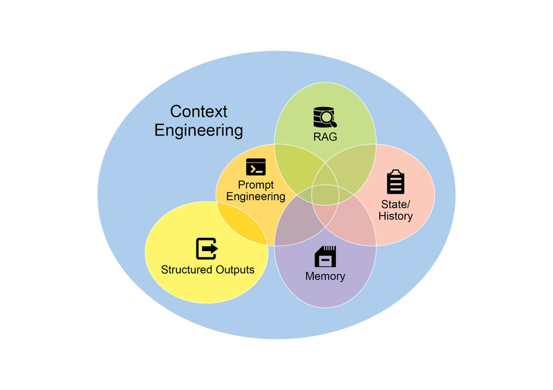
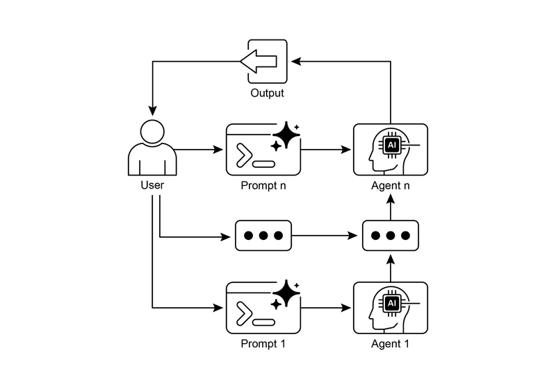
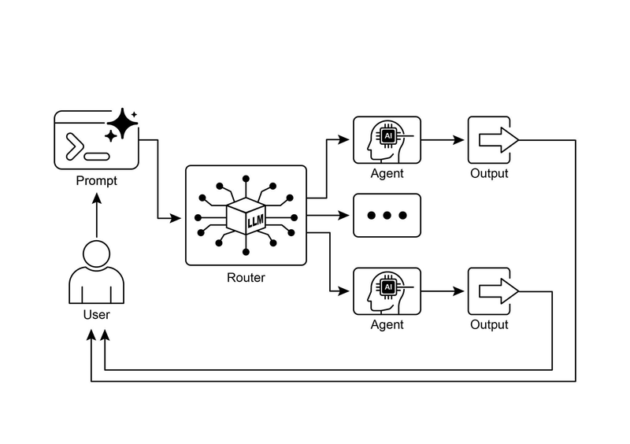

# 模块 01：链式调用与路由

> 对应 PDF 第 23-49 页（Chapter 1: Prompt Chaining + Chapter 2: Routing）

> **Part One 导读**：本部分覆盖 7 个核心编排模式（Module 01-04），它们是构建任何 Agent 系统的基础积木。从最简单的链式调用开始，逐步引入路由、并行、反思、工具使用、规划，最终到多 Agent 协作。这些模式之间不是互斥的，而是可以自由组合——一个成熟的 Agent 系统往往同时使用多种模式。

---

## 概念地图

- **核心概念**（必须内化）：Prompt Chaining 模式、Routing 模式、结构化输出在链式调用中的作用
- **实操要点**（动手时需要）：LCEL 链式表达式构建、四种路由实现方式（LLM/Embedding/规则/ML 模型）、Context Engineering
- **背景知识**（扩展理解）：单 prompt 的局限性分析、从 Prompt Engineering 到 Context Engineering 的演进

---

## 概念讲解

### 1. Prompt Chaining（链式调用）

**模式名称与一句话定义**：Prompt Chaining（又称 Pipeline Pattern）——将复杂任务拆解为一系列小任务，前一步的输出作为下一步的输入，像流水线一样依次执行。

**解决什么问题**：

单个 prompt 处理复杂任务时会出现以下问题：

| 问题 | 表现 |
|------|------|
| **指令忽略**（Instruction Neglect）| prompt 包含太多指令，模型"忘了"执行其中一些 |
| **上下文漂移**（Contextual Drift）| 处理到后半段时，模型偏离了最初的上下文 |
| **错误传播**（Error Propagation）| 早期的小错误在后续步骤中被放大 |
| **幻觉增加**（Hallucination）| 认知负荷越大，生成错误信息的概率越高 |

比如你让 LLM "分析市场报告 → 总结发现 → 识别趋势并提取数据 → 写邮件"，一个 prompt 塞下这四步，模型可能总结做得不错，但数据提取和邮件撰写就稀烂了。

**直觉建立**：

想象你在管理一条**工厂装配线**。一个工人（单 prompt）同时负责焊接、喷漆、组装和质检——他一定会手忙脚乱，质量也没法保证。

Prompt Chaining 就是把这条线拆成多个工位：
- **工位 1（焊接）**：只管焊接，做完把半成品传给下一个
- **工位 2（喷漆）**：只管喷漆，拿到焊好的件就干活
- **工位 3（组装）**：只管组装
- **工位 4（质检）**：只管检查

每个工位专注一件事，效率和质量都大幅提升。而且如果喷漆工位出了问题，你可以单独修理那个工位，不用整条线停工。

> **类比边界**：真实流水线上每个工位的能力是固定的，但在 Prompt Chaining 中，你可以在每一步给 LLM 分配不同的"角色"（如市场分析师、交易分析师、文档专家），让同一个模型在不同步骤表现出不同的专长。

**工作原理**：

```
输入文本 → [Prompt 1: 提取信息] → 中间结果 1
                                      ↓
                              [Prompt 2: 转换格式] → 中间结果 2
                                                      ↓
                                              [Prompt 3: 生成输出] → 最终结果
```

关键机制：
1. **分步拆解**：每个 prompt 只负责一个具体操作
2. **链式传递**：前一步的输出是下一步的输入
3. **角色分配**：每一步可以给模型设定不同角色，提高该步骤的专注度
4. **结构化输出**：步骤之间用 JSON/XML 等格式传递数据，避免自然语言的模糊性

**代码示例**（LangChain LCEL）：

```python
from langchain_openai import ChatOpenAI
from langchain_core.prompts import ChatPromptTemplate
from langchain_core.output_parsers import StrOutputParser

llm = ChatOpenAI(temperature=0)

# Step 1: 提取技术规格
prompt_extract = ChatPromptTemplate.from_template(
    "Extract the technical specifications from the following text:\n\n{text_input}"
)

# Step 2: 转换为 JSON
prompt_transform = ChatPromptTemplate.from_template(
    "Transform the following specifications into a JSON object with "
    "'cpu', 'memory', and 'storage' as keys:\n\n{specifications}"
)

# 构建链：Step 1 的输出 → Step 2 的输入
extraction_chain = prompt_extract | llm | StrOutputParser()
full_chain = (
    {"specifications": extraction_chain}  # Step 1 输出传入 Step 2
    | prompt_transform
    | llm
    | StrOutputParser()
)

# 执行
result = full_chain.invoke({
    "text_input": "The new laptop features a 3.5 GHz octa-core processor, "
                  "16GB of RAM, and a 1TB NVMe SSD."
})
```

> 这段代码的核心是 LCEL（LangChain Expression Language）的 `|` 运算符——它把多个组件像管道一样连起来。`{"specifications": extraction_chain}` 这行是关键：它把第一条链的输出映射到第二个 prompt 的 `{specifications}` 变量。

**适用场景 vs 不适用场景**：

| 适用 | 不适用 |
|------|--------|
| 任务有明确的多个处理阶段 | 简单的一问一答 |
| 需要在步骤间集成外部工具/API | 任务之间没有依赖关系（应该用并行化） |
| 需要在步骤间做数据验证 | 需要动态决策走哪条路径（应该用 Routing） |
| 需要多步推理的复杂查询 | 实时对话中要求极低延迟的场景 |

> **常见误用**：把所有任务都串成一条链，即使有些步骤之间并没有依赖关系。这会导致不必要的延迟——没有依赖的步骤应该并行化（见 Module 02）。另一个常见错误是步骤间传递自然语言而非结构化数据，导致信息在传递中失真。

---

### 2. 结构化输出（Structured Output）

**定义**：在 Prompt Chaining 中，步骤之间传递的数据格式至关重要。结构化输出（如 JSON、XML）确保数据的精确传递，避免自然语言的模糊性。

**核心思想**：链的可靠性取决于数据传递的完整性。如果前一步的输出格式模糊，后一步可能因为"理解错了"而失败。

**示例**：

趋势识别步骤的输出不是一段自然语言，而是结构化 JSON：

```json
{
  "trends": [
    {
      "trend_name": "AI-Powered Personalization",
      "supporting_data": "73% of consumers prefer brands using personal info..."
    },
    {
      "trend_name": "Sustainable and Ethical Brands",
      "supporting_data": "Sales of ESG products grew 28% over five years..."
    }
  ]
}
```

**为什么重要/有效**：
- **机器可读**：后续步骤可以精确解析字段，不用"猜"
- **减少错误**：消除了自然语言解释的歧义
- **便于验证**：可以在步骤间加入格式校验逻辑

---

### 3. Context Engineering（上下文工程）

**定义**：Context Engineering 是一门系统性的方法论——在 AI 模型生成回复之前，为它设计、构建和交付一个完整的信息环境。核心主张是：**模型输出的质量，取决于你给它的上下文质量，而非模型架构本身。**

**核心思想**：从"怎么问一个好问题"（Prompt Engineering）进化到"怎么构建一个完整的认知环境"（Context Engineering）。

**直觉建立**：

**Prompt Engineering** 就像给一个新员工发一条短信："帮我写个周报"——他可能写出来，但质量取决于他能猜对多少你的需求。

**Context Engineering** 则像给这个员工一个**完整的工作包**：
- **身份说明**（System Prompt）："你是技术文档写手，语气正式精确"
- **参考资料**（Retrieved Documents）：上周的项目进展文档
- **实时数据**（Tool Outputs）：从日历 API 拿到的你本周日程
- **背景信息**（Implicit Data）：你和收件人的关系、过往邮件记录

有了这个工作包，他写出的周报质量会高几个档次。

> **类比边界**：员工有自己的判断力和常识，但 LLM 没有——所以 Context Engineering 更加关键。对 LLM 来说，"不在上下文中的信息就不存在"。

**为什么重要/有效**：

Context Engineering 的核心要素：

| 层级 | 内容 | 示例 |
|------|------|------|
| **System Prompt** | 基础指令和角色定义 | "你是技术写手，语气正式精确" |
| **Retrieved Documents** | 从知识库检索的相关文档 | 项目技术规格文档 |
| **Tool Outputs** | 外部 API 调用的结果 | 日历可用时间、实时股价 |
| **Implicit Data** | 用户身份、交互历史、环境状态 | 用户偏好、之前的对话记录 |

**关键实践**：
- 建立健壮的数据管道，在运行时获取和转换上下文数据
- 建立反馈循环，持续改进上下文质量
- 可以使用自动化工具（如 Vertex AI Prompt Optimizer）系统性地优化



> **图说**：Context Engineering 的核心是为 AI 构建一个丰富、全面的信息环境——上下文的质量是驱动 Agentic 高性能表现的首要因素。

**适用场景**：
- 任何需要高质量、个性化输出的 Agent 应用
- 从"无状态聊天机器人"到"有情境感知能力的系统"的升级

---

### 4. Routing（路由）

**模式名称与一句话定义**：Routing（路由模式）——根据输入的内容、意图或状态，动态决定把请求分发到哪个专门的处理流程、工具或子 Agent。

**解决什么问题**：

Prompt Chaining 是线性的——A → B → C → D。但现实世界的任务不是线性的：
- 客户问的可能是"查订单"、"咨询产品"或"投诉"，每种需要不同的处理流程
- 收到的数据可能是 JSON、CSV 或纯文本，每种需要不同的解析方式
- 代码片段可能是 Python、Java 或 Go，每种需要不同的分析工具

没有路由，你要么把所有情况都塞进一个万能 prompt（效果差），要么硬编码 if-else 逻辑（不灵活）。

**直觉建立**：

想象一家**医院的分诊台**。所有病人从同一个大门进来，但不是所有人都去同一个科室：

- 胸痛 → 心内科（紧急通道）
- 咳嗽发烧 → 呼吸科
- 骨折 → 骨科
- 不确定 → 全科门诊（先做初步检查）

**分诊护士**就是 Router——她快速评估病人的症状（分析输入），然后决定把病人送到哪个科室（路由到对应流程）。她不亲自治疗（不处理具体任务），只负责"送对人到对的地方"。

> **类比边界**：真实分诊有固定的标准流程，而 LLM-based Routing 可以理解更细微的语义差别——比如区分"产品坏了"（技术支持）和"产品不好用"（产品反馈），这是规则难以覆盖的。

**工作原理**：

```
用户输入 → [Router: 分析意图] → 意图 A → [处理流程 A]
                                → 意图 B → [处理流程 B]
                                → 意图 C → [处理流程 C]
                                → 不确定 → [澄清流程]
```

**四种路由实现方式**：

| 方式 | 原理 | 优点 | 缺点 |
|------|------|------|------|
| **LLM-based** | 让 LLM 分析输入并输出分类标签 | 灵活，能理解语义细微差别 | 有延迟，偶尔分类错误 |
| **Embedding-based** | 把输入转为向量，与各路由的向量做相似度比较 | 基于语义而非关键词，更精确 | 需要预先定义各路由的代表性向量 |
| **Rule-based** | 预定义的 if-else / 关键词匹配规则 | 快速、确定性高 | 不灵活，难处理新情况 |
| **ML Model-based** | 专门训练一个**判别式**分类模型做路由（非 LLM 生成式推理，而是将路由逻辑编码在学习到的权重中） | 高精度、低延迟 | 需要标注数据训练，维护成本高 |

**代码示例**（LangChain RunnableBranch）：

```python
from langchain_google_genai import ChatGoogleGenerativeAI
from langchain_core.prompts import ChatPromptTemplate
from langchain_core.output_parsers import StrOutputParser
from langchain_core.runnables import RunnablePassthrough, RunnableBranch

llm = ChatGoogleGenerativeAI(model="gemini-2.5-flash", temperature=0)

# Router: 让 LLM 判断意图
coordinator_router_prompt = ChatPromptTemplate.from_messages([
    ("system", """Analyze the user's request and determine which handler should process it.
- If related to booking flights or hotels, output 'booker'.
- For general information questions, output 'info'.
- If unclear, output 'unclear'.
ONLY output one word: 'booker', 'info', or 'unclear'."""),
    ("user", "{request}")
])

router_chain = coordinator_router_prompt | llm | StrOutputParser()

# 定义各处理分支
def booking_handler(request: str) -> str:
    return f"Booking processed: '{request}'"

def info_handler(request: str) -> str:
    return f"Info retrieved: '{request}'"

# RunnableBranch: 根据 Router 输出走不同分支
delegation_branch = RunnableBranch(
    (lambda x: x['decision'].strip() == 'booker',
     lambda x: booking_handler(x['request']['request'])),
    (lambda x: x['decision'].strip() == 'info',
     lambda x: info_handler(x['request']['request'])),
    lambda x: f"Unclear request: {x['request']['request']}"  # 默认分支
)

# 组合：Router + Branch
coordinator = {
    "decision": router_chain,
    "request": RunnablePassthrough()
} | delegation_branch
```

> 核心逻辑：先让 LLM 输出一个分类词（"booker"/"info"/"unclear"），然后 `RunnableBranch` 根据这个词把请求路由到对应的处理函数。

**Google ADK 中的路由**：

在 Google ADK 中，路由更隐式——你定义一组 `sub_agents`，每个有自己的 `description`。框架的 Auto-Flow 机制自动根据用户意图将请求分派到匹配的子 Agent：

```python
coordinator = Agent(
    name="Coordinator",
    model="gemini-2.0-flash",
    instruction="Analyze requests and delegate to the appropriate specialist agent.",
    sub_agents=[booking_agent, info_agent]  # Auto-Flow 自动路由
)
```

> ADK 的路由不需要你手动写分类逻辑——框架内部利用 LLM 理解 `description` 来决定路由。更简洁，但对路由逻辑的控制力较低。

**适用场景 vs 不适用场景**：

| 适用 | 不适用 |
|------|--------|
| Agent 需要根据意图走不同流程 | 所有输入都走同一个处理流程 |
| 有多个专业化子 Agent 或工具 | 只有一种处理方式 |
| 输入类型多样（文本/数据/代码） | 输入格式固定且单一 |
| 客服系统需要分流不同类型问题 | 简单的信息查询 |

> **常见误用**：路由分支设置过多（超过 10 个），导致 LLM 分类准确率下降。建议控制在 3-7 个分支，如果更多则考虑层级路由（先粗分再细分）。



> **图说**：Prompt Chaining 模式的可视化——Agent 接收一系列 prompt，每个 Agent 的输出作为链中下一个的输入。



> **图说**：Router 模式——使用 LLM 作为路由器，根据输入意图分发到不同的专业化处理流程。

---

## Prompt Chaining 的七大应用场景

原书列出了 Prompt Chaining 的七个典型应用，每个都代表一类常见需求：

| # | 场景 | 链条结构 | 关键特点 |
|---|------|---------|---------|
| 1 | **信息处理工作流** | 提取 → 总结 → 抽取实体 → 查询知识库 → 生成报告 | 多阶段数据转换 |
| 2 | **复杂查询回答** | 拆解问题 → 分别检索 → 综合答案 | 可与并行化结合：检索步骤并行，综合步骤串行 |
| 3 | **数据提取与转换** | 初次提取 → 验证 → 补漏 → 再验证 | 带条件循环的链（提取失败则重试） |
| 4 | **内容生成** | 选题 → 大纲 → 逐段撰写 → 全文审校 | 每段写作时提供前一段作为上下文 |
| 5 | **有状态对话** | 处理当前对话 → 更新状态 → 生成回复 → 下一轮 | Prompt Chaining 是会话管理的基础机制 |
| 6 | **代码生成与优化** | 理解需求 → 伪代码 → 初始代码 → 审查 → 改进 → 加测试 | 可在步骤间插入确定性逻辑（静态分析工具） |
| 7 | **多模态推理** | 提取图片文字 → 关联标签 → 结合表格数据解读 | 跨模态的信息整合 |

---

## 模式关联

| 关系类型 | 相关模式 | 说明 |
|----------|---------|------|
| **互补** | Parallelization（Module 02）| Chaining 处理有依赖的步骤，Parallelization 处理无依赖的步骤；复杂系统常常混合使用 |
| **互补** | Routing（本模块）| Chaining 是线性执行，Routing 在链条中引入分支决策 |
| **互补** | Tool Use（Module 03）| Chaining 的每一步都可以调用外部工具，Tool Use 定义了怎么调用 |
| **前置** | Reflection（Module 02）| Reflection 可以嵌入链条的任何步骤，用于自我审查和改进 |
| **扩展** | Multi-Agent（Module 04）| 多 Agent 系统本质上是多条链在不同 Agent 间的协调 |

---

## 重点标记

1. **单 prompt 的四大陷阱**：指令忽略、上下文漂移、错误传播、幻觉增加——这是使用 Prompt Chaining 的根本动因
2. **结构化输出是链的"接口协议"**：步骤间用 JSON 传递数据，而非自然语言
3. **Context Engineering > Prompt Engineering**：不只优化问题的措辞，而是构建完整的信息环境
4. **Routing 的四种实现各有适用场景**：LLM-based 最灵活但有延迟，Rule-based 最快但不灵活
5. **Chaining + Routing = 有分支的流水线**：两者组合是大多数 Agent 系统的基础骨架

---

## 自测：你真的理解了吗？

**Q1**：你要处理一批客户反馈邮件，需求是：①提取邮件中的产品名和问题描述 ②判断是 bug 报告还是功能建议 ③bug 报告存入 Jira，功能建议存入 Notion。这个任务应该用纯 Chaining、纯 Routing，还是两者结合？怎么设计？

**Q2**：在 Prompt Chaining 中，为什么步骤间传递 JSON 比传递自然语言更可靠？如果你不得不传递自然语言（比如总结文本），有什么办法降低信息失真的风险？

**Q3**：一个客服系统需要处理"查订单"、"退款"、"投诉"、"产品咨询"、"合作洽谈"五种意图。你会选择哪种路由实现方式？如果未来意图类型可能扩展到 20 种，你的策略会怎么变？

**Q4**：Context Engineering 和 Prompt Engineering 的本质区别是什么？假设你在建一个旅行助手 Agent，请具体描述你会在 Context 中包含哪些层级的信息。

**Q5**：原书提到"Chaining 和 Parallelization 可以混合使用"。请给一个具体场景：哪些步骤应该串行（Chaining），哪些步骤应该并行（Parallelization），为什么？
