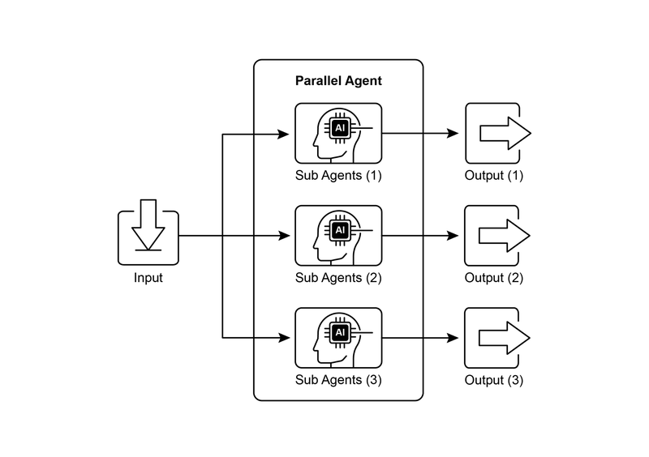
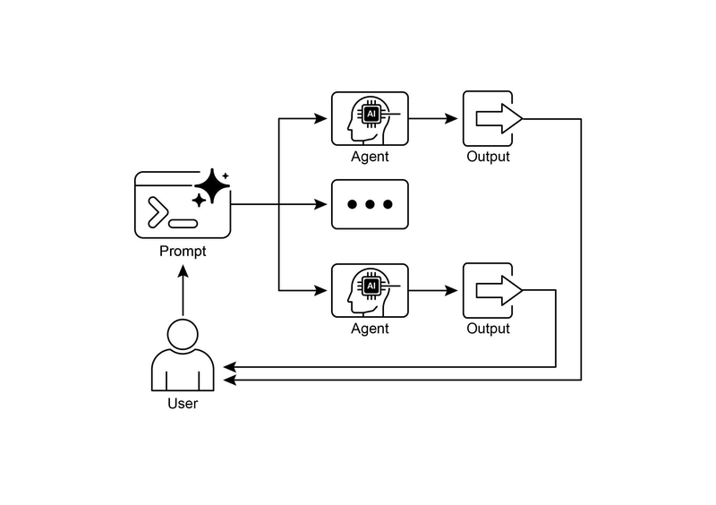
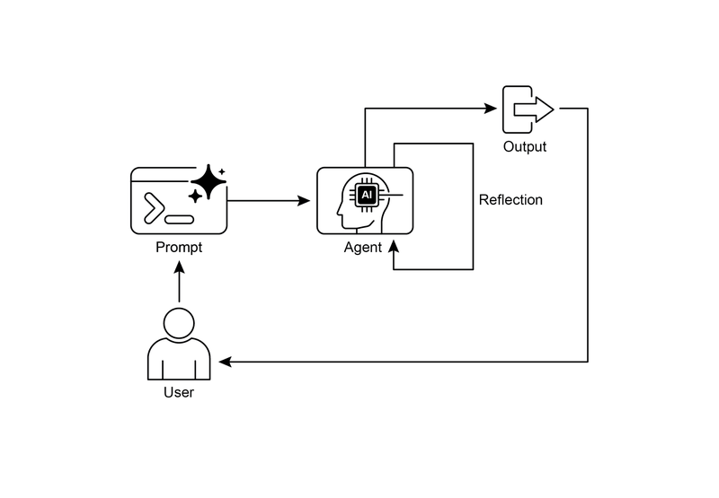
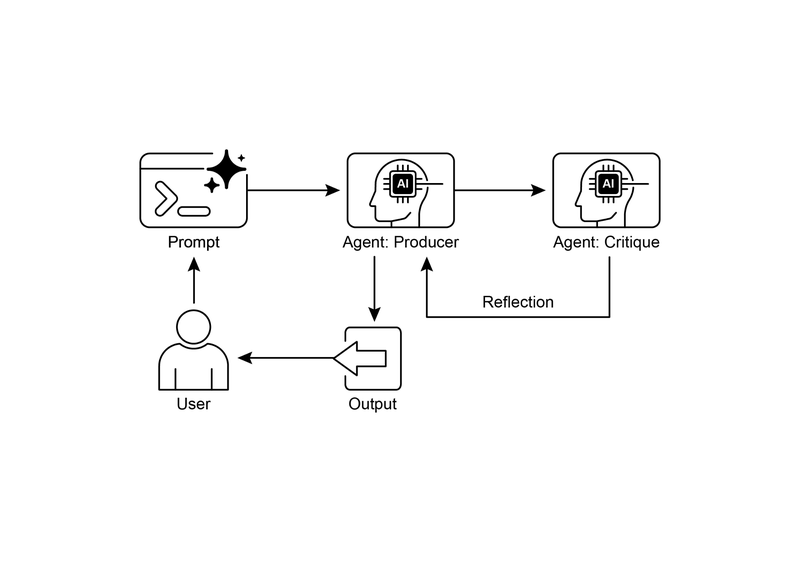

# 模块 02：并行化与反思

> 对应 PDF 第 50-77 页（Chapter 3: Parallelization + Chapter 4: Reflection）

---

## 概念地图

- **核心概念**（必须内化）：Parallelization 模式（展开）、Reflection 模式（收敛）、Producer-Critic 双角色架构
- **实操要点**（动手时需要）：RunnableParallel 并行构建、反思循环的停止条件设计、asyncio 并发 vs 真正并行
- **背景知识**（扩展理解）：Reflection 与 Goal Setting/Memory 的协同关系、反思的成本-质量权衡

---

## 概念讲解

### 1. Parallelization（并行化）

**模式名称与一句话定义**：Parallelization（并行化模式）——识别工作流中互不依赖的子任务，让它们同时执行而非排队等待，大幅缩短总耗时。

**解决什么问题**：

纯顺序执行（Chaining）在遇到多个独立任务时效率低下。假设你要调用 3 个 API，每个需要 2 秒：
- **顺序执行**：2 + 2 + 2 = 6 秒
- **并行执行**：max(2, 2, 2) = 2 秒

当任务涉及大量外部 I/O（API 调用、数据库查询、网络搜索）时，顺序执行的延迟会成为严重瓶颈。

**直觉建立**：

想象你在组织一场**公司年会**，需要完成三件互不相关的事：

1. 定场地（打电话给酒店）
2. 订餐饮（联系餐饮公司）
3. 做邀请函（让设计师设计）

**顺序做法**：你一个人先打完酒店电话，等酒店回复后，再打餐饮电话，等回复后，再找设计师。——一个人串行处理，总共需要 3 天。

**并行做法**：你同时安排三个同事，一个定场地、一个订餐饮、一个做邀请函，三件事同时推进。——并行处理，1 天就搞定。

三件事做完后，你（汇总节点）把所有结果整合成一份完整的年会方案。

> **类比边界**：现实中三个人是真正的并行（三个 CPU），但 Python 的 asyncio 是"协程并发"——实际上只有一个线程，只是在等待 I/O 时切换任务。效果类似但机制不同。

**工作原理**：

```
                    ┌→ [任务 A: 搜索新闻] ──┐
用户输入 → [分发] ──┼→ [任务 B: 查股价]  ──┼→ [汇总] → 最终输出
                    └→ [任务 C: 查社交媒体] ─┘
```

关键步骤：
1. **识别独立任务**：哪些子任务之间没有数据依赖？
2. **并行执行**：使用框架提供的并行原语同时启动这些任务
3. **等待汇合**：所有并行任务完成后，在汇合点收集结果
4. **综合处理**：对并行结果做最终的综合/合并处理（通常是顺序的）

**代码示例**（LangChain RunnableParallel）：

```python
from langchain_core.runnables import RunnableParallel, RunnablePassthrough

# 三个独立的处理链
summarize_chain = prompt_summarize | llm | StrOutputParser()
questions_chain = prompt_questions | llm | StrOutputParser()
terms_chain = prompt_terms | llm | StrOutputParser()

# 并行执行 + 原始输入透传
map_chain = RunnableParallel({
    "summary": summarize_chain,
    "questions": questions_chain,
    "key_terms": terms_chain,
    "topic": RunnablePassthrough(),  # 透传原始输入
})

# 汇总：并行结果 → 综合 prompt → 最终输出
full_chain = map_chain | synthesis_prompt | llm | StrOutputParser()

# 异步执行
result = await full_chain.ainvoke("The history of space exploration")
```

> `RunnableParallel` 是 LangChain 中实现并行的核心构建块。它接收一个字典，字典的每个值是一个独立的 Runnable，LCEL 运行时会并发执行它们。注意使用 `ainvoke`（异步调用）来真正利用并发优势。

**Google ADK 中的并行化**：

```python
from google.adk.agents import LlmAgent, ParallelAgent, SequentialAgent

# 三个独立的研究员 Agent
researcher_1 = LlmAgent(name="EnergyResearcher", ..., output_key="energy_result")
researcher_2 = LlmAgent(name="EVResearcher", ..., output_key="ev_result")
researcher_3 = LlmAgent(name="CarbonResearcher", ..., output_key="carbon_result")

# ParallelAgent: 并行执行三个研究员
parallel_research = ParallelAgent(
    name="ParallelResearch",
    sub_agents=[researcher_1, researcher_2, researcher_3]
)

# 汇总 Agent: 读取并行结果，综合成报告
merger = LlmAgent(name="SynthesisAgent", ...)

# 整体流水线：先并行，再顺序汇总
pipeline = SequentialAgent(
    name="Pipeline",
    sub_agents=[parallel_research, merger]
)
```

> ADK 提供了显式的 `ParallelAgent` 和 `SequentialAgent` 原语，可以直观地组合"并行-顺序"的混合工作流。每个并行子 Agent 通过 `output_key` 把结果写入共享状态，后续 Agent 从状态中读取。

**适用场景 vs 不适用场景**：

| 适用 | 不适用 |
|------|--------|
| 多个独立的 API/数据库调用 | 任务之间有数据依赖（需要 Chaining）|
| 同一输入需要多角度分析 | 只有一个处理步骤 |
| 生成多个候选方案后选优 | 资源受限（API 速率限制等）|
| 多模态并行处理（文本+图像+音频）| 调试阶段（并行让 debug 更难）|

> **常见误用**：忽略了并行化引入的复杂性成本。并行架构在设计、调试和日志记录方面的复杂度远高于顺序执行。如果任务本身只需要 2-3 步且延迟可接受，不要为了"看起来高级"而引入并行化。



> **图说**：Parallelization 模式示例——多个子 Agent 并行执行独立的研究任务，完成后汇总结果。



> **图说**：Parallelization 设计模式的抽象视图——独立任务从同一节点分发，并行执行后在汇合点收敛。

---

### 2. Reflection（反思）

**模式名称与一句话定义**：Reflection（反思模式）——Agent 对自己的输出进行评估，利用评估结果迭代改进，直到达到质量标准。

**解决什么问题**：

即使用了 Chaining、Routing、Parallelization 这些模式，Agent 的**首次输出往往不是最优的**。它可能：
- 有事实错误
- 遗漏了重要信息
- 不符合格式要求
- 逻辑不够严谨

没有 Reflection，首次输出就是最终输出——无论好坏。这在对质量要求高的场景（代码生成、正式文档、重要决策）中是不可接受的。

**直觉建立**：

想象你在写一篇**重要的述职报告**：

1. **初稿**：你花 1 小时写完，大致框架有了，但措辞可能不够精准，数据可能有遗漏
2. **自我审查**：你放下来，过一会儿重新读一遍——发现第二段逻辑不通，第三段数据引用错了
3. **修改**：根据审查结果修改初稿
4. **再审查**：再读一遍——这次好多了，但开头太啰嗦
5. **最终修改**：精简开头，完成

这就是 Reflection 循环：**写 → 审 → 改 → 审 → 改**，直到满意为止。

但人类自己审自己往往有盲区——所以更好的做法是**找同事帮忙审阅**。这就是 Producer-Critic 模式。

> **类比边界**：人类审阅有"新鲜的眼光"——隔天再看会发现新问题。LLM 没有这种时间维度的"新鲜感"，所以用不同的系统提示（角色）来模拟。

**工作原理**：

```
            ┌──────────────────────────────────┐
            │          反思循环                 │
            ↓                                  │
[初始输入] → [Producer: 生成输出] → [Critic: 评估输出] → 达标？
                                                          │
                                              是 → [输出最终结果]
                                              否 → [反馈给 Producer] ↗
```

**四步流程**：

| 步骤 | 做什么 | 关键决策 |
|------|--------|---------|
| 1. 执行 | Producer 完成任务，生成初始输出 | - |
| 2. 评估 | Critic 按标准审查输出（准确性、完整性、风格等）| 评估标准怎么定？ |
| 3. 反思 | 根据评估结果决定如何改进 | 改多少？改哪里？ |
| 4. 迭代 | Producer 根据反馈生成改进版，回到步骤 2 | 什么时候停？（停止条件）|

**Producer-Critic 双角色架构**：

这是 Reflection 最强大的实现方式——把"生成"和"审查"分离为两个独立角色：

| 角色 | 职责 | 关键设计 |
|------|------|---------|
| **Producer** | 专注于生成内容 | 只管"把活干好"，不分心审查 |
| **Critic** | 专注于审查评估 | 用不同的人设（如"资深工程师"），防止"自我审查的认知偏差" |

分离的好处：Critic 用"新鲜的眼光"看 Producer 的输出，能发现 Producer 自己看不到的问题。

**代码示例**（LangChain Reflection Loop）：

```python
def run_reflection_loop():
    task_prompt = "Create a Python function named `calculate_factorial`..."
    max_iterations = 3
    message_history = [HumanMessage(content=task_prompt)]

    for i in range(max_iterations):
        # 1. GENERATE / REFINE
        if i == 0:
            response = llm.invoke(message_history)  # 首次生成
        else:
            message_history.append(HumanMessage(content="Please refine using the critiques."))
            response = llm.invoke(message_history)  # 根据反馈改进

        current_code = response.content
        message_history.append(response)

        # 2. REFLECT (Critic 角色)
        reflector_prompt = [
            SystemMessage(content="""You are a senior software engineer.
            Critically evaluate the code. If perfect, respond 'CODE_IS_PERFECT'.
            Otherwise, provide a bulleted list of critiques."""),
            HumanMessage(content=f"Code to Review:\n{current_code}")
        ]
        critique = llm.invoke(reflector_prompt).content

        # 3. STOPPING CONDITION
        if "CODE_IS_PERFECT" in critique:
            break

        message_history.append(HumanMessage(content=f"Critique:\n{critique}"))

    return current_code
```

> 关键设计点：①用 `SystemMessage` 给 Critic 设定"资深工程师"角色；②用 `message_history` 积累上下文让 Producer 知道之前的反馈；③`CODE_IS_PERFECT` 作为停止条件，避免无限循环。

> **框架选型提示**：完整的迭代反思（多轮 Producer-Critic 循环）通常需要**有状态的工作流框架**如 LangGraph 来管理循环和状态；如果只需要单步"生成→审查→修正"，用 LangChain LCEL 的线性管道即可。**Google ADK** 则通过 SequentialAgent 实现反思——将一个 Agent 的输出传递给另一个 Agent 做审查，用 LoopAgent 包装来驱动迭代，无需手动管理循环状态。

**适用场景 vs 不适用场景**：

| 适用 | 不适用 |
|------|--------|
| 代码生成与调试 | 对延迟敏感的实时应用 |
| 需要高质量的长文本写作 | 简单的信息查询 |
| 复杂规划和策略制定 | 预算有限（每次迭代都是一次 LLM 调用）|
| 需要事实核查的内容 | 输出质量要求不高的场景 |

> **常见误用**：
> 1. **没有明确的停止条件**：Critic 总能找到"可以改进的地方"，导致无限循环。必须设定 max_iterations 或"足够好"的判定标准。
> 2. **上下文爆炸**：每次迭代都把完整历史传给 LLM，几轮后可能超出上下文窗口。需要策略性地压缩历史。
> 3. **过度反思**：对简单任务也用 3 轮反思，浪费时间和 token。只有对质量要求高的核心输出才值得反思。



> **图说**：Reflection 自我反思模式——Agent 生成输出后自我评估，发现问题则迭代改进。



> **图说**：Producer-Critic 模式——将生成和审查分离为两个独立角色，Producer 负责生成，Critic 负责评估并提供结构化反馈。

---

### 3. Parallelization 与 Reflection 的互补关系

**定义**：Parallelization 是"展开"（一个任务同时启动多个分支），Reflection 是"收敛"（对一个输出反复打磨直到满意）。两者分别解决效率和质量的问题，常在同一系统中组合使用。

**核心思想**：高性能的 Agent 系统不是只用一种模式，而是混合使用——并行收集信息（效率），然后对综合结果反复打磨（质量）。

**组合模式示例**：

```
                    ┌→ [研究员 A: 搜索论文] ──┐
用户查询 → [分发] ──┼→ [研究员 B: 搜索新闻] ──┼→ [汇总Agent] → [Critic审查]
                    └→ [研究员 C: 查数据库]  ──┘       ↑              │
                                                      └── 改进反馈 ──┘
         ~~~~~~~~~~~~ 并行化阶段 ~~~~~~~~~~~~    ~~~~~ 反思阶段 ~~~~~~
```

**对比表格**：

| 维度 | Parallelization | Reflection |
|------|----------------|------------|
| 方向 | 展开（一个 → 多个）| 收敛（多次 → 一个最优）|
| 优化目标 | **效率**（缩短总时间）| **质量**（提升输出品质）|
| 执行模式 | 多个任务同时进行 | 同一任务反复迭代 |
| 成本模型 | 一次并行调用（固定成本）| 每轮迭代额外一次调用（可变成本）|
| 复杂性来源 | 并发管理、状态汇合 | 停止条件设计、上下文膨胀 |
| 典型搭配 | 信息收集、多角度分析 | 内容生成、代码编写、规划 |

---

### 4. Reflection 的权衡：成本 vs 质量

**定义**：Reflection 不是免费的午餐——每一轮迭代都意味着额外的 LLM 调用（成本和延迟）以及更长的上下文历史（内存压力）。

**关键权衡**：

| 因素 | 增加反思轮次的好处 | 增加反思轮次的代价 |
|------|------------------|------------------|
| **质量** | 输出更精确、更完整 | 边际收益递减（第 3 轮改进通常比第 1 轮小得多）|
| **成本** | - | 每轮 = Producer + Critic 两次 LLM 调用 |
| **延迟** | - | 每轮增加 2-5 秒（取决于模型和输出长度）|
| **上下文** | - | 历史越长，越容易超出上下文窗口或触发 API 限流 |

**实用建议**：
- 简单任务：0 轮反思（直接输出）
- 中等任务：1 轮反思（生成 → 审查 → 修改）
- 高质量任务：2-3 轮反思（设定 max_iterations = 3）
- 永远不要超过 5 轮——如果 5 轮还不满意，问题通常出在 prompt 设计，而不是需要更多反思

---

## Parallelization 的七大应用场景

| # | 场景 | 并行的任务 | 核心收益 |
|---|------|-----------|---------|
| 1 | **信息收集与研究** | 同时搜索新闻、股价、社交媒体、公司数据库 | 全景信息，速度快 |
| 2 | **数据处理与分析** | 对同一批数据同时做情感分析、关键词提取、分类、紧急度判断 | 多维分析一次完成 |
| 3 | **多 API 交互** | 同时查机票、酒店、活动、餐厅 | 完整方案一次出 |
| 4 | **多组件内容生成** | 同时生成标题、正文、图片、CTA 按钮文案 | 组装效率高 |
| 5 | **验证与校验** | 同时检查邮箱格式、电话号码、地址、敏感词 | 实时反馈 |
| 6 | **多模态处理** | 同时分析文本情感 + 图片内容识别 | 跨模态整合 |
| 7 | **A/B 测试 / 多选项生成** | 同时用不同 prompt 生成 3 个标题候选 | 快速比较选优 |

---

## 模式关联

| 关系类型 | 相关模式 | 说明 |
|----------|---------|------|
| **互补** | Prompt Chaining（Module 01）| Chaining 处理有依赖的步骤，Parallelization 处理无依赖的步骤；实际系统常混合使用 |
| **互补** | Parallelization ↔ Reflection | 并行收集信息（效率），反思打磨输出（质量），两者解决不同维度的问题 |
| **前置** | Memory（Module 05）| Reflection 效果在有对话记忆时大幅增强——Critic 可以参考历史反馈避免重复错误 |
| **前置** | Goal Setting（Module 07）| 目标为 Reflection 的评估提供基准——"离目标还差多远"是最好的反思标准 |
| **替代** | Human-in-the-Loop（Module 08）| 如果自动反思不够靠谱，可以让人类充当 Critic 角色 |

---

## 重点标记

1. **并行化 ≠ 总是更好**：引入并行化的复杂性成本（调试难度、日志管理、错误处理）必须权衡
2. **asyncio 是并发，不是并行**：Python 的 GIL 限制了真正的多线程并行，asyncio 只是在 I/O 等待时切换任务
3. **Producer-Critic 是 Reflection 最有效的实现**：分离生成和审查角色，防止"自我审查的认知偏差"
4. **停止条件是 Reflection 的安全阀**：没有 max_iterations 或"足够好"的判定，反思循环可能永不停止
5. **展开 + 收敛 = 高性能 Agent**：并行收集信息 + 反思打磨输出，是构建高效高质量系统的经典组合

---

## 自测：你真的理解了吗？

**Q1**：你在建一个"竞品分析"Agent，需要从 5 个不同的数据源收集信息，然后生成一份分析报告。请画出这个工作流，标注哪些步骤用 Parallelization，哪些用 Chaining，报告生成阶段是否需要 Reflection？

**Q2**：Producer-Critic 模式中，如果 Producer 和 Critic 用的是同一个模型（比如都是 GPT-4o），Critic 真的能发现 Producer 看不到的问题吗？这种"伪分离"有什么局限性？怎么缓解？

**Q3**：一个代码生成 Agent 的 Reflection 循环在第 5 轮仍然没有通过 Critic 的审查。这通常意味着什么？你会怎么处理？

**Q4**：你的系统同时用了 Parallelization 和 Reflection。某天一个并行分支的 API 调用超时了，导致汇合点收不到完整结果。这个错误会怎样影响后续的 Reflection 环节？你会怎么设计容错机制？

**Q5**：原书提到"并行化引入的复杂性成本"。请具体列出至少 3 种因并行化带来的调试/运维挑战，以及对应的缓解措施。
