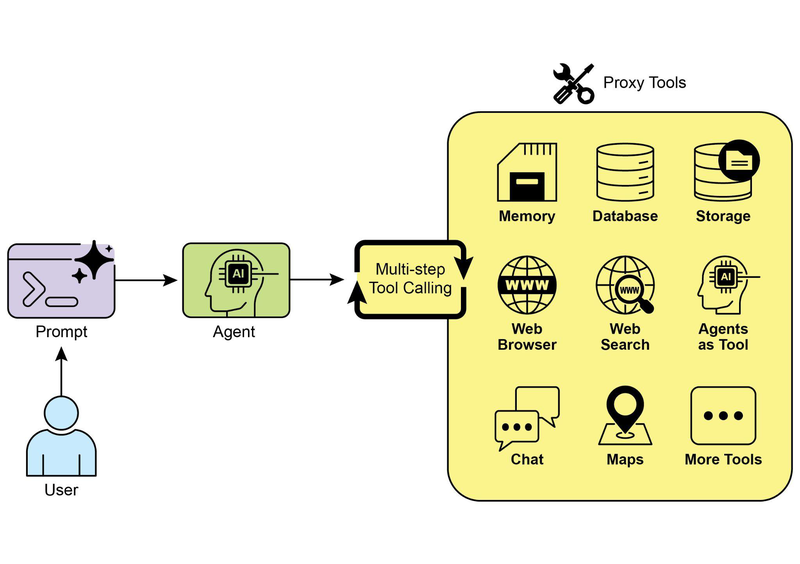

# 模块 03：工具使用

> 对应 PDF 第 79-99 页（Chapter 5: Tool Use / Function Calling）

---

## 概念地图

- **核心概念**（必须内化）：Tool Use 模式的六步生命周期、Function Calling 的结构化调用机制
- **实操要点**（动手时需要）：LangChain @tool 装饰器 + AgentExecutor、CrewAI 工具定义、Google ADK 内置工具（Google Search / Code Execution / Vertex Search）
- **背景知识**（扩展理解）：Tool Calling vs Function Calling 的概念区分、Vertex AI Extensions 的企业级安全保障

---

## 概念讲解

### 1. Tool Use（工具使用 / Function Calling）

**模式名称与一句话定义**：Tool Use（工具使用模式）——让 Agent 能够调用外部 API、数据库、代码解释器等工具，突破 LLM 训练数据的局限，在真实世界中"感知、推理和行动"。

**解决什么问题**：

LLM 的根本局限在于它是一个**封闭系统**：
- **知识是静态的**：训练数据有截止日期，不知道今天的天气、实时股价
- **不能执行动作**：不能发邮件、不能查数据库、不能控制设备
- **计算不精确**：让 LLM 算 `37 × 849` 可能算错，但调用计算器一定对
- **没有私有数据**：不知道你的公司数据、个人日程、订单信息

没有工具调用的 LLM，就像一个**知识渊博但被关在房间里的专家**——他能回答很多知识性问题，但不能帮你查账、打电话或上网搜索。

**直觉建立**：

想象你是一个**公司的管理者**。你自己很聪明（LLM 的推理能力），但你一个人能做的事有限。Tool Use 就是给你配了一个**工具箱和一群助手**：

- 需要查数据？→ 打电话给数据部门（**数据库查询工具**）
- 需要算账？→ 拿出计算器（**代码执行工具**）
- 需要了解外面的情况？→ 打开新闻网站（**搜索工具**）
- 需要通知别人？→ 发一封邮件（**通信工具**）

关键点：**你决定什么时候用哪个工具**（LLM 决策），但**工具自己完成具体操作**（框架执行）。你不需要自己会算数学题，你只需要知道"这种情况应该用计算器"。

> **类比边界**：管理者可以自己选择不用助手独立完成任务，但 LLM 实际上是被框架"强制"通过工具来获取外部信息——它没有独立获取实时信息的能力。

**工作原理（六步生命周期）**：

```
用户请求 → [1.工具定义] → [2.LLM决策] → [3.生成调用] → [4.工具执行] → [5.返回结果] → [6.LLM处理]
```

| 步骤 | 做什么 | 关键细节 |
|------|--------|---------|
| **1. Tool Definition** | 向 LLM 描述可用工具 | 包括名称、用途、参数及其类型——描述的质量直接影响 LLM 能否正确使用 |
| **2. LLM Decision** | LLM 判断是否需要调用工具 | 基于用户请求和可用工具列表做出判断 |
| **3. Function Call Generation** | LLM 生成结构化调用请求 | 输出 JSON 格式：工具名 + 参数值（从用户请求中提取）|
| **4. Tool Execution** | 框架执行实际的函数调用 | LLM 不执行工具——这是框架/编排层的职责 |
| **5. Observation/Result** | 工具执行结果返回给 Agent | 结果可能是数据、状态码或错误信息 |
| **6. LLM Processing** | LLM 利用工具结果生成最终回复 | 可能直接回答用户，也可能决定再调另一个工具 |

> **关键洞察**：LLM 不是"调用"工具——它只是**生成一个调用请求**（JSON 格式）。真正的执行发生在框架层。这种分离很重要：LLM 负责"决策"，框架负责"执行"。

**"Tool Calling" vs "Function Calling"**：

原书指出这两个术语的微妙区别：

| 概念 | 范围 | 示例 |
|------|------|------|
| **Function Calling** | 调用预定义的代码函数 | 调用 `get_weather("London")` |
| **Tool Calling** | 更广义——包括函数、API、数据库、甚至其他 Agent | 调用搜索引擎、委托给分析师 Agent、查询数据库 |

思维方式从 "Function Calling" 升级到 "Tool Calling"，能更好地理解 Agent 作为**多种数字资源和智能体的编排者**的角色。



> **图说**：Agent 使用工具的多种场景——从搜索引擎、API 调用到代码执行和设备控制，Tool Use 是 Agent 连接外部世界的桥梁。

---

### 2. 三大框架的工具实现对比

#### LangChain：@tool 装饰器 + AgentExecutor

```python
from langchain_core.tools import tool as langchain_tool
from langchain.agents import create_tool_calling_agent, AgentExecutor

# 定义工具：用 @tool 装饰器 + docstring 作为工具描述
@langchain_tool
def search_information(query: str) -> str:
    """Provides factual information on a given topic.
    Use this tool to find answers to queries like 'capital of France'."""
    simulated_results = {
        "capital of france": "The capital of France is Paris.",
        "weather in london": "Currently cloudy, 15°C.",
    }
    return simulated_results.get(query.lower(), f"No info found for '{query}'")

# 创建 Agent
agent_prompt = ChatPromptTemplate.from_messages([
    ("system", "You are a helpful assistant."),
    ("human", "{input}"),
    ("placeholder", "{agent_scratchpad}"),  # Agent 内部推理的"草稿纸"
])
agent = create_tool_calling_agent(llm, [search_information], agent_prompt)
agent_executor = AgentExecutor(agent=agent, tools=[search_information], verbose=True)

# 执行
response = await agent_executor.ainvoke({"input": "What is the capital of France?"})
```

> **核心要点**：
> - `@langchain_tool` 装饰器自动把函数转为工具，**docstring 就是工具描述**——写得越清晰，LLM 越能正确调用
> - `agent_scratchpad` 是 Agent 的"内部草稿纸"，记录中间推理步骤
> - `AgentExecutor` 负责执行循环：LLM 决策 → 调用工具 → 返回结果 → LLM 继续推理

#### CrewAI：角色驱动的工具使用

```python
from crewai import Agent, Task, Crew
from crewai.tools import tool

@tool("Stock Price Lookup Tool")
def get_stock_price(ticker: str) -> float:
    """Fetches the latest simulated stock price for a given ticker symbol."""
    prices = {"AAPL": 178.15, "GOOGL": 1750.30, "MSFT": 425.50}
    price = prices.get(ticker.upper())
    if price is not None:
        return price
    raise ValueError(f"Ticker '{ticker.upper()}' not found.")

# Agent 有角色(role)、目标(goal)和背景故事(backstory)
financial_analyst = Agent(
    role='Senior Financial Analyst',
    goal='Analyze stock data using provided tools.',
    backstory="Experienced analyst adept at using data sources.",
    tools=[get_stock_price],
)

# Task 明确指定使用哪个工具、如何处理错误
task = Task(
    description="Find the stock price for AAPL using the tool.",
    expected_output="A sentence stating the price.",
    agent=financial_analyst,
)

crew = Crew(agents=[financial_analyst], tasks=[task])
result = crew.kickoff()
```

> **CrewAI 的独特之处**：Agent 有"人设"（role + backstory），工具调用融入角色扮演——像一个真实的分析师在使用金融数据终端。

#### Google ADK：内置工具生态

ADK 提供三类开箱即用的工具：

| 工具 | 用途 | 示例 |
|------|------|------|
| **google_search** | 调用 Google 搜索引擎 | 查最新新闻、实时信息 |
| **BuiltInCodeExecutor** | 沙盒 Python 代码执行 | 精确计算、数据处理 |
| **VSearchAgent** | 查询 Vertex AI Search 数据仓库 | 企业内部知识搜索 |

```python
from google.adk.agents import LlmAgent
from google.adk.code_executors import BuiltInCodeExecutor

# 代码执行 Agent
code_agent = LlmAgent(
    name="calculator_agent",
    model="gemini-2.0-flash",
    code_executor=BuiltInCodeExecutor(),  # 内置沙盒环境
    instruction="When given math, write and execute Python code to calculate.",
)
```

> **ADK vs LangChain 的工具执行差异**：
> - LangChain：LLM 生成函数调用 → 框架执行 → 结果返回（你控制执行）
> - ADK（Vertex Extensions）：框架自动执行调用（更像"托管服务"）
> - 差异核心：**控制权和安全性的权衡**——ADK Extensions 提供更强的企业级安全保障

---

### 3. 工具定义的质量决定一切

**定义**：工具描述（tool description）的质量直接决定 LLM 能否正确识别何时使用工具、传入什么参数。

**核心思想**：你不是在"编程"——你是在**用自然语言写一份工具说明书**，给一个"聪明但需要指导"的助手看。

**好的工具描述 vs 差的工具描述**：

| 维度 | 差描述 | 好描述 |
|------|-------|-------|
| 用途 | "Gets data" | "Fetches the current stock price for a given ticker symbol (e.g., AAPL, GOOGL)" |
| 参数 | "query: string" | "ticker: str - The stock ticker symbol. Must be uppercase, e.g., 'AAPL'" |
| 返回值 | 不说明 | "Returns the price as a float. Raises ValueError if ticker not found." |
| 使用时机 | 不说明 | "Use this tool when the user asks about stock prices or market data." |

> **常见误用**：
> 1. **工具太多**：给 LLM 20 个工具，它经常选错。建议一次不超过 5-7 个工具，多了用 Routing 分组。
> 2. **描述模糊**：LLM 根据描述来选工具，描述不清 = 选择困难。
> 3. **没有错误处理**：工具调用可能失败（网络超时、参数错误），必须在工具函数中做好异常处理，让 LLM 知道发生了什么。

---

## 六大应用场景

| # | 场景 | 典型工具 | Agent 工作流 |
|---|------|---------|-------------|
| 1 | **实时信息检索** | 天气 API、新闻 API | 用户问天气 → LLM 判断需要工具 → 调用 API → 格式化回复 |
| 2 | **数据库/API 交互** | 库存查询、订单状态 API | 用户查订单 → 调用订单 API → 返回状态 |
| 3 | **计算与数据分析** | 计算器、Python 代码执行器 | 用户要求计算 → 调用计算工具 → 返回精确结果 |
| 4 | **通信** | 邮件 API、消息 API | "给 John 发邮件" → 调用邮件工具 |
| 5 | **代码执行** | 代码解释器（沙盒）| 用户提供代码片段 → 在沙盒中运行 → 返回结果 |
| 6 | **设备控制** | 智能家居 API、IoT 平台 | "关灯" → 调用智能家居 API |

---

## 模式关联

| 关系类型 | 相关模式 | 说明 |
|----------|---------|------|
| **互补** | Prompt Chaining（Module 01）| Chaining 的每一步都可以调用工具——Tool Use 嵌入链条中 |
| **互补** | Routing（Module 01）| Router 决定走哪条路，路上会用到不同的工具 |
| **互补** | Parallelization（Module 02）| 多个工具调用可以并行执行（如同时查天气+查机票）|
| **前置** | MCP（Module 06）| MCP 协议标准化了工具的发现和调用方式 |
| **互补** | RAG（Module 09）| RAG 的检索步骤本质上就是一种工具调用 |
| **扩展** | Multi-Agent（Module 04）| 在 Tool Calling 的广义理解下，调用另一个 Agent 也是一种"工具使用" |

---

## 重点标记

1. **LLM 决策，框架执行**：LLM 只生成调用请求（JSON），真正的执行发生在编排层
2. **工具描述 = 工具说明书**：描述的质量直接决定 LLM 的工具选择准确率
3. **Tool Calling > Function Calling**：更广义的思维——"工具"不只是函数，还可以是 API、数据库、甚至另一个 Agent
4. **工具数量要克制**：一次不超过 5-7 个工具，否则 LLM 选择困难
5. **Tool Use 是 Agent 的"手和眼"**：没有工具调用的 LLM 只是一个封闭的文本生成器，有了工具它才能感知和行动

---

## 自测：你真的理解了吗？

**Q1**：你在建一个"智能财务助手"，用户可能问实时股价、计算投资收益、查看自己的持仓记录。你需要定义哪些工具？每个工具的描述应该包含什么信息？

**Q2**：一个 Agent 配了 15 个工具，用户问"明天天气怎么样"，Agent 却调用了"发邮件"工具。这种错误最可能的原因是什么？你会怎么改进？

**Q3**：LLM 生成了一个工具调用请求，但工具执行时报了网络超时错误。Agent 应该怎么处理？如果你用的是 LangChain 的 AgentExecutor，它会自动重试吗？

**Q4**：原书提到 Vertex AI Extensions 是"自动执行"的，而 Function Calling 是"手动执行"的。在安全性方面，这两种模式各有什么优缺点？你更偏好哪种，为什么？

**Q5**：假设你要给一个客服 Agent 配工具，场景是：查订单状态、发起退款、查看物流、转接人工。这四个工具中，哪些需要特别的安全控制（比如用户确认）？为什么？
