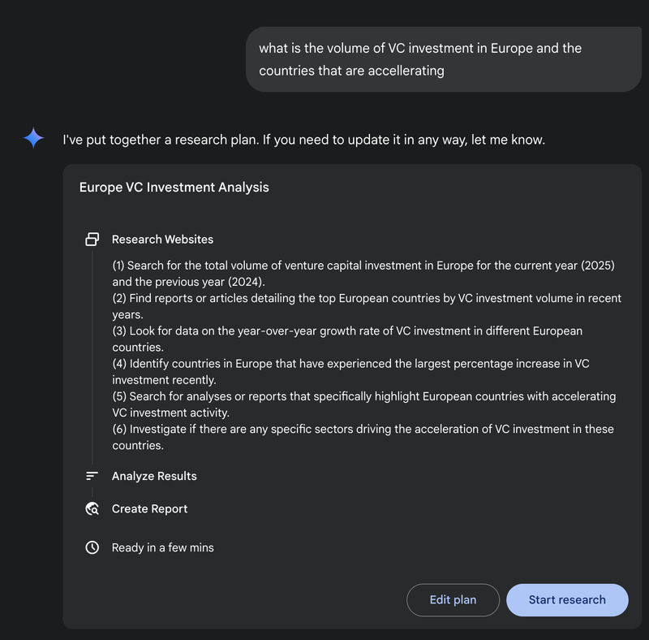
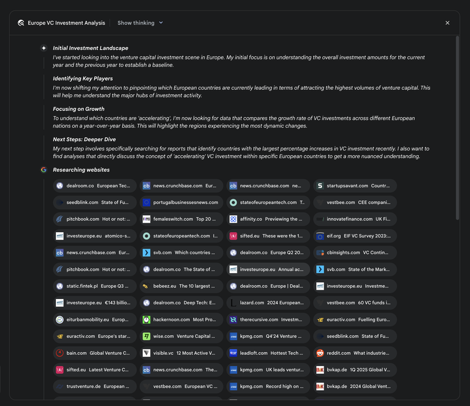
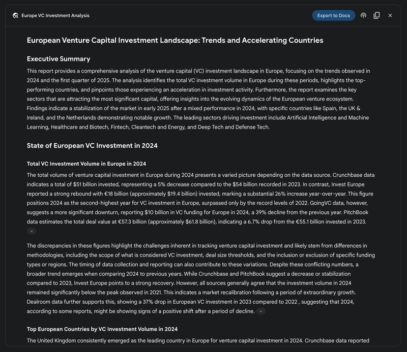
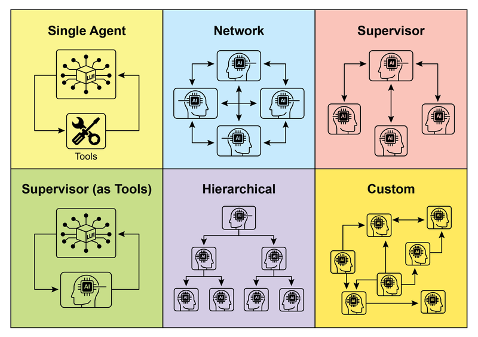
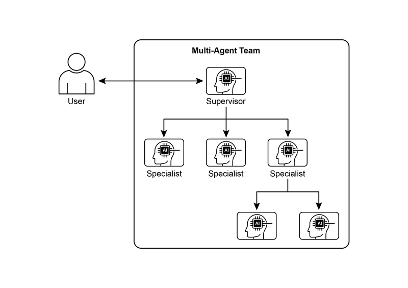

# 模块 04：规划与多智能体

> 对应 PDF 第 100-130 页（Chapter 6: Planning + Chapter 7: Multi-Agent Collaboration）

---

## 概念地图

- **核心概念**（必须内化）：Planning 模式（从"怎么做"到"自己想怎么做"）、Multi-Agent 协作（多专家分工）、六种通信拓扑结构
- **实操要点**（动手时需要）：CrewAI 的 Agent/Task/Crew 三层架构、Google ADK 的 SequentialAgent/ParallelAgent/LoopAgent 原语、Agent as Tool 模式
- **背景知识**（扩展理解）：Google DeepResearch 和 OpenAI Deep Research 的规划机制、动态规划 vs 固定工作流的权衡

---

## 概念讲解

### 1. Planning（规划）

**模式名称与一句话定义**：Planning（规划模式）——Agent 接收一个高层目标后，自主制定达成目标的多步行动方案，并在执行过程中根据新信息动态调整。

**解决什么问题**：

前面学过的模式（Chaining、Routing、Parallelization）都需要**人类预先设计工作流**——哪些步骤、什么顺序、怎么分支，都是开发者定好的。但面对真正复杂的任务（"帮我组织一场 30 人的团队 offsite"），你不可能预见所有情况和步骤。

没有 Planning，Agent 只能执行"已知的怎么做"；有了 Planning，Agent 能自主发现"怎么做"。

**直觉建立**：

想象你把一个**项目**交给两种不同的员工：

**没有 Planning 能力的员工**（传统工作流）：
> "老板，你给我的第三步说'联系餐饮公司'，但餐饮公司说那天没有档期了。我不知道该怎么办，等你指示。"

**有 Planning 能力的员工**（Planning Agent）：
> "老板，我分析了你的目标（30 人 offsite），制定了一个计划：①定场地 ②订餐饮 ③做邀请函。第一步已完成，但餐饮公司那天没档期——我已经联系了另外两家，找到一家可以的，计划调整为用 B 公司。继续推进？"

Planning Agent 的核心是**适应性**——初始计划只是起点，遇到障碍能重新规划。

> **类比边界**：现实中优秀的项目经理有丰富的行业经验和人脉，而 Planning Agent 的规划质量受限于 LLM 的推理能力。对于需要深度领域知识的规划，仍需人类把关。

**工作原理**：

```
用户目标 → [理解初始状态] → [制定计划: 步骤1→2→3→...] → [执行步骤1]
                                                              ↓
                                               成功？→ [执行步骤2] → ...
                                               失败？→ [重新规划] ↗
```

**关键决策：动态规划 vs 固定工作流**

| 维度 | 动态规划 | 固定工作流 |
|------|---------|-----------|
| "怎么做" | Agent 自己发现 | 开发者预先定义 |
| 灵活性 | 高——能处理未预见的情况 | 低——只能走预定路径 |
| 可预测性 | 低——Agent 可能走"奇怪的路" | 高——每次执行路径相同 |
| 适用场景 | 问题的解法未知或多变 | 问题的解法已知且稳定 |
| 风险 | Agent 可能做出不合理的规划 | 遇到意外就卡住 |

> **原书核心观点**：选择动态规划还是固定工作流，取决于一个问题——**"怎么做"是需要被发现的，还是已经知道的？**

**代码示例**（CrewAI Planning Agent）：

```python
from crewai import Agent, Task, Crew, Process

# Agent 同时负责"规划"和"执行"
planner_writer = Agent(
    role='Article Planner and Writer',
    goal='Plan and then write a concise summary on a specified topic.',
    backstory='Expert technical writer. Strength: create a clear plan before writing.',
)

# Task 要求先规划再执行
task = Task(
    description=(
        "1. Create a bullet-point plan for a summary on 'Reinforcement Learning'.\n"
        "2. Write the summary based on your plan, keeping it around 200 words."
    ),
    expected_output="Two sections: ### Plan (bullet points) + ### Summary (200 words)",
    agent=planner_writer,
)

crew = Crew(agents=[planner_writer], tasks=[task], process=Process.sequential)
result = crew.kickoff()
```

> 这个例子中，规划是显式嵌入 Task description 的——"先做计划，再按计划写"。更高级的场景中，Agent 可以自主决定何时需要（重新）规划。

**Google DeepResearch——规划模式的高级应用**：

Google Gemini DeepResearch 是 Planning 模式的绝佳实战案例：

1. **用户给出查询** → Agent 将其分解为多点研究计划
2. **用户审阅计划** → 可以修改研究方向（人机协作点）
3. **Agent 迭代执行** → 搜索 → 分析 → 发现知识缺口 → 调整搜索策略 → 再搜索
4. **生成结构化报告** → 带引用的多页报告



> **图说**：Google Deep Research Agent 生成执行计划，利用 Google Search 作为工具进行迭代式研究。



> **图说**：Deep Research 计划被执行的过程——Agent 使用搜索工具查询多个信息源。



> **图说**：Deep Research Agent 的最终输出——基于搜索工具收集的信息，生成结构化分析报告。

**适用场景 vs 不适用场景**：

| 适用 | 不适用 |
|------|--------|
| 复杂的多步骤任务（研究报告、项目管理）| 解法已知且固定的流程（数据格式转换）|
| 需要根据中间结果调整策略的场景 | 对可预测性要求极高的生产环境 |
| 自动化工作流编排（员工入职、竞品分析）| 简单的一步操作 |
| 机器人/自主导航（状态空间遍历、路径优化）| 无需动态调整的固定流程 |

---

### 2. Multi-Agent Collaboration（多智能体协作）

**模式名称与一句话定义**：Multi-Agent Collaboration（多智能体协作模式）——将复杂任务分解给多个专业化 Agent，各自发挥专长，通过协作完成单个 Agent 无法胜任的任务。

**解决什么问题**：

单个 Agent（即使很"聪明"）在面对多领域、多步骤的复杂任务时会遇到瓶颈：
- **认知负荷**：一个 Agent 同时负责搜索、分析、写作、审校——每个环节的质量都会打折
- **工具过载**：一个 Agent 绑定 20 个工具，选择准确率下降
- **单点失败**：Agent 在某一步犯错，整个任务失败

Multi-Agent 的核心思想：**不追求一个全能超级 Agent，而是让一群专家分工协作**。

**直觉建立**：

Multi-Agent 系统就像一个**公司组织**：

| 角色 | 对应的 Agent | 职责 |
|------|-------------|------|
| CEO | Coordinator Agent | 接收高层目标，分解任务，分配给合适的团队 |
| 市场调研部 | Research Agent | 专门负责信息收集和分析 |
| 产品部 | Design Agent | 专门负责方案设计 |
| 技术部 | Developer Agent | 专门负责技术实现 |
| 质检部 | Reviewer Agent | 专门负责审查和反馈 |

CEO 不需要自己写代码或做市场调研——他知道"这件事应该交给谁"，并确保各部门的输出能衔接起来。

> **类比边界**：真实公司中部门间的沟通是高带宽的（开会、邮件、走廊聊天），而 Agent 间的通信通常是结构化文本传递，信息密度和灵活性有限。

**六种协作形式**：

| # | 协作模式 | 描述 | 适用场景 |
|---|---------|------|---------|
| 1 | **Sequential Handoffs** | A 做完传给 B，B 做完传给 C | 有明确阶段的流水线式任务 |
| 2 | **Parallel Processing** | 多个 Agent 同时处理不同部分，最后汇总 | 信息收集、多角度分析 |
| 3 | **Debate & Consensus** | 多个 Agent 持不同视角讨论，达成共识 | 需要多角度评估的决策 |
| 4 | **Hierarchical** | 管理 Agent 指挥工人 Agent，层层下达 | 大规模复杂系统 |
| 5 | **Expert Teams** | 不同领域的专家 Agent 协作产出复杂输出 | 跨领域任务（营销=调研+文案+设计）|
| 6 | **Critic-Reviewer** | 创作 Agent 产出初稿，审查 Agent 评审反馈 | 代码生成、研究写作、合规检查 |

> **更多应用领域**：原书还提到**供应链优化**（多 Agent 协同管理库存、物流和需求预测）和**网络分析与修复**（Agent 团队分工诊断网络故障、执行修复、验证结果）。

**六种通信拓扑**：

原书详细描述了 Agent 之间的通信架构（见 Fig.2）：

| 拓扑 | 结构 | 优点 | 缺点 |
|------|------|------|------|
| **Single Agent** | 一个 Agent 独立工作 | 简单，无通信开销 | 能力受限 |
| **Network** | Agent 之间点对点通信 | 去中心化，容错好 | 通信混乱，决策难协调 |
| **Supervisor** | 一个 Supervisor 管理多个 Worker | 分工明确，易管理 | Supervisor 是单点故障和瓶颈 |
| **Supervisor as Tool** | Supervisor 提供资源/指导而非命令 | 灵活，Worker 有自主性 | 控制力较弱 |
| **Hierarchical** | 多层 Supervisor，层层管理 | 适合大规模系统 | 层级多了信息传递失真 |
| **Custom** | 混合以上模式的自定义架构 | 最灵活 | 设计复杂度最高 |



> **图说**：Agent 之间的多种通信和交互模式——从单 Agent 到网络、Supervisor、层级和自定义架构。



> **图说**：Multi-Agent 系统示例——多个专业化 Agent 协作完成复杂任务。

**代码示例**（CrewAI 多 Agent 协作）：

```python
from crewai import Agent, Task, Crew, Process

# 两个专业化 Agent
researcher = Agent(
    role='Senior Research Analyst',
    goal='Find and summarize the latest trends in AI.',
    backstory="Experienced researcher with a knack for identifying key trends.",
)

writer = Agent(
    role='Technical Content Writer',
    goal='Write a clear blog post based on research findings.',
    backstory="Skilled writer translating complex topics into accessible content.",
)

# 两个任务，有依赖关系
research_task = Task(
    description="Research top 3 AI trends in 2024-2025.",
    expected_output="Detailed summary of top 3 trends.",
    agent=researcher,
)

writing_task = Task(
    description="Write a 500-word blog post based on the research.",
    expected_output="Complete 500-word blog post.",
    agent=writer,
    context=[research_task],  # 依赖 research_task 的输出
)

crew = Crew(
    agents=[researcher, writer],
    tasks=[research_task, writing_task],
    process=Process.sequential,  # 顺序执行
)
result = crew.kickoff()
```

> 核心设计：`context=[research_task]` 声明了 writing_task 依赖 research_task 的输出——Writer Agent 会拿到 Researcher Agent 的研究结果作为输入。

**Google ADK 的三大编排原语**：

| 原语 | 用途 | 示例 |
|------|------|------|
| **SequentialAgent** | 按顺序执行子 Agent | `[Fetch → Process → Output]` |
| **ParallelAgent** | 并行执行子 Agent | `[Weather + News]` 同时获取 |
| **LoopAgent** | 循环执行直到条件满足 | `[Process → Check → 继续/停止]` |

**Agent as Tool 模式**（ADK）：

```python
from google.adk.tools import agent_tool

# 子 Agent 被包装成"工具"
image_tool = agent_tool.AgentTool(
    agent=image_generator_agent,
    description="Use this tool to generate an image from a text prompt."
)

# 父 Agent 像使用普通工具一样"调用"子 Agent
artist_agent = LlmAgent(
    name="Artist",
    instruction="Invent a creative prompt, then use ImageGen tool to generate the image.",
    tools=[image_tool]  # 子 Agent 作为工具
)
```

> **Agent as Tool** 模糊了"工具"和"Agent"的边界——一个 Agent 可以作为另一个 Agent 的"工具"被调用。这实现了灵活的层级组合。

**适用场景 vs 不适用场景**：

| 适用 | 不适用 |
|------|--------|
| 任务跨多个领域（研究+写作+设计）| 简单的单领域任务 |
| 需要多角度评估/审查 | 单步操作 |
| 想利用并行化加速 | 通信开销超过效率收益 |
| 需要模块化和可扩展的架构 | 团队小且任务简单（过度工程化）|

> **常见误用**：
> 1. **Agent 太多**：3 行代码能解决的问题，拆成 5 个 Agent 协作——引入了大量不必要的通信开销和复杂性
> 2. **角色不清**：Agent 之间职责重叠，导致重复劳动或相互矛盾
> 3. **缺少 Coordinator**：多个 Agent 各自为政，没有统一协调，最终输出不一致

---

### 3. Planning 与 Multi-Agent 的递进关系

**核心思想**：Planning 是单个 Agent 的"大脑升级"（从执行者变成策划者），Multi-Agent 是整个系统的"组织升级"（从个体变成团队）。两者自然递进：

```
Level 1: 单 Agent + 工具 → 能做简单任务
Level 2: 单 Agent + Planning → 能自主规划复杂任务
Level 3: Multi-Agent + Planning → 多个会规划的 Agent 协作完成超复杂任务
```

在实际系统中，Planning 和 Multi-Agent 经常组合使用：
- **Coordinator Agent** 负责高层规划（把大目标拆成子任务）
- **Worker Agents** 各自执行子任务（可能也有自己的规划能力）
- 执行过程中 Coordinator 根据 Worker 的反馈动态调整计划

---

## 模式关联

| 关系类型 | 相关模式 | 说明 |
|----------|---------|------|
| **互补** | Prompt Chaining（Module 01）| Multi-Agent 的 Sequential Handoff 本质上就是跨 Agent 的 Chaining |
| **互补** | Parallelization（Module 02）| Multi-Agent 的并行处理直接复用 Parallelization 模式 |
| **互补** | Reflection（Module 02）| Critic-Reviewer 协作模式就是 Reflection 的多 Agent 版本 |
| **互补** | Tool Use（Module 03）| Agent as Tool 将 Multi-Agent 和 Tool Use 统一在同一个抽象下 |
| **前置** | Routing（Module 01）| Coordinator 将任务分配给不同 Agent 的过程就是 Routing |
| **扩展** | A2A Communication（Module 10）| A2A 协议标准化了 Multi-Agent 之间的通信方式 |

---

## 重点标记

1. **Planning 的核心是适应性**：初始计划只是起点，遇到障碍要能重新规划
2. **动态规划 vs 固定工作流是一个关键架构决策**：取决于"怎么做"是否需要被发现
3. **Multi-Agent 的价值在于专业化分工**：不追求全能超级 Agent，而是让专家协作
4. **六种通信拓扑各有适用场景**：小系统用 Supervisor，大系统用 Hierarchical，灵活需求用 Custom
5. **Agent as Tool 统一了工具和 Agent 的抽象**：一个 Agent 可以像调用工具一样调用另一个 Agent

---

## 自测：你真的理解了吗？

**Q1**：你要建一个"自动化竞品分析"系统。用单 Agent + Planning 方案和 Multi-Agent 方案分别怎么设计？各有什么优劣？在什么规模下你会选择切换到 Multi-Agent？

**Q2**：原书说"When a problem's solution is already well-understood and repeatable, constraining the agent to a fixed workflow is more effective." 请举两个例子：一个适合动态规划的场景，一个应该用固定工作流的场景，并解释你的选择理由。

**Q3**：一个 Multi-Agent 系统中有 Research Agent、Writer Agent 和 Reviewer Agent。Reviewer 发现 Writer 的输出有事实错误，但这个错误其实来自 Research Agent 的搜索结果。这种"跨 Agent 的错误传播"应该怎么处理？

**Q4**：在六种通信拓扑中，Supervisor 模式有"单点故障"问题。如果 Supervisor Agent 本身出错（比如分配了错误的任务），整个系统会怎样？你能设计一种改进方案吗？

**Q5**：Google ADK 的 LoopAgent 用于"循环执行直到条件满足"。请描述一个具体场景，说明 LoopAgent 比固定次数的循环（如 `for i in range(3)`）更适合的情况，以及你会怎么设计停止条件。
