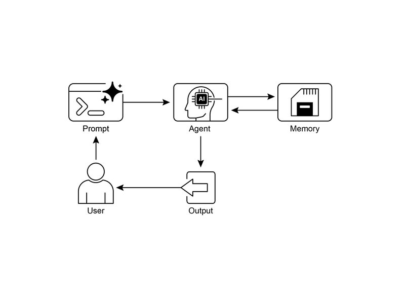
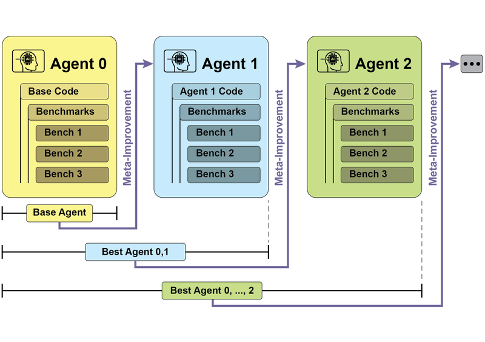
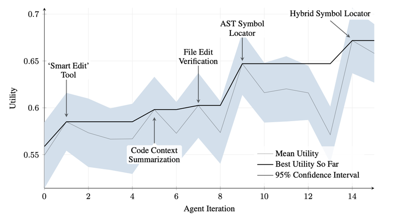
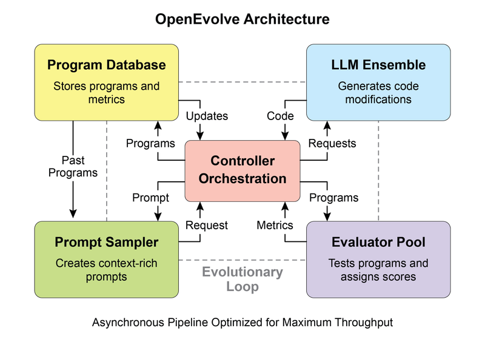
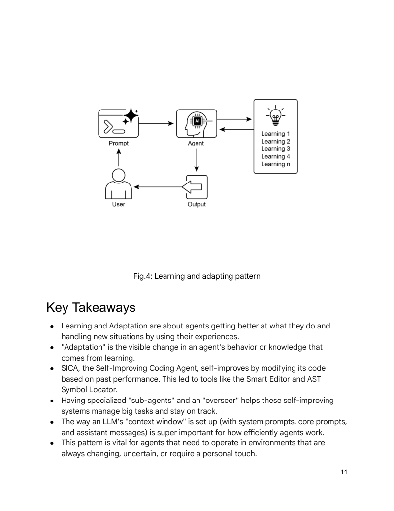

# 模块 05：记忆管理与学习适应

> 对应 PDF 第 132-166 页（Chapter 8: Memory Management + Chapter 9: Learning and Adaptation）

---

## 概念地图

- **核心概念**（必须内化）：短期记忆 vs 长期记忆的双层架构、三类长期记忆（Semantic / Episodic / Procedural）、Learning and Adaptation 的核心机制
- **实操要点**（动手时需要）：ADK 的 Session / State / MemoryService 三件套、LangChain ConversationBufferMemory + LangGraph Store、State 前缀机制（user: / app: / temp:）
- **背景知识**（扩展理解）：PPO / DPO 对齐算法原理、SICA 自改进编码智能体、AlphaEvolve / OpenEvolve 进化优化系统

---

## 概念讲解

### 1. Memory Management（记忆管理模式）

**模式名称与一句话定义**：Memory Management（记忆管理模式）——让 Agent 能够在单次对话中维持上下文、在跨对话间保留知识，从"无状态文本生成器"进化为"有记忆的智能体"。

**解决什么问题**：

没有记忆管理的 Agent 是**失忆症患者**：
- **每轮对话都是全新的**：刚告诉它"我叫张三"，下一轮它就忘了
- **无法跟踪多步任务**：不知道上一步做到哪里了
- **不能个性化**：无法记住用户偏好、历史行为
- **不能从经验中学习**：重复犯同样的错误

这就像一个每天早上醒来都失忆的员工——他可能很聪明，但每天都要从头教起。

**直觉建立**：

想象 Agent 的记忆系统是一个**办公桌 + 文件柜**的组合：

- **短期记忆（办公桌）**：当前正在处理的文件，桌面有限，只能放最近的资料。对话结束就清空桌面。这就是 LLM 的 **Context Window**。
- **长期记忆（文件柜）**：分门别类存放的档案，需要时查找取出放到桌上使用。跨对话、跨会话持久存在。这就是**外部数据库 / 向量数据库**。

关键操作：
- **存入**：对话结束后，把重要信息从"桌面"归档到"文件柜"
- **检索**：新对话开始时，根据需要从"文件柜"中调取相关档案
- **整合**：将检索到的历史信息与当前对话上下文融合

> **类比边界**：真实的文件柜是按文件名查找的（精确匹配），但 Agent 的长期记忆通常用向量数据库实现**语义搜索**——不需要知道确切的关键词，只要意思相近就能找到。

**短期记忆 vs 长期记忆对比**：

| 维度 | 短期记忆 (Short-Term) | 长期记忆 (Long-Term) |
|------|----------------------|---------------------|
| **存在位置** | LLM 的 Context Window 内 | 外部存储（数据库、向量库） |
| **生命周期** | 单次会话 | 跨会话持久 |
| **容量** | 受 Context Window 限制 | 理论上无限 |
| **访问方式** | LLM 直接访问 | 需要查询/检索后注入 |
| **类比** | 办公桌 / 工作记忆 | 文件柜 / 知识库 |
| **框架实现** | ADK Session/State、LangChain ChatMessageHistory | ADK MemoryService、LangGraph Store、Vector DB |

> **关键洞察**：长上下文窗口（如 100K tokens）只是扩大了"办公桌"，但桌面内容仍然是临时的——会话结束就清空。真正的持久记忆必须用外部存储。



> **图说**：记忆管理设计模式的整体架构——短期记忆（Session/State）处理当前对话上下文，长期记忆（MemoryService/Store）管理跨会话的持久知识。

---

### 2. 三类长期记忆

原书将长期记忆类比人类认知，分为三种类型：

| 类型 | 定义 | Agent 场景 | 实现方式 |
|------|------|-----------|---------|
| **Semantic Memory（语义记忆）** | 记住**事实和概念** | 用户偏好、领域知识、个人信息 | 持续更新的 JSON "用户画像"或事实文档集合 |
| **Episodic Memory（情景记忆）** | 记住**经历和事件** | 过去成功完成任务的步骤序列 | Few-shot 示例、历史交互记录 |
| **Procedural Memory（程序记忆）** | 记住**规则和流程** | Agent 自身的指令和行为模式 | System Prompt，可通过 Reflection 自我更新 |

> **Procedural Memory 的自我更新**：Agent 可以通过 Reflection（Module 02）审视自己的当前指令和近期交互，然后**修改自己的 System Prompt** 来适应新情况——这是 Agent "学会做事"的关键机制。

---

### 3. 框架实现：Google ADK 的三件套

ADK 用三个核心概念管理 Agent 记忆：

```
Session（会话）→ State（状态）→ MemoryService（记忆服务）
   ↑                ↑                    ↑
 聊天线程        临时便签纸          长期知识库
```

#### Session（会话 = 聊天线程）

Session 是一个独立的对话线程，包含：
- 唯一标识（id, app_name, user_id）
- 按时间排列的事件记录（Events）
- 会话级临时数据（State）

SessionService 管理 Session 的生命周期（创建、恢复、记录、删除）：

```python
# 开发测试用——内存存储，重启丢失
from google.adk.sessions import InMemorySessionService
session_service = InMemorySessionService()

# 生产用——数据库持久化
from google.adk.sessions import DatabaseSessionService
db_url = "sqlite:///./my_agent_data.db"
session_service = DatabaseSessionService(db_url=db_url)

# 云端生产——Vertex AI 托管
from google.adk.sessions import VertexAiSessionService
session_service = VertexAiSessionService(project=PROJECT_ID, location=LOCATION)
```

#### State（状态 = 会话的便签纸）

`session.state` 是一个字典，存储当前对话的动态数据（用户偏好、任务进度、条件标志等）。

**关键：前缀机制控制作用域和持久性**：

| 前缀 | 作用域 | 示例 |
|------|--------|------|
| 无前缀 | 仅当前 Session | `"task_status": "active"` |
| `user:` | 关联到用户 ID，跨所有 Session | `"user:login_count": 5` |
| `app:` | 全应用共享，所有用户可见 | `"app:version": "2.0"` |
| `temp:` | 仅当前处理轮次，不持久化 | `"temp:validation_needed": True` |

**State 更新的两种方式**：

```python
# 方式一：output_key（简单——自动保存 Agent 文本回复）
greeting_agent = LlmAgent(
    name="Greeter",
    model="gemini-2.0-flash",
    instruction="Generate a short, friendly greeting.",
    output_key="last_greeting"  # Agent 回复自动存入 state["last_greeting"]
)

# 方式二：ToolContext（灵活——在工具函数中手动更新）
def log_user_login(tool_context: ToolContext) -> dict:
    state = tool_context.state
    login_count = state.get("user:login_count", 0) + 1
    state["user:login_count"] = login_count
    state["task_status"] = "active"
    state["temp:validation_needed"] = True
    return {"status": "success", "message": f"Total logins: {login_count}."}
```

> **常见误用**：直接修改 `session.state` 字典是**强烈不推荐的**——这会绕过事件处理机制，不会被记录到事件历史中，可能导致并发问题。正确做法是通过 `output_key` 或 `EventActions.state_delta` 更新。

#### MemoryService（记忆服务 = 长期知识库）

MemoryService 管理跨会话的持久知识，核心操作：
- `add_session_to_memory(session)`：从会话中提取信息存入长期记忆
- `search_memory(query)`：根据语义查询检索相关记忆

```python
# 开发测试——内存存储
from google.adk.memory import InMemoryMemoryService
memory_service = InMemoryMemoryService()

# 生产——Vertex AI RAG 服务（语义搜索 + 持久化）
from google.adk.memory import VertexAiRagMemoryService
memory_service = VertexAiRagMemoryService(
    rag_corpus=RAG_CORPUS_RESOURCE_NAME,
    similarity_top_k=5,
    vector_distance_threshold=0.7
)
```

---

### 4. 框架实现：LangChain / LangGraph 的记忆管理

#### 短期记忆：ChatMessageHistory + ConversationBufferMemory

```python
# 手动管理对话历史
from langchain.memory import ChatMessageHistory
history = ChatMessageHistory()
history.add_user_message("I'm heading to New York next week.")
history.add_ai_message("Great! It's a fantastic city.")

# 自动注入链——ConversationBufferMemory
from langchain.memory import ConversationBufferMemory
memory = ConversationBufferMemory(memory_key="history")
memory.save_context({"input": "What's the weather like?"}, {"output": "It's sunny today."})

# 集成到 LLMChain
from langchain.chains import LLMChain
conversation = LLMChain(llm=llm, prompt=prompt, memory=memory)
response = conversation.predict(question="My name is Sam.")
response = conversation.predict(question="What was my name again?")  # 能记住！
```

> **`return_messages=True`**：与 Chat Model 搭配时，建议设置此选项——返回结构化的消息对象列表而非纯文本字符串，LLM 处理更准确。

#### 长期记忆：LangGraph InMemoryStore

LangGraph 用 Store 实现跨会话的长期记忆，组织方式是 **namespace（文件夹）+ key（文件名）**：

```python
from langgraph.store.memory import InMemoryStore

store = InMemoryStore(index={"embed": embed, "dims": 2})
namespace = ("my-user", "chitchat")

# 存入记忆
store.put(namespace, "a-memory", {
    "rules": ["User likes short, direct language", "User only speaks English & python"],
    "my-key": "my-value",
})

# 按 key 检索
item = store.get(namespace, "a-memory")

# 语义搜索 + 过滤
items = store.search(namespace, filter={"my-key": "my-value"}, query="language preferences")
```

#### Procedural Memory 自我更新（伪代码）

```python
# Agent 通过 Reflection 更新自己的指令（Procedural Memory）
def update_instructions(state: State, store: BaseStore):
    current_instructions = store.search(("instructions",))[0]
    prompt = prompt_template.format(
        instructions=current_instructions.value["instructions"],
        conversation=state["messages"]
    )
    output = llm.invoke(prompt)
    new_instructions = output['new_instructions']
    store.put(("agent_instructions",), "agent_a", {"instructions": new_instructions})
```

#### Vertex Memory Bank（托管记忆服务）

Memory Bank 是 Vertex AI Agent Engine 的托管服务，用 Gemini 模型**异步分析对话历史**，自动提取关键事实和用户偏好。支持 ADK、LangGraph 和 CrewAI 多框架集成。

```python
from google.adk.memory import VertexAiMemoryBankService
memory_service = VertexAiMemoryBankService(
    project="PROJECT_ID", location="LOCATION", agent_engine_id=agent_engine_id
)
# 自动提取会话记忆
await memory_service.add_session_to_memory(session)
```

---

### 5. Learning and Adaptation（学习与适应模式）

**模式名称与一句话定义**：Learning and Adaptation（学习与适应模式）——让 Agent 从经验中学习、从反馈中改进，从"执行指令"进化为"自我进化"。

**解决什么问题**：

即使有了完善的记忆管理，Agent 仍然是**按照固定规则运行的**。它能记住信息，但不能改变自己的行为模式。Learning and Adaptation 解决的是：
- **新情况应对**：预编程逻辑无法覆盖所有场景
- **性能退化**：环境变化后，原有策略可能不再有效
- **缺乏个性化**：不能根据用户反馈调整交互方式
- **无法自主优化**：不能从成功/失败经验中提炼更好的策略

**直觉建立**：

如果 Memory Management 是给 Agent 配了"记忆"，那 Learning and Adaptation 就是给它配了**"成长能力"**。

想象一个新入职的员工：
- **Day 1**：按照岗位手册操作（固定指令）
- **Week 1**：记住了常见问题和解决方案（记忆管理）
- **Month 1**：开始总结规律，形成自己的工作方法（学习适应）
- **Year 1**：已经能够独立处理新问题，甚至改进工作流程（自我进化）

> **类比边界**：人类学习是渐进且不可逆的，但 Agent 的"学习"可以被重置（回到初始 Prompt），也可以产生灾难性遗忘（新学习覆盖旧知识）。

**六种学习机制**：

| 机制 | 核心思想 | 适用场景 |
|------|---------|---------|
| **Reinforcement Learning** | 尝试动作 → 获得奖惩 → 学习最优行为 | 机器人控制、游戏 AI |
| **Supervised Learning** | 从标注示例中学习输入-输出映射 | 邮件分类、趋势预测 |
| **Unsupervised Learning** | 在无标注数据中发现隐藏模式 | 数据探索、聚类 |
| **Few-Shot / Zero-Shot** | 用极少示例或纯指令快速适应新任务 | LLM Agent 快速响应新指令 |
| **Online Learning** | 持续接收新数据、实时更新知识 | 实时数据流处理 |
| **Memory-Based Learning** | 回忆过去经验来调整当前行为 | 具备记忆系统的 Agent |

---

### 6. PPO 与 DPO：两种对齐方法

原书详细介绍了两种用于将 LLM 与人类偏好对齐的方法：

#### PPO（Proximal Policy Optimization）

**核心思想**：小步安全更新。

```
收集数据 → 评估"代理"目标 → 裁剪更新幅度（安全刹车）→ 稳定改进
```

PPO 的关键是**裁剪机制**（Clipping）：创建一个"信任区域"，防止策略更新偏离当前策略太远。就像一个**带安全绳的攀岩者**——可以向上爬，但安全绳限制了每次能走多远，防止坠落。

#### DPO（Direct Preference Optimization）

**核心思想**：跳过中间人，直接从人类偏好学习。

| 对比 | PPO 方式（两步） | DPO 方式（一步） |
|------|----------------|----------------|
| 第一步 | 训练一个**奖励模型**（中间人）来预测人类评分 | — |
| 第二步 | 用 PPO 让 LLM 最大化奖励模型的评分 | 直接用偏好数据优化 LLM |
| 风险 | LLM 可能"黑掉"奖励模型（得高分但回答差）| 更稳定，无中间人 |
| 复杂度 | 高（需要训练两个模型）| 低（一步到位）|

> DPO 的数学直觉：**增加被偏好回答的生成概率，降低被拒绝回答的生成概率**——不需要奖励模型做中间翻译。

---

### 7. 案例研究：SICA 自改进编码智能体

SICA（Self-Improving Coding Agent）是本章的核心案例，展示了一个 Agent 如何**修改自己的源代码**来提升性能。

**工作循环**：

```
查看历史版本档案 → 选择最优版本 → 分析改进空间 → 修改自身代码 → 测试新版本 → 记录结果 → 重复
```



> **图说**：SICA 的自改进循环——Agent 基于自身过去版本的性能表现，迭代修改代码以提升基准测试得分。

**SICA 的关键进化**：

| 阶段 | 能力 | 说明 |
|------|------|------|
| 初始 | 基础文件覆写 | 只能整体替换文件 |
| 进化 1 | Smart Editor | 上下文感知的智能编辑 |
| 进化 2 | Diff-Enhanced Smart Editor | 基于 diff 的精准修改 |
| 进化 3 | AST Symbol Locator | 用抽象语法树定位代码符号 |
| 进化 4 | Hybrid Symbol Locator | 快速搜索 + AST 验证的混合方案 |



> **图说**：SICA 在迭代过程中的性能提升曲线，每个关键改进点都标注了对应的工具/Agent 修改。

**SICA 架构要点**：
- **子 Agent 分工**：Coding Agent、Problem-solving Agent、Reasoning Agent 分解复杂任务
- **异步监督者**（Overseer）：另一个 LLM 并发监控 SICA 行为，检测循环或停滞
- **上下文窗口结构化**：System Prompt → Core Prompt → Assistant Messages，信息分层组织

---

### 8. AlphaEvolve 与 OpenEvolve

#### AlphaEvolve（Google）

**核心**：LLM + 进化算法 → 自动发现和优化算法。

- **双模型协作**：Gemini Flash（广泛生成提案）+ Gemini Pro（深度分析和精炼）
- **自动评估**：预定义标准自动打分 → 迭代改进

**实际成果**：
- 数据中心调度优化：全球计算资源减少 0.7%
- TPU 硬件设计：优化 Verilog 代码
- Gemini 架构加速：核心 kernel 速度提升 23%
- FlashAttention GPU 指令优化：提升 32.5%
- 4×4 复数矩阵乘法：发现仅需 48 次标量乘法的新算法

#### OpenEvolve（开源）

用 LLM 驱动的进化优化系统，特点：
- 可进化**整个代码文件**（不仅限于单个函数）
- 支持多种编程语言和 OpenAI 兼容 API
- 多目标优化 + 分布式评估



> **图说**：OpenEvolve 内部架构——由控制器协调程序采样器、程序数据库、评估池和 LLM 集群，驱动代码的持续进化。

```python
from openevolve import OpenEvolve

evolve = OpenEvolve(
    initial_program_path="path/to/initial_program.py",
    evaluation_file="path/to/evaluator.py",
    config_path="path/to/config.yaml"
)
best_program = await evolve.run(iterations=1000)
for name, value in best_program.metrics.items():
    print(f"  {name}: {value:.4f}")
```



> **图说**：Learning and Adaptation 设计模式的视觉总结。

---

## 六大应用场景

| # | 场景 | 关键记忆/学习类型 | 工作原理 |
|---|------|-----------------|---------|
| 1 | **对话式 AI / Chatbot** | 短期记忆 + 长期用户偏好 | 短期记忆维持对话流，长期记忆记住用户偏好和历史 |
| 2 | **多步任务 Agent** | 短期记忆 + 任务进度跟踪 | State 跟踪任务进度和中间结果 |
| 3 | **个性化推荐** | Semantic Memory（用户画像） | 长期存储用户行为和偏好，检索时个性化回复 |
| 4 | **自动交易 / 风控** | Online Learning + 策略优化 | 实时数据驱动策略调整，学习新的欺诈模式 |
| 5 | **自动驾驶 / 机器人** | 短期环境感知 + 长期路线记忆 | RL 驱动策略改进，记忆存储路线和地图 |
| 6 | **自改进编码** | Procedural Memory + Self-Modification | SICA 式迭代：测试 → 分析 → 修改自身代码 |

---

## 模式关联

| 关系类型 | 相关模式 | 说明 |
|----------|---------|------|
| **互补** | Reflection（Module 02）| Reflection 是 Procedural Memory 自我更新的核心机制——Agent 反思并修改自己的指令 |
| **前置** | Tool Use（Module 03）| 长期记忆的存取本质上就是工具调用（查询数据库、向量搜索） |
| **扩展** | RAG（Module 09）| RAG 是长期记忆的一种实现——从知识库检索信息注入上下文 |
| **互补** | Planning（Module 04）| 有记忆的 Agent 能基于历史经验做出更好的规划 |
| **前置** | Multi-Agent（Module 04）| 多 Agent 系统中每个 Agent 需要独立的记忆管理 |
| **扩展** | Guardrails（Module 13）| 学习适应机制需要安全护栏防止"学坏" |

---

## 重点标记

1. **双层记忆架构**：短期记忆（Context Window / Session）处理当前对话，长期记忆（外部存储 / MemoryService）跨会话持久
2. **三类长期记忆**：Semantic（事实）、Episodic（经历）、Procedural（规则）——Procedural 可以自我更新
3. **ADK 三件套**：Session（聊天线程）、State（临时便签）、MemoryService（长期知识库）
4. **State 前缀**：无前缀=会话级、`user:`=用户级、`app:`=应用级、`temp:`=当前轮次
5. **不要直接改 state**：必须通过 `output_key` 或 `EventActions.state_delta` 更新
6. **DPO > PPO（简洁性）**：DPO 跳过奖励模型，直接从人类偏好数据优化 LLM
7. **SICA 的启示**：Agent 可以修改自己的源代码来自我改进——编辑工具从文件覆写进化到 AST 级精准编辑
8. **多 Agent 学习的数据约束**：在多 Agent 系统中，训练数据必须准确捕获**每个参与 Agent 的完整交互轨迹**（各自的输入和输出），而非仅最终结果——否则模型无法学习到有效的协作策略

---

## 自测：你真的理解了吗？

**Q1**：你在建一个客服 Agent，用户可能在不同时间发起多轮对话。你需要：(a) 记住当前对话的上下文，(b) 记住用户上次反馈的问题和偏好。请分别说明用哪种记忆类型、在 ADK 中用什么组件实现。

**Q2**：ADK State 的四种前缀（无前缀、`user:`、`app:`、`temp:`）分别适用于什么场景？举一个"用错前缀"的例子和它的后果。

**Q3**：SICA 从"文件覆写"进化到"AST Symbol Locator"，这个进化过程反映了什么核心原则？如果你要设计一个类似的自改进系统，你会如何设置"评估标准"来引导进化方向？

**Q4**：PPO 的"裁剪机制"解决了什么问题？如果没有裁剪，训练过程会出现什么现象？用一个非技术类比解释。

**Q5**：一个 Agent 使用 LangGraph Store 存储用户偏好（Semantic Memory），但用户说"我不再喜欢辣的了"。系统应该怎么处理这个信息——追加一条新记忆还是更新已有记忆？为什么？Vertex Memory Bank 如何自动处理这种情况？
