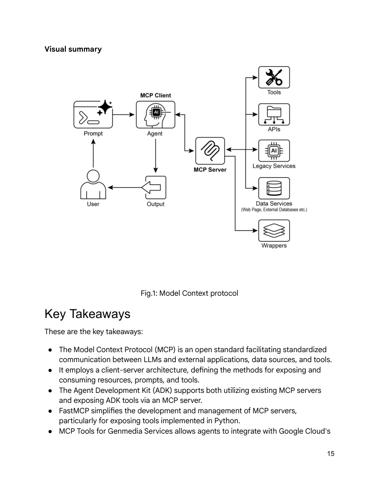

# 模块 06：MCP 协议

> 对应 PDF 第 167-182 页（Chapter 10: Model Context Protocol）

---

## 概念地图

- **核心概念**（必须内化）：MCP 的 Client-Server 架构、三大暴露元素（Resources / Prompts / Tools）、MCP vs Tool Function Calling 的本质区别
- **实操要点**（动手时需要）：ADK MCPToolset 配置（StdioServerParameters / HttpServerParameters）、FastMCP 服务端开发（@tool 装饰器）、工具过滤（tool_filter）
- **背景知识**（扩展理解）：传输机制（STDIO / Streamable HTTP / SSE）、MCP 的安全和错误处理考量、API 设计对 MCP 效果的影响

---

## 概念讲解

### 1. Model Context Protocol（MCP）

**模式名称与一句话定义**：Model Context Protocol（模型上下文协议）——一个开放标准，为 LLM 与外部系统（工具、数据源、API）之间提供**统一的通信接口**，让任意合规的 LLM 能发现和使用任意合规的工具。

**解决什么问题**：

在 Module 03 中我们学了 Tool Use——LLM 可以调用工具。但每个 LLM 提供商的工具调用方式**各不相同**（OpenAI 一套格式、Gemini 一套格式、Claude 又一套）。没有 MCP 的世界：

- **每对组合都要定制集成**：N 个 LLM × M 个工具 = N×M 种适配代码
- **工具不可复用**：为 GPT 写的工具，Claude 不能直接用
- **动态发现不可能**：LLM 只能使用预先硬编码的工具列表

这就像早期的手机充电器——每个品牌一种接口，出门要带五根线。

**直觉建立**：

MCP 就是 AI 世界的 **USB-C 标准**：

| 类比 | USB-C | MCP |
|------|-------|-----|
| **标准化** | 一个接口适配所有设备 | 一个协议连接所有 LLM 和工具 |
| **即插即用** | 插上就能用，不需要专用驱动 | 连上就能发现可用工具 |
| **双向通信** | 充电 + 数据传输 | 请求工具 + 获取资源 |
| **生态系统** | 任何厂商都可以生产兼容设备 | 任何开发者都可以创建 MCP 服务 |

更技术地说：如果 Tool Function Calling 是给 AI 一套**特定品牌的定制工具**（特定螺丝刀、特定扳手），那 MCP 就是建造了一个**标准化的电源插座系统**——它不提供工具本身，但让任何合规工具都能"插上就用"。

> **类比边界**：USB-C 的物理连接是静态的，但 MCP 支持**动态发现**——Agent 可以在运行时发现新的可用工具，不需要"重新插拔"。

---

### 2. MCP vs Tool Function Calling

这是本章最重要的区分：

| 维度 | Tool Function Calling | MCP |
|------|----------------------|-----|
| **标准化** | 私有的、厂商特定的 | 开放标准，促进互操作 |
| **范围** | 直接调用特定预定义函数 | 发现和使用广泛外部能力的框架 |
| **架构** | LLM 与工具之间的一对一交互 | Client-Server 架构，多对多连接 |
| **发现机制** | LLM 被显式告知可用工具 | 动态发现——Client 可查询 Server 的能力 |
| **复用性** | 工具与特定应用紧耦合 | 独立的 MCP Server 可被任何合规应用使用 |

**核心区别**：Function Calling 是"给你一把特定的螺丝刀"，MCP 是"给你进入五金商店的钥匙——你可以发现和使用里面所有的工具"。

**选择建议**：
- **简单应用 + 固定工具集** → 直接用 Tool Function Calling 足够
- **复杂系统 + 工具动态变化 + 多 LLM 互操作** → 用 MCP

---

### 3. MCP 架构四层模型

```
用户请求 → [LLM] → [MCP Client] → [MCP Server] → [外部服务/3P Service]
                        ↑                ↑
                   LLM 宿主应用      工具/资源网关
```

| 层 | 角色 | 类比 |
|----|------|------|
| **LLM** | 核心智能——决定何时需要外部工具 | 管理者的大脑 |
| **MCP Client** | 中间人——将 LLM 意图转化为标准请求 | 管理者的秘书 |
| **MCP Server** | 外部世界的网关——暴露工具、资源和提示 | 服务台 |
| **3P Service** | 实际执行的外部工具/API/数据源 | 实际的服务提供商 |

**MCP Server 暴露的三类元素**：

| 元素 | 定义 | 示例 |
|------|------|------|
| **Resource（资源）** | 静态数据——可被 LLM 读取的信息 | PDF 文件、数据库记录、配置文件 |
| **Tool（工具）** | 可执行函数——LLM 可以触发的动作 | 发邮件、查 API、执行代码 |
| **Prompt（提示模板）** | 交互模板——引导 LLM 如何使用资源/工具 | 查询模板、分析指令 |

**标准交互流程**（五步）：

1. **Discovery（发现）**：Client 查询 Server "你有哪些能力？" → Server 返回清单
2. **Request Formulation（请求构建）**：LLM 决定使用某个工具，构造请求
3. **Client Communication（客户端通信）**：Client 将请求发送给 Server
4. **Server Execution（服务端执行）**：Server 认证 → 验证 → 调用底层服务
5. **Response & Context Update（响应更新）**：结果返回给 LLM，更新上下文

---

### 4. MCP 设计的关键考量

原书提出了多个影响 MCP 实效的关键因素：

| 考量 | 要点 |
|------|------|
| **API 设计质量** | MCP 只是"包装"，底层 API 设计不佳则 MCP 也无力回天。如工单系统只能逐条查询，Agent 要汇总高优先级工单就会很慢 |
| **数据格式友好性** | 返回 PDF 格式对 Agent 无用——应返回 Markdown 等文本格式，Agent 才能处理 |
| **安全性** | 必须有认证（Authentication）和授权（Authorization）控制访问 |
| **错误处理** | 需定义标准化的错误响应，让 LLM 知道发生了什么并尝试替代方案 |
| **本地 vs 远程** | 本地 Server 速度快、敏感数据安全；远程 Server 可共享、可扩展 |
| **按需 vs 批处理** | 对话式 Agent 需要按需交互；数据分析 Agent 可以批处理 |
| **传输层** | 本地：JSON-RPC over STDIO；远程：Streamable HTTP + SSE |

> **关键洞察**：MCP 不会魔法般地让坏 API 变好用。**Agent 不能替代确定性工作流**——它们通常需要更强的确定性支持（如过滤、排序）才能高效工作。

---

### 5. 实战：ADK 中使用 MCP

#### 连接现有 MCP Server（文件系统示例）

```python
import os
from google.adk.agents import LlmAgent
from google.adk.tools.mcp_tool.mcp_toolset import MCPToolset, StdioServerParameters

TARGET_FOLDER_PATH = os.path.join(os.path.dirname(os.path.abspath(__file__)), "mcp_managed_files")
os.makedirs(TARGET_FOLDER_PATH, exist_ok=True)

root_agent = LlmAgent(
    model='gemini-2.0-flash',
    name='filesystem_assistant_agent',
    instruction=f'Help the user manage their files. You are operating in: {TARGET_FOLDER_PATH}',
    tools=[
        MCPToolset(
            connection_params=StdioServerParameters(
                command='npx',
                args=["-y", "@modelcontextprotocol/server-filesystem", TARGET_FOLDER_PATH],
            ),
            # 可选：过滤暴露的工具
            # tool_filter=['list_directory', 'read_file']
        )
    ],
)
```

> **三种连接方式**：
> - `npx`：Node.js 包直接运行（社区 MCP Server 常用）
> - `python3`：Python 脚本（自定义 Server）
> - `uvx`：Python 隔离环境运行（无需全局安装）

#### 用 FastMCP 创建自己的 MCP Server

```python
from fastmcp import FastMCP

mcp_server = FastMCP()

@mcp_server.tool
def greet(name: str) -> str:
    """Generates a personalized greeting.
    Args:
        name: The name of the person to greet.
    Returns:
        A greeting string.
    """
    return f"Hello, {name}! Nice to meet you."

if __name__ == "__main__":
    mcp_server.run(transport="http", host="127.0.0.1", port=8000)
```

> **FastMCP 的核心优势**：`@mcp_server.tool` 装饰器自动从函数签名、类型提示和 docstring 生成 MCP 所需的 Schema——零手动配置。FastMCP 还支持**服务器组合（Server Composition）和代理（Proxying）**——可以将多个 MCP Server 模块化组合成一个统一入口，适合复杂系统的分层架构。

> **实用部署提示**：使用 ADK 时，必须在 Agent 目录中创建 `__init__.py` 文件，否则 ADK 无法发现并加载你的 Agent 包。

#### ADK Agent 作为 MCP Client 消费 FastMCP Server

```python
from google.adk.agents import LlmAgent
from google.adk.tools.mcp_tool.mcp_toolset import MCPToolset, HttpServerParameters

root_agent = LlmAgent(
    model='gemini-2.0-flash',
    name='fastmcp_greeter_agent',
    instruction='You are a friendly assistant. Use the "greet" tool.',
    tools=[
        MCPToolset(
            connection_params=HttpServerParameters(url="http://localhost:8000"),
            tool_filter=['greet']  # 只暴露 greet 工具
        )
    ],
)
```

**部署流程**：
1. 启动 FastMCP Server：`python fastmcp_server.py`
2. 启动 ADK Web：`cd adk_agent_samples && adk web`
3. 在 Web UI 中选择 Agent → 输入 "Greet John Doe" → Agent 通过 MCP 调用 greet 工具



> **图说**：Model Context Protocol 的整体架构——LLM 通过 MCP Client 连接 MCP Server，Server 暴露 Tools / Resources / Prompts，底层对接各种外部服务。

---

## 九大应用场景

| # | 场景 | MCP 的作用 |
|---|------|-----------|
| 1 | **数据库集成** | Agent 用自然语言查询 BigQuery，生成报表 |
| 2 | **生成式媒体编排** | 集成 Imagen（图像）、Veo（视频）、Chirp（语音）、Lyria（音乐） |
| 3 | **外部 API 交互** | 天气、股价、邮件、CRM——任何 API 都可标准化接入 |
| 4 | **推理型信息提取** | 不是返回整个文档，而是精准提取回答用户问题的具体条款 |
| 5 | **自定义工具开发** | 用 FastMCP 将内部函数暴露为标准 MCP 服务 |
| 6 | **标准化 LLM-应用通信** | 降低集成成本，促进不同 LLM 提供商间的互操作 |
| 7 | **复杂工作流编排** | 查数据 → 生成图片 → 写邮件 → 发送——串联多个 MCP 服务 |
| 8 | **IoT 设备控制** | 自然语言控制智能家居、工业传感器、机器人 |
| 9 | **金融服务自动化** | 市场分析、交易执行、合规报告 |

---

## 模式关联

| 关系类型 | 相关模式 | 说明 |
|----------|---------|------|
| **标准化** | Tool Use（Module 03）| MCP 是 Tool Use 的标准化层——将各厂商私有的 Function Calling 统一为开放协议 |
| **互补** | Multi-Agent（Module 04）| 多 Agent 系统中，每个 Agent 可以通过 MCP 发现和使用不同的工具集 |
| **互补** | Routing（Module 01）| Router 可以基于 MCP 动态发现的工具列表来决定路由 |
| **互补** | Memory（Module 05）| MCP Server 可以暴露记忆存储作为 Resource，供 Agent 读取 |
| **扩展** | A2A（Module 10）| A2A 协议标准化 Agent 间通信，MCP 标准化 Agent-工具通信 |

---

## 重点标记

1. **MCP = AI 的 USB-C**：一个开放标准统一了 LLM 与外部系统的通信方式
2. **动态发现**：MCP Client 可以在运行时发现 Server 的可用工具——不需要预编码
3. **三类暴露元素**：Resource（数据）、Tool（动作）、Prompt（交互模板）
4. **MCP 不修复坏 API**：底层 API 设计质量、数据格式友好性决定了 MCP 的实际效果
5. **FastMCP 极简开发**：`@mcp_server.tool` 装饰器 + Python 类型提示 → 自动生成 Schema
6. **选型原则**：固定少量工具用 Function Calling，动态/大规模/跨系统用 MCP

---

## 自测：你真的理解了吗？

**Q1**：你的公司有 10 个内部工具（邮件、日历、CRM、工单系统等），需要让 3 种不同的 LLM（GPT、Gemini、Claude）都能调用。不用 MCP 需要写多少种适配？用 MCP 后呢？

**Q2**：一个 MCP Server 包装了一个旧的文档管理 API，返回格式是 PDF。Agent 能有效使用这个工具吗？你会怎么改进？

**Q3**：MCP 的"动态发现"能力与 Module 01 中的 Routing 模式有什么协同可能？设想一个场景，Agent 通过 MCP 发现新工具后自动调整路由策略。

**Q4**：本地 MCP Server（STDIO 传输）和远程 MCP Server（HTTP 传输）各适用于什么场景？在一个处理敏感客户数据的企业中，你会怎么选择？

**Q5**：FastMCP 的"自动 Schema 生成"依赖什么信息？如果开发者的函数没有写 docstring 和 type hint，会发生什么？这和 Module 03 中"工具描述质量决定一切"有什么关系？
