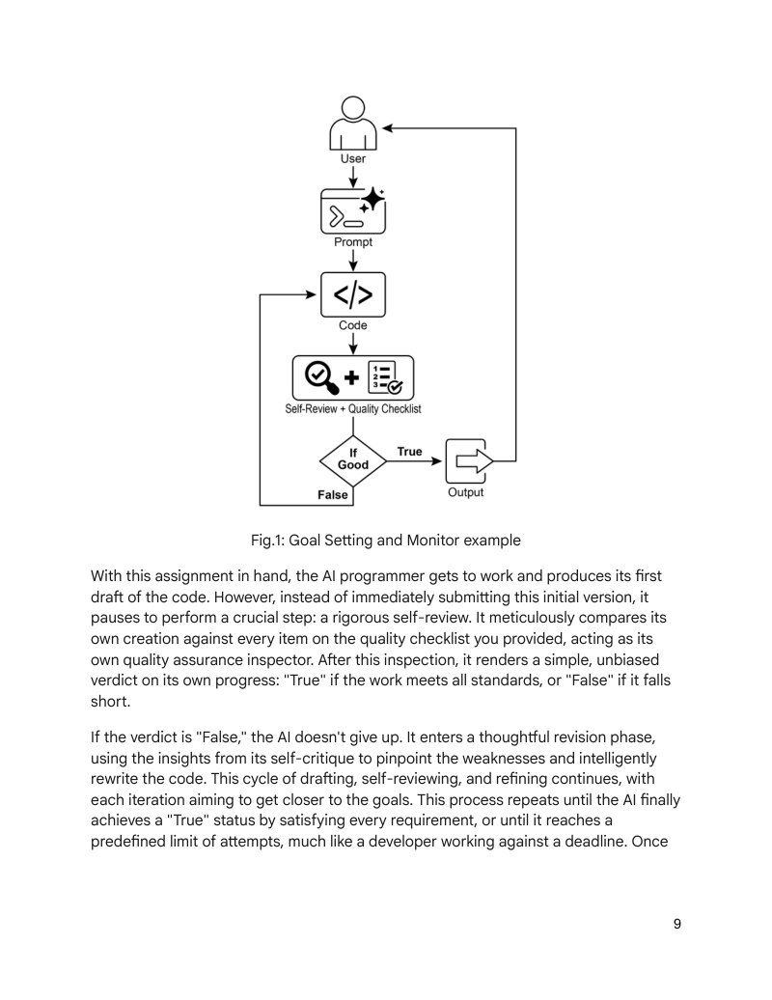
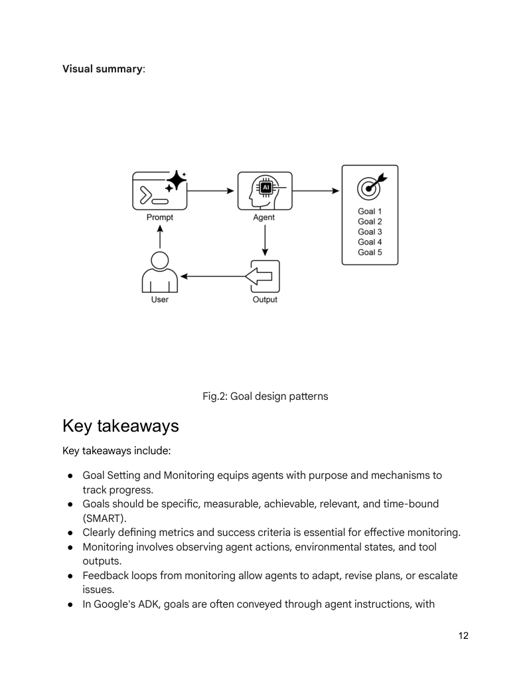

# 模块 07：目标设定与监控

> 对应 PDF 第 183-195 页（Chapter 11: Goal Setting and Monitoring）

---

## 概念地图

- **核心概念**（必须内化）：Goal Setting 与 Monitoring 的反馈循环、SMART 目标框架在 Agent 中的应用、自评估与迭代改进循环
- **实操要点**（动手时需要）：用 LLM 同时做代码生成和质量评估的迭代循环、多 Agent 分工（Programmer / Reviewer / Tester）的改进方案
- **背景知识**（扩展理解）：从"反应式"到"目标驱动"的 Agent 进化、生产级系统的注意事项

---

## 概念讲解

### 1. Goal Setting and Monitoring（目标设定与监控模式）

**模式名称与一句话定义**：Goal Setting and Monitoring（目标设定与监控模式）——给 Agent 明确的目标方向和进度追踪机制，让它从"被动响应"进化为"主动达成"。

**解决什么问题**：

前面学的 Agent 模式都是"怎么做"（Chaining、Routing、Tool Use……），但缺少一个关键问题——**"做到什么程度算完成？"**

没有目标设定的 Agent：
- **没有方向感**：只会逐步响应，不知道最终要达到什么
- **不知道何时停止**：可能无限循环，也可能提前放弃
- **无法自我评估**：做完了不知道做得好不好
- **不能自我纠偏**：走偏了也不知道

**直觉建立**：

想象你给一个实习生分配任务。如果你只说"写个程序"，他可能交给你一个勉强能跑的东西。但如果你说：

1. **明确目标**："写一个二分查找函数"
2. **质量标准**："代码简洁、功能正确、处理边界情况"
3. **检查机制**："写完后自己跑一遍测试用例"
4. **迭代改进**："如果测试不过，改完再提交"

这就是 Goal Setting and Monitoring 的四要素：**目标 → 标准 → 监控 → 反馈循环**。

> **类比边界**：人类实习生可以判断"差不多了"这种模糊标准，但 Agent 需要更精确的成功条件——否则可能陷入无限修改循环。

**SMART 目标在 Agent 中的应用**：

| SMART 维度 | 含义 | Agent 示例 |
|-----------|------|-----------|
| **Specific（具体）** | 目标明确、不含糊 | "解决客户的账单问题" 而非 "帮助客户" |
| **Measurable（可衡量）** | 有清晰的成功指标 | "账单调整已确认 + 客户满意度评分" |
| **Achievable（可实现）** | 在 Agent 能力范围内 | Agent 有数据库访问权和账单修改权限 |
| **Relevant（相关）** | 与用户需求直接关联 | 不是泛泛而谈，而是针对具体问题 |
| **Time-bound（有时限）** | 有截止条件或最大迭代次数 | "最多尝试 5 轮，超时则上报" |

---

### 2. 核心工作机制：迭代改进循环

Goal Setting and Monitoring 的核心是一个**闭环反馈循环**：

```
设定目标 → 执行任务 → 自我评估 → 达标? → [是] → 输出结果
                         ↓ [否]
                   分析差距 → 修改策略 → 重新执行
```



> **图说**：Goal Setting and Monitor 代码示例流程——AI 程序员接受任务说明和质量标准后，进入"生成→评审→修改"循环，直到所有目标满足或达到最大迭代次数。

**代码示例：自评估编码 Agent**

原书展示了一个完整的 LangChain + OpenAI 实现，核心逻辑：

```python
def run_code_agent(use_case: str, goals_input: str, max_iterations: int = 5):
    goals = [g.strip() for g in goals_input.split(",")]
    previous_code = ""
    feedback = ""

    for i in range(max_iterations):
        # 1. 生成代码（含前次反馈）
        prompt = generate_prompt(use_case, goals, previous_code, feedback)
        code = clean_code_block(llm.invoke(prompt).content)

        # 2. 自评估——对照目标检查
        feedback = get_code_feedback(code, goals)

        # 3. 判断是否达标（LLM 返回 True/False）
        if goals_met(feedback.content, goals):
            break  # 目标达成，停止迭代

        previous_code = code  # 未达标，带反馈继续改

    return save_code_to_file(add_comment_header(code, use_case), use_case)
```

**关键设计决策**：
- `goals_met()` 函数让 LLM 做二分判断（True/False），简化停止条件
- `max_iterations` 设置上限，防止无限循环
- 每轮迭代将前次代码和反馈一起传入，形成"改进上下文"

---

### 3. 生产级改进：多 Agent 分工

原书指出单 LLM 同时做"程序员"和"评审"的**局限性**：

> *"When the same LLM is responsible for both writing the code and judging its quality, it may have a harder time discovering it is going in the wrong direction."*

改进方案——**多 Agent 专业分工**：

| Agent 角色 | 职责 | 类比 |
|-----------|------|------|
| **Peer Programmer** | 编写和头脑风暴代码 | 开发者 |
| **Code Reviewer** | 捕获错误、建议改进 | 代码评审员（独立于程序员）|
| **Documenter** | 生成清晰文档 | 技术文档工程师 |
| **Test Writer** | 编写全面单元测试 | QA 测试工程师 |
| **Prompt Refiner** | 优化与 AI 的交互方式 | Prompt 工程师 |

> **核心思想**：将"自评估"从生成者本身分离出来，交给独立的评审 Agent——这与 Module 02 中的 **Producer-Critic** 模式直接呼应。



> **图说**：Goal Setting 设计模式的视觉总结——目标设定、监控、反馈循环构成 Agent 自主运行的核心框架。

---

## 六大应用场景

| # | 场景 | 目标设定 | 监控方式 |
|---|------|---------|---------|
| 1 | **客服自动化** | "解决客户账单问题" | 数据库变更确认 + 客户反馈 |
| 2 | **个性化教学** | "提升学生代数理解" | 练习准确率 + 完成时间 |
| 3 | **项目管理** | "里程碑 X 在 Y 日期前完成" | 任务状态 + 资源占用 + 延期预警 |
| 4 | **自动交易** | "最大化收益 + 控制风险" | 持仓价值 + 风险指标 |
| 5 | **自动驾驶** | "安全从 A 运送到 B" | 环境感知 + 速度/油量 + 路线进度 |
| 6 | **内容审核** | "识别并移除有害内容" | 误报率/漏报率 + 升级队列 |

---

## 模式关联

| 关系类型 | 相关模式 | 说明 |
|----------|---------|------|
| **互补** | Reflection（Module 02）| 自评估就是 Reflection 的一种实现——Agent 反思自己的输出是否达标 |
| **互补** | Planning（Module 04）| 目标驱动规划——有目标才有规划方向，监控让规划可以动态调整 |
| **互补** | Multi-Agent（Module 04）| 多 Agent 分工（Programmer + Reviewer）提升评估客观性 |
| **前置** | Exception Handling（Module 08）| 监控发现问题后，需要异常处理机制来恢复 |
| **扩展** | Evaluation（Module 14）| 更系统化的评估框架——Goal Monitoring 是简化版 |

---

## 重点标记

1. **目标 → 标准 → 监控 → 反馈循环**：这是 Agent 从"反应式"到"目标驱动"的核心跃迁
2. **SMART 目标框架**：Specific、Measurable、Achievable、Relevant、Time-bound
3. **LLM 自评估的局限**：同一个 LLM 同时生成和评判，容易"自我欺骗"
4. **分离生成与评审**：用独立的 Agent 做代码评审，比"自评"更客观
5. **必须有停止条件**：`max_iterations` 防止无限循环——LLM 不会自动知道"够了"
6. **注意事项**：LLM 可能误判目标已达成（幻觉）；生产环境必须实际运行和测试代码

---

## 自测：你真的理解了吗？

**Q1**：你在建一个"自动写测试用例"的 Agent，用户给出函数代码，Agent 生成测试用例并确保覆盖率达 80%。你会怎么设定 SMART 目标？监控什么指标？

**Q2**：原书的代码示例中，`goals_met()` 让同一个 LLM 判断代码是否达标。这种"自评估"可能有什么问题？如果你要改进，会怎么设计？

**Q3**：Goal Setting and Monitoring 模式与 Module 02 的 Reflection 模式有什么关系？它们的核心区别是什么？

**Q4**：在自动交易 Agent 中，"最大化收益"和"控制风险"是两个可能冲突的目标。Agent 应该怎么处理这种多目标冲突？你会怎么设定优先级？

**Q5**：如果去掉 `max_iterations` 限制，这个代码生成 Agent 会发生什么？设计一个除了"最大轮次"之外的停止条件方案。
