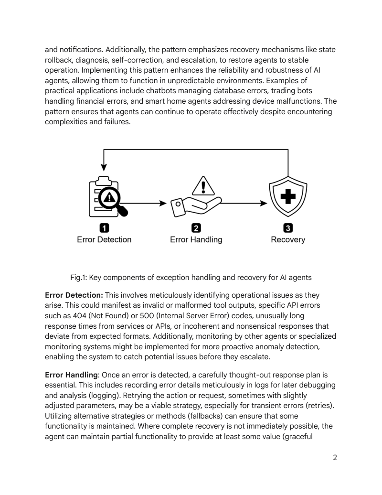
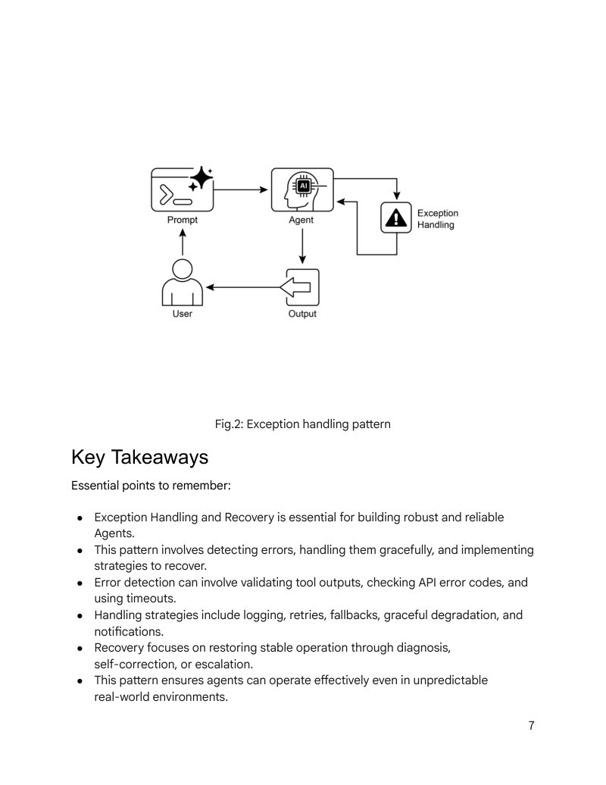
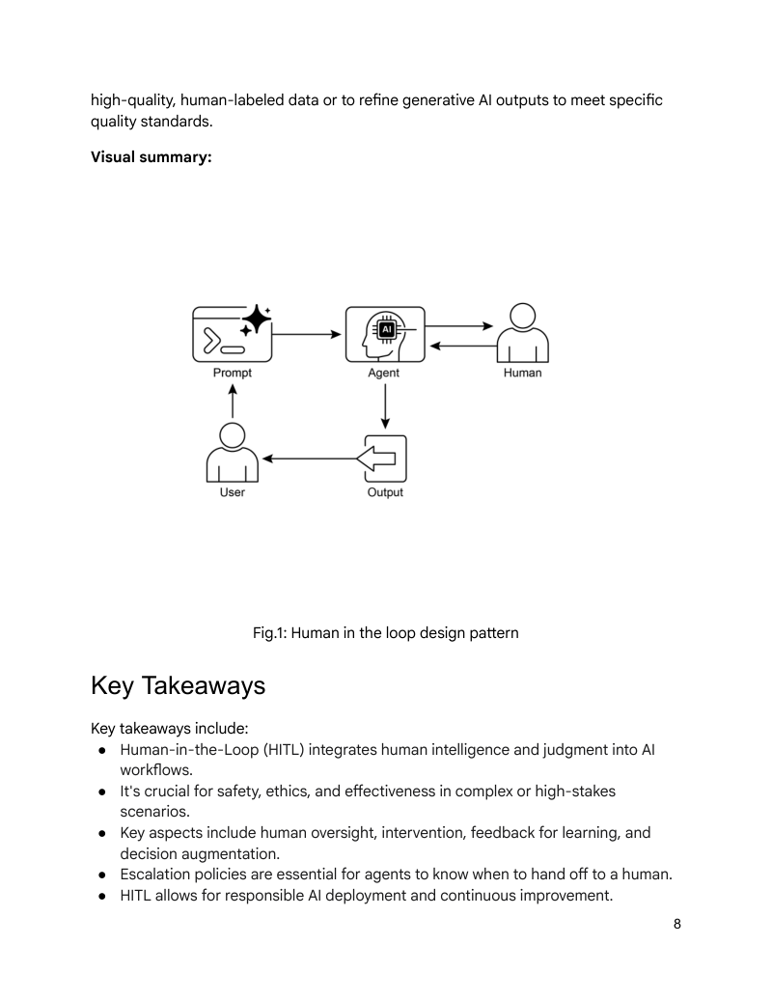

# 模块 08：异常处理与人机协作

> 对应 PDF 第 196-212 页（Chapter 12: Exception Handling and Recovery + Chapter 13: Human-in-the-Loop）

---

## 概念地图

- **核心概念**（必须内化）：异常处理三阶段（Detection → Handling → Recovery）、Human-in-the-Loop 的六种实现模式、"Human-on-the-Loop" 变体
- **实操要点**（动手时需要）：ADK SequentialAgent 实现 Fallback 链、ADK Callback 实现个性化注入、escalate_to_human 工具设计
- **背景知识**（扩展理解）：HITL 的可扩展性瓶颈、隐私合规在人机协作中的考量

---

## 概念讲解

### 1. Exception Handling and Recovery（异常处理与恢复模式）

**模式名称与一句话定义**：Exception Handling and Recovery（异常处理与恢复模式）——让 Agent 能够预见、管理和从运行故障中恢复，从"脆弱原型"进化为"可靠系统"。

**解决什么问题**：

真实环境中，"完美运行"是例外，"出问题"才是常态：
- **工具调用失败**：API 超时、网络中断、服务不可用
- **数据异常**：格式错误、缺失字段、矛盾信息
- **LLM 行为异常**：幻觉输出、格式不符、无限循环
- **外部依赖变化**：网站结构改变、API 版本升级

没有异常处理的 Agent 就像一辆**没有安全气囊的车**——晴天行驶没问题，但遇到任何意外就会"车毁人亡"。

**直觉建立**：

异常处理系统就像医院的**急救流程**：

| 急救阶段 | Agent 对应 | 说明 |
|---------|-----------|------|
| **分诊（Triage）** | Error Detection | 快速识别问题类型和严重程度 |
| **急救处理** | Error Handling | 立即止血——日志、重试、降级、通知 |
| **术后恢复** | Recovery | 恢复稳定状态——回滚、自我修正、升级 |

> **类比边界**：医院急救是处理已发生的紧急状况，但 Agent 异常处理还包括**预防性措施**（输入验证、超时设置）——更像是"急救 + 预防医学"的结合。

**三阶段详解**：



> **图说**：AI Agent 异常处理与恢复的三个关键阶段——Error Detection（检测）、Error Handling（处理）、Recovery（恢复）。

#### 阶段一：Error Detection（错误检测）

| 检测类型 | 示例 |
|---------|------|
| 无效/格式错误的工具输出 | 工具返回 null 或不符合预期 Schema |
| API 错误码 | 404 Not Found、500 Internal Server Error |
| 超时 | 服务响应时间异常长 |
| LLM 输出异常 | 无意义回复、与指令不符的格式 |
| 监控系统告警 | 其他 Agent 或专用监控检测到异常模式 |

#### 阶段二：Error Handling（错误处理）

| 策略 | 做什么 | 适用场景 |
|------|--------|---------|
| **Logging** | 记录错误详情到日志 | 所有场景——调试和审计必需 |
| **Retries** | 重试（可能调整参数）| 临时性错误（网络波动、服务繁忙）|
| **Fallbacks** | 切换到备选方案 | 主方案不可用但有替代路径 |
| **Graceful Degradation** | 维持部分功能 | 完全恢复不可能，但仍可提供部分价值 |
| **Notification** | 通知人类或其他 Agent | 需要人工干预或协作解决 |

#### 阶段三：Recovery（恢复）

| 策略 | 做什么 | 适用场景 |
|------|--------|---------|
| **State Rollback** | 回滚到之前的稳定状态 | 错误操作已修改了状态 |
| **Diagnosis** | 深入分析错误根因 | 防止同类错误再次发生 |
| **Self-Correction** | 调整计划、逻辑或参数 | 可以通过 Replanning 避免同一错误 |
| **Escalation** | 升级给人类或上层系统 | 复杂或严重问题，Agent 无法自行解决 |

---

### 2. ADK 实战：SequentialAgent 实现 Fallback 链

```python
from google.adk.agents import Agent, SequentialAgent

# Agent 1: 尝试精确查询
primary_handler = Agent(
    name="primary_handler",
    model="gemini-2.0-flash-exp",
    instruction="""Use the get_precise_location_info tool with the user's address.""",
    tools=[get_precise_location_info]
)

# Agent 2: 检查主查询是否失败，启用备选方案
fallback_handler = Agent(
    name="fallback_handler",
    model="gemini-2.0-flash-exp",
    instruction="""
    Check state["primary_location_failed"].
    - If True: use get_general_area_info tool.
    - If False: do nothing.
    """,
    tools=[get_general_area_info]
)

# Agent 3: 呈现最终结果
response_agent = Agent(
    name="response_agent",
    model="gemini-2.0-flash-exp",
    instruction="""Present location information from state["location_result"].""",
    tools=[]
)

# SequentialAgent 确保按顺序执行
robust_location_agent = SequentialAgent(
    name="robust_location_agent",
    sub_agents=[primary_handler, fallback_handler, response_agent]
)
```

> **设计模式**：Primary → Fallback → Response 三层链。用 State 传递"是否失败"的信号，让 Fallback Agent 决定是否介入。这与 Module 02 的 Reflection 和 Module 04 的 SequentialAgent 设计一脉相承。



> **图说**：Exception Handling 设计模式的视觉总结。

---

### 3. Human-in-the-Loop（人机协作模式）

**模式名称与一句话定义**：Human-in-the-Loop（HITL，人机协作模式）——在关键决策节点引入人类判断，让 AI 与人类形成**优势互补的协作系统**。

**解决什么问题**：

AI 再强大，在以下场景中仍需要人类介入：
- **伦理判断**：AI 不应独自做道德决策（如量刑、信贷审批）
- **模糊情境**：内容审核中的"擦边球"案例
- **高风险操作**：大额交易、医疗诊断
- **情感需求**：客户极度不满时需要人类共情
- **创意审核**：品牌文案、设计方案的主观判断

**直觉建立**：

HITL 不是"AI 不行所以让人来"，而是**分工合作**——像一支足球队：

- **AI 是中场**：处理大量跑动、数据传递、控制节奏（高频、结构化任务）
- **人类是前锋**：在关键时刻做出决定性判断（低频、高价值决策）
- **教练（Escalation Policy）**：定义什么时候该传球给前锋

> **类比边界**：足球场上的分工是并行的，但 HITL 通常是串行的——AI 先处理，关键节点才交给人类。更像接力赛而非足球赛。

**HITL 的六种实现模式**：

| 模式 | 人类角色 | 示例 |
|------|---------|------|
| **Human Oversight** | 监控者——通过日志/仪表板观察 Agent 行为 | 运维团队看 Agent 运行仪表板 |
| **Intervention & Correction** | 纠正者——Agent 出错时介入修正 | 客服 Agent 遇到复杂问题升级给人 |
| **Feedback for Learning** | 教师——提供反馈改进 AI（如 RLHF） | 标注员评价 LLM 输出好坏 |
| **Decision Augmentation** | 决策者——AI 提供分析，人类做最终决定 | AI 推荐贷款批准，人类贷款官审批 |
| **Collaboration** | 合作者——人机共同完成任务 | AI 做数据处理，人做创意策划 |
| **Escalation** | 接管者——Agent 按规则上报给人类 | 欺诈检测 Agent 将高风险案件升级 |

**"Human-on-the-Loop" 变体**：

与 HITL（人在环中）不同，Human-on-the-Loop 是**人在环上**——人类制定策略，AI 自主执行：

| 场景 | 人类做什么 | AI 做什么 |
|------|-----------|----------|
| 自动交易系统 | 设定投资策略和风控规则（70%科技股 / 30%债券，单股不超过 5%） | 实时监控市场、自动执行交易 |
| 呼叫中心 | 设定路由策略（"服务中断"→技术专家，"客户激动"→人工客服） | 实时接听、分析意图、自动路由 |

---

### 4. ADK 实战：技术支持 Agent with HITL

```python
from google.adk.agents import Agent
from google.adk.tools.tool_context import ToolContext

def troubleshoot_issue(issue: str) -> dict:
    return {"status": "success", "report": f"Troubleshooting steps for {issue}."}

def create_ticket(issue_type: str, details: str) -> dict:
    return {"status": "success", "ticket_id": "TICKET123"}

def escalate_to_human(issue_type: str) -> dict:
    return {"status": "success", "message": f"Escalated {issue_type} to a human specialist."}

technical_support_agent = Agent(
    name="technical_support_specialist",
    model="gemini-2.0-flash-exp",
    instruction="""
    You are a technical support specialist.
    For technical issues:
    1. Use troubleshoot_issue to analyze the problem.
    2. Guide the user through troubleshooting.
    3. If issue persists, use create_ticket to log it.
    For complex issues beyond basic troubleshooting:
    1. Use escalate_to_human to transfer to a human specialist.
    """,
    tools=[troubleshoot_issue, create_ticket, escalate_to_human]
)
```

**个性化 Callback**——在 LLM 请求前动态注入客户信息：

```python
def personalization_callback(callback_context, llm_request):
    customer_info = callback_context.state.get("customer_info")
    if customer_info:
        personalization_note = (
            f"Customer Name: {customer_info.get('name')}\n"
            f"Customer Tier: {customer_info.get('tier')}\n"
            f"Recent Purchases: {', '.join(customer_info.get('recent_purchases', []))}\n"
        )
        system_content = types.Content(role="system", parts=[types.Part(text=personalization_note)])
        llm_request.contents.insert(0, system_content)
    return None  # 继续处理修改后的请求
```

> **设计亮点**：Callback 在 LLM 处理前注入上下文（类似中间件模式），让 Agent 的每个回复都"知道"用户是谁、什么级别、买过什么——无需在 Prompt 中硬编码。



> **图说**：Human-in-the-Loop 设计模式——AI 处理常规流程，关键节点升级给人类，人类反馈又可以改进 AI 性能。

---

### 5. HITL 的局限性

| 局限 | 说明 | 缓解措施 |
|------|------|---------|
| **可扩展性** | 人类无法处理百万级任务 | 混合方案：自动化处理多数，HITL 处理关键少数 |
| **专家依赖** | 效果取决于人类专业水平 | AI 生成代码 → 需要懂代码的人来审 |
| **标注质量** | 人类标注员需要专门培训 | 标注指南 + 一致性检验 |
| **隐私合规** | 敏感信息需脱敏后才能给人看 | 数据匿名化流程 |

---

## 应用场景

| # | 场景 | 异常处理关注点 | HITL 关注点 |
|---|------|-------------|-----------|
| 1 | **客服机器人** | 数据库宕机 → 通知用户 + 升级 | 复杂投诉 → 转人工客服 |
| 2 | **自动交易** | "余额不足" → 日志 + 不重复无效交易 | 大额交易 → 人工审批 |
| 3 | **智能家居** | 网络故障 → 重试 + 通知用户手动操作 | — |
| 4 | **内容审核** | — | 擦边球内容 → 人工判断 |
| 5 | **自动驾驶** | 传感器故障 → 安全停车 | 复杂路况 → 人类接管 |
| 6 | **数据处理** | 文件损坏 → 跳过 + 日志 + 继续处理其他 | 数据标注 → 人工标注 |

---

## 模式关联

| 关系类型 | 相关模式 | 说明 |
|----------|---------|------|
| **互补** | Reflection（Module 02）| 异常处理可以触发 Reflection——失败后反思并改用更好的 Prompt |
| **互补** | Goal Monitoring（Module 07）| 监控发现偏差 → 触发异常处理流程 |
| **互补** | Multi-Agent（Module 04）| Fallback 链本质上是多 Agent 协作——Primary + Fallback + Response |
| **互补** | Tool Use（Module 03）| 工具调用失败是最常见的异常来源 |
| **扩展** | Guardrails（Module 13）| 安全护栏是"预防性异常处理"——在错误发生前拦截 |

---

## 重点标记

1. **三阶段流程**：Detection（发现问题）→ Handling（应急处理）→ Recovery（恢复稳定）
2. **五种处理策略**：Logging、Retries、Fallbacks、Graceful Degradation、Notification
3. **HITL 是分工而非退让**：AI 处理高频结构化任务，人类处理低频高价值决策
4. **Human-on-the-Loop**：人定策略 + AI 自主执行——适合需要实时响应但策略稳定的场景
5. **Escalation = Agent 的"我不知道"按钮**：知道何时上报比强行处理更重要
6. **HITL 最大瓶颈是可扩展性**：需要混合方案——自动化 + 人工审核的分层策略
7. **Callback 注入模式**：在 LLM 请求前动态注入上下文，实现个性化而不污染核心 Prompt

---

## 自测：你真的理解了吗？

**Q1**：一个 Web 爬虫 Agent 遇到了 CAPTCHA。这属于异常处理三阶段中的哪个阶段？你会怎么设计完整的处理流程（Detection → Handling → Recovery）？

**Q2**：在自动交易 Agent 中，"余额不足"错误和"市场已关闭"错误应该用不同的处理策略吗？分别是什么？

**Q3**：HITL 的"Human-in-the-Loop"和"Human-on-the-Loop"有什么区别？在一个内容审核系统中，你会选择哪种模式？为什么？

**Q4**：ADK 的 SequentialAgent Fallback 模式使用 State 传递"是否失败"信号。如果不用 State，还有什么其他方式可以让 Fallback Agent 知道 Primary Agent 失败了？

**Q5**：一个医疗诊断 Agent 建议给患者开某种药物。这个场景应该用 HITL 还是全自动？你会怎么设计 Escalation Policy？
