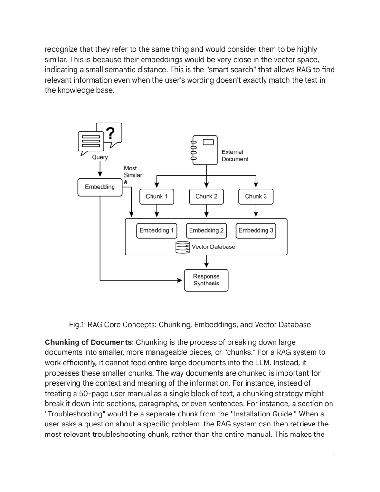
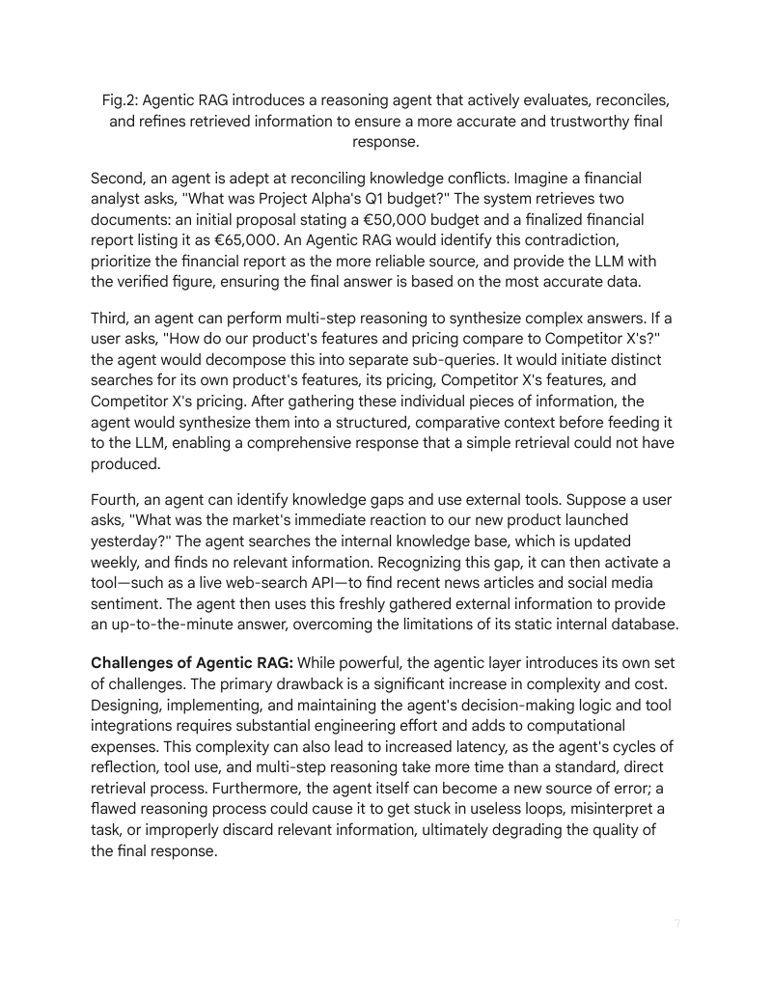
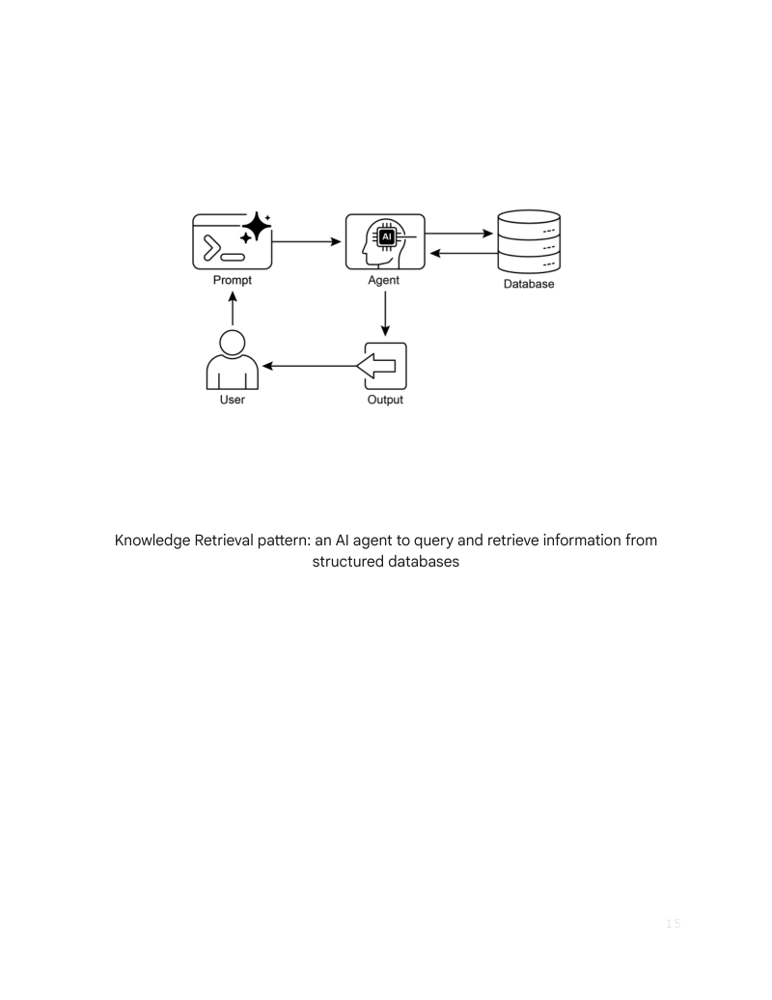

# 模块 09：知识检索 RAG

> 对应 PDF 第 213-230 页（Chapter 14: Knowledge Retrieval — RAG）

---

## 概念地图

- **核心概念**（必须内化）：RAG 模式的核心原理（Retrieval + Generation）、Embeddings 与语义相似度、Chunking 策略、三种检索技术（Vector Search / BM25 / Hybrid）、GraphRAG 与 Agentic RAG 的进阶架构
- **实操要点**（动手时需要）：ADK google_search 集成、Vertex AI RAG API、LangChain + Weaviate + LangGraph StateGraph 检索-生成管线
- **背景知识**（扩展理解）：向量数据库生态（Pinecone / Weaviate / Chroma / Milvus / Qdrant / pgvector / FAISS / ScaNN）、Knowledge Graph 的构建与维护成本、RAG 的延迟与预处理挑战

---

## 概念讲解

### 1. RAG（Retrieval-Augmented Generation，检索增强生成）

**模式名称与一句话定义**：RAG（Retrieval-Augmented Generation，检索增强生成）——在 LLM 生成回答之前，先从外部知识源检索相关信息注入上下文，让模型能够基于**最新的、私有的、准确的**知识回答问题。

**解决什么问题**：

LLM 的知识有三个根本性缺陷：
- **知识是静态的**：训练数据有截止日期，不知道昨天发生了什么
- **知识是公开的**：不了解你的公司内部文档、客户数据、产品手册
- **知识会"编造"**：遇到不知道的问题，LLM 倾向于生成看似合理但事实错误的答案（幻觉）

没有 RAG 的 LLM 就像一个**毕业后就没再学习的专家**——他的知识停留在"毕业那天"，而且遇到不懂的问题不会说"我不知道"，而是**自信地胡说**。

**直觉建立**：

RAG 就像一个**开卷考试**的考生：

| 闭卷考试（纯 LLM） | 开卷考试（RAG） |
|-------------------|---------------|
| 只能靠记忆答题 | 可以翻书、查笔记 |
| 记不清就猜一个 | 找到原文再作答 |
| 知识停留在复习截止日 | 可以查最新的参考资料 |
| 只能答公共知识 | 可以翻自己的专属笔记本 |

RAG 的工作流程：用户提问 --> 从知识库中**检索**相关片段 --> 将检索结果 + 原始问题一起交给 LLM --> LLM 基于检索到的信息**生成**回答。

> **类比边界**：开卷考试的考生翻书是精确查找（按页码、索引），但 RAG 的检索是**语义匹配**——不需要精确关键词，"意思相近"就能找到。这既是优势（更灵活），也是风险（可能找到看似相关但实际无关的内容）。



> **图说**：RAG 模式的核心组件——文档经过 Chunking（分块）后生成 Embeddings（向量表示），存入 Vector Database（向量数据库），查询时通过语义相似度检索最相关的片段。

---

### 2. Embeddings（向量嵌入）

**定义**：Embeddings 是将文本转换为**数值向量**（一组浮点数列表）的技术，这些向量能够捕获文本的**语义含义**。

**直觉建立**：

想象你要在一个巨大的图书馆中组织书籍。传统方式是按字母或分类号排列（关键词匹配）。Embeddings 的方式完全不同——它为每本书生成一个**"内容坐标"**，语义相近的书在这个多维空间中**彼此靠近**：

- "如何训练小狗" 和 "犬类行为矫正指南" → 坐标非常接近（语义相似）
- "如何训练小狗" 和 "Python 编程入门" → 坐标很远（语义无关）
- "苹果公司股价" 和 "水果价格走势" → 关键词相似但坐标有距离（语义不同）

> **关键洞察**：Embeddings 不是简单地数"有多少个相同的词"——它捕获的是**含义**。同义词会有相近的向量，多义词在不同上下文中会有不同的向量。

---

### 3. Text Similarity 与 Semantic Distance（文本相似度与语义距离）

**两种衡量文本相似度的方式**：

| 维度 | 词汇相似度（Lexical） | 语义相似度（Semantic） |
|------|---------------------|---------------------|
| **原理** | 比较两段文本共享多少相同的词 | 比较两段文本的**含义**是否相近 |
| **代表算法** | BM25、TF-IDF | 向量余弦相似度（Cosine Similarity） |
| **优势** | 精确关键词匹配，速度快 | 理解同义词、不同表述的相同含义 |
| **劣势** | 不理解同义词（"汽车" vs "轿车"匹配失败） | 计算成本较高，需要 Embedding 模型 |
| **类比** | 像用"Ctrl+F"查找——只认字面相同 | 像问一个理解语言的人"这两句话意思一样吗？" |

**语义距离（Semantic Distance）**：

Embeddings 向量之间的"距离"反映了语义上的差异程度。常用的距离度量：
- **余弦相似度（Cosine Similarity）**：衡量两个向量方向的一致性，值越接近 1 越相似
- **欧氏距离（Euclidean Distance）**：向量空间中的直线距离，值越小越相似

---

### 4. Chunking（文本分块）

**定义**：将大型文档拆分为较小的、可管理的片段（chunks），以便 Embedding 模型处理和向量数据库存储。

**为什么需要 Chunking**：
- Embedding 模型对输入长度有限制（通常几百到几千 tokens）
- 整篇文档生成单个 Embedding 会丢失细节——粒度太粗
- 检索时需要返回**精确相关的片段**，而不是整篇文档

**Chunking 策略的权衡**：

| 策略 | 分块方式 | 优点 | 缺点 |
|------|---------|------|------|
| **固定大小** | 按字符数/Token 数切分 | 简单、一致 | 可能在句子/段落中间断开，破坏语义 |
| **按语义边界** | 按段落、章节、标题切分 | 保持语义完整性 | 分块大小不均匀 |
| **重叠分块** | 相邻块之间有重叠区域 | 减少边界处信息丢失 | 增加存储和计算成本 |
| **递归分块** | 先按大边界切，再逐级细化 | 平衡粒度和语义 | 实现复杂度较高 |

> **关键权衡**：块太小 → 丢失上下文（一个概念被拆到两个块中）；块太大 → 检索不精确（返回大段无关内容）。实践中通常选择 **200-1000 tokens** 的块大小，配合 **10-20% 的重叠**。

---

### 5. 三种检索技术

| 技术 | 原理 | 优势 | 劣势 | 适用场景 |
|------|------|------|------|---------|
| **Vector Search（向量搜索）** | 用 Embeddings 进行语义匹配 | 理解同义词、不同表述 | 可能忽略精确关键词 | "什么是机器学习？"→ 即使文档里写的是"ML"也能匹配 |
| **BM25（关键词搜索）** | 基于词频和文档频率的统计匹配 | 精确关键词匹配、速度快 | 不理解语义 | 搜索特定错误码"ERR_404"或专有名词 |
| **Hybrid Search（混合搜索）** | 结合 Vector Search + BM25 | 兼顾语义和精确匹配 | 需要调参（两种结果的权重分配）| 生产环境的最佳实践——覆盖两种搜索需求 |

> **实践建议**：大多数生产级 RAG 系统使用 **Hybrid Search**——先用 BM25 找精确匹配，再用 Vector Search 补充语义相关结果，最后用排序模型（Reranker）合并排序。

---

### 6. 向量数据库（Vector Databases）

向量数据库是专门为存储和查询 Embeddings 而设计的数据库，是 RAG 系统的核心基础设施。

| 数据库 | 类型 | 特点 |
|--------|------|------|
| **Pinecone** | 托管云服务 | 全托管、开箱即用、无需运维 |
| **Weaviate** | 开源 + 云 | 支持混合搜索、GraphQL API、模块化架构 |
| **Chroma** | 开源 | 轻量、开发友好、适合原型开发 |
| **Milvus** | 开源 | 高性能、支持十亿级向量、分布式架构 |
| **Qdrant** | 开源 + 云 | Rust 编写、高性能、丰富的过滤能力 |
| **pgvector** | PostgreSQL 扩展 | 在现有 PostgreSQL 中添加向量能力、无需新数据库 |
| **FAISS** | 库（Facebook） | 纯计算库、非数据库、适合研究和离线批处理 |
| **ScaNN** | 库（Google） | 高效近似最近邻搜索、适合大规模场景 |

> **选型建议**：原型阶段用 Chroma（轻量快速）；已有 PostgreSQL 的团队用 pgvector（零迁移成本）；生产环境追求免运维用 Pinecone；需要混合搜索且自主部署用 Weaviate 或 Qdrant。

---

### 7. RAG 的核心挑战

| 挑战 | 问题描述 | 影响 |
|------|---------|------|
| **信息碎片化** | 一个完整的概念被分到多个 Chunk 中 | 检索到不完整的片段，回答缺乏上下文 |
| **检索质量** | 检索到的内容与问题"看似相关但实际无关" | LLM 基于错误信息生成答案（Garbage In, Garbage Out）|
| **矛盾信息** | 不同文档对同一问题有不同说法 | LLM 不知道该信哪个，可能生成矛盾回答 |
| **预处理成本** | 文档解析、Chunking、Embedding 生成需要大量计算 | 大规模知识库的初始化和更新成本高 |
| **延迟** | 检索步骤增加了端到端响应时间 | 用户体验下降，尤其在实时场景中 |

> **核心洞察**：RAG 不是"接上知识库就万事大吉"——检索质量直接决定生成质量。一个糟糕的 RAG 系统可能比没有 RAG 更危险，因为 LLM 会对错误的检索结果**过度信任**。

---

### 8. GraphRAG（基于知识图谱的 RAG）

**定义**：GraphRAG 用**知识图谱（Knowledge Graph）**替代传统的向量数据库作为知识存储，通过实体之间的关系进行导航和推理。

**直觉建立**：

传统 RAG 就像在图书馆里**按语义搜书**——你描述想找什么内容，系统返回最相关的几本。GraphRAG 则像一个**有关系网络的百科全书**——你不仅能搜到"阿尔伯特-爱因斯坦"的词条，还能沿着关系链找到他的"同事 → 玻尔"、他的"理论 → 相对论"、相对论的"应用 → GPS"。

| 维度 | 传统 RAG（Vector） | GraphRAG（Knowledge Graph） |
|------|-------------------|---------------------------|
| **知识表示** | 文本片段的向量嵌入 | 实体 + 关系的图结构（三元组） |
| **检索方式** | 语义相似度匹配 | 图遍历 + 关系导航 |
| **多跳推理** | 困难——需要多次检索拼凑 | 自然——沿关系链走几步即可 |
| **适用场景** | 单文档内的事实性问答 | 跨文档的复杂关系型问题 |
| **构建成本** | 低——自动 Chunk + Embed | 高——需要实体抽取、关系标注、图构建 |
| **维护成本** | 低——新增文档简单 | 高——需要维护图的一致性 |

> **GraphRAG 的最大痛点**：知识图谱的构建和维护是**人力密集型**工作。虽然可以用 NLP 技术自动化一部分，但高质量的知识图谱仍需大量人工校验。适合知识结构明确且相对稳定的领域（如医疗、法律、金融）。

---

### 9. Agentic RAG（智能体增强的 RAG）

**定义**：Agentic RAG 在传统 RAG 之上增加了一个**推理 Agent 层**，让 Agent 能够主动验证信息来源、调解矛盾、进行多步推理、识别知识空白并使用工具填补。

**解决什么问题**：

传统 RAG 是**被动的管道**——检索到什么就用什么，不会质疑检索结果的质量。Agentic RAG 让系统从"管道"进化为"研究员"：

| 传统 RAG（管道） | Agentic RAG（研究员） |
|-----------------|---------------------|
| 检索到什么就用什么 | 先验证来源可信度再使用 |
| 遇到矛盾信息直接混合 | 分析矛盾、选择最可信的来源 |
| 一次检索就生成答案 | 必要时分解问题、多次检索 |
| 信息不足就瞎编 | 识别知识空白，调用工具补充 |



> **图说**：Agentic RAG 在传统 RAG 基础上引入 Reasoning Agent，Agent 负责验证来源、调解冲突、分解复杂查询，并在必要时使用外部工具补充信息。

**四种典型场景**：

#### 场景一：Source Validation（来源验证）

Agent 不盲目信任检索结果，而是**评估来源的可信度**：
- 这个信息来自官方文档还是论坛帖子？
- 文档的发布时间是什么时候——过时了吗？
- 多个来源是否一致？

#### 场景二：Conflict Reconciliation（矛盾调解）

当检索到的多个片段互相矛盾时，Agent **主动分析并选择**：
- 识别矛盾点（文档 A 说"支持"，文档 B 说"不支持"）
- 评估哪个来源更权威、更新
- 向用户透明地报告矛盾及其判断理由

#### 场景三：Multi-Step Decomposition（多步分解）

面对复杂问题，Agent **拆分为多个子问题**，逐一检索和回答：
- "比较 PostgreSQL 和 MongoDB 在高并发场景下的性能" → 先检索 PostgreSQL 高并发数据 → 再检索 MongoDB 高并发数据 → 综合对比

#### 场景四：Knowledge Gap + Tool Use（知识空白 + 工具使用）

当知识库中没有答案时，Agent **识别空白并调用外部工具**：
- 检索结果为空或不相关 → Agent 判断"知识库没有这个信息"
- 调用搜索引擎、API 或其他数据源获取答案
- 将新获取的信息整合到回答中

---

### 10. 实战代码

#### ADK + Google Search

```python
from google.adk.agents import Agent
from google.adk.tools import google_search

# 使用 Google Search 作为知识检索工具
rag_agent = Agent(
    name="rag_agent",
    model="gemini-2.0-flash",
    instruction="Answer user questions using google_search to find relevant information.",
    tools=[google_search]
)
```

> **设计要点**：这是最简单的 RAG 实现——直接用搜索引擎作为知识源。适合不需要私有知识库的场景。

#### Vertex AI RAG

```python
from vertexai.preview import rag
from vertexai.preview.generative_models import GenerativeModel, Tool

# 创建 RAG Corpus（知识库）
rag_corpus = rag.create_corpus(display_name="my_corpus")

# 导入文档
rag.import_files(
    rag_corpus.name,
    paths=["gs://my-bucket/documents/"],
    chunk_size=512,
    chunk_overlap=100,
)

# 创建 RAG 检索工具
rag_tool = Tool.from_retrieval(
    retrieval=rag.Retrieval(
        source=rag.VertexRagStore(
            rag_corpora=[rag_corpus.name],
            similarity_top_k=3,
            vector_distance_threshold=0.5,
        ),
    )
)

# 集成到 Generative Model
model = GenerativeModel(
    model_name="gemini-2.0-flash",
    tools=[rag_tool],
)
response = model.generate_content("What does the document say about...")
```

> **设计要点**：Vertex AI RAG 是全托管方案——文档导入、Chunking、Embedding、向量存储和检索全部由平台处理。`chunk_size` 和 `chunk_overlap` 直接对应前文讨论的分块策略。

#### LangChain + Weaviate + LangGraph StateGraph

```python
from langchain_weaviate.vectorstores import WeaviateVectorStore
from langchain_google_genai import ChatGoogleGenerativeAI, GoogleGenerativeAIEmbeddings
from langgraph.graph import StateGraph, START, END

# 初始化 Embeddings 和向量数据库
embeddings = GoogleGenerativeAIEmbeddings(model="models/embedding-001")
db = WeaviateVectorStore(
    client=weaviate_client,
    index_name="LangChain",
    text_key="text",
    embedding=embeddings,
)
retriever = db.as_retriever()

# 定义状态
class State(TypedDict):
    question: str
    context: list[Document]
    answer: str

# 检索节点
def retrieve(state: State):
    retrieved_docs = retriever.invoke(state["question"])
    return {"context": retrieved_docs}

# 生成节点
def generate(state: State):
    docs_content = "\n\n".join(doc.page_content for doc in state["context"])
    prompt = f"Answer based on context:\n{docs_content}\n\nQuestion: {state['question']}"
    response = llm.invoke(prompt)
    return {"answer": response.content}

# 构建 StateGraph 管线
graph_builder = StateGraph(State)
graph_builder.add_node("retrieve", retrieve)
graph_builder.add_node("generate", generate)
graph_builder.add_edge(START, "retrieve")
graph_builder.add_edge("retrieve", "generate")
graph_builder.add_edge("generate", END)

graph = graph_builder.compile()
```

> **设计要点**：这是一个经典的 **Retrieve → Generate** 两阶段管线。LangGraph StateGraph 让数据流可视化——`retrieve` 节点负责从 Weaviate 检索，`generate` 节点负责基于检索结果生成回答。State 在节点之间传递，确保数据流清晰。



> **图说**：Knowledge Retrieval（RAG）设计模式的整体视觉总结——从文档预处理到检索到生成的完整流程。

---

## 应用场景

| # | 场景 | RAG 如何增强 | 推荐检索方式 |
|---|------|------------|-------------|
| 1 | **企业知识搜索** | 员工搜索内部文档、政策、规范——基于语义理解而非关键词 | Hybrid Search |
| 2 | **客户支持** | Agent 从产品手册、FAQ 中检索答案，减少人工介入 | Vector Search + Reranker |
| 3 | **内容推荐** | 基于用户阅读历史的语义匹配，推荐相关文章/产品 | Vector Search |
| 4 | **新闻摘要** | 从多个新闻源检索同一事件的报道，生成综合摘要 | Hybrid Search + Agentic RAG |
| 5 | **法律/医疗研究** | 跨多个专业文档检索相关条款、案例、指南 | GraphRAG |
| 6 | **代码库问答** | 从代码仓库和文档中检索相关实现和 API 说明 | Hybrid Search |

---

## 模式关联

| 关系类型 | 相关模式 | 说明 |
|----------|---------|------|
| **实现** | Memory（Module 05）| RAG 是长期记忆检索的核心实现——从外部知识库检索信息注入上下文，正是 MemoryService 的底层机制 |
| **依赖** | Tool Use（Module 03）| 检索本身就是一次工具调用——Agent 调用 Retriever 工具获取知识，遵循 Tool Use 的六步生命周期 |
| **互补** | MCP（Module 06）| RAG 的检索能力可以通过 MCP 暴露为标准化工具，让任意 Agent 使用同一个知识库 |
| **互补** | Parallelization（Module 02）| 复杂查询可以并行检索多个知识源（如同时查内部文档和外部搜索），提升检索覆盖率和速度 |
| **扩展** | Reflection（Module 02）| Agentic RAG 中 Agent 对检索结果的验证和矛盾调解，本质上就是 Reflection 机制的应用 |
| **前置** | Planning（Module 04）| Agentic RAG 的多步分解需要 Planning 能力——将复杂问题拆分为可检索的子问题 |

---

## 重点标记

1. **RAG = 开卷考试**：让 LLM 从"只靠记忆"变为"可以查资料再回答"，显著减少幻觉、提供最新信息
2. **Embeddings 捕获语义而非字面**：同义词向量接近，多义词根据上下文不同向量不同——这是语义搜索的基础
3. **Chunking 是 RAG 质量的隐形杀手**：块太大检索不精确，块太小丢失上下文，生产环境建议 200-1000 tokens + 10-20% 重叠
4. **Hybrid Search 是生产最佳实践**：Vector Search（语义）+ BM25（关键词）互补，覆盖两种搜索需求
5. **GraphRAG 适合关系密集型场景**：多跳推理和跨文档关联是其强项，但构建和维护成本高
6. **Agentic RAG 从管道进化为研究员**：能验证来源、调解矛盾、分解复杂问题、识别知识空白——是 RAG 的"高级形态"
7. **检索质量 > 生成质量**：Garbage In, Garbage Out——再好的 LLM 也无法从错误的检索结果中生成正确答案

---

## 自测：你真的理解了吗？

**Q1**：你的公司有一个内部 Wiki（5000 篇文档），员工经常搜不到想要的信息。你决定用 RAG 改造搜索系统。请描述完整的技术方案：文档预处理、Chunking 策略、Embedding 模型选择、向量数据库选型、检索方式。为什么你做出这些选择？

**Q2**：一个 RAG 系统检索到两篇文档：文档 A（2024 年发布）说"Python 3.12 支持该特性"，文档 B（2022 年发布）说"Python 不支持该特性"。传统 RAG 和 Agentic RAG 分别会如何处理这种矛盾？结果有什么不同？

**Q3**：Vector Search 和 BM25 各有什么盲区？举一个具体的查询例子，说明单独使用其中一种会失败，但 Hybrid Search 能成功的场景。

**Q4**：GraphRAG 在什么场景下明显优于传统 Vector RAG？如果你要为一个医疗问答系统选择 RAG 架构，你会选哪种？理由是什么？构建成本如何评估？

**Q5**：在 LangGraph StateGraph 的 Retrieve → Generate 管线中，如果你想加入一个"检索结果质量检查"步骤（在生成之前验证检索结果是否相关），你会怎么修改这个 Graph？需要添加什么节点和边？如果检查不通过，流程应该怎么走？
