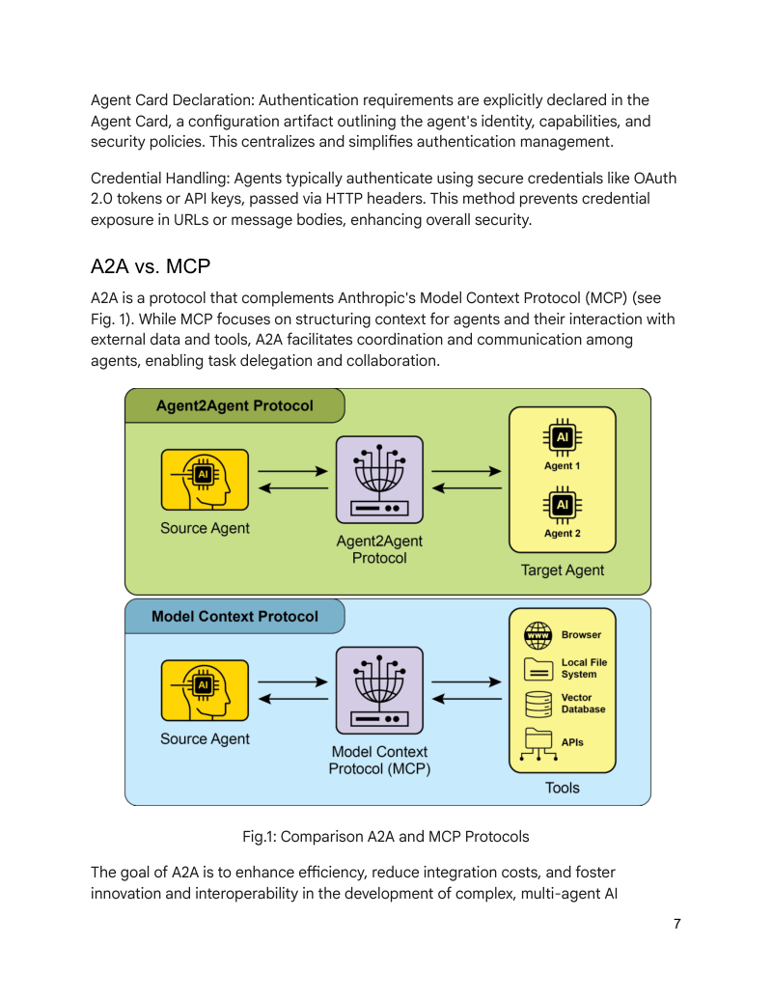
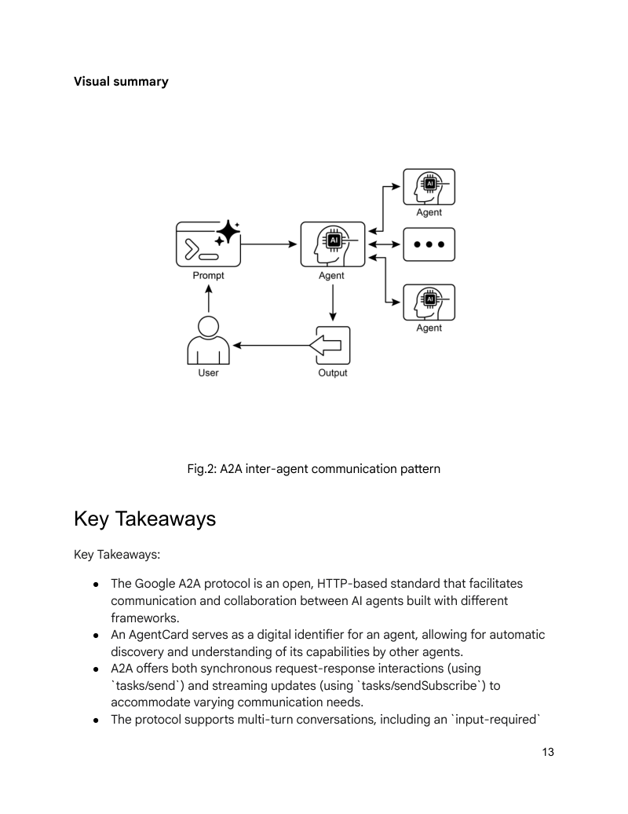

# 模块 10：智能体间通信 A2A

> 对应 PDF 第 231-245 页（Chapter 15: Inter-Agent Communication — A2A）

---

## 概念地图

- **核心概念**（必须内化）：A2A 协议的定位与核心架构（Client Agent / Remote Agent / Agent Card）、A2A vs MCP 的互补关系、Task 生命周期与通信机制
- **实操要点**（动手时需要）：Agent Card 的 JSON 结构与发布、AgentSkill 定义、ADK Agent 暴露为 A2A Server（Starlette + Uvicorn）、四种交互模式（同步/异步轮询/SSE 流式/Webhook 推送）
- **背景知识**（扩展理解）：Agent 发现机制（Well-Known URI / Curated Registry / Direct Config）、安全机制（Mutual TLS / OAuth 2.0）、行业支持生态（Atlassian / Salesforce / LangChain / Microsoft 等）

---

## 概念讲解

### 1. A2A Protocol（Agent-to-Agent 协议）

**模式名称与一句话定义**：A2A（Agent-to-Agent Protocol）——Google 提出的开放标准，让**不同框架、不同厂商构建的 Agent 之间能够相互发现、通信和协作**，无需了解对方的内部实现。

**解决什么问题**：

在 Module 04（Multi-Agent）中我们学到，多个 Agent 协作可以解决复杂问题。但那里讨论的多 Agent 系统有一个隐含前提：**所有 Agent 都运行在同一个框架内**（比如都是 CrewAI Agent，或都是 ADK Agent）。

现实中的情况远没有这么理想：
- **团队 A** 用 LangChain 构建了一个研究 Agent
- **团队 B** 用 Google ADK 构建了一个日程管理 Agent
- **团队 C** 用自研框架构建了一个 CRM Agent

这三个 Agent 怎么协作？没有 A2A 之前：
- 每两个框架之间都需要**定制集成代码**
- Agent 不知道其他 Agent 的存在，无法**动态发现**可用的协作伙伴
- 没有标准化的**任务委托和状态追踪**机制

A2A 就是为了解决这个"Agent 界的巴别塔问题"。

**直觉建立**：

想象国际商务世界——各国公司都有自己的语言、流程和内部系统。要让他们协作，需要三样东西：

1. **名片**（Agent Card）：每个公司的标准化自我介绍——"我叫 XX 公司，擅长 XX 业务，联系方式是 XX，支持 XX 方式合作"
2. **商务名录**（Agent Discovery）：一个公开的企业黄页，或者行业协会的注册名录，让你找到能帮你的公司
3. **标准商务合同和跟单系统**（Task 与 Message）：签合同时用统一的合同格式（JSON-RPC），合同有明确的状态追踪（已提交 → 处理中 → 已完成），双方通过标准化的商务函件沟通

关键特征：A2A 把对方当作**不透明的服务商**——你只关心"他能做什么"（通过名片了解）和"做的结果是什么"（通过合同跟踪），**不需要知道他内部怎么运作**。这就像你委托一家翻译公司翻译文件，你不需要知道他们用了几个翻译员、用了什么翻译工具——你只关心交付物。

> **类比边界**：商务合作中双方通常有复杂的信任建立过程（背调、合同法约束），而 A2A 的信任机制目前主要依赖技术手段（TLS、OAuth），还不具备"法律约束力"层面的保障。

**工作原理**：

A2A 定义了三个核心角色：

| 角色 | 定义 | 类比 |
|------|------|------|
| **User** | 发起请求的最终用户 | 客户/甲方 |
| **A2A Client**（Client Agent）| 代表用户发起任务委托的 Agent | 项目经理——接到客户需求后找合适的供应商 |
| **A2A Server**（Remote Agent）| 接收并执行任务的 Agent——**对外不透明** | 供应商——怎么做是自己的事，只需要交付结果 |

核心交互流程：

```
用户请求 → [Client Agent] --发现--> Agent Card（谁能帮我？）
                          --委托--> Task（请帮我做这件事）
                          <--状态-- submitted → working → completed
                          <--结果-- Artifact（交付物）
```

---

### 2. Agent Card（智能体名片）

**定义**：Agent Card 是一个 JSON 格式的**数字身份证明**，包含一个 Agent 的所有对外信息——它是谁、能做什么、怎么联系、如何认证。

**核心思想**：让 Agent 能用**机器可读的方式**自我描述，使其他 Agent 可以自动判断"这个 Agent 能帮我解决当前任务吗"。

**直觉建立**：

Agent Card 就是 Agent 的 **LinkedIn 个人主页**：

| LinkedIn 字段 | Agent Card 字段 | 作用 |
|--------------|----------------|------|
| 姓名 + 头衔 | `name` + `description` | 我是谁、做什么 |
| 个人网站链接 | `url` | 怎么联系我 |
| 技能标签（Python, ML...）| `skills` | 我擅长什么 |
| 工作经验/认证 | `version` + `capabilities` | 我的能力等级和版本 |
| 接受的联系方式 | `authentication` | 怎么验证身份才能和我合作 |
| 偏好的沟通方式 | `defaultInputModes` / `defaultOutputModes` | 我接受/产出什么格式的信息 |

> **类比边界**：LinkedIn 主页是给人看的，Agent Card 是给机器解析的——格式要求严格，不能有歧义。

**JSON 结构示例**：

```json
{
  "name": "Calendar Agent",
  "description": "Manages calendar events, scheduling, and reminders",
  "url": "https://calendar-agent.example.com/a2a",
  "version": "1.0.0",
  "capabilities": {
    "streaming": true,
    "pushNotifications": false
  },
  "skills": [
    {
      "id": "schedule-meeting",
      "name": "Schedule Meeting",
      "description": "Creates a meeting on the user's calendar",
      "tags": ["calendar", "scheduling"],
      "examples": ["Schedule a team sync for next Monday at 2pm"]
    }
  ],
  "authentication": {
    "schemes": ["OAuth2"]
  },
  "defaultInputModes": ["text/plain"],
  "defaultOutputModes": ["text/plain", "application/json"]
}
```

**关键设计**：`skills` 数组中的 `description` 和 `examples` 字段至关重要——Client Agent 的 LLM 会读这些字段来判断"这个 Remote Agent 是否能处理当前任务"。这和 Module 03（Tool Use）中"工具描述质量决定一切"是同样的道理。

> **常见误用**：Agent Card 中的 `skills` 描述过于笼统（如 "handles various tasks"），导致 Client Agent 无法准确匹配任务。就像 LinkedIn 上写"精通一切"的人，反而让人不知道他具体能做什么。技能描述要**具体、可操作**。

---

### 3. Agent Discovery（智能体发现）

**定义**：Agent Discovery 是 Client Agent 找到可用 Remote Agent 的机制——"去哪里查找能帮我的 Agent？"

**核心思想**：提供多种发现途径，从完全开放到完全受控，适应不同的部署场景。

**三种发现方式**：

| 方式 | 机制 | 适用场景 | 类比 |
|------|------|---------|------|
| **Well-Known URI** | Agent 在 `/.well-known/agent.json` 发布自己的 Agent Card | 公开服务、开放生态 | 公司官网上的"关于我们"页面 |
| **Curated Registry** | 由平台维护的 Agent 目录/注册中心 | 企业内部、可信生态 | 行业协会的会员名录 |
| **Direct Configuration** | 手动配置 Agent 的地址和 Card | 点对点集成、开发测试 | 朋友直接给你名片 |

**Well-Known URI 标准**：

```
https://calendar-agent.example.com/.well-known/agent.json
```

这是借用了 Web 领域已有的 Well-Known URI 标准（如 `/.well-known/openid-configuration`），让任何 HTTP 客户端都可以通过标准路径发现 Agent 的能力。

**为什么重要**：发现机制是 A2A 生态系统的基础——如果 Agent 找不到彼此，协作就无从谈起。三种方式从开放到私密，覆盖了从开源社区到企业内网的全部场景。

---

### 4. Task 生命周期与通信

**定义**：A2A 中的 Task（任务）是 Client Agent 委托给 Remote Agent 的一个工作单元，有标准化的生命周期状态和通信格式。

**核心思想**：任务不是"发出去就不管了"，而是有完整的状态追踪，支持从同步到异步的多种交互模式。

**直觉建立**：

A2A 的 Task 系统就像一个**快递追踪系统**：

| 快递流程 | A2A Task 流程 |
|---------|---------------|
| 下单 | Client 发送 Task 请求 |
| 已揽件（submitted）| Remote Agent 确认接收 |
| 运输中（working）| Remote Agent 正在处理 |
| 已签收（completed）| 处理完成，结果可获取 |
| 快递单号 | `taskId` |
| 同一订单多次沟通 | `contextId`（会话连续性）|
| 包裹内容 | `Artifact`（交付物）|
| 物流信息更新 | `Message`（中间状态更新）|

**Task 的三个核心状态**：

```
submitted ──→ working ──→ completed
    │            │
    └────────────┴──→ failed / canceled
```

**通信格式**：

A2A 使用 **JSON-RPC 2.0 over HTTP(S)** 作为通信协议：

| 组件 | 定义 | 说明 |
|------|------|------|
| **Message** | Client 和 Server 之间交换的消息 | 包含 `attributes`（元数据）和 `parts`（内容块） |
| **Part** | Message 的内容单元 | 可以是文本、文件、结构化数据 |
| **Artifact** | Task 完成后的交付物 | Remote Agent 的最终输出 |
| **contextId** | 会话上下文标识 | 让多轮交互保持连续性（"继续上次的对话"）|

**为什么用 JSON-RPC 2.0**：JSON-RPC 是一个极简的远程过程调用协议——每个请求就是一个 JSON 对象，包含方法名、参数和 ID。选择它的理由是**简单、语言无关、广泛支持**。

---

### 5. 四种交互模式

**定义**：A2A 支持四种不同的交互机制，适应从简单查询到长时间运行任务的各种场景。

| 模式 | 机制 | 适用场景 | 延迟 | 复杂度 |
|------|------|---------|------|--------|
| **Synchronous** | 发请求 → 等响应 | 简单、快速的任务（<几秒）| 最低 | 最低 |
| **Async Polling** | 发请求 → 定期查询状态 | 耗时中等的任务（秒~分钟级）| 中等 | 低 |
| **Streaming（SSE）** | 发请求 → Server 持续推送更新 | 需要实时看到进展的任务 | 低 | 中等 |
| **Push Notifications** | 发请求 → Server 完成后回调 Webhook | 长时间运行的任务（分钟~小时级）| 最高 | 最高 |

**选择建议**：

```
任务耗时 < 2秒？        → Synchronous
需要看实时进展？         → Streaming（SSE）
任务耗时长但不急？       → Async Polling
任务可能跑几个小时？     → Push Notifications（Webhook）
```

**Streaming（SSE）详解**：

SSE（Server-Sent Events）是一种 HTTP 标准——Server 保持连接不断开，持续向 Client 推送事件。在 A2A 场景中，Remote Agent 可以在处理过程中实时推送中间结果：

```
Client: "请分析这份 100 页的报告"
Server (SSE):
  → event: status_update, data: "正在读取文档..."
  → event: status_update, data: "已分析 30/100 页..."
  → event: partial_result, data: "初步发现: ..."
  → event: status_update, data: "已分析 80/100 页..."
  → event: completed, data: {artifact: "完整分析报告"}
```

> **常见误用**：所有任务都用 Synchronous 模式——对于耗时较长的任务，同步调用会导致 HTTP 超时。根据任务的预期耗时选择合适的交互模式是设计 A2A 系统的关键决策。

---

### 6. A2A vs MCP：互补而非竞争

**定义**：A2A 和 MCP（Module 06）是两个**互补的协议**，解决不同层面的标准化问题。

**核心区别一句话**：MCP 标准化 Agent 与**工具/数据**的连接；A2A 标准化 Agent 与**Agent** 的连接。

| 维度 | MCP（Module 06）| A2A（本模块）|
|------|----------------|-------------|
| **全称** | Model Context Protocol | Agent-to-Agent Protocol |
| **连接什么** | Agent ↔ 工具/数据源 | Agent ↔ Agent |
| **对方是** | 确定性的工具/API（透明）| 另一个自主 Agent（不透明）|
| **对方有自主性吗** | 没有——工具被调用，执行预定逻辑 | 有——Remote Agent 自主决定如何完成任务 |
| **类比** | 工人使用工具（锤子不会自己决定怎么锤）| 项目经理委托分包商（分包商自己决定怎么做）|
| **协议基础** | JSON-RPC over STDIO/HTTP | JSON-RPC 2.0 over HTTP(S) |
| **发现机制** | Client 查询 Server 的工具列表 | Agent Card + Well-Known URI/Registry |
| **提出者** | Anthropic | Google |



> **图说**：A2A 和 MCP 协议的对比——MCP 负责 Agent 与工具/数据的标准化连接（左侧），A2A 负责 Agent 之间的标准化通信（右侧）。两者在不同层面解决互操作问题。

**为什么说互补？**

一个完整的 Agent 生态系统需要两种标准化：

```
┌─────────────────────────────────────────────┐
│                  Agent 生态                  │
│                                             │
│   Agent A ←──A2A──→ Agent B                 │
│     │                  │                    │
│    MCP                MCP                   │
│     │                  │                    │
│   工具/数据           工具/数据               │
└─────────────────────────────────────────────┘
```

- **MCP** 解决纵向问题：每个 Agent 如何连接它需要的工具和数据
- **A2A** 解决横向问题：Agent 之间如何发现彼此并协作

实际场景示例：一个旅行规划系统——
1. **用户**："帮我规划下周的东京出差"
2. **Coordinator Agent**（A2A Client）通过 Agent Discovery 找到三个专业 Agent
3. **Flight Agent**（A2A Server）接受航班查询任务 → 内部通过 **MCP** 连接航空公司 API
4. **Hotel Agent**（A2A Server）接受酒店预订任务 → 内部通过 **MCP** 连接酒店预订系统
5. **Calendar Agent**（A2A Server）接受日程安排任务 → 内部通过 **MCP** 连接 Google Calendar
6. 三个 Agent 的结果通过 **A2A** 汇总回 Coordinator，生成完整出差方案

---

### 7. 安全机制

**定义**：A2A 内置了多层安全机制，确保 Agent 间的通信可信、可控、可审计。

| 安全层 | 机制 | 作用 |
|--------|------|------|
| **传输安全** | Mutual TLS（双向 TLS）| 不仅 Client 验证 Server 身份，Server 也验证 Client 身份 |
| **身份认证** | OAuth 2.0 / API Keys | 在 Agent Card 的 `authentication` 字段声明支持的认证方式 |
| **能力声明** | Agent Card | Agent 主动声明自己的能力边界——"我只做日程管理，不做财务操作" |
| **审计追踪** | Audit Logs | 记录所有 Agent 间的交互，用于事后审查 |
| **凭据处理** | Credential Handling | 标准化的凭据传递方式，避免凭据泄露 |

**Mutual TLS 的关键**：普通 HTTPS 只有 Client 验证 Server（"我确认你是真正的银行网站"）。Mutual TLS 则是双向验证——Server 也要确认"你是经过授权的 Agent，不是冒充的"。在 Agent 间通信中，这种双向信任至关重要。

---

### 8. 实战代码：将 ADK Agent 暴露为 A2A Server

**场景**：将一个 Google ADK 的日历管理 Agent 发布为 A2A 服务，让任何 A2A Client 都能发现和使用它。

**第一步：定义 Agent 和工具**

```python
from google.adk.agents import LlmAgent
from google.adk.tools import FunctionTool

# 日历工具集
class CalendarToolset:
    def create_event(self, title: str, date: str, time: str) -> str:
        """Creates a calendar event."""
        return f"Event '{title}' created on {date} at {time}"

    def list_events(self, date: str) -> str:
        """Lists all events for a given date."""
        return f"Events for {date}: [Team Sync 10am, Lunch 12pm]"

calendar_tools = CalendarToolset()

# ADK Agent
calendar_agent = LlmAgent(
    model='gemini-2.0-flash',
    name='calendar_agent',
    instruction='You are a calendar management assistant.',
    tools=[
        FunctionTool(calendar_tools.create_event),
        FunctionTool(calendar_tools.list_events),
    ],
)
```

**第二步：定义 Agent Card 和 Skill**

```python
from a2a.types import AgentCard, AgentSkill

# 定义技能
calendar_skill = AgentSkill(
    id="manage-calendar",
    name="Calendar Management",
    description="Create, list, and manage calendar events",
    tags=["calendar", "scheduling", "events"],
    examples=[
        "Schedule a meeting for tomorrow at 3pm",
        "What events do I have on Monday?",
    ],
)

# 定义 Agent Card
agent_card = AgentCard(
    name="Calendar Agent",
    description="Manages calendar events and scheduling",
    url="https://calendar-agent.example.com/a2a",
    version="1.0.0",
    skills=[calendar_skill],
    capabilities={"streaming": True, "pushNotifications": False},
    defaultInputModes=["text/plain"],
    defaultOutputModes=["text/plain", "application/json"],
)
```

**第三步：创建 A2A Server（Starlette + Uvicorn）**

```python
from starlette.applications import Starlette
from starlette.routing import Route
from starlette.responses import JSONResponse
import uvicorn

# Agent Card 端点
async def get_agent_card(request):
    return JSONResponse(agent_card.dict())

# 任务处理端点（简化示例）
async def handle_task(request):
    body = await request.json()
    user_message = body["message"]["parts"][0]["text"]

    # 将请求转发给 ADK Agent 处理
    result = await calendar_agent.run(user_message)

    return JSONResponse({
        "taskId": body.get("taskId", "task-001"),
        "status": "completed",
        "artifact": {"parts": [{"text": str(result)}]},
    })

# Well-Known URI 路由
app = Starlette(routes=[
    Route("/.well-known/agent.json", get_agent_card),
    Route("/a2a/task", handle_task, methods=["POST"]),
])

if __name__ == "__main__":
    uvicorn.run(app, host="0.0.0.0", port=8080)
```

> **关键设计**：`/.well-known/agent.json` 路由实现了 A2A 的标准发现机制——任何 A2A Client 访问这个标准路径就能获取 Agent Card，无需额外配置。



> **图说**：A2A 协议下的 Agent 间通信模式——Client Agent 通过 Agent Card 发现 Remote Agent 的能力，通过标准化的 Task 机制委托任务并获取结果。

---

### 9. 行业生态支持

A2A 作为开放标准，已获得广泛的行业支持：

| 公司/项目 | 角色 |
|-----------|------|
| **Google** | 协议提出者，ADK 原生支持 |
| **LangChain** | Agent 框架集成 |
| **Microsoft**（Azure AI Foundry）| 云平台支持 |
| **Atlassian** | 企业协作工具集成 |
| **Salesforce** | CRM 领域 Agent 互操作 |
| **SAP** | 企业 ERP 系统集成 |
| **ServiceNow** | IT 服务管理集成 |
| **MongoDB** | 数据层 Agent 支持 |
| **Box** | 文档管理 Agent 互操作 |

> **为什么这个生态很重要**：A2A 的价值取决于**网络效应**——支持 A2A 的 Agent 越多，每个 Agent 能找到的协作伙伴就越多，整个生态的价值指数级增长。就像 USB-C 只有所有厂商都支持时才真正方便。

---

## 应用场景

| # | 场景 | A2A 的作用 | 与 MCP 的配合 |
|---|------|-----------|---------------|
| 1 | **跨组织 Agent 协作** | 不同公司的 Agent 通过 A2A 标准化通信 | 每个 Agent 内部用 MCP 连接自己的工具 |
| 2 | **企业内部 Agent 市场** | 各部门发布自己的 Agent 到企业 Registry | 统一发现和调用，降低集成成本 |
| 3 | **多厂商 Agent 编排** | LangChain Agent + ADK Agent + 自研 Agent 协作 | 框架无关的标准通信协议 |
| 4 | **分布式任务处理** | 长时间任务委托给专业 Agent，通过异步机制追踪 | Remote Agent 用 MCP 连接底层系统 |
| 5 | **Agent 即服务（AaaS）** | 将 Agent 能力作为标准化服务对外暴露 | Agent Card 描述能力，A2A 处理通信 |

---

## 模式关联

| 关系类型 | 相关模式 | 说明 |
|----------|---------|------|
| **标准化** | Multi-Agent（Module 04）| A2A 将 Multi-Agent 协作从"同框架内部通信"升级为"跨框架标准化通信" |
| **互补** | MCP（Module 06）| A2A 标准化 Agent 间通信，MCP 标准化 Agent-工具通信——两者共同构成完整的 Agent 互操作体系 |
| **扩展** | Tool Use（Module 03）| A2A 的 Agent Card 中 skills 描述沿用了 Tool Use 中"工具描述质量决定一切"的原则 |
| **互补** | Memory（Module 05）| A2A 的 `contextId` 机制让跨 Agent 的多轮交互保持上下文连续性，类似跨系统的记忆共享 |
| **前置** | Routing（Module 01）| Client Agent 根据 Agent Card 的 skills 选择合适的 Remote Agent，本质上是跨系统的 Routing |

---

## 重点标记

1. **A2A = Agent 间的通用语言**：开放标准，让不同框架、不同厂商的 Agent 能互相发现和协作
2. **Agent Card 是核心**：JSON 格式的数字身份证明——skills 描述的质量直接决定 Agent 能否被正确匹配
3. **不透明性（Opacity）是设计原则**：Client 不需要知道 Remote Agent 的内部实现，只关心输入和输出
4. **A2A 与 MCP 互补而非竞争**：A2A 解决横向（Agent↔Agent），MCP 解决纵向（Agent↔Tool）
5. **四种交互模式匹配不同时延需求**：同步适合快速任务，SSE 适合实时进展，Webhook 适合长时间运行任务
6. **网络效应决定生态价值**：A2A 已获得 Google、Microsoft、Salesforce、LangChain 等广泛支持

---

## 自测：你真的理解了吗？

**Q1**：你的公司有三个 Agent 分别用 LangChain、ADK 和自研框架构建。现在需要让它们协作完成一个"客户投诉自动处理"流程。不用 A2A 的话需要做什么？用 A2A 后架构会怎么简化？

**Q2**：一个 Agent Card 的 skills 字段写了 `"description": "This agent can do many things"`。当 Client Agent 尝试匹配任务时，会出现什么问题？这和 Module 03（Tool Use）中工具描述的哪个原则相同？

**Q3**：你要设计一个 A2A 系统，其中 Remote Agent 的任务平均需要 30 分钟才能完成。你会选择哪种交互模式？如果用户还想看到处理进展，你的方案会怎么调整？

**Q4**：有人说"既然有了 A2A，MCP 就没用了"。请用一个具体场景（比如旅行规划系统）解释为什么这个说法是错的，以及两者如何在同一个系统中各司其职。

**Q5**：在企业内部部署 A2A 时，你会选择哪种 Agent Discovery 方式？如果这个企业的 Agent 需要处理敏感的客户数据，安全层面你会特别关注 A2A 的哪些机制？