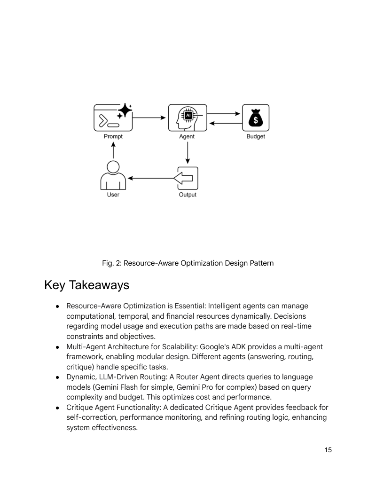
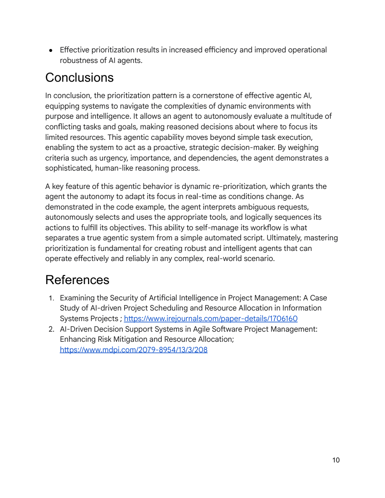

# 模块 11：资源优化与优先级

> 对应 PDF 第 246-261 页（Chapter 16: Resource-Aware Optimization）+ 第 325-334 页（Chapter 20: Prioritization）

---

## 概念地图

- **核心概念**（必须内化）：Resource-Aware Optimization 的动态模型选择机制、Prioritization 的多维度评估框架、两个模式共同回答"有限资源下如何做最优决策"
- **实操要点**（动手时需要）：Router Agent 按查询复杂度分流模型（Gemini Pro vs Flash）、Critique Agent 做质量把关和路由反馈、LangChain Project Manager Agent 的任务创建-排序-分配流程
- **背景知识**（扩展理解）：OpenRouter 统一接口与自动 fallback、六大额外优化技术（上下文裁剪、主动资源预测等）、优先级排序在客服/自动驾驶/金融交易中的应用

---

## 概念讲解

### 1. Resource-Aware Optimization（资源感知优化模式）

**模式名称与一句话定义**：Resource-Aware Optimization（资源感知优化模式）——让 Agent 像一个精打细算的管家，根据任务难度和资源预算，动态选择最合适的模型和工具。

**解决什么问题**：

前面学的模式关注的是"怎么做"（Chaining、Routing、Planning……），但都假设资源是无限的——想用什么模型就用什么模型，想调几次 API 就调几次。现实世界不是这样的：

- **钱不是无限的**：GPT-4o 每次调用的成本是 GPT-4o-mini 的数倍，月底账单可能吓人一跳
- **时间不是无限的**：用户等待 30 秒和 3 秒的体验天差地别
- **算力不是无限的**：边缘设备、移动端没有数据中心那样的资源
- **服务不是永远可用的**：模型 API 会过载、会限流、会宕机

没有资源感知的 Agent 就像一个月光族——每笔消费都选最贵的，月底必然超支。

**直觉建立**：

想象你开了一家餐厅，有两个厨师：

- **主厨**（Gemini Pro / GPT-4o）：手艺精湛，能做各种复杂菜品，但工资很高，做一道菜要 15 分钟
- **帮厨**（Gemini Flash / GPT-4o-mini）：基本功扎实，简单家常菜做得又快又好，工资低，做一道菜只要 3 分钟

如果每道菜都让主厨做：
1. 客人等太久（延迟高）
2. 人工成本爆表（费用高）
3. 主厨忙不过来时，简单菜也没人做（服务不可用）

聪明的餐厅老板会怎么做？安排一个**领班**（Router Agent）：
- 客人点"番茄炒蛋" → 领班直接派给帮厨
- 客人点"分子料理佛跳墙" → 领班派给主厨
- 主厨今天请假了 → 领班启动 fallback，让帮厨尽力而为，总比关门强

这就是 Resource-Aware Optimization 的核心逻辑：**不是每道菜都需要主厨，关键是匹配对了**。

> **类比边界**：餐厅的领班靠经验判断菜品难度，而 Agent 的 Router 需要明确的分类逻辑（规则或 LLM 判断）。另外，Agent 可以在运行时动态切换模型，而厨师不能瞬间变成另一个人。

---

### 2. 核心机制：模型路由（Model Routing）

Resource-Aware Optimization 的核心实现手段是**模型路由**——根据查询复杂度，将请求分发给不同能力等级（和成本等级）的模型。

```
用户查询 → Router Agent（分析复杂度）→ 简单？→ Flash 模型（低成本、快速）
                                      → 复杂？→ Pro 模型（高精度、慢速）
                                      → 需要实时信息？→ 搜索 + 模型
```

**代码示例：ADK QueryRouterAgent**

原书展示了用 Google ADK 实现的路由 Agent。首先定义两个不同成本等级的 Agent：

```python
from google.adk.agents import Agent

# 高能力、高成本 Agent
gemini_pro_agent = Agent(
    name="GeminiProAgent",
    model="gemini-2.5-pro",
    description="A highly capable agent for complex queries.",
    instruction="You are an expert assistant for complex problem-solving."
)

# 低成本、快速 Agent
gemini_flash_agent = Agent(
    name="GeminiFlashAgent",
    model="gemini-2.5-flash",
    description="A fast and efficient agent for simple queries.",
    instruction="You are a quick assistant for straightforward questions."
)
```

然后实现路由逻辑——这里用查询长度做简单判断（生产环境会用 LLM 分类）：

```python
class QueryRouterAgent(BaseAgent):
    async def _run_async_impl(self, context: InvocationContext):
        user_query = context.current_message.text
        query_length = len(user_query.split())

        if query_length < 20:  # 短查询 → Flash（便宜快速）
            response = await gemini_flash_agent.run_async(context.current_message)
            yield Event(author=self.name, content=f"Flash Agent processed: {response}")
        else:  # 长查询 → Pro（强大但贵）
            response = await gemini_pro_agent.run_async(context.current_message)
            yield Event(author=self.name, content=f"Pro Agent processed: {response}")
```

**关键设计决策**：
- 路由判断本身也有成本——用简单规则（如查询长度）做初筛成本几乎为零；用 LLM 做分类更精准但增加了一次 API 调用
- 更高级的路由可以结合 Prompt Tuning 或 Fine-tuning 来提升分类准确率
- 路由粒度可以从"整个查询"细化到"子任务级别"（如旅行规划用 Pro，查航班价格用 Flash）

---

### 3. Critique Agent：质量反馈闭环

光有路由不够——如果 Flash 模型对某个"看起来简单但实际复杂"的查询给了低质量回答怎么办？这时需要一个 **Critique Agent**（评审 Agent）来兜底。

Critique Agent 的三重作用：

| 功能 | 说明 | 类比 |
|------|------|------|
| **自纠错** | 发现回答中的错误和不一致，要求重新生成 | 餐厅的品控经理试菜 |
| **性能监控** | 持续追踪准确率、相关性等指标 | 每月统计客户投诉率 |
| **路由优化** | 反馈给 Router——"这类查询不该给 Flash" | 告诉领班："下次这种菜别派给帮厨了" |

原书给出的 Critique Agent 系统提示：

```python
CRITIC_SYSTEM_PROMPT = """
You are the **Critic Agent**, serving as the quality assurance arm of
our collaborative research assistant system. Your primary function is
to **meticulously review and challenge** information from the
Researcher Agent, guaranteeing **accuracy, completeness, and unbiased
presentation**.

Your duties encompass:
* Assessing research findings for factual correctness and thoroughness
* Identifying any missing data or inconsistencies in reasoning
* Raising critical questions that could refine the current understanding
* Offering constructive suggestions for enhancement
* Validating that the final output is comprehensive and balanced
"""
```

**核心思想**：Critique Agent 不直接管预算，但通过识别"错误路由"（简单查询送 Pro 浪费钱，复杂查询送 Flash 质量差）来间接优化资源分配。这与 Module 02 中的 **Reflection** 模式和 Module 07 中的 **Goal Setting** 模式直接呼应——评审就是"反思"的专业化实现。

---

### 4. OpenRouter：统一接口与自动 Fallback

当你需要访问来自不同供应商的数百个模型时，逐个对接 API 太麻烦。**OpenRouter** 提供了一个统一入口：

```python
import requests, json

response = requests.post(
    url="https://openrouter.ai/api/v1/chat/completions",
    headers={"Authorization": "Bearer <OPENROUTER_API_KEY>"},
    data=json.dumps({
        "model": "openai/gpt-4o",
        "messages": [{"role": "user", "content": "What is the meaning of life?"}]
    })
)
```

OpenRouter 提供两种关键的资源优化路由方式：

| 路由方式 | 配置 | 工作原理 |
|----------|------|---------|
| **自动选择** | `"model": "openrouter/auto"` | 平台根据查询内容自动匹配最优模型 |
| **顺序 Fallback** | `"models": ["claude-3.5-sonnet", "mythomax-l2-13b"]` | 先尝试首选模型，失败则自动降级到下一个 |

顺序 Fallback 是 **Graceful Degradation**（优雅降级）的典型实现——首选模型过载/限流/不可用时，系统不会直接报错，而是自动切换到备选模型继续服务。

---

### 5. 更多优化技术：资源感知的完整工具箱

原书介绍了 Dynamic Model Switching 之外的多种资源优化技术，它们构成了一个完整的优化工具箱：

| 技术 | 做什么 | 日常类比 |
|------|--------|---------|
| **Dynamic Model Switching** | 按任务复杂度选模型 | 简单家务自己做，复杂装修请师傅 |
| **Adaptive Tool Use** | 按成本/延迟选工具和 API | 查天气用免费 App，查法律用付费数据库 |
| **Contextual Pruning** | 裁剪历史对话，只保留相关信息 | 开会前整理议题，不把上次会议纪要全念一遍 |
| **Proactive Resource Prediction** | 预测未来负载，提前分配资源 | 餐厅在周末前多备食材 |
| **Cost-Sensitive Exploration** | 多 Agent 间通信也考虑成本 | 团队沟通时不是所有人都拉进群，只通知相关人 |
| **Graceful Degradation** | 资源不足时降级服务而非崩溃 | 停电时用手电筒继续工作，而不是直接下班 |
| **Parallelization & Distributed Computing** | 分布式处理提升吞吐量 | 多个收银台同时结账 |
| **Learned Resource Allocation** | 根据历史反馈学习更优的分配策略 | 老板根据上月销售数据调整进货量 |

> **重点理解**：这些技术不是互斥的，而是可以**组合使用**。一个成熟的资源感知系统通常同时使用模型路由 + 上下文裁剪 + 自动降级 + 负载预测。



> **图说**：Resource-Aware Optimization 设计模式的视觉总结——用户发送 Prompt 给 Agent，Agent 在 Budget 约束下做出最优的模型和资源选择，然后将 Output 返回给用户。核心是 Agent 与 Budget 之间的动态平衡。

---

### 6. Prioritization（优先级排序模式）

**模式名称与一句话定义**：Prioritization（优先级排序模式）——让 Agent 在面对一堆事情时，能像经验丰富的项目经理一样，判断先做什么、后做什么、什么可以不做。

**解决什么问题**：

Agent 在复杂环境中经常面临"任务爆炸"的困境：

- **多个任务同时到来**：客服系统同时收到 50 条工单
- **目标相互冲突**：既要快又要好，既要省钱又要高质量
- **资源有限**：只有 3 个 Agent 可用，但有 20 个任务排队
- **环境动态变化**：刚排好优先级，突然来了一个紧急事件

没有优先级排序的 Agent 就像一个没有任务管理能力的新人——桌上堆了 20 件事，不知道先做哪个，结果什么都做了一点，什么都没做完。

**直觉建立**：

想象你是一家医院急诊室的**分诊护士**：

病人源源不断地进来，每个人都觉得自己的情况最紧急。你不能按"先来后到"处理，因为：
- 一个心脏病发作的患者（紧急+重要）必须插队到感冒患者（不紧急）前面
- 一个需要验血结果才能手术的患者（有依赖关系），得等检验科先出报告
- 手术室只有两间（资源有限），不能同时给所有人做手术
- 刚安排好手术顺序，突然送来一个车祸伤员（动态变化）

分诊护士的工作就是 Prioritization：**评估每个患者的紧急程度、严重程度和资源需求，动态排出最优处理顺序**。

> **类比边界**：医院分诊有标准化的评分体系（如 ESI 五级分诊），AI Agent 的优先级标准需要根据具体场景定制。另外，分诊护士处理的是人命关天的决策，而大多数 Agent 场景的"降级"后果没那么严重。

**Prioritization 的四个核心步骤**：

```
标准定义 → 任务评估 → 调度排序 → 动态再排序
   │           │           │           │
定义评估规则  逐项打分   选出最优顺序  环境变化时重排
```

---

### 7. 优先级评估的五大维度

原书给出了 Agent 做优先级排序时应考虑的五个维度：

| 维度 | 含义 | 急诊室类比 | Agent 示例 |
|------|------|-----------|-----------|
| **Urgency（紧急性）** | 时间有多敏感？ | 心脏骤停 vs 慢性疼痛 | 服务器宕机 vs 功能优化请求 |
| **Importance（重要性）** | 对核心目标影响多大？ | 生命危险 vs 轻微不适 | 影响全部用户 vs 影响单个用户 |
| **Dependencies（依赖关系）** | 是否是其他任务的前置？ | 先验血才能做手术 | 先部署数据库才能上线应用 |
| **Resource Availability（资源可用性）** | 所需资源是否就绪？ | 手术室是否空闲 | 需要的 API 额度是否充足 |
| **Cost/Benefit（成本收益）** | 投入产出比如何？ | 简单治疗就能大幅改善 | 5 分钟修一个影响 1000 人的 bug |

**关键洞察**：这五个维度不是独立的，它们之间可能存在**冲突**。比如一个任务"很重要但不紧急"（战略规划）和一个任务"很紧急但不重要"（临时小 bug），Agent 需要一个**加权策略**来综合判断。

---

### 8. 代码示例：LangChain Project Manager Agent

原书用 LangChain 实现了一个项目管理 Agent，展示 Prioritization 模式的核心机制。

**系统架构**：

```
用户请求 → Project Manager Agent → 创建任务 → 分配优先级 → 分配人员 → 展示结果
                  │
                  ├── create_new_task 工具
                  ├── assign_priority_to_task 工具（P0/P1/P2）
                  ├── assign_task_to_worker 工具（Worker A/B/Review Team）
                  └── list_all_tasks 工具
```

**任务管理核心——SuperSimpleTaskManager**：

```python
class Task(BaseModel):
    id: str
    description: str
    priority: Optional[str] = None   # P0（最高）, P1, P2（最低）
    assigned_to: Optional[str] = None

class SuperSimpleTaskManager:
    def __init__(self):
        self.tasks: Dict[str, Task] = {}  # 字典存储，O(1) 查找
        self.next_task_id = 1

    def create_task(self, description: str) -> Task:
        task_id = f"TASK-{self.next_task_id:03d}"
        new_task = Task(id=task_id, description=description)
        self.tasks[task_id] = new_task
        self.next_task_id += 1
        return new_task

    def update_task(self, task_id: str, **kwargs) -> Optional[Task]:
        task = self.tasks.get(task_id)
        if task:
            updated_task = task.model_copy(update={k: v for k, v in kwargs.items() if v is not None})
            self.tasks[task_id] = updated_task
            return updated_task
        return None
```

**Agent 的优先级决策逻辑**——关键在系统提示词中：

```python
pm_prompt_template = ChatPromptTemplate.from_messages([
    ("system", """You are a focused Project Manager LLM agent.
When you receive a new task request, follow these steps:
1. First, create the task using `create_new_task` tool.
2. Analyze the user's request for priority or assignee:
   - If "urgent", "ASAP", "critical" → map to P0
   - If a worker is mentioned → assign to that worker
3. If info is missing, make reasonable defaults (P1, Worker A).
4. Use `list_all_tasks` to show the final state.

Available workers: 'Worker A', 'Worker B', 'Review Team'
Priority levels: P0 (highest), P1 (medium), P2 (lowest)
"""),
    ("placeholder", "{chat_history}"),
    ("human", "{input}"),
    ("placeholder", "{agent_scratchpad}")
])
```

**运行示例**：

```python
# 场景 1：紧急任务，指定人员
"Create a task to implement a new login system. It's urgent and should be assigned to Worker B."
# → Agent 创建 TASK-001, 设 P0, 分配给 Worker B

# 场景 2：普通任务，信息不全
"Manage a new task: Review marketing website content."
# → Agent 创建 TASK-002, 默认设 P1, 默认分配给 Worker A
```

**关键设计决策**：
- **优先级映射靠 LLM 语义理解**：Agent 通过理解"urgent""ASAP""critical"等词汇来判断优先级，而非硬编码规则
- **缺省值策略**：信息不全时不拒绝，而是用合理的默认值（P1 + Worker A）继续推进
- **工具调用有顺序约束**：必须先 `create_task` 获取 ID，才能 `assign_priority` 和 `assign_worker`——这本身就是 Dependencies 维度的体现
- **ConversationBufferMemory** 保持上下文：多轮交互中 Agent 记得之前创建的任务

---

### 9. 两个模式的统一视角：有限资源下的决策

Resource-Aware Optimization 和 Prioritization 被放在同一模块，因为它们是同一枚硬币的两面：

| 对比维度 | Resource-Aware Optimization | Prioritization |
|----------|---------------------------|----------------|
| **核心问题** | "用什么资源做这件事？" | "先做哪件事？" |
| **优化对象** | 单个任务的执行方式（选哪个模型/工具） | 多个任务的执行顺序 |
| **决策时机** | 任务到来时实时决策 | 任务堆积时排序决策 |
| **类比** | 餐厅选哪个厨师做这道菜 | 急诊室决定先看哪个病人 |
| **组合使用** | 先用 Prioritization 决定任务顺序，再用 Resource-Aware Optimization 为每个任务选最优执行方式 |

在实际系统中，这两个模式**几乎总是组合使用**：
1. **Prioritization** 先回答"做什么"——从 20 个待办任务中选出最重要的 5 个
2. **Resource-Aware Optimization** 再回答"怎么做"——为每个任务分配最合适的模型和资源

---

## 六大应用场景

| # | 场景 | Resource-Aware Optimization 的体现 | Prioritization 的体现 |
|---|------|-----------------------------------|---------------------|
| 1 | **客服自动化** | 简单查询用 Flash 模型，复杂投诉用 Pro 模型 | 系统宕机工单优先于密码重置，VIP 客户优先 |
| 2 | **自动驾驶** | 常规巡航用轻量模型，紧急避障切换高精度模型 | 紧急刹车 > 保持车道 > 省油优化 |
| 3 | **金融交易** | 日常监控用低成本模型，关键交易用高精度预测 | 高风险止损交易优先于低风险套利 |
| 4 | **网络安全** | 常规扫描用快速规则引擎，可疑流量用深度 AI 分析 | 正在发生的入侵 > 潜在漏洞 > 合规检查 |
| 5 | **项目管理** | 例行更新用轻量 Agent，复杂规划用高级推理模型 | 阻塞他人的任务先做，独立任务可延后 |
| 6 | **云资源调度** | 按负载动态调整实例规格（省钱） | 高峰期优先保障关键业务，低优先级任务排队 |

---

## 模式关联

| 关系类型 | 相关模式 | 说明 |
|----------|---------|------|
| **互补** | Routing（Module 01）| Router Agent 是 Resource-Aware Optimization 的核心实现手段——按复杂度分发到不同模型 |
| **互补** | Reflection（Module 02）| Critique Agent 是 Reflection 的专业化应用——评审回答质量，反馈给路由逻辑 |
| **互补** | Planning（Module 04）| Prioritization 决定"做什么"，Planning 决定"怎么做"——先排优先级，再做计划 |
| **互补** | Goal Setting（Module 07）| 优先级排序需要明确的目标作为排序依据——没有目标就无法判断"重要性" |
| **互补** | Exception Handling（Module 08）| Graceful Degradation 是异常处理的一种——模型不可用时自动降级而非报错 |
| **前置** | Tool Use（Module 03）| 资源优化的前提是有多个工具/模型可选——Tool Use 提供"选项池" |
| **扩展** | Evaluation（Module 14）| 评估系统量化资源使用效率，为优化提供数据依据 |

---

## 重点标记

1. **Resource-Aware Optimization 的核心是"匹配"**：不是总用最强的模型，而是用"刚好够用"的模型——简单任务用 Flash，复杂任务用 Pro
2. **Router Agent 是关键组件**：它需要快速、准确地判断查询复杂度，自身成本要尽量低
3. **Critique Agent 形成反馈闭环**：不只是评审单次回答，更重要的是持续优化路由策略
4. **Graceful Degradation 不可或缺**：首选模型不可用时，降级服务总比完全失败好
5. **Prioritization 的五个维度**：Urgency、Importance、Dependencies、Resource Availability、Cost/Benefit
6. **动态再排序是 Prioritization 的灵魂**：静态排序只是排了个序；真正的智能体需要在环境变化时实时调整优先级
7. **两个模式是"选什么资源"和"做什么事"的组合**：先 Prioritization 选任务，再 Resource-Aware Optimization 选资源，构成完整的资源决策框架



> **图说**：Prioritization 设计模式的视觉总结——Agent 根据紧急性、重要性、依赖关系等标准对任务进行评估和排序，在动态环境中持续调整优先级以确保高效执行。

---

## 自测：你真的理解了吗？

**Q1**：你在运营一个 AI 客服系统，每天处理 10,000 条用户查询。当前所有查询都用 GPT-4o 处理，月成本 $5,000。你打算引入 Resource-Aware Optimization。请设计你的模型路由策略：用什么标准分类查询？分成几个等级？预计能节省多少成本？

**Q2**：Router Agent 本身也需要调用 LLM 来分类查询复杂度。这会不会"为了省钱反而多花钱"？什么情况下路由的成本会超过它带来的节省？你怎么避免这个问题？

**Q3**：原书的 Critique Agent 既做"质量评审"又做"路由优化反馈"。如果你把这两个职责拆成两个独立的 Agent，各有什么好处和坏处？

**Q4**：在项目管理场景中，有这样三个任务：A（紧急但不重要，2 小时截止），B（重要但不紧急，下周截止，是 C 的前置），C（最重要，但依赖 B 的结果）。你会怎么排优先级？用五个维度逐一分析。

**Q5**：Resource-Aware Optimization 和 Prioritization 在实际系统中如何组合使用？设计一个场景：5 个任务同时到来，3 个 Agent 可用（1 个高能力 + 2 个低能力），任务有不同的紧急性和复杂度。写出你的分配方案。
