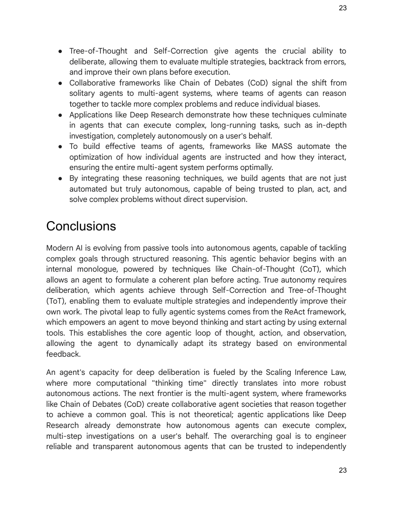

# 模块 12：推理技术

> 对应 PDF 第 262-285 页（Chapter 17: Reasoning Techniques）

---

## 概念地图

- **核心概念**（必须内化）：Chain-of-Thought (CoT) 逐步推理、ReAct 思考-行动-观察循环、Scaling Inference Law（推理扩展定律——小模型 + 更多推理计算可以胜过大模型）
- **实操要点**（动手时需要）：CoT 五步提示结构（Analyze → Formulate → Simulate → Synthesize → Review）、Self-Correction 五步工作流、PALMs 代码生成与 ADK CodeAgent 集成、Deep Research 的 LangGraph 实现
- **背景知识**（扩展理解）：Tree-of-Thought (ToT) 分支探索、RLVR 训练策略、Chain of Debates (CoD) 与 Graph of Debates (GoD)、MASS 多阶段优化框架

---

## 概念讲解

### 1. Chain-of-Thought (CoT) — 思维链

**模式名称与一句话定义**：Chain-of-Thought（思维链）——让 LLM **显式地、逐步地展示推理过程**，将复杂问题分解为一系列中间步骤，而不是直接给出最终答案。

**解决什么问题**：

LLM 默认的工作方式是"一步到位"——你问一个问题，它直接输出答案。对于简单问题这没问题，但面对需要多步推理的复杂问题（数学计算、逻辑推导、多源信息综合），一步到位往往出错。原因在于模型没有"中间草稿纸"来整理思路。

**直觉建立**：

CoT 就是**数学考试中"写出解题过程"的要求**：

| 类比 | 数学考试 | CoT |
|------|---------|-----|
| **不写过程** | 直接写答案，容易算错且无法检查 | LLM 一步给答案，容易出错且不可审计 |
| **写出过程** | 列出每一步推导，错误一目了然 | LLM 逐步展示推理，每步可检查 |
| **老师能看懂** | 过程对了给过程分 | 用户能看到推理轨迹，建立信任 |
| **自己能检查** | 写完回头检查每一步 | 模型可以回溯发现前面步骤的错误 |

更精确地说：CoT 把一个 **高难度的单步跳跃** 变成了一系列 **低难度的小步走**。每一小步模型都有很高的准确率，串起来整体准确率就远高于一步到位。

> **类比边界**：数学考试中的"过程"是学生主动写的，CoT 中的"过程"需要通过 prompt 引导模型产生。模型并不真的"在思考"，而是在生成看起来像思考过程的 token 序列——但这种生成过程确实改善了输出质量。

**工作原理**：

CoT 的实现有两种主要策略：
1. **Few-shot CoT**：在 prompt 中提供带推理过程的示例，模型学着模仿
2. **Zero-shot CoT**：简单地在 prompt 中加一句 "Let's think step by step"

其核心机制：通过要求模型生成中间步骤，引导模型的内部处理走向更审慎、更有逻辑的路径。这不仅提升了准确率，也让推理过程透明可审计。

**示例——CoT 五步提示结构**：

原书给出了一个信息检索 Agent 的 CoT prompt，定义了五步思考流程：

```
You are an Information Retrieval Agent. Your goal is to answer the
user's question comprehensively and accurately by thinking
step-by-step.

Here's the process you must follow:
1. **Analyze the Query:** Understand the core subject and specific
   requirements. Identify key entities, keywords, and the type of
   information being sought.
2. **Formulate Search Queries:** Generate precise search queries
   for retrieving relevant information from a knowledge base.
3. **Simulate Information Retrieval:** Mentally consider what
   information you expect to find. Think about potential ambiguities
   or missing pieces.
4. **Synthesize Information:** Combine gathered information into
   a coherent and complete answer. Ensure all aspects are addressed.
5. **Review and Refine:** Critically evaluate your answer for
   accuracy, comprehensiveness, clarity, and conciseness.
```

**Agent 的思考过程**（以"经典计算机 vs 量子计算机"问题为例）：

| 步骤 | Agent 做了什么 |
|------|--------------|
| Analyze | 识别出用户要两个东西：(1) 区别 (2) 一个应用场景 |
| Formulate | 生成搜索词："differences classical vs quantum computers"、"applications of quantum computing" |
| Simulate | 预期找到：bits vs qubits、superposition、entanglement、drug discovery 等 |
| Synthesize | 整合信息为连贯答案：经典用 bits，量子用 qubits（叠加态），应用于药物发现 |
| Review | 检查：区别讲了吗？应用给了吗？简洁吗？清楚吗？——都满足 |

> **关键洞察**：CoT 已经成为当代 LLM 高级推理能力的 **基石技术**。对于自主 Agent 来说，CoT 使其能够在复杂环境中执行更可靠、可审计的行动。

**适用场景**：

| 适用 | 不适用 |
|------|--------|
| 多步数学计算 | 简单的事实查询（"北京的首都是？"） |
| 逻辑推理与推导 | 创意写作（不需要严格逻辑链） |
| 多源信息综合 | 低延迟要求的场景（CoT 会增加 token 数） |
| 需要审计推理过程的场景 | 答案本身就是一个简单选择 |

---

### 2. Tree-of-Thought (ToT) — 思维树

**模式名称与一句话定义**：Tree-of-Thought（思维树）——在 CoT 的基础上，让模型**同时探索多条推理路径**，形成树状分支结构，支持回溯和路径选择。

**解决什么问题**：

CoT 是一条线性路径——从问题到答案走一条路。但如果这条路走错了呢？CoT 没有"回头路"。ToT 解决的就是"万一第一条路走不通，我还能换条路"的问题。

**直觉建立**：

ToT 就是**在迷宫中探路的策略**：

| 类比 | 迷宫探索 | ToT |
|------|---------|-----|
| **CoT** | 沿一条路走到底，不回头 | 生成一条推理链 |
| **ToT** | 在每个岔路口记录位置，走不通就回退换路 | 在每个中间步骤分支多条推理路径 |
| **评估** | 看哪条路离出口更近 | 评估每个中间状态的质量 |
| **回溯** | 退回上一个岔路口，试另一条 | 放弃低质量路径，转向高质量路径 |

> **类比边界**：迷宫只有一个正确出口，但 ToT 的多条路径可能都有一定质量，最终选择的是"最优"路径而非唯一正确路径。

**工作原理**：

1. **分支（Branch）**：在每个推理步骤生成多个候选的下一步
2. **评估（Evaluate）**：对每个候选路径打分（可以用同一个 LLM 或独立评估器）
3. **选择（Select）**：保留高分路径，剪枝低分路径
4. **回溯（Backtrack）**：如果当前所有路径都不理想，回退到上一层重新分支

这种方法对需要**战略规划和决策**的挑战性任务特别有效。

**适用场景**：

| 适用 | 不适用 |
|------|--------|
| 需要战略规划的任务（游戏、棋类） | 答案唯一且路径清晰的任务 |
| 创意问题解决（存在多种可行方案） | 实时低延迟场景（分支探索很慢） |
| 需要评估多种方案优劣的决策 | 简单的信息提取 |

> **常见误用**：在简单任务上使用 ToT 是浪费计算资源。如果 CoT 的线性推理已经足够准确，不需要引入分支探索的复杂性。ToT 的价值在于**问题确实有多条可行路径且选择困难**的场景。

---

### 3. Self-Correction / Self-Refinement — 自我修正

**模式名称与一句话定义**：Self-Correction（自我修正）——Agent 在生成内容后，**对自己的输出进行批判性审查和迭代修改**，直到满足质量标准。

**解决什么问题**：

LLM 的第一次输出往往不是最优的——可能有事实错误、遗漏、措辞不当、不够吸引人。没有 Self-Correction，用户只能手动发现问题并要求修改。Self-Correction 让 Agent 自己充当"质检员"。

**直觉建立**：

Self-Correction 就是**写作中的"自我编辑"过程**：

写第一稿 → 放下来重读 → 发现"这段不通顺" → 修改 → 再读一遍 → 满意了才交稿。

专业作家从来不把第一稿当成终稿。Self-Correction 让 AI 也有了这种"返工"的能力。

> **类比边界**：人类作家在"放下来重读"时会有时间带来的新视角，AI 的 Self-Correction 没有这种时间效应，但它可以通过明确的检查清单（原始需求对照）来弥补。

**工作原理——五步自我修正工作流**：

原书给出了 Self-Correction Agent 的五步工作流：

| 步骤 | 做什么 | 目的 |
|------|--------|------|
| 1. Understand Original Requirements | 回顾原始需求：目标是什么？约束是什么？ | 建立评判标准 |
| 2. Analyze Current Content | 仔细阅读当前生成的内容 | 了解现状 |
| 3. Identify Discrepancies/Weaknesses | 对照需求找差距：准确性？完整性？清晰度？语气？吸引力？冗余？ | 发现问题 |
| 4. Propose Specific Improvements | 对每个问题提出具体可执行的改进建议 | 制定修改方案 |
| 5. Generate Revised Content | 基于改进建议重写内容 | 产出改进版本 |

**示例**（社交媒体推文优化）：

```
原始需求："Write a short, engaging social media post (max 150 chars)
announcing 'GreenTech Gadgets'."

初稿："We have new products. They are green and techy. Buy GreenTech
Gadgets now!" (64 chars)

Agent 的自我审查：
- 吸引力？不够，听起来很平淡
- 生态友好？只隐含在 "green" 中，没有明确强调
- 行动号召？"Buy now!" 可以更有力
- 影响力？缺乏新品发布的兴奋感

修改后："🌱 Discover GreenTech Gadgets! Our new eco-friendly line
blends innovation with sustainability. Go green, go smart! Shop now!
#EcoFriendly #GreenTech" (148 chars)
```

> **关键洞察**：Self-Correction 本质上是在 Agent 的内容生成流程中 **内置了质量控制机制**。它与 Module 02 中的 Reflection 模式高度相关——Reflection 是对推理过程的反思，Self-Correction 是对输出内容的修正，两者可以组合使用。

---

### 4. Program-Aided Language Models (PALMs) — 程序辅助语言模型

**模式名称与一句话定义**：PALMs（程序辅助语言模型）——让 LLM **生成并执行代码**来完成需要精确计算的任务，将"擅长理解和生成"的语言能力与"擅长精确计算"的编程能力结合。

**解决什么问题**：

LLM 有一个众所周知的弱点：**数学计算不靠谱**。让 GPT 算 "17.3 * 42.8" 可能得到一个近似但不精确的答案。LLM 本质上是在"预测下一个 token"，不是在"做算术"。PALMs 的思路是：让 LLM 干它擅长的事（理解问题、写代码），把它不擅长的事（精确计算）交给确定性的编程环境。

**直觉建立**：

PALMs 就是**会写计算器程序的助手**：

你问一个复杂的利息计算问题。普通 LLM 像是一个口算能力一般的人，硬算容易出错。PALMs 像是一个理解力很强、同时随身带着计算器的人——他先理解你的问题，然后在计算器上按出正确的公式，把精确结果告诉你。

> **类比边界**：PALMs 的"计算器"不局限于数学——它可以生成任何 Python 代码来处理数据操作、逻辑推理、API 调用等，范围比计算器广得多。

**示例——ADK 中的 CodeAgent**：

```python
from google.adk.tools import agent_tool
from google.adk.agents import Agent
from google.adk.tools import google_search
from google.adk.code_executors import BuiltInCodeExecutor

search_agent = Agent(
    model='gemini-2.0-flash',
    name='SearchAgent',
    instruction="""You're a specialist in Google Search""",
    tools=[google_search],
)

coding_agent = Agent(
    model='gemini-2.0-flash',
    name='CodeAgent',
    instruction="""You're a specialist in Code Execution""",
    code_executor=[BuiltInCodeExecutor],
)

root_agent = Agent(
    name="RootAgent",
    model="gemini-2.0-flash",
    description="Root Agent",
    tools=[agent_tool.AgentTool(agent=search_agent),
           agent_tool.AgentTool(agent=coding_agent)],
)
```

> **代码解读**：这是一个多 Agent 架构——`RootAgent` 负责协调，遇到搜索任务分派给 `SearchAgent`，遇到需要精确计算的任务分派给 `CodeAgent`（拥有 `BuiltInCodeExecutor` 能力）。这就是 PALMs 理念在 ADK 框架中的实际应用。

**适用场景**：

| 适用 | 不适用 |
|------|--------|
| 数学计算、统计分析 | 纯文本生成（写文章、翻译） |
| 数据处理与转换 | 主观判断（评估语气、情感） |
| 逻辑推理需要精确性的场景 | 不需要精确计算的对话 |
| 需要调用 API 获取数据 | 安全敏感环境（代码执行有风险） |

---

### 5. Reinforcement Learning with Verifiable Rewards (RLVR) — 可验证奖励的强化学习

**模式名称与一句话定义**：RLVR（可验证奖励的强化学习）——一种**训练策略**，通过在有明确正确答案的问题（数学、编程）上进行试错学习，让模型学会生成高质量的长链推理过程。

**解决什么问题**：

标准的 CoT 是通过 prompt 引导出来的，本质上比较"浅"——模型生成的推理链是固定模式的，不会根据问题难度动态调整。RLVR 解决的是**从根本上训练出真正会推理的模型**的问题。

**直觉建立**：

如果说 CoT 是**给学生一套解题模板**（"先分析、再列式、再计算"），RLVR 就是**让学生通过大量做题自己摸索出解题策略**：

| 类比 | 教学方式 | 推理方式 |
|------|---------|---------|
| CoT | 老师教模板："遇到应用题先画图" | 通过 prompt 引导固定推理模式 |
| RLVR | 给学生大量有标准答案的题目，答对奖励，答错惩罚，让学生自己发展解题策略 | 在有正确答案的数据上强化学习，模型自己演化出推理能力 |

> **类比边界**：RLVR 是一种**训练时**的技术，不是推理时的 prompt 技巧。你不能在使用模型时"应用 RLVR"，而是模型出厂前就已经经过了 RLVR 训练。

**工作原理**：

1. **训练数据**：选择有明确正确答案的问题（数学题、编程题——答案可以被自动验证）
2. **试错学习**：模型生成推理过程 + 答案 → 自动检查答案对不对 → 对了奖励、错了惩罚
3. **能力涌现**：经过大量训练，模型学会了自我修正、回溯、对难题投入更多"思考 token"

**关键特征**——RLVR 训练出的"推理模型"：

| 特征 | 说明 |
|------|------|
| **可变思考时间** | 难题生成更长的推理链（可达数千 token），简单题则短 |
| **自我修正** | 在推理过程中发现错误会主动回溯修正 |
| **推理轨迹** | 不只给答案，还展示完整的规划、监控和评估过程 |
| **无需人工监督** | 通过可验证的奖励信号（答案对不对）自动学习，不需要人工标注推理过程 |

> **关键洞察**：RLVR 是 DeepSeek-R1、OpenAI o1/o3 等"推理模型"背后的核心训练方法。这些模型之所以能在数学和编程上大幅超越前代，正是因为通过 RLVR 学会了"深度思考"。

---

### 6. ReAct (Reasoning + Acting) — 推理与行动

**模式名称与一句话定义**：ReAct（推理与行动）——将 CoT 的推理能力与**工具调用能力交织运行**，Agent 在"思考—行动—观察"的循环中动态推进任务。

**解决什么问题**：

CoT 只是"想"——模型在脑子里推理，但不和外部世界交互。当任务需要**实时获取信息**（查搜索引擎、查数据库、调 API）时，纯 CoT 就无能为力了。ReAct 把"想"和"做"结合起来。

**直觉建立**：

ReAct 就是**侦探办案的过程**：

| 阶段 | 侦探 | ReAct Agent |
|------|------|------------|
| **Thought（思考）** | "根据线索，嫌疑人可能在 A 区，我应该去那里调查" | Agent 分析当前信息，制定下一步计划 |
| **Action（行动）** | 去 A 区走访、采集证据 | 调用工具（搜索、查数据库、执行代码） |
| **Observation（观察）** | 发现新线索："目击者说看到嫌疑人往 B 区走了" | 获取工具返回的结果 |
| **下一轮 Thought** | "新线索指向 B 区，我需要调整方向" | 根据观察结果更新推理，调整计划 |

这个循环会一直重复，直到 Agent 认为已经有足够信息给出最终答案（侦探认为案件已破）。

> **类比边界**：侦探的"行动"是物理世界的，ReAct Agent 的"行动"是数字世界的工具调用。但核心逻辑一致——**推理驱动行动，行动结果反馈给推理**。

**工作原理**：

```
Thought → Action → Observation → Thought → Action → Observation → ... → Finish
```

1. **Thought（思考）**：Agent 生成一段文字，分析当前状况、制定计划
2. **Action（行动）**：基于思考，从预定义的动作集中选择一个执行（搜索、查网页、给出答案）
3. **Observation（观察）**：接收环境反馈（搜索结果、网页内容）
4. **循环**：观察结果注入下一轮思考，直到 Agent 执行 "finish" 动作

**思考频率可调**：
- **知识密集型任务**（如事实核查）：每个 Action 前都要 Thought，确保信息收集有逻辑
- **决策密集型任务**（如环境导航）：Thought 可以更稀疏，Agent 自行决定何时需要思考

> **关键洞察**：ReAct 是大多数现代 Agent 框架的**核心操作循环**。Module 03 中的 Tool Use、Module 06 中的 MCP、甚至 Module 04 中的 Multi-Agent 系统，底层的 Agent 行为模式往往就是 ReAct 循环。可以说，ReAct 是让 Agent 从"只能想"进化到"能想又能做"的关键范式。

**适用场景**：

| 适用 | 不适用 |
|------|--------|
| 需要查询外部信息的问答 | 不需要外部信息的推理（纯数学证明） |
| 多步骤任务执行（研究、分析） | 单步即可完成的任务 |
| 需要根据实时反馈调整策略 | 固定流程、不需要动态调整 |
| 事实核查、调查研究 | 创意生成（不需要工具交互） |

---

### 7. Chain of Debates (CoD) — 辩论链

**模式名称与一句话定义**：Chain of Debates（辩论链）——由微软提出的框架，让**多个不同的模型像"AI 委员会"一样协作辩论**，通过集体智慧提升答案质量。

**解决什么问题**：

单个 Agent 的推理可能有偏见、有盲点。就像一个人做决策容易陷入思维定式，CoD 通过引入多个"不同声音"来对冲偏见、提升准确性。

**直觉建立**：

CoD 就是**学术论文的同行评审（Peer Review）**：

- 作者提交论文（初始观点）
- 审稿人 A 说"方法论有问题"
- 审稿人 B 说"结论推导不严谨"
- 作者根据反馈修改
- 多轮来回后，论文质量显著提升

CoD 中的多个模型就像不同的审稿人，各自从自己的角度提出质疑和改进，最终产出比任何单一模型都更可靠的结论。

**工作原理**：

1. 多个模型各自给出初始答案
2. 模型之间互相批评对方的推理
3. 交换反驳意见（counterarguments）
4. 经过多轮辩论，收敛到一个经过集体验证的答案

**核心价值**：

| 维度 | 效果 |
|------|------|
| **准确性** | 多视角交叉验证减少错误 |
| **偏见** | 不同模型的偏见倾向不同，互相抵消 |
| **透明度** | 辩论记录形成可追溯的推理过程 |
| **可信度** | 从"一个 AI 说的"变成"一个 AI 团队论证过的" |

---

### 8. Graph of Debates (GoD) — 辩论图

**模式名称与一句话定义**：Graph of Debates（辩论图）——将辩论建模为**动态的非线性网络**（而非简单的链式序列），每个论点是节点，节点间用"支持"或"反驳"边连接。

**解决什么问题**：

CoD 是线性的——A 说完 B 说，B 说完 C 说。但真实的讨论是**多线程的**：一个话题可能同时产生三条分支，有的分支后来合并了，有的独立发展。GoD 用图结构捕捉这种复杂性。

**直觉建立**：

如果说 CoD 是一场**有序的圆桌会议**（一个人讲完下一个人讲），GoD 就是一个**在线论坛的帖子网络**：

| CoD（圆桌会议） | GoD（论坛网络） |
|----------------|---------------|
| 发言有先后顺序 | 任何人可以随时回复任何帖子 |
| 线性讨论 | 多线程分支讨论 |
| 结论在讨论末尾产生 | 结论通过识别"最强支持簇"产生 |

> **类比边界**：论坛帖子往往质量参差不齐，而 GoD 中的"帖子"（论点节点）每个都是由 AI 模型产生的有结构化的推理。

**工作原理**：

1. **节点**：每个论点/论据是一个独立节点
2. **边**：节点间的关系标注为 `supports`（支持）或 `refutes`（反驳）
3. **动态分支**：新的探究线可以随时从任何节点分出
4. **结论判定**：不是看"最后谁说了什么"，而是在整个图中找到**最健壮、支持最充分的论点簇**

**"well-supported"的含义**：
- **Ground truth**（公认事实）
- **Search grounding**（通过搜索验证的事实证据）
- **Multi-model consensus**（多个模型在辩论中达成的共识）

---

### 9. MASS (Multi-Agent System Search) — 多智能体系统搜索

**模式名称与一句话定义**：MASS（多智能体系统搜索）——一个自动化框架，通过**三阶段优化**（个体 prompt → 系统拓扑 → 全局 prompt）来设计最优的多 Agent 系统。

**解决什么问题**：

设计多 Agent 系统有两个关键变量：(1) 每个 Agent 的 prompt 怎么写，(2) Agent 之间怎么连接（拓扑结构）。这两个变量的组合空间极其庞大，手工设计往往得不到最优解。MASS 把这个设计过程自动化了。

**直觉建立**：

MASS 就是**组建和训练一支足球队**的三步流程：

| 阶段 | 足球类比 | MASS |
|------|---------|------|
| **第一步：选拔球员** | 每个位置选最好的球员，独立训练 | Block-Level Prompt Optimization——独立优化每个 Agent 类型的 prompt |
| **第二步：安排阵型** | 测试不同阵型（4-4-2？3-5-2？），找最有效的配合方式 | Workflow Topology Optimization——搜索最优的 Agent 交互拓扑 |
| **第三步：磨合配合** | 确定阵型后，让球员一起训练磨合默契 | Workflow-Level Prompt Optimization——在最优拓扑上全局微调所有 prompt |

> **类比边界**：足球队受限于物理规则和人体能力，MASS 的搜索空间是 prompt 文本和拓扑图结构，优化方式是自动化的算法搜索而非人工试错。

**三阶段优化详解**：

**阶段 1：Block-Level Prompt Optimization**

独立优化每个 Agent 类型（"block"）的 prompt。确保每个组件在被集成到更大系统之前就已经表现良好。

例：在 HotpotQA 数据集上，一个 "Debator" Agent 的优化 prompt 被框定为 "expert fact-checker for a major publication"——通过角色扮演让它成为专业的事实核查者。

**阶段 2：Workflow Topology Optimization**

在第一阶段的基础上，搜索最优的 Agent 交互拓扑。使用 **influence-weighted method**（影响力加权方法）——计算每种拓扑相对于基线的性能增益，用增益分数引导搜索方向。

例：在 MBPP 编码任务上，搜索发现最优拓扑是"predictor agent 做多轮反思 + executor agent 用测试用例验证代码"——迭代自我修正 + 外部验证的组合。

**阶段 3：Workflow-Level Prompt Optimization**

确定最优拓扑后，把所有 Agent 的 prompt 作为整体进行联合优化，考虑 Agent 之间的依赖关系。

例：在 DROP 数据集上，最终优化的 Predictor Agent prompt 包含三个层次：(1) 数据集元知识概述，(2) few-shot 正确示例，(3) 高风险场景角色扮演（"你是为紧急新闻直播提取关键数值的 AI"）。

**关键设计原则**（MASS 研究得出）：

1. **先优化个体**：组合之前确保每个 Agent 都有高质量 prompt
2. **用影响力引导搜索**：不是盲目搜索所有可能拓扑，而是优先组合有"增益"的拓扑
3. **最后做全局优化**：建模和优化 Agent 间的依赖关系

> **关键洞察**：MASS 的实验表明，其优化的多 Agent 系统显著优于人工设计的系统和其他自动化设计方法。这意味着多 Agent 系统的设计将越来越多地由自动化工具完成，而非人工调试。

---

### 10. Scaling Inference Law — 推理扩展定律

**模式名称与一句话定义**：Scaling Inference Law（推理扩展定律）——一个核心性能原则：**在推理阶段投入更多计算资源，可以让较小的模型达到甚至超越更大模型的性能**。

**解决什么问题**：

直觉告诉我们"大模型更好"——参数越多、训练数据越多，性能越强。但这意味着部署成本巨大。Scaling Inference Law 揭示了另一条路：**不一定要用更大的模型，给小模型更多"思考时间"也许能达到同样效果**。

**直觉建立**：

这就是**考试时间与答题质量的关系**：

| 类比 | 考试场景 | AI 推理 |
|------|---------|--------|
| **大模型 + 快速推理** | 天才学生做限时考试——很聪明但时间紧可能粗心 | 大模型一次生成答案 |
| **小模型 + 充足推理** | 普通学生做开卷考试、不限时——仔细查资料、反复验算 | 小模型生成多个候选答案 + 选择最优 |
| **关键发现** | 给普通学生足够时间，分数可能超过限时考试的天才 | 小模型 + 更多推理计算 ≥ 大模型 + 简单推理 |

> **类比边界**：考试中"足够时间"是线性的，而 AI 的"推理计算"包括多种策略（多候选生成、beam search、self-consistency、迭代精修），不仅仅是"想更久"。

**核心内涵**：

Scaling Inference Law 与训练阶段的 Scaling Law（更多数据 + 更多算力 → 更好模型）不同，它关注的是**模型已经训练好之后，在使用阶段怎么分配计算资源**。

**增加推理计算的策略**：

| 策略 | 说明 |
|------|------|
| **多候选生成** | 让模型生成多个答案，选最好的（diverse beam search） |
| **Self-consistency** | 生成多条推理链，对最终答案投票取多数 |
| **迭代精修** | 生成 → 评估 → 改进 → 再评估（Self-Correction） |
| **更长的推理链** | 允许模型生成更多中间步骤（更大的"thinking budget"） |

**对 Agent 系统设计的实际意义**：

| 决策因素 | 影响 |
|----------|------|
| **模型大小** | 小模型内存和存储需求更低 |
| **响应延迟** | 更多推理计算会增加延迟，但性能提升可能值得 |
| **运营成本** | 大模型部署成本高，小模型 + 推理优化可能更经济 |
| **部署策略** | 不再是"越大越好"，而是"在推理预算内找最优平衡点" |

> **关键洞察**：这条定律挑战了"bigger is better"的朴素认知。它为 Agent 系统设计者提供了一个经济学框架——在模型大小、响应延迟和运营成本之间找到最优平衡。

---

### 11. Deep Research — 深度研究

**模式名称与一句话定义**：Deep Research（深度研究）——一类 AI Agent 工具，能作为**不知疲倦的研究助手**，通过迭代的搜索-推理-精修循环，自主完成复杂的调研任务。

**解决什么问题**：

普通搜索引擎给你链接，**综合分析的工作还是你自己做**。Deep Research 把搜索和综合分析都自动化了——你只需要提一个复杂问题，给它几分钟的"时间预算"，就能得到一份结构化的研究报告。

**直觉建立**：

普通搜索 vs Deep Research 就像**去图书馆自己找书** vs **请一个专业研究助理帮你做文献综述**：

| 普通搜索 | Deep Research |
|---------|--------------|
| 给你一堆链接，自己阅读、筛选、综合 | 给你一份综合报告，包含来源引用 |
| 一次搜索一个查询 | 多轮搜索，每轮根据上一轮结果调整方向 |
| 手动发现信息缺口 | 自动识别知识缺口并补充搜索 |
| 几秒出结果但需要小时级的后续工作 | 几分钟出结果但质量接近人工研究 |

**工作原理——四步迭代循环**：

| 步骤 | 做什么 |
|------|--------|
| 1. Initial Exploration | 基于原始问题运行多个针对性搜索 |
| 2. Reasoning and Refinement | 阅读分析第一波结果，综合发现，识别缺口、矛盾和需要深入的领域 |
| 3. Follow-up Inquiry | 基于内部推理执行更精细的搜索来填补缺口 |
| 4. Final Synthesis | 经过多轮迭代后，将所有验证过的信息编译为结构化报告 |

**主要平台**：Google Gemini Deep Research、Perplexity AI、OpenAI ChatGPT 的高级研究功能。

**代码示例——LangGraph 实现的 DeepSearch**：

```python
# Create our Agent Graph
builder = StateGraph(OverallState, config_schema=Configuration)

# Define the nodes we will cycle between
builder.add_node("generate_query", generate_query)
builder.add_node("web_research", web_research)
builder.add_node("reflection", reflection)
builder.add_node("finalize_answer", finalize_answer)

# Set the entrypoint
builder.add_edge(START, "generate_query")

# Parallel branch for web research
builder.add_conditional_edges(
    "generate_query", continue_to_web_research, ["web_research"]
)

# Reflect on the web research
builder.add_edge("web_research", "reflection")

# Evaluate: continue research or finalize
builder.add_conditional_edges(
    "reflection", evaluate_research, ["web_research", "finalize_answer"]
)

# Finalize the answer
builder.add_edge("finalize_answer", END)

graph = builder.compile(name="pro-search-agent")
```

> **代码解读**：这是 Google 开源的 DeepSearch 实现（`gemini-fullstack-langgraph-quickstart`）。核心架构是一个 LangGraph 状态图，包含四个节点：生成查询 → Web 研究 → 反思 → 最终答案。关键在于 `reflection` 节点的条件边——如果反思发现知识缺口，就回到 `web_research` 继续搜索；如果信息已充分，就进入 `finalize_answer`。这实现了搜索-推理-精修的迭代循环。

> **注意**：该项目使用 React + Vite 前端 + LangGraph 后端，生产部署需要 Redis（实时流式输出）和 Postgres（数据管理），采用 Apache License 2.0 开源。

---

### 12. Agent 的思考过程总结——"What do agents think?"

原书在章末总结了 Agent 思考过程的本质：

**Agent 的"思考"是一个结构化过程**，结合推理和行动来解决问题。其核心由 LLM 驱动，通过 Thought-Action-Observation 循环运作：

| 阶段 | 做什么 | 产出 |
|------|--------|------|
| **Thought** | 生成文字来分解问题、制定计划、分析现状 | 内部独白，使推理透明 |
| **Action** | 从预定义动作集中选择一个执行 | 搜索、查网页、调 API、给出答案 |
| **Observation** | 接收环境反馈 | 搜索结果、网页内容、API 响应 |

**思考频率可调**：
- 知识密集型任务（事实核查）→ 每个 Action 前都 Thought
- 决策密集型任务（环境导航）→ 按需 Thought，让 Agent 自己决定何时思考

> **核心原则**：通过让推理过程显式化，Agent 可以制定透明的多步计划——这是自主行动和用户信任的基础能力。

---

## 应用场景

| # | 场景 | 适用技术 | 具体应用方式 |
|---|------|---------|------------|
| 1 | **复杂问答** | CoT + ReAct | 多跳查询，需要整合多源信息和逻辑推理 |
| 2 | **数学问题求解** | CoT + PALMs | 拆分为子问题，用代码执行精确计算 |
| 3 | **代码调试与生成** | Self-Correction + PALMs | 生成代码 → 运行测试 → 分析错误 → 修改 → 重复 |
| 4 | **战略规划** | ToT + ReAct | 多方案评估 + 实时反馈调整 |
| 5 | **医学诊断** | CoT + ReAct | 系统评估症状、检查结果、病史，调用外部知识库 |
| 6 | **法律分析** | CoT + Self-Correction | 分析法律文件和先例，逻辑自洽性验证 |
| 7 | **深度调研** | Deep Research | 自主执行多轮搜索-推理-精修循环 |
| 8 | **多 Agent 系统优化** | MASS | 自动化设计 prompt 和拓扑结构 |
| 9 | **高风险决策** | CoD / GoD | 多模型辩论降低偏见，提升可靠性 |

---

## 模式关联

| 关系类型 | 相关模式 | 说明 |
|----------|---------|------|
| **基础** | Reflection（Module 02） | Reflection 是"推理过程的反思"，Self-Correction 是"输出内容的修正"——两者都是自我改进，但作用层不同 |
| **应用** | Tool Use（Module 03） | ReAct 是 Tool Use 的推理增强版——不只调用工具，还在调用前后进行推理和计划 |
| **组合** | Planning（Module 04） | ToT 和 Planning 都涉及多路径评估和选择，ToT 侧重推理路径，Planning 侧重任务分解 |
| **组合** | Multi-Agent（Module 04） | CoD、GoD、MASS 都是多 Agent 场景下的推理增强——多个 Agent 协作推理 |
| **支撑** | Memory（Module 05） | ReAct 的 Observation 需要存入上下文（短期记忆），长推理链更依赖记忆管理 |
| **互补** | Resource Optimization（Module 11） | Scaling Inference Law 是资源优化在推理阶段的具体体现——如何分配推理计算预算 |
| **互补** | RAG（Module 09） | ReAct + RAG 是知识密集型问答的黄金组合——ReAct 提供推理循环，RAG 提供知识检索 |

---

## 重点标记

1. **CoT 是基石**：Chain-of-Thought 是所有高级推理技术的基础——让 LLM 的推理过程从"黑盒"变为"透明链条"
2. **ReAct = 想 + 做**：ReAct 的 Thought-Action-Observation 循环是大多数现代 Agent 的核心操作模式
3. **Self-Correction 内置质控**：不依赖外部评审，Agent 自己审查自己的输出——但需要明确的检查标准（原始需求对照）
4. **PALMs 弥补 LLM 短板**：让 LLM 做它擅长的（理解、生成），把精确计算交给代码执行
5. **Scaling Inference Law 挑战"越大越好"**：小模型 + 更多推理计算可以比大模型 + 简单推理更好——Agent 设计者需要在模型大小和推理预算之间找平衡
6. **RLVR 是推理模型的"内功"**：训练阶段的技术，让模型从根本上学会深度推理，而非仅靠 prompt 引导
7. **Deep Research = 推理技术的集大成应用**：将 CoT + Self-Correction + ReAct + Web Search 融合为自主的迭代研究流程
8. **从单体到群体**：CoD/GoD/MASS 代表推理的未来方向——多 Agent 协作推理比单 Agent 独立推理更强大



> **图说**：Chapter 17 关键要点总结和结论部分——列出了推理技术的核心收获：显式推理使 Agent 能制定透明的多步计划；ReAct 提供核心操作循环；Scaling Inference Law 揭示思考时间对性能的影响；CoT 是内部独白的结构化方式；ToT 和 Self-Correction 赋予 Agent 深思熟虑的能力；CoD 标志着从单体到群体推理的转变；Deep Research 展示了自主执行复杂任务的实际应用；MASS 自动化多 Agent 系统设计。

---

## 自测：你真的理解了吗？

**Q1**：你的 Agent 需要回答"2024 年全球前五大经济体的 GDP 总和是多少？"这个问题。你会组合使用哪些推理技术？为什么单用 CoT 不够？

**Q2**：你的团队预算有限，只能部署一个 7B 参数的小模型，但任务是解决竞赛级别的数学题。根据 Scaling Inference Law，你会采取什么策略来最大化性能？具体用哪些推理增强技术？

**Q3**：一个法律分析 Agent 用 CoT 生成了一份法律论证，但其中引用了一个不存在的判例（幻觉）。Self-Correction 能解决这个问题吗？如果不能，你会怎么设计系统来防止这种错误？

**Q4**：你需要为一个医疗诊断场景选择推理框架。候选方案：(A) 单个模型 + CoT (B) 单个模型 + ReAct + 医学数据库 (C) 多个模型 + CoD。请分析各方案的优劣，并说明你的推荐。

**Q5**：MASS 的三阶段优化为什么要先优化个体 prompt、再优化拓扑、最后全局优化？能不能跳过第一步直接从拓扑优化开始？请用足球队的类比解释为什么不行。
