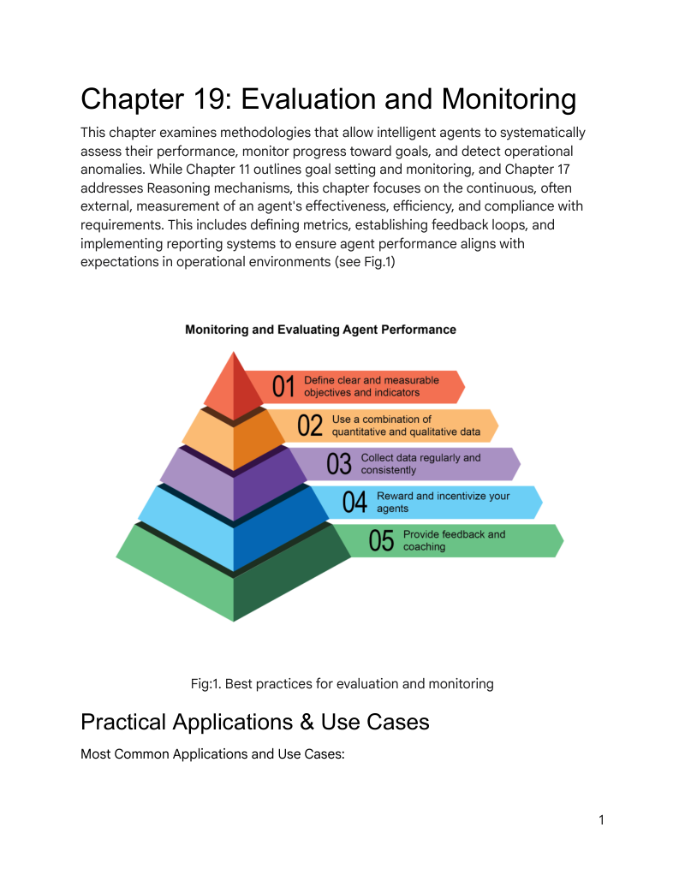
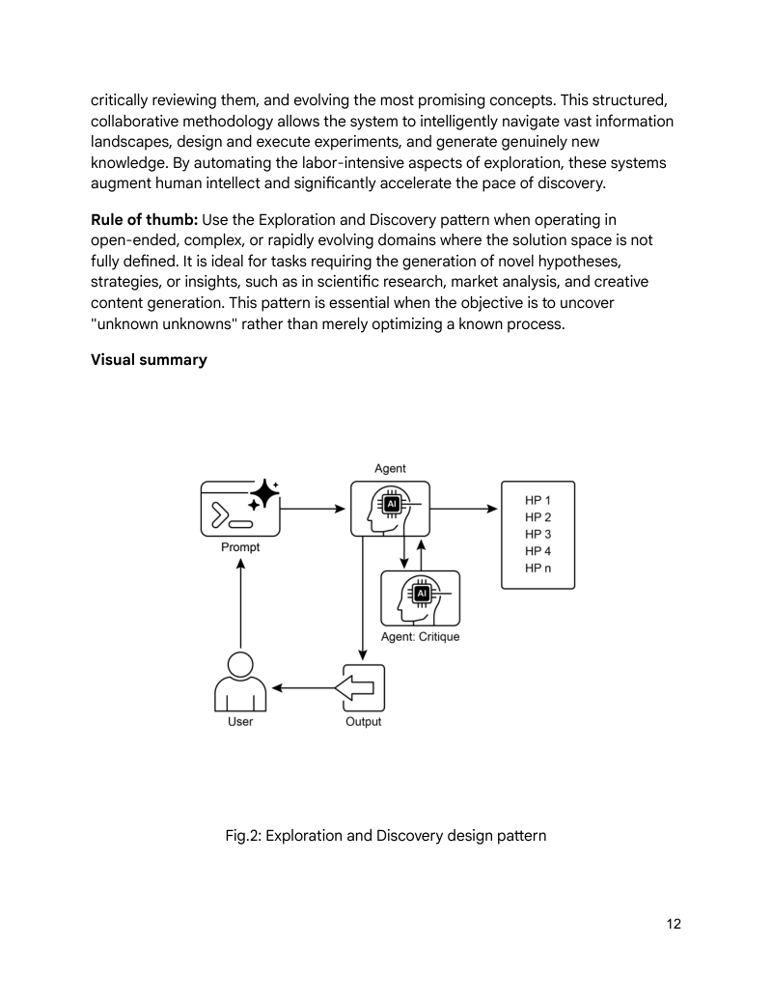

# 模块 14：评估、监控与探索

> 对应 PDF 第 306-324 页（Chapter 19: Evaluation and Monitoring）+ 第 335-348 页（Chapter 21: Exploration and Discovery）

---

## 概念地图

- **核心概念**（必须内化）：Evaluation and Monitoring 的三层评估体系（响应准确度 / 延迟 / Token 消耗）、Agent 轨迹评估的五种匹配方法、LLM-as-a-Judge 评估范式、Contractor 框架的四大支柱、Exploration and Discovery 的"生成→辩论→进化"闭环
- **实操要点**（动手时需要）：Response Accuracy / Latency / Token Usage 的代码实现、Test File vs Evalset File 的结构化评估、Google ADK 三种评估方式（adk web / pytest / adk eval）、Agent Laboratory 多角色协作的科研流程
- **背景知识**（扩展理解）：从简单 Agent 到 Contractor 的演进路径、Google Co-Scientist 六大专业化 Agent 的设计哲学、"评估驱动探索"的测量→改进闭环

---

## 概念讲解

### 1. Evaluation and Monitoring（评估与监控模式）

**模式名称与一句话定义**：Evaluation and Monitoring（评估与监控模式）——系统化地度量 Agent 的有效性、效率和合规性，让"好不好"从主观感觉变成可量化的指标。

**解决什么问题**：

Module 07 讲了 Goal Setting and Monitoring——"设目标 + 追进度"。但那只是 Agent 内部的自我检查。到了生产环境，你需要回答更系统的问题：

- **Agent 的回答对不对？** 不只是"能跑"，还要"跑得准"
- **响应快不快？** 延迟太高，用户体验崩盘
- **花了多少钱？** Token 用量直接影响运营成本
- **做事路径合不合理？** 不只看结果，还要看推理过程（轨迹）
- **多 Agent 协作有效吗？** 系统层面的协同评估

**直觉建立**：

想象你经营一家连锁餐厅。Module 07 的目标监控相当于厨师自己检查菜品——"这道菜做好了吗？"。但 Evaluation and Monitoring 是**一套完整的质量管理体系**：

1. **神秘顾客**（Response Accuracy）——随机测试菜品质量
2. **出餐计时器**（Latency Monitoring）——追踪从下单到上菜的时间
3. **食材成本表**（Token Usage Tracking）——每道菜用了多少食材、花了多少钱
4. **流程审计**（Trajectory Evaluation）——厨师是按标准流程做的，还是走了弯路？
5. **LLM 美食评论家**（LLM-as-a-Judge）——请专业评审来做主观品质评分

> **类比边界**：餐厅质检可以靠人工品尝，但 Agent 的输出是概率性的、非确定性的——同一个输入可能产生不同输出。这要求评估方法本身也必须适应这种不确定性，而非简单的 pass/fail。



> **图说**：监控和评估 Agent 性能的五个最佳实践层次——从定义可衡量目标、结合定量与定性数据、规律收集数据、激励机制，到提供反馈与辅导。

---

### 2. 三大评估组件：准确度、延迟、Token 消耗

**Response Accuracy（响应准确度）**：

最基本的评估——Agent 的回答对不对？原书展示了一个简单的精确匹配函数：

```python
def evaluate_response_accuracy(agent_output: str, expected_output: str) -> float:
    """基于精确匹配的准确度评分"""
    return 1.0 if agent_output.strip().lower() == expected_output.strip().lower() else 0.0
```

**问题**：这种精确匹配太脆了。"The capital of France is Paris" 和 "Paris is the capital of France" 语义相同，但精确匹配返回 0.0。

**更好的方案**：
- **字符串相似度**：Levenshtein 距离、Jaccard 相似度
- **关键词分析**：检查关键词是否存在
- **语义相似度**：用 Embedding 模型计算余弦相似度
- **LLM-as-a-Judge**：用 LLM 评估主观质量（下文详述）
- **RAG 专用指标**：Faithfulness、Relevance

**Latency Monitoring（延迟监控）**：

对实时交互场景至关重要。原书建议不要只打印到控制台，应该写入持久化存储：
- 结构化日志（JSON）
- 时序数据库（InfluxDB、Prometheus）
- 数据仓库（Snowflake、BigQuery、PostgreSQL）
- 可观测性平台（Datadog、Splunk、Grafana Cloud）

**Token Usage Tracking（Token 消耗追踪）**：

LLM 的计费基于 Token 数量，追踪 Token 用量对成本控制和资源优化至关重要：

```python
class LLMInteractionMonitor:
    def __init__(self):
        self.total_input_tokens = 0
        self.total_output_tokens = 0

    def record_interaction(self, prompt: str, response: str):
        input_tokens = len(prompt.split())   # 实际应用中使用 API 的 tokenizer
        output_tokens = len(response.split())
        self.total_input_tokens += input_tokens
        self.total_output_tokens += output_tokens

    def get_total_tokens(self):
        return self.total_input_tokens, self.total_output_tokens
```

> **关键洞察**：这三个指标构成了 Agent 评估的"不可能三角"——追求更高准确度通常意味着更高延迟和更多 Token 消耗。系统设计时需要明确优先级。

---

### 3. LLM-as-a-Judge（LLM 担当评审）

**一句话定义**：用一个 LLM 来评估另一个 Agent 的输出质量——把"主观评价"变成可扩展的自动化流程。

**解决什么问题**：

有些质量维度（如"有用性"、"清晰度"、"中立性"）无法用简单指标衡量，但人工评估又难以规模化。LLM-as-a-Judge 提供了一个折中方案——用 LLM 的高级语言理解能力做"类人"的定性评估。

**代码示例：LLMJudgeForLegalSurvey**

原书展示了一个法律调查问卷质量评估的完整案例。核心设计：

```python
class LLMJudgeForLegalSurvey:
    def __init__(self, model_name='gemini-1.5-flash-latest', temperature=0.2):
        self.model = genai.GenerativeModel(model_name)
        self.temperature = temperature

    def judge_survey_question(self, survey_question: str) -> Optional[dict]:
        full_prompt = self._generate_prompt(survey_question)
        response = self.model.generate_content(
            full_prompt,
            generation_config=genai.types.GenerationConfig(
                temperature=self.temperature,
                response_mime_type="application/json"
            )
        )
        return json.loads(response.text)
```

**评估 Rubric 的五个维度**：

| 维度 | 1 分（最差） | 5 分（最好） |
|------|------------|------------|
| **Clarity & Precision** | 极度模糊、高度歧义 | 完全清晰、术语精确 |
| **Neutrality & Bias** | 严重引导性或偏见 | 完全中立客观 |
| **Relevance & Focus** | 与调查主题无关 | 直接相关且聚焦 |
| **Completeness** | 遗漏关键信息 | 提供所有必要上下文 |
| **Audience Appropriateness** | 术语对受众不适配 | 完美匹配目标受众 |

**输出格式**：结构化 JSON，包含 `overall_score`、`rationale`、`detailed_feedback`、`concerns`、`recommended_action`。

**关键设计决策**：
- `temperature=0.2`：低温度确保评估的确定性和一致性
- `response_mime_type="application/json"`：强制 JSON 输出，方便下游解析
- 明确的 Rubric 定义：每个维度都有 1-5 分的具体描述，减少评分的随意性

---

### 4. 三种评估方法对比

| 评估方法 | 优势 | 劣势 |
|---------|------|------|
| **Human Evaluation** | 能捕捉微妙行为差异 | 难以规模化、昂贵、耗时，受主观因素影响 |
| **LLM-as-a-Judge** | 一致、高效、可扩展 | 可能忽略中间步骤，受限于 LLM 自身能力 |
| **Automated Metrics** | 可扩展、高效、客观 | 可能无法完整捕捉 Agent 的全部能力 |

> **选择经验法则**：开发阶段用 Automated Metrics 快速迭代；关键节点用 LLM-as-a-Judge 做深度评估；上线前和定期审计用 Human Evaluation 做终极验证。

---

### 5. Agent 轨迹评估（Trajectory Evaluation）

**为什么需要轨迹评估？**

传统软件测试是确定性的——同一输入总产生同一输出。但 Agent 是概率性的——不仅要看**最终结果**，还要看**到达结果的路径**（轨迹）。

**什么是轨迹？**

Agent 为达成目标所采取的一系列步骤：工具选择、策略决定、任务执行顺序。例如，一个处理客户产品查询的 Agent 的理想轨迹可能是：

```
意图判断 → 数据库搜索工具调用 → 结果审查 → 报告生成
```

**五种轨迹匹配方法**：

| 匹配方法 | 描述 | 严格度 | 适用场景 |
|---------|------|--------|---------|
| **Exact Match** | 必须与理想序列完全一致 | 最高 | 高风险场景（医疗、金融） |
| **In-Order Match** | 正确动作按正确顺序，允许额外步骤 | 高 | 流程敏感型任务 |
| **Any-Order Match** | 正确动作全部出现，顺序不限，允许额外步骤 | 中 | 灵活型任务 |
| **Precision** | 预测动作中有多少是相关的（准确率） | - | 评估"做了多少无用功" |
| **Recall** | 必要动作中有多少被执行了（召回率） | - | 评估"遗漏了多少关键步骤" |

---

### 6. Test Files vs Evalset Files（ADK 评估文件体系）

Google ADK 提供两种评估文件格式：

| 维度 | Test File | Evalset File |
|------|-----------|-------------|
| **格式** | JSON | JSON |
| **会话数** | 单个简单会话 | 多个（可能很长的）会话 |
| **适用场景** | 单元测试、开发阶段快速验证 | 集成测试、复杂多轮对话模拟 |
| **结构** | 一个 session + 多个 turns | 多个 evals，每个含一个 session + 多个 turns |
| **Turn 内容** | 用户查询、预期工具调用轨迹、中间响应、最终响应 | 同 Test File，但支持更复杂的场景链 |

**Test File 示例场景**：用户说"关掉卧室的 device_2"→ Agent 调用 `set_device_info(location: Bedroom, device_id: device_2, status: OFF)` → 返回"已将 device_2 状态设为关闭"。

**Evalset File 示例场景**：用户先问"你能做什么？"→ 再说"掷两次 10 面骰子然后检查 9 是不是质数"→ Agent 调用 `roll_die` 两次 + `check_prime` 一次。

**Google ADK 三种评估方式**：

| 方式 | 命令/工具 | 适用场景 |
|------|----------|---------|
| **Web UI** | `adk web` | 交互式评估、数据集生成 |
| **编程集成** | `pytest` + `AgentEvaluator.evaluate` | CI/CD 集成测试 |
| **命令行** | `adk eval` | 自动化评估、定期构建验证 |

---

### 7. 多 Agent 系统评估（Multi-Agent Evaluation）

评估多 Agent 系统就像评估团队项目——不仅看个人表现，还要看团队协作。

**四个核心评估维度**：

| 维度 | 评估问题 | 失败案例 |
|------|---------|---------|
| **Cooperation（协作）** | Agent 之间是否有效传递信息？ | 航班预订 Agent 把正确日期传给酒店预订 Agent 了吗？如果没有，酒店可能订错了一周。 |
| **Plan Adherence（计划遵循）** | 是否按照计划执行？ | 计划是先订机票再订酒店，如果酒店 Agent 在机票确认前就开始订房，就偏离了计划。 |
| **Agent Selection（Agent 选择）** | 任务分配给了合适的 Agent 吗？ | 用户问旅行目的地天气，系统应该用天气 Agent（实时数据），而不是通用知识 Agent（"夏天通常很热"）。 |
| **Scalability（可扩展性）** | 增加 Agent 是否提升了整体性能？ | 加了餐厅预订 Agent 后，整体行程规划是更好了，还是制造了冲突导致效率下降？ |

---

### 8. 从 Agent 到 Contractor：可靠性的进化

**核心洞察**：当前的 Agent 模型基于简短的、不充分的指令运行——演示可以，生产环境就崩了。"Contractor"模型把 Agent 交互从"随意对话"提升为"正式合同"。

**Contractor 框架的四大支柱**：

| # | 支柱 | 核心思想 | 类比 |
|---|------|---------|------|
| 1 | **Formalized Contract（正式合同）** | 任务的单一真相来源——远超简单 prompt，包含交付物规格、数据源、范围、预期成本和完成时间 | 从"帮我分析下销售数据"变成"20 页 PDF 报告，分析 2025 Q1 欧洲市场销售，含 5 张数据可视化图表..." |
| 2 | **Dynamic Lifecycle（动态生命周期）** | 合同不是静态命令，而是对话的开始——Contractor 可以协商条款、标记歧义、请求澄清 | 从"做不到就失败"变成"指定的 XYZ 数据库无法访问，请提供凭证或批准使用替代数据库" |
| 3 | **Quality-Focused Execution（质量优先执行）** | 优先正确性而非低延迟——自我验证、生成多个方案、内部评分、只提交通过所有验证标准的版本 | 从"一次生成交付"变成"生成→测试→评分→择优提交"的内部循环 |
| 4 | **Hierarchical Decomposition（层级分解）** | 主 Contractor 可以拆分任务为子合同，分配给专业化的子 Agent | 从"一个 Agent 做所有事"变成"主承包商→UI 设计子合同 + 认证模块子合同 + 数据库子合同 + 支付子合同" |

> **关键意义**：Contractor 框架将 AI 从"有潜力但不可预测的助手"转变为"可审计、可信赖的系统"——这是 Agent 在关键任务领域部署的前提。

---

### 9. Exploration and Discovery（探索与发现模式）

**模式名称与一句话定义**：Exploration and Discovery（探索与发现模式）——Agent 主动探索未知领域、发现新可能性，从"被动执行"进化为"主动发现"。

**解决什么问题**：

前面学的所有模式都是"给定问题，找到答案"——Agent 在**已知的解空间**内工作。但很多现实场景的核心挑战是**未知的未知**（unknown unknowns）：

- 科学研究：不知道下一个突破性假说是什么
- 市场分析：不知道下一个消费趋势在哪里
- 安全测试：不知道还有哪些漏洞没被发现
- 游戏策略：不知道还有哪些涌现策略未被发掘

**直觉建立**：

如果说前面的设计模式是让 Agent 当一个"优秀的执行者"——你告诉它做什么，它高效完成。那么 Exploration and Discovery 是让 Agent 当一个"好奇的研究员"——它**主动**去找你还不知道需要问的问题。

就像生物学中的进化：不是某个生物"决定"要进化出翅膀，而是通过大量的随机变异 + 自然选择，**涌现**出了飞行能力。Exploration and Discovery 模式就是在 Agent 系统中复现这种"变异→选择→进化"的过程。

> **类比边界**：生物进化是无意识的随机过程，但 Agent 的探索是**有结构的、有导向的**——通过多 Agent 辩论和排名机制来加速"自然选择"，而不是纯粹随机探索。



> **图说**：Exploration and Discovery 设计模式视觉总结——用户通过 Prompt 输入问题，Agent 生成多个假说（HP 1-n），由 Agent: Critique 进行批判评估，最终输出经过筛选和进化的结果。

---

### 10. Google Co-Scientist：多 Agent 科学研究框架

**是什么？** Google Research 开发的 AI 联合科学家，基于 Gemini LLM，专为科学研究中的假说生成、方案优化和实验设计而构建。

**六大专业化 Agent**：

| Agent | 角色 | 类比 |
|-------|------|------|
| **Generation Agent** | 通过文献探索和模拟科学辩论产生初始假说 | 头脑风暴时提出创意的研究员 |
| **Reflection Agent** | 作为同行评审，批判性评估假说的正确性、新颖性和质量 | 论文审稿人 |
| **Ranking Agent** | 采用 Elo 锦标赛机制对假说进行比较、排名和优先级排序 | 学术会议的论文排名委员会 |
| **Evolution Agent** | 持续优化排名靠前的假说——简化概念、综合思路、探索非常规推理 | 资深导师指导论文修改 |
| **Proximity Agent** | 计算邻近图来聚类相似想法，帮助探索假说空间 | 文献综述中的知识图谱 |
| **Meta-review Agent** | 综合所有评审和辩论的见解，识别共性模式并提供反馈 | 编辑委员会的综合决策 |

**核心方法论："Generate, Debate, and Evolve"（生成、辩论、进化）**

```
人类科学家输入研究问题
    ↓
Generation Agent 产生初始假说
    ↓
Reflection Agent 做同行评审
    ↓
Ranking Agent 用 Elo 锦标赛排名
    ↓
Evolution Agent 优化排名靠前的假说
    ↓
Proximity Agent 聚类相似想法、拓展探索空间
    ↓
Meta-review Agent 综合反馈 → 驱动下一轮迭代
    ↓
[循环直到假说质量收敛]
```

**验证成果**：
- GPQA 基准测试 Diamond Set 准确率 78.4%
- 在 15 个挑战性问题上超越其他 SOTA 模型和人类专家的"最佳猜测"
- **AML 药物发现**：提出全新候选药物 KIRA6（此前无 AML 临床前证据），体外实验证实有效
- **肝纤维化靶点**：识别新型表观遗传靶点，其中一个靶向药物已获 FDA 批准（可重新定位）
- **抗菌耐药性**：两天内独立重现了一个研究组十多年才得出的实验发现

**安全设计**：研究目标输入时安全审查 + 生成假说安全检查 + 1,200 个对抗性测试目标验证 → 稳健拒绝危险输入。

---

### 11. Agent Laboratory：自主科学研究框架

**是什么？** Samuel Schmidgall 开发的自主研究工作流框架（MIT License），用多 Agent 层级体系自动化科学研究的各个阶段。

**核心设计理念**：增强而非替代人类研究者。

**四阶段研究流程**：

| 阶段 | 内容 | 自动化程度 |
|------|------|-----------|
| **Literature Review** | LLM Agent 自主从 arXiv 等数据库收集、分析、分类文献 | 全自动 |
| **Experimentation** | 协作设计实验、数据准备、执行实验、分析结果（Python + Hugging Face） | 半自动（迭代优化） |
| **Report Writing** | 综合实验结果与文献洞察，按学术规范生成 LaTeX 报告 | 全自动 |
| **Knowledge Sharing** | 通过 AgentRxiv 平台发布、检索、协作推进研究 | 全自动 |

**多 Agent 角色层级**：

| Agent 角色 | 职责 | 类比 |
|-----------|------|------|
| **Professor Agent** | 设定研究方向、定义研究问题、分配任务、确保战略一致 | 实验室负责人 |
| **PostDoc Agent** | 执行研究——文献综述、实验设计、数据分析、生成论文 | 博士后研究员 |
| **Reviewer Agents** | 批判性评估 PostDoc Agent 的输出，模拟同行评审 | 论文审稿人 |
| **ML Engineer Agent** | 与 PhD 学生对话协作，编写数据预处理代码 | 机器学习工程师 |
| **SW Engineer Agent** | 指导 ML Engineer Agent，确保代码简洁且与研究目标直接相关 | 软件工程师 |

**三方评审机制（Tripartite Judgment）**：

Agent Laboratory 的一大亮点是其评审系统——部署**三个独立的评审 Agent**，每个从不同视角评估：

```python
class ReviewersAgent:
    def inference(self, plan, report):
        reviewer_1 = "你是一个严格但公正的评审，期望好的实验能为研究主题带来洞察。"
        reviewer_2 = "你是一个严厉且批判但公正的评审，寻找对领域有影响力的想法。"
        reviewer_3 = "你是一个严格但公正、思想开放的评审，寻找此前未被提出的新颖想法。"
        # 三个独立评分
        review_1 = get_score(plan=plan, report=report, reviewer_type=reviewer_1)
        review_2 = get_score(plan=plan, report=report, reviewer_type=reviewer_2)
        review_3 = get_score(plan=plan, report=report, reviewer_type=reviewer_3)
        return f"Reviewer #1:\n{review_1}\nReviewer #2:\n{review_2}\nReviewer #3:\n{review_3}"
```

**评审维度**：Summary、Strengths、Weaknesses、Originality（1-4）、Quality（1-4）、Clarity（1-4）、Significance（1-4）、Soundness（1-4）、Presentation（1-4）、Contribution（1-4）、Overall（1-10）、Confidence（1-5）、Decision（Accept/Reject）。

> **设计精髓**：三方评审模拟了学术界的同行评审流程，多视角评估比单一评审更稳健，这与 Module 07 中"分离生成与评审"的原则一脉相承。

---

### 12. "评估驱动探索"：测量→改进闭环

为什么把 Evaluation 和 Exploration 合在一个模块讲？因为它们构成一个**闭环**：

```
评估发现问题 → 指导探索方向 → 探索产生新知 → 新知改进系统 → 重新评估
```

| 阶段 | Evaluation 的角色 | Exploration 的角色 |
|------|------------------|-------------------|
| **发现短板** | 轨迹评估发现 Agent 在某类任务上频繁走弯路 | — |
| **确定方向** | — | 探索新的工具组合或策略来解决短板 |
| **验证改进** | 对新策略做 A/B 测试和评估 | — |
| **持续进化** | — | 在新基线上继续探索更优解 |

> 这就是整个 Agent 系统的"科学方法"——**假说（探索）→ 实验（执行）→ 数据（评估）→ 改进假说（再探索）**。

---

## 六大应用场景

| # | 场景 | Evaluation 的应用 | Exploration 的应用 |
|---|------|------------------|-------------------|
| 1 | **生产系统性能追踪** | 持续监控准确率、延迟、资源消耗 | 探索新的模型配置和策略 |
| 2 | **A/B 测试与改进** | 系统比较不同 Agent 版本 | 探索候选改进方案 |
| 3 | **合规与安全审计** | 自动审计合规性、伦理、安全协议 | 探索潜在安全漏洞 |
| 4 | **科学研究自动化** | 评估假说质量和实验结果 | 生成新假说、设计新实验 |
| 5 | **漂移检测与异常行为** | 检测性能退化和异常模式 | 适应新的数据分布和环境变化 |
| 6 | **创意内容生成** | 评审内容质量和多样性 | 探索风格、主题、数据的新组合 |

---

## 模式关联

| 关系类型 | 相关模式 | 说明 |
|----------|---------|------|
| **前置/简化版** | Goal Setting and Monitoring（Module 07）| Module 07 的目标监控是"Agent 内部自检"；本模块是"系统化外部评估"——从单点到全面 |
| **互补** | Reflection（Module 02）| Reflection 是 Agent 自我反思；LLM-as-a-Judge 是独立第三方评审——两者共同提升评估客观性 |
| **互补** | Multi-Agent Collaboration（Module 04）| 多 Agent 评估需要考察协作质量、计划遵循、Agent 选择——评估维度从个体扩展到团队 |
| **扩展** | Planning（Module 04）| 轨迹评估本质上是在评价 Agent 的规划和执行质量——规划越好，轨迹越接近理想路径 |
| **演进** | Tool Use（Module 03）| 轨迹评估中的核心维度就是"工具选择是否正确"——Tool Use 提供能力，Evaluation 验证能力使用 |
| **互补** | Guardrails（Module 10）| Guardrails 是预防性约束；Evaluation 是事后验证——前者防止出错，后者发现已有的错误 |
| **驱动** | Contractor 框架 → 所有模式 | Contractor 的正式合同和质量优先执行是对整个 Agent 系统的"评估升级"——从事后监控到事前契约 |

---

## 重点标记

1. **评估三层塔**：Response Accuracy → Latency Monitoring → Token Usage Tracking——从"对不对"到"快不快"再到"贵不贵"
2. **LLM-as-a-Judge**：用明确的 Rubric（评分标准）+ 低温度 + 结构化 JSON 输出，把主观评估变成可扩展的自动化流程
3. **轨迹比结果更重要**：Agent 的概率性本质要求我们不仅评估最终输出，还要评估推理路径——exact match / in-order / any-order / precision / recall
4. **Test File vs Evalset File**：单元测试用 Test File（快速、简单），集成测试用 Evalset File（复杂、多轮）
5. **多 Agent 评估四维度**：Cooperation / Plan Adherence / Agent Selection / Scalability
6. **Contractor 四大支柱**：Formalized Contract / Dynamic Lifecycle / Quality-Focused Execution / Hierarchical Decomposition——从 Agent 到 Contractor 是可靠性的质变
7. **"生成→辩论→进化"**：Co-Scientist 和 Agent Laboratory 都采用多 Agent 迭代优化模式，而非一次性生成
8. **三方评审**：Agent Laboratory 的三个独立 Reviewer Agent 从不同视角评估，比单一评审更稳健
9. **评估驱动探索**：Evaluation 发现短板 → Exploration 寻找改进 → Evaluation 验证改进——这是 Agent 系统持续进化的核心闭环
10. **安全是探索的底线**：Co-Scientist 在输入和输出两端都有安全审查——自主探索必须在安全边界内进行

---

## 自测：你真的理解了吗？

**Q1**：你的 Agent 在生产环境中回答客户问题。精确匹配评估显示准确率只有 30%，但人工抽检发现大部分回答其实是对的。你会怎么改进评估方案？具体会选择哪些更高级的评估指标？

**Q2**：你正在设计一个 LLM-as-a-Judge 系统来评估客服 Agent 的"有用性"。请设计一个包含至少 3 个维度的 Rubric，每个维度给出 1 分和 5 分的具体描述。为什么 `temperature` 要设得很低？

**Q3**：一个旅行规划 Agent 的理想轨迹是"搜索航班→确认航班→搜索酒店→确认酒店→生成行程单"。实际轨迹是"搜索航班→搜索酒店→确认航班→确认酒店→生成行程单"。用 exact match、in-order match、any-order match 分别评估，结果如何？你认为哪种匹配方法最适合这个场景？

**Q4**：Contractor 框架和简单的 Prompt Engineering 有什么本质区别？如果你要把一个现有的"prompt-driven" Agent 改造成 Contractor 模式，第一步应该做什么？

**Q5**：Google Co-Scientist 的六个 Agent 为什么要分这么细？如果把 Generation + Reflection + Ranking 合并成一个"全能 Agent"，会有什么问题？这和 Module 04 的哪个原则直接相关？

**Q6**：Agent Laboratory 的三方评审机制中，三个 Reviewer 的 prompt 设计有什么不同？为什么不用三个相同的 Reviewer？这对评估质量有什么影响？
