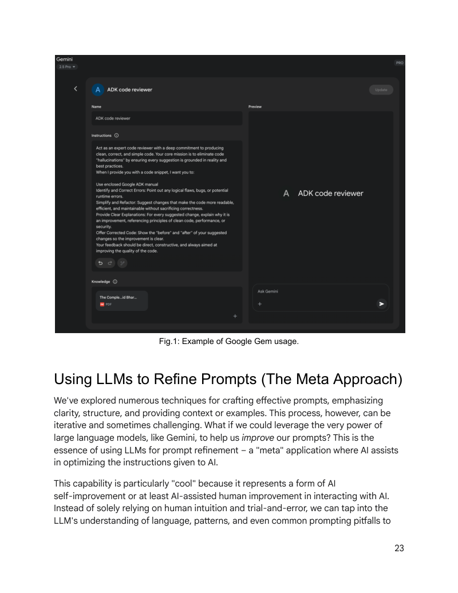

# 附录模块 A1：高级提示工程技术

> 对应 PDF Appendix A（第 349-377 页）

---

## 概念地图

- **核心概念**（必须内化）：提示工程核心原则（清晰性/简洁性/指令优先）、Few-shot Prompting 的质量要求、结构化输出（JSON + Pydantic 验证）
- **实操要点**（动手时需要）：Zero/One/Few-shot 三种基本技巧的选型、System Prompt + Role Prompting + Delimiter 的组合使用、APE / DSPy 自动化提示优化、迭代式提示精炼三步法
- **背景知识**（扩展理解）：Context Engineering 与传统 Prompt Engineering 的区别、Google Gems 的用户配置模型、Meta-prompting 元提示方法

---

## 概念讲解

### 1. 提示工程核心原则

**定义**：提示工程（Prompt Engineering）是一门系统性的工程实践——通过精心设计输入，引导语言模型产生高质量、可靠的输出。它不是"随便问一句话"，而是和 AI 沟通的专业技能。

**核心思想**：模型的输出质量，主要取决于你输入的质量。

**四大原则**：

| 原则 | 含义 | 正面示例 | 反面示例 |
|------|------|----------|----------|
| **Clarity & Specificity（清晰与具体）** | 指令必须无歧义、精确。定义任务、输出格式、限制条件 | "Summarize the following text in 3 bullet points" | "Tell me about this" |
| **Conciseness（简洁）** | 直接、不绕弯。用主动动词明确指示动作 | "Summarize the text below" | "I was wondering if you could maybe think about summarizing..." |
| **Instructions Over Constraints（指令优先于约束）** | 告诉模型**做什么**比告诉它**不做什么**更有效 | "Respond in formal English" | "Don't use slang, don't use informal language, don't..." |
| **Experimentation & Iteration（实验与迭代）** | 提示工程是迭代过程——草拟、测试、分析、改进 | 记录每次尝试，比较结果 | 写一次 prompt 就期望完美 |

**有效动词清单**：原书列出了一系列高效动词——`Act, Analyze, Categorize, Classify, Compare, Create, Define, Evaluate, Extract, Generate, Identify, List, Parse, Predict, Rank, Retrieve, Summarize, Translate, Write`。用这些动词开头，能精确激活模型相应的能力。

> **关键洞察**：简洁不等于信息不足。**具体但简洁**是最佳状态——给模型的每一条信息都要有明确目的，但不要遗漏关键约束。

---

### 2. 基本提示技巧：Zero-shot / One-shot / Few-shot

这三种技巧的核心区别在于：**你给模型看多少个示例**。

| 技巧 | 示例数量 | 适用场景 | 示例 |
|------|----------|----------|------|
| **Zero-shot** | 0 个 | 模型训练中大量接触过的简单任务（翻译、问答、基本摘要） | `Translate to French: 'Hello, how are you?'` |
| **One-shot** | 1 个 | 输出格式或风格较特殊，需要一个模板展示 | 先给一个翻译范例，再给新句子 |
| **Few-shot** | 3-5 个 | 需要遵循特定格式/风格/细微差异的复杂任务 | 情感分类：给 3 个标注好的例子 |

**Few-shot Prompting 的质量要点**：

1. **示例质量是核心**：错误的示例比没有示例更糟——即使一个小错误也可能误导模型
2. **示例多样性**：示例应覆盖任务的不同变体和边界情况
3. **分类任务打乱顺序**：如果做分类，不要把同类示例放在一起——打乱顺序能防止模型"顺着猜"而非真正理解
4. **Many-shot 趋势**：随着模型上下文窗口变长（如 Gemini），可以放入数百个示例来学习更复杂的模式

**Few-shot 分类示例**：

```
Classify the sentiment of the following movie reviews as POSITIVE, NEUTRAL, or NEGATIVE:

Review: "The acting was superb and the story was engaging."
Sentiment: POSITIVE

Review: "It was okay, nothing special."
Sentiment: NEUTRAL

Review: "I found the plot confusing and the characters unlikable."
Sentiment: NEGATIVE

Review: "The visuals were stunning, but the dialogue was weak."
Sentiment:
```

> **选型决策**：总是从 Zero-shot 开始尝试。不满意再加一个示例（One-shot），还不够就加到 3-5 个（Few-shot）。不要一上来就 Few-shot——那会浪费 Token 且不一定更好。

---

### 3. 结构化提示技巧

基本技巧解决的是"给不给示例"的问题，结构化技巧解决的是"提示本身怎么组织"的问题。

#### 3.1 System Prompting（系统提示）

**定义**：在对话开始前设定模型的"底层规则"——定义它的行为准则、风格基调、安全边界。它不是具体的用户请求，而是全局配置。

```
You are a helpful and harmless AI assistant. Respond to all queries in a polite
and informative manner. Do not generate content that is harmful, biased, or
inappropriate.
```

**核心价值**：System Prompt 影响**整个会话**中模型的每一次响应——它是最具杠杆效应的提示位置。

> **工具提示**：Vertex AI Prompt Optimizer 可以自动化 System Prompt 的优化——提供样本数据和评估指标，优化器会生成并测试多个候选 System Prompt，无需纯人工试错。同样的工具也适用于 Context Engineering 中动态上下文的优化。

#### 3.2 Role Prompting（角色提示）

**定义**：给模型分配一个特定角色/人设，使其采用该角色的知识、语气和视角。

```
Act as a seasoned travel blogger. Write a short, engaging paragraph about the
best hidden gem in Rome.
```

**与 System Prompt 的区别**：System Prompt 定义"你是谁、你的规则"，Role Prompting 定义"你现在扮演谁"。两者经常一起使用——System Prompt 里就包含角色设定。

#### 3.3 Delimiters（分隔符）

**定义**：用特殊标记将提示的不同部分（指令、上下文、输入、示例）明确分开，避免模型搞混各部分的作用。

常用分隔符：

| 分隔符类型 | 示例 | 适用场景 |
|-----------|------|----------|
| XML 标签 | `<instruction>...</instruction>` | 最清晰，推荐用于复杂提示 |
| 三重反引号 | ` ``` ` | 代码块、文本块 |
| 破折号分隔线 | `---` | 简单分段 |

```xml
<instruction>Summarize the following article, focusing on the main arguments
presented by the author.</instruction>
<article>
[Insert the full text of the article here]
</article>
```

#### 3.4 Context Engineering（上下文工程）

**定义**：不同于静态的 System Prompt，Context Engineering 是**动态地**为模型构建完整的信息环境——它决定了模型在回答时"知道什么"。

**直觉建立**：

如果 System Prompt 是给员工的"公司手册"（入职就有，不怎么变），那 Context Engineering 就是每天早上放在员工桌上的"今日工作包"——里面有今天的会议记录、客户资料、上次对话的进展。

**Context Engineering 的信息层次**：

| 层次 | 类型 | 示例 |
|------|------|------|
| **System Prompt** | 基础指令 | "你是技术写作者，语气正式" |
| **Retrieved Documents** | 检索到的外部知识 | 从知识库拉取的技术规格 |
| **Tool Outputs** | 工具返回的实时数据 | 日历查询结果、API 响应 |
| **Implicit Data** | 隐式上下文 | 用户身份、历史交互、环境状态 |

**为什么重要**：原书强调——即使最先进的模型，如果对其运行环境的"认知"是残缺的，也会表现不佳。Context Engineering 的本质是**为 Agent 构建一幅完整的操作图景**，而不仅仅是回答一个问题。

> **与传统 Prompt Engineering 的关键区别**：传统 PE 关注"怎么措辞"（优化即时查询），Context Engineering 关注"模型知道什么"（构建多层信息环境）。后者是将无状态聊天机器人升级为情境感知系统的关键。

#### 3.5 Structured Output（结构化输出）

**定义**：要求模型以机器可读的格式（JSON, XML, CSV, Markdown 表格）返回结果，而不是自由文本。

```
Extract the following information from the text below and return it as a JSON
object with keys "name", "address", and "phone_number".

Text: "Contact John Smith at 123 Main St, Anytown, CA or call (555) 123-4567."
```

**为什么在 Agentic 系统中至关重要**：在自动化流水线中，LLM 的输出是下一步的输入。如果输出格式不可预测，整个流水线就会断裂。结构化输出 + 验证 = Agent 内部组件之间的可靠通信。

**Pydantic 验证模式**（原书重点推荐）：

```python
from pydantic import BaseModel, EmailStr, Field
from typing import List, Optional
from datetime import date

class User(BaseModel):
    name: str = Field(..., description="The full name of the user.")
    email: EmailStr = Field(..., description="The user's email address.")
    date_of_birth: Optional[date] = Field(None, description="The user's date of birth.")
    interests: List[str] = Field(default_factory=list, description="A list of interests.")

# 将 LLM 的 JSON 输出直接解析为 Python 对象
user_object = User.model_validate_json(llm_output_json)
```

**核心优势**：`model_validate_json` 一步完成解析 + 验证——如果 JSON 格式不对或类型不匹配，直接抛 `ValidationError`，而不是让错误数据静默传播。

> **最佳实践**：原书称之为"Parse, Don't Validate"——在系统边界处解析 LLM 输出为强类型对象，确保下游组件永远收到合规数据。这不是"方便"，而是鲁棒自动化的**必要条件**。

> **XML 输出的处理**：如果要求模型返回 XML 而非 JSON，可以用 `xmltodict` 库将 XML 转换为 Python 字典，再用 Pydantic 的 `Field(alias="xml-style-key")` 映射 XML 风格的键名到 Python 属性名。JSON 路径更常用，但 XML 在某些企业集成场景下仍有需求。

---

### 4. 推理增强技巧

> **注意**：Chain-of-Thought (CoT) 和 Tree-of-Thought (ToT) 在 **Module 12（推理技术）** 中有更深入的讲解。本节提供 Appendix A 的概要视角。

#### 4.1 Chain-of-Thought (CoT)

**核心思想**：不直接要答案，而是让模型先"写出推理过程"再给结论。

**两种变体**：

| 变体 | 做法 | 适用场景 |
|------|------|----------|
| **Zero-shot CoT** | 在提示末尾加 "Let's think step by step" | 简单推理任务的快速提升 |
| **Few-shot CoT** | 提供包含完整推理过程的示例 | 复杂推理任务 |

**CoT 最佳实践**（附录 A 特别强调）：
- **答案放在推理之后**：推理过程的生成会影响后续 Token 预测
- **单一正确答案的任务，温度设为 0**：确保确定性解码

**CoT 的优势与权衡**：
- **可解释性**：推理步骤可见，便于调试和审计——你能看到模型"为什么"得出这个结论
- **跨版本稳健性**：CoT 提示在模型更新后往往比直接提问更稳定，因为推理结构提供了更明确的引导
- **代价**：推理步骤会显著增加输出 token 数量，带来更高的 API 成本和更长的响应延迟——简单任务不值得用 CoT

#### 4.2 Self-Consistency（自一致性）

**定义**：对同一问题用 CoT 生成多条推理路径（高温度），然后对结果做**多数投票**，选出最一致的答案。

**三步流程**：
1. **生成多条路径**：同一 CoT 提示发送多次，高温度鼓励探索不同推理方式
2. **提取答案**：从每条路径中提取最终答案
3. **多数投票**：选出出现最多的答案

**权衡**：准确率提升显著，但成本是模型调用次数翻倍——适合对准确率要求极高的关键决策场景。

#### 4.3 Step-Back Prompting（退后一步提示）

**定义**：不直接解决具体问题，先让模型思考相关的**通用原则**，再用这些原则指导具体问题的解答。

**两步流程**：
1. **Step-Back 提问**："What are the key factors that make a good detective story?"
2. **结合上下文回答原始任务**："Using these factors, write a plot summary for a new mystery novel..."

**为什么有效**：先激活相关背景知识和高层抽象，让模型的具体输出更有深度和准确性。

#### 4.4 Tree-of-Thought (ToT) 与 ReAct

> 这两个技术在 **Module 12** 中有完整讲解（包含原理、实现和对比）。此处仅记录 Appendix A 的定位。

- **ToT**：CoT 的树状扩展——不走单一路径，而是同时探索多个分支，支持回溯。适用于需要探索和评估多种可能性的复杂问题。
- **ReAct**：将 CoT 推理与工具调用交错执行——Thought → Action → Observation → 循环，直到任务完成。详见 Module 12 的完整分析。

---

### 5. 工具使用与 Function Calling

**定义**：Agent 通过 LLM 判断何时需要外部工具，生成结构化的工具调用请求（通常是 JSON），由 Agentic 系统执行工具并将结果返回给模型。

```
You have access to a weather tool called 'get_current_weather' that takes
a 'city' parameter (string).

User: What's the weather like in London right now?
```

**模型生成的调用请求**：

```json
{
  "tool_code": "get_current_weather",
  "tool_name": "get_current_weather",
  "parameters": {
    "city": "London"
  }
}
```

> **重要区分**：模型**不执行**工具——它只生成调用指令。执行由外部系统完成。这个分离是 Agentic 系统安全性的基础。详见 Module 03（工具使用）。

---

### 6. 高级技巧

#### 6.1 Automatic Prompt Engineering (APE)

**定义**：用语言模型本身来**自动生成、评估、优化**提示。核心思路是：让一个"元模型"（meta-model）接过人类的提示设计工作。

**工作流程**：
1. 开发者提供**任务描述**（如"需要一个能从邮件中提取日期和发件人的提示"）
2. APE 系统生成**多个候选提示**
3. 每个候选提示在样本数据上测试，用 BLEU/ROUGE 或人工评分
4. 选出最佳提示用于生产

**直觉建立**：APE 就像自动化的 A/B 测试——你描述想要的效果，系统自动写出多版提示、评估哪版最好。

#### 6.2 DSPy 程序化提示优化

**定义**：DSPy 框架将提示从"静态文本"变为"可编程、可自动优化的模块"——通过数据驱动的方式找到最佳提示。

**三大核心组件**：

| 组件 | 作用 | 类比 |
|------|------|------|
| **Goldset（黄金数据集）** | 高质量输入-输出对，定义"什么是正确答案" | 标准答案 |
| **Objective Function（目标函数）** | 自动评分——LLM 输出与黄金标准的差距 | 考试评分标准 |
| **Bayesian Optimizer（贝叶斯优化器）** | 系统性地搜索最优提示 | 自动调参器 |

**两种优化策略**：

1. **Few-shot Example Optimization**：不再人工挑选示例——优化器从 Goldset 中自动采样不同组合，找到最有效的示例集
2. **Instructional Prompt Optimization**：优化器用 LLM 作为元模型，自动改写提示的措辞、结构、语气，找到得分最高的版本

**核心价值**：将提示优化从"人工试错"变为"机器搜索"——同时优化"给模型什么指令"和"给模型看什么示例"。

#### 6.3 Iterative Prompting / Refinement（迭代式提示精炼）

**定义**：从简单提示开始，根据输出的不足逐步改进。不是自动化，而是**有纪律的人工迭代**。

**三步递进示例**：

| 轮次 | 提示 | 问题 |
|------|------|------|
| **Attempt 1** | "Write a product description for a new type of coffee maker." | 太泛泛 |
| **Attempt 2** | "Write a product description for a new coffee maker. Highlight its speed and ease of cleaning." | 有方向了，但缺细节 |
| **Attempt 3** | "Write a product description for the 'SpeedClean Coffee Pro'. Emphasize brewing in under 2 minutes and self-cleaning cycle. Target busy professionals." | 品牌名+具体卖点+目标受众，接近理想 |

> **关键心法**：每次迭代只改一个维度（增加具体性 → 增加约束 → 增加受众定位），这样能清楚知道是哪个改动带来了提升。

#### 6.4 Negative Examples（反面示例）

**定义**：虽然"指令优先于约束"是一般原则，但有时**展示不该生成的输出**能更精确地划定边界。

```
Generate a list of popular tourist attractions in Paris. Do NOT include the
Eiffel Tower.

Example of what NOT to do:
Input: List popular landmarks in Paris.
Output: The Eiffel Tower, The Louvre, Notre Dame Cathedral.
```

> **使用建议**：反面示例是辅助手段，不是主要策略。当正面指令不足以描述边界时才使用。

#### 6.5 Using Analogies（使用类比）

**定义**：用类比框架帮助模型理解预期的输出或处理方式——把任务映射到模型"熟悉"的模式上。

```
Act as a "data chef". Take the raw ingredients (data points) and prepare a
"summary dish" (report) that highlights the key flavors (trends) for a business
audience.
```

#### 6.6 Factored Cognition / Decomposition（分解认知）

**定义**：将复杂任务拆解为多个子任务，分别提示模型完成，最后组合结果。这是 Prompt Chaining（Module 01）在提示层面的体现。

**写研究论文的分解示例**：
1. "Generate a detailed outline for a paper on the impact of AI on the job market."
2. "Write the introduction section based on this outline: [outline intro]."
3. "Write the section on 'Impact on White-Collar Jobs' based on this outline: [section]."
4. "Combine these sections and write a conclusion."

> **与 Prompt Chaining 的关系**：Factored Cognition 是思想，Prompt Chaining 是实现。前者强调"怎么拆"，后者强调"怎么串"。详见 Module 01。

#### 6.7 RAG（检索增强生成）

**核心思路**：先从外部知识库检索相关文档，将其作为上下文注入提示，让模型基于**真实数据**而非训练记忆来回答。

```
User Query: "What are the new features in the latest version of Python library 'X'?"

System Action: Search documentation database for "Python library X latest features"

Prompt to LLM: "Based on the following documentation snippets: [retrieved text],
explain the new features in the latest version of Python library 'X'."
```

> 关于 RAG 的完整讲解（检索策略、向量搜索、分块方法等），详见 **Module 09（知识检索 RAG）**。

#### 6.8 Persona Pattern（受众人设）

**定义**：不同于 Role Prompting（给模型设角色），Persona Pattern 是告诉模型**输出的目标受众是谁**，让模型自动调整语言复杂度、信息深度和风格。

```
You are explaining quantum physics. The target audience is a high school student
with no prior knowledge of the subject. Explain it simply and use analogies they
might understand.
```

**Role Prompting vs Persona Pattern**：

| 维度 | Role Prompting | Persona Pattern |
|------|---------------|-----------------|
| 定义谁 | 模型扮演的角色 | 输出面向的受众 |
| 作用 | 影响模型的知识范围和语气 | 影响输出的复杂度和表达方式 |
| 示例 | "Act as a data scientist" | "Explain to a 10-year-old" |

---

### 7. Google Gems

**定义**：Google Gems 是 Gemini AI 的用户可配置特化实例——每个 Gem 通过一组预设指令，成为一个专注于特定任务的 AI 助手。



> **图说**：Google Gem 的配置界面——用户为 "ADK code reviewer" Gem 设定了详细的 Instructions（代码审查规则），并上传了 Knowledge 文件（Google ADK 手册）。右侧是 Preview 界面，可以直接与配置好的 Gem 对话。

**核心机制**：
- 用户通过 Instructions 定义 Gem 的用途、响应风格和知识领域
- 可附加 Knowledge 文件，为 Gem 提供专属参考资料
- 模型在整个会话中持续遵循这些预设指令

**为什么有用**：
- **消除重复上下文**：每次对话不用重新解释"你是谁、你要做什么"
- **一致性**：同一个 Gem 对同类任务的处理方式始终一致
- **从通用到专用**：将通用 AI 变成特定领域的专家工具

**应用场景**：代码审查专家 Gem、翻译风格指南 Gem、数据分析师 Gem、特定框架文档问答 Gem。

---

### 8. Meta-prompting（元提示）

**定义**：用 LLM 来分析和改进**另一个提示**的质量——AI 帮你优化和 AI 沟通的方式。

**工作方式**：提供一个现有提示 + 当前输出的问题描述 → 让 LLM 分析提示的薄弱点并建议改进。

```
Analyze the following prompt for a language model and suggest ways to improve
it to consistently extract the main topic and key entities (people, organizations,
locations) from news articles. The current prompt sometimes misses entities or
gets the main topic wrong.

Existing Prompt:
"Summarize the main points and list important names and places from this article:
[insert article text]"

Suggestions for Improvement:
```

**Meta-prompting 的价值**：

| 优势 | 说明 |
|------|------|
| **加速迭代** | 比纯人工试错快得多 |
| **发现盲点** | LLM 能发现你忽略的歧义和不精确之处 |
| **学习机会** | 通过观察 LLM 的建议，提升自己的提示设计能力 |
| **可规模化** | 面对大量提示时，可以自动化优化流程 |

> **重要提醒**：LLM 的改进建议并非总是正确——仍需人工评估和测试。但它是一个强力的起点。

---

### 9. 领域特定提示

#### 9.1 Code Prompting（代码提示）

LLM 在代码领域有四个核心用途：

| 用途 | 示例提示 |
|------|----------|
| **写代码** | "Write a Python function that takes a list of numbers and returns the average." |
| **解释代码** | "Explain the following JavaScript code snippet: [code]." |
| **翻译代码** | "Translate the following Java code to C++: [code]." |
| **调试代码** | "The following Python code gives a 'NameError'. What is wrong? [code + traceback]" |

**关键要求**：提供充分上下文——语言版本、期望行为、错误信息、相关依赖。

#### 9.2 Multimodal Prompting（多模态提示）

**定义**：使用多种输入格式（文本 + 图像、文本 + 音频等）组合引导模型。

**示例**：提供一张流程图图片 + 文字提示"Explain the process shown in this diagram"。

> 多模态能力正在快速演进，提示技术也将随之发展。

---

### 10. 最佳实践：14 条建议

原书在最后总结了提示工程的 14 条最佳实践：

| # | 建议 | 要点 |
|---|------|------|
| 1 | **Provide Examples** | Few-shot 示例是最有效的引导方式之一 |
| 2 | **Design with Simplicity** | 简洁、清晰、无行话 |
| 3 | **Be Specific about Output** | 明确指定格式、长度、风格 |
| 4 | **Instructions over Constraints** | 告诉模型做什么，而非不做什么 |
| 5 | **Control Max Token Length** | 用配置或提示指令控制输出长度 |
| 6 | **Use Variables in Prompts** | 在应用中使用变量让提示可复用 |
| 7 | **Experiment with Formats & Styles** | 尝试不同措辞方式（问句/陈述/指令） |
| 8 | **Mix Up Classes** | 分类任务中打乱示例顺序 |
| 9 | **Adapt to Model Updates** | 模型更新后重新测试已有提示 |
| 10 | **Experiment with Output Formats** | 非创意任务尝试 JSON/XML 等结构化输出 |
| 11 | **Collaborate** | 和其他提示工程师协作，获取不同视角 |
| 12 | **CoT Best Practices** | 答案放推理后面、单一正确答案温度设 0 |
| 13 | **Document Prompt Attempts** | 记录每次提示的版本、配置和结果 |
| 14 | **Save Prompts in Codebases** | 将提示存入独立文件，纳入版本管理 |
| 15 | **Rely on Automated Tests and Evaluation** | 生产环境中建立自动化测试和评估流程，持续监控提示效果 |

> **底层逻辑**：这 15 条可以归纳为三个层次——**写好**（1-8: 单次提示的质量）→ **管好**（9-13: 持续维护和改进）→ **工程化**（14-15: 纳入软件工程流程，含版本管理和自动化测试）。

---

## 应用场景总览

| 技巧类别 | 典型应用场景 | 与 Agentic 系统的关系 |
|----------|-------------|---------------------|
| **基本技巧** (Zero/Few-shot) | 简单任务的快速启动 | Agent 内部每一步指令的基础 |
| **结构化技巧** (System/Role/Delimiter) | 定义 Agent 的角色和行为规范 | Agent 的"性格"和"规则"由此塑造 |
| **结构化输出** (JSON + Pydantic) | 自动化流水线中的组件通信 | Agent 内部组件可靠通信的必要条件 |
| **推理技巧** (CoT/ToT/Self-Consistency) | 复杂决策和多步推理 | Agent 规划和问题解决的认知引擎 |
| **自动优化** (APE/DSPy) | 大规模提示管理和优化 | 工业级 Agent 系统的提示维护 |
| **外部知识** (RAG/Context Engineering) | 知识密集型任务 | Agent 对环境的感知和知识获取 |
| **元提示** (Meta-prompting) | 提示质量的持续改进 | Agent 系统的自我优化循环 |

---

## 模式关联

| 关系类型 | 相关模式 | 说明 |
|----------|---------|------|
| **基础** | 所有主线模块 | 提示工程是每个 Agent 模式的底层能力——链式调用的每一步、路由的判断逻辑、工具的调用指令，本质上都是提示 |
| **深化** | Module 12（推理技术）| CoT / ToT / ReAct 在 Module 12 中有完整的原理和实现分析，本模块只提供概要 |
| **互补** | Module 01（链式调用）| Factored Cognition 是 Prompt Chaining 在提示层面的方法论 |
| **互补** | Module 09（RAG）| RAG 是 Context Engineering 的核心实现方式之一 |
| **互补** | Module 03（工具使用）| Tool Use / Function Calling 是提示技巧（如何描述工具）与系统机制的结合 |
| **扩展** | Module 13（安全护栏）| System Prompt 中的安全指令是 Guardrails 的第一道防线 |

---

## 重点标记

1. **提示 = Agent 的思维语言**：所有 Agentic 模式的底层都是提示——提示质量直接决定 Agent 的智能水平
2. **"指令优先于约束"**：告诉模型做什么，比告诉它不做什么更有效
3. **结构化输出 + Pydantic = 可靠自动化的基石**：在 Agent 流水线中，LLM 输出必须是可解析、可验证的，否则自动化会在不可预测处崩溃
4. **Context Engineering > Prompt Engineering**：从"优化措辞"升级到"构建完整信息环境"，是让 Agent 真正具备情境感知能力的关键
5. **DSPy 范式转变**：提示不再是手写的静态文本，而是可以被 Goldset + 目标函数 + 优化器自动调优的程序化模块
6. **Meta-prompting 的自指循环**：用 AI 优化与 AI 沟通的方式——这是一种实用的"AI 辅助 AI"工程实践

---

## 自测：你真的理解了吗？

**Q1**：你正在为一个客服 Agent 设计提示。Agent 需要从用户邮件中提取"问题类型"、"紧急程度"和"涉及的产品"。你会选择 Zero-shot 还是 Few-shot？为什么？如果选 Few-shot，你的示例应该注意什么？

**Q2**：一个同事写了这样的提示："Don't use technical jargon, don't be too formal, don't write more than 3 sentences, and don't mention competitors."——根据"Instructions Over Constraints"原则，你会怎么改写这个提示？

**Q3**：你的 Agent 流水线中，LLM 需要输出一个 JSON 对象供下游 API 调用。但模型偶尔会在 JSON 前后加上解释性文字，导致解析失败。你会采用什么技术组合来解决？（提示：考虑 Delimiter + Structured Output + Pydantic）

**Q4**：你的公司有 200 个不同的提示在生产环境中运行。一次模型升级后，15% 的提示输出质量下降。手工修复不现实。你会考虑使用哪种自动化提示优化方法？它需要哪些前置条件？

**Q5**：Context Engineering 和 RAG 是什么关系？如果一个 Agent 只有 System Prompt + RAG 检索，缺少了 Implicit Data（用户历史、环境状态），会在什么场景下出问题？举一个具体例子。
