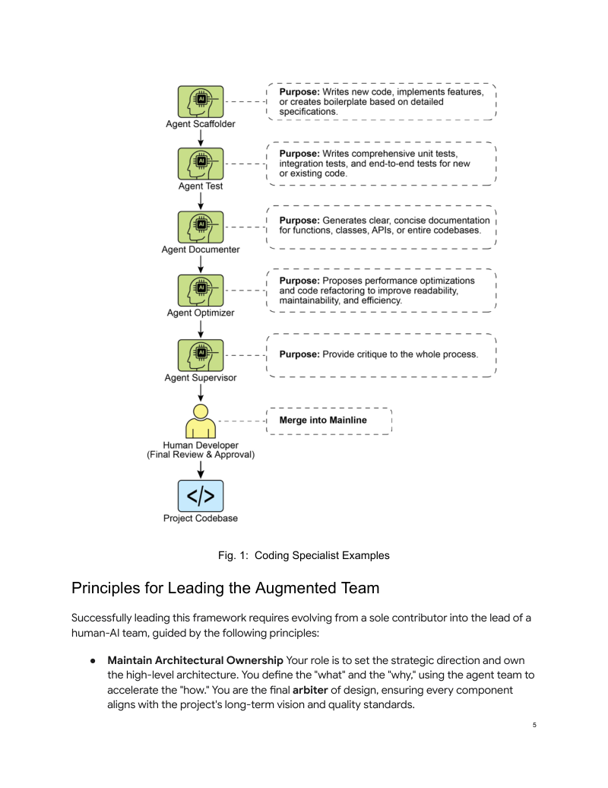

# 附录模块 A3：编程智能体

> 对应 PDF Appendix G（第 404-415 页）

---

## 概念地图

- **核心概念**（必须内化）：Human-Led Orchestration（人类主导的编排）、The Primacy of Context（上下文至上）、Specialist Agents 团队协作模型
- **实操要点**（动手时需要）：Context Staging Area 的搭建、五种 Specialist Agent 的 Prompt 设计、Git Hooks 集成 Agent 工作流
- **背景知识**（扩展理解）：Vibe Coding 的价值与局限、行业趋势（Google/Microsoft 30%+ AI 辅助代码）、从单兵作战到人机团队的范式转变

---

## 概念讲解

### 1. Vibe Coding（氛围编码）

**定义**：Vibe Coding 是一种利用 LLM 进行快速原型开发的实践方式——开发者提供高层目标或模糊的"感觉"，AI 生成对应代码。重点不在精确规格，而在用自然语言对话快速把想法变成可运行代码。

**解决什么问题**：

开发者面对"空白页"时的启动摩擦。当你面对一个新项目、一个陌生的 API、或一个还没成型的想法时，从零开始写代码的心理障碍和时间成本很高。Vibe Coding 把这个从"我得弄清楚每一行怎么写"变成"我先描述我想要什么，看 AI 给出什么"。

**直觉建立**：

想象你在和一个**速写画师**合作。你不需要告诉他"先画一条 30 度的线，然后在 5 厘米处转 45 度"，你只需要说"帮我画一个温馨的咖啡馆场景"。画师会迅速勾勒出一个草图，你看了之后说"窗户再大一些"、"加一只猫"——通过几轮对话，一幅满意的画就出来了。

Vibe Coding 的特征与这个过程完全对应：

| 特征 | 画师类比 | 编码实践 |
|------|---------|---------|
| **Conversational Prompts** | "画一个温馨的场景" | "Create a modern landing page" |
| **Iterative Refinement** | "窗户再大一些" | "Make the buttons blue" |
| **Creative Partnership** | 画师提议加些绿植 | AI 建议加 error handling |
| **Focus on "What" not "How"** | 你只管效果，不管画法 | 你只管功能，不管实现细节 |
| **Optional Memory Banks** | 画师记住你偏好的风格 | 存储编码规范和偏好供后续复用 |

> **类比边界**：画师可以主观判断"够不够好"，但 Vibe Coding 生成的代码在生产环境中需要严格的测试和审查——AI 生成的代码看起来对、跑起来可能有隐藏的 bug 或安全漏洞。

**Vibe Coding 的价值与局限**：

| 维度 | 优势 | 局限 |
|------|------|------|
| **创意阶段** | 快速从想法到原型，克服"空白页"问题 | 生成代码质量不可控 |
| **学习阶段** | 探索陌生 API 和架构模式的快速途径 | 不理解为什么这样实现 |
| **生产阶段** | 可作为初始草稿加速开发 | 不适合直接上线，需要重构和测试 |

**核心洞察**：Vibe Coding 是起点，不是终点。它在软件生命周期的**发现和构思阶段**无比强大，但要构建健壮、可扩展、可维护的软件，必须转向更结构化的方式——这正是 Specialist Agents 团队框架要解决的问题。

---

### 2. Agents as Team Members（Agent 作为团队成员）

**定义**：行业正在从"用 AI 生成代码"转向"用 AI Agent 团队辅助开发"的范式。开发者不再是独自编码的个体，而是一个由人类开发者领导、多个专业化 AI Agent 协同工作的团队的负责人。

**行业背景**：

这不是理论推演——大规模实践已经在发生：

- **Google（Alphabet）**：CEO Sundar Pichai 2025 年初表示，Google 超过 30% 的新代码由 Gemini 模型辅助生成，"从根本上改变了我们的开发速度"
- **Microsoft**：CEO Satya Nadella 做出了类似声明，30% 的代码由 AI 生成

**核心哲学**：

> 真正的前沿不是**替代**开发者，而是**赋能**开发者。

人类负责架构愿景和创造性问题解决，Agent 负责可规模化的专业任务（测试、文档、评审）。这是一种**增强关系**（augmented relationship），不是替代关系。

**与课程其他模块的连接**：

这个"人类领导 + Agent 团队"的模型，本质上是 Module 04 Multi-Agent 模式在软件开发领域的具体实现：
- **Multi-Agent（Module 04）**：多个专业化 Agent 协作，有明确的通信拓扑和分工
- **本模块**：把这个抽象模式落地到"编码团队"场景——每个 Agent 有明确的开发职责

---

### 3. 三大基础原则

本框架建立在三个不可妥协的基础原则之上：

#### 原则一：Human-Led Orchestration（人类主导的编排）

**定义**：开发者始终是团队负责人和项目架构师——设定高层目标、做出最终决策、把控质量。Agent 是强大的协作者，但不是决策者。

**具体职责**：
- **指挥**：决定什么时候调用哪个 Agent
- **提供上下文**：为 Agent 准备完整的任务背景
- **最终裁决**：对 Agent 生成的所有输出做最终判断，确保符合项目质量标准和长期愿景

**直觉建立**：

想象一个**乐队指挥**。每个乐手（Agent）都技艺精湛，各自精通自己的乐器。但只有指挥（人类开发者）知道整首曲子的节奏、情感表达和各声部如何配合。指挥不需要自己演奏每种乐器，但他必须知道什么时候该让谁进、什么时候该停、整体效果是否符合预期。

> **类比边界**：乐队指挥面对的是训练有素、有自主判断力的人类乐手；AI Agent 没有真正的自主判断力，更依赖指挥（开发者）给出精确的上下文和指令。

#### 原则二：The Primacy of Context（上下文至上）

**定义**：Agent 的表现完全取决于它收到的上下文的质量和完整度。一个强大的 LLM 配上糟糕的上下文等于无用。框架要求**人类主导的上下文管理**，避免自动化的黑盒上下文检索。

**上下文三要素**：

| 要素 | 内容 | 作用 |
|------|------|------|
| **The Complete Codebase** | 所有相关源代码 | 让 Agent 理解现有模式和逻辑 |
| **External Knowledge** | 文档、API 定义、设计文档 | 补充 Agent 训练数据中没有的专业知识 |
| **The Human Brief** | 目标、需求、PR 描述、风格指南 | 让 Agent 理解"做什么"和"做到什么标准" |

> **关键洞察**：很多人用 AI 编码效果不好，不是因为 AI 模型不够强，而是因为给的上下文不够好。这个原则说白了就是——**GIGO（Garbage In, Garbage Out）**。你给 Agent 一个模糊的需求，它就还你一个模糊的实现。

**与 Module 06（MCP）的关联**：MCP 协议本质上也是在解决"如何给 Agent 提供丰富上下文"的问题——通过标准化协议让 Agent 访问外部工具和数据。本模块的 Context Staging Area 是手动版的上下文管理，MCP 是协议化的自动版。

#### 原则三：Direct Model Access（直接模型访问）

**定义**：Agent 必须直接使用前沿模型（如 Gemini 2.5 PRO、Claude Opus 4、OpenAI、DeepSeek 等），而非通过中间层平台。中间层可能截断上下文、降低模型能力，从而削弱 Agent 表现。

**为什么重要**：

```
开发者 → [直接访问前沿模型]     → 最优输出   ✓
开发者 → [中间平台] → [弱模型]  → 降级输出   ✗
```

框架的目标是创建人类领导者和底层模型原始能力之间**最纯粹的对话通道**，确保每个 Agent 在峰值水平运行。

> **常见误用**：使用封装过多层的中间平台（这些平台可能在背后使用更便宜、更弱的模型，或者截断输入上下文），导致输出质量远低于预期，却把问题归咎于"AI 不够聪明"。

---

### 4. Core Components（核心组件：Specialist Agents 团队）

框架的核心是一个由人类开发者领导的**专业化 Agent 团队**。每个 Agent 不是独立的应用程序，而是通过精心设计的 Prompt 和上下文在同一个 LLM 中激活的**概念化角色**。

#### The Orchestrator：人类开发者

- **角色**：Team Lead、Architect、最终决策者
- **职责**：定义任务、准备上下文、验证所有 Agent 的输出
- **接口**：开发者自己的终端、编辑器、以及所选 Agent 的原生 Web UI

#### Context Staging Area：上下文暂存区

- **角色**：每个任务的专属工作空间，确保 Agent 收到完整准确的 briefing
- **实现**：一个临时目录 `task-context/`，包含目标描述（Markdown）、代码文件、相关文档

```
task-context/
├── 01_BRIEF.md          # 任务目标和需求描述
├── 02_CODE/             # 相关源代码文件
├── 03_DOCS/             # API 文档、设计文档等
└── 04_STYLE_GUIDE.md    # 编码规范和风格指南
```

#### Specialist Agents 团队

以下五个 Agent 组成了开发生命周期的完整覆盖：

| Agent | 代号 | 职责 | Invocation Prompt 核心 |
|-------|------|------|----------------------|
| **The Scaffolder Agent** | The Implementer | 写新代码、实现功能、创建样板代码 | "You are a senior software engineer. Based on the requirements in 01_BRIEF.md and the existing patterns in 02_CODE/, implement the feature..." |
| **The Test Engineer Agent** | The Quality Guard | 写单元测试、集成测试、端到端测试 | "You are a quality assurance engineer. For the code provided in 02_CODE/, write a full suite of unit tests using [Testing Framework]..." |
| **The Documenter Agent** | The Scribe | 为函数、类、API 生成清晰文档 | "You are a technical writer. Generate markdown documentation for the API endpoints defined in the provided code..." |
| **The Optimizer Agent** | The Refactoring Partner | 提出性能优化和代码重构建议 | "Analyze the provided code for performance bottlenecks or areas that could be refactored for clarity..." |
| **The Process Agent** | The Code Supervisor | 两阶段代码评审：Critique + Reflection | "You are a principal engineer conducting a code review. First, perform a detailed critique. Second, reflect on your critique to provide a concise, prioritized summary..." |



> **图说**：Specialist Agents 协作流程——从 Scaffolder（编码）到 Test（测试）到 Documenter（文档）到 Optimizer（优化）再到 Supervisor（评审），每一阶段输出经过专业化处理后传递到下一阶段，最终由 Human Developer 做最终审查和合并（Merge into Mainline）。

#### The Process Agent 的两阶段机制：Critique + Reflection

The Process Agent 是团队中最值得注意的角色，因为它直接体现了 **Module 02 中的 Reflection 模式**：

```
第一阶段 — Critique（批判）：
  → 初步审查，识别潜在 bug、风格违规、逻辑缺陷
  → 类似静态分析工具的全面扫描

第二阶段 — Reflection（反思）：
  → 分析自己的 Critique 结果
  → 综合发现，区分关键问题和低优先级建议
  → 输出精简的、可操作的摘要给人类开发者
```

> **核心价值**：单纯的 Critique 往往会列出一堆琐碎问题；加上 Reflection 后，Agent 会"自我过滤"——把真正重要的问题提到前面，把吹毛求疵的建议去掉。这与 Module 02 中 Producer-Critic 模式的思想一脉相承：**分离生成与评审可以提升输出质量**。

---

### 5. Practical Implementation（实践落地）

#### Setup Checklist（启动清单）

| # | 步骤 | 具体操作 | 关键要点 |
|---|------|---------|---------|
| 1 | **Provision Access to Frontier Models** | 为至少两个前沿 LLM 申请 API key（如 Gemini 2.5 Pro + Claude Opus 4） | 双供应商策略：支持对比分析 + 避免单点依赖；密钥按生产级安全标准管理 |
| 2 | **Implement a Local Context Orchestrator** | 使用轻量 CLI 工具管理上下文，用 `context.toml` 指定哪些文件/目录/URL 编译为 LLM 输入 | 替代临时脚本；确保对模型"看到什么"有完全透明的控制 |
| 3 | **Establish a Version-Controlled Prompt Library** | 在项目 Git 仓库中建立 `/prompts` 目录，存放各 Agent 的 Invocation Prompt（如 `reviewer.md`、`tester.md`） | 将 Prompt 当代码管理——团队协作、版本追踪、持续优化 |
| 4 | **Integrate Agent Workflows with Git Hooks** | 配置 `pre-commit` hook 自动触发 Reviewer Agent 对 staged changes 做评审 | 将质量保障直接嵌入开发流程；Agent 的 Critique + Reflection 摘要直接在终端展示 |

#### Principles for Leading the Augmented Team（领导增强团队的原则）

成功使用这个框架，要求开发者从"独立贡献者"进化为"人机团队领导者"：

**1. Maintain Architectural Ownership（保持架构主导权）**

你定义"做什么"和"为什么做"，用 Agent 团队加速"怎么做"。你是设计的最终裁判，确保每个组件符合项目的长期愿景和质量标准。

**2. Master the Art of the Brief（精通 Brief 的艺术）**

Agent 输出质量是输入质量的直接映射。不要把 Prompt 当作简单命令——把它当作给一个新入职的高能力团队成员的**完整工作说明**。

**3. Act as the Ultimate Quality Gate（作为最终质量关卡）**

Agent 的输出永远是**提案，不是命令**。Reviewer Agent 的反馈是有力的信号，但你是最终的质量关卡。用你的领域专长和项目知识来验证、挑战、批准所有变更。

**4. Engage in Iterative Dialogue（参与迭代对话）**

最好的结果来自对话，不是独白。如果 Agent 的初始输出不完美，不要丢弃——**改进它**。提供纠正性反馈，补充上下文，要求重新尝试。这种迭代对话尤其适用于 Process Agent，它的 Reflection 输出本身就是设计来作为**协作讨论的起点**，而非最终报告。

---

## 模式关联

| 关系类型 | 相关模式 | 说明 |
|----------|---------|------|
| **核心实现** | Multi-Agent（Module 04）| 本模块的 Specialist Agents 团队就是 Multi-Agent 模式在软件开发领域的具体落地 |
| **直接应用** | Reflection（Module 02）| Process Agent 的 Critique + Reflection 两阶段机制直接体现了 Reflection 模式 |
| **基础设施** | Tool Use（Module 03）| Agent 通过工具（代码执行、文件操作、测试运行）与开发环境交互 |
| **互补** | Goal Setting（Module 07）| Human Brief 中的目标设定为 Agent 提供明确的成功标准和停止条件 |
| **互补** | Human-in-the-Loop（Module 08）| 本模块的 Human-Led Orchestration 原则是 Human-in-the-Loop 的强化版——人类不只是在关键节点介入，而是全程主导 |
| **前置** | MCP 协议（Module 06）| MCP 提供了 Agent 访问外部工具和上下文的标准化方式，是 Context Staging Area 的协议化升级 |

---

## 重点标记

1. **Vibe Coding 是起点不是终点**：适合创意阶段和快速原型，不适合直接用于生产代码
2. **Human-Led Orchestration**：开发者始终是团队负责人和最终决策者，Agent 是协作者不是替代者
3. **The Primacy of Context**：Agent 表现 = 上下文质量。给差的上下文，再强的模型也出不了好结果（GIGO）
4. **Direct Model Access**：直接用前沿模型，避免中间层截断上下文或降级模型能力
5. **Specialist Agents 不是独立应用**：它们是通过不同 Prompt 在同一 LLM 上激活的"角色"
6. **Process Agent 的双阶段设计**：Critique（全面扫描）+ Reflection（自我过滤和优先级排序），避免"一堆琐碎建议"的问题
7. **Prompt 即代码**：将 Agent 的 Invocation Prompt 放进 Git 版本管理，当代码一样协作和迭代优化
8. **Git Hooks 集成**：把 Agent 评审嵌入开发流程（pre-commit hook），让质量保障成为自动化的环节

---

## 自测：你真的理解了吗？

**Q1**：你正在用 Vibe Coding 快速原型化一个 REST API。原型跑通后，你打算直接部署到生产环境。根据本模块的观点，这种做法有什么风险？你会在原型和上线之间加入哪些步骤？

**Q2**：你的同事说"AI 写的代码质量太差了，不如自己写"。你检查后发现他的 Prompt 只有一句"帮我写一个用户注册功能"。根据 The Primacy of Context 原则，你会建议他如何改进这个 Brief？请具体列出他应该补充的上下文要素。

**Q3**：Process Agent 为什么采用 Critique + Reflection 两阶段而非只做一次代码评审？如果只做 Critique 阶段，输出会有什么问题？这与 Module 02 中的 Reflection 模式有什么共通之处？

**Q4**：你的团队决定只使用一个中间平台（该平台封装了某个 LLM 并提供"简化"的 API）来驱动所有 Specialist Agents。根据 Direct Model Access 原则，这可能带来什么问题？在什么情况下使用中间平台是可以接受的？

**Q5**：本模块中的 Specialist Agents 团队与 Module 04 中的 Multi-Agent 模式有什么关系？如果你要用 Module 04 学到的通信拓扑来描述本模块的协作结构，它最接近哪种拓扑？为什么？
