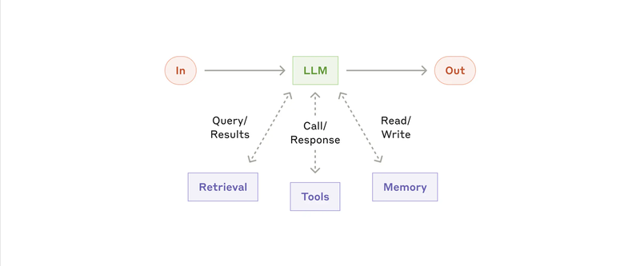

# 模块一：基础理念与架构基石

> 对应 PDF 第 1-3 页

---

## 概念讲解

### 1. Agentic System（智能体系统）的定义

**背景**：业界对 "Agent" 这个词的定义非常混乱。有人把它定义为完全自主的长时间运行系统，有人用来指遵循预定义工作流的实现。由于定义不统一，讨论时很容易鸡同鸭讲。Anthropic 为了消除这种歧义，专门做了一个清晰的分类框架。

**定义**：Anthropic 用 **Agentic System** 作为总称，涵盖所有"LLM + 工具"组合起来完成任务的系统，并将其分成两大类：

| 类型 | 英文 | 核心特征 | 控制方式 |
|------|------|----------|----------|
| 工作流 | Workflow | 预定义的代码路径编排 LLM 和工具 | **人写代码控制流程** |
| 智能体 | Agent | LLM 自主决定流程和工具使用 | **模型自己控制流程** |

**核心思想**：不是所有用了 LLM 的系统都叫 Agent。很多时候你需要的只是一个 Workflow（有固定流程的编排），而不是一个完全自主的 Agent。

**为什么这个区分重要**：
- Workflow 更**可预测、可控**，适合流程明确的任务
- Agent 更**灵活**，但也意味着更高的成本、延迟和不确定性
- 搞清楚你到底需要哪个，能避免过度工程（over-engineering）

> **关键洞察**：Anthropic 在和几十个客户团队合作后发现，最成功的实现**不是用复杂框架**，而是用**简单、可组合的模式（simple, composable patterns）**。

---

### 2. 何时使用（及不使用）Agentic System

**核心原则：找到最简单的方案，只在必要时增加复杂度。**

这是整篇文章反复强调的主题。Anthropic 给出了一个清晰的决策路径：

```
单次 LLM 调用 + RAG + 上下文示例
        ↓ 不够用？
    Workflow（预定义工作流）
        ↓ 还不够灵活？
    Agent（自主智能体）
```

**关键权衡**：Agentic System 用**延迟和成本**换取**更好的任务表现**。你需要考虑这个交换是否值得。

| 方案 | 适用场景 | 特点 |
|------|----------|------|
| 单次 LLM 调用 + RAG | 大多数应用 | 简单、快速、低成本 |
| Workflow | 任务明确、流程固定 | 可预测、一致性好 |
| Agent | 需要灵活决策、**规模化运行（at scale）** | 灵活但成本高 |

注意 Agent 那一行的"规模化"限定。原文说的是 "agents are the better option when flexibility and model-driven decision-making are needed **at scale**"。也就是说，如果只是偶尔几个简单任务需要灵活处理，Workflow 可能就够了；Agent 的价值在于**大量、持续的灵活决策场景**。

> **实战建议**：很多团队一上来就想做 Agent，但其实优化好一次 LLM 调用（加上好的 retrieval 和 in-context examples）就够了。

---

### 3. 框架选型建议

**Anthropic 提到的框架**：
- **LangGraph**（LangChain 出品）
- **Amazon Bedrock AI Agent**
- **Rivet**（拖拽式 GUI LLM 工作流构建器）
- **Vellum**（另一个 GUI 工具）

**框架的优点**：
- 简化底层操作（调 LLM、定义和解析工具、链式调用）
- 快速上手

**框架的坑**：
- 增加抽象层，**隐藏了底层的 prompt 和 response**，调试困难
- 容易诱导你加不必要的复杂度

**Anthropic 的建议**：

> **先直接用 LLM API**，很多模式几行代码就能实现。如果用框架，确保你理解底层代码。**对底层实现的错误假设**是客户出错的常见原因。

**从原型到生产的框架策略**：原文在总结部分特别补充了一个关键建议——**"框架可以帮你快速开始，但到生产环境时要敢于减少抽象层，回归基础组件"**（"Frameworks can help you get started quickly, but don't hesitate to reduce abstraction layers and build with basic components as you move to production"）。这意味着：

- **原型阶段**：用框架快速验证想法，没问题
- **生产阶段**：要有勇气剥掉框架的抽象层，用更直接的方式实现

这比简单说"框架要慎用"更精确——框架不是不能用，而是要知道什么时候该脱手。

**参考资源**：Anthropic 在官方 cookbook 中提供了一些示例实现（sample implementations），可以作为不依赖框架直接编码的参考。

---

### 4. 基础构建块：增强型 LLM（The Augmented LLM）

**定义**：增强型 LLM 就是一个 LLM 加上三种能力增强：**检索（Retrieval）**、**工具（Tools）**、**记忆（Memory）**。



> **图说**：LLM 作为核心，连接三个增强模块——Retrieval（信息检索，Query/Results）、Tools（工具调用，Call/Response）和 Memory（记忆读写，Read/Write）。输入进来后，LLM 可以主动调用这些能力来完成任务。

**三种增强能力详解**：

| 增强类型 | 英文 | 做什么 | 举例 |
|----------|------|--------|------|
| 检索 | Retrieval | LLM 自己生成搜索查询，从外部获取信息 | RAG、向量搜索 |
| 工具 | Tools | LLM 选择并调用合适的工具 | API 调用、代码执行、文件操作 |
| 记忆 | Memory | LLM 决定保留什么信息供后续使用 | 对话历史、用户偏好、长期知识 |

**核心思想**：现代 LLM 已经能**主动使用**这些能力——自己生成搜索词、选工具、决定记什么。

**实现建议**：
1. **针对你的具体场景定制**这些能力（不要用通用方案）
2. 确保提供**简洁、文档完善的接口**给 LLM
3. 可以考虑使用 **Model Context Protocol (MCP)** —— Anthropic 推出的协议，能接入第三方工具生态

**重要前提假设**：原文在这里明确指出——**"后续章节中，我们假设每一次 LLM 调用都已经具备上述增强能力"**。也就是说，后面介绍的五种 Workflow 模式和 Agent 模式中，每一个方框里的 "LLM Call" 都不是裸的 LLM，而是一个已经配备了 Retrieval + Tools + Memory 的增强型 LLM。理解这个前提，才不会误以为那些模式只需要基础 LLM 就能运转。

> **一句话总结**：增强型 LLM 是所有 agentic system 的基本单元。后面所有的 Workflow 和 Agent 模式，都是在这个基本单元之上做组合。

---

## 问答记录

> 待补充（学习后讨论时填写）

---

## 重点标记

1. **业界定义混乱**：Agent 的定义没有共识，Anthropic 用 "Agentic System" 作总称来消除歧义
2. **简单优先**：最成功的 Agent 实现不是用复杂框架，而是简单可组合的模式
3. **Workflow vs Agent**：前者是人控制流程，后者是模型控制流程——先搞清楚你需要哪个
4. **Agent 适合规模化**：Agent 的价值在 "at scale" 场景中才能充分体现，小任务用 Workflow 即可
5. **成本权衡**：Agentic System 用延迟和成本换更好的表现，不是所有场景都值得
6. **框架策略两阶段**：原型期用框架快速验证，生产期减少抽象层回归基础组件
7. **增强型 LLM 是基石**：Retrieval + Tools + Memory 是所有复杂系统的基础构件
8. **前提假设**：后文的每一个 "LLM Call" 都是增强型的——带 RAG、工具和记忆
