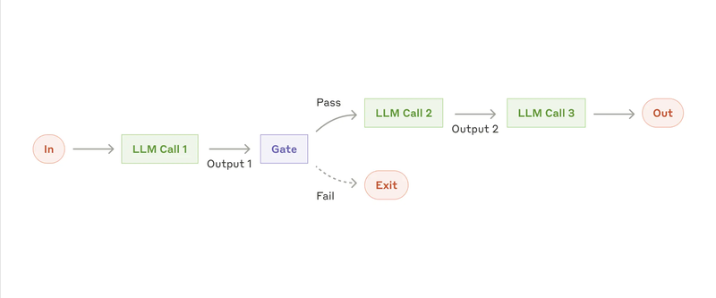
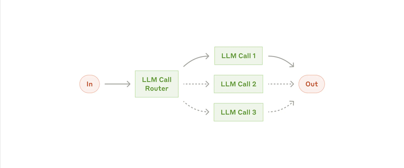
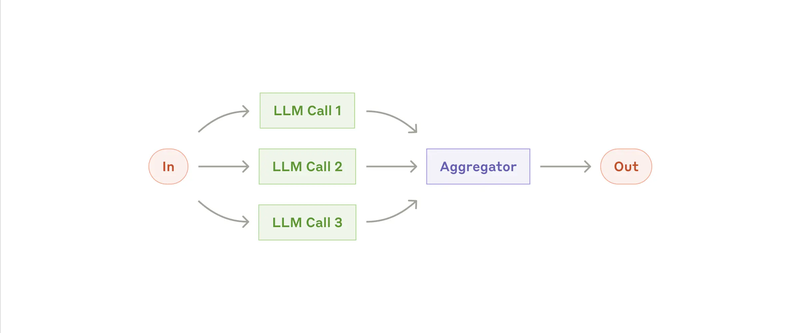
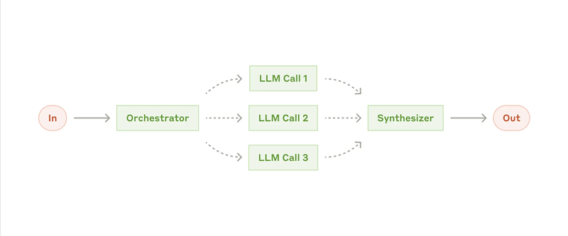
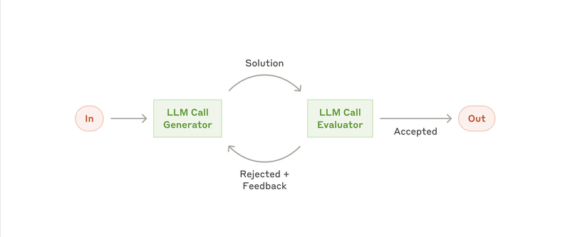

# 模块二：五大工作流模式

> 对应 PDF 第 4-8 页

---

## 概念讲解

### 概览：五种 Workflow 模式

在正式进入每种模式前，先看一张总览对比表：

| 模式 | 核心思想 | 适用场景 | 复杂度 |
|------|----------|----------|--------|
| Prompt Chaining | 串行流水线 | 任务可拆为固定步骤 | 低 |
| Routing | 分类后分发 | 输入有明确类别，需不同处理 | 低 |
| Parallelization | 同时处理再聚合 | 子任务独立或需多视角 | 中 |
| Orchestrator-Workers | 动态拆分并委派 | 子任务不可预测 | 高 |
| Evaluator-Optimizer | 生成-评估循环 | 有清晰评估标准需迭代优化 | 高 |

> **前提提醒**（来自模块一）：以下每种模式中的 "LLM Call" 都是增强型 LLM——已经具备检索、工具和记忆能力。

---

### 1. Prompt Chaining（提示链）

**定义**：把一个任务分解成一串顺序步骤，每一步 LLM 调用处理前一步的输出。中间可以加**编程检查点（Gate）**来确保流程还在正轨上。

> **图说**：输入先经过 LLM Call 1，产出 Output 1；经过 Gate 检查——通过则继续 LLM Call 2 → LLM Call 3 → 输出；不通过则直接退出（Exit）。Gate 是程序化的质量关卡。

**核心思想**：**用延迟换准确度**——把一个大任务拆成多个小任务，每次 LLM 只需处理更简单的事。

**为什么有效**：
- 每一步 LLM 的任务更简单、更聚焦，出错率更低
- 中间有 Gate 可以做质量检查，不合格直接拦截
- 调试方便——出错了你能精确定位是哪一步的问题

**适用场景**：
- 任务能**干净地拆分成固定子任务**
- 需要在中间步骤做质量控制

**实际例子**：
1. 生成营销文案 → 翻译成另一种语言
2. 写文档大纲 → 检查大纲是否满足标准 → 基于大纲写正文

> **注意**：如果任务的步骤之间有复杂的依赖关系或者步骤数不确定，Prompt Chaining 就不太合适了，应该考虑 Orchestrator-Workers。

---

### 2. Routing（路由分发）

**定义**：对输入做分类，然后分发到不同的专门化下游处理流程。简单说就是一个"分诊台"。

> **图说**：输入经过 LLM Call Router 进行分类，然后根据类别分发到 LLM Call 1、2 或 3 中对应的一个来处理，产出最终结果。虚线表示不是所有路径都会走。

**核心思想**：**关注点分离（Separation of Concerns）**——不同类型的输入用不同的专门 prompt 处理，避免一个 prompt 试图处理所有情况。

**为什么有效**：
- 每个下游 prompt 可以**针对特定类型高度优化**
- 避免了"优化 A 类输入会伤害 B 类输入表现"的问题
- 分类本身是 LLM 的强项

**适用场景**：
- 输入有**明确的类别**
- 不同类别需要**显著不同的处理方式**
- 分类可以被准确完成（LLM 或传统分类器都行）

**实际例子**：
1. **客服分流**：把不同类型的查询（通用问题、退款请求、技术支持）分发到不同的处理流程、prompt 和工具
2. **模型分流**：简单/常见问题路由到小模型（如 Claude 3.5 Haiku），复杂/罕见问题路由到大模型（如 Claude 3.5 Sonnet），**优化成本和速度**

> **实战技巧**：路由分发的分类器不一定非要用 LLM。如果你的分类规则明确，用传统的规则引擎或小型分类模型可能更快更便宜。

---

### 3. Parallelization（并行化）

**定义**：让 LLM 同时处理多个子任务，然后把结果汇总。有两种变体：

| 变体 | 英文 | 做什么 |
|------|------|--------|
| 分段 | Sectioning | 把任务拆成**独立的子任务**并行处理 |
| 投票 | Voting | 同一个任务跑**多次**得到多样化输出 |

> **图说**：输入同时发给 LLM Call 1、2、3 并行处理，各自的输出汇入 Aggregator（聚合器）做程序化合并，最终产出一个结果。

**核心思想**：
- **Sectioning**：并行 = 快，而且每个 LLM 只关注一个方面，注意力更集中
- **Voting**：多个 LLM 同时看 = 更可靠，减少单次调用的偶然性

**为什么有效**：
- 对于复杂任务，LLM 把每个方面交给独立的调用处理，**表现通常比让一个 LLM 同时考虑所有方面要好**
- 投票机制可以设置不同的阈值来平衡误报和漏报

**适用场景**：
- 子任务之间**相互独立**，可以并行加速
- 需要**多角度/多次尝试**来提高结果可信度

**实际例子**：

**Sectioning 的例子**：
- **Guardrails（安全护栏）**：一个 LLM 实例处理用户查询，另一个 LLM 实例同时筛查不当内容。比让同一个 LLM 同时做两件事效果更好。
- **自动化评估**：评估模型表现时，每个 LLM 调用评估一个不同维度。

**Voting 的例子**：
- **代码安全审查**：多个不同 prompt 分别审查代码漏洞，任一发现问题就标记。
- **内容审核**：多个 prompt 评估内容不同方面，用投票阈值平衡误判率。

> **重要发现**：Anthropic 特别指出，把 guardrails 和核心响应分开处理（用 Sectioning），比让同一个 LLM 同时做 guardrails + 回答，**效果明显更好**。这是一个很实用的设计模式。

---

### 4. Orchestrator-Workers（编排器-工人）

**定义**：一个中央 LLM（编排器）**动态**拆解任务、委派给多个工人 LLM 执行、最后综合结果。

> **图说**：输入到 Orchestrator（编排器），它动态决定分出哪些子任务，委派给 LLM Call 1、2、3（虚线表示数量不固定），各工人的输出汇入 Synthesizer（合成器）产出最终结果。

**核心思想**：和 Parallelization 看起来很像（原文称之为 "topographically similar"——拓扑结构相似），但关键区别是——**子任务不是预定义的，而是编排器根据具体输入动态决定的**。

**Parallelization vs Orchestrator-Workers 对比**：

| 维度 | Parallelization | Orchestrator-Workers |
|------|----------------|---------------------|
| 子任务 | 预定义、固定 | 动态决定 |
| 灵活性 | 低 | 高 |
| 适用场景 | 任务结构已知 | 任务结构不可预测 |
| 典型例子 | 多维度评估 | 代码修改 |

**适用场景**：
- 无法提前预测需要哪些子任务
- 子任务的数量和内容取决于具体输入

**实际例子**：
1. **编程产品**：每次修改可能涉及不同数量的文件，每个文件的修改内容也不同。编排器需要先分析"要改哪些文件"，再分别处理。
2. **信息搜索**：从多个来源收集和分析信息，编排器决定去哪些来源查什么。

---

### 5. Evaluator-Optimizer（评估器-优化器）

**定义**：一个 LLM 生成响应，另一个 LLM 评估并反馈，形成循环直到满意为止。

> **图说**：LLM Call Generator 生成 Solution，传给 LLM Call Evaluator 评估。如果 Accepted 则输出；如果 Rejected，评估器给出 Feedback 反馈给生成器，循环继续直到通过。

**核心思想**：模拟人类的迭代写作/修改过程——写初稿 → 审稿 → 修改 → 再审 → 定稿。

**什么时候适合这个模式**（两个判断标准）：
1. **LLM 的响应在人类给出反馈后能明显改善**
2. **LLM 自己也能提供这样的反馈**

如果两个条件都满足，就很适合用 Evaluator-Optimizer。

**适用场景**：
- 有**清晰的评估标准**
- 迭代优化能带来**可衡量的提升**

**实际例子**：
1. **文学翻译**：翻译 LLM 初次可能遗漏细微语义，评估 LLM 可以提供有价值的修改建议。
2. **复杂搜索**：需要多轮搜索和分析才能收集全面信息，评估器决定是否需要继续搜索。

> **类比**：这就像代码的 Code Review 流程——开发者写代码，Reviewer 给反馈，开发者修改，再 Review，直到 Approve。

---

## 问答记录

> 待补充（学习后讨论时填写）

---

## 重点标记

1. **五种模式渐进复杂**：Chaining → Routing → Parallelization → Orchestrator-Workers → Evaluator-Optimizer
2. **所有 LLM Call 都是增强型的**：每个方框里的 LLM 都配备了 Retrieval + Tools + Memory
3. **选模式的核心问题**：子任务是固定的还是动态的？需要串行还是并行？需要迭代优化吗？
4. **Parallelization 的实用发现**：把 guardrails 和核心响应分开并行，比混在一起效果好
5. **Orchestrator vs Parallelization 的关键区别**：拓扑结构相似，但子任务是否预定义是核心差异
6. **Evaluator-Optimizer 的两个前提**：人类反馈能改善结果 + LLM 自己也能给出类似反馈
7. **不要过度使用**：只在简单方案不够时才升级到更复杂的模式
