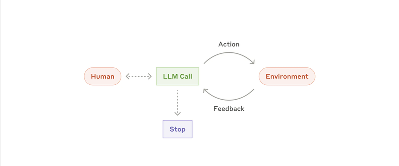
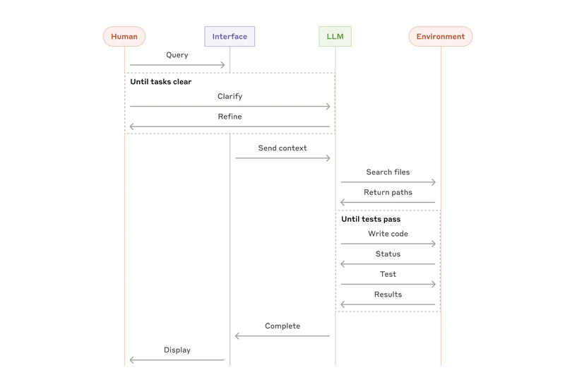

# 模块三：自主 Agent 设计

> 对应 PDF 第 8-11 页

---

## 概念讲解

### 1. 从 Workflow 到 Agent：质变还是量变？

**回顾**：模块二介绍的五种 Workflow 模式，本质上都是**人预先编排好流程**，LLM 在流程内执行。而 Agent 是一个根本性的转变——**LLM 自己决定做什么、怎么做、什么时候停**。

**时代背景**：原文特别指出，Agent **正在从理论走向生产**（"Agents are emerging in production as LLMs mature"）。这不是遥远的未来概念，而是随着 LLM 能力成熟，正在实际部署的技术方向。

**Agent 的前提条件**：LLM 需要在以下四项关键能力上足够成熟：

| 能力 | 说明 |
|------|------|
| 理解复杂输入 | 能准确理解用户意图和上下文 |
| 推理和规划 | 能拆解任务、制定执行策略 |
| 可靠地使用工具 | 能正确调用工具并处理返回结果 |
| 从错误中恢复 | 遇到问题能自我调整，不会一条路走到黑 |

> **关键洞察**：Agent 不是"更复杂的 Workflow"。Workflow 是你在控制，Agent 是模型在控制。这是架构设计上的根本区别。

---

### 2. Agent 的运行循环

**核心机制**：Agent 本质上就是一个 **LLM 在循环中基于环境反馈使用工具** 的系统。没有什么神秘的。原文明确说："They are typically just LLMs using tools based on environmental feedback in a loop."



> **图说**：LLM Call 处于中心，和 Environment（环境）之间形成 Action → Feedback 循环。LLM 执行动作，环境返回反馈，LLM 基于反馈决定下一步。Human（人类）通过虚线与 LLM 交互（可选介入）。满足条件后 LLM 触发 Stop（停止）。

**Agent 的生命周期**：

```
人类给出任务（或交互讨论明确任务）
        ↓
Agent 规划 & 独立执行
   ↓ (循环)
   执行动作 → 获取环境反馈 → 评估进展 → 决定下一步
   ↓ (可选)
   暂停请求人类反馈/判断
        ↓
任务完成 或 达到停止条件
```

**"Ground Truth" 的重要性**：

Anthropic 特别强调，Agent 在每一步都需要从环境获取**真实反馈（ground truth）**。什么意思？

- 不是让 Agent 自己"想象"执行结果
- 而是**真正执行**（比如跑代码、调 API），获取**真实的结果**
- 然后基于真实结果评估进展

> **类比**：这就像开车要看路况而不是闭眼开——你得不断从环境获取真实信息来调整方向。

**工具设计至关重要**：正因为 Agent 的实现"只是 LLM 在循环中用工具"，所以工具集（toolset）和工具文档的质量就变成了决定 Agent 好坏的关键。原文在此处前向引用了 Appendix 2（详见模块四），强调要在工具设计上投入大量精力。

---

### 3. 停止条件设计

Agent 的停止条件非常关键，否则它可能会无限循环或者偏离目标。常见的停止条件：

| 类型 | 说明 | 例子 |
|------|------|------|
| 任务完成 | Agent 判断已完成目标 | 代码修改通过所有测试 |
| 最大迭代数 | 设定上限防止无限循环 | 最多 10 轮 |
| 人类介入点 | 到特定节点必须等人类确认 | 涉及删除操作时暂停 |
| 失败退出 | 连续失败或无法恢复 | 连续 3 次工具调用失败 |

> **最佳实践**：即使你信任 Agent 的决策能力，也一定要设置**最大迭代数**作为安全网。

---

### 4. 何时使用 Agent

**适用场景**：
- **开放式问题**：无法预测需要多少步骤
- **无法硬编码固定路径**：每次任务的流程可能完全不同
- **需要多轮操作**：LLM 可能需要很多轮才能完成
- **在可信环境中运行**：你对 LLM 的决策有一定信任

关于最后一点，原文的措辞是 "scaling tasks in **trusted environments**"。"可信环境"是一个重要的限定条件——它意味着 Agent 运行的环境应该是受控的，而不是随意暴露在不可信的外部环境中。这也是为什么后面要强调沙盒测试。

**不适用场景**（反面思考）：
- 如果任务流程是固定的 → 用 Workflow
- 如果你需要严格控制每一步 → 用 Workflow
- 如果成本敏感 → Agent 的多轮调用会很贵

---

### 5. Agent 的风险：错误累积放大

**关键警告**：Agent 的自主性带来更高的成本，以及**错误累积放大（compounding errors）**的风险。

什么是错误累积放大？在 Workflow 中，一个步骤的错误通常只影响那一步的输出。但在 Agent 中，每一步的决策基于前一步的结果。如果第 3 步犯了一个小错误，第 4 步基于错误结果继续决策，到第 5 步错误可能已经被放大了。这就像一连串的多米诺骨牌——早期的小偏差会在后续步骤中层层放大。

**Anthropic 的应对建议**：

> **在沙盒环境中进行大量测试**（"We recommend extensive testing in sandboxed environments, along with the appropriate guardrails."）

这不是泛泛而谈的"要做测试"。Anthropic 明确建议用**沙盒环境（sandboxed environments）**——隔离的、不会造成真实损害的环境。加上合适的 guardrails（安全护栏），才能放心地让 Agent 在生产中运行。

> **总结**：Agent 比 Workflow 需要更多的安全措施，原因是 Workflow 的控制权在人手里，而 Agent 的控制权在模型手里。错误累积放大 + 自主决策 = 必须有更强的安全网。

---

### 6. Anthropic 的实际案例

1. **SWE-bench Coding Agent**：基于任务描述，对多个文件进行修改。需要 Agent 因为每次涉及的文件数量和修改内容都不同。
2. **Computer Use Agent**：Claude 操作电脑来完成任务。是完全开放式的 Agent 场景。

---

### 7. Coding Agent 实例分析



> **图说**：这是一个 Coding Agent 的完整交互序列图。Human 发起 Query，通过 Interface 与 LLM 交互。首先是 "Until tasks clear" 循环——Human 和 LLM 通过 Clarify/Refine 明确任务。然后 LLM 发送 context 到 Environment，搜索文件、获取路径。接着进入 "Until tests pass" 循环——Write code → 检查 Status → Test → 获取 Results，反复迭代直到测试通过。最后 Complete 并 Display 结果给 Human。

**这张图揭示了 Agent 设计的几个关键要素**：

1. **任务澄清阶段**：Agent 不是拿到任务就闷头干，而是先和人交互确认需求
2. **环境交互**：Agent 会搜索代码库、读取文件——这就是 "ground truth"
3. **测试驱动迭代**：写代码 → 跑测试 → 看结果 → 修改，和人类开发者一样
4. **结果展示**：完成后将结果展示给人类

---

### 8. 模式组合与定制策略

**关键认知**：模块二和本模块介绍的所有模式（5 种 Workflow + Agent）**不是互斥的**。它们是可以组合的构建块：

- 可以在 Agent 内部使用 Prompt Chaining
- 可以用 Routing 来决定是走 Workflow 还是启动 Agent
- 可以在 Orchestrator-Workers 的 Worker 里嵌套 Evaluator-Optimizer

**成功关键**：
- **度量表现**：不是凭感觉加复杂度，而是用数据说话
- **迭代改进**：先做简单版本，测量不够好了再加复杂度
- **只在有可证明的改善时才加复杂度**（这是原文反复强调的）

---

### 9. 三大核心原则（Summary）

Anthropic 在实现 Agent 时遵循的三条原则：

| # | 原则 | 英文 | 解释 |
|---|------|------|------|
| 1 | 保持简单 | Maintain simplicity | Agent 的设计越简单越好 |
| 2 | 透明可见 | Prioritize transparency | 明确展示 Agent 的规划步骤，让人知道它在干什么 |
| 3 | 精心打磨 ACI | Carefully craft ACI | 在工具文档和测试上投入大量精力 |

> **ACI = Agent-Computer Interface（Agent-计算机接口）**，和 HCI（Human-Computer Interface）相对应。Anthropic 认为设计 ACI 应该投入和设计 HCI 一样多的精力。

**一句话总结全文**：

> 成功不在于构建最复杂的系统，而在于构建**最适合你需求的系统**（"building the right system for your needs"）。从简单 prompt 开始，用全面评估来优化，只在简单方案不够用时才引入多步 agentic system。

---

## 问答记录

> 待补充（学习后讨论时填写）

---

## 重点标记

1. **Agent 正在走向生产**：不是未来概念，而是随着 LLM 成熟正在实际部署
2. **Agent 的本质**：LLM + 工具 + 环境反馈循环，没有什么黑魔法
3. **Ground Truth 至关重要**：Agent 每一步都必须从环境获取真实反馈，不能"想象"结果
4. **必须设停止条件**：最大迭代数是安全底线
5. **可信环境限定**：Agent 适合在受控的可信环境中规模化运行
6. **错误累积放大**：Agent 的每一步决策基于前一步结果，早期小错可能后期被放大成大错
7. **沙盒测试是必须的**：不是可选项——Anthropic 明确建议在沙盒环境中做大量测试
8. **模式可组合**：5 种 Workflow + Agent 是构建块，不是互斥选项
9. **三大原则**：简单、透明、打磨 ACI
