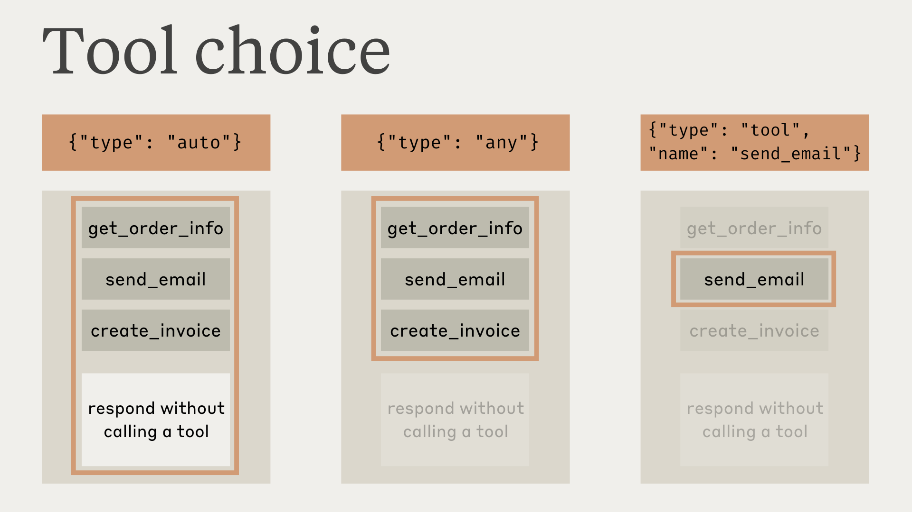

# 模块 01：工具定义与实现

> 对应源文件：`tools/how-to-implement-tool-use.md`

---

## 概念地图

- **核心概念** (必须内化): 工具定义三要素与描述最佳实践、tool_choice 控制策略、Agentic Tool Loop（Tool Runner）
- **实操要点** (动手时需要): 错误处理（is_error / max_tokens / pause_turn）、Parallel Tool Use 格式要求、input_examples 用法
- **背景知识** (扩展理解): 用工具定义强制 JSON 输出、模型选择建议

---

## 概念讲解

### 1. 工具定义：三要素与描述的艺术

在 Module 00 中你已经看到了工具定义的样子，这里深入拆解它的结构和最佳实践。

一个工具定义由三个必填字段和一个可选字段组成：

| 字段 | 类型 | 作用 |
|------|------|------|
| `name` | string | 工具标识符，必须匹配 `^[a-zA-Z0-9_-]{1,64}$` |
| `description` | string | **最影响 Claude 表现的字段**——告诉 Claude 这个工具干什么、什么时候用、有什么限制 |
| `input_schema` | JSON Schema | 定义参数结构——类型、描述、枚举值、必填/可选 |
| `input_examples` | array (可选) | 具体的输入示例，帮助 Claude 理解复杂工具的用法 |

**description 是工具定义的灵魂。** Anthropic 官方文档把这一点说得非常明确：description 是影响工具性能**最重要的因素（by far）**。因为 Claude 决定要不要用工具、怎么用工具，全靠理解你的描述。

好的 description vs 差的 description：

```json
// ❌ 差的——Claude 不知道该什么时候用、返回什么、ticker 格式是什么
{
  "name": "get_stock_price",
  "description": "Gets the stock price for a ticker.",
  "input_schema": {
    "type": "object",
    "properties": {
      "ticker": { "type": "string" }
    },
    "required": ["ticker"]
  }
}

// ✅ 好的——什么时候用、什么不返回、参数示例、交易所限制全都有
{
  "name": "get_stock_price",
  "description": "Retrieves the current stock price for a given ticker symbol. The ticker symbol must be a valid symbol for a publicly traded company on a major US stock exchange like NYSE or NASDAQ. The tool will return the latest trade price in USD. It should be used when the user asks about the current or most recent price of a specific stock. It will not provide any other information about the stock or company.",
  "input_schema": {
    "type": "object",
    "properties": {
      "ticker": {
        "type": "string",
        "description": "The stock ticker symbol, e.g. AAPL for Apple Inc."
      }
    },
    "required": ["ticker"]
  }
}
```

**写好 description 的清单**：
- 工具做什么（核心功能）
- 什么时候应该用它（触发条件）
- 什么时候**不应该**用它（边界条件）
- 返回什么格式的数据（输出预期）
- 有什么限制或注意事项（如"只支持美国股市"）
- 每个参数的含义和格式（可以在参数的 description 里补充）
- 目标：至少 3-4 句话，复杂工具更多

> **你正在体验的 description**：你现在使用的 Claude Code 中每个工具都有详细的 description。比如 Read 工具的描述里说明了"file_path 必须是绝对路径""可以读取图片""可以读取 PDF"——这些细节决定了我什么时候选择用 Read 而不是 Bash cat。

**input_examples——复杂工具的救星**：

对于参数结构简单的工具，好的 description + input_schema 就够了。但如果你的工具有嵌套对象、可选参数组合、或格式敏感的输入，可以用 `input_examples` 给 Claude 看几个具体的"正确调用长什么样"：

```python
{
    "name": "get_weather",
    "description": "Get the current weather in a given location",
    "input_schema": { ... },
    "input_examples": [
        {"location": "San Francisco, CA", "unit": "fahrenheit"},
        {"location": "Tokyo, Japan", "unit": "celsius"},
        {"location": "New York, NY"}  # 展示 unit 是可选的
    ]
}
```

注意事项：
- 每个示例**必须通过 input_schema 验证**，否则返回 400 错误
- 只能用于 Client Tool（Server Tool 不支持）
- 每个示例增加约 20-50 tokens（简单）到 100-200 tokens（复杂嵌套）的开销

### 2. tool_choice：控制 Claude 的工具使用行为

你不一定要让 Claude 自己决定用不用工具——`tool_choice` 参数让你精确控制：

| tool_choice | 行为 | 典型场景 |
|-------------|------|----------|
| `auto`（默认） | Claude 自己判断要不要用工具 | 大多数场景 |
| `any` | 必须用工具，但 Claude 选哪个 | 确保触发工具调用 |
| `tool` + `name` | 必须用指定的那个工具 | 强制使用特定工具 |
| `none` | 禁止使用工具 | 只要文字回答，不要调工具 |



> **图说**：四种 tool_choice 模式的行为对比——`auto` 让 Claude 自由选择，`any` 强制使用但不限定，`tool` 强制使用指定工具，`none` 完全禁用。

**关键陷阱**：当 `tool_choice` 设为 `any` 或 `tool` 时，API 会**预填充 assistant 消息**来强制调用工具。这意味着 Claude **不会在调用工具之前说任何自然语言**——即使你在 prompt 里要求"先解释再调用"，它也做不到。

```python
# 你期望 Claude 先说"让我查一下天气"再调用工具？
# 用 tool_choice={"type": "tool", "name": "get_weather"} 做不到。

# 替代方案：用 auto + 明确指令
response = client.messages.create(
    model="claude-opus-4-6",
    max_tokens=1024,
    tool_choice={"type": "auto"},  # 不强制
    tools=[...],
    messages=[{
        "role": "user",
        "content": "What's the weather in London? Use the get_weather tool in your response."
        # 用自然语言引导，而不是 tool_choice 强制
    }]
)
```

**与 Extended Thinking 的兼容性**：如果你使用 Extended Thinking（扩展思考），只能用 `auto` 和 `none`——`any` 和 `tool` 会报错。

**与 Strict Tool Use 的组合**：`tool_choice: any` + `strict: true` 可以**同时保证**两件事：(1) 一定会调用工具，(2) 工具输入一定符合 Schema。适合生产环境中不容许格式错误的场景。

### 3. Tool Runner：Agentic 工具循环

手动处理 tool_use → 执行 → tool_result → 下一轮……这个循环代码写多了会很烦。Anthropic 的 SDK 提供了 **Tool Runner**（Beta），自动帮你管理整个循环：

**手动循环 vs Tool Runner 对比**：

```python
# ❌ 手动循环——你要自己写循环、匹配 ID、管理消息历史
while response.stop_reason == "tool_use":
    tool_results = []
    for block in response.content:
        if block.type == "tool_use":
            result = execute_tool(block.name, block.input)
            tool_results.append({
                "type": "tool_result",
                "tool_use_id": block.id,
                "content": result
            })
    messages.append({"role": "assistant", "content": response.content})
    messages.append({"role": "user", "content": tool_results})
    response = client.messages.create(model=..., messages=messages, tools=tools)

# ✅ Tool Runner——定义工具函数，循环自动管理
@beta_tool
def get_weather(location: str, unit: str = "fahrenheit") -> str:
    """Get the current weather in a given location.

    Args:
        location: The city and state, e.g. San Francisco, CA
        unit: Temperature unit, either 'celsius' or 'fahrenheit'
    """
    return json.dumps({"temperature": "20°C", "condition": "Sunny"})

runner = client.beta.messages.tool_runner(
    model="claude-opus-4-6",
    max_tokens=1024,
    tools=[get_weather],
    messages=[{"role": "user", "content": "巴黎天气怎样？"}],
)
# 遍历每个中间消息
for message in runner:
    print(message.content[0].text)
# 或者直接拿最终结果
final = runner.until_done()
```

**Tool Runner 的工作原理**：

```
你传入工具函数列表 + 用户消息
    ↓
Runner 调 Claude API
    ↓
Claude 返回 tool_use? ─── 否 → 返回最终消息，循环结束
    │
    是
    ↓
Runner 自动执行对应的工具函数
    ↓
Runner 把 tool_result 加入消息历史
    ↓
Runner 再次调 Claude API（循环）
```

**`@beta_tool` 装饰器的魔法**：
- 从函数签名提取参数名和类型 → 自动生成 `input_schema`
- 从 docstring 提取描述 → 自动填充 `description`
- 返回值必须是 string（如果是 dict，先 `json.dumps`）

TypeScript 侧有两种风格：
- `betaZodTool()` —— 用 Zod Schema 定义，类型安全，推荐
- `betaTool()` —— 用 JSON Schema 定义，更灵活

**高级用法**——在循环中自定义行为：

```python
for message in runner:
    # 1. 检查工具执行结果（可用于日志/告警）
    tool_response = runner.generate_tool_call_response()
    if tool_response:
        for block in tool_response.content:
            if block.is_error:
                logger.error(f"Tool failed: {block.content}")

    # 2. 修改下一轮请求的参数
    runner.set_messages_params(lambda params: {**params, "max_tokens": 2048})

    # 3. 注入额外消息（比如追加用户指令）
    runner.append_messages({"role": "user", "content": "请简洁回答"})
```

**Streaming 模式**：加 `stream=True` 即可，Runner 返回的是流对象而非完整消息：

```python
runner = client.beta.messages.tool_runner(
    ..., stream=True
)
for message_stream in runner:
    for event in message_stream:
        print(event)  # 实时接收每个 token
```

> **Tool Runner 目前是 Beta**：可用于 Python、TypeScript、Ruby SDK。功能稳定但 API 可能变化。对于生产环境，评估你是否需要手动循环的完全控制权。

### 4. 错误处理全景

Tool Use 中有三类错误需要处理，每类的应对策略不同：

#### 4.1 工具执行错误（is_error）

你的工具代码执行出错时（网络超时、数据库连接失败、参数非法……），用 `is_error: true` 告诉 Claude：

```json
{
  "type": "tool_result",
  "tool_use_id": "toolu_xxx",
  "content": "ConnectionError: the weather service API is not available (HTTP 500)",
  "is_error": true
}
```

Claude 收到后不会崩溃——它会**优雅地把错误融入回答**，比如说"抱歉，天气服务暂时不可用，请稍后再试"。

如果 Claude 调用工具时**参数不对**（缺少必填字段、格式错误），同样用 `is_error: true` 返回错误信息。Claude 通常会**自动重试 2-3 次**并修正参数。

> **根治参数错误**：与其让 Claude 反复重试，不如用 `strict: true`（Structured Output）从源头杜绝——保证 Claude 的工具输入 100% 符合 Schema。

#### 4.2 max_tokens 截断

如果 Claude 的回复被 `max_tokens` 截断，而截断发生在 `tool_use` 块中间——你拿到的是一个不完整的工具调用，无法执行：

```python
if response.stop_reason == "max_tokens":
    last_block = response.content[-1]
    if last_block.type == "tool_use":
        # 工具调用被截断了，增大 max_tokens 重试
        response = client.messages.create(
            ..., max_tokens=4096  # 原来 1024 不够
        )
```

#### 4.3 pause_turn（Server Tool 专属）

Server Tool 的服务端循环默认上限 10 次迭代。达到上限时返回 `stop_reason: "pause_turn"`，意思是"我还没做完，但迭代次数到了"。处理方式：

```python
if response.stop_reason == "pause_turn":
    # 把 Claude 的不完整回复作为 assistant 消息加入历史，让它继续
    messages.append({"role": "assistant", "content": response.content})
    continuation = client.messages.create(
        model=..., messages=messages, tools=tools
    )
```

| 错误类型 | stop_reason | 你该做什么 |
|----------|-------------|-----------|
| 工具执行失败 | `tool_use` | 返回 `is_error: true`，Claude 会优雅处理或重试 |
| 回复被截断 | `max_tokens` | 增大 `max_tokens` 重新请求 |
| 服务端循环到上限 | `pause_turn` | 把响应塞回消息历史，继续请求 |
| 正常结束 | `end_turn` | 对话完成，取最终文本 |
| 工具调用（正常） | `tool_use` | 执行工具，返回 `tool_result` |

> **Tool Runner 自动处理了大部分**：如果你用 Tool Runner，`is_error` 会被自动捕获并发回 Claude（工具函数抛异常时），循环管理也是自动的。手动处理主要用于需要自定义行为（如提前终止、错误告警）的场景。

### 5. Parallel Tool Use 实现细节

Claude 可以在一次响应中调用多个工具。这不是你需要"开启"的功能——它是默认行为。但**格式搞错会导致 Claude 退化为顺序调用**。

**正确格式——核心规则**：

```
规则 1：所有 tool_result 放在同一个 user 消息中
规则 2：tool_result 必须在 content 数组的最前面（文字在后面）
规则 3：每个 tool_result 的 tool_use_id 必须匹配对应的 tool_use
```

```json
// ❌ 错误：分成两条 user 消息
[
  {"role": "assistant", "content": [tool_use_1, tool_use_2]},
  {"role": "user", "content": [tool_result_1]},
  {"role": "user", "content": [tool_result_2]}
]

// ❌ 错误：文字在 tool_result 前面
{"role": "user", "content": [
  {"type": "text", "text": "Here are the results:"},
  {"type": "tool_result", "tool_use_id": "toolu_01", ...}
]}

// ✅ 正确：所有 tool_result 在同一条消息、最前面
{"role": "user", "content": [
  {"type": "tool_result", "tool_use_id": "toolu_01", "content": "result_1"},
  {"type": "tool_result", "tool_use_id": "toolu_02", "content": "result_2"},
  {"type": "text", "text": "What should I do next?"}  // 文字在最后
]}
```

**禁用并行调用**：某些场景下你不希望 Claude 并行调用（比如工具之间有隐式依赖），用 `disable_parallel_tool_use: true`：

```python
response = client.messages.create(
    ...,
    tool_choice={"type": "auto", "disable_parallel_tool_use": True}
    # auto + 禁用并行 = 最多调一个工具
    # any/tool + 禁用并行 = 恰好调一个工具
)
```

**提升并行调用率**——如果 Claude 默认不够积极地并行调用：

```text
# 在 system prompt 中加入（Claude 4 系列）：
<use_parallel_tool_calls>
For maximum efficiency, whenever you perform multiple independent operations,
invoke all relevant tools simultaneously rather than sequentially.
Prioritize calling tools in parallel whenever possible.
</use_parallel_tool_calls>
```

**测量并行效果**：

```python
# 计算平均每条工具消息包含几个 tool_use
tool_call_messages = [msg for msg in messages
                      if any(block.type == "tool_use" for block in msg.content)]
avg = sum(len([b for b in msg.content if b.type == "tool_use"])
          for msg in tool_call_messages) / len(tool_call_messages)
# > 1.0 说明并行调用在工作
```

### 6. 用工具定义强制 JSON 输出

一个巧妙的用法：工具不一定要对应真正的函数。你可以定义一个"虚拟工具"，纯粹用来让 Claude 输出结构化 JSON：

```python
response = client.messages.create(
    model="claude-opus-4-6",
    max_tokens=1024,
    tool_choice={"type": "tool", "name": "record_summary"},
    tools=[{
        "name": "record_summary",
        "description": "Records a structured summary of the article",
        "input_schema": {
            "type": "object",
            "properties": {
                "title": {"type": "string", "description": "Article title"},
                "key_points": {
                    "type": "array",
                    "items": {"type": "string"},
                    "description": "3-5 key takeaways"
                },
                "sentiment": {
                    "type": "string",
                    "enum": ["positive", "negative", "neutral"]
                }
            },
            "required": ["title", "key_points", "sentiment"]
        }
    }],
    messages=[{"role": "user", "content": "Summarize this article: ..."}]
)

# Claude 被强制调用 record_summary，输出符合 Schema 的 JSON
# 你不需要真的执行这个"工具"——直接从 tool_use.input 取结构化数据
structured_data = response.content[1].input  # {"title": "...", "key_points": [...], ...}
```

这种模式本质上是用 Tool Use 协议来代替"请输出 JSON"的 prompt hack——Claude 被 tool_choice 强制调用，JSON Schema 保证了输出格式。

> **更规范的替代方案**：Anthropic 现在提供了专门的 [Structured Output](/docs/en/build-with-claude/structured-outputs) 功能，支持 `strict: true` 来保证输出 100% 符合 Schema。如果你只是需要结构化输出而不需要工具调用的语义，优先用 Structured Output。

---

## 重点标记

1. **description 是工具定义中最重要的字段**：至少 3-4 句话，覆盖"做什么/什么时候用/不能做什么/参数格式"
2. **tool_choice 为 `any`/`tool` 时，Claude 不会输出自然语言**：因为 API 预填充了 assistant 消息。想要解释+调用，用 `auto` + 明确指令
3. **Tool Runner 是生产级 Tool Use 的最佳起点**：自动管理循环、错误处理、消息历史，用 `@beta_tool` 装饰器零样板代码
4. **Parallel Tool Use 的格式是刚性约束**：tool_result 必须全部在同一个 user 消息中、排在 content 数组最前面。格式错误会导致退化
5. **三种 stop_reason 三种应对**：`tool_use` → 执行工具返回结果；`max_tokens` → 增大限制重试；`pause_turn` → 把响应塞回继续
6. **工具定义可以当 JSON 输出模板用**：但优先考虑 Structured Output（`strict: true`）

---

## 自测：你真的理解了吗？

**Q1**：你定义了一个 `search_database` 工具，description 只写了"搜索数据库"。Claude 有时候在用户问天气时也调用这个工具。最可能的原因是什么？你会怎么改？

**Q2**：你用 `tool_choice: {"type": "tool", "name": "analyze"}` 强制调用分析工具，但发现 Claude 从来不在回复中解释它的分析过程——直接就是工具调用。这是 bug 吗？怎么既强制调用又保留解释？

**Q3**：你的 Agent 连续调用了 5 轮工具后返回了 `stop_reason: "pause_turn"`。你应该怎么处理？如果直接丢弃这个响应重新发请求会怎样？

**Q4**：Claude 返回了 3 个并行的 tool_use。你执行了第 1 个和第 3 个成功了，第 2 个失败了。你应该怎么构造 tool_result 消息？（提示：成功和失败的结果能放在同一条消息里吗？）

**Q5**：你在生产环境中有 30 个工具，但平均每次对话只需要用到 3-4 个。你发现每次请求的 input token 数很高。从本模块学到的知识中，你能想到哪些优化方向？
