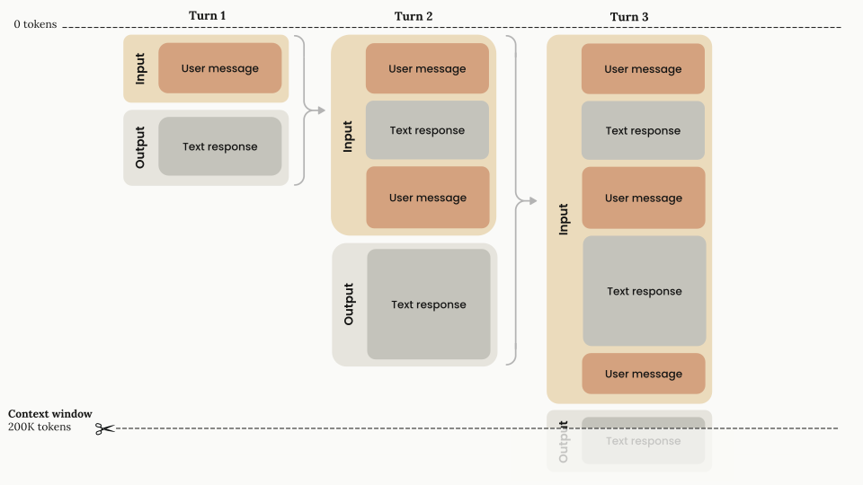
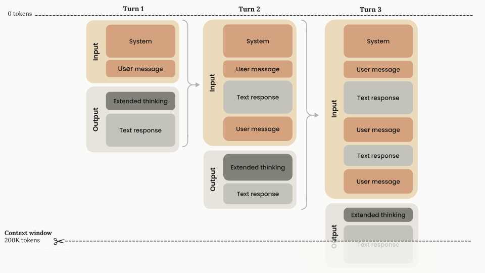
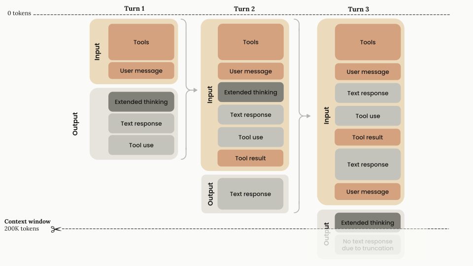
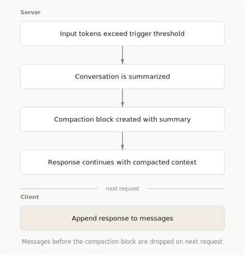
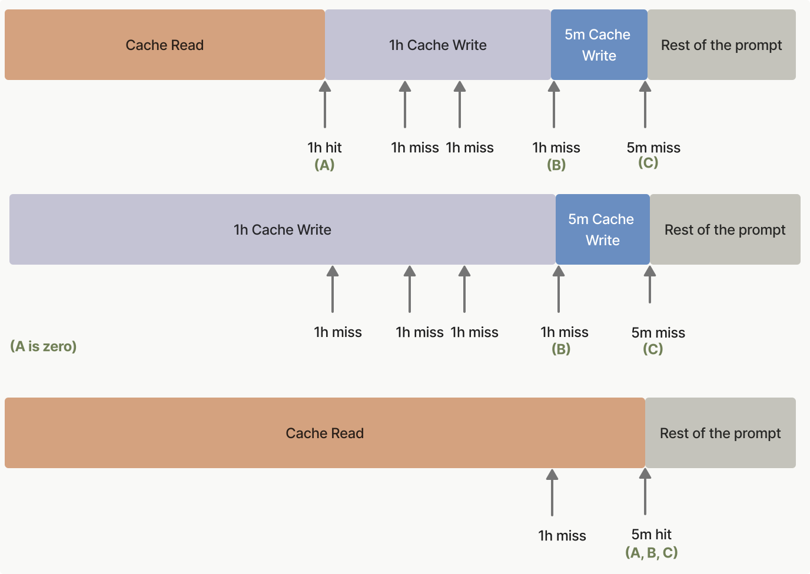

# 模块 04：Context 管理与优化

> 对应源文件：`context-management/context-windows.md`, `compaction.md`, `context-editing.md`, `prompt-caching.md`, `token-counting.md`

---

## 概念地图

- **核心概念** (必须内化): Context Window 结构与增长模型、Prompt Caching（自动缓存 + 显式断点）
- **实操要点** (动手时需要): Compaction（服务端压缩）、Context Editing（工具结果清除 + 思考块清除）、Token Counting
- **背景知识** (扩展理解): 1M Token 上下文窗口（Beta）、Context Awareness、Extended Thinking 与缓存的交互

---

## 概念讲解

### 1. Context Window：工作台面积

Context Window（上下文窗口）是 Claude 在生成回答时能"看到"的所有文本——包括回答本身。它不是训练数据，而是**工作记忆**。

**直觉建立**：

想象你有一张固定大小的书桌。桌上堆着你们的对话记录、工具调用结果、系统指令。每说一轮话，桌上就多一摞纸。桌子满了怎么办？你得清理（Context Editing）、压缩（Compaction），或者复用之前整理好的笔记（Prompt Caching）。

**增长模型——线性累积**：



每一轮对话包含：
- **Input**：之前所有的对话历史 + 当前用户消息
- **Output**：Claude 的回复（生成后变成下一轮的 input）

关键数字：标准 Context Window 是 **200K tokens**。Claude Opus 4.6 / Sonnet 4.6 / Sonnet 4.5 / Sonnet 4 支持 **1M tokens**（Beta，需要 Tier 4+，超过 200K 部分 input 2x / output 1.5x 计价）。

**Extended Thinking 的特殊处理**：



Extended Thinking（扩展思考）生成的 thinking 块会占用当前轮的输出 token，但**前一轮的 thinking 块会被自动移除**——不会累积到后续输入中。你不需要手动删除它们，API 会自动处理。

唯一的例外：**工具调用期间必须保留 thinking 块**。如果 Claude 输出了 thinking + tool_use，你返回 tool_result 时必须带上完整的 thinking 块（含签名）。工具调用完成、到了下一个 user 消息时，thinking 块才能被丢弃。



**Context Awareness（上下文感知）**：

Claude Sonnet 4.6 / Sonnet 4.5 / Haiku 4.5 有一个特殊能力——它们知道自己还剩多少上下文空间：

```xml
<!-- 对话开始时 Claude 收到 -->
<budget:token_budget>200000</budget:token_budget>

<!-- 每次工具调用后更新 -->
<system_warning>Token usage: 35000/200000; 165000 remaining</system_warning>
```

这让 Claude 能更好地管理长任务——知道空间快用完时主动收尾，而不是突然被截断。

**新模型行为变化**：从 Claude Sonnet 3.7 开始，超出 Context Window 会直接返回**验证错误**（不再静默截断）。这要求你更主动地管理 token 用量。

### 2. Compaction：服务端自动压缩

当对话接近 Context Window 上限时，Compaction 自动把早期对话**压缩成摘要**，释放空间让对话继续。

**工作原理**：



```
1. 你的请求 input tokens 超过触发阈值（默认 150K）
2. Claude 自动生成一份对话摘要
3. 摘要以 compaction 块的形式出现在 assistant 响应开头
4. 后续请求中，compaction 块之前的所有内容被忽略
5. 对话从摘要继续，就像从存档点恢复
```

**基本用法**：

```python
response = client.beta.messages.create(
    betas=["compact-2026-01-12"],
    model="claude-opus-4-6",
    max_tokens=4096,
    messages=messages,
    context_management={
        "edits": [{"type": "compact_20260112"}]
    }
)

# 把响应（含 compaction 块）加入消息历史
messages.append({"role": "assistant", "content": response.content})
# API 会自动忽略 compaction 块之前的旧内容
```

**参数配置**：

| 参数 | 默认值 | 作用 |
|------|--------|------|
| `trigger` | 150,000 tokens | 何时触发压缩（最低 50,000） |
| `pause_after_compaction` | `false` | 压缩后暂停，让你插入额外内容 |
| `instructions` | 内置摘要提示词 | 自定义摘要策略（完全替换默认） |

**`pause_after_compaction`——精细控制压缩后的上下文**：

设为 `true` 时，压缩后 API 返回 `stop_reason: "compaction"` 并暂停。你可以在这个间隙：
- 保留最近 N 条原始消息（不被摘要替代）
- 注入特定的指令或状态信息
- 估算总 token 消耗，决定是否让 Claude 收尾

```python
if response.stop_reason == "compaction":
    messages.append({"role": "assistant", "content": response.content})
    # 可以在这里添加额外消息
    response = client.beta.messages.create(...)  # 继续
```

**Token 预算控制——防止无限消耗**：

```python
TRIGGER = 100_000
BUDGET = 3_000_000
n_compactions = 0

# 每次压缩触发时
if response.stop_reason == "compaction":
    n_compactions += 1
    if n_compactions * TRIGGER >= BUDGET:
        messages.append({"role": "user",
            "content": "Please wrap up and summarize the final state."})
```

**与 Prompt Caching 的协同**：

Compaction 块可以加 `cache_control` 断点来缓存摘要。更重要的是：在 system prompt 上加独立的 `cache_control` 断点，这样压缩发生时 system prompt 的缓存不受影响。

**计费**：Compaction 需要一次额外的采样（生成摘要），按正常 input + output token 计费。`usage.iterations` 数组分别列出 compaction 和 message 的 token 消耗。

> **你正在体验 Compaction**：Claude Code 的对话超长时会自动压缩上下文，你看到的"conversation compressed"提示就是 Compaction 在工作。

### 3. Context Editing：精准清除

如果说 Compaction 是"全局压缩"，Context Editing 就是"精准手术"——选择性清除对话中的特定内容。

**两种服务端策略**：

| 策略 | 类型名 | 作用 | 适用场景 |
|------|--------|------|---------|
| Tool Result Clearing | `clear_tool_uses_20250919` | 清除旧的工具调用结果 | Agent 大量工具调用，旧结果不再需要 |
| Thinking Block Clearing | `clear_thinking_20251015` | 清除旧的 thinking 块 | 使用 Extended Thinking 的长对话 |

**Tool Result Clearing——Agent 场景的主力**：

```python
response = client.beta.messages.create(
    model="claude-opus-4-6",
    max_tokens=4096,
    messages=messages,
    tools=[...],
    betas=["context-management-2025-06-27"],
    context_management={
        "edits": [{
            "type": "clear_tool_uses_20250919",
            "trigger": {"type": "input_tokens", "value": 30000},  # 何时触发
            "keep": {"type": "tool_uses", "value": 3},  # 保留最近 3 组
            "clear_at_least": {"type": "input_tokens", "value": 5000},  # 每次至少清这么多
            "exclude_tools": ["web_search"]  # 这个工具的结果不清除
        }]
    }
)
```

工作方式：超过阈值时，按时间顺序从最旧的工具结果开始清除，替换为占位文本（Claude 知道内容被清除了）。默认只清除 tool_result，设 `clear_tool_inputs: true` 可以同时清除 tool_use 参数。

**Thinking Block Clearing**：

```python
context_management={
    "edits": [{
        "type": "clear_thinking_20251015",
        "keep": {"type": "thinking_turns", "value": 2}  # 保留最近 2 轮的 thinking
        # 或 "keep": "all" 保留全部（最大化缓存命中）
    }]
}
```

默认行为（不配置时）：只保留最后一轮 assistant 的 thinking 块。

**两种策略可以组合**：

```python
context_management={
    "edits": [
        {"type": "clear_thinking_20251015", "keep": {"type": "thinking_turns", "value": 2}},
        {"type": "clear_tool_uses_20250919", "trigger": {"type": "input_tokens", "value": 50000}},
    ]
}
# 注意：clear_thinking 必须排在 clear_tool_uses 前面
```

**与 Memory Tool 的协同**：

Context Editing 接近清除阈值时，Claude 会收到**自动警告**——如果同时启用了 Memory Tool，Claude 可以在内容被清除前把重要信息写入 Memory 文件。这实现了"工作记忆溢出 → 写入长期存储"的模式。

**服务端执行**：Context Editing 在 API 服务端执行——你的客户端保持完整的消息历史不变，清除操作对你透明。响应中的 `context_management.applied_edits` 告诉你发生了什么清除。

### 4. Prompt Caching：让重复内容只处理一次

Tool Use 中，工具定义、system prompt、长文档这些**每轮都不变的内容**占了大量 input token。Prompt Caching 让这些内容被缓存——第一次处理，后续直接复用。

**两种启用方式**：

| 方式 | 用法 | 适用场景 |
|------|------|---------|
| **自动缓存** | 请求顶层加 `cache_control` | 多轮对话，缓存点随对话增长自动前移 |
| **显式断点** | 在具体内容块上加 `cache_control` | 需要精细控制不同部分的缓存 |

**自动缓存——最简单的起步方式**：

```python
response = client.messages.create(
    model="claude-opus-4-6",
    max_tokens=1024,
    cache_control={"type": "ephemeral"},  # 顶层一行即可
    system="You are a helpful assistant...",
    messages=[...]
)
```

自动缓存会把缓存断点自动放在最后一个可缓存的块上。多轮对话中缓存点自动前移：

| 请求 | 缓存行为 |
|------|---------|
| 请求 1: System + User:A + Asst:B + **User:C** ← cache | 全部写入缓存 |
| 请求 2: System + User:A + Asst:B + User:C + Asst:D + **User:E** ← cache | System→User:C 从缓存读取；Asst:D + User:E 写入缓存 |
| 请求 3: 同理，缓存不断前移 | 旧内容从缓存读取，新内容写入缓存 |

**显式断点——精细控制**：

最多 **4 个** `cache_control` 断点，可以分别缓存不同部分：

```python
response = client.messages.create(
    model="claude-opus-4-6",
    max_tokens=1024,
    tools=[
        {"name": "tool_1", ...},
        {"name": "tool_2", ..., "cache_control": {"type": "ephemeral"}},  # 断点 1：缓存所有工具
    ],
    system=[
        {"type": "text", "text": "Instructions...", "cache_control": {"type": "ephemeral"}},  # 断点 2
        {"type": "text", "text": "RAG documents...", "cache_control": {"type": "ephemeral"}},  # 断点 3
    ],
    messages=[
        ...,
        {"role": "user", "content": [
            {"type": "text", "text": "...", "cache_control": {"type": "ephemeral"}}  # 断点 4
        ]}
    ]
)
```

4 个断点分别缓存：工具定义（很少变）、指令（偶尔变）、RAG 文档（每天变）、对话历史（每轮变）。更新 RAG 文档只让第 3-4 段缓存失效，工具和指令的缓存不受影响。

**定价——缓存读取极便宜**：

| 操作 | 相对于基础 input token 价格 |
|------|---------------------------|
| 缓存写入（5 分钟 TTL） | 1.25x |
| 缓存写入（1 小时 TTL） | 2x |
| 缓存读取 | **0.1x**（便宜 90%） |
| 缓存断点本身 | 免费 |

以 Claude Opus 4.6 为例：基础 $5/MTok → 缓存写入 $6.25/MTok → 缓存读取 **$0.50/MTok**。多轮对话中这个 10 倍差距会累积成巨大的成本节省。

**缓存层级和失效规则**：

缓存按 `tools → system → messages` 的顺序构建。修改某一层会导致该层及后续所有层的缓存失效：

| 你改了什么 | tools 缓存 | system 缓存 | messages 缓存 |
|-----------|-----------|-------------|--------------|
| 工具定义 | 失效 | 失效 | 失效 |
| System prompt | 有效 | 失效 | 失效 |
| 消息内容 | 有效 | 有效 | 失效 |

**缓存生存时间（TTL）**：

```json
// 5 分钟（默认）——每次命中自动续期
"cache_control": {"type": "ephemeral"}

// 1 小时——适合不频繁的请求
"cache_control": {"type": "ephemeral", "ttl": "1h"}
```

混合使用时，长 TTL 必须排在短 TTL 前面（1h 在前，5m 在后）。



**20 块回溯窗口**：系统从缓存断点往回检查最多 20 个内容块。如果你修改了第 5 个块但断点在第 30 个，系统可能找不到变更点。解决方案：在容易变更的内容前多加一个 `cache_control` 断点。

**最小缓存长度**：

| 模型 | 最小 cacheable tokens |
|------|---------------------|
| Claude Opus 4.6 / 4.5 | 4,096 |
| Claude Sonnet 4.6 / 4.5 / 4 / Opus 4.1 / Opus 4 | 1,024 |
| Claude Haiku 4.5 | 4,096 |

低于这个长度的内容即使标记了 `cache_control` 也不会被缓存。

**监控缓存效果**：

```python
response = client.messages.create(...)
usage = response.usage

# cache_read_input_tokens：从缓存读取的 token 数（你节省的部分）
# cache_creation_input_tokens：写入缓存的 token 数（首次开销）
# input_tokens：未缓存的 token 数（缓存断点之后的部分）
total = usage.cache_read_input_tokens + usage.cache_creation_input_tokens + usage.input_tokens
```

> **Tool Use 中的关键应用**：Module 00 提到"工具定义每次都要传"是固定开销。Prompt Caching 就是解决这个问题的——在最后一个工具定义上加 `cache_control`，所有工具定义只在第一次写入缓存，后续每轮只花基础价格的 10% 读取。30 个工具 ≈ 5,000 tokens，10 轮对话节省 ~45,000 tokens 的处理成本。

### 5. Token Counting：发送前预估

Token Counting API 让你在发送消息**之前**知道会消耗多少 input token，用于：
- 判断是否接近 Context Window 上限
- 预估成本
- 决定是否需要触发 Compaction 或 Context Editing

**用法**：

```python
response = client.messages.count_tokens(
    model="claude-opus-4-6",
    system="You are a scientist",
    tools=[...],  # 工具定义也计入
    messages=[{"role": "user", "content": "Hello, Claude"}]
)
print(response.input_tokens)  # 例如：14
```

支持所有可以放在 Messages 请求中的内容：system prompt、tools、文本、图片、PDF、Extended Thinking 块。

**与 Context Management 的协同**：

Token Counting 支持 `context_management` 参数——会应用已有的 compaction 块和 context editing 策略，告诉你**编辑后**的实际 token 数：

```python
count = client.beta.messages.count_tokens(
    betas=["compact-2026-01-12"],
    model="claude-opus-4-6",
    messages=messages,
    context_management={"edits": [{"type": "compact_20260112"}]}
)
print(f"编辑前: {count.context_management.original_input_tokens}")
print(f"编辑后: {count.input_tokens}")
```

**关键说明**：

- Token count 是**估算值**，实际可能略有偏差
- 可能包含 Anthropic 自动添加的系统 token（你不为这些买单）
- Server Tool 的 token count 只反映第一次采样调用
- **免费使用**，有独立的速率限制（不影响 Messages API 的限额）
- Extended Thinking 的 thinking 块如果来自前一轮，会被自动忽略不计入

| Usage Tier | Token Counting RPM |
|------------|-------------------|
| Tier 1 | 100 |
| Tier 2 | 2,000 |
| Tier 3 | 4,000 |
| Tier 4 | 8,000 |

---

## 重点标记

1. **Context Window 线性增长，从 Sonnet 3.7 开始超出会报错**：不再静默截断，必须主动管理 token 用量。200K 标准，1M Beta 可用
2. **Compaction 是长对话的首选方案**：自动把早期对话压缩成摘要。触发阈值默认 150K tokens，可自定义。`pause_after_compaction` 允许你精细控制压缩后的上下文
3. **Context Editing 是 Agent 场景的补充**：Tool Result Clearing 清除旧工具结果，Thinking Block Clearing 管理 thinking 块。两者可组合使用
4. **Prompt Caching 缓存读取只花基础价格的 10%**：工具定义、system prompt、长文档都应该缓存。自动缓存适合多轮对话，显式断点适合精细控制。最多 4 个断点
5. **Token Counting 免费且独立**：发送前预估 token 数，支持所有内容类型。与 Context Management 参数兼容，可以预估编辑后的实际大小
6. **Extended Thinking 的 thinking 块不累积**：前一轮的 thinking 块被自动剥离。唯一例外：工具调用期间必须完整保留（含签名）
7. **Memory Tool + Context Editing 是"工作记忆 + 长期存储"的组合**：接近清除阈值时 Claude 把重要信息存入 Memory，清除后从 Memory 读回——上下文窗口变成了可伸缩的

---

## 自测：你真的理解了吗？

**Q1**：你的 Agent 进行了 50 轮工具调用，每轮返回 ~3,000 tokens 的结果。当前 input tokens 约 160K。你有三个选项：A) 启用 Compaction，B) 启用 Tool Result Clearing，C) 两者都启用。各自的效果和取舍是什么？你会选哪个？

**Q2**：你的应用有 15 个工具定义（共 ~8,000 tokens），一个长 system prompt（~5,000 tokens），每轮新消息约 200 tokens。不用缓存时，10 轮对话的总 input token 开销是多少？用 Prompt Caching 后呢？（提示：算缓存写入和读取的次数）

**Q3**：Claude 在 Turn 3 输出了 thinking + tool_use。你返回 tool_result 时把 thinking 块删掉了。会发生什么？正确的做法是什么？thinking 块什么时候才可以安全删除？

**Q4**：你使用 Prompt Caching 缓存了工具定义和 system prompt（两个显式断点）。第 5 轮时你修改了一个工具的 description。哪些缓存会失效？你需要重新写入多少 token？

**Q5**：你的 Agent 同时启用了 Compaction 和 Prompt Caching。Compaction 触发后生成了摘要。system prompt 的缓存会受影响吗？如果你没有在 system prompt 上加独立的 `cache_control` 断点呢？
