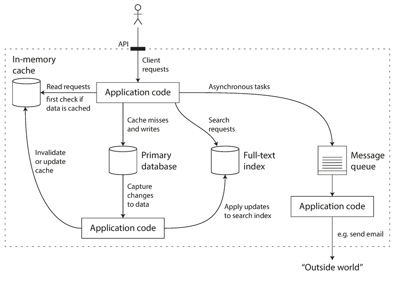
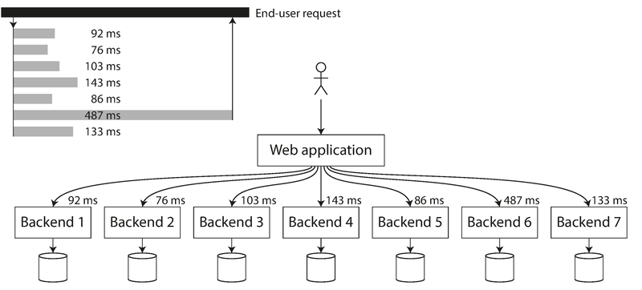

# 模块 01：可靠、可扩展与可维护的应用

> 对应 Chapter 1: Reliable, Scalable, and Maintainable Applications
> Part I 数据系统基础

---

## 概念地图

- **核心概念** (必须内化): 可靠性（Reliability）、可扩展性（Scalability）、可维护性（Maintainability）
- **实操要点** (动手时需要): 负载参数（Load Parameters）、百分位数（Percentiles）、垂直/水平扩展
- **背景知识** (扩展理解): 故障（Fault）vs 失败（Failure）、SLO/SLA、偶然复杂度 vs 本质复杂度

---

## 概念讲解

### 1. 数据密集型应用（Data-Intensive Application）

今天大多数应用的瓶颈不在 CPU 算力，而在**数据**——数据量、数据复杂度、数据变化速度。这类应用就是"数据密集型应用"，它们通常由以下标准组件搭建：

| 组件 | 做什么 | 典型代表 |
|------|--------|---------|
| 数据库（Database） | 存取数据 | PostgreSQL, MySQL, MongoDB |
| 缓存（Cache） | 缓存昂贵计算的结果，加速读取 | Redis, Memcached |
| 搜索索引（Search Index） | 按关键词搜索/过滤 | Elasticsearch, Solr |
| 流处理（Stream Processing） | 异步发消息给另一个进程 | Kafka, RabbitMQ |
| 批处理（Batch Processing） | 定期处理大量累积数据 | Hadoop, Spark |

但现实中，这些组件的边界越来越模糊——Redis 既是缓存也能当消息队列，Kafka 既是消息队列也有数据库级别的持久性保证。越来越多的应用需要把多个工具组合起来，由应用代码把它们"粘合"在一起。

> **图说**：一个典型的数据密集型应用架构。API 层对外隐藏了内部的缓存、主数据库、全文索引和消息队列。应用代码负责保持它们之间的数据一致性。当你设计这样的系统时，你其实已经不仅仅是应用开发者，而是一个**数据系统设计者**。

这就引出了本书的核心问题：**如何设计一个可靠、可扩展、可维护的数据系统？**

---

### 2. 可靠性（Reliability）

**是什么**：系统在面对各种意外（硬件故障、软件 Bug、人为错误）时，仍然能正确工作。

简单说就是——"出了问题，系统不要崩"。但这里有一个关键区分：

| 概念 | 定义 | 类比 |
|------|------|------|
| 故障（Fault） | 系统中**某个组件**偏离了预期行为 | 一个齿轮坏了 |
| 失败（Failure） | **整个系统**停止向用户提供服务 | 整台机器停转 |

**可靠性的目标不是消灭故障（不可能），而是设计容错机制，防止故障变成失败。**

Netflix 的 Chaos Monkey 就是这个思路的极端体现——故意随机杀掉生产环境中的进程，来验证系统是否真的能容错。

#### 2.1 硬件故障

硬盘的平均无故障时间（MTTF）大约 10-50 年。听起来很长？但如果你有 10,000 块硬盘，平均每天就会坏一块。

传统做法是**硬件冗余**：RAID 磁盘阵列、双路电源、热备 CPU。但在云时代，虚拟机随时可能消失（AWS 的 VM 实例可以毫无预警地变得不可用），所以趋势是转向**软件层面的容错**——让系统能容忍整台机器的丢失。这也带来了运维上的好处：可以一台一台滚动升级，不需要整体停机。

#### 2.2 软件故障

比硬件故障更难对付。硬件故障通常是随机的、独立的，而软件 Bug 往往是**系统性的**——一个 Bug 能同时影响所有节点。

经典案例：2012 年 6 月 30 日的闰秒（Leap Second），因为 Linux 内核的一个 Bug，导致大量应用同时挂起。

软件故障的特点是**潜伏期长**——代码中隐藏了一个错误的假设，在正常条件下不会触发，直到某天假设不再成立。没有银弹，只能靠：仔细思考假设、充分测试、进程隔离、监控告警。

#### 2.3 人为错误

一项研究发现，**运维人员的配置错误**是导致服务中断的首要原因，硬件故障只占 10-25%。

应对策略：
1. **设计好的 API 和管理界面**——让"做对的事"更容易，"做错的事"更难
2. **提供沙箱环境**——让人可以安全地试验，不影响生产
3. **充分测试**——尤其是边角场景
4. **快速回滚能力**——配置能快速回退、代码能灰度发布
5. **监控和遥测**——像火箭发射后的遥测数据一样，生产环境的可观测性至关重要

> **可靠性不只是核电站和航空管制的事**。一个照片应用的数据库损坏，对于存了孩子所有照片的父母来说，就是灾难。即使在"不那么关键"的应用中，我们也对用户负有责任。

---

### 3. 可扩展性（Scalability）

**是什么**：系统应对负载增长的能力。

注意：可扩展性**不是**一个一维标签。说"X 可扩展"或"Y 不可扩展"是没意义的。正确的问法是："如果负载以某种方式增长，我们有什么策略来应对？"

#### 3.1 描述负载（Load Parameters）

讨论扩展之前，先要能**量化负载**。用什么量化取决于你的系统架构——可以是 Web 服务器的每秒请求数（QPS）、数据库的读写比、聊天室的并发用户数、缓存命中率等。

**Twitter 的经典案例**完美说明了"负载参数"的含义：

Twitter 有两个核心操作：
- **发推**：4.6K 请求/秒（峰值 12K）
- **看时间线**：300K 请求/秒

12,000 次/秒的写入不算什么挑战。真正的挑战在于 **fan-out（扇出）**——每个用户关注很多人，每个用户也被很多人关注。

| 方案 | 写入时做什么 | 读取时做什么 | 适合场景 |
|------|-------------|-------------|---------|
| 方案 1（拉模式） | 直接写入全局推文表 | 查询所有关注者的推文，合并排序 | 写少读多时读取太慢 |
| 方案 2（推模式） | 写入每个粉丝的时间线缓存 | 直接读缓存 | 大多数用户（写入放大但读取极快） |

Twitter 一开始用方案 1，扛不住时间线查询的负载后切到了方案 2。但方案 2 的问题是：一个有 3000 万粉丝的大 V 发一条推文，要写入 3000 万个时间线缓存！

**最终方案是混合**：普通用户用方案 2（推模式），大 V 用方案 1（拉模式），读取时合并。

> 📎 **关联**：这个"推 vs 拉"的权衡在后续章节中会反复出现——Ch5 复制、Ch10 批处理、Ch11 流处理都涉及类似的设计抉择。

#### 3.2 描述性能（Percentiles）

负载增长后，性能会怎么变？在批处理系统中我们关心**吞吐量**（每秒处理多少记录），在在线系统中我们关心**响应时间**。

> **Latency ≠ Response Time**
> - Response time（响应时间）：客户端视角，从发请求到收到响应的总时间
> - Latency（延迟）：请求排队等待处理的时间
>
> 响应时间 = 延迟 + 服务时间 + 网络时间

**为什么不用平均值？** 因为平均值无法告诉你"典型用户"的体验。用**百分位数**更好：

| 百分位 | 含义 | 使用场景 |
|--------|------|---------|
| p50（中位数） | 50% 的请求比这个快 | "典型"用户体验 |
| p95 | 95% 的请求比这个快 | SLO 常用指标 |
| p99 | 99% 的请求比这个快 | 重要用户体验 |
| p999 | 99.9% 的请求比这个快 | Amazon 内部服务要求 |

Amazon 发现，响应时间最慢的那些请求，往往来自**数据量最大的客户**——也就是最有价值的客户。Amazon 内部服务使用 p999 作为性能要求。同时他们观察到：响应时间增加 100ms，销售额下降 1%。

**尾延迟放大效应**：当一个用户请求需要调用多个后端服务时，只要有一个服务慢，整个请求就慢。

> **图说**：一个用户请求需要并行调用 7 个后端服务。即使只有 Backend 6 一个返回慢（487ms），整个请求的响应时间就被拖到 487ms。调用的后端越多，命中"慢请求"的概率越高。

SLO（Service Level Objective，服务级别目标）和 SLA（Service Level Agreement，服务级别协议）就是用百分位数来定义的。例如："中位数响应时间 < 200ms，p99 < 1s"。

#### 3.3 应对负载的策略

| 策略 | 英文 | 说明 |
|------|------|------|
| 垂直扩展 | Scale Up | 换更强的机器 |
| 水平扩展 | Scale Out | 加更多的机器（Shared-Nothing 架构） |

实际中通常是**混合使用**——几台较强的机器，比一大堆小虚拟机更简单、更便宜。

关于弹性：
- **弹性系统（Elastic）**：自动根据负载增减机器。适合负载波动大的场景。
- **手动扩展**：人工分析容量后手动加机器。更简单，更少意外。

> **作者观点**：扩展无状态服务（如 Web 服务器）很简单，但把有状态的数据系统从单节点扩展到分布式，复杂度会急剧增加。传统智慧是"能不分布就不分布"，但随着工具的成熟，这个建议可能在改变。

**没有通用的扩展方案。** 一个处理 10 万 QPS、每个请求 1KB 的系统，和一个处理 3 次/分钟、每次 2GB 的系统，即使总吞吐量相同，架构也完全不同。扩展方案取决于你的**负载参数**。

---

### 4. 可维护性（Maintainability）

**是什么**：让未来的工程师和运维团队能轻松地维护、扩展、修改系统。

软件的大部分成本不在初始开发，而在**持续维护**——修 Bug、保持运行、排查故障、适配新平台、加新功能、还技术债。

Martin Kleppmann 提出三个设计原则：

#### 4.1 可运维性（Operability）

"好的运维能弥补烂软件的不足，但好的软件救不了烂运维。"

运维团队的日常职责：
- 监控系统健康、快速恢复故障
- 追踪性能退化和故障原因
- 保持软件和平台更新（安全补丁）
- 了解系统间的依赖关系
- 容量规划
- 建立部署和配置管理的最佳实践
- 维护组织知识（人员流动时不丢失）

好的数据系统应该让运维变得轻松：良好的监控、自动化友好、允许单机下线维护、文档清晰、行为可预测。

#### 4.2 简单性（Simplicity）

小项目的代码可以简洁优雅，大项目往往变成一坨"大泥球"（Big Ball of Mud）。

复杂度的典型症状：状态空间爆炸、模块紧耦合、依赖纠缠、命名不一致、为性能做的 hack、到处的特殊逻辑。

这里有一个关键区分：

| 复杂度类型 | 定义 | 例子 |
|-----------|------|------|
| **本质复杂度**（Essential） | 问题本身固有的 | 分布式一致性天然就难 |
| **偶然复杂度**（Accidental） | 实现带来的，不是问题要求的 | 糟糕的数据结构设计 |

**消除偶然复杂度的最佳工具是抽象。** 好的抽象把实现细节藏在干净的接口后面——高级语言是对机器码的抽象，SQL 是对磁盘存储结构的抽象。

#### 4.3 可演化性（Evolvability）

需求永远在变。Agile 和 TDD 等方法论在代码级别解决了变化的问题，但在**整个数据系统层面**如何应对变化？比如，如何"重构" Twitter 的时间线架构从方案 1 到方案 2？

可演化性和简单性高度相关——系统越简单、抽象越好，就越容易修改。

> 📎 **关联**：Ch4（编码与演化）会具体讲 Schema 演化策略——如何在不停机的情况下改变数据格式。

---

## 重点标记

1. **Fault ≠ Failure**：故障是组件级的偏差，失败是系统级的停止服务。可靠性的目标是阻止故障升级为失败。
2. **可扩展性是问题，不是标签**：不要说"X 可扩展"，要说"当负载以 Y 方式增长时，我们用 Z 策略应对"。
3. **百分位数优于平均值**：p50 反映典型体验，p99/p999 反映最有价值用户的体验，尾延迟在微服务架构中会被放大。
4. **Twitter 的 fan-out 问题**：同一个系统的最佳架构取决于负载参数——推模式适合大多数用户，拉模式适合大 V，最终需要混合。
5. **简单性是可维护性的基石**：区分本质复杂度和偶然复杂度，用好的抽象消除偶然复杂度。
6. **运维决定可靠性**：配置错误是导致系统中断的首要原因（远超硬件故障），好的工具和流程比好的代码更重要。

---

## 自测：你真的理解了吗？

**Q1**：你的团队在线上发现一个 Bug——某个微服务在处理特定格式的日期时会崩溃。这个 Bug 属于硬件故障、软件故障还是人为错误？你会采取哪些短期和长期措施？

**Q2**：你的 API 平均响应时间是 150ms，p99 是 3 秒。产品经理说"平均响应时间不到 200ms，性能很好"。你同意吗？为什么？

**Q3**：你正在设计一个社交应用的"动态流"功能。大多数用户有几百个关注者，但有些 KOL 有百万粉丝。你会选择推模式、拉模式还是混合模式？请说明理由。

**Q4**：你们的系统目前跑在一台 64 核、512GB 内存的高配服务器上。负载涨了 3 倍，CTO 问你"应该买更大的机器还是加更多机器？"你会怎么分析？

**Q5**：一个同事说"我们的系统从来没出过硬件故障，不需要做容错设计"。你怎么回应？
