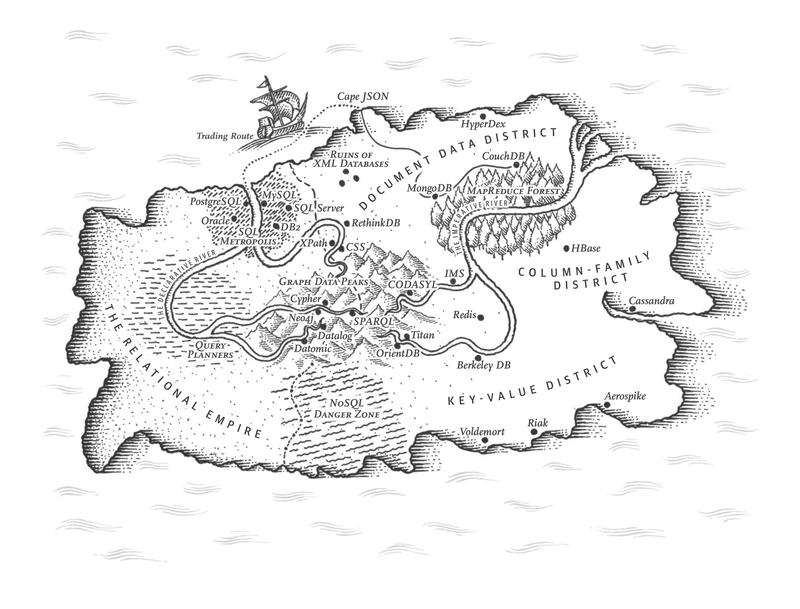
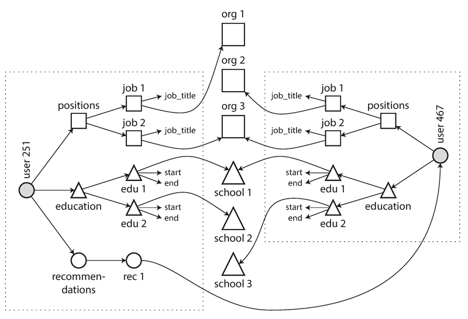
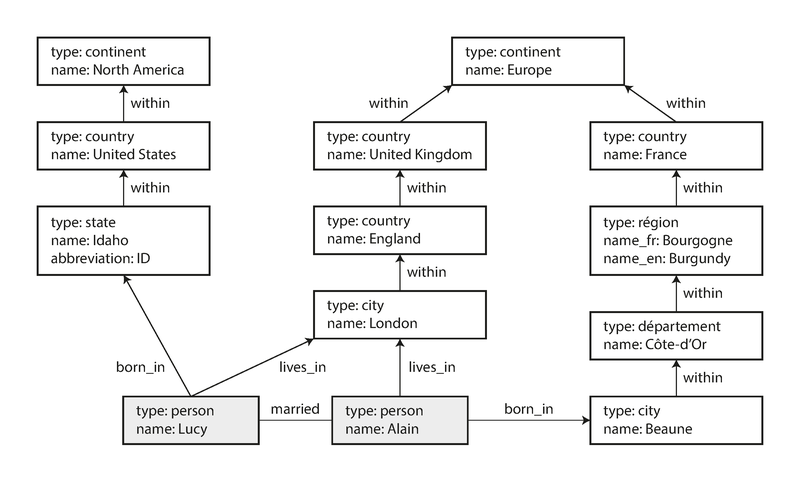

# 模块 02：数据模型与查询语言

> 对应 Chapter 2: Data Models and Query Languages
> Part I 数据系统基础

---

## 概念地图

- **核心概念** (必须内化): 关系模型 vs 文档模型 vs 图模型、Schema-on-Read vs Schema-on-Write、声明式 vs 命令式查询
- **实操要点** (动手时需要): 何时选文档模型/关系模型/图模型、JOIN 在文档数据库中的处理、Cypher 查询语言
- **背景知识** (扩展理解): IMS/CODASYL 的历史教训、Triple-Store/SPARQL、Datalog

---

## 概念讲解

### 1. 数据模型的分层抽象

数据模型是软件开发中最重要的决策之一——它不仅影响代码怎么写，更影响你**怎么思考**问题。

应用从上到下是一层一层的抽象：

```
现实世界（人、组织、商品、交易…）
    ↓ 你用对象/数据结构来建模
应用层数据模型
    ↓ 你选择 JSON/关系表/图来存储
通用数据模型（关系/文档/图）
    ↓ 数据库工程师决定怎么在磁盘上表示
字节级存储（B-Tree、LSM-Tree…）
    ↓ 硬件工程师
电信号 / 磁场 / 光脉冲
```

每一层都把下层的复杂度藏起来，提供一个干净的接口。**选错了数据模型，上面所有的代码都会很痛苦。**



> **图说**：Martin Kleppmann 画的"数据库世界地图"。左侧是关系帝国（PostgreSQL、MySQL、Oracle），右上是文档数据区（MongoDB、CouchDB），右侧是列族区（Cassandra、HBase）和键值区（Redis、Riak），中间有图数据库的山峰（Neo4j、Cypher），还有 XML 数据库的废墟和 NoSQL 危险区。

---

### 2. 关系模型 vs 文档模型

这是本章的核心对比。

#### 2.1 关系模型的统治地位

Edgar Codd 在 1970 年提出关系模型——数据组织为关系（表），每个关系是一组元组（行）的无序集合。当时很多人怀疑这个理论模型能否高效实现，但到 1980 年代中期，RDBMS + SQL 已经统治了世界，而且统治了 50 多年至今。

期间每个挑战者（网络模型、对象数据库、XML 数据库）都曾火过一阵，但都没能撼动关系模型的地位。

#### 2.2 NoSQL 的兴起

NoSQL 这个名字纯属偶然——2009 年一个聚会的 Twitter 话题标签。后来被重新解释为"Not Only SQL"。驱动力：

- 需要超越关系数据库的**扩展性**（超大数据集、超高写入吞吐）
- 对开源的偏好
- 关系模型不擅长的特殊查询需求
- 对关系 Schema 限制性的不满

**务实的观点**：未来关系数据库会和各种非关系数据库并存——**混合持久化（Polyglot Persistence）**。

> **2026 年更新**：这个预测完全正确。今天大多数中大型系统都同时使用多种数据库（比如 PostgreSQL + Redis + Elasticsearch）。同时，关系数据库也在吸收文档模型的特性（PostgreSQL 的 JSONB、MySQL 的 JSON 类型），两个世界在趋同。

#### 2.3 对象-关系不匹配（Impedance Mismatch）

应用代码用面向对象的方式思考，数据库用关系表存储，两者之间存在"阻抗不匹配"。ORM 框架（如 ActiveRecord、Hibernate）减轻了痛苦，但无法完全消除差异。

**LinkedIn 简历的例子**说明了问题：

一个用户有多段工作经历、多段教育经历、多个联系方式——这是**一对多关系**。在关系模型中需要拆成多张表（`users`、`positions`、`education`、`contact_info`），用外键关联。在文档模型中，直接用一个 JSON 文档就搞定：

```json
{
  "user_id": 251,
  "first_name": "Bill",
  "last_name": "Gates",
  "positions": [
    {"job_title": "Co-chair", "organization": "Bill & Melinda Gates Foundation"},
    {"job_title": "Co-founder", "organization": "Microsoft"}
  ],
  "education": [
    {"school_name": "Harvard University", "start": 1973, "end": 1975}
  ]
}
```

JSON 文档的优势：
- **数据局部性**——一次查询就能拿到所有相关数据，不需要多表 JOIN
- 一对多关系的树状结构自然契合文档模型

#### 2.4 多对一和多对多关系——文档模型的软肋

为什么简历中的 `region_id` 用 ID 而不用字符串 `"Greater Seattle Area"`？因为用 ID 实现了**规范化（Normalization）**——有意义的信息只存一份，修改时只改一处。

但规范化意味着**多对一关系**（多个人在同一地区、同一行业），这需要 JOIN。而文档数据库的 JOIN 支持往往很弱。

更关键的是：**数据会越来越互联**。即使最初的应用适合文档模型，随着功能增加（组织变成实体、推荐信引用其他用户），多对多关系不可避免。



> **图说**：简历扩展后出现多对多关系。用户引用组织（org）、学校（school）实体，用户之间有推荐关系（recommendations）。虚线框内的数据可以是文档，但框之间的引用需要 JOIN。

#### 2.5 历史的回声：层次模型 → 网络模型 → 关系模型

文档数据库面临的问题并不新鲜。1970 年代 IBM 的 IMS 使用的**层次模型**和今天的 JSON 文档惊人地相似——一对多好用，多对多难搞。

| 模型 | 访问方式 | 多对多支持 | 灵活性 |
|------|---------|-----------|--------|
| 层次模型（IMS） | 沿固定路径遍历 | 差 | 差——改访问路径要重写代码 |
| 网络模型（CODASYL） | 手动跟踪多条访问路径 | 支持，但复杂 | 差——"在 n 维数据空间中导航" |
| **关系模型（SQL）** | 声明式查询，优化器自动选路 | 好 | 好——加新索引不影响查询代码 |

关系模型的核心洞察：**你只需要构建一次查询优化器，所有应用都能受益。** 手写访问路径对单个查询可能更快，但通用方案长期赢。

文档数据库走的路和层次模型类似（嵌套记录），但在处理多对一/多对多关系时，它们用的是文档引用（类似外键），而不是 CODASYL 的指针链。

#### 2.6 如何选择？

| 维度 | 文档模型更好 | 关系模型更好 |
|------|------------|------------|
| 数据结构 | 树状一对多、自包含文档 | 高度互联、多对多关系 |
| Schema | Schema-on-Read（灵活，适合异构数据） | Schema-on-Write（严格，适合结构统一的数据） |
| 查询局部性 | 整个文档经常一起读取 | 经常只需要文档的一部分 |
| JOIN | 很少需要 JOIN | 频繁 JOIN |
| 代码复杂度 | 数据结构简单时代码更简洁 | 关系复杂时代码更简洁 |

> **常见误用**：选了文档数据库（如 MongoDB），但数据其实有很多多对多关系。结果要在应用层手动模拟 JOIN，又慢又复杂。正确做法：如果数据高度互联，用关系数据库或图数据库。

#### 2.7 Schema-on-Read vs Schema-on-Write

"文档数据库没有 Schema"这个说法**有误导性**。实际上：
- **Schema-on-Read**（文档数据库）：Schema 是隐式的，读数据时由应用代码解释结构——类似动态类型语言
- **Schema-on-Write**（关系数据库）：Schema 是显式的，写数据时数据库强制校验——类似静态类型语言

Schema-on-Read 在以下场景更有优势：
- 数据是异构的（不同记录有不同结构）
- 数据结构由外部系统决定，可能随时变化

#### 2.8 趋同

关系数据库和文档数据库正在互相学习：
- PostgreSQL、MySQL 都支持了 JSON 类型，可以查询和索引 JSON 内部字段
- 一些文档数据库（RethinkDB）支持了类似 JOIN 的操作

> **作者观点**：关系和文档模型是互补的，未来的数据库可能同时支持两者。

---

### 3. 声明式 vs 命令式查询语言

| 特性 | 命令式（Imperative） | 声明式（Declarative） |
|------|---------------------|---------------------|
| 描述 | 告诉计算机**怎么做** | 告诉计算机**要什么** |
| 典型代表 | CODASYL, JavaScript DOM 操作 | SQL, CSS, Cypher |
| 优化空间 | 小——你指定了执行顺序 | 大——优化器自由选择执行策略 |
| 并行友好 | 差——指令有顺序依赖 | 好——只描述结果模式 |
| 举例 | `for` 循环遍历 + `if` 过滤 | `SELECT * WHERE family = 'Sharks'` |

**CSS 的类比**很好地说明了声明式的优势：
- CSS：`li.selected > p { background-color: blue; }` —— 浏览器自动处理样式的添加和移除
- JavaScript DOM 操作：手动遍历元素、设置样式 —— 还要自己处理状态变化时的清理

> **MapReduce** 是介于两者之间的模型——用 `map` 和 `reduce` 函数表达逻辑。MongoDB 最初支持 MapReduce，后来发现太笨重，又加了声明式的 **Aggregation Pipeline**（`$match`、`$group`），本质上是在重新发明 SQL。这个故事的教训：**声明式查询语言几乎总是赢家**。

---

### 4. 图数据模型

当数据中**多对多关系**非常普遍时，图模型是最自然的选择。

图由两种对象组成：
- **顶点（Vertex）**：实体（人、地点、事件）
- **边（Edge）**：关系（认识、住在、出生于）

典型应用：社交网络、知识图谱、Web 链接图、交通网络。



> **图说**：Lucy 出生在 Idaho（美国），Alain 出生在 Beaune（法国），两人结婚后住在 London（英国）。地理位置形成层级关系（city → state/région → country → continent），不同国家的行政区划结构不同（美国有 state，法国有 département 和 région）。这种异构、高度关联的数据，图模型处理起来非常自然。

#### 4.1 属性图（Property Graph）

每个**顶点**有：唯一 ID、属性集合（key-value）、出边集合、入边集合
每条**边**有：唯一 ID、起点、终点、标签（关系类型）、属性集合

用关系数据库也能存图数据——只需要两张表：

```sql
CREATE TABLE vertices (
    vertex_id  INTEGER PRIMARY KEY,
    properties JSON
);

CREATE TABLE edges (
    edge_id     INTEGER PRIMARY KEY,
    tail_vertex INTEGER REFERENCES vertices(vertex_id),
    head_vertex INTEGER REFERENCES vertices(vertex_id),
    label       TEXT,
    properties  JSON
);
```

图模型的强大之处：
1. **任何顶点都能和任何顶点连接**——没有 Schema 限制
2. **可以高效地双向遍历**——找入边和出边都快
3. **用不同标签区分不同关系**——一个图中可以存多种信息

#### 4.2 Cypher 查询语言

Cypher 是 Neo4j 的声明式图查询语言。用箭头表示边：

```cypher
-- 创建数据
CREATE
  (NAmerica:Location {name:'North America', type:'continent'}),
  (USA:Location      {name:'United States', type:'country'}),
  (Idaho:Location    {name:'Idaho',         type:'state'}),
  (Lucy:Person       {name:'Lucy'}),
  (Idaho) -[:WITHIN]->  (USA)  -[:WITHIN]-> (NAmerica),
  (Lucy)  -[:BORN_IN]-> (Idaho)

-- 查询：找出从美国移民到欧洲的人
MATCH
  (person) -[:BORN_IN]->  () -[:WITHIN*0..]-> (us:Location {name:'United States'}),
  (person) -[:LIVES_IN]-> () -[:WITHIN*0..]-> (eu:Location {name:'Europe'})
RETURN person.name
```

`:WITHIN*0..` 表示"沿 WITHIN 边走零次或多次"——类似正则的 `*`。

同样的查询用 SQL 写要 29 行（用 `WITH RECURSIVE` 递归 CTE），这说明**不同数据模型适合不同的使用场景**。

#### 4.3 Triple-Store 与 SPARQL

Triple-Store 用三元组 `(主语, 谓词, 宾语)` 存储所有信息，和属性图本质等价：

```
_:lucy  a        :Person.
_:lucy  :name    "Lucy".
_:lucy  :bornIn  _:idaho.
_:idaho :within  _:usa.
```

SPARQL 是 Triple-Store 的查询语言，比 Cypher 更简洁：

```sparql
PREFIX : <urn:example:>
SELECT ?personName WHERE {
  ?person :name ?personName.
  ?person :bornIn / :within* / :name "United States".
  ?person :livesIn / :within* / :name "Europe".
}
```

#### 4.4 Datalog

Datalog 是 1980 年代的学术语言，但提供了一个重要思想：**用规则（Rules）逐步构建复杂查询**。规则可以组合和复用，类似函数调用。对于简单查询不如 Cypher 方便，但对复杂数据的表达能力更强。

> 📎 **关联**：Datalog 的思想在 Ch10（批处理）和 Ch12（数据系统的未来）中会再次出现。

---

### 5. 数据模型选择决策树

```
你的数据关系是什么样的？
│
├── 主要是一对多（树状结构）
│   └── 文档模型（MongoDB, CouchDB）
│       ⚠️ 注意：如果后续可能出现多对多关系，要提前评估
│
├── 大量多对一 + 多对多关系
│   └── 关系模型（PostgreSQL, MySQL）
│       适合：事务处理、结构化数据、频繁 JOIN
│
└── 高度互联、关系是一等公民
    └── 图模型（Neo4j, Amazon Neptune）
        适合：社交网络、推荐系统、知识图谱、欺诈检测
```

> **2026 年更新**：PostgreSQL 的 JSONB 让很多场景不用选——一个数据库同时支持关系查询和文档查询。图数据库方面，Amazon Neptune 和 Neo4j 都有了云服务版本，降低了使用门槛。

---

## 重点标记

1. **数据模型决定思维方式**：选错了数据模型，所有上层代码都会别扭。
2. **文档模型 ≠ 没有 Schema**：只是从 Schema-on-Write 变成了 Schema-on-Read，Schema 仍然存在于应用代码中。
3. **数据会越来越互联**：即使最初适合文档模型，随着功能增加，多对多关系很可能出现。
4. **声明式查询语言总是赢**：从 CODASYL 到 SQL，从 MapReduce 到 Aggregation Pipeline，历史反复证明。
5. **关系和文档模型在趋同**：PostgreSQL 支持 JSON，MongoDB 开始支持 JOIN，未来的数据库会同时提供两种能力。
6. **图模型适合高度互联数据**：Cypher 4 行能写完的查询，SQL 要 29 行——选对工具事半功倍。

---

## 自测：你真的理解了吗？

**Q1**：你正在设计一个电商系统，商品有多个 SKU、多张图片、多条评论，每条评论关联一个用户。你会选文档模型还是关系模型？为什么？

**Q2**：同事说"我们用 MongoDB，所以不需要关心 Schema"。这个说法对吗？Schema-on-Read 在什么场景下会比 Schema-on-Write 更痛苦？

**Q3**：你的系统用了 MongoDB 存储用户数据。现在产品要加一个"用户推荐用户"的功能。你会怎么处理？是继续用 MongoDB 还是引入其他数据库？

**Q4**：SQL 查询 `SELECT * FROM animals WHERE family = 'Sharks'` 是声明式还是命令式？声明式的核心优势是什么？

**Q5**：一个社交网络需要回答"找出所有从中国移民到美国的用户"。你会选择关系数据库还是图数据库来存储这些数据？请对比两者的查询复杂度。
