# 模块 03：存储与检索

> 对应 Chapter 3: Storage and Retrieval
> Part I 数据系统基础

---

## 概念地图

- **核心概念** (必须内化): 日志结构存储引擎（LSM-Tree）vs 页面结构存储引擎（B-Tree）、写放大（Write Amplification）与 Compaction 策略、OLTP vs OLAP 的本质区别
- **实操要点** (动手时需要): 何时选 LSM-Tree / B-Tree、Bloom Filter 优化不存在键查询、列式存储与压缩的配合使用
- **背景知识** (扩展理解): Bitcask 哈希索引、内存数据库（In-Memory Database）、星型/雪花 Schema、数据立方体（Data Cube）

---

## 概念讲解

### 1. 从最简单的数据库说起

在最底层，数据库只做两件事：**写入数据**和**读取数据**。本章从数据库的视角出发——数据怎么存，查的时候怎么找。

为什么开发者要关心存储引擎内部机制？因为你需要**选择合适的存储引擎**，并且能看懂它的调优参数。特别是：面向事务处理（Transaction Processing）的存储引擎和面向分析（Analytics）的存储引擎，两者的设计哲学完全不同。

先来看世界上最简单的数据库——两个 Bash 函数：

```bash
#!/bin/bash
db_set () {
    echo "$1,$2" >> database    # 追加写入，O(1)
}
db_get () {
    grep "^$1," database | sed -e "s/^$1,//" | tail -n 1  # 全文扫描，O(n)
}
```

```bash
$ db_set 123456 '{"name":"London","attractions":["Big Ben","London Eye"]}'
$ db_set 42 '{"name":"San Francisco","attractions":["Golden Gate Bridge"]}'
$ db_get 42
{"name":"San Francisco","attractions":["Golden Gate Bridge"]}
```

关键观察：
- **写入极快**——只需追加到文件末尾（append-only），O(1)
- **读取极慢**——每次都要从头到尾扫描整个文件，O(n)

这就引出了索引（Index）的核心权衡：**索引加速读取，但拖慢写入**。因为每次写入时索引也要更新。数据库不会默认索引所有内容，而是让你根据查询模式手动选择。

> 📎 **关联**：这个权衡贯穿本章所有内容——LSM-Tree 和 B-Tree 本质上是在这个权衡中做出不同的取舍。

---

### 2. 哈希索引（Hash Index）

最直觉的索引方式：在内存中维护一个哈希表（Hash Map），key 映射到数据文件中的**字节偏移量**。

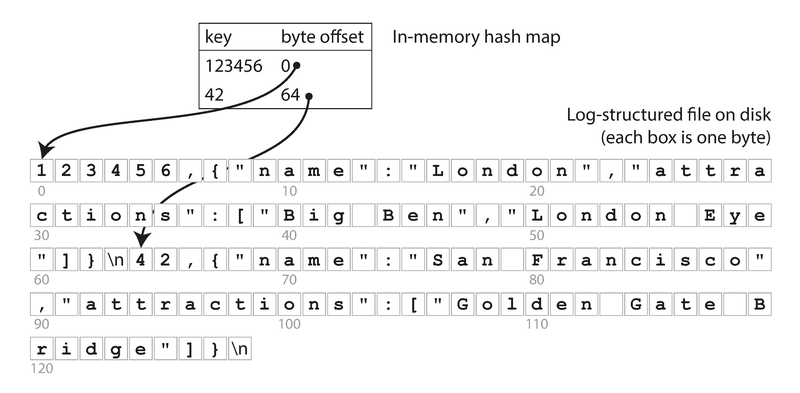

> **图说**：Figure 3-1。数据以 CSV 格式追加写入磁盘文件，内存中的哈希表记录每个 key 在文件中的字节偏移位置。查询时先查哈希表拿到偏移量，直接 seek 到磁盘位置读取值。

这就是 Bitcask（Riak 的默认存储引擎）的核心设计。特点：
- 写入快（追加写）、读取快（一次磁盘 seek）
- **限制：所有 key 必须放入内存**，value 可以在磁盘上
- 适用场景：key 数量有限但每个 key 频繁更新（如 URL 点击计数器）

#### 2.1 段文件与 Compaction

日志文件会无限增长，怎么办？把日志分成**段（Segment）**，写满一段就开新段。旧段执行 **Compaction（压实）**——丢弃重复的 key，只保留最新值。

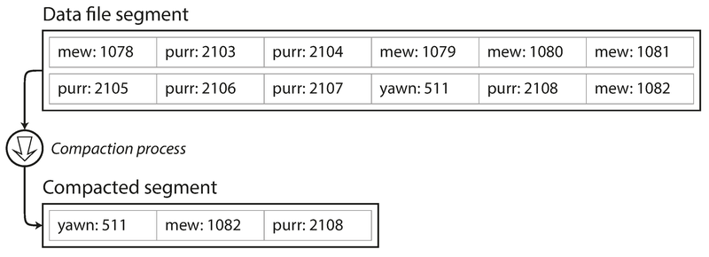

> **图说**：Figure 3-2。对一个段执行 Compaction：data file segment 中 `mew` 出现了多次，Compaction 后只保留最新的 `mew: 1082`。

更进一步，可以在 Compaction 的同时**合并（Merge）多个段**：

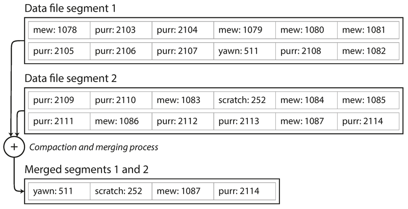

> **图说**：Figure 3-3。两个段同时执行 Compaction 和 Merge，输出一个更小的合并段。这个过程在后台线程中执行，不影响正在进行的读写请求。

每个段有自己的哈希表。读取时按从新到旧的顺序查各段的哈希表，合并过程保持段数量可控。

#### 2.2 实际工程细节

从简单想法到生产系统，需要处理很多细节：

| 问题 | 解决方案 |
|------|----------|
| 文件格式 | 不用 CSV，用二进制格式（先写长度，再写原始字节） |
| 删除记录 | 写入墓碑标记（Tombstone），Merge 时丢弃被删除的 key |
| 崩溃恢复 | 启动时重建哈希表（扫描所有段），或定期把哈希表快照写磁盘 |
| 数据损坏 | 使用校验和（Checksum）检测并忽略损坏的记录 |
| 并发控制 | 只允许一个写线程；段文件不可变，可被多个读线程并发访问 |

#### 2.3 追加写入的优势和哈希索引的局限

**追加写入为什么比原地更新好？**
1. 顺序写入远快于随机写入（对 HDD 尤其明显，对 SSD 也有优势）
2. 并发和崩溃恢复更简单——不用担心"写到一半崩溃"的情况
3. 段合并避免了磁盘碎片化

**哈希索引的两大致命限制：**
1. **所有 key 必须放入内存**——key 量巨大时行不通；磁盘上的哈希表性能差（大量随机 I/O、扩容困难）
2. **不支持范围查询**——无法高效扫描 `kitty00000` 到 `kitty99999` 之间的所有 key

> **常见误用**：以为"哈希索引 = 简陋"。事实上 Bitcask 在合适的场景下（key 数量有限、写入密集）性能非常好。错误不在于技术本身，而在于用错了场景。

---

### 3. SSTables 与 LSM-Tree

#### 3.1 SSTable：排序的段文件

把前面的段文件做一个简单改变：**要求 key-value 对按 key 排序**。这种格式叫 SSTable（Sorted String Table，排序字符串表）。

SSTable 相比哈希索引的三大优势：

**1. 合并高效——类似归并排序（Merge Sort）**

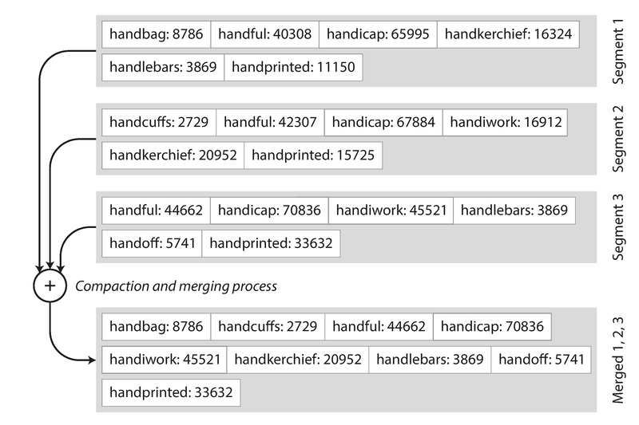

> **图说**：Figure 3-4。多个 SSTable 段的合并过程。同时读取三个已排序的段文件（Segment 1/2/3），比较各段当前最小的 key，取最小的写入输出，相同 key 只保留最新段的值。

**2. 不需要在内存中索引每个 key**

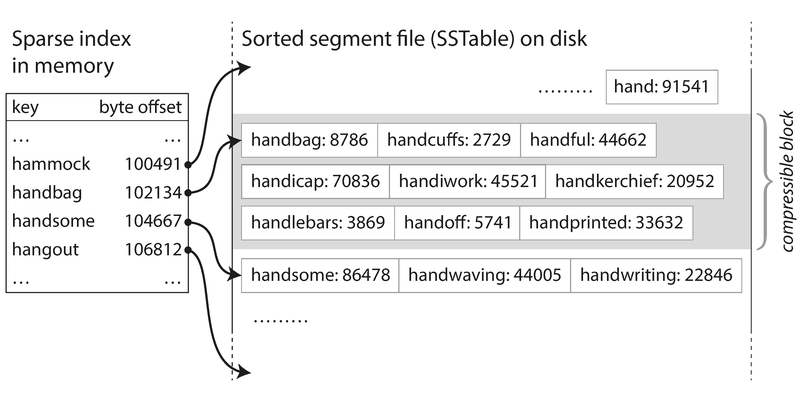

> **图说**：Figure 3-5。内存中只需维护一个**稀疏索引（Sparse Index）**，每隔几 KB 记录一个 key 的偏移量。要找 `handiwork`？知道 `handbag` 在 102134、`handsome` 在 104667，在两者之间顺序扫描即可。

**3. 压缩友好**——可以把相邻记录分组成块（Block）压缩后再写盘，稀疏索引指向压缩块的起始位置，节省磁盘空间和 I/O 带宽。

#### 3.2 从内存到磁盘：Memtable

问题来了：写入时 key 是随机顺序的，怎么保证写入 SSTable 时是排序的？

答案：**在内存中维护一棵平衡树**（红黑树或 AVL 树），称为 **Memtable**。写入流程：

```
写入请求
    ↓
1. 写入 Memtable（内存中的平衡树）
    ↓
2. Memtable 达到阈值（几 MB）→ 写出为 SSTable 文件（已排序）
    ↓
3. 新的写入进入新的 Memtable 实例
    ↓
4. 后台定期运行 Compaction + Merge
```

读取流程：
```
读取请求
    ↓
1. 先查 Memtable
    ↓ 没找到
2. 查最新的 SSTable 段
    ↓ 没找到
3. 查次新的段 … 直到最老的段
```

**崩溃恢复**：Memtable 中的数据还没写盘就崩溃了怎么办？额外维护一个**追加式写入日志（WAL）**——每次写入都先 append 到日志。崩溃后用日志恢复 Memtable。Memtable 成功写出为 SSTable 后，对应的日志就可以删除了。

#### 3.3 LSM-Tree 的完整图景

上述算法就是 **LSM-Tree（Log-Structured Merge-Tree）** 的核心。这个名字来自 Patrick O'Neil 等人 1996 年的论文。

使用 LSM-Tree 的系统：
- **LevelDB** / **RocksDB**——嵌入式 KV 存储引擎库
- **Cassandra** / **HBase**——受 Google Bigtable 论文启发（SSTable 和 Memtable 这两个术语就出自 Bigtable）
- **Lucene**（Elasticsearch / Solr 的底层）——term dictionary 存储使用类似结构

#### 3.4 性能优化

**Bloom Filter（布隆过滤器）**：LSM-Tree 查询不存在的 key 代价很高（要遍历所有层的 SSTable）。Bloom Filter 是一种内存高效的概率数据结构，可以快速判断"这个 key **一定不在**数据库中"，避免无谓的磁盘读取。

**Compaction 策略**：

| 策略 | 代表系统 | 原理 | 特点 |
|------|---------|------|------|
| Size-Tiered Compaction | HBase, Cassandra | 较新较小的 SSTable 逐步合并为较老较大的 SSTable | 简单，但可能产生大量临时磁盘占用 |
| Leveled Compaction | LevelDB, RocksDB | key 范围被拆分到不同层级（Level），每层内部不重叠 | 增量式，磁盘占用更可控 |

> **作者观点**：LSM-Tree 的基本思想——维护一组在后台合并的 SSTable——简单而有效。即使数据集远大于可用内存，它也能很好地工作。由于数据按排序存储，范围查询效率高；由于磁盘写入是顺序的，LSM-Tree 能支持极高的写入吞吐。

---

### 4. B-Tree

B-Tree 于 1970 年提出，在不到 10 年后就被称为"无处不在的"——至今仍是**几乎所有关系数据库**的标准索引实现，很多非关系数据库也在使用。

#### 4.1 核心设计

和 LSM-Tree 一样，B-Tree 也保持 key 有序排列。但设计哲学完全不同：

| 维度 | LSM-Tree | B-Tree |
|------|----------|--------|
| 基本单位 | 可变大小的段（Segment），数 MB 量级 | **固定大小的页（Page）**，通常 4KB |
| 写入方式 | 追加写到新文件 | **原地更新（In-place Update）**，覆盖磁盘页 |
| 设计对应 | 日志结构 | 对应磁盘硬件的块结构 |

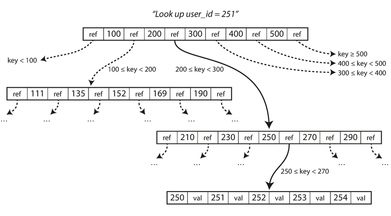

> **图说**：Figure 3-6。在 B-Tree 中查找 key=251。从根页开始，根页包含若干 key 和子页引用。251 位于 200 和 300 之间，因此走中间分支，到达下一层页面，继续缩小范围（200-300 → 250-270），最终到达叶子页（Leaf Page），找到 key=251 对应的值。

关键概念：
- **分支因子（Branching Factor）**：一个页中子页引用的数量。实践中通常是几百。
- **树深度**：一棵 4 层的 B-Tree，4KB 页，分支因子 500，可以存储 **250 TB** 的数据。大多数数据库的 B-Tree 只有 3-4 层深。

#### 4.2 插入与页分裂

更新 key：找到叶子页，修改值，把页写回磁盘。

新增 key：找到对应范围的叶子页，插入。**如果页满了，就分裂（Split）为两半，父页更新引用。**

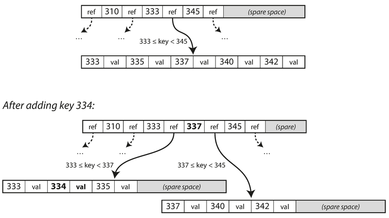

> **图说**：Figure 3-7。插入 key=334。原叶子页 [333, 335, 337, 340, 342] 空间不足，分裂为 [333, 334, 335] 和 [337, 340, 342] 两页，父页增加新的分隔 key=337。

#### 4.3 可靠性保障：WAL

B-Tree 的写入是**原地覆盖**磁盘页。如果页分裂过程中崩溃（只写了一部分页），会导致索引损坏（如出现悬挂的孤儿页）。

解决方案：**WAL（Write-Ahead Log，预写日志）**，也称 redo log。每次修改 B-Tree 前，先把变更记录写入 WAL。崩溃恢复时，用 WAL 重放把 B-Tree 恢复到一致状态。

> 📎 **关联**：WAL 是数据库世界中反复出现的模式。Ch7（事务）中 ARIES 算法使用 WAL 保证 ACID 中的持久性，Ch5（复制）中 WAL 也用于复制日志流。

**并发控制**：多线程同时访问 B-Tree 需要**轻量级锁（Latch）**保护页面。相比之下，LSM-Tree 更简单——后台合并不影响前台查询，旧段和新段的切换是原子的。

#### 4.4 B-Tree 优化技巧

| 优化 | 说明 |
|------|------|
| Copy-on-Write | 不原地修改页，而是写到新位置，父页指向新位置（LMDB 使用此策略），同时有利于并发控制 |
| Key 缩写 | 内部节点只需要足够区分范围的 key 前缀，压缩后可以提高分支因子 |
| 叶子页排列优化 | 尽量让相邻 key 的叶子页在磁盘上物理相邻（减少范围查询的 seek） |
| 兄弟指针 | 叶子页之间增加左右兄弟指针，方便顺序扫描而无需回溯到父页 |
| 分形树（Fractal Tree） | 借鉴日志结构思想减少磁盘 seek（与数学中的分形无关） |

---

### 5. B-Tree vs LSM-Tree：如何选择

> **作者观点**：经验法则是——LSM-Tree 写入通常更快，B-Tree 读取通常更快。但 benchmark 往往不能下定论，需要用你自己的实际工作负载测试。

#### 5.1 LSM-Tree 的优势

**写放大（Write Amplification）更低**

一次逻辑写入会导致多少次物理磁盘写入？

- B-Tree：至少写两次（WAL + 树页面本身），页分裂时更多。即使只改了几个字节，也要写整个页（4KB）
- LSM-Tree：也有写放大（反复 Compaction 和 Merge），但顺序写入的 SSTable 通常比 B-Tree 的随机写入高效

对 SSD 而言，写放大尤其重要——SSD 的写入擦除（Erase）有寿命限制。

**更高的写入吞吐**

LSM-Tree 顺序写入紧凑的 SSTable 文件，而 B-Tree 需要随机覆盖多个页。在磁盘（HDD）上这个差距尤为显著。

**更好的压缩率 → 更少的磁盘占用**

B-Tree 页面会有碎片化（页分裂后空间浪费），LSM-Tree 通过定期 Compaction 重写数据消除碎片。

#### 5.2 LSM-Tree 的劣势

**Compaction 影响延迟**

Compaction 会占用磁盘 I/O 带宽，可能影响正在进行的读写请求。对**尾延迟**（P99/P999）影响尤其明显。B-Tree 的延迟更可预测。

**Compaction 可能跟不上写入速度**

如果写入吞吐极高，Compaction 线程来不及处理，未合并的段文件越积越多——磁盘空间耗尽、读取变慢。需要**监控**来发现这种情况。

> **常见误用**：部署了 LSM-Tree 引擎后不监控 Compaction 指标。当未合并段数量持续增长时，系统性能会悄悄恶化，等到出问题时已经来不及了。

**每个 key 只有唯一位置（B-Tree 独有优势）**

在 B-Tree 中，每个 key 只存在于一个叶子页中。这使得**范围锁**可以直接绑定到 B-Tree 节点上，有利于实现强事务语义。LSM-Tree 中同一个 key 可能存在于多个 SSTable 段中。

> 📎 **关联**：事务隔离的实现在 Ch7（事务）中详细讨论，其中锁机制与 B-Tree 索引的关联会再次出现。

#### 5.3 对比总结

| 维度 | LSM-Tree | B-Tree |
|------|----------|--------|
| 写入性能 | 更高（顺序写入） | 较低（随机写入） |
| 读取性能 | 较低（需检查多层） | 更高（直接定位） |
| 写放大 | 通常较低 | 通常较高 |
| 磁盘空间利用 | 更好（Compaction 消除碎片） | 较差（页内碎片） |
| 延迟可预测性 | 较差（Compaction 干扰） | 较好 |
| 事务支持 | 较弱（key 多副本） | 较强（key 唯一位置） |
| 成熟度 | 较新 | 非常成熟（50+ 年） |
| 代表系统 | LevelDB, RocksDB, Cassandra | PostgreSQL, MySQL (InnoDB), Oracle |

> **2026 年更新**：RocksDB 已成为 LSM-Tree 领域的事实标准，被广泛嵌入到各种系统中（如 CockroachDB、TiKV、Kafka Streams 的状态存储）。B-Tree 仍然牢牢统治传统 RDBMS 领域。两者的界限也在模糊——一些新系统尝试将两者的优势结合（如 BwTree、Bw-Tree）。

---

### 6. 其他索引结构

#### 6.1 二级索引（Secondary Index）

前面讨论的都是主键索引（Primary Key Index）。实际中还需要**二级索引**——在非主键列上建索引，加速 JOIN 和过滤查询。

二级索引的 key 不唯一（多行可以有相同的索引值），处理方式：
- 让 value 成为行 ID 列表（类似全文索引的 posting list）
- 把行 ID 附加到 key 上，使每个条目唯一

B-Tree 和 LSM-Tree 都可以用作二级索引的底层结构。

#### 6.2 存储方式：堆文件 vs 聚簇索引

| 方式 | 描述 | 代表系统 |
|------|------|----------|
| 堆文件（Heap File） | 索引存 key → 行位置指针，实际数据存在独立的堆文件中 | PostgreSQL |
| 聚簇索引（Clustered Index） | 数据行**直接存储在索引中** | MySQL InnoDB（主键为聚簇索引）、SQL Server |
| 覆盖索引（Covering Index） | 索引中额外存储部分列，部分查询可以直接从索引返回 | PostgreSQL、SQL Server |

聚簇索引加速读取，但增加写入开销和存储空间，也增加了事务一致性维护的复杂度。

#### 6.3 多列索引（Multi-column Index）

**连接索引（Concatenated Index）**：把多列拼接成一个 key（如 `(last_name, first_name)`）。类似电话簿——可以按姓氏查，也可以按"姓氏+名字"查，但不能只按名字查。

**多维索引（Multi-dimensional Index）**：地理空间查询需要同时在两个维度上做范围过滤：

```sql
SELECT * FROM restaurants
WHERE latitude  > 51.4946 AND latitude  < 51.5079
  AND longitude > -0.1162 AND longitude < -0.1004;
```

标准 B-Tree 或 LSM-Tree 只能高效过滤一个维度。解决方案：
- **空间填充曲线**（Space-filling Curve）——把二维坐标转换为一维数，再用普通 B-Tree 索引
- **R-Tree**——专门的空间索引（PostGIS 使用）
- 不限于地理——颜色搜索 `(red, green, blue)`、天气查询 `(date, temperature)` 都可以用多维索引

#### 6.4 全文搜索与模糊索引（Fuzzy Index）

精确匹配之外，还需要搜索拼写相近的词。Lucene 使用一种类似 SSTable 的结构存储 term dictionary，内存索引是一个**有限状态自动机（Finite State Automaton）**，可以转换为 **Levenshtein 自动机**，支持在给定编辑距离内高效搜索。

#### 6.5 全内存数据库（In-Memory Database）

磁盘上的数据结构都是为了绕过磁盘的局限（慢、需要精心布局）。随着 RAM 价格下降，完全在内存中运行数据库成为可能。

代表系统：
- **缓存型**：Memcached（不保证持久性）
- **持久型**：VoltDB、MemSQL、Redis（通过 WAL/快照/复制实现持久性）

**反直觉的事实**：内存数据库的性能优势**不在于**不用读磁盘（基于磁盘的数据库也有操作系统文件缓存）。**真正的优势在于避免了把内存数据结构序列化为磁盘友好格式的开销**。例如 Redis 可以直接在内存中操作优先队列、集合等复杂结构。

> **2026 年更新**：Redis 已经成为内存数据库领域的绝对主导。此外，NVM（Non-Volatile Memory，如 Intel Optane PMem）一度被视为改变游戏规则的技术，但 Intel 已于 2022 年停产 Optane PMem 产品线。内存数据库的持久化仍主要依赖 WAL + 快照 + 复制的传统方案。

---

### 7. 事务处理 vs 分析处理（OLTP vs OLAP）

这是本章的重大转折——从"数据怎么存"转向"不同的使用模式需要不同的存储方案"。

#### 7.1 两种访问模式

数据库最初是为商业交易设计的（下单、付款、发薪水）。虽然后来扩展到博客评论、游戏动作等场景，"事务（Transaction）"这个名字留了下来，但含义变成了"一组低延迟的读写操作"。

> **注意**：这里的 Transaction 不等于 ACID 中的 Transaction。事务处理（Transaction Processing）仅仅指允许客户端进行低延迟读写，与批处理（Batch Processing）相对。ACID 在 Ch7 详细讨论。

与此同时，数据库越来越多地用于**数据分析**——扫描大量记录、聚合统计。OLTP 和 OLAP（Online Analytic Processing，联机分析处理）的特征对比：

| 特性 | OLTP（事务处理） | OLAP（分析处理） |
|------|-----------------|-----------------|
| 读模式 | 按 key 查少量记录 | 扫描大量记录做聚合 |
| 写模式 | 用户输入触发的随机低延迟写入 | 批量导入（ETL）或事件流 |
| 使用者 | 终端用户（通过 Web 应用） | 业务分析师（用于决策支持） |
| 数据内容 | 当前状态（某个时刻的最新数据） | 历史事件（随时间累积） |
| 数据规模 | GB ~ TB | TB ~ PB |
| 瓶颈 | 磁盘寻道时间（Disk Seek） | 磁盘带宽（Disk Bandwidth） |

---

### 8. 数据仓库（Data Warehouse）与 ETL

#### 8.1 为什么需要数据仓库

大企业可能有几十个 OLTP 系统（电商、库存、物流、HR……），每个都要求高可用、低延迟。DBA 不会允许分析师在 OLTP 数据库上跑大查询——这会拖垮在线业务。

解决方案：把所有 OLTP 系统的数据**抽取（Extract）→ 转换（Transform）→ 加载（Load）**到一个独立的**数据仓库（Data Warehouse）**中，分析师随便查。

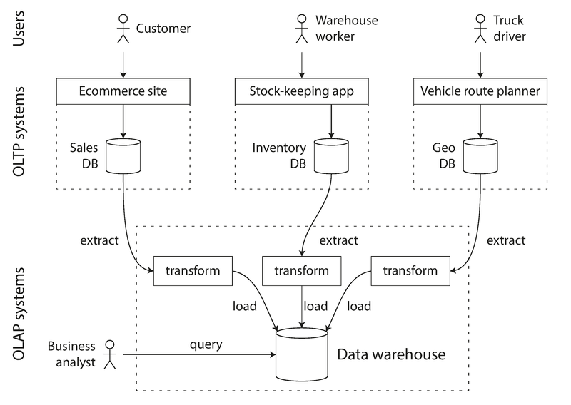

> **图说**：Figure 3-8。ETL 流程：多个 OLTP 系统（电商数据库、库存系统、车辆规划）的数据被 Extract 出来，经过 Transform 清洗和转换，Load 到统一的 Data Warehouse，供 Business Analyst 查询。

数据仓库表面上和关系数据库一样——都用 SQL。但底层的存储引擎完全不同，针对分析查询模式优化。

> **2026 年更新**：云原生数据仓库已经成为主流。Snowflake、Google BigQuery、Amazon Redshift（Serverless 版本）、Databricks Lakehouse 大幅降低了数据仓库的使用门槛。同时，"数据湖仓一体（Lakehouse）"的概念兴起——试图在数据湖的开放存储格式（Parquet、Delta Lake、Iceberg）之上提供数据仓库级别的查询能力。

#### 8.2 星型模式与雪花模式

数据仓库最常用**星型模式（Star Schema）**，也叫维度建模（Dimensional Modeling）：

- **事实表（Fact Table）**：位于中心，每行代表一个事件（如一次购买）。可以有上百列，数据量巨大（大企业可达数十 PB）
- **维度表（Dimension Table）**：围绕事实表，描述事件的 who/what/where/when/how/why（如产品、商店、日期、客户、促销活动）

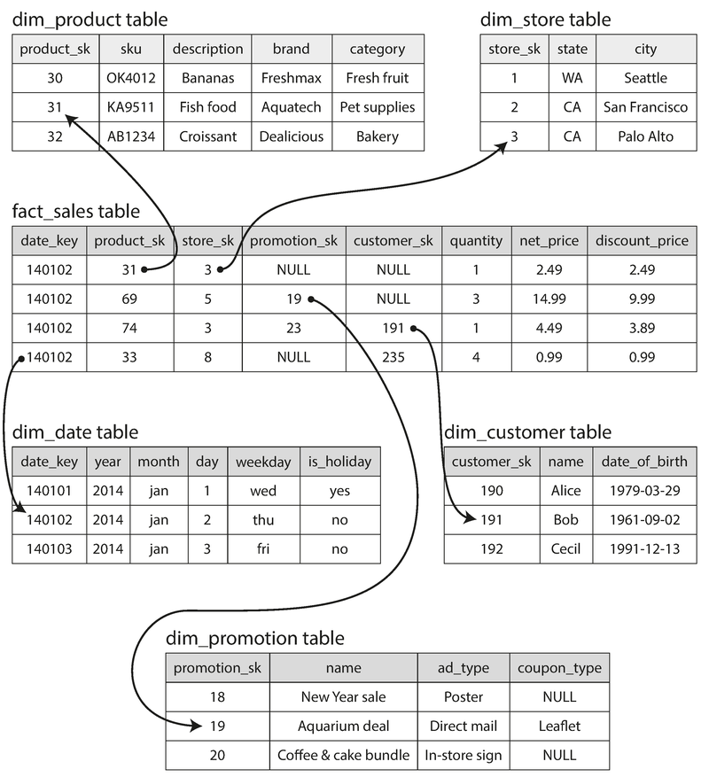

> **图说**：Figure 3-9。一个零售数据仓库的星型模式。中间是 `fact_sales` 表（date_key, product_sk, store_sk, promotion_sk, customer_sk, quantity, net_price, discount_price），通过外键连接到五个维度表（dim_product, dim_store, dim_date, dim_customer, dim_promotion）。

**雪花模式（Snowflake Schema）**：在星型基础上，维度表进一步拆分为子维度（如 dim_product 中的 brand 和 category 拆成独立表）。更规范化，但更复杂，实践中**星型模式因为简单更受欢迎**。

特点：事实表常有 100+ 列，维度表也很宽（dim_store 可能包含商店面积、离最近高速的距离、是否有面包店等各种信息）。

---

### 9. 列式存储（Column-Oriented Storage）

这是本章的第三大核心主题——专门为分析查询优化的存储方式。

#### 9.1 为什么需要列式存储

事实表有 100+ 列，但一次分析查询通常只访问其中 4-5 列。例如：

```sql
SELECT
  dim_date.weekday, dim_product.category,
  SUM(fact_sales.quantity) AS quantity_sold
FROM fact_sales
  JOIN dim_date    ON fact_sales.date_key   = dim_date.date_key
  JOIN dim_product ON fact_sales.product_sk = dim_product.product_sk
WHERE
  dim_date.year = 2013 AND
  dim_product.category IN ('Fresh fruit', 'Candy')
GROUP BY
  dim_date.weekday, dim_product.category;
```

这个查询只需要 `date_key`、`product_sk`、`quantity` 三列。在行式存储中，必须加载整行（100+ 列）再过滤，浪费大量 I/O。

**列式存储的核心思想：不按行存，按列存。** 每列单独一个文件，查询只读需要的列文件。

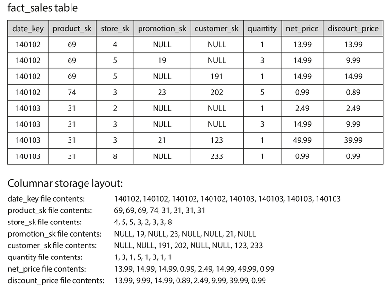

> **图说**：Figure 3-10。上半部分是 `fact_sales` 表的行式视图。下半部分是列式存储布局——每列的值单独存储为一个文件（date_key file、product_sk file、store_sk file...）。各列文件中的第 k 个条目对应同一行。

> **常见误用**：把 Cassandra/HBase 的"列族（Column Family）"和列式存储混为一谈。Bigtable 模型中，同一列族内的所有列仍然是**按行**存储在一起的，并不使用列压缩。它本质上仍是行式存储。

#### 9.2 列压缩（Column Compression）

列式存储天然适合压缩——同一列的值往往重复度高。

**位图编码（Bitmap Encoding）**：适用于列中不同值（distinct values）数量较少的场景。

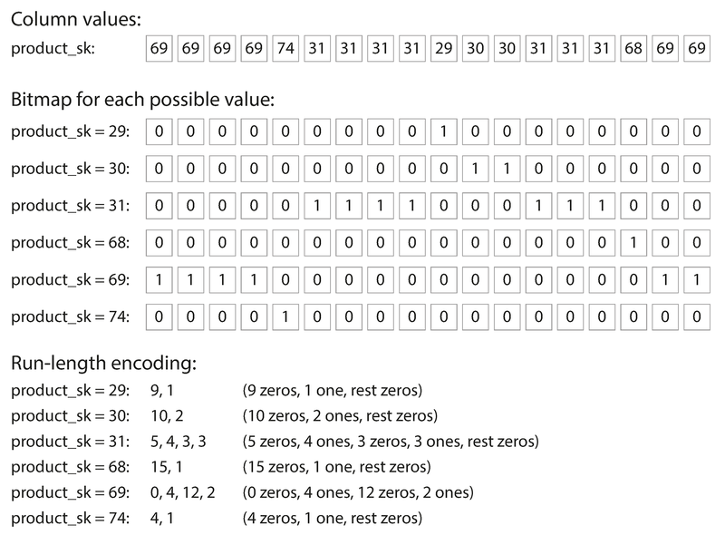

> **图说**：Figure 3-11。`product_sk` 列的位图编码。原始值序列 [69, 69, 69, 69, 74, 31, 31, 31, 31, 29, 30, 30, 31, 31, 31, 31, 68, 69, 69] 被转换为每个 distinct value 一个位图（如 product_sk=69 → [1,1,1,1,0,0,0,0,0,0,0,0,0,0,0,0,0,1,1]）。稀疏位图可进一步用**游程编码（Run-Length Encoding）**压缩（如 product_sk=69 → "0, 4, 12, 2" 表示 0 个零 → 4 个一 → 12 个零 → 2 个一）。

位图索引对数据仓库查询极其友好：
- `WHERE product_sk IN (30, 68, 69)` → 三个位图做 **bitwise OR**
- `WHERE product_sk = 31 AND store_sk = 3` → 两个位图做 **bitwise AND**

由于各列文件行序一致，第 k 位的含义在所有列的位图中对齐。

#### 9.3 向量化处理（Vectorized Processing）

列式存储不仅减少了磁盘 I/O，还对 CPU 缓存极其友好：

- 一块压缩的列数据可以装进 **L1 缓存**
- CPU 在紧凑循环中迭代处理（无函数调用开销）
- 可以利用 CPU 的 **SIMD（Single Instruction Multiple Data）** 指令批量处理
- bitwise AND/OR 可以直接在压缩数据上操作

这种技术称为**向量化处理（Vectorized Processing）**，是现代分析型数据库的核心性能优化。

#### 9.4 列存储的排序

列存储中各列文件必须保持行序一致（否则无法重组为完整行）。可以选择按某些列排序——类似 SSTable 的思路：

- 选择第一排序键（如 `date_key`）和第二排序键（如 `product_sk`）
- 排序后**第一排序列压缩率极高**——大量连续的相同值，游程编码可以把数十亿行的列压缩到几 KB
- 后续排序列压缩效果递减

**多种排序副本（C-Store / Vertica 的创新）**：既然数据要复制到多台机器做容灾，不同副本可以用**不同的排序方式**。查询时自动选择最合适的排序副本。这和行式存储的多个二级索引不同——列式存储没有指向数据的"指针"，每个排序副本都是数据本身。

#### 9.5 写入列式存储

列式存储对**写入不友好**——插入一行意味着要更新所有列文件。如果是排序的，更要重写大量数据。

解决方案？**又是 LSM-Tree 的思路**：
1. 写入先进 Memtable（内存，可以是行式或列式）
2. 积累足够后批量写出为新的列文件
3. 后台合并
4. 查询时同时检查内存数据和磁盘列文件，对用户透明

> 📎 **关联**：这说明 LSM-Tree 不只是 OLTP 的专利——它的"先内存后批量落盘"的模式在分析型系统中同样适用。Vertica 就是这么做的。

---

### 10. 物化聚合（Materialized Aggregates）

数据仓库查询经常做聚合（COUNT、SUM、AVG）。如果相同的聚合反复计算，可以**缓存结果**。

**物化视图（Materialized View）**：虚拟视图（Virtual View）只是查询的快捷方式，每次使用都重新计算。物化视图则把查询结果实际写入磁盘。底层数据变化时物化视图需要更新，这会拖慢写入。所以 OLTP 中少用，OLAP 中更适合。

**数据立方体（Data Cube / OLAP Cube）**：物化视图的特例——按不同维度（日期、产品、商店……）预计算聚合值，形成一个多维网格。

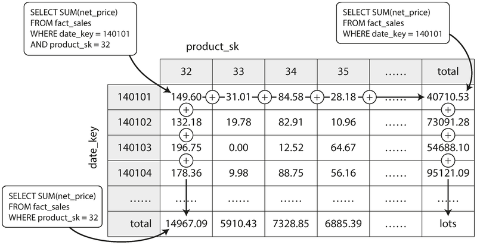

> **图说**：Figure 3-12。一个二维数据立方体，行是 date_key，列是 product_sk，每个单元格是 SUM(net_price)。行末尾和列底部分别是按维度汇总的合计值。可以极快地回答"昨天所有商店的总销售额"之类的查询。

**优势**：某些查询（如"昨天按商店的总销售额"）变得极快——直接查预计算值。
**劣势**：灵活性差——如果维度中没有"价格"，就没法计算"售价超过 100 的商品占销售额的比例"。

> **作者观点**：大多数数据仓库选择尽量保留原始数据，只把数据立方体作为特定高频查询的性能加速手段，而非替代品。

---

## 重点标记

1. **索引的核心权衡**：索引加速读取，但拖慢写入。没有"免费的索引"。
2. **LSM-Tree 的本质**：把随机写入转化为顺序写入（通过内存排序 + 后台合并）。
3. **B-Tree 的本质**：固定大小页的原地更新，通过 WAL 保证可靠性。
4. **写放大（Write Amplification）**：一次逻辑写导致多次物理写——对 SSD 寿命尤其关键。
5. **OLTP 瓶颈是 seek，OLAP 瓶颈是 bandwidth**：这决定了两者需要完全不同的存储引擎。
6. **列式存储的三层优势**：减少磁盘 I/O → 列压缩 → CPU 向量化处理。
7. **LSM-Tree 的思想无处不在**：不仅用于 OLTP 引擎（RocksDB），也用于列式存储的写入路径（Vertica），甚至用于全文索引（Lucene）。

---

## 自测：你真的理解了吗？

**Q1**：你的团队运营一个 URL 短链接服务，有 1000 万个短链接，每个链接每天被访问数千次，你需要记录每个链接的总点击数。你会选择什么样的存储引擎？为什么 Bitcask 的哈希索引方案可能特别适合这个场景？

**Q2**：有人说"LSM-Tree 的写入永远比 B-Tree 快"。这个说法准确吗？在什么情况下 LSM-Tree 的写入性能可能反而不如 B-Tree？

**Q3**：你在 Cassandra 集群上运行一个写入密集型应用。最近发现读取延迟越来越高，磁盘使用也在快速增长。最可能的原因是什么？你会如何诊断和解决？

**Q4**：一个电商公司想分析"过去三年每月各品类的销售趋势"。这个查询跑在 OLTP 数据库（PostgreSQL，行式存储）上需要 30 分钟。如果改用列式存储的数据仓库，为什么会快很多？请从磁盘 I/O 和 CPU 两个层面解释。

**Q5**：你的同事建议在数据仓库中为所有常见的聚合查询创建物化视图以加速分析。这个策略有什么潜在的代价？在什么场景下应该谨慎使用物化视图？
