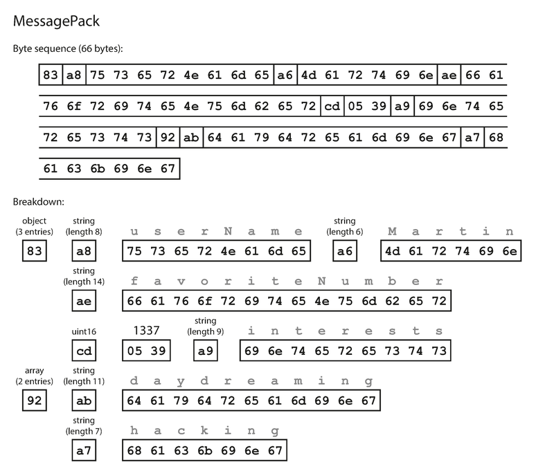
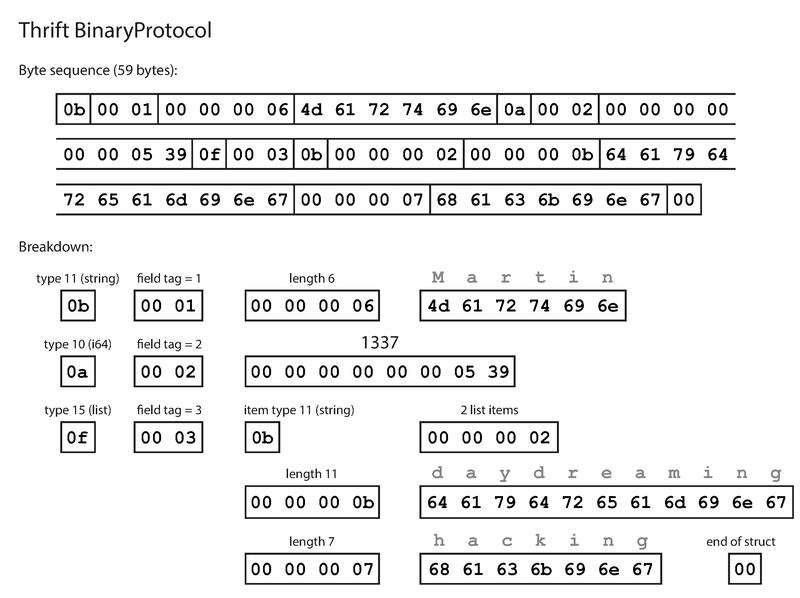
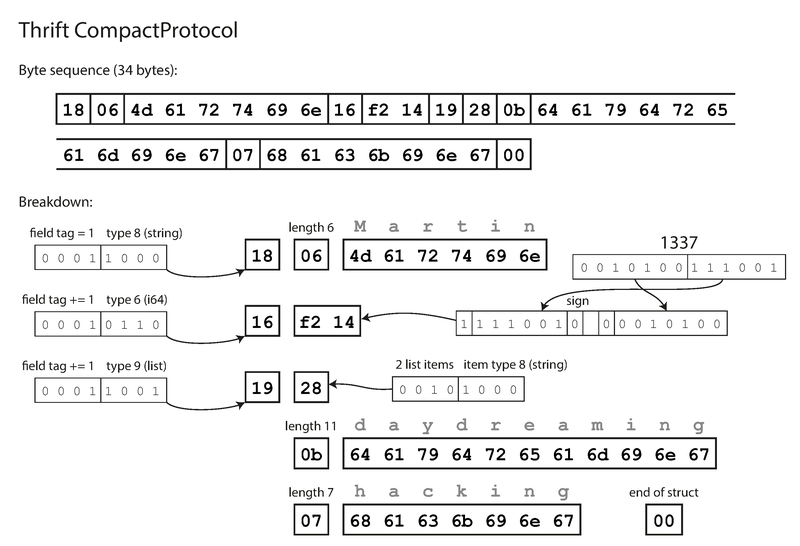
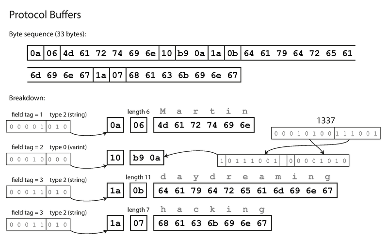
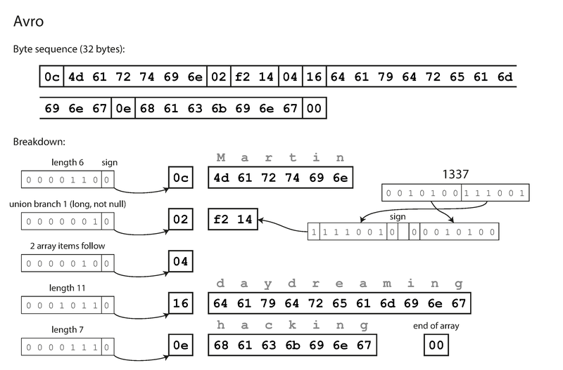
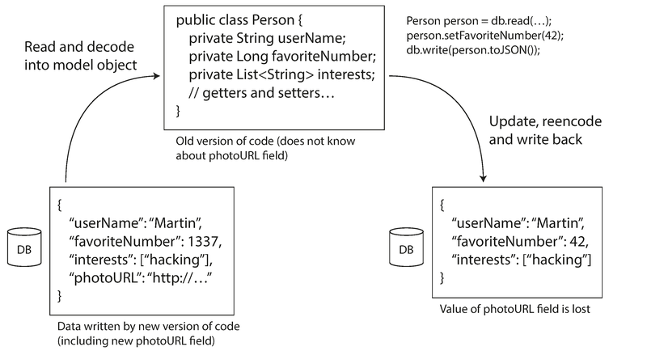

# 模块 04：编码与演化

> 对应 Chapter 4: Encoding and Evolution
> Part I 数据系统基础

---

## 概念地图

- **核心概念** (必须内化): Forward Compatibility（前向兼容）vs Backward Compatibility（后向兼容）、Schema Evolution（模式演化）机制、三种数据流模式
- **实操要点** (动手时需要): Thrift / Protocol Buffers / Avro 的 schema 演化规则、field tag 不可更改原则、REST vs RPC 的选型权衡
- **背景知识** (扩展理解): MessagePack 等二进制 JSON 变体、SOAP/WSDL 的历史、分布式 Actor 框架中的编码问题

---

## 概念讲解

### 1. 为什么编码与演化如此重要

应用不可能一成不变。功能不断增加、需求不断变化，数据格式和 schema 也必须跟着变。但在大型系统中，代码变更不可能瞬间完成：

- **服务端应用**采用 rolling upgrade（滚动升级），新版本逐步部署到各节点
- **客户端应用**完全由用户控制，旧版本可能长期存在

这意味着：**新旧版本的代码和新旧格式的数据会在系统中同时共存。** 为了系统平稳运行，编码格式必须同时支持两个方向的兼容性：

| 兼容方向 | 定义 | 难度 |
|----------|------|------|
| **Backward Compatibility**（后向兼容） | 新代码能读旧数据 | 较容易——你知道旧格式长什么样 |
| **Forward Compatibility**（前向兼容） | 旧代码能读新数据 | 较难——旧代码需要忽略它不认识的新内容 |

> 📎 **关联**：Chapter 1 引入了 Evolvability（可演化性）的概念——系统应该让变更变得容易。本章是这个理念的具体落地：编码格式的设计直接决定了系统的可演化性。


> **图说**：Martin Kleppmann 画的"编码与演化"地图。左上方是 Bulk Storage Tundra（CSV、Parquet、Log files），中部是 Random-Access Storage（JDBC），上方是 Gulf of Binary Encodings（Protocol Buffers、Thrift、Avro），下方是 Coast of Textual Encodings（JSON、XML），右侧是 People's Republic of RPC（REST、SOAP、CORBA）和 Message Passing 山脉（Akka、Erlang）。所有区域被 Schema Evolution 之路贯穿。

---

### 2. 编码的基本概念

程序处理数据时至少需要两种表示形式：

```
内存表示（objects, structs, hash tables, trees…）
    ↕  编码（encoding）/ 解码（decoding）
字节序列（写入文件、发送到网络）
```

- **Encoding**（编码），也叫 serialization / marshalling——从内存到字节序列
- **Decoding**（解码），也叫 parsing / deserialization / unmarshalling——从字节序列到内存

> **常见误用**：Serialization 在事务的语境中（Chapter 7）表示"可串行化"（Serializability），和这里的"序列化"完全不同。本书统一用 encoding 避免歧义。

---

### 3. 语言内置的序列化格式

Java 有 `java.io.Serializable`，Python 有 `pickle`，Ruby 有 `Marshal`——这些语言内置的序列化方式看起来方便，但有四个致命问题：

| 问题 | 说明 |
|------|------|
| **语言锁定** | 数据编码绑定特定语言，跨语言读取极其困难 |
| **安全隐患** | 解码时需要实例化任意类，攻击者可以利用这点执行远程代码 |
| **版本兼容差** | 前向/后向兼容性往往是事后才想到的 |
| **性能差** | Java 的内置序列化以臃肿和低性能闻名 |

> **作者观点**：除了非常短暂的临时用途，不应该使用语言内置的编码格式。

> **2026 年更新**：Java 社区已逐步弃用 `java.io.Serializable`。JDK 17+ 的 record 类型更鼓励使用结构化数据交换格式（如 JSON、Protocol Buffers）。Python 社区也越来越多地用 Pydantic + JSON 替代 pickle。

---

### 4. JSON、XML 与二进制变体

JSON 和 XML 是跨语言的通用文本格式，但它们有一些微妙的问题：

| 问题 | 详情 |
|------|------|
| **数字精度模糊** | JSON 不区分整数和浮点数，大于 2^53 的整数在 JavaScript 中会丢失精度。Twitter 的 API 不得不同时返回 tweet ID 的数字版和字符串版 |
| **不支持二进制字符串** | 只能用 Base64 编码绕过，数据膨胀 33% |
| **Schema 支持可选** | XML Schema 和 JSON Schema 都不是必须的，很多应用直接硬编码解析逻辑 |
| **CSV 更糟糕** | 没有 schema、转义规则模糊、无法区分数据类型 |

> **作者观点**：尽管有这些缺陷，JSON/XML/CSV 对于很多场景已经够用了——尤其是作为跨组织数据交换格式。让不同组织在格式上达成一致，本身就比大多数技术问题更难。

#### 4.1 二进制编码（Binary Encoding）

对于组织内部使用，可以选择更紧凑、解析更快的二进制格式。JSON 的二进制变体包括 MessagePack、BSON、BJSON、UBJSON 等。

以这条 JSON 记录为例（贯穿本章的示例）：

```json
{
  "userName": "Martin",
  "favoriteNumber": 1337,
  "interests": ["daydreaming", "hacking"]
}
```

用 MessagePack 编码后是 **66 字节**，而文本 JSON（去掉空格）是 81 字节——只节省了 18%：



> **图说**：MessagePack 编码详解。第一个字节 `0x83` 表示 3 个字段的 object，`0xa8` 表示长度 8 的字符串，之后是 "userName" 的 ASCII 字节。字段名完整保留在编码数据中。

关键发现：**二进制 JSON 变体节省的空间有限**，因为它们不要求 schema，所以必须在编码数据中包含所有字段名。我们能做得更好——接下来看 Thrift、Protocol Buffers 和 Avro 如何把同一条记录压缩到 32-34 字节。

---

### 5. Thrift 与 Protocol Buffers

Apache Thrift（Facebook 开发）和 Protocol Buffers（Google 开发），都在 2007-08 年开源。核心思路一致：**用 schema 定义数据结构，用 field tag（字段标签）替代字段名。**

#### 5.1 Schema 定义

**Thrift IDL：**
```thrift
struct Person {
  1: required string   userName,
  2: optional i64      favoriteNumber,
  3: optional list<string> interests
}
```

**Protocol Buffers：**
```protobuf
message Person {
  required string user_name     = 1;
  optional int64  favorite_number = 2;
  repeated string interests      = 3;
}
```

注意：每个字段都有一个**数字标签**（1, 2, 3）。编码时使用标签而非字段名——这是空间节省的关键。

#### 5.2 编码对比

| 编码方式 | 大小 | 特点 |
|---------|------|------|
| Thrift BinaryProtocol | 59 字节 | 字段含类型注解 + tag 号，不含字段名 |
| Thrift CompactProtocol | 34 字节 | 类型和 tag 打包进单字节，变长整数 |
| Protocol Buffers | 33 字节 | 与 CompactProtocol 类似，bit packing 略有不同 |
| MessagePack (JSON 二进制) | 66 字节 | 包含完整字段名 |
| 文本 JSON | 81 字节 | 可读但最大 |



> **图说**：Thrift BinaryProtocol 编码（59 字节）。每个字段由类型标识（如 `0x0b` = string）、field tag 号（`00 01` = 1）和值组成。不再包含 "userName" 等字段名。



> **图说**：Thrift CompactProtocol 编码（34 字节）。field tag 和类型合并为一个字节，整数 1337 用变长编码仅需 2 字节（而非 8 字节）。



> **图说**：Protocol Buffers 编码（33 字节）。结构与 Thrift CompactProtocol 非常相似。注意 `repeated` 字段的编码方式——同一个 tag 号多次出现。

> **常见误用**：schema 中的 `required` / `optional` 标记**不影响编码格式**——编码数据中没有任何字段标记是否为 required。区别仅在于运行时校验：required 字段缺失会报错。

#### 5.3 Field Tag 与 Schema Evolution

Field tag 是实现兼容性的关键机制：

**前向兼容（旧代码读新数据）**：
- 旧代码遇到不认识的 tag 号 → 根据类型注解跳过对应字节 → 正常继续

**后向兼容（新代码读旧数据）**：
- 新代码读到旧数据中缺少的新字段 → 使用默认值填充

**关键规则：**

```
 可以做：                             不可以做：
 ✓ 修改字段名（tag 号不变）            ✗ 修改 field tag 号
 ✓ 添加新字段（给新 tag 号）           ✗ 新增的字段标为 required
 ✓ 删除 optional 字段                 ✗ 删除 required 字段
                                      ✗ 复用已删除字段的 tag 号
```

> 为什么新字段不能标 required？因为旧数据中没有这个字段，新代码读到旧数据时 required 校验会失败。所以**初始部署后新增的字段必须是 optional 或有默认值**。

#### 5.4 数据类型演化

改变字段类型是可能的，但有风险。例如把 `int32` 改为 `int64`：
- 新代码读旧数据：32 位值零扩展为 64 位，没问题
- 旧代码读新数据：64 位值被截断为 32 位，**可能丢失数据**

Protocol Buffers 的一个巧妙设计：**没有 list/array 类型，而是用 `repeated` 标记**。编码时同一个 tag 号重复出现即表示多值。好处是可以把 `optional`（单值）改为 `repeated`（多值），新代码看到零或一个元素的列表，旧代码只看到最后一个元素。

Thrift 有专用的 `list` 类型，不支持从单值到多值的平滑演化，但支持嵌套列表。

---

### 6. Avro

Apache Avro 于 2009 年从 Hadoop 社区诞生，因为 Thrift 不太适合 Hadoop 的使用场景。

#### 6.1 Schema 定义

**Avro IDL（人读）：**
```
record Person {
  string               userName;
  union { null, long } favoriteNumber = null;
  array<string>        interests;
}
```

**JSON Schema（机读）：**
```json
{
  "type": "record",
  "name": "Person",
  "fields": [
    {"name": "userName",       "type": "string"},
    {"name": "favoriteNumber", "type": ["null", "long"], "default": null},
    {"name": "interests",      "type": {"type": "array", "items": "string"}}
  ]
}
```

**关键区别：没有 field tag 号！**

#### 6.2 极致紧凑的编码

Avro 编码只有 **32 字节**——所有格式中最小。



> **图说**：Avro 编码（32 字节）。没有字段标识、没有类型标记——只有值的简单拼接。字符串是长度前缀 + UTF-8 字节，整数用变长编码。解码时必须严格按 schema 中字段顺序读取。

为什么能这么小？因为编码数据中**没有任何元信息**——不包含字段名、不包含 tag 号、不包含类型标记。解码时必须拿着 schema 按顺序逐字段读取。**如果读写双方的 schema 不匹配，数据就会被错误解析。**

#### 6.3 Writer's Schema 与 Reader's Schema

Avro 的独特设计：允许写入者和读取者使用**不同版本的 schema**，由 Avro 库在运行时做 schema resolution（模式解析）。

```
Writer's Schema（写入方使用的版本）
       ↓ 编码数据
       ↓
  Avro Schema Resolution（按字段名匹配）
       ↓
Reader's Schema（读取方期望的版本）
```

匹配规则：
- **按字段名**（不是按顺序也不是按 tag）匹配写入 schema 和读取 schema
- Writer 有但 Reader 没有的字段 → 忽略
- Reader 有但 Writer 没有的字段 → 用 Reader schema 中的默认值填充
- **字段顺序可以不同**

#### 6.4 Schema Evolution 规则

| 操作 | 后向兼容 | 前向兼容 | 条件 |
|------|---------|---------|------|
| 新增有默认值的字段 | 是 | 是 | 默认值必须存在 |
| 新增无默认值的字段 | **否** | 是 | 旧数据中没有该字段，新 Reader 无法填充 |
| 删除有默认值的字段 | 是 | 是 | — |
| 删除无默认值的字段 | 是 | **否** | 旧 Reader 找不到该字段且无默认值 |
| 改字段名 | 是（用 alias） | **否** | Reader 用 alias 匹配旧字段名 |

**关于 null 值**：Avro 不像 Java 那样允许任何字段为 null。如果一个字段可以为 null，必须显式声明为 `union { null, ... }` 类型。这是一种更安全的设计。

> **作者观点**：Avro 的 union 写法比什么都能 null 更啰嗦，但它明确了"什么可以为空"，有助于防止 bug。引用了 Tony Hoare 的名言——null 引用是"十亿美元的错误"。

#### 6.5 Writer's Schema 如何传递？

没有 tag 号，Reader 怎么知道 Writer 用的是哪个版本的 schema？取决于场景：

| 场景 | 传递方式 |
|------|----------|
| 大文件（如 Hadoop 数据湖） | schema 写在文件开头（Avro Object Container File） |
| 数据库中的单条记录 | 每条记录携带 schema 版本号，Reader 从 schema registry 获取对应 schema |
| 网络双向通信 | 连接建立时协商 schema 版本（Avro RPC） |

#### 6.6 动态生成 Schema —— Avro 的杀手特性

为什么 Avro 不用 field tag？因为它的设计目标之一是**支持动态生成 schema**。

场景：你想把关系数据库的表导出为二进制格式。用 Avro，可以直接从数据库 schema 自动生成 Avro schema——表的每一列变成 Avro 的一个字段，列名变成字段名。如果数据库 schema 变了（加了一列、删了一列），重新生成 Avro schema 即可，整个过程全自动。

用 Thrift 或 Protocol Buffers 就麻烦了——你必须手动维护数据库列名到 field tag 号的映射，而且要小心不能复用以前的 tag 号。

> 📎 **关联**：Chapter 10（批处理）会详细讨论 Avro 在数据导出和数据管道中的使用。

---

### 7. Schema 的优势总结

Protocol Buffers、Thrift、Avro 虽然各有差异，但相比文本格式有共同的优势：

| 优势 | 说明 |
|------|------|
| **更紧凑** | 省去字段名，比"二进制 JSON"变体更小 |
| **Schema 即文档** | schema 是解码的必要条件，所以永远是最新的（不像手写文档会过时） |
| **兼容性可验证** | schema registry 可以在部署前检查兼容性 |
| **代码生成** | 静态类型语言可以从 schema 生成类型安全的代码 |

> **作者观点**：Schema evolution 提供了和 schemaless/schema-on-read 数据库一样的灵活性，同时还有更好的数据保障和更好的工具支持。

> **2026 年更新**：Protocol Buffers（尤其是 proto3 + gRPC）已成为微服务间通信的主流选择。Avro 在数据工程领域（Kafka、Spark、数据湖）仍然非常活跃。Confluent Schema Registry 已成为管理 Kafka 消息 schema 的标准方案。此外，Buf 等新工具为 Protocol Buffers 的 schema 管理和兼容性检查带来了更好的开发者体验。

---

### 8. 数据流模式

编码格式解决的是"怎么把数据变成字节"，但数据在进程之间的流转还有另一个维度：**谁编码、谁解码、通过什么渠道？**

#### 8.1 通过数据库的数据流

```
写入进程  ──encode──→  数据库  ──decode──→  读取进程
```

写入数据库 = 编码，读取数据库 = 解码。特殊之处：

- **"给未来的自己发消息"**——同一个进程后来可能要读自己以前写的数据。后向兼容是必须的。
- **rolling upgrade 期间**，新版本写入的数据可能被旧版本读取。前向兼容也是必须的。
- **容易被忽视的陷阱**：旧代码读取新数据、修改后写回——新字段可能在这个过程中丢失。



> **图说**：旧版本代码读取了包含 `photoURL` 字段的记录，但旧代码的模型对象中没有这个字段。更新 `favoriteNumber` 后写回数据库时，`photoURL` 字段丢失了。

**data outlives code**（数据比代码长寿）：部署新版应用几分钟就能替换旧代码，但数据库中可能有五年前写入的数据。大多数关系数据库允许添加 `NULL` 默认值的新列而不重写现有数据——读到旧行时自动填 NULL。LinkedIn 的 Espresso 用 Avro 存储数据，利用 Avro 的 schema evolution 来处理不同版本的记录。

**归档存储**：数据库快照/备份通常用最新 schema 统一编码，是用 Avro Object Container File 或 Parquet 等列式格式的好时机。

> 📎 **关联**：Chapter 3 讨论了列式存储（Column Compression），Chapter 10 会详细讨论归档存储的使用。

#### 8.2 通过服务调用的数据流（REST 与 RPC）

##### Web 服务

当 HTTP 被用作服务间通信协议时，称为 web service。两大阵营：

| 特性 | REST | SOAP |
|------|------|------|
| **本质** | 设计哲学（基于 HTTP 原则） | XML 协议 |
| **数据格式** | 通常是 JSON | XML（WSDL 描述接口） |
| **工具生态** | 浏览器、curl、广泛的中间件 | 重度依赖代码生成和 IDE |
| **简洁度** | 简单、可直接调试 | 复杂、人工构造消息困难 |
| **跨语言** | 几乎所有语言都支持 | 供应商实现间互操作性差 |
| **当前趋势** | 公共 API 的主流 | 大型企业内部仍在用，但在萎缩 |

> **2026 年更新**：SOAP 在新项目中几乎已经消失。REST + JSON 仍然是公共 API 的事实标准。同时，GraphQL 作为 REST 的补充方案在前端驱动的场景中获得了广泛采用（解决了 over-fetching / under-fetching 问题）。OpenAPI（Swagger）已成为 RESTful API 文档和代码生成的标准工具。

##### RPC 的问题

Remote Procedure Call（远程过程调用）的核心思想：让远程服务调用看起来像本地函数调用——这种抽象叫 location transparency（位置透明性）。但 Kleppmann 明确指出这个抽象是**根本性有缺陷的**。网络调用和本地调用有本质区别：

| 本地函数调用 | 网络请求 |
|-------------|---------|
| 结果可预测（成功或失败） | 不可预测——请求/响应可能丢失、超时 |
| 返回结果或抛异常 | 可能没有结果也没有异常（只有超时） |
| 不存在重复执行 | 重试可能导致重复执行（需要幂等性） |
| 耗时稳定 | 延迟波动巨大（毫秒到秒级） |
| 可以传指针 | 参数必须编码为字节 |
| 同一语言 | 客户端和服务端可能不同语言 |

> **作者观点**：让远程服务看起来像本地对象毫无意义，因为两者是根本不同的东西。REST 的优点之一恰恰是不掩盖网络的本质。

> 📎 **关联**：Chapter 8 会深入讨论网络的不可靠性和超时问题，Chapter 11 会讨论幂等性机制。

##### RPC 的现代发展

尽管有上述问题，RPC 并没有消亡，而是进化了：

| 框架 | 编码格式 | 特点 |
|------|---------|------|
| gRPC | Protocol Buffers | 支持流式请求/响应 |
| Thrift RPC | Thrift Binary | 与 Thrift 编码集成 |
| Avro RPC | Avro | 连接时协商 schema |
| Finagle | Thrift | Futures/Promises 异步模型 |
| Rest.li | JSON over HTTP | — |

新一代 RPC 框架不再试图隐藏网络的存在：Finagle 和 Rest.li 用 Futures（Promise）封装可能失败的异步操作，gRPC 支持请求流和响应流。

> **2026 年更新**：gRPC 已成为微服务内部通信的事实标准。Connect（Buf 推出的 gRPC 兼容协议）支持直接从浏览器调用 gRPC 服务。同时出现了 tRPC（TypeScript 全栈 RPC）等新方案，在类型安全方面走得更远。

**RPC 的实际定位**：
- 公共 API → **REST**（更好的工具生态、可调试性、通用性）
- 组织内部服务间通信 → **RPC**（更好的性能、更强的类型约束）

##### 服务 API 的兼容性

RPC 服务需要独立部署和演化。简化假设：**服务端先升级，客户端后升级**。因此：
- 请求需要**后向兼容**（新服务端读旧客户端发的请求）
- 响应需要**前向兼容**（旧客户端读新服务端返回的响应）

API 版本管理没有统一标准。常见方案：
- URL 中嵌入版本号（`/api/v2/users`）
- HTTP `Accept` 头
- API key 关联版本号（Stripe 的做法）

#### 8.3 通过消息传递的数据流

异步消息传递是 RPC 和数据库之间的一种中间形态：

```
发送者  ──encode──→  Message Broker  ──decode──→  接收者
                  (消息队列/消息代理)
```

| 优势 | 说明 |
|------|------|
| 缓冲 | 接收方不可用时暂存消息，提高可靠性 |
| 自动重试 | 崩溃后自动重新投递，防止消息丢失 |
| 地址解耦 | 发送方不需要知道接收方的 IP/端口 |
| 一对多 | 一条消息可发送给多个接收方 |
| 逻辑解耦 | 发送方只管发布，不关心谁消费 |

与 RPC 的关键区别：消息传递通常是**单向的**——发送方不等待响应。

**Message Broker**（消息代理）的代表：RabbitMQ、ActiveMQ、Apache Kafka、NATS。基本模式是发送方向命名的 queue/topic 发送消息，broker 确保消息被投递给订阅者。

消息 broker 不限制数据格式——消息就是字节序列加元数据，使用什么编码由应用决定。只要编码支持前向/后向兼容，发布者和消费者就能独立部署。

> 📎 **关联**：Chapter 11 会深入比较各种消息系统的语义（at-least-once、exactly-once 等）。

##### 分布式 Actor 框架

Actor model（Actor 模型）是一种并发编程模型：逻辑封装在 Actor 中，每个 Actor 有独立状态，通过异步消息通信。Distributed actor framework（分布式 Actor 框架）将这个模型扩展到多节点，消息在本地或跨网络透明传输。

| 框架 | 编码方式 | 兼容性 |
|------|---------|--------|
| Akka | 默认 Java 序列化（无兼容性），可替换为 Protocol Buffers | 替换后可滚动升级 |
| Orleans | 自有版本机制，可添加新方法 | 支持后向兼容 |
| Erlang OTP | 改 schema 困难，rolling upgrade 需小心规划 | 实验性 maps 类型可能改善 |

> **2026 年更新**：Akka 已更名为 Apache Pekko（开源分支）。Microsoft Orleans 在云原生场景中获得了更多关注。同时，Virtual Actor 模式被更多框架采用（如 Dapr）。Erlang/Elixir 生态中，Phoenix LiveView 等方案减少了对复杂消息传递的需求。

---

## 重点标记

1. **Backward vs Forward Compatibility**：后向兼容 = 新代码读旧数据（较容易），前向兼容 = 旧代码读新数据（较难，需忽略未知字段）。
2. **Field Tag 不可更改**：Thrift/Protocol Buffers 中 field tag 号一旦分配就是永久的，改了就破坏所有已编码数据。
3. **新字段不能设为 required**：初始部署后新增的字段必须是 optional 或有默认值，否则破坏后向兼容。
4. **Avro 按字段名匹配**：不依赖 tag 号，适合动态生成 schema（如从数据库 schema 自动生成）。
5. **data outlives code**：数据库中可能存在多年前写入的数据，schema evolution 让整个数据库看起来像使用统一 schema。
6. **RPC != 本地调用**：网络请求有超时、丢失、重试、延迟波动等本地调用没有的问题，不应该试图掩盖这种差异。
7. **REST 用于公共 API，RPC 用于内部通信**：REST 的工具生态和可调试性适合对外暴露，RPC 的性能和类型约束适合组织内部。

---

## 三种编码格式的完整对比

| 维度 | Thrift / Protocol Buffers | Avro | JSON / XML |
|------|--------------------------|------|-----------|
| Schema | 必须 | 必须 | 可选 |
| 字段标识 | field tag（数字） | 字段名 | 字段名（文本） |
| 编码大小（示例） | 33-34 字节 | 32 字节 | 66-81 字节 |
| 前向兼容 | 旧代码跳过未知 tag | 旧 Reader 忽略未知字段名 | 取决于应用实现 |
| 后向兼容 | 新代码用默认值填充缺失字段 | 新 Reader 用默认值填充 | 取决于应用实现 |
| 动态生成 Schema | 差（需手动维护 tag 映射） | 好（字段名直接对应） | 不涉及 |
| 代码生成 | 核心特性 | 可选 | 通常不需要 |
| 人类可读 | 否 | 否 | 是 |

---

## 自测：你真的理解了吗？

**Q1**：你的团队正在做一次 rolling upgrade。新版本代码在 `Person` schema 中添加了一个 `email` 字段（field tag = 4, required）。部署到一半时发现旧节点无法正常工作。请解释为什么，以及应该怎么修改 schema。

<details>
<summary>参考答案</summary>

旧节点运行的是旧代码，它读取的数据中没有 `email` 字段（因为旧代码写入时不知道这个字段），**新代码的 required 校验会在读取旧数据时失败**。实际上更准确地说：在 rolling upgrade 期间，新版本和旧版本共存，新版本写入的数据包含 `email` 字段而旧版本写入的不包含——但新版本读到旧版本写的数据时 required 校验失败。

修改方案：将 `email` 改为 `optional`（或在 proto3 中给默认值）。初始部署后新增的字段**必须**是 optional 或有默认值。

</details>

---

**Q2**：你们公司用 Avro 将关系数据库中的数据导出到数据湖。DBA 在数据库中添加了一列 `last_login_at`，又删除了一列 `legacy_flag`。这会导致数据湖的消费者出问题吗？为什么 Avro 特别适合这个场景？

<details>
<summary>参考答案</summary>

不会出问题（如果操作正确的话）。Avro 的 schema evolution 基于**字段名匹配**：
- 新增 `last_login_at`：如果该字段有默认值（比如 null），旧 Reader 遇到不认识的字段会忽略它，新 Reader 读旧数据时会用默认值填充。
- 删除 `legacy_flag`：同样要求该字段原本有默认值——旧 Reader 读新数据时用默认值填充。

Avro 特别适合这个场景因为它支持**动态生成 schema**——不需要手动维护 field tag 号。每次导出时直接从数据库的当前 schema 生成新的 Avro schema 即可，流程全自动。如果用 Thrift 或 Protocol Buffers，你需要手动管理列名到 tag 号的映射，而且必须确保不复用已删除列的 tag 号。

</details>

---

**Q3**：你的前端团队抱怨他们从 REST API 获取的 JSON 中 tweet ID 不对——一个 64 位整数 ID 的最后几位变成了 0。请解释根本原因和解决方案。

<details>
<summary>参考答案</summary>

根本原因：JSON 不区分整数和浮点数。JavaScript 用 IEEE 754 双精度浮点数表示所有数字，精度只有 2^53。超过 2^53 的 64 位整数在 JSON 解析时会**丢失精度**。

解决方案（Twitter 的做法）：在 JSON 响应中将 ID 同时以数字和字符串两种形式返回。前端使用字符串版本。更根本的方案是使用 schema-based 编码（如 Protocol Buffers），在 schema 中明确声明字段为 `int64` 类型，避免 JavaScript 的浮点数陷阱。

</details>

---

**Q4**：一个微服务 A 通过数据库与服务 B 通信。A 升级后写入了一条包含新字段 `photoURL` 的记录。B 还没升级，它读取这条记录、修改了 `favoriteNumber`、然后写回。之后 A 读取这条记录，发现 `photoURL` 不见了。请解释发生了什么，以及如何预防。

<details>
<summary>参考答案</summary>

这是本章 Figure 4-7 描述的经典问题。服务 B 的旧代码读取记录后解码为模型对象，但模型对象中没有 `photoURL` 字段——这个未知字段在**解码到应用层模型对象时被丢弃**了。当 B 修改 `favoriteNumber` 后重新编码写回数据库时，`photoURL` 就丢失了。

预防方案：
1. 编码库应该保留未知字段（passthrough unknown fields），很多 Protocol Buffers 和 Avro 的实现支持这一点。
2. 在应用层面，不要在读取-修改-写回的过程中丢弃未识别的字段。
3. 如果使用 JSON，可以保留原始 JSON 对象，只修改需要的字段后直接写回。

</details>

---

**Q5**：你的架构师在讨论要不要用 gRPC 替代 REST 作为所有对外公共 API 的协议。作为了解过本章内容的工程师，你会给出什么建议？

<details>
<summary>参考答案</summary>

不建议对所有公共 API 使用 gRPC。Kleppmann 指出 REST 在公共 API 场景有显著优势：
- **可调试性**：可以直接用浏览器或 curl 测试，不需要任何代码生成或专用工具
- **通用性**：几乎所有编程语言和平台都原生支持 HTTP + JSON
- **工具生态**：丰富的缓存、负载均衡、代理、监控、测试工具
- **客户端可控性差**：公共 API 的客户端不受你控制，你无法强制他们升级或安装 gRPC 工具链

建议的分工：
- **公共 API** → REST + JSON（+ OpenAPI 文档）
- **内部微服务通信** → gRPC + Protocol Buffers（更好的性能、更强的类型安全、流式支持）

当然，如果公共 API 的消费者主要是其他后端服务（而非浏览器），gRPC 也是可行的——但要考虑客户端的技术栈兼容性。

</details>
