# 模块 05：数据复制

> 对应 Chapter 5: Replication
> Part II 分布式数据

---

## 概念地图

- **核心概念** (必须内化): 三种复制架构（单主/多主/无主）的取舍、Quorum（法定人数）机制 `w + r > n`、复制延迟引发的一致性问题
- **实操要点** (动手时需要): 同步 vs 异步复制的配置选择、Failover（故障切换）的风险清单、冲突解决策略的选型
- **背景知识** (扩展理解): 版本向量与因果关系检测、Sloppy Quorum 与 Hinted Handoff、复制日志的四种实现方式

---

## 概念讲解

### 0. 为什么要复制数据？

Replication（复制）——在多台通过网络连接的机器上保存同一份数据的副本。三大动机：

| 动机 | 解释 |
|------|------|
| **高可用（High Availability）** | 部分节点宕机时系统继续运行 |
| **低延迟（Latency）** | 把数据放在离用户地理位置更近的地方 |
| **读扩展（Read Scalability）** | 用多台机器分担读请求 |

如果数据永远不变，复制很简单——把数据复制到每个节点一次就行。**所有复制的困难都在于处理数据的变更。**

本章假设数据集足够小，每台机器可以容纳完整数据副本。数据太大需要分片的场景在 Chapter 6 讨论。

> **图说**：Martin Kleppmann 绘制的"复制世界地图"。北部是 Single-Leader Replication 领地（PostgreSQL、MySQL、MongoDB 等），中部有 Failover 深坑和一致性模型的森林，南部是 Multi-Leader Replication（Google Docs、CouchDB）和 Leaderless Replication 的海角（Riak、Cassandra、Voldemort），西面是 Bay of Causality（因果关系之湾），东面的航路通向 Chapter 9 Consistency & Consensus。

---

### 1. 主从复制（Leaders and Followers）

最常见的复制方案是 **Leader-Based Replication**（主从复制），也叫 active/passive 或 master-slave 复制。

工作方式：

1. **一个副本被指定为 Leader（主节点）**——所有写请求必须发给它
2. **其他副本是 Follower（从节点）**——Leader 把数据变更通过 Replication Log（复制日志）发给所有 Follower
3. **读请求可以发给任何节点**，但写请求只发给 Leader

使用这种架构的数据库：PostgreSQL (9.0+)、MySQL、Oracle Data Guard、SQL Server AlwaysOn、MongoDB、RethinkDB。消息系统如 Kafka、RabbitMQ 也使用主从复制。

#### 1.1 同步复制 vs 异步复制

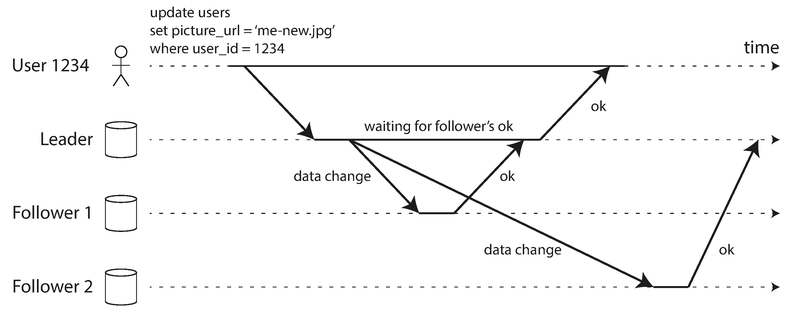

> **图说**：Leader-based replication 的时序图。Follower 1 是同步复制——Leader 等待 Follower 1 确认后才返回成功；Follower 2 是异步复制——Leader 发送变更后不等待确认。

| 特性 | 同步复制（Synchronous） | 异步复制（Asynchronous） |
|------|----------------------|----------------------|
| **数据保证** | Follower 保证有最新数据 | Follower 可能落后 |
| **写延迟** | 高——必须等 Follower 确认 | 低——Leader 直接返回 |
| **可用性** | 差——任一同步 Follower 宕机则写入阻塞 | 好——即使所有 Follower 落后，Leader 仍可写入 |
| **持久性** | 数据至少在两个节点上 | Leader 故障可能丢失已确认的写入 |

**实践中的配置**：

- **全同步**不现实——任何一个节点故障就会拖垮整个系统
- **半同步（Semi-Synchronous）**——一个 Follower 同步，其余异步；如果同步 Follower 不可用，就把另一个异步 Follower 提升为同步
- **全异步**——最常用，尤其在 Follower 多或地理分布广的场景下

> **常见误用**：以为"异步复制 + 写入确认"就意味着数据安全。实际上如果 Leader 崩溃，已确认但未复制到 Follower 的写入**会丢失**。如果需要强持久性保证，必须使用同步复制或考虑 Ch9 讨论的共识协议。

#### 1.2 添加新的 Follower

添加新 Follower 的流程（不需要停机）：

1. **对 Leader 做一致性快照**（不锁库，大多数数据库支持——MySQL 用 `innobackupex`，PostgreSQL 用 `pg_basebackup`）
2. **把快照复制到新 Follower 节点**
3. **Follower 连接 Leader，请求快照之后的所有变更**（通过快照关联的日志位置——PostgreSQL 叫 log sequence number，MySQL 叫 binlog coordinates）
4. **Follower 处理完积压的变更后即"追上"Leader**，开始正常接收实时变更流

#### 1.3 处理节点故障

**Follower 故障：Catch-up Recovery（追赶恢复）**

Follower 本地保存了已处理的复制日志位置。重启后，从断点处向 Leader 请求所有错过的变更即可。

**Leader 故障：Failover（故障切换）**

这比 Follower 故障复杂得多，过程是：

1. **检测 Leader 故障**：通常用超时机制（如 30 秒无心跳响应则判定死亡）
2. **选举新 Leader**：通过多数投票或由控制节点指定；通常选择数据最新的 Follower
3. **重新配置系统**：客户端切换写入目标到新 Leader；旧 Leader 回来后必须降级为 Follower

> 📎 **关联**：Leader 选举本质上是一个共识（Consensus）问题，Ch9 会深入讨论。

**Failover 的陷阱**：

| 陷阱 | 描述 | 真实案例 |
|------|------|---------|
| **数据丢失** | 异步复制时，新 Leader 可能缺少旧 Leader 的最新写入 | 通常直接丢弃旧 Leader 的未复制写入 |
| **外部系统不一致** | 数据库的自增 ID 被 Redis 等外部系统引用，新 Leader 重用了旧 ID | **GitHub 事件**：MySQL 主从切换导致自增主键重用，Redis 缓存和 MySQL 不一致，用户隐私数据泄露 |
| **Split Brain（脑裂）** | 两个节点都认为自己是 Leader，同时接受写入 | 安全措施 STONITH（Shoot The Other Node In The Head）——强制关闭另一个节点，但设计不当可能导致两个节点都被关闭 |
| **超时阈值选择** | 太长：恢复慢；太短：可能因为临时负载峰值误判 | 系统已经高负载时触发不必要的 Failover，雪上加霜 |

> **作者观点**：这些问题没有简单的解决方案。一些运维团队因此宁可手动执行 Failover，即使软件支持自动切换。

#### 1.4 复制日志的实现方式

| 方式 | 原理 | 优点 | 缺点 | 代表 |
|------|------|------|------|------|
| **Statement-based（语句复制）** | 把 INSERT/UPDATE/DELETE 语句转发给 Follower | 紧凑 | 非确定性函数（`NOW()`、`RAND()`）、自增列、触发器导致不一致 | MySQL <5.1、VoltDB |
| **WAL shipping（预写日志传输）** | 把物理日志（具体哪个磁盘块改了哪些字节）发给 Follower | 实现简单 | 和存储引擎深度耦合——Leader 和 Follower 必须运行相同版本的数据库软件，**零停机升级困难** | PostgreSQL、Oracle |
| **Logical (row-based) log（逻辑日志复制）** | 按行记录变更（插入的新值、删除的主键、更新的新旧值） | 与存储引擎解耦——Leader/Follower 可以运行不同版本，甚至不同存储引擎；易于被外部系统解析 | 比 WAL 稍复杂 | MySQL binlog (row-based) |
| **Trigger-based（触发器复制）** | 用数据库触发器捕获变更，写入专用表，由外部进程消费 | 灵活——可以只复制部分数据、跨异构数据库 | 开销大，容易出 bug | Oracle GoldenGate、Bucardo (Postgres) |

> 📎 **关联**：Logical log 的"变更数据捕获"能力和 Ch11 的 CDC（Change Data Capture）直接相关。

> **2026 年更新**：PostgreSQL 从 10 版本开始原生支持 Logical Replication，已成为跨版本升级、异构复制的标准做法。MySQL 默认也已切换到 row-based binlog。

---

### 2. 复制延迟问题（Problems with Replication Lag）

主从复制的一个常见用法是**读扩展（Read-Scaling）**：写入经 Leader，大量读请求分散到多个 Follower。这要求异步复制（同步复制在多节点下不可行），但异步复制意味着 Follower 可能返回过时数据——这就是**最终一致性（Eventual Consistency）**。

"最终"是个刻意模糊的词——正常情况下延迟可能只有毫秒级，但在系统高负载或网络问题时，延迟可以达到**数秒甚至数分钟**。

#### 2.1 读你自己的写（Read-After-Write Consistency）

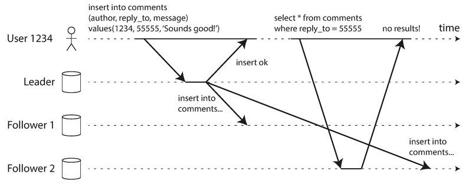

> **图说**：用户写入评论后立即读取，但读请求落在了尚未同步的 Follower 上，结果看不到自己刚发的评论——好像数据丢了。

**Read-After-Write Consistency**（也叫 Read-Your-Writes Consistency）保证：用户能看到自己提交的数据，但不承诺能看到其他用户的最新数据。

实现技巧：

| 策略 | 适用场景 |
|------|---------|
| **按场景路由到 Leader** | 用户读自己的个人资料 → 从 Leader 读；读别人的 → 从 Follower 读 |
| **按时间路由** | 最近 1 分钟内有写入 → 所有读走 Leader；否则走 Follower |
| **客户端带时间戳** | 客户端记住最近一次写入的时间戳，系统确保读到的副本至少包含该时间戳之后的数据 |
| **跨数据中心路由** | 如果 Leader 在特定数据中心，需要把对应的读请求路由到同一个数据中心 |

**跨设备场景**更复杂：用户在手机上写了数据，在电脑上查看——两个设备可能连到不同的数据中心，客户端时间戳也不共享，需要集中式的元数据管理。

#### 2.2 单调读（Monotonic Reads）

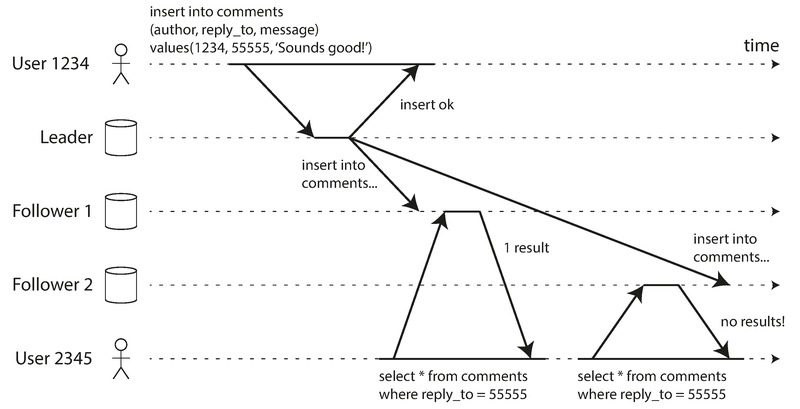

> **图说**：User 2345 先从 Follower 1（数据较新）读到了 User 1234 的评论，然后刷新页面，请求被路由到 Follower 2（数据较旧），评论"消失"了。时间仿佛在倒流。

**Monotonic Reads（单调读）**保证：一旦你读到了某个数据，后续的读不会看到更旧的版本。强度介于强一致性和最终一致性之间。

**实现方式**：让每个用户始终从同一个 Follower 读取（比如用 User ID 的哈希值来选择 Follower）。该 Follower 故障时才切换到另一个。

#### 2.3 一致前缀读（Consistent Prefix Reads）

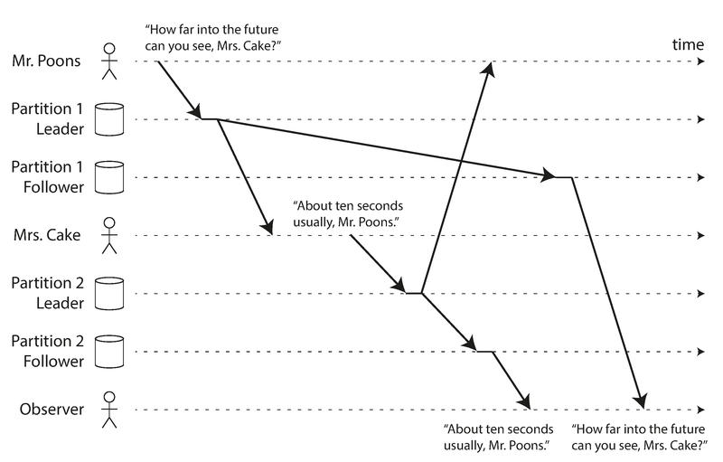

> **图说**：Mr. Poons 问"你能看到多远的未来？"，Mrs. Cake 回答"大约十秒"。但观察者先看到了回答（通过延迟较低的分区），后看到了问题——因果关系颠倒，好像 Mrs. Cake 有预知能力。

**Consistent Prefix Reads（一致前缀读）**保证：如果一系列写入有先后顺序，任何读者看到这些写入时也保持相同的顺序。

这个问题在**分区数据库**中尤其突出——不同分区独立运行，没有全局写入顺序。解决方案：

- 把有因果关系的写入路由到同一个分区
- 使用因果依赖追踪算法（在"Detecting Concurrent Writes"中详述）

> 📎 **关联**：因果顺序问题是 Ch9 的核心话题之一。Ch9 讨论了全序广播（Total Order Broadcast）如何解决这类问题。

#### 2.4 复制延迟的通用解决思路

> **作者观点**：在应用层处理复制延迟问题既复杂又容易出错。更好的方式是让数据库提供更强的保证——这就是**事务（Transaction）**存在的意义。许多分布式数据库放弃了事务，声称"事务太贵"，"最终一致性不可避免"——这种说法过于简化了。Ch7 和 Ch9 会展开讨论。

> 📎 **关联**：Ch7（事务）提供了单节点上的强保证；Ch9（一致性与共识）把这些保证扩展到分布式场景。

---

### 3. 多主复制（Multi-Leader Replication）

单主复制的最大限制：**只有一个节点接受写入**。如果连不上 Leader，就无法写入。

Multi-Leader Replication（多主复制），也叫 master-master 或 active/active——允许多个节点接受写入，每个 Leader 同时是其他 Leader 的 Follower。

#### 3.1 使用场景

**（1）跨数据中心部署**

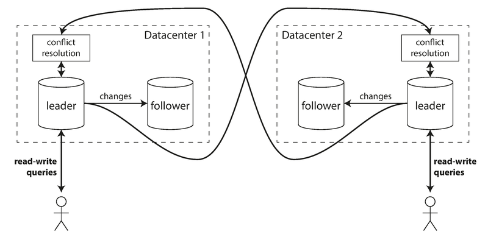

> **图说**：每个数据中心有一个 Leader，内部使用常规的主从复制，数据中心之间 Leader 互相异步复制变更。

| 维度 | 单主 | 多主 |
|------|------|------|
| **写入延迟** | 所有写入必须走 Leader 所在的数据中心，跨数据中心延迟高 | 写入本地数据中心的 Leader，延迟低 |
| **数据中心故障** | 需要 Failover 提升另一个数据中心的 Follower | 每个数据中心独立运行，故障恢复后自动追赶 |
| **网络容错** | 跨数据中心链路故障影响所有写入 | 异步复制容忍临时网络中断 |
| **复杂度** | 低 | 高——必须处理写冲突 |

支持多主复制的工具：Tungsten Replicator (MySQL)、BDR (PostgreSQL)、GoldenGate (Oracle)。

> **常见误用**：在单数据中心内使用多主复制。复杂度代价远超收益——单数据中心内网络延迟本身就很低，单主完全够用。

**（2）离线客户端**

每个设备都是一个"数据中心"——手机日历应用在离线时也能读写，上线后同步。Replication lag 可能长达数小时甚至数天。本质上就是极端情况下的多主复制。CouchDB 就是为这个场景设计的。

**（3）协作编辑**

Google Docs、Etherpad 等实时协作编辑本质上也是多主复制——每个用户的本地副本就是一个"Leader"，编辑通过异步复制传播。如果想零冲突，就必须对文档加锁（退化为单主+事务），但为了快速协作，通常把编辑粒度缩小到单个按键，容忍冲突再解决。

#### 3.2 处理写冲突

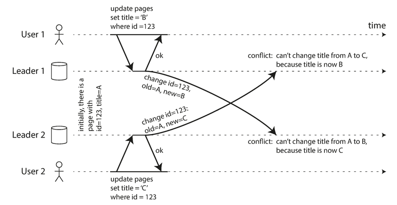

> **图说**：User 1 在 Leader 1 上把标题从 A 改为 B，User 2 在 Leader 2 上把标题从 A 改为 C。两个写入各自成功，但异步复制时发现冲突。

**冲突避免（Conflict Avoidance）**：最简单的策略——确保同一记录的所有写入都路由到同一个 Leader。比如每个用户有一个"home datacenter"，该用户的数据始终通过那个 Leader 写入。但如果需要切换 home datacenter（故障或用户搬迁），冲突避免就失效了。

**收敛到一致状态（Convergent Conflict Resolution）**：所有副本最终必须达到相同的值。方式包括：

| 策略 | 描述 | 风险 |
|------|------|------|
| **Last Write Wins (LWW)** | 给每个写入附加时间戳，取最大时间戳的写入 | **数据丢失**——时间戳靠前的写入被静默丢弃 |
| **按副本 ID 排序** | 高编号副本的写入优先 | 同样导致数据丢失 |
| **值合并** | 如将两个值拼接："B/C" | 取决于业务逻辑 |
| **保留所有冲突** | 记录冲突的所有版本，由应用代码在后续处理 | 增加应用复杂度 |

**自定义冲突解决逻辑**：
- **On Write**：数据库检测到冲突时调用应用注册的回调函数（如 Bucardo 的 Perl 脚本）
- **On Read**：存储所有冲突版本，下次读取时返回给应用，由应用决定如何合并（如 CouchDB）

> **常见误用**：使用 LWW 时以为"最后的写入一定是最新的意图"。实际上，并发写入没有天然的先后顺序，时间戳不可靠（Ch8 会解释为什么），LWW 只是人为强加了一个顺序，代价是**静默丢失数据**。

> **注意**：冲突解决通常在**单行/单文档**级别，而不是整个事务级别。一个事务包含多个写入，每个写入独立做冲突解决，这可能导致事务的原子性被破坏。

#### 3.3 多主复制拓扑

| 拓扑 | 特点 | 弱点 |
|------|------|------|
| **环形（Circular）** | 每个节点只把写入转发给下一个节点 | 单节点故障中断整条链路 |
| **星形（Star）** | 一个根节点转发给所有其他节点 | 根节点故障则全部中断 |
| **全连接（All-to-All）** | 每个节点直接发给所有其他节点 | 容错性最好，但可能因网络延迟导致写入顺序混乱（因果关系违反） |

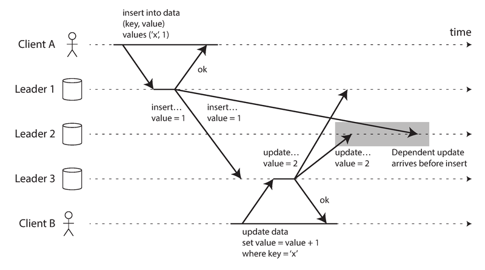

> **图说**：Client A 在 Leader 1 插入一行，Client B 在 Leader 3 更新该行。但 Leader 2 可能先收到更新再收到插入——因果顺序颠倒。时间戳不能解决问题，因为各节点时钟不同步（Ch8）。需要版本向量（Version Vectors）来正确排序。

> 📎 **关联**：因果排序问题在 Ch8（不可靠时钟）和 Ch9（因果一致性与全序广播）中有更深入的讨论。

---

### 4. 无主复制（Leaderless Replication）

第三种方案是**去掉 Leader 的概念**——任何副本都可以直接接受写入。这是最早期的分布式数据系统采用的方式，后来在关系数据库时代被遗忘，直到 Amazon 的 Dynamo 系统（2007 年）让它重新流行。Riak、Cassandra、Voldemort 都受 Dynamo 启发，因此这类系统也叫 **Dynamo-style** 数据库。

> **注意**：Amazon Dynamo 是内部系统，不对外开放。AWS 的 DynamoDB 名字相似但架构完全不同——DynamoDB 是单主复制。

#### 4.1 节点宕机时的读写

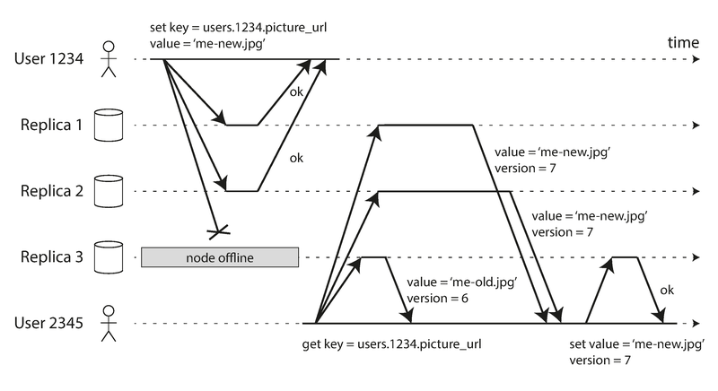

> **图说**：三个副本，User 1234 并行写入所有三个副本，Replica 3 离线所以错过写入。User 2345 并行从三个副本读取——Replica 3 返回旧值 (version 6)，Replica 1/2 返回新值 (version 7)。客户端通过版本号判断最新值，并执行 Read Repair 把新值写回 Replica 3。

**数据修复机制**：

| 机制 | 原理 | 优缺点 |
|------|------|--------|
| **Read Repair** | 客户端读取时发现某副本过时，主动把最新值写回 | 对频繁读取的数据效果好；不常读的数据可能永远不被修复 |
| **Anti-Entropy Process** | 后台进程持续比较副本差异，复制缺失数据 | 不保证写入顺序，可能有较大延迟；不是所有系统都有（如 Voldemort 没有） |

#### 4.2 Quorum（法定人数）机制

核心公式：**`w + r > n`**

- `n` = 副本总数
- `w` = 写入需要确认的节点数
- `r` = 读取需要查询的节点数

只要 `w + r > n`，读到的节点集合和写入成功的节点集合**必然有交集**——至少一个节点同时包含最新数据。

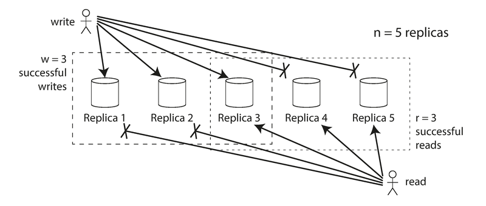

> **图说**：n=5 个副本，w=3 写入成功，r=3 读取成功。写入集合和读取集合在图中用虚线框标出，它们必然重叠。

**常见配置**：

| 配置 | 含义 | 适用场景 |
|------|------|---------|
| n=3, w=2, r=2 | 容忍 1 个节点故障 | 通用配置 |
| n=5, w=3, r=3 | 容忍 2 个节点故障 | 更高可用需求 |
| w=n, r=1 | 写入所有副本才成功，读取只需一个 | 读多写少 |
| w=1, r=n | 写入一个副本即成功，读取所有副本 | 写多读少 |

**请求流程**：读写请求总是发给**所有 n 个副本**，`w` 和 `r` 只决定我们需要等多少个节点响应后才算成功。

#### 4.3 Quorum 的局限性

即使 `w + r > n`，仍可能读到过时数据！可能的原因：

1. **Sloppy Quorum**：`w` 个写入和 `r` 个读取可能落在不同的节点集合上（下文详述）
2. **并发写入**：两个写入同时发生，无法确定先后顺序，只能合并或选一个（LWW 丢数据）
3. **读写并发**：写入正在进行中，只在部分副本上完成，读取可能返回新值也可能返回旧值
4. **写入部分失败**：写入在某些副本成功、某些失败，总成功数 < w，但已成功的副本不会回滚
5. **新值节点故障**：携带新值的节点宕机后从旧数据的副本恢复，有新值的副本数可能降到 w 以下

> **作者观点**：Dynamo-style 数据库本质上是为**可以容忍最终一致性**的场景优化的。`w` 和 `r` 允许你调节读到过时数据的概率，但不要把它们当成绝对保证。要获得读你自己的写、单调读、一致前缀读等更强保证，通常需要事务或共识。

> 📎 **关联**：Ch9 的"Linearizability and quorums"一节会证明，即使 `w + r > n`，Dynamo-style Quorum 也不提供线性一致性。

#### 4.4 Sloppy Quorum 与 Hinted Handoff

当网络分区导致客户端无法连接到某个值"应该住在"的 n 个节点时，面临一个选择：

| 选项 | 行为 | 保证 |
|------|------|------|
| **严格 Quorum** | 无法凑齐 w 或 r 个"正确"节点时返回错误 | 强一致性 |
| **Sloppy Quorum** | 把写入暂存到"不属于"这个值的其他可达节点上 | 写入可用性高，但读取可能暂时读不到最新值 |

**Hinted Handoff（提示移交）**：网络恢复后，暂存数据的节点把数据发送回"正确"的节点。类比：你锁在门外了，先去邻居家借住，找到钥匙后邻居礼貌地请你回自己家。

> **关键认识**：Sloppy Quorum **不是真正的 Quorum**——它只保证数据写入了 w 个节点*某处*，不保证 r 个读取节点能看到。它是**持久性保证**，不是一致性保证。

| 系统 | Sloppy Quorum 默认状态 |
|------|----------------------|
| Riak | 默认开启 |
| Cassandra | 默认关闭 |
| Voldemort | 默认关闭 |

#### 4.5 多数据中心的无主复制

Cassandra 和 Voldemort：`n` 包含所有数据中心的副本，写入发给所有副本，但客户端只等待本地数据中心的 Quorum 确认，跨数据中心复制异步进行。

Riak：`n` 只描述单个数据中心内的副本数，跨数据中心复制类似多主复制，在后台异步进行。

---

### 5. 检测并发写入（Detecting Concurrent Writes）

无主复制（以及多主复制）允许多个客户端同时写入同一个 Key，冲突不可避免。

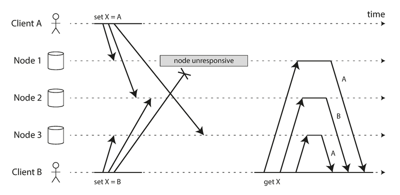

> **图说**：两个客户端同时写入 Key X。三个节点看到的写入顺序不同——Node 1 只看到 A 的写入，Node 2 先 A 后 B，Node 3 先 B 后 A。如果简单覆盖，三个节点最终值不同，永久不一致。

#### 5.1 Last Write Wins (LWW)

给每个写入附加时间戳，保留最大时间戳的写入，丢弃其他。Cassandra 唯一支持的冲突解决方式，Riak 的可选特性。

**问题**：并发写入没有天然的先后关系，时间戳是人为强加的。**LWW 会静默丢数据**——即使客户端报告写入成功。

安全使用 LWW 的唯一方式：**让 Key 只写一次就不再修改**（如用 UUID 作 Key）。

#### 5.2 "Happens-Before" 关系与并发

两个操作 A 和 B 的关系只有三种可能：
1. **A happens before B**：B 知道 A 的存在或依赖 A
2. **B happens before A**：A 知道 B 的存在或依赖 B
3. **A 和 B 并发（Concurrent）**：谁也不知道对方

如果一个操作 happens-before 另一个，后者覆盖前者；如果并发，就需要冲突解决。

#### 5.3 版本号算法：捕获因果关系

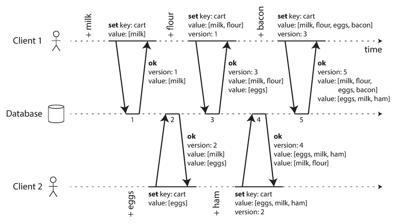

> **图说**：两个客户端并发编辑同一个购物车。每次写入附带版本号，服务端用版本号判断哪些值可以覆盖（有因果关系），哪些必须保留为并发值（siblings）。

**算法步骤**：

1. 服务端为每个 Key 维护一个**版本号（Version Number）**，每次写入时递增
2. 客户端读取时，服务端返回所有未被覆盖的值及最新版本号
3. 客户端写入时，必须附带之前读取时获得的版本号，并合并所有读到的值
4. 服务端收到写入后，可以覆盖所有**版本号 <= 附带版本号**的值，但必须保留**版本号更高**的值（它们是并发的）

**合并 Siblings（并发值）**：

合并逻辑由应用代码负责。购物车场景可以取并集（union），但如果允许删除商品，简单的并集会让已删除的商品"复活"。解决方案：**Tombstone（墓碑标记）**——不真正删除，而是标记为已删除。

> 📎 **关联**：Tombstone 在 Ch3（Hash Indexes 的 Log Compaction）中已经出现过。

> **2026 年更新**：CRDTs（Conflict-free Replicated Data Types，无冲突复制数据类型）是自动化合并的前沿方案。Riak 2.0+ 内置了 CRDT 支持（计数器、集合、映射等），可以自动合并 siblings 而不丢失数据。学术界对 CRDTs 的研究仍然活跃。

#### 5.4 版本向量（Version Vectors）

单副本用一个版本号就够了。但在多副本的无主系统中，需要**每个副本一个版本号**——合在一起就是 **Version Vector（版本向量）**。

每个副本处理写入时递增自己的版本号，同时跟踪从其他副本看到的版本号。通过比较版本向量，可以判断两个操作是因果有序的还是并发的。

Riak 2.0 使用了一种改进变体叫 **Dotted Version Vector**。

> **注意**：Version Vector（版本向量）和 Vector Clock（向量时钟）经常被混用，但它们有细微区别。比较副本状态时，Version Vector 是正确的数据结构。

---

## 重点标记

1. **三种复制架构各有适用场景**：单主最简单、多主适合多数据中心和离线场景、无主适合高可用低延迟的最终一致性场景。
2. **异步复制可能丢数据**：Leader 故障时，已确认但未复制的写入丢失。半同步是常见折中。
3. **Failover 比看起来难得多**：数据丢失、脑裂、外部系统不一致、超时阈值选择，每个都是真实的生产事故来源。
4. **复制延迟不是理论问题**：读你自己的写、单调读、一致前缀读——这三个保证的缺失会直接导致用户困惑和产品 bug。
5. **Quorum 不等于强一致**：`w + r > n` 只是提高了读到最新值的概率，不是保证。Sloppy Quorum 进一步削弱了保证。
6. **LWW 是危险的默认选项**：它通过静默丢弃数据来实现收敛，只有在 Key 不可变（write-once）的场景下才安全。
7. **冲突解决是应用层的责任**：数据库能做的有限（LWW、合并），真正的业务语义需要应用代码来处理。
8. **版本向量是检测并发的正确工具**：不是时间戳，不是向量时钟，而是版本向量。

---

## 自测：你真的理解了吗？

**Q1（Failover 风险）**：你的公司使用 MySQL 主从复制，异步模式，Redis 作为缓存。某天凌晨 Leader 宕机，自动 Failover 把一个 Follower 提升为新 Leader。运维第二天发现有几个用户看到了错误的数据。请分析可能的原因链条，以及你会如何预防这类问题。

**Q2（一致性模型选择）**：你在开发一个社交网络的评论功能。用户发评论后立刻看到自己的评论很重要，但稍微延迟看到别人的评论可以接受。你需要哪种一致性保证？如何在一个 Leader + 多个 Follower 的架构中实现它？

**Q3（Quorum 计算）**：一个 Dynamo-style 数据库配置为 n=5, w=2, r=2。(a) 这个配置满足 `w + r > n` 吗？(b) 最多能容忍几个节点同时宕机而不影响读写？(c) 这个配置在一致性和可用性上有什么取舍？

**Q4（冲突解决）**：你在用多主复制实现一个跨数据中心的库存管理系统。两个数据中心同时对同一商品减库存（DC1 减 3，DC2 减 2），原始库存是 10。使用 LWW 会发生什么？使用值合并应该怎么做？你会推荐什么方案？

**Q5（版本向量）**：两个客户端同时向一个 Riak 集群的同一个 Key 写入不同的值。客户端 A 写入 `{color: "red"}`，客户端 B 写入 `{color: "blue"}`。(a) 这两个写入是什么关系（happens-before 还是并发）？(b) 服务端会怎么处理？(c) 下一个读取这个 Key 的客户端会看到什么？它需要做什么？
