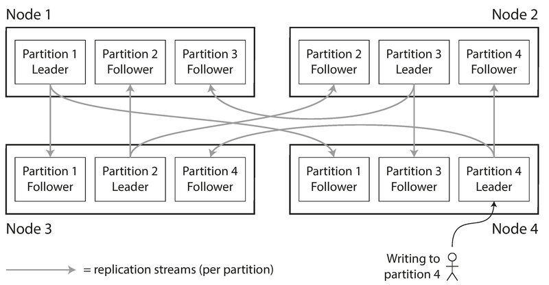
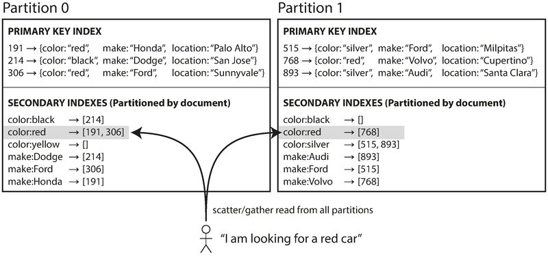
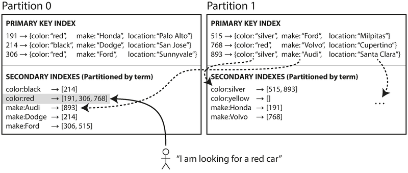
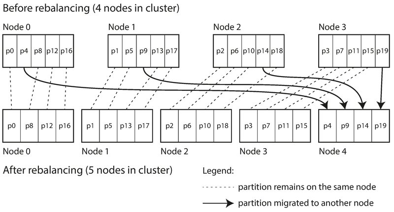
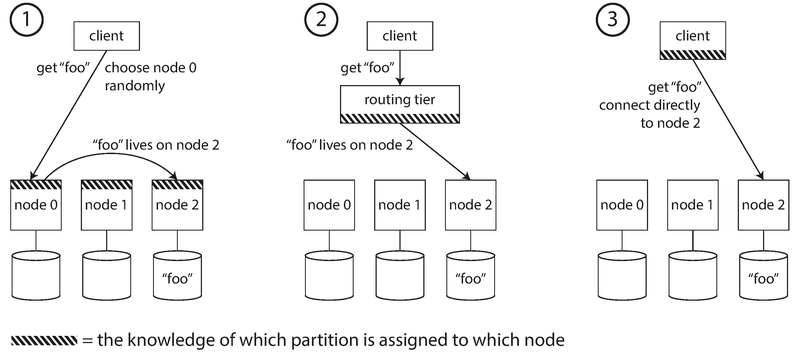
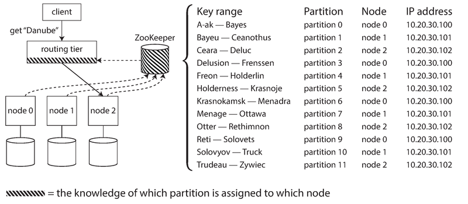

# 模块 06：数据分区

> 对应 Chapter 6: Partitioning
> Part II 分布式数据

---

## 概念地图

- **核心概念** (必须内化): 分区策略（Key Range vs Hash）、热点与数据倾斜、分区再平衡（Rebalancing）
- **实操要点** (动手时需要): 二级索引的两种分区方式（本地索引 vs 全局索引）、请求路由的三种模式、再平衡策略的选择
- **背景知识** (扩展理解): 一致性哈希（Consistent Hashing）、ZooKeeper 在服务发现中的角色、MPP 并行查询执行

---

## 概念讲解

### 1. 为什么需要分区

在 Chapter 5 中我们讨论了复制（Replication）——在多个节点上保存相同数据的副本。但当数据量极大或查询吞吐极高时，仅靠复制不够：我们需要把数据**切分**成更小的子集，分散到多台机器上。这就是**分区（Partitioning）**，也叫 **Sharding（分片）**。

> 📎 **关联**：分区和复制是互补的两个概念。Ch5 讲的是"同一份数据存多处"，本章讲的是"不同数据存不同处"。实际系统中两者通常结合使用。

**直觉建立**：

把分区想象成**行政区划**。一个国家太大了，不可能让一个市政府管理所有事务。于是把国土分成省/市/区——每个区域有自己的政府（节点），管理本区域的居民（数据）。分区的核心目标就是**合理划地盘**，让每个区域的负载差不多。

**术语对照**——不同数据库对"分区"有不同叫法：

| 数据库 | 术语 |
|--------|------|
| MongoDB / Elasticsearch / SolrCloud | Shard |
| HBase | Region |
| Bigtable | Tablet |
| Cassandra / Riak | vnode |
| Couchbase | vBucket |

**分区的核心目标**：将数据和查询负载**均匀分散**到多个节点上。如果分区不均匀，就会出现**数据倾斜（Skew）**——某些分区承受的负载远超其他分区。极端情况下，所有请求都集中到一个分区，这个分区就成了**热点（Hot Spot）**，其余 9 个节点闲置，系统瓶颈就在这一个忙碌的节点上。

#### 分区与复制的结合

分区通常与复制结合使用。每条数据只属于一个分区，但该分区可以在多个节点上存有副本以实现容错。如果使用主从复制模型，每个分区的 Leader 在一个节点上，Follower 在其他节点上。一个节点可以同时是某些分区的 Leader、另一些分区的 Follower。



> **图说**：4 个节点各自承载多个分区。Node 1 是 Partition 1 的 Leader 和 Partition 2、3 的 Follower；Node 3 是 Partition 2 的 Leader。写入 Partition 4 的请求发给 Node 4（Leader），然后复制到其他节点的 Follower 副本。

> 📎 **关联**：关于复制的具体机制（主从、多主、无主），见 Ch5 数据复制。本章后续为简化讨论，暂不考虑复制。

---

### 2. 分区策略：Key Range vs Hash

这是本章最核心的对比。分区策略决定了"哪条数据放在哪个分区"。

#### 2.1 按键范围分区（Key Range Partitioning）

给每个分区分配一段**连续的键范围**。类似百科全书按字母分卷——第 1 卷 A-B，第 2 卷 C-D，第 12 卷 T-Z。知道键的范围边界，就能直接定位到目标分区。

**关键细节**：
- 范围边界**不必均匀划分**——因为数据本身分布不均。比如百科全书中 T 开头的词条可能比 X 开头的多得多
- 每个分区内部的键可以**保持有序**（类似 SSTable），这使得范围查询（Range Scan）非常高效
- 边界可以手动设定，也可以由数据库自动选择

**优势**：**范围查询高效**。比如传感器数据以时间戳为键，查询"2026 年 1 月所有读数"只需扫描一个或少数几个分区。

**劣势**：**容易产生热点**。如果键是时间戳，所有写入都集中在"当前时间段"对应的分区，其他分区空闲。

**解决热点的技巧**：用**组合键**。比如传感器数据不要直接用时间戳作键，而是用 `(sensor_name, timestamp)`。写入先按传感器名分散，每个传感器内部再按时间排序。代价是查询多个传感器的数据时需要对每个传感器分别执行范围查询。

**使用此策略的数据库**：Bigtable、HBase、RethinkDB、MongoDB（2.4 版本之前）。

#### 2.2 按哈希分区（Hash Partitioning）

为避免倾斜和热点，很多系统用**哈希函数**决定键的分区归属。好的哈希函数能把倾斜的数据打散为均匀分布。

工作方式：对键计算哈希值，然后将哈希值的范围（而非原始键的范围）分配给各分区。

```
key = "user_1234"
hash(key) = 0x7a3b...   →  落在 Partition 3 的哈希范围内
```

**优势**：负载分布更均匀，天然避免因键的字典序集中导致的热点。

**劣势**：**范围查询失效**。原本相邻的键被哈希打散到不同分区。在 MongoDB 的哈希分片模式下，任何范围查询都必须发给所有分区。Riak、Couchbase、Voldemort 完全不支持主键范围查询。

> **注意**：不要用编程语言内置的 `hashCode()` 做分区哈希。Java 的 `Object.hashCode()` 和 Ruby 的 `Object#hash` 在不同进程中对同一个键可能返回不同值，不适合做分区决策。MongoDB 用 MD5，Cassandra 用 Murmur3。

#### 2.3 Cassandra 的折中方案：复合主键

Cassandra 支持**复合主键（Compound Primary Key）**——由多列组成。第一列用于哈希决定分区，剩余列在分区内部作为排序键（Concatenated Index）。

```
PRIMARY KEY (user_id, update_timestamp)
```

- `user_id` 被哈希 → 决定分区
- `update_timestamp` 在分区内部有序 → 支持该用户的时间范围查询

这种模型非常适合**一对多关系**：比如社交媒体中一个用户发布了很多条更新，按 `(user_id, timestamp)` 组织，可以高效获取某用户在某时间段内的所有动态。

#### 两种分区策略对比

| 维度 | Key Range 分区 | Hash 分区 |
|------|---------------|-----------|
| **数据分布** | 容易不均匀（依赖键的分布） | 通常更均匀 |
| **范围查询** | 高效（键有序） | 不支持或需 scatter/gather |
| **热点风险** | 高（如时间戳键） | 低（但相同键仍无法避免） |
| **适用场景** | 需要范围扫描的时序数据、区间查询 | 点查询为主的键值存储 |
| **代表系统** | HBase, Bigtable, RethinkDB | Cassandra (hash 部分), Voldemort, Couchbase |
| **再平衡** | 通常动态分裂/合并 | 通常固定数量分区 |

---

### 3. 热点与倾斜工作负载（Celebrity Problem）

哈希分区能减轻热点，但无法完全消除。如果所有读写都针对**同一个键**，哈希后还是同一个分区。

**经典场景**：社交媒体上一个拥有数百万粉丝的名人发了一条动态。这条动态的 ID（或名人的 user_id）成为热点键——大量写入（评论、点赞）和读取都集中于此。

> 这就是所谓的"名人问题（Celebrity Problem）"或"Justin Bieber 问题"——据报道 Twitter 曾有 3% 的服务器专门处理 Justin Bieber 的相关流量。

**目前的解决方案**（应用层负责）：

对已知的热点键，在键的开头或末尾追加一个**随机数**（比如两位数，0-99）。这样一个键被分散到 100 个不同的键上，写入均匀分布到不同分区。

**代价**：
- 读取时需要从 100 个键读取并合并结果
- 需要额外的簿记（Bookkeeping）来追踪哪些键被分散了
- 只对少数热点键使用此技巧，否则得不偿失

> **2026 年更新**：部分新一代分布式数据库（如 TiDB、CockroachDB）已经在自动检测和拆分热点范围方面做了改进，但对于单个超级热点键，应用层仍然需要介入。

---

### 4. 分区与二级索引

前面讨论的分区策略都基于主键（Primary Key）。但如果需要按非主键字段搜索呢？比如在二手车网站上按颜色或品牌筛选——这就需要**二级索引（Secondary Index）**。

二级索引的问题在于它们不能自然地映射到分区上。有两种主要的解决方案：

#### 4.1 按文档分区的索引（Document-Partitioned Index / 本地索引）

每个分区维护自己的二级索引，只覆盖**本分区内的文档**。



> **图说**：Partition 0 包含文档 191、214、306，其本地二级索引 `color:red → [191, 306]` 只包含本分区的红色车辆。Partition 1 也有自己的 `color:red → [768]`。查询"所有红色车"时，必须向所有分区发送查询（scatter/gather），然后合并结果。

**写入简单**：只需更新包含该文档的那一个分区的索引。

**读取代价高**：查询一个索引值时，必须向所有分区发送请求（**Scatter/Gather**），合并所有结果。这容易导致**尾延迟放大（Tail Latency Amplification）**——整体延迟取决于最慢的那个分区。

> 📎 **关联**：关于尾延迟放大，见 Ch1 的百分位延迟（Percentiles in Practice）讨论。

**使用此方案的系统**：MongoDB、Riak、Cassandra、Elasticsearch、SolrCloud、VoltDB。

#### 4.2 按词条分区的索引（Term-Partitioned Index / 全局索引）

构建一个覆盖所有分区数据的**全局索引**，但全局索引本身也需要分区（否则会成为单点瓶颈）。全局索引按**索引的词条值（Term）** 来分区，而非按文档 ID。



> **图说**：全局索引按词条值分区。`color:red → [191, 306, 768]` 包含了所有分区中红色车辆的文档 ID，集中在一个索引分区中。查询"红色车"只需访问持有 `color:red` 的那个索引分区，不需要 scatter/gather。

**读取高效**：查询一个索引值只需访问一个索引分区。

**写入复杂**：写入一个文档可能需要更新多个索引分区（因为文档包含多个字段，每个字段的索引可能在不同分区上）。理想情况下索引应实时更新，但这需要跨分区的分布式事务。实践中，全局二级索引的更新通常是**异步的**。

> Amazon DynamoDB 的全局二级索引通常在几分之一秒内更新，但在基础设施故障时可能有更长的延迟。

**使用此方案的系统**：Amazon DynamoDB、Riak（搜索功能）、Oracle 数据仓库。

> 📎 **关联**：关于分布式事务的难度，见 Ch7 事务和 Ch9 一致性与共识。关于全局索引的更深入实现，见 Ch12。

#### 两种二级索引分区方式对比

| 维度 | 文档分区索引（本地索引） | 词条分区索引（全局索引） |
|------|------------------------|------------------------|
| **索引覆盖范围** | 每个分区只索引本地文档 | 覆盖所有分区的文档 |
| **写入代价** | 低——只更新一个分区 | 高——可能更新多个索引分区 |
| **读取代价** | 高——scatter/gather 所有分区 | 低——只查询一个索引分区 |
| **一致性** | 写入即一致 | 通常异步更新，有短暂延迟 |
| **适用场景** | 写多读少、对延迟要求不极致 | 读多写少、需要快速精确查找 |

> **常见误用**：在文档分区索引模式下，开发者以为查询二级索引只会命中一个分区。实际上，除非你精心设计了分区键使得相关文档都在同一个分区中，否则每次二级索引查询都是 scatter/gather，延迟不可控。

---

### 5. 分区再平衡（Rebalancing Partitions）

数据库运行过程中，情况会发生变化：查询量增长需要加 CPU、数据量增长需要加磁盘、节点故障需要其他节点接管。这些变化都需要把数据和请求从一个节点迁移到另一个——这就是**再平衡（Rebalancing）**。

**再平衡的基本要求**：
1. 再平衡后，负载应在节点间**公平分配**
2. 再平衡过程中，数据库应**继续服务**读写请求
3. 迁移的数据量应**尽可能少**，以减少网络和磁盘 I/O

#### 5.1 反面教材：hash mod N

最直觉的想法：`hash(key) mod N`，N 是节点数。但这是**错误的做法**。

当 N 变化时（加减节点），大部分键的 `mod N` 结果都会改变，意味着几乎所有数据都要搬家。例如：
- `hash(key) = 123456`
- 10 节点时 → 节点 6（123456 mod 10 = 6）
- 11 节点时 → 节点 3（123456 mod 11 = 3）
- 12 节点时 → 节点 0（123456 mod 12 = 0）

这样频繁的数据迁移代价极高，所以**不要用 hash mod N**。

#### 5.2 固定数量分区（Fixed Number of Partitions）

**思路**：创建远多于节点数的分区（比如 10 个节点，创建 1000 个分区），每个节点分配多个分区。新增节点时，从现有节点"偷"一些分区过来。



> **图说**：集群从 4 个节点扩展到 5 个节点。20 个分区（p0-p19）重新分配，新节点 Node 4 从每个旧节点各接管几个分区（如 p4、p9、p14、p19）。虚线表示分区留在原节点，实线表示分区迁移到新节点。

**关键特性**：
- 分区总数不变，键到分区的映射不变——只改变分区到节点的映射
- 可以根据硬件能力分配不同数量的分区（强机器多分配）
- 迁移过程中旧映射继续服务，迁移完成后切换

**难点**：分区数在初始化时就要选好。选太少，单个分区过大，再平衡和故障恢复慢；选太多，管理开销大。数据量变化大时很难选到"刚好"的数字。

**使用此策略的系统**：Riak、Elasticsearch、Couchbase、Voldemort。

#### 5.3 动态分区（Dynamic Partitioning）

**思路**：当一个分区增长到阈值（如 HBase 默认 10GB），自动分裂为两个；当数据量缩小到阈值以下，与相邻分区合并。类似 B-Tree 的节点分裂/合并。

**优势**：分区数量自动适应数据总量——数据少时分区少（开销小），数据多时分区多（粒度细）。

**注意事项**：空数据库起初只有一个分区，所有写入由单节点处理——冷启动问题。HBase 和 MongoDB 支持**预分裂（Pre-splitting）**，在空数据库上预先创建一批分区，但需要你预知键的分布。

动态分区不仅适用于 Key Range 分区，也适用于 Hash 分区（MongoDB 2.4+ 同时支持）。

**使用此策略的系统**：HBase、RethinkDB、MongoDB（2.4+）。

#### 5.4 按节点比例分区（Partitioning Proportional to Nodes）

**思路**：固定每个节点拥有的分区数（如 Cassandra 默认 256 个 / 节点）。新节点加入时，随机选择现有分区进行分裂，取走一半数据。

- 节点数不变时，每个分区大小随数据量增长
- 加节点时，分区变小——因为总分区数增加了
- 数据量大→通常需要更多节点→分区大小保持稳定

**使用此策略的系统**：Cassandra、Ketama。

> Cassandra 3.0 引入了改进的再平衡算法，避免随机分裂导致的不均匀。

#### 三种再平衡策略对比

| 策略 | 分区数变化 | 适用场景 | 代表系统 |
|------|-----------|---------|---------|
| **固定数量分区** | 不变（建库时决定） | 数据量变化不大、Hash 分区 | Riak, ES, Couchbase |
| **动态分区** | 随数据量自动增减 | 数据量变化大、Key Range 分区 | HBase, MongoDB |
| **按节点比例** | 随节点数增减 | 弹性集群、频繁扩缩容 | Cassandra |

#### 5.5 自动 vs 手动再平衡

再平衡可以是全自动的，也可以需要人工确认。

**全自动再平衡**的风险：与自动故障检测结合时可能引发**级联故障**。例如：一个节点因过载而响应变慢 → 系统误判其"已死" → 自动触发再平衡，将其分区迁走 → 迁移流量进一步加重该节点和网络负担 → 雪崩。

**作者观点**：在再平衡环节保留人工介入（human in the loop）是明智的。虽然慢一些，但能避免自动化带来的"运维惊喜"。

> Couchbase、Riak、Voldemort 采用折中方案：系统自动生成再平衡建议，但需管理员确认后才执行。

---

### 6. 请求路由（Request Routing）

数据分好了区，放在不同节点上。但客户端怎么知道该连哪个节点？这是**服务发现（Service Discovery）** 问题——不限于数据库，任何分布式系统都面临。



> **图说**：三种路由方式。方式 1：客户端随机连一个节点，如果不是目标分区所在节点则转发。方式 2：客户端连接路由层（Routing Tier），由路由层决定转发给哪个节点。方式 3：客户端自身知道分区映射，直接连正确的节点。斜线纹理表示"持有分区到节点映射信息"的组件。

三种方式各有取舍：

| 方式 | 描述 | 优点 | 缺点 |
|------|------|------|------|
| **方式 1：节点转发** | 客户端连任意节点，节点不拥有该分区则转发 | 简单，无需额外组件 | 多一跳延迟 |
| **方式 2：路由层** | 独立的路由层（分区感知的负载均衡器） | 客户端逻辑简单 | 路由层本身可能成为瓶颈/单点 |
| **方式 3：客户端感知** | 客户端维护分区映射，直连目标节点 | 最低延迟 | 客户端复杂度高 |

**核心挑战**：无论哪种方式，做路由决策的组件必须知道**分区到节点的映射关系**，而且这个映射在再平衡后会变化。所有参与者必须对映射达成一致——否则请求会被发错地方。

#### ZooKeeper 方案

很多分布式系统依赖独立的**协调服务**（如 ZooKeeper）来维护集群元数据。



> **图说**：ZooKeeper 维护分区到节点的权威映射（如 Key Range "A-ak ~ Bayes" → partition 0 → node 0 → 10.20.30.100）。路由层从 ZooKeeper 订阅变更通知。客户端请求 key "Danube" → 路由层查映射 → 转发给 node 2。分区所有权变更时，ZooKeeper 通知路由层更新。

| 系统 | 路由方案 |
|------|---------|
| **HBase, SolrCloud, Kafka** | 使用 ZooKeeper 跟踪分区分配 |
| **LinkedIn Espresso** | 使用 Helix（基于 ZooKeeper）+ 路由层 |
| **MongoDB** | 自有 Config Server + mongos 路由层 |
| **Cassandra, Riak** | **Gossip 协议**——节点间互相传播集群状态，无需外部协调服务（方式 1） |
| **Couchbase** | 路由层 moxi 从集群节点学习路由变更 |

> 📎 **关联**：关于分布式系统中"达成一致"的难度——这本质上是共识（Consensus）问题，详见 Ch9。

> **2026 年更新**：Kafka 从 3.x 版本开始引入 KRaft 模式，逐步用内置的 Raft 共识协议替代对 ZooKeeper 的依赖。这反映了行业趋势——减少对外部协调服务的依赖，将元数据管理内置到系统中。Cassandra 也在探索类似的内置共识方案。

#### 并行查询执行（Parallel Query Execution）

以上讨论集中在简单的键值查询和 scatter/gather。但在**MPP（Massively Parallel Processing）** 分析型数据库中，查询远比这复杂——涉及多表 JOIN、过滤、分组、聚合。MPP 查询优化器会把复杂查询拆解为多个执行阶段，分发到不同节点并行执行。

> 📎 **关联**：并行查询执行技术详见 Ch10 批处理。

---

## 重点标记

1. **分区的目的是可扩展性**：把数据和查询负载分散到多个节点，实现水平扩展。分区与复制是正交的两个维度，通常结合使用。

2. **Key Range 分区支持范围查询但容易出热点，Hash 分区分布均匀但无法范围查询**——没有完美方案，只有适合场景的权衡。Cassandra 的复合主键是一种优雅的折中。

3. **热点无法完全靠分区策略解决**：当所有流量集中于同一个键时（名人问题），只能在应用层拆分键（追加随机数），并承担读取合并的代价。

4. **二级索引的两种分区方式是经典的读写权衡**：本地索引写快读慢（scatter/gather），全局索引读快写慢（跨分区更新）。选择取决于你的读写比例。

5. **永远不要用 `hash(key) mod N` 做分区**：节点数变化时几乎所有数据要搬家。正确做法是固定分区数或动态分裂。

6. **自动再平衡 + 自动故障检测 = 危险组合**：可能引发级联故障。在再平衡环节保留人工确认是工程上的审慎选择。

7. **请求路由本质是服务发现问题**：三种方式（节点转发/路由层/客户端感知）各有取舍。ZooKeeper 是主流的协调服务方案，但趋势是内置共识（如 Kafka KRaft）。

---

## 自测：你真的理解了吗？

**Q1**：你在设计一个 IoT 平台，需要存储来自 10 万个传感器的时序数据。每个传感器每秒产生一条数据，键是时间戳。你选择了 Key Range 分区。上线后发现所有写入都集中在一个节点上，其余节点几乎空闲。为什么会这样？你会怎么修改分区键的设计？

<details>
<summary>参考思路</summary>

因为以时间戳为键，所有"当前时刻"的写入都落在同一个分区（最新的时间范围）。解决方案是用组合键 `(sensor_id, timestamp)`——先按传感器 ID 分散写入到不同分区，每个传感器内部再按时间排序。代价是查询"所有传感器在某时间段的数据"需要对每个传感器分别执行范围查询。也可以考虑在时间戳前加传感器 ID 的哈希前缀。

</details>

**Q2**：你的电商平台使用了文档分区的二级索引（本地索引），按商品 ID 分区。用户搜索"红色连衣裙"时，你发现 P99 延迟很高。运维排查后发现大部分分区响应在 5ms 内，但有一个分区稳定在 200ms+。这是什么原因？换成全局索引（Term-Partitioned Index）能解决这个问题吗？代价是什么？

<details>
<summary>参考思路</summary>

这是 scatter/gather 导致的**尾延迟放大**——文档分区索引必须查询所有分区，最终延迟取决于最慢的那个分区（200ms+的那个可能是热点或磁盘 I/O 繁忙）。换成全局索引可以解决此问题——查询 `color:red AND type:dress` 只需访问持有这些词条的索引分区，不需要 scatter/gather。但代价是：1) 写入变慢，因为添加一个商品可能需要更新多个索引分区；2) 索引更新通常是异步的，搜索结果可能有短暂的不一致。

</details>

**Q3**：你的团队正在运营一个使用固定 100 个分区的 Elasticsearch 集群（10 个节点，每节点 10 个分区）。现在数据量从 100GB 增长到了 10TB，你需要扩容到 50 个节点。你会遇到什么问题？如果当初选择了动态分区策略，情况会有什么不同？

<details>
<summary>参考思路</summary>

固定 100 个分区、50 个节点意味着每个节点只分到 2 个分区。每个分区约 100GB，单个分区过大会导致：1) 再平衡和故障恢复非常慢（需要搬运整个 100GB 分区）；2) 查询无法细粒度并行化。而且 100 个分区是上限——最多只能扩展到 100 个节点，超过就有节点空闲。如果用动态分区，分区会随数据量自动分裂——10TB 的数据可能被分成几千个小分区（每个几 GB），既方便再平衡，也能充分利用 50 个节点的并行能力。

</details>

**Q4**：一个社交平台的后端使用 Hash 分区。某天一个有 5000 万粉丝的明星发了一条动态，瞬间产生大量对该动态 ID 的写入（点赞、评论）。系统设计者决定对这个热点键追加两位随机数（00-99）来分散写入。请问：读取该动态的总点赞数时，需要做什么额外操作？这种方案是否适合对所有键都使用？为什么？

<details>
<summary>参考思路</summary>

读取总点赞数时需要查询 100 个派生键（如 `post_id_00` 到 `post_id_99`），分别读取每个键的计数，然后在客户端求和——相当于用 100 倍的读取开销换取写入的分散。不适合对所有键都使用，因为：1) 绝大多数键的写入量很低，不需要分散；2) 对所有键都做分散会让所有读取都变成 100 倍开销；3) 需要额外的元数据来记录哪些键被拆分了。只应对已知的少数热点键使用此技巧。

</details>

**Q5**：你的集群使用了全自动再平衡策略。某天凌晨，一个节点因为 GC（垃圾回收）导致响应超时 30 秒。自动故障检测判定该节点"已死"，触发了再平衡。结果整个集群性能急剧下降，持续了两个小时。请分析这个级联故障是怎么发生的，并提出改进方案。

<details>
<summary>参考思路</summary>

级联故障过程：1) 节点 A 因 GC 暂停 30 秒 → 2) 其他节点判定 A 已死 → 3) 自动再平衡开始将 A 的分区迁移到其他节点 → 4) 大量数据在网络上传输，增加了其他节点和网络的负担 → 5) A 的 GC 结束后恢复正常，但再平衡已在进行中 → 6) 其他节点因承担额外的迁移 I/O 而变慢，可能也被判定为"响应超时" → 7) 进一步触发再平衡，雪崩式恶化。改进方案：1) 将再平衡改为半自动——系统提出建议，管理员确认后执行；2) 增大故障检测的超时阈值，避免把短暂的 GC 暂停误判为节点死亡；3) 限制再平衡的并发度和带宽，避免迁移流量冲击正常服务。

</details>
