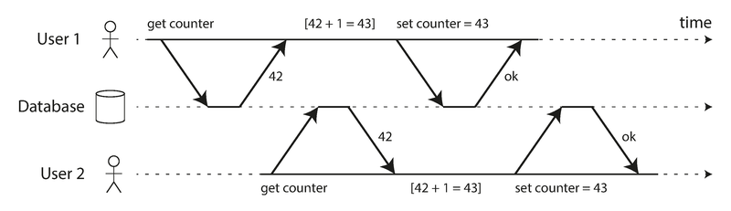
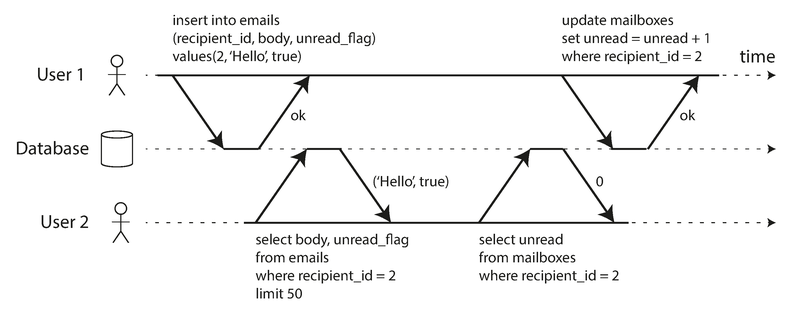
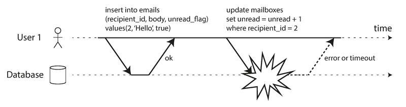
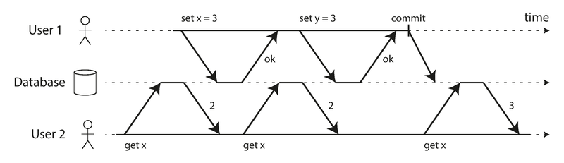
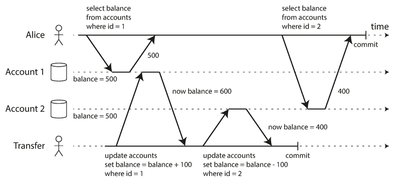
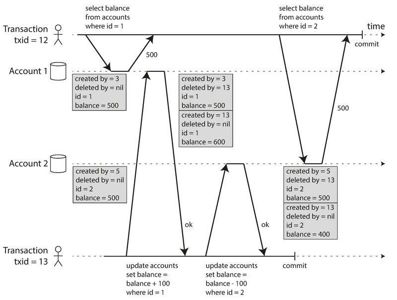
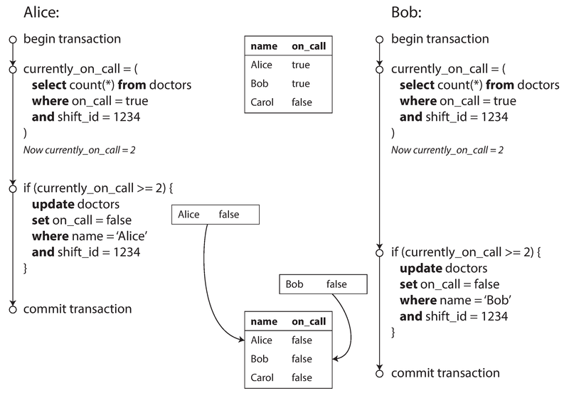
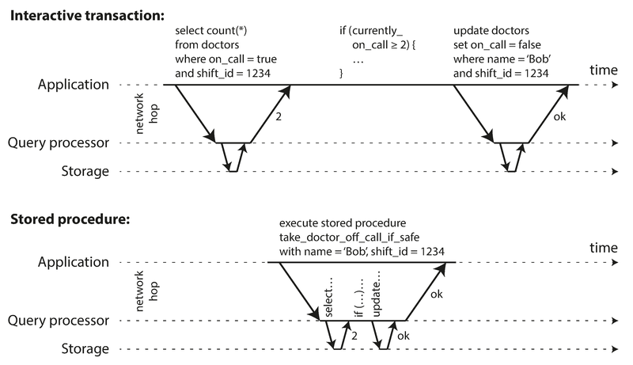
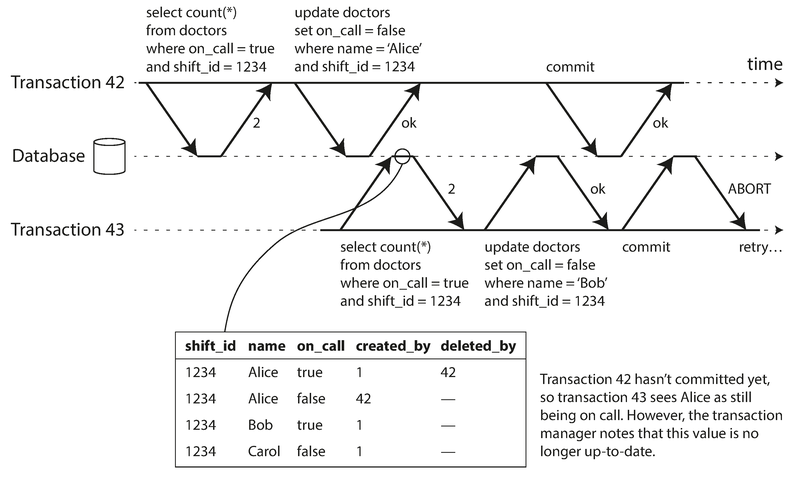
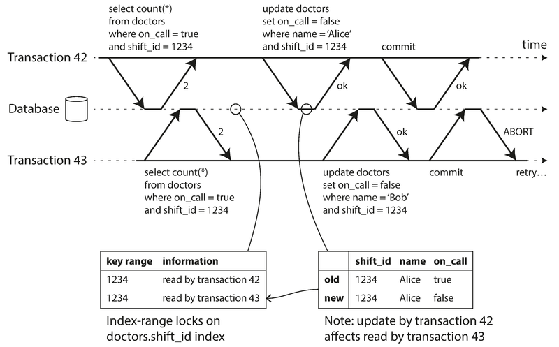

# 模块 07：事务

> 对应 Chapter 7: Transactions
> Part II 分布式数据

---

## 概念地图

- **核心概念** (必须内化): ACID 四个字母各自的真正含义、弱隔离级别的层次递进（Read Committed → Snapshot Isolation → Serializable）、写偏斜（Write Skew）与幻读（Phantom）的模式识别
- **实操要点** (动手时需要): 选择合适的隔离级别、防止丢失更新的四种手段（原子操作 / 显式锁 / 自动检测 / CAS）、`SELECT FOR UPDATE` 的使用场景
- **背景知识** (扩展理解): MVCC 的可见性规则、两阶段锁（2PL）的共享/排他锁机制、SSI 的乐观并发控制原理

---

## 概念讲解

### 1. 事务（Transaction）为什么存在

在数据系统中，很多事情会出错：硬件故障、应用崩溃、网络中断、并发写入冲突、读到半更新的数据……

事务是数据库提供的一种抽象：**把多次读写操作打包成一个逻辑单元**——要么全部成功（commit），要么全部失败（abort/rollback）。失败后应用可以安全重试。

> **作者观点**：围绕事务有两种极端说法——"事务是可扩展性的对立面"和"严肃应用必须用事务"——**都是夸张**。事务有优势也有局限，需要理解它们的具体保障和代价。

### 2. ACID 的真正含义

ACID 由 Theo Harder 和 Andreas Reuter 在 1983 年提出，目的是为容错机制建立精确术语。但实际上，不同数据库对 ACID 的实现差异巨大——**ACID 在很大程度上已变成了营销术语**。

> **常见误用**：很多人以为"用了 ACID 数据库就不会有并发问题"。这是错误的——即使是号称 ACID 的数据库（如 Oracle），默认隔离级别也不是 Serializable，照样会出现竞态条件。

（不满足 ACID 的系统有时被称为 BASE——Basically Available, Soft state, Eventually consistent。作者认为 BASE 的定义比 ACID 更模糊——"唯一合理的定义就是'不是 ACID'"。）

#### 2.1 原子性（Atomicity）

**ACID 中的 Atomicity 不是关于并发的**——并发是 Isolation 管的事。

Atomicity 的意思是：如果一个事务包含多次写操作，执行到中途出错了（进程崩溃、网络断开、磁盘满了），数据库必须**丢弃或撤销该事务已完成的所有写入**。

核心保障：**可中止性（Abortability）**——事务被中止后，应用确信什么都没改，可以安全重试。

> **作者观点**：也许"可中止性"比"原子性"更准确，但"原子性"已经是约定俗成的说法。

#### 2.2 一致性（Consistency）

"一致性"这个词在计算机领域**至少有四种含义**：

| 语境 | 含义 |
|------|------|
| Ch5 复制一致性 | 副本之间的最终一致性 |
| 一致性哈希 | 分区再平衡策略 |
| CAP 定理中的 C | 线性一致性（Linearizability） |
| **ACID 中的 C** | **应用定义的不变量（Invariants）始终满足** |

ACID 中的 Consistency 是说：数据库中有些不变量必须始终为真（比如会计系统中借贷平衡）。如果事务开始时不变量成立，事务中的写操作保持不变量，那么事务结束后不变量仍然成立。

**关键洞察**：Atomicity、Isolation、Durability 是数据库的属性，而 **Consistency 是应用的属性**。数据库不能阻止你写入违反业务规则的数据——这是应用的责任。

> **作者观点**：字母 C 其实不属于 ACID——它被加进去是为了"让缩写好听"。

#### 2.3 隔离性（Isolation）



> **图说**：User 1 和 User 2 同时读取计数器值 42，各自加 1 后写回 43。结果计数器从 42 变成了 43 而不是 44——一次递增丢失了。

隔离性意味着**并发执行的事务互不干扰**。经典教科书将其形式化为可串行化（Serializability）：每个事务可以假装自己是数据库上唯一运行的事务，最终效果等同于串行执行。

**但实际上，Serializable 隔离级别很少被使用**，因为有性能代价。Oracle 11g 甚至不实现真正的 Serializable——它标记为 "serializable" 的其实是快照隔离（Snapshot Isolation），提供的保障弱于 Serializability。

#### 2.4 持久性（Durability）

事务一旦成功提交，写入的数据不会丢失——即使硬件故障或数据库崩溃。

| 实现方式 | 说明 |
|----------|------|
| 单节点 | 写入非易失性存储（硬盘/SSD） + WAL（Write-Ahead Log） |
| 复制数据库 | 数据成功复制到若干节点后才报告提交成功 |

> **作者观点**：**完美的持久性不存在**。磁盘可能损坏、SSD 可能在断电后丢数据、所有副本可能被关联故障同时击倒。持久性只有各种"风险降低技术"——写磁盘、远程复制、备份——应该组合使用。

> 📎 **关联**：持久性和复制的关系在 Ch5（Replication）中深入讨论。

---

### 3. 单对象操作 vs 多对象操作

#### 3.1 单对象写入（Single-Object Writes）

即使只涉及单个对象，也需要原子性和隔离性保障——比如写入一个 20 KB 的 JSON 文档写到一半网络断了怎么办？

存储引擎几乎普遍在**单个对象级别**提供原子性（用日志做崩溃恢复）和隔离性（用对象锁），以及原子操作（如 increment）和比较-设置（Compare-and-Set）。

> **常见误用**：有些数据库把这些单对象操作营销为"轻量级事务"甚至"ACID"——**这是误导**。真正的事务是把多个对象上的多个操作打包成一个执行单元。

#### 3.2 为什么需要多对象事务



> **图说**：User 1 插入了一封新邮件但还没更新未读计数器。User 2 此时查询，看到了新邮件但未读计数器还是 0——数据不一致。



> **图说**：如果更新未读计数器时发生错误，原子事务会回滚之前的邮件插入操作，避免数据不一致。

需要多对象事务的典型场景：

- **外键关联**：关系模型中，插入互相引用的记录必须保持外键有效
- **反规范化数据**：文档数据库中，更新反规范化的冗余字段需要同时更新多个文档
- **二级索引**：修改值时，相关索引也必须同步更新

#### 3.3 错误处理与重试

事务的一个关键特性是可以中止并安全重试。但重试也不是万能的：

| 重试陷阱 | 说明 |
|----------|------|
| 网络成功但确认丢失 | 事务其实已经成功了，重试会导致重复执行——需要应用级幂等机制 |
| 过载导致的错误 | 重试会加剧过载——应使用指数退避 |
| 永久性错误 | 约束违反等错误，重试毫无意义 |
| 事务有副作用 | 发邮件等副作用不会随事务回滚——需要两阶段提交（2PC） |
| 客户端崩溃 | 重试中客户端挂了，待写数据丢失 |

> 📎 **关联**：两阶段提交（2PC）在 Ch9 中详细讨论。

---

### 4. 弱隔离级别（Weak Isolation Levels）

如果两个事务不触碰相同的数据，它们可以安全并行。并发问题只在一个事务读取另一个事务正在修改的数据时，或者两个事务同时修改相同数据时才出现。

Serializable 隔离有性能代价，因此实践中广泛使用**弱隔离级别**——它们防止一些但不是所有的并发问题。

> **作者观点**：弱隔离级别导致的并发 bug 不是理论问题——它们造成过真实的资金损失、审计调查和客户数据损坏。"用 ACID 数据库处理金融数据"的建议**忽略了重点**：很多 ACID 数据库默认使用弱隔离。

#### 4.1 读已提交（Read Committed）

最基本的事务隔离级别，提供两个保障：

**保障一：没有脏读（No Dirty Reads）**



> **图说**：User 1 设置 x = 3，但在 commit 之前，User 2 读 x 仍然返回旧值 2。只有 User 1 提交后，User 2 才能看到新值 3。

为什么要防止脏读？
- 读到部分更新的数据会让用户困惑，也可能导致其他事务做出错误决策
- 如果事务中止，脏读意味着你看到了从未真正提交到数据库的数据

**保障二：没有脏写（No Dirty Writes）**



> **图说**：Alice 和 Bob 同时买同一辆车。由于脏写，listings 表中买家变成了 Bob，但 invoices 表中收款人变成了 Alice——两条数据来自不同事务的写入混在一起了。

防止脏写的方法：使用行级锁——写入时先获取锁，事务提交或中止后才释放。

**实现 Read Committed 的方式**：
- **脏写**：通过行级锁防止
- **脏读**：**不用读锁**（因为长写事务会阻塞所有读），而是数据库同时记住旧值和新值——事务进行中，其他读取者看到旧值；提交后切换到新值

Read Committed 是 Oracle 11g、PostgreSQL、SQL Server 2012 等数据库的**默认隔离级别**。

#### 4.2 快照隔离与可重复读（Snapshot Isolation / Repeatable Read）

Read Committed 看似已经够用了，但还有问题。


> **图说**：Alice 有两个账户各 $500，总共 $1,000。一笔转账把 $100 从账户 2 转到账户 1。Alice 在转账过程中查看余额，先看到账户 1 余额 $500（转入还没到），再看到账户 2 余额 $400（转出已完成）——总和变成了 $900，好像少了 $100。

这叫做**读偏斜（Read Skew）**，也叫不可重复读（Nonrepeatable Read）。在 Read Committed 下这是"合法"的——每次读都读到已提交的值。

对大多数场景（比如刷新页面就好了）读偏斜是可以忍受的。但有两类场景无法容忍：

| 场景 | 问题 |
|------|------|
| **备份** | 备份过程中数据一直在变，不同部分来自不同时间点，恢复后数据永久不一致 |
| **分析查询/完整性检查** | 扫描大量数据时，不同部分来自不同时间点，结果无意义 |

**快照隔离（Snapshot Isolation）** 的核心思想：每个事务从数据库的一个**一致快照**读取——事务开始时已提交的所有数据，即使后续被其他事务修改，当前事务看到的仍然是快照时间点的数据。

快照隔离被 PostgreSQL、MySQL (InnoDB)、Oracle、SQL Server 等主流数据库支持。

#### 4.3 MVCC：快照隔离的实现

快照隔离的关键性能原则：**读者不阻塞写者，写者不阻塞读者**。

实现方式是**多版本并发控制（Multi-Version Concurrency Control, MVCC）**——数据库为每个对象保留多个已提交版本，不同事务根据需要看到不同时间点的版本。



> **图说**：PostgreSQL 的 MVCC 实现。每行有 `created_by`（创建该行的事务 ID）和 `deleted_by`（删除该行的事务 ID）字段。更新操作在内部转化为"删除旧行 + 创建新行"。Transaction 12 读取 Account 2 时看到 $500（因为 Transaction 13 的修改不可见），Transaction 13 则创建了新行（$400）并标记旧行为已删除。

**可见性规则**（事务开始时确定可见数据）：

1. 事务开始时列出所有进行中（未提交未中止）的事务——它们的写入一律忽略
2. 已中止事务的写入一律忽略
3. 事务 ID 更大（即在当前事务之后启动）的事务写入一律忽略，不管是否已提交
4. **其余所有写入可见**

简化版：一个对象可见当且仅当——
- 创建它的事务在读者事务开始前已经提交
- 它没有被删除，或者删除它的事务在读者事务开始时还未提交

> **常见误用**：Read Committed 和 Snapshot Isolation 都用 MVCC，但粒度不同——Read Committed 对每个查询使用单独快照，Snapshot Isolation 对整个事务使用同一快照。

#### 4.4 "Repeatable Read" 的命名混乱

快照隔离是有用的隔离级别，但不同数据库叫法不同：

| 数据库 | 对快照隔离的叫法 |
|--------|------------------|
| Oracle | Serializable（实际是快照隔离，**不是真正的 Serializable**） |
| PostgreSQL | Repeatable Read |
| MySQL (InnoDB) | Repeatable Read |
| IBM DB2 | Repeatable Read（**实际指 Serializable**） |

混乱的原因：SQL 标准制定于 1975 年，当时快照隔离尚未发明，标准中定义的 Repeatable Read 与快照隔离只是"看起来相似"。

> **作者观点**：结果就是**没人真正知道 Repeatable Read 是什么意思**。

---

### 5. 防止丢失更新（Preventing Lost Updates）

前面讨论的 Read Committed 和 Snapshot Isolation 主要关注只读事务在并发写入时能看到什么。接下来关注**两个事务并发写入**的问题。

**丢失更新问题（Lost Update）** 发生在读-修改-写回（read-modify-write）场景：两个事务都读取某值、修改、写回——后写的覆盖先写的，先写的修改丢失。

典型场景：
- 递增计数器 / 更新账户余额
- 修改 JSON 文档中的某个字段（读取、解析、修改、写回）
- 两个用户同时编辑 wiki 页面

四种防止丢失更新的方法：

#### 方法一：原子写操作（Atomic Write Operations）

```sql
UPDATE counters SET value = value + 1 WHERE key = 'foo';
```

让数据库在一条语句中完成读-修改-写回，通常是最佳方案。实现方式：对象上加排他锁（cursor stability），或强制所有原子操作在单线程执行。

> **常见误用**：ORM 框架很容易让你写出不安全的 read-modify-write 代码，而不是用数据库提供的原子操作。

#### 方法二：显式锁（Explicit Locking）

当业务逻辑不能用一条原子操作表达时，应用显式加锁：

```sql
BEGIN TRANSACTION;

SELECT * FROM figures
  WHERE name = 'robot' AND game_id = 222
  FOR UPDATE;                          -- 锁定返回的所有行

-- 检查移动是否合法，然后更新
UPDATE figures SET position = 'c4' WHERE id = 1234;

COMMIT;
```

`FOR UPDATE` 告诉数据库锁定查询返回的所有行。

> **常见误用**：容易忘记加锁——忘在某个代码路径加 `FOR UPDATE` 就引入了竞态条件。

#### 方法三：自动检测丢失更新（Automatically Detecting Lost Updates）

允许 read-modify-write 并行执行，事务管理器检测到丢失更新时自动中止事务并重试。

| 数据库 | 是否自动检测丢失更新 |
|--------|---------------------|
| PostgreSQL (Repeatable Read) | 是 |
| Oracle (Serializable) | 是 |
| SQL Server (Snapshot Isolation) | 是 |
| **MySQL/InnoDB (Repeatable Read)** | **否** |

> **常见误用**：MySQL/InnoDB 的 Repeatable Read **不会自动检测丢失更新**。有些学者认为数据库必须防止丢失更新才能算提供快照隔离——按这个定义 MySQL 不算。

#### 方法四：比较-设置（Compare-and-Set, CAS）

```sql
-- 可能安全也可能不安全，取决于数据库实现
UPDATE wiki_pages SET content = 'new content'
  WHERE id = 1234 AND content = 'old content';
```

只有当值没有被并发修改时更新才生效。**但要注意**：如果数据库的 WHERE 子句从旧快照读取，CAS 可能无法防止丢失更新——使用前请确认你的数据库实现是安全的。

#### 复制场景下的冲突解决

在多主（Multi-Leader）或无主（Leaderless）复制的数据库中，数据可以在多个节点上并发修改。锁和 CAS 假设存在"单一最新副本"——在这种场景下不适用。

替代方案：
- 允许并发写创建冲突版本（siblings），之后通过应用代码或特殊数据结构合并
- **可交换的原子操作**（如计数器递增、集合添加）——不管在哪个副本上以什么顺序应用都能得到相同结果（Riak 2.0 数据类型就是这个原理）

> **常见误用**：Last Write Wins (LWW) 冲突解决策略会丢失更新——不幸的是这是很多复制数据库的**默认策略**。

> 📎 **关联**：复制中的冲突检测和解决在 Ch5（Replication）中详细讨论。

---

### 6. 写偏斜与幻读（Write Skew and Phantoms）

脏写和丢失更新都涉及两个事务写同一个对象。**写偏斜（Write Skew）** 是更微妙的情况——两个事务读相同的数据，然后各自更新**不同的对象**。

#### 6.1 医生值班的例子



> **图说**：Alice 和 Bob 是当前值班的两名医生。两人同时请假，各自的事务先查询"有几位医生在岗？"——都得到 2，于是都认为安全，各自把自己标为不在岗。结果没人值班了——违反了"至少一人值班"的业务约束。

写偏斜是丢失更新的**泛化**：

| 异常类型 | 两个事务写的对象 |
|----------|-----------------|
| 脏写 / 丢失更新 | **同一个**对象 |
| **写偏斜** | **不同的**对象 |

**写偏斜无法被快照隔离自动防止**——PostgreSQL 的 Repeatable Read、MySQL/InnoDB 的 Repeatable Read、Oracle 的 Serializable、SQL Server 的 Snapshot Isolation 都不能自动检测写偏斜。

应对方案（从好到差）：

1. **使用 Serializable 隔离级别**（最佳方案）
2. **显式锁定相关行**（`SELECT ... FOR UPDATE`）
3. 数据库约束（如果约束涉及多对象，大多数数据库支持有限）
4. 触发器 / 物化视图（复杂且容易出错）

```sql
-- 防止写偏斜的显式锁定方案
BEGIN TRANSACTION;

SELECT * FROM doctors
  WHERE on_call = true
  AND shift_id = 1234 FOR UPDATE;  -- 锁定所有在岗医生的行

UPDATE doctors
  SET on_call = false
  WHERE name = 'Alice'
  AND shift_id = 1234;

COMMIT;
```

#### 6.2 更多写偏斜的例子

| 场景 | 模式 | 解决方案 |
|------|------|----------|
| 会议室预订 | 检查无冲突 → 插入预订，两人同时预订同一时段 | Serializable 隔离 |
| 多人游戏 | 检查位置空闲 → 移动棋子，两人移到同一位置 | 唯一约束或 Serializable |
| 抢注用户名 | 检查用户名可用 → 创建账号 | 唯一约束（简单有效） |
| 防止超支 | 检查余额充足 → 扣款，两笔同时扣款导致透支 | Serializable 隔离 |

#### 6.3 幻读（Phantoms）导致的写偏斜

上述例子有一个共同模式：

```
1. SELECT 检查某个条件是否满足（至少两个医生在岗？没有冲突预订？…）
2. 根据查询结果做决策（可以请假 / 可以预订）
3. 执行写操作（INSERT / UPDATE / DELETE），而这个写操作改变了步骤 1 的查询结果
```

**幻读（Phantom）**：一个事务中的写操作改变了另一个事务搜索查询的结果集。

关键困难：在医生值班的例子中，`SELECT FOR UPDATE` 可以锁定已存在的行。但在会议室预订的例子中，检查的是"**不存在**满足条件的行"——`SELECT FOR UPDATE` 无法给不存在的行加锁。

#### 6.4 物化冲突（Materializing Conflicts）

既然幻读的问题是"没有对象可以挂锁"，那就人为创建一个"锁对象"。

例如会议室预订场景：提前创建一张包含所有"房间 + 时间段"组合的表。事务先 `SELECT FOR UPDATE` 对应的时间段行，再检查冲突并插入预订。

> **作者观点**：物化冲突是**最后的手段**——把并发控制机制泄露到应用数据模型中很丑陋且容易出错。在大多数情况下，Serializable 隔离级别更可取。

---

### 7. 可串行化（Serializability）

弱隔离级别的困境：
- 隔离级别难以理解，不同数据库实现不一致（"repeatable read" 含义各异）
- 看应用代码很难判断在某个隔离级别下是否安全
- 没有好的工具帮助检测竞态条件——测试也难以发现（非确定性触发）

**Serializable 隔离是最强的隔离级别**——保证即使事务并行执行，结果也等同于某种串行执行顺序。数据库防止所有可能的竞态条件。

三种实现 Serializability 的方法：

| 方法 | 思路 | 代表系统 |
|------|------|----------|
| 真正串行执行（Actual Serial Execution） | 单线程逐个执行事务 | VoltDB, Redis, Datomic |
| 两阶段锁（Two-Phase Locking, 2PL） | 读写都加锁，互相阻塞 | MySQL (InnoDB), SQL Server |
| 可串行化快照隔离（SSI） | 乐观执行 + 提交时检测冲突 | PostgreSQL 9.1+, FoundationDB |

#### 7.1 真正串行执行（Actual Serial Execution）

最简单的思路——彻底消除并发：单线程逐个执行事务。

这个看似显而易见的方法直到约 2007 年才变得可行，原因有两个：
1. **RAM 变便宜了**——活跃数据集可以放进内存，事务不用等磁盘 I/O
2. **OLTP 事务通常很短小**——只做少量读写；长时间运行的分析查询可以在快照隔离下独立执行

**关键约束：必须使用存储过程（Stored Procedure）**



> **图说**：交互式事务中，应用和数据库之间来回通信（查询→结果→查询→结果），大量时间花在网络往返上。存储过程把整个事务逻辑提交给数据库，一次网络往返就执行完毕。

在单线程串行执行模式下，不能有交互式的多语句事务——必须把整个事务逻辑打包成存储过程一次性提交。

现代存储过程语言已经从 PL/SQL 等老旧语言发展为通用编程语言——VoltDB 用 Java/Groovy，Datomic 用 Java/Clojure，Redis 用 Lua。

**分区扩展**：

串行执行吞吐量受限于单个 CPU 核。解决方案是**分区**——如果事务只涉及单个分区的数据，每个分区可以有独立的事务处理线程，吞吐量随 CPU 核数线性扩展。

但跨分区事务需要跨所有涉及分区进行协调——VoltDB 报告跨分区写入吞吐约 1,000/秒，比单分区吞吐低**几个数量级**。

**串行执行小结**：

| 约束 | 说明 |
|------|------|
| 事务必须小而快 | 一个慢事务会卡住所有事务处理 |
| 活跃数据集要能放进内存 | 访问磁盘的事务会非常慢 |
| 写入吞吐不能太高 | 必须单核处理得过来，否则需要分区 |
| 跨分区事务受限 | 可以做但有严格的吞吐上限 |

> 📎 **关联**：分区策略在 Ch6（Partitioning）中详细讨论。

#### 7.2 两阶段锁（Two-Phase Locking, 2PL）

> **常见误用**：两阶段锁（2PL）和两阶段提交（2PC）名字很像但**完全不同**。2PC 在 Ch9 讨论。

30 多年来唯一广泛使用的 Serializability 算法。核心规则：**写者不仅阻塞其他写者，还阻塞读者；读者也阻塞写者**。

这是 2PL 与快照隔离的关键区别——快照隔离的原则是"读者不阻塞写者，写者不阻塞读者"。

**锁机制**：

| 操作 | 锁类型 | 规则 |
|------|--------|------|
| 读 | 共享锁（Shared Lock） | 多个事务可同时持有；如果有排他锁则等待 |
| 写 | 排他锁（Exclusive Lock） | 不能与任何其他锁共存——有锁就等 |
| 读后写 | 升级：共享 → 排他 | 和直接获取排他锁规则相同 |

"两阶段"的含义：
- **第一阶段**（事务执行中）：获取锁
- **第二阶段**（事务结束时）：释放所有锁

**死锁（Deadlock）**：事务 A 等 B 释放锁，B 等 A 释放锁。数据库自动检测并中止其中一个事务。

**性能问题**：

2PL 的最大缺点是性能——事务吞吐量和查询响应时间**显著差于弱隔离级别**。不仅有获取/释放锁的开销，更重要的是**并发度大幅降低**——一个慢事务或大范围读取的事务可能导致其他所有事务排队等待。高百分位延迟非常不稳定。

2PL 被 MySQL (InnoDB) 和 SQL Server 用于 Serializable 隔离级别，被 DB2 用于 Repeatable Read 级别。

**谓词锁（Predicate Locks）**

2PL 如何防止幻读？使用**谓词锁**——锁不是锁某一行，而是锁"所有满足某个搜索条件的对象"（包括尚不存在的对象）。

```sql
-- 谓词锁锁定的是所有满足以下条件的行（包括将来可能插入的）
SELECT * FROM bookings
  WHERE room_id = 123
  AND end_time > '2018-01-01 12:00'
  AND start_time < '2018-01-01 13:00';
```

- 读取时获取共享谓词锁
- 写入时检查新旧值是否匹配任何已有谓词锁——如果匹配则等待

谓词锁能完全防止幻读和写偏斜，但**性能较差**——检查匹配的锁很耗时。

**索引范围锁（Index-Range Locks / Next-Key Locking）**

大多数使用 2PL 的数据库实际使用的是索引范围锁——谓词锁的简化近似。通过扩大锁定范围（比如锁定"123 号会议室的所有预订"或"午间所有房间的预订"），把锁挂到索引条目上。

| 特性 | 谓词锁 | 索引范围锁 |
|------|--------|-----------|
| 精确度 | 精确匹配搜索条件 | 扩大范围（可能锁定更多） |
| 性能 | 差（检查匹配耗时） | 好（利用索引结构） |
| 安全性 | 完美 | 安全但可能过度锁定 |

如果没有合适的索引，数据库可能退化为**锁定整张表**——安全但性能很差。

#### 7.3 可串行化快照隔离（Serializable Snapshot Isolation, SSI）

> **2026 年更新**：SSI 自 2008 年首次提出以来，已在 PostgreSQL（9.1+）和 FoundationDB 中得到生产验证。随着 CockroachDB、TiDB 等 NewSQL 数据库的兴起，基于 MVCC 的乐观并发控制变得越来越主流。

前面两种方法各有问题：串行执行不扩展，2PL 性能差。SSI 提供了第三条路——**在快照隔离的基础上加冲突检测**，兼具好的性能和 Serializable 保障。

**悲观 vs 乐观并发控制**：

| 方式 | 代表 | 思路 |
|------|------|------|
| 悲观（Pessimistic） | 2PL、串行执行 | 有可能出问题就先等/先锁 |
| **乐观（Optimistic）** | **SSI** | 先执行，提交时检查是否有冲突——有冲突就中止重试 |

乐观方式在低竞争场景表现更好。高竞争时大量事务被中止，性能会变差。

**SSI 的检测机制**：

核心问题：事务基于某个前提（premise）做决策，但到提交时前提可能已经不成立了。SSI 需要检测这种"过时前提"。

**检测点一：检测读到过时的 MVCC 版本（写发生在读之前）**



> **图说**：Transaction 43 在快照中看到 Alice 为 on_call = true（忽略了 Transaction 42 的未提交写入）。当 Transaction 43 要提交时，Transaction 42 已经提交了——所以 Transaction 43 的读取已经过时，必须中止。

数据库追踪哪些事务忽略了哪些其他事务的写入。提交时检查被忽略的写入是否已经提交——如果是，中止当前事务。

为什么不在读到过时数据时就立即中止？因为如果事务最终只是只读的，就不需要中止。而且被忽略的写入事务可能还没提交或者可能被中止。

**检测点二：检测写入影响了之前的读取（写发生在读之后）**



> **图说**：Transaction 42 和 43 都读了 shift_id = 1234 的在岗医生数据。当 Transaction 42 写入时，通过索引发现 Transaction 43 也读过这些数据，于是通知 43 其读取可能已过时（反之亦然）。Transaction 42 先提交成功；Transaction 43 提交时发现 42 的冲突写入已提交，于是被中止。

使用类似索引范围锁的技术——但**不阻塞其他事务**，只是记录"谁读了什么"。当写入发生时，通知相关事务其读取可能已过时（像"绊线"一样）。

**SSI 性能特点**：

| 对比项 | SSI 优势 |
|--------|----------|
| vs 2PL | 不需要阻塞等锁，读写延迟更可预测，读操作不需要锁 |
| vs 串行执行 | 不受限于单 CPU 核，可跨多机分区同时保持 Serializable |
| 代价 | 中止率是关键——长事务容易冲突被中止，读写事务应尽量短 |

---

### 8. 隔离级别全景对比

| 隔离级别 | 防止脏读 | 防止脏写 | 防止读偏斜 | 防止丢失更新 | 防止写偏斜 | 防止幻读 |
|----------|:-------:|:-------:|:---------:|:-----------:|:---------:|:-------:|
| Read Uncommitted | - | YES | - | - | - | - |
| **Read Committed** | YES | YES | - | - | - | - |
| **Snapshot Isolation** | YES | YES | YES | 部分（取决于实现） | - | 只读查询 |
| **Serializable** | YES | YES | YES | YES | YES | YES |

各种竞态条件小结：

| 竞态条件 | 说明 | 最低防护级别 |
|----------|------|-------------|
| 脏读（Dirty Read） | 读到未提交的数据 | Read Committed |
| 脏写（Dirty Write） | 覆盖未提交的数据 | Read Committed |
| 读偏斜（Read Skew） | 一个事务中看到不同时间点的数据 | Snapshot Isolation |
| 丢失更新（Lost Update） | 并发 read-modify-write 导致修改被覆盖 | Snapshot Isolation（部分实现）或显式锁 |
| 写偏斜（Write Skew） | 基于快照做决策，但前提已被并发事务改变 | Serializable |
| 幻读（Phantom Read） | 写操作改变了另一个事务的搜索结果集 | Serializable（或 index-range locks） |

---

## 重点标记

1. **ACID 中的 C 不属于数据库**：Consistency 是应用层的责任，不是数据库能保证的——它被放进 ACID 是"为了凑缩写"。

2. **"Serializable" 不等于 Serializable**：Oracle 的 "serializable" 实际上是快照隔离，MySQL 的 "repeatable read" 不自动防止丢失更新——隔离级别名称不可信，必须了解具体实现。

3. **快照隔离的核心原则**：读者不阻塞写者，写者不阻塞读者——通过 MVCC 实现，每个事务看到一致的数据库快照。

4. **丢失更新有四种防护手段**：原子操作 > 自动检测 > 显式锁 > CAS，优先级从左到右递减。

5. **写偏斜是丢失更新的泛化**：两个事务读相同数据、更新不同对象——只有 Serializable 隔离能自动防止。

6. **幻读的本质**：写操作改变了另一个事务的搜索条件结果——当"不存在的行"无法被锁定时，问题尤其棘手。

7. **三种 Serializability 实现各有取舍**：串行执行简单但不扩展，2PL 安全但性能差且不稳定，SSI 乐观且可扩展但依赖中止率。

8. **弱隔离级别的 bug 造成过真实损失**：不是理论问题——金融损失、审计调查、数据损坏都发生过。

---

## 自测：你真的理解了吗？

**Q1**：你在设计一个电商系统的"秒杀抢购"功能。库存只有 100 件，数千用户同时点击购买。你使用 PostgreSQL，隔离级别为默认的 Read Committed。以下代码有什么问题？

```sql
BEGIN;
SELECT stock FROM products WHERE id = 42;  -- 返回 100
-- 应用层检查: if stock > 0
UPDATE products SET stock = stock - 1 WHERE id = 42;
COMMIT;
```

<details>
<summary>参考答案</summary>

这是典型的丢失更新问题——多个并发事务都读到 stock = 100，各自减 1 写回 99。最终库存可能远大于 0 但商品已经超卖。

解决方案（从优到劣）：
1. **原子操作**：`UPDATE products SET stock = stock - 1 WHERE id = 42 AND stock > 0;` 一条语句完成读取、检查和更新
2. **显式锁**：`SELECT stock FROM products WHERE id = 42 FOR UPDATE;` 锁定行后再检查和更新
3. 提升隔离级别到 Serializable（性能代价较大）

方案 1 最简洁高效，也是 Kleppmann 推荐的原子操作方式。
</details>

---

**Q2**：你的系统使用 MySQL (InnoDB)，隔离级别设为 REPEATABLE READ。一个开发者说："我们用了 Repeatable Read，所以不会有丢失更新的问题。"这个说法对吗？

<details>
<summary>参考答案</summary>

**不对。** MySQL/InnoDB 的 Repeatable Read **不会自动检测丢失更新**——这与 PostgreSQL 的 Repeatable Read 和 Oracle 的 Serializable 不同。在 MySQL 下，你仍然需要通过原子操作、`FOR UPDATE` 显式锁或 CAS 来手动防止丢失更新。

这也说明了一个重要事实：不同数据库对同一名称的隔离级别的实现可能有本质差异。不要只看隔离级别名称，要了解具体数据库的行为。
</details>

---

**Q3**：一个航班预订系统要求同一航班同一座位不能被两个人同时预订。系统使用快照隔离（Snapshot Isolation）。以下逻辑安全吗？

```sql
BEGIN;
SELECT COUNT(*) FROM bookings WHERE flight_id = 100 AND seat = '12A';
-- 如果返回 0，说明座位空闲
INSERT INTO bookings (flight_id, seat, passenger) VALUES (100, '12A', 'Alice');
COMMIT;
```

<details>
<summary>参考答案</summary>

**不安全。** 这是典型的幻读导致的写偏斜——两个并发事务可能同时发现座位空闲（SELECT 返回 0），然后都插入预订。快照隔离下，两个事务各自看到一致的快照，SELECT 结果都是 0，INSERT 都能成功。

解决方案：
1. **最佳方案**：在 `(flight_id, seat)` 上加唯一约束（UNIQUE constraint）——第二个 INSERT 会因约束违反而失败
2. 使用 Serializable 隔离级别
3. 物化冲突：提前创建所有座位的行，用 `SELECT ... FOR UPDATE` 锁定目标座位行后再判断和更新

方案 1 最简单也最可靠——正如 Kleppmann 指出的，用户名抢注等类似场景都可以用唯一约束优雅解决。
</details>

---

**Q4**：你的团队在讨论是否将 PostgreSQL 的隔离级别从 Read Committed 提升到 Serializable。CTO 担心性能影响。请分析 PostgreSQL Serializable 隔离级别的性能特征——它用的是什么算法？和 MySQL 的 Serializable 有什么区别？

<details>
<summary>参考答案</summary>

PostgreSQL（9.1+）的 Serializable 使用的是**可串行化快照隔离（SSI）**——乐观并发控制。

与 MySQL (InnoDB) 的 Serializable（使用两阶段锁 2PL）的关键区别：

| 方面 | PostgreSQL (SSI) | MySQL (2PL) |
|------|-----------------|-------------|
| 并发控制方式 | 乐观：先执行，提交时检查 | 悲观：读写都加锁，互相阻塞 |
| 读是否阻塞写 | **不阻塞** | 阻塞 |
| 写是否阻塞读 | **不阻塞** | 阻塞 |
| 延迟特征 | **可预测、稳定** | 不稳定，高百分位延迟可能很高 |
| 死锁 | 不会发生 | 会发生，需自动检测和中止 |
| 代价 | 冲突时事务被中止需重试 | 所有事务都受锁等待的影响 |

PostgreSQL 的 SSI 在低竞争工作负载中性能接近快照隔离，远优于 2PL。对 CTO 的建议：如果工作负载以读为主且写入竞争不高，提升到 Serializable 的性能代价很小，但安全性大幅提升。
</details>

---

**Q5**：你正在维护一个在线考试系统。规则是每个学生每科考试只能参加一次。当前实现使用快照隔离：

```sql
BEGIN;
SELECT COUNT(*) FROM exam_attempts WHERE student_id = 123 AND exam_id = 456;
-- 如果返回 0，允许参加
INSERT INTO exam_attempts (student_id, exam_id, started_at) VALUES (123, 456, NOW());
COMMIT;
```

一个学生发现可以在两台电脑上同时点击"开始考试"，然后两次考试都成功开始了。请解释问题的原因，并给出你认为最合适的解决方案。

<details>
<summary>参考答案</summary>

**问题原因**：这是幻读导致的写偏斜。两台电脑上的事务在各自的快照中都看到 COUNT = 0（该学生尚未参加过此考试），于是都执行了 INSERT。快照隔离下两个事务看到的是各自的一致快照，互不知道对方的存在。

**最佳解决方案**：在 `(student_id, exam_id)` 上添加唯一约束：

```sql
ALTER TABLE exam_attempts ADD UNIQUE (student_id, exam_id);
```

这样第二个 INSERT 会因为唯一约束违反而失败，应用捕获异常后返回"您已在另一设备上开始考试"的提示。

这个方案的优势：
1. 不需要改隔离级别（仍可使用 Read Committed 或 Snapshot Isolation）
2. 数据库层面强制保证，无论应用代码有没有 bug
3. 实现简单，性能开销几乎可忽略

这正是 Kleppmann 指出的——对于"检查是否存在 → 插入"这种模式，如果条件可以表达为唯一约束，唯一约束就是最优雅的解决方案。
</details>
