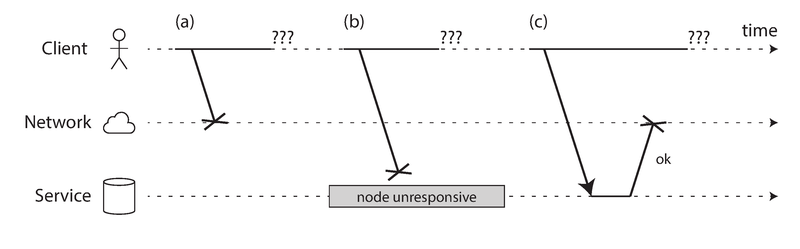
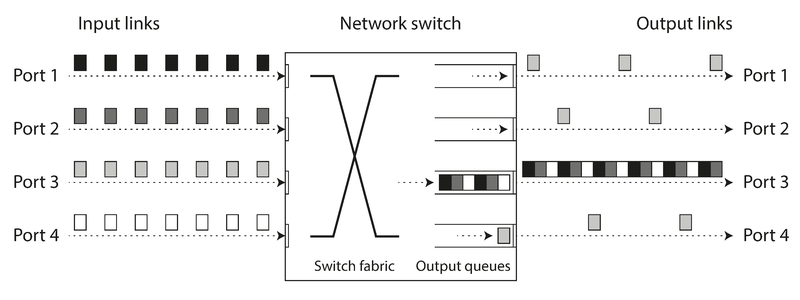
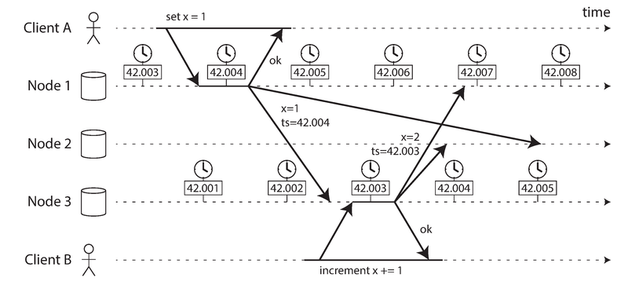
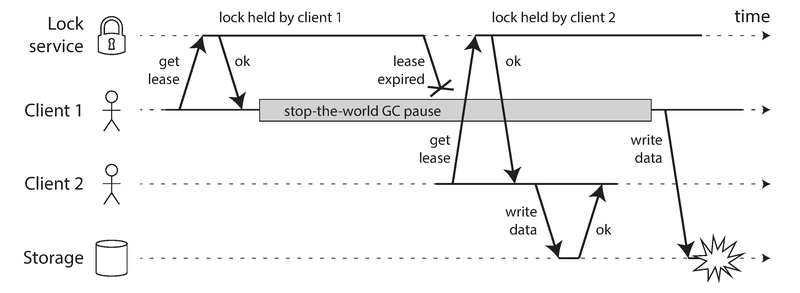
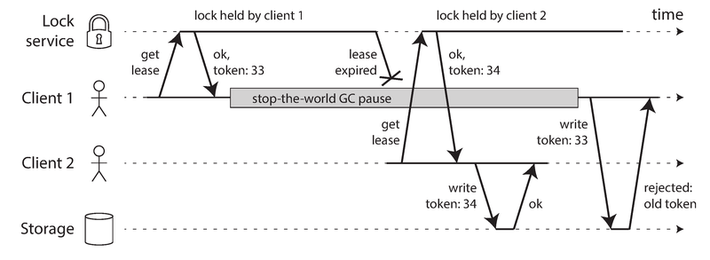

# 模块 08：分布式系统的麻烦

> 对应 Chapter 8: The Trouble with Distributed Systems
> Part II 分布式数据

---

## 概念地图

- **核心概念** (必须内化): 部分失效（Partial Failure）、不可靠的网络与时钟、Quorum（法定人数）决策
- **实操要点** (动手时需要): 超时策略的选择与权衡、Fencing Token 机制、时钟置信区间
- **背景知识** (扩展理解): 同步/异步网络模型、拜占庭故障（Byzantine Fault）、Safety vs Liveness 属性

---

## 概念讲解

### 1. 故障与部分失效（Faults and Partial Failures）

这一章是全书"最悲观"的一章——Martin Kleppmann 说要"把悲观主义调到最大"，然后系统地告诉你分布式系统中所有可能出错的事情。

**单机 vs 分布式的根本区别**：

| 维度 | 单机 | 分布式系统 |
|------|------|-----------|
| 故障模式 | 确定性的：要么正常工作，要么完全崩溃（如内核崩溃、蓝屏） | **非确定性的**：部分组件坏了，其他部分还在运行 |
| 设计哲学 | 把模糊的物理现实隐藏起来，呈现理想化的计算模型 | 不得不面对物理世界的混乱现实 |
| 错误处理 | 遇到内部错误宁可崩溃，也不返回错误结果 | 必须在部分故障的前提下继续提供服务 |

在单台计算机上，一条 CPU 指令总是做相同的事情，写入内存或磁盘的数据保持完好。这是刻意的设计选择——计算机把底层硬件的不确定性封装起来了。

但在分布式系统中，我们不再拥有这种奢侈。系统的某些部分可能以不可预测的方式损坏，而其他部分仍然正常运行。这就是**部分失效（Partial Failure）**。部分失效的难点在于它是**非确定性的**：同样的操作可能有时成功有时失败，你甚至可能不知道某个操作到底成功了没有。

> **作者观点**：在分布式系统中，猜疑、悲观和偏执是值得的。认为故障罕见并寄希望于最好的结果是不明智的。应该考虑各种可能的故障——哪怕是相当不可能的——并在测试环境中人为制造这些情况来观察会发生什么。

#### 1.1 超级计算机 vs 云计算

处理故障有两种截然不同的哲学：

| 方式 | 超级计算机（HPC） | 云计算/互联网服务 |
|------|-------------------|------------------|
| 故障策略 | 定期做 checkpoint，出错就整体停机重启 | 容忍部分故障，系统继续运行 |
| 硬件 | 专用可靠硬件 | 廉价通用硬件（故障率更高） |
| 网络 | 专用拓扑（多维网格/环面） | IP + Ethernet（Clos 拓扑） |
| 可用性 | 可以停机维护 | 需要 7x24 在线 |
| 规模效应 | 单个节点可靠，整体规模有限 | 节点多，**总有东西在坏** |

本书聚焦互联网服务场景，这意味着我们必须接受部分失效，并在软件中构建容错机制。

> 📎 **关联**：Ch1 "Reliability" 讨论了从不可靠组件构建可靠系统的基本理念。这里展开了这个话题在分布式环境下的全貌。

#### 1.2 从不可靠组件构建可靠系统

这个想法其实很古老：

- **纠错码**：在偶尔出错的通信信道上精确传输数字数据
- **IP 协议**是不可靠的（丢包、延迟、重复、乱序），但 **TCP** 在其上提供了更可靠的传输层

虽然上层系统可以比底层部件更可靠，但总有极限。TCP 能隐藏丢包但无法消除网络延迟。纠错码能处理少量比特错误但扛不住信号完全被干扰淹没。

---

### 2. 不可靠的网络（Unreliable Networks）

本书讨论的分布式系统都是 **shared-nothing** 架构：一堆通过网络连接的机器，网络是它们唯一的通信手段。互联网和数据中心内部网络（通常是 Ethernet）都是**异步分组网络（asynchronous packet network）**——发送一个数据包后，网络不保证它什么时候到达，甚至不保证它能到达。

当你发送请求并期待响应时，可能出错的事情包括：

1. 请求在网络中丢失（也许有人拔了网线）
2. 请求在队列中等待，稍后才送达（网络或接收方过载）
3. 远程节点已崩溃
4. 远程节点暂停响应（如正在 GC），之后会恢复
5. 远程节点处理了请求，但响应在网络中丢失
6. 远程节点处理了请求，但响应被延迟



> **图说**：如果你发送了请求但没收到响应，无法区分这三种情况：(a) 请求丢失、(b) 远程节点不可用、(c) 响应丢失。发送方唯一能做的就是等待响应——但这个响应可能永远不会到来。

通常的处理方式是**超时（timeout）**：等待一段时间后放弃，假设响应不会到来了。但即便超时了，你仍然不知道远程节点是否收到了你的请求——如果请求还在某个队列里排队，它最终还可能被送达。

#### 2.1 网络故障的现实

网络问题比你想象的常见得多：

- 一项研究发现，一个中等规模数据中心**每月约 12 次网络故障**，其中一半影响单台机器，一半影响整个机架
- 冗余网络设备并不能像你期望的那样大幅降低故障率，因为它**防不住人为错误**（如交换机配置错误）——而人为错误是宕机的主要原因
- 公有云（如 EC2）以频繁的短暂网络抖动著称
- 鲨鱼会咬海底光缆并损坏它们
- 有些网卡会丢弃所有入站数据包但正常发送出站数据包——网络链路在一个方向上可用不代表反方向也可用

> **网络分区（Network Partition）**：当网络故障导致网络的一部分与其余部分隔离时，称为网络分区（也叫 netsplit）。本书一般使用更通用的术语"网络故障"，以免与存储系统的"分区"（Ch6 中的分片）混淆。

即使网络故障在你的环境中很少见，故障可能发生这个事实就意味着你的软件需要能够处理它。如果网络故障的错误处理没有被定义和测试，后果可能很糟糕：集群可能永久死锁，甚至可能**删除所有数据**。

> **作者观点**：处理网络故障不一定意味着容忍它们。如果你的网络通常相当可靠，在网络出问题时给用户显示一个错误消息也是合理的做法。但你确实需要知道你的软件在面对网络问题时会如何反应。有意触发网络问题并测试系统的响应是个好主意——这就是 Chaos Monkey 背后的理念。

> 📎 **关联**：Ch1 "Reliability" 介绍了 Netflix 的 Chaos Monkey 等故障注入工具的基本概念。

#### 2.2 检测故障（Detecting Faults）

很多系统需要自动检测故障节点。例如：

- 负载均衡器需要停止向已宕机的节点发送请求
- 在单主复制中，如果主节点失败，需要从从节点中选出新主节点

> 📎 **关联**：Ch5 "Handling Node Outages" 详细讨论了主节点故障切换（Failover）流程。

网络的不确定性使得判断一个节点是否在工作变得困难。在某些特定情况下你可能获得一些反馈：

| 信号 | 什么情况 | 局限 |
|------|---------|------|
| TCP RST/FIN 包 | 目标进程崩溃，但机器还在运行 | 如果进程在处理请求时崩溃，你不知道数据被处理到哪了 |
| 进程崩溃脚本通知 | 进程被杀或崩溃，OS 仍在运行 | 需要脚本协作，如 HBase 的做法 |
| 网络交换机管理接口 | 链路硬件级别故障 | 不适用于互联网或无管理权限的共享数据中心 |
| ICMP Destination Unreachable | 路由器确认 IP 不可达 | 路由器本身也受网络限制 |

关键点：即使 TCP 确认数据包已送达，应用可能在处理之前就已崩溃。如果你想确认请求成功，你需要来自**应用层本身**的确认响应。

最终，如果什么反馈都收不到，你只能**重试几次，等待超时，最终宣告节点死亡**。

#### 2.3 超时与无界延迟（Timeouts and Unbounded Delays）

超时该设多长？没有简单答案。

| 超时长 | 优点 | 缺点 |
|--------|------|------|
| 长超时 | 减少误判（false positive） | 故障检测慢，用户等待时间长 |
| 短超时 | 快速检测故障 | 更高的误判风险——把只是暂时变慢的节点判死 |

**过早宣判节点死亡**的问题：

1. 如果节点实际还活着并在执行某个操作（如发送邮件），另一个节点接管后**操作可能被执行两次**
2. 节点的职责被转移给其他节点，**增加了其他节点的负载**
3. 如果系统本身就在承受高负载，过早判死可能导致**级联故障**——极端情况下所有节点互相判对方死了，整个系统停止工作

如果网络保证数据包在时间 d 内送达或丢失，并且非故障节点保证在时间 r 内处理请求，那么合理的超时就是 **2d + r**。但现实中，大多数系统两个保证都没有——异步网络有**无界延迟**，服务器也无法保证处理时间上限。

#### 2.4 网络拥塞与排队（Network Congestion and Queueing）

网络延迟的变化主要来源于**排队**，类似于开车时路上的交通拥堵：



> **图说**：多台机器同时向同一目的地发送数据时，网络交换机必须排队。这里端口 1、2、4 都在向端口 3 发送数据包，导致端口 3 的输出队列堆积。如果队列满了，数据包会被丢弃，需要重传。

排队发生在多个层面：

1. **网络交换机队列**：多个源同时发往同一目的地时排队等待（网络拥塞）
2. **目的机器的操作系统队列**：所有 CPU 核心忙碌时，入站请求排队等待应用处理
3. **虚拟化环境**：VM 被暂停时（其他 VM 占用 CPU），入站数据被虚拟机监控程序缓存
4. **TCP 流量控制/背压**：发送方自我限速以避免过载接收方，导致数据在发送端排队

> **TCP vs UDP**：延迟敏感的应用（如视频会议、VoIP）使用 UDP 而非 TCP，因为 UDP 不做流量控制和重传，避免了部分延迟变化。UDP 适合那些"延迟数据一文不值"的场景——VoIP 通话中来不及重传的丢包，不如用静音填充然后继续播放。重试在人的层面发生："你能再说一遍吗？刚才声音断了一下。"

在公有云和多租户数据中心中，资源被多个客户共享，"吵闹邻居"（noisy neighbor）可能消耗大量资源导致你的网络延迟剧烈波动。

**实践建议**：超时应该通过实验确定——测量一段时间内大量机器的网络往返时间分布，然后根据应用特征在"故障检测延迟"和"误判风险"之间取舍。更好的做法是用**自适应超时**——系统持续监测响应时间和抖动（jitter），自动调整超时。例如 **Phi Accrual failure detector**（用于 Akka 和 Cassandra）。TCP 的重传超时也采用类似机制。

#### 2.5 同步网络 vs 异步网络

为什么不能在硬件层面让网络可靠，免除软件的烦恼？

对比传统电话网络：打电话时建立一条**电路（circuit）**——一段固定的、有保证的带宽被分配给这次通话，沿着整条路线保留。例如 ISDN 网络以每秒 4,000 帧的固定速率运行，每通电话在每帧中分配 16 bits，保证每 250 微秒能发送 16 bits 音频数据。这是**同步网络**——因为有预留资源，没有排队，端到端延迟有固定上界（bounded delay）。

但数据中心网络和互联网是**分组交换网络（packet-switched）**，使用 TCP/IP，没有电路概念。为什么？因为互联网是为**突发流量（bursty traffic）**优化的。请求网页、发邮件、传文件没有固定的带宽需求——我们只是想尽快完成。如果用电路交换传文件，你得预估带宽：估低了传得慢、浪费时间；估高了电路建立失败。TCP 动态适应可用带宽，代价就是排队和无界延迟。

> **作者观点**：网络延迟的变化不是自然法则，而是**成本/收益权衡**的结果。静态资源分配（如电路交换）可以保证延迟但浪费资源，动态资源分配（如分组交换）利用率高但延迟不可预测。当前公有云和互联网没有启用 QoS，所以我们必须假设网络拥塞、排队和无界延迟会发生。

---

### 3. 不可靠的时钟（Unreliable Clocks）

时钟在分布式系统中的用途广泛但危机四伏：

| 用途类型 | 例子 | 需要什么时钟 |
|----------|------|-------------|
| **度量持续时间** | 请求是否超时？响应时间百分位？QPS？ | 单调时钟（Monotonic Clock） |
| **描述时间点** | 文章何时发布？缓存何时过期？日志时间戳？ | 日历时钟（Time-of-Day Clock） |

在分布式系统中，时间特别棘手——通信不是瞬时的，消息在网络中传输需要时间，而且延迟可变，所以很难确定多台机器上事件的发生顺序。更要命的是，每台机器有自己的时钟（石英晶体振荡器），精度有限，各自有偏差。

#### 3.1 两种时钟

**日历时钟（Time-of-Day Clock）**：

- 返回当前日期和时间（wall-clock time）
- Linux: `clock_gettime(CLOCK_REALTIME)`，Java: `System.currentTimeMillis()`
- 返回自 epoch（1970-01-01 UTC）以来的秒/毫秒数
- 通过 NTP 同步，理想情况下不同机器的时间戳含义相同
- **问题**：如果本地时钟偏差太大，NTP 会强制重置，导致时间**向后跳跃**；闰秒也会造成跳跃
- **不适合度量持续时间**

**单调时钟（Monotonic Clock）**：

- 适合度量持续时间（时间间隔）
- Linux: `clock_gettime(CLOCK_MONOTONIC)`，Java: `System.nanoTime()`
- **保证只增不减**（不像日历时钟可能回退）
- 绝对值无意义（可能是"自开机以来的纳秒数"之类），**不能用来比较不同机器**
- NTP 可以调整单调时钟的走速（slewing，加快或减慢最多 0.05%），但不会让它跳跃
- 分辨率通常很好，大多数系统能精确到微秒级

**实践结论**：在分布式系统中用单调时钟度量超时是安全的。用日历时钟给跨节点的事件排序是危险的。

#### 3.2 时钟同步与精度问题

时钟同步面临重重困难：

- **石英漂移**：Google 假设服务器时钟漂移 200 ppm——每 30 秒重同步一次会有 6 ms 偏差，每天重同步一次会有 17 秒偏差
- **NTP 强制重置**：偏差太大时本地时钟会被强制跳转，导致观测到的时间倒退或前跳
- **防火墙阻断 NTP**：如果节点意外被防火墙隔离了 NTP 服务器，这个误配置可能长时间不被发现
- **网络延迟限制 NTP 精度**：通过互联网同步的最小误差约 35 ms，偶尔飙到 1 秒
- **NTP 服务器可能出错**：报告错误时间的 NTP 服务器确实存在
- **闰秒**：导致一分钟有 59 秒或 61 秒，已经让很多大系统崩溃过。最佳处理方式是"闰秒平滑"（leap second smearing）——在一天内逐步调整
- **虚拟机中的时钟**：VM 暂停时时钟可能突然前跳
- **用户设备时钟不可信**：用户可能故意调时间（如绕过游戏时间限制）

高精度时钟同步是可能的（如金融业 MiFID II 法规要求 100 微秒内同步），但需要 GPS 接收器、PTP 协议和专门的部署监控。对大多数系统来说，这种投入不现实。

#### 3.3 依赖同步时钟的危险

时钟看起来简单易用，但陷阱很多。最阴险的是——错误的时钟往往**不会被发现**。CPU 故障或网络配置错误通常会让系统立刻无法工作；但石英时钟有偏差或 NTP 客户端配置错误，大多数功能"看起来正常"，时钟却在悄悄漂移，最终导致**无声的数据丢失**而非戏剧性的崩溃。

**如果你使用依赖同步时钟的软件，务必监控所有机器间的时钟偏差，把偏差过大的节点踢出集群。**

##### 用时间戳排序事件——一个危险的陷阱



> **图说**：Client B 的写操作在因果关系上晚于 Client A，但由于时钟偏差（node 3 的时钟比 node 1 慢了约 1 ms），Client B 的写操作获得了更早的时间戳（42.003 vs 42.004）。当 node 2 收到这两个写操作时，它错误地认为 x=1 更新，丢弃了 x=2。

这就是 **Last Write Wins (LWW)** 策略的问题——在 Cassandra 和 Riak 等数据库中广泛使用。LWW 的根本缺陷：

- 时钟偏差导致数据**悄无声息地丢失**——偏差大的节点写的数据一直会被偏差小的节点"覆盖"
- LWW 无法区分**真正并发的写**和**有因果关系的顺序写**
- 两个节点可能生成相同时间戳的写操作（尤其在毫秒级精度下）

> 📎 **关联**：Ch5 "Last write wins (discarding concurrent writes)" 和 "Detecting Concurrent Writes" 详细讨论了 LWW 的问题和版本向量（Version Vector）作为因果追踪的替代方案。

**更安全的替代方案**：**逻辑时钟（Logical Clock）**——基于递增计数器而非石英振荡器，只追踪事件的相对顺序（一个事件发生在另一个之前还是之后），不测量实际流逝的时间。

> 📎 **关联**：Ch9 "Ordering Guarantees" 会进一步讨论排序问题。

##### 时钟读数有置信区间

时钟读数不应该被当作一个精确的时间点，而应该被理解为一个**时间范围**（置信区间）。例如：系统有 95% 的把握认为当前时间在过去某分钟的 10.3 到 10.5 秒之间——但不能比这更精确。如果我们只知道时间 +/- 100 ms，那么时间戳中的微秒位数字本质上是没有意义的。

不幸的是，大多数系统不暴露这个不确定性。调用 `clock_gettime()` 返回一个值，但不告诉你它的误差范围是 5 毫秒还是 5 年。

**例外：Google 的 TrueTime API**（用于 Spanner 数据库）——显式返回一个置信区间 `[earliest, latest]`，告诉你实际当前时间在这个范围内。宽度取决于上次与更精确时钟源同步后过了多久。

##### Spanner：用同步时钟实现全局快照隔离

> 📎 **关联**：Ch7 "Snapshot Isolation and Repeatable Read" 讨论了快照隔离的原理。

快照隔离需要单调递增的事务 ID。在单机上用简单计数器即可，但在分布式系统中，全局单调递增的事务 ID 需要协调，成为性能瓶颈。

Spanner 的方案：用同步时钟的时间戳作为事务 ID。基于 TrueTime API 的置信区间做判断——如果两个事务的置信区间不重叠 (A_latest < B_earliest)，那么 B 一定发生在 A 之后。为确保因果关系正确，Spanner **故意等待置信区间的长度**后再提交读写事务。为了缩短等待时间，Google 在每个数据中心部署了 GPS 接收器或原子钟，把时钟不确定性控制在约 7 ms 以内。

> **作者观点**：使用时钟同步实现分布式事务语义是一个活跃的研究领域，这些想法很有趣，但在 Google 之外的主流数据库中尚未实现。

#### 3.4 进程暂停（Process Pauses）

考虑这样一个场景：你的数据库每个分区有一个 leader，只有 leader 能接受写操作。leader 通过 **lease（租约）** 来证明自己的身份——类似一个有超时时间的锁。

```java
while (true) {
    request = getIncomingRequest();
    // 确保租约至少还剩 10 秒
    if (lease.expiryTimeMillis - System.currentTimeMillis() < 10000) {
        lease = lease.renew();
    }
    if (lease.isValid()) {
        process(request);    // 危险！如果在这之前线程暂停了 15 秒...
    }
}
```

这段代码有两个问题：

1. **依赖同步时钟**：租约过期时间由另一台机器设置，却与本地系统时钟比较
2. **假设检查时间和处理请求之间几乎没有时间流逝**——但如果线程在 `lease.isValid()` 那行暂停了 15 秒呢？租约已过期，另一个节点已经成为 leader，但这个线程浑然不知

线程可能被暂停的原因：

| 原因 | 说明 |
|------|------|
| **GC（垃圾回收）** | Stop-the-world GC 暂停有时长达数分钟 |
| **VM 挂起/恢复** | 虚拟机可以被暂停（保存内存到磁盘）再恢复，用于 live migration |
| **上下文切换** | OS 切换线程、hypervisor 切换 VM，被抢占的线程在任意代码位置暂停 |
| **同步磁盘 I/O** | 等待慢速磁盘操作，如果磁盘实际是网络文件系统（NFS）或网络块设备（EBS），还要加上网络延迟 |
| **内存换页（Swapping/Paging）** | 内存不足时页面换入换出，极端情况导致 thrashing |
| **SIGSTOP 信号** | Unix 进程收到 SIGSTOP（如 Ctrl-Z）后暂停，直到收到 SIGCONT |

核心问题：暂停可以在代码的任意位置发生，暂停期间其他节点继续运转，可能宣告这个节点已死。当暂停的节点恢复时，它甚至不知道自己暂停了多久——从它的视角看几乎没有时间流逝。

> **作者观点**：分布式系统中的节点必须假设自己的执行可能在任何时候被暂停相当长的时间。在暂停期间，世界的其余部分在继续运转，甚至可能宣布这个暂停的节点已经死亡。

##### 减轻 GC 影响的实践方案

无需求助于昂贵的实时系统，可以采用两种思路：

1. **把 GC 暂停视为节点的短暂计划性下线**：在 GC 即将发生时停止向该节点发送新请求，等它处理完待处理请求后再执行 GC，对客户端隐藏 GC 暂停。一些金融交易系统采用这种方式。

2. **只对短生命对象做 GC + 定期重启进程**：在积累足够多长生命对象之前重启进程（如滚动升级方式一次重启一个节点），避免 full GC。

> 📎 **关联**：Ch4 中讨论的滚动升级（rolling upgrade）策略在这里也适用——一次处理一个节点，把流量先迁移走。

---

### 4. 知识、真相与谎言（Knowledge, Truth, and Lies）

到目前为止我们了解了分布式系统的三大麻烦：不可靠的网络、不可靠的时钟、进程暂停。这些问题的根本后果是：

**网络中的节点无法确定地知道任何事情——它只能根据收到（或没收到）的消息做猜测。**

一个节点无法可靠地知道另一个节点的状态，网络问题和节点问题无法被可靠地区分。这引出了接近哲学的问题：在我们的系统中，什么是"真"什么是"假"？我们对这些"知识"能有多确信？

好消息是，我们不需要解决人生的意义。我们可以明确声明对系统行为的假设（系统模型），然后设计系统满足这些假设，并在该模型内证明算法的正确性。

#### 4.1 真相由多数派定义（The Truth Is Defined by the Majority）

三个生动的场景说明了为什么节点不能信任自己的判断：

1. **半断开节点**：一个节点能接收所有消息但发不出去（出站消息全被丢弃）。它自己运行正常，但其他节点听不到它的响应，最终宣布它死亡——"我没有死！"它在坟墓边大声喊叫，但没人能听到它的声音，葬礼队伍继续前进...

2. **半断开节点的自知**：节点注意到自己发出的消息没有得到确认，意识到网络有故障。但即便如此，它被其他节点错误地宣布死亡，而它对此无能为力。

3. **GC 暂停的节点**：节点经历一分钟的 stop-the-world GC，在此期间不处理任何请求、不发送任何响应。其他节点宣布它死亡。GC 结束后，节点的线程继续运行，仿佛什么都没发生。对它来说几乎没有时间流逝，但其他节点已经为它举行了"葬礼"。

**结论**：节点不能仅凭自己的判断来做决定。分布式算法依赖 **Quorum（法定人数）投票**——决策需要获得多个节点中的最少票数，以减少对任何单个节点的依赖。

- **宣布节点死亡**也需要 quorum 决策。如果多数派宣布某节点死亡，那它必须被视为死亡，即便它自己还觉得好好的。被判定的节点必须遵守多数派的决定并让位。
- 最常见的 quorum 是**绝对多数（超过一半）**：3 个节点容忍 1 个故障；5 个节点容忍 2 个故障。安全性在于系统中最多只有一个多数派——不可能出现两个多数派做出矛盾的决定。

> 📎 **关联**：Ch5 "Quorums for reading and writing" 讨论了读写 quorum 的具体规则。Ch9 会深入讨论共识算法中的 quorum 使用。

#### 4.2 Leader、Lock 和唯一性保证

很多场景需要"系统中只有一个"：

- 只有一个节点是某个分区的 leader（避免 split brain）
- 只有一个事务/客户端持有某个资源的锁
- 只有一个用户注册了某个用户名

在分布式系统中实现这一点需要格外小心：即使一个节点相信自己是"被选中的那个"（leader、锁持有者），并不意味着 quorum 也这么认为！它可能曾经是 leader，但在一次网络中断或 GC 暂停期间被罢免了，新 leader 已经被选出。

如果一个节点在被多数派判死之后继续以"被选中者"的身份行事，可能会造成严重问题。



> **图说**：Client 1 获取了锁/租约后经历了一次长时间 GC 暂停。暂停期间租约过期，Client 2 获取了锁并开始写文件。GC 结束后，Client 1 以为自己还持有有效租约，也去写文件——两个客户端的写操作发生冲突，文件被损坏。这不是理论问题——HBase 以前就有这个 bug。

#### 4.3 Fencing Token（防护令牌）

解决方案：**fencing token**——每次锁服务授予锁/租约时，同时返回一个单调递增的数字（fencing token）。客户端在写请求中必须带上这个 token。



> **图说**：Client 1 获取租约时得到 token 33，然后 GC 暂停，租约过期。Client 2 获取租约时得到 token 34，带着 token 34 写入存储。之后 Client 1 恢复，带着 token 33 去写——存储服务发现已经处理过更大的 token（34），拒绝 token 33 的写请求。

关键设计要点：

- **资源本身（如存储服务）必须主动检查 token**，拒绝使用过期 token 的写请求——不能依赖客户端自己检查锁状态
- 如果使用 ZooKeeper 作为锁服务，可以用事务 ID（zxid）或节点版本号（cversion）作为 fencing token——它们保证单调递增
- 这也是服务端自我保护的好实践——不要假设客户端总是行为良好

> **作者观点**：由服务端检查 token 看似是额外的负担，但实际上是件好事。假设客户端总是行为良好是不明智的，因为客户端的运维者的优先级可能与服务运维者的优先级大相径庭。服务应该保护自己免受行为异常的客户端的意外伤害。

#### 4.4 拜占庭故障（Byzantine Faults）

Fencing token 能检测和阻止**无意中**行为错误的节点（如还不知道自己的租约已过期）。但如果节点**故意**作恶——比如发送带有伪造 fencing token 的消息——这就是另一个层面的问题了。

本书假设节点是**不可靠但诚实的**：它们可能慢、可能不响应、状态可能过时，但如果它们做出响应，就会如实按照协议行事。

如果节点可能"撒谎"（发送任意错误或伪造的响应），这称为**拜占庭故障（Byzantine Fault）**。在这种不信任环境中达成共识的问题称为**拜占庭将军问题（Byzantine Generals Problem）**。

> **拜占庭将军问题**的名字来自 Lamport 等人 1982 年的论文。想象 n 个将军需要就作战计划达成一致，但其中有叛徒会发送虚假消息来迷惑其他人。这是"两将军问题"（两支军队需要通过可能丢失的信使协调进攻——Ch9 会讨论）的推广版本。

**需要拜占庭容错的场景**：

- **航空航天**：辐射可能导致内存/CPU 数据损坏，飞控系统必须容忍拜占庭故障
- **多方参与的系统**：参与者可能试图欺骗其他人，如 Bitcoin 等区块链——让互不信任的各方在没有中央权威的情况下就交易达成一致

**大多数服务端系统不需要拜占庭容错**：

- 数据中心的节点都由同一个组织控制（可以信任），辐射水平不足以造成内存损坏
- 拜占庭容错协议非常复杂且昂贵
- 相同软件的 bug 会同时影响所有节点——拜占庭容错算法通常需要 2/3 以上节点正常，要用来防 bug 就需要 4 个独立实现
- 传统安全机制（认证、访问控制、加密、防火墙）仍然是抵御攻击者的主要手段

##### 弱形式的"撒谎"防护

虽然不需要完整的拜占庭容错，但可以防护一些轻度的"不诚实"：

- **应用层校验和**：网络包可能因硬件 bug 而损坏，TCP/UDP 的校验和有时会漏检
- **输入验证与清洗**：防止 SQL 注入、XSS 等
- **NTP 多服务器比对**：NTP 客户端查询多个服务器，排除报告异常时间的离群值

#### 4.5 系统模型与现实

为了设计正确的分布式算法，需要形式化我们对故障的假设——这就是**系统模型（System Model）**。

**关于时序的三种模型**：

| 模型 | 假设 | 现实性 |
|------|------|--------|
| **同步模型** | 网络延迟、进程暂停、时钟误差都有已知的固定上界 | **不现实**——实际中会出现无界延迟和暂停 |
| **部分同步模型** | 大部分时间表现得像同步系统，但偶尔会突破上界 | **大多数真实系统的合理模型** |
| **异步模型** | 不做任何时序假设，甚至没有时钟（不能用超时） | 非常受限，但某些算法可以在此模型下工作 |

**关于节点故障的三种模型**：

| 模型 | 假设 |
|------|------|
| **Crash-stop** | 节点只会通过崩溃来故障，崩溃后永远不会恢复 |
| **Crash-recovery** | 节点可能崩溃，之后可能在未知时间后恢复；稳定存储（磁盘）跨崩溃保持，内存状态丢失 |
| **Byzantine** | 节点可能做任何事情，包括故意欺骗 |

**对现实系统最有用的模型组合**：**部分同步 + Crash-recovery**。

#### 4.6 Safety 与 Liveness 属性

分布式算法的正确性属性分为两类：

| 属性类型 | 含义 | 例子 | 特征 |
|----------|------|------|------|
| **Safety（安全性）** | "坏事永远不会发生" | Fencing token 的唯一性、单调序列 | 一旦违反就无法撤回；可以指出违反的具体时间点 |
| **Liveness（活性）** | "好事最终会发生" | Fencing token 的可用性（请求最终会收到响应） | 在某个时间点可能还未满足，但未来有希望满足 |

> **提示**：Liveness 属性的定义中通常包含"最终（eventually）"这个词。是的，你猜对了——最终一致性（Eventual Consistency）就是一个 liveness 属性。

**Safety vs Liveness 的实际意义**：

- **Safety 属性必须始终成立**——即使所有节点崩溃或网络完全失败，算法也绝不能返回错误结果
- **Liveness 属性可以有条件**——例如：请求最终收到响应，但仅在多数节点未崩溃且网络最终恢复的前提下

部分同步模型的定义就要求系统最终回到同步状态——任何网络中断都只持续有限的时间。

#### 4.7 系统模型映射到现实世界

系统模型是现实的简化抽象。例如：

- Crash-recovery 模型假设稳定存储（磁盘）跨崩溃保持——但如果磁盘数据损坏呢？如果固件 bug 导致重启后认不出硬盘呢？
- Quorum 算法依赖节点记住它声称存储的数据——如果节点"失忆"了，quorum 条件就被破坏了

理论分析不能保证实际实现在真实系统中总是正确运行，但它是极好的第一步——理论分析能发现隐藏在正常运行表象下的问题，这些问题可能只在你的假设（如关于时序的假设）在异常情况下被打破时才会暴露。

> **作者观点**：理论上算法可以声明某些事情"不会发生"并假设它们不存在，但在 non-Byzantine 系统的实际实现中，仍然需要包含处理"不可能"情况的代码——即使这个处理只是 `printf("Sucks to be you")` 然后 `exit(666)`，让人工运维来收拾残局。这可以说是计算机科学与软件工程之间的区别。

---

## 重点标记

### 本章核心要点

1. **分布式系统的根本困难是部分失效（Partial Failure）**：不同于单机的"全好或全坏"，分布式系统中部分组件可能以不可预测的方式失败，而其他部分继续运行

2. **网络是不可靠的**：请求和响应都可能丢失、延迟或乱序；无法区分网络故障和节点故障；超时是检测故障的唯一通用手段，但超时值没有"正确"的选择

3. **时钟是不可靠的**：日历时钟可能跳变，单调时钟不能跨机器比较；用时间戳给分布式事件排序是危险的（LWW 的数据丢失问题）；时钟读数应被视为有置信区间的范围而非精确值

4. **进程可能在任意时刻被暂停任意长的时间**：GC、VM 挂起、上下文切换、磁盘 I/O、换页——暂停期间节点无法感知时间流逝，可能被其他节点宣布死亡

5. **节点不能信任自己的判断，决策需要 quorum**：被网络隔离或 GC 暂停的节点可能被错误地宣布死亡；多数派投票确保系统中不会出现矛盾的决策

6. **Fencing token 是保护共享资源的实用机制**：锁/租约本身不足以保证安全；资源服务端必须主动验证 token 的单调递增性

7. **系统模型形式化了我们的假设**：部分同步 + Crash-recovery 是对现实系统最有用的模型；Safety 属性必须始终满足，Liveness 属性可以有条件

### 关键术语对照

| 英文 | 中文 | 说明 |
|------|------|------|
| Partial Failure | 部分失效 | 分布式系统的根本特征：部分组件故障，其他部分继续运行 |
| Network Partition | 网络分区 | 网络故障导致网络的一部分与其余部分隔离 |
| Unbounded Delay | 无界延迟 | 异步网络中数据包的延迟没有上界保证 |
| Time-of-Day Clock | 日历时钟 | 返回当前日期时间，可能跳变 |
| Monotonic Clock | 单调时钟 | 保证只增不减，适合度量时间间隔 |
| Clock Drift | 时钟漂移 | 石英时钟走快或走慢偏离真实时间 |
| Leap Second Smearing | 闰秒平滑 | 在一天内逐步调整闰秒，避免突变 |
| Fencing Token | 防护令牌 | 锁服务返回的单调递增数字，用于防止过期锁持有者的写操作 |
| Byzantine Fault | 拜占庭故障 | 节点可能发送任意错误或伪造的消息 |
| System Model | 系统模型 | 对系统中可能发生的故障类型的形式化假设 |
| Safety Property | 安全性属性 | "坏事永远不会发生"——一旦违反不可撤回 |
| Liveness Property | 活性属性 | "好事最终会发生"——包含"最终"一词 |
| Quorum | 法定人数 | 做决策所需的最少投票节点数 |

---

## 自测：你真的理解了吗？

### 问题 1：超时判死的级联故障

你的系统有 5 个节点，设置了 3 秒的超时来检测节点故障。由于一次网络交换机升级，所有节点之间的延迟突然升高到 5 秒。会发生什么？如果系统的策略是"把死亡节点的负载转移给其他节点"，最坏情况下会怎样？

<details>
<summary>参考答案</summary>

由于所有节点的延迟都超过了 3 秒超时，每个节点都会认为其他所有节点已死。然后每个节点试图接管"死亡"节点的负载，导致自己的负载暴增。更高的负载进一步增加响应时间，使情况更加恶化——这就是**级联故障（cascading failure）**。极端情况下所有节点互相判对方死了，整个系统停止有效工作。

**预防措施**：
- 使用自适应超时（如 Phi Accrual failure detector），根据观测到的延迟分布动态调整
- 转移负载前先验证目标节点是否健康
- 对负载转移设置速率限制，避免瞬间过载
</details>

### 问题 2：LWW 的数据丢失

你的系统使用多主复制 + Last Write Wins (LWW) 策略。Node A 的时钟比 Node B 快了 500 ms。用户在 Node B 上频繁更新某个值。会观察到什么现象？如何缓解？

<details>
<summary>参考答案</summary>

由于 Node A 时钟快了 500 ms，Node A 上产生的写操作的时间戳总是比 Node B 上几乎同时产生的写操作时间戳大约 500 ms。当写操作复制到其他节点时，Node A 的写操作会"赢得"所有在 500 ms 窗口内的冲突，即使 Node B 上的写操作在因果关系上更晚。

结果：Node B 上用户最近 500 ms 内的更新会被 Node A 上更早的值"覆盖"，导致**无声的数据丢失**——没有任何错误消息。

**缓解方案**：
- 使用版本向量（Version Vector）追踪因果关系，而非依赖物理时钟（参考 Ch5）
- 监控所有节点间的时钟偏差，偏差过大的节点踢出集群
- 使用逻辑时钟而非物理时钟来排序事件
</details>

### 问题 3：Lease 续约的安全性

你设计了一个分布式锁服务。Client 获取一个 30 秒的 lease，并在 lease 到期前 10 秒续约。Client 使用本地单调时钟来判断是否需要续约。这个设计安全吗？如果 Client 的 GC 暂停了 35 秒会怎样？如何用 fencing token 解决？

<details>
<summary>参考答案</summary>

即使使用单调时钟（避免了时钟跳变问题），这个设计仍然不安全。

如果 Client 的 GC 暂停了 35 秒：
1. 暂停开始时 lease 还有 >10 秒有效期
2. 暂停期间 lease 过期（30 秒到了）
3. 另一个 Client 获取了 lease 并开始操作
4. 35 秒后 GC 结束，原 Client 恢复——它不知道自己暂停了，但此时还没到下一轮循环检查 lease，所以可能继续执行受保护的操作
5. 两个 Client 同时操作同一资源——数据损坏

**用 fencing token 解决**：
- 锁服务每次授予 lease 时返回一个单调递增的 token
- Client 在所有写请求中带上 token
- 资源服务端记录见过的最大 token，拒绝使用更小 token 的请求
- 即使暂停后的 Client 以为自己还有 lease，它的旧 token 也会被拒绝
</details>

### 问题 4：Safety vs Liveness 判断

判断以下属性是 Safety 还是 Liveness，并说明理由：
- (a) 同一时刻最多只有一个节点持有 leader 角色
- (b) 如果当前 leader 崩溃，最终会有新 leader 被选出
- (c) 已提交的写操作不会丢失
- (d) 读请求最终会返回最新写入的值

<details>
<summary>参考答案</summary>

- **(a) Safety**（安全性）——"同一时刻最多一个 leader" 是"坏事不会发生"类型。一旦违反（两个节点同时认为自己是 leader），就已经造成了不可撤回的潜在损害（split brain）。可以指出违反发生的具体时间点。

- **(b) Liveness**（活性）——"最终会有新 leader" 包含"最终"一词，是"好事终会发生"类型。在某个时间点可能还没有新 leader（系统正在选举中），但未来有希望完成。这个属性可以有条件——例如"只要多数节点存活且网络最终恢复"。

- **(c) Safety**（安全性）——"已提交的写操作不丢失"是"坏事不会发生"类型。一旦数据丢失就不可撤回。即使所有节点崩溃，也不应该违反此属性（数据已在持久存储中）。

- **(d) Liveness**（活性）——"最终返回最新值"包含"最终"一词，是最终一致性（Eventual Consistency）的定义。在某个时间点可能读到旧值，但最终会读到新值。
</details>

### 问题 5：系统模型的选择

你正在设计一个跨三个数据中心的分布式数据库。在以下故障场景中，哪种系统模型组合（时序 + 故障）最适合？为什么？

场景：三个数据中心分别在北京、上海、广州。数据中心内部网络通常延迟 <1ms 但偶尔因交换机升级飙升到数秒；跨数据中心延迟通常 10-50ms 但偶尔因光缆问题中断数分钟。服务器偶尔因硬件故障重启，重启后从磁盘恢复数据。

<details>
<summary>参考答案</summary>

**时序模型：部分同步（Partially Synchronous）**

理由：大部分时间网络延迟在可预期范围内（数据中心内 <1ms，跨中心 10-50ms），但偶尔会突破上界（交换机升级导致秒级延迟，光缆问题导致分钟级中断）。这完全符合部分同步的定义——大部分时间像同步系统，但偶尔会突破时序上界。

不选同步模型：因为确实会出现超出上界的延迟。
不选异步模型：太过保守，大部分时间网络行为是有规律的，完全放弃时序假设会限制可用算法的范围。

**故障模型：Crash-recovery**

理由：服务器会因硬件故障重启（crash-stop 不允许恢复），重启后从磁盘恢复数据（符合"稳定存储跨崩溃保持，内存状态丢失"的假设）。

不选 crash-stop：因为节点重启后可以恢复，不是永远消失。
不选 Byzantine：所有数据中心由同一组织控制，不需要防范节点故意作恶。

**最终选择**：**部分同步 + Crash-recovery** —— 这也是 Martin Kleppmann 所说的对现实系统最有用的模型组合。
</details>
