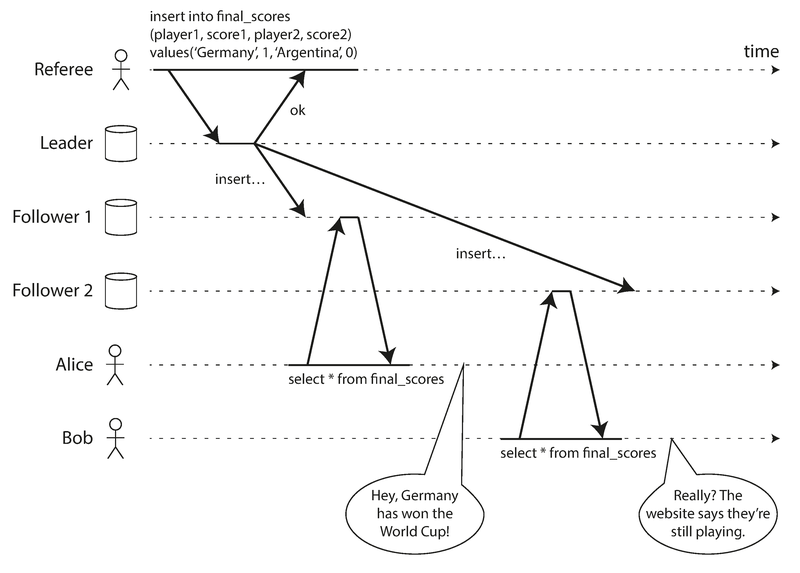
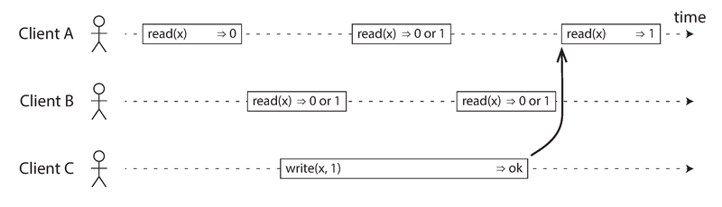
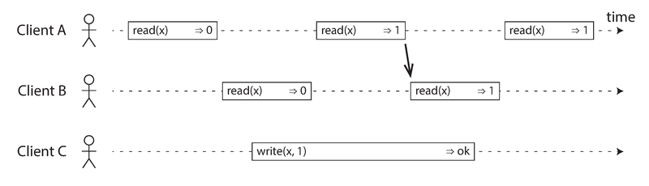
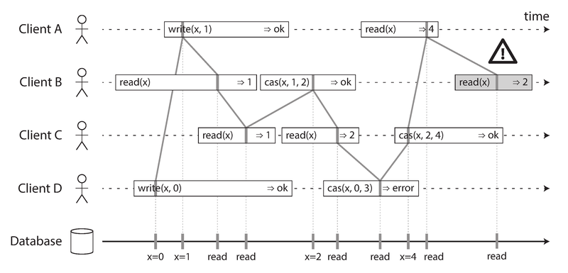
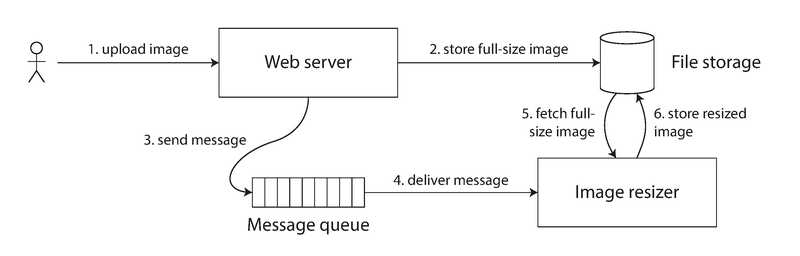
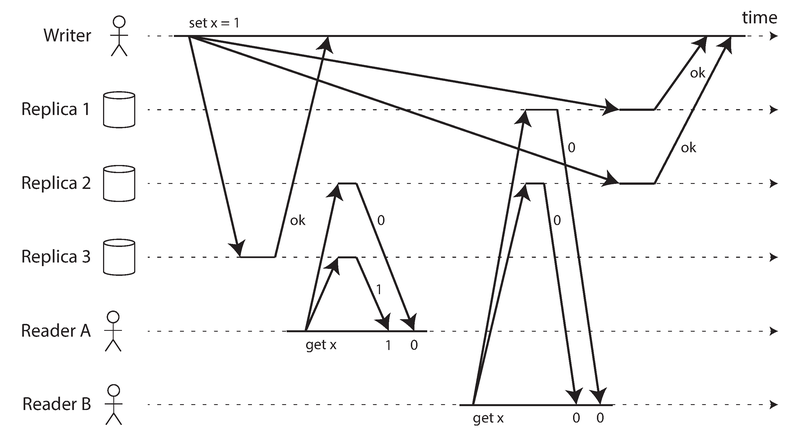
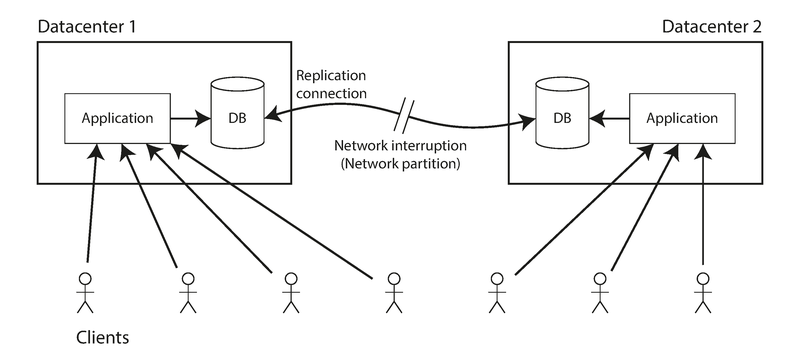
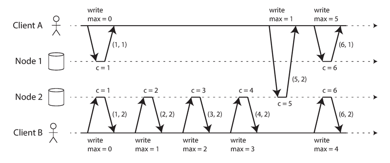
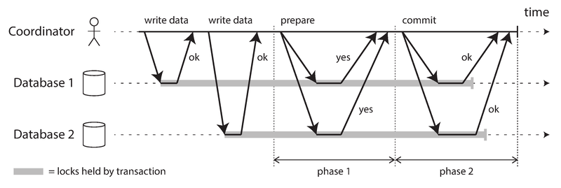
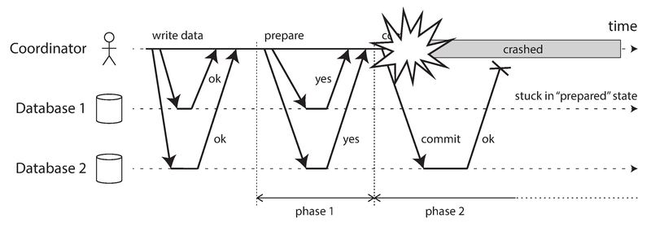

# 模块 09：一致性与共识

> 对应 Chapter 9: Consistency and Consensus
> Part II 分布式数据

---

## 概念地图

- **核心概念** (必须内化): Linearizability（线性一致性）、Total Order Broadcast（全序广播）、Consensus（共识）——这三者在数学上等价
- **实操要点** (动手时需要): 2PC 的阻塞风险与应对、ZooKeeper/etcd 的使用场景、Linearizability vs Serializability 的区分
- **背景知识** (扩展理解): CAP 定理的真正含义与局限、Lamport 时间戳、FLP 不可能性定理、因果一致性

---

## 概念讲解

### 1. 一致性保证（Consistency Guarantees）

分布式系统中，不同节点在同一时刻看到的数据可能不同——无论使用哪种复制方式（主从、多主、无主），这种不一致都不可避免。

大多数复制数据库至少提供**最终一致性（Eventual Consistency）**：如果你停止写入并等待足够长的时间，所有副本最终会收敛到相同的值。一个更好的名字是**收敛性（Convergence）**。

但最终一致性是一个非常弱的保证：
- 它不告诉你**什么时候**副本会收敛
- 在收敛之前，读操作可能返回任何值
- 它跟我们写单线程程序时"写了一个变量立刻就能读到"的直觉完全不同

> 📎 **关联**：Ch5 "复制延迟的问题"中讨论了最终一致性带来的三种异常——读己之写、单调读、前缀一致读。本章会介绍比这些更强的保证。

本章从弱到强，逐步探索：分布式一致性模型 → 线性一致性 → 顺序保证 → 共识。它们之间有深刻的联系。

> **注意区分两种"一致性"**：事务隔离（Ch7）主要解决**并发事务**之间的竞态条件问题；分布式一致性（本章）主要解决**副本之间**面对延迟和故障时的状态协调问题。两者独立但可叠加。

---

### 2. 线性一致性（Linearizability）

#### 2.1 核心思想

线性一致性的目标是给应用一个幻觉：**系统中只有一份数据的拷贝，所有操作都是原子的**。

换个说法：即使底层有多个副本，应用也不需要操心——系统表现得就像一个单线程程序中的变量，写入后立刻对所有人可见。

线性一致性也叫 atomic consistency、strong consistency、immediate consistency 或 external consistency。它的核心是一个**新近性保证（recency guarantee）**——一旦一个写入完成，所有后续读操作都必须看到新值。



> **图说**：Alice 和 Bob 在看世界杯决赛。Alice 刷新页面看到了比分结果，兴奋地告诉 Bob。Bob 点了刷新，但他的请求被路由到一个落后的副本，显示比赛还在进行中。这就是线性一致性的违反——Bob 的请求**发生在** Alice 的请求之后（因为他听到了 Alice 的惊呼），理应看到至少和 Alice 一样新的数据。

#### 2.2 什么让系统线性一致？

看三张递进的时序图来理解：

**基本规则**：



> **图说**：Client C 把 x 从 0 写为 1。A 的第一次读（在写之前）必须返回 0；A 的最后一次读（在写之后）必须返回 1；与写操作时间重叠的读可以返回 0 或 1。

**关键约束**——一旦有人读到新值，后续所有读都必须返回新值：



> **图说**：Client A 先读到了新值 1。此后 B 的读严格在 A 之后开始，所以 B 也必须返回 1，即使 C 的写操作尚未完成。想象数据在某个原子时刻从 0 翻转到 1——翻转后就不能再倒退。

**完整例子**（含 compare-and-set）：



> **图说**：四个客户端对 x 做读、写、CAS 操作。每个操作在时间条内有一个"生效点"（垂直线）。把这些生效点按时间顺序连线，线条只能向右走，不能向左回退。底部 Database 行显示了 x 值的变化：0 → 1 → 2 → 4。B 最后的读（灰色）返回 2，但 A 已经读到了 4，所以 B 不应该还能看到 2——这一步违反了线性一致性。

#### 2.3 Linearizability vs Serializability（关键区分！）

这两个概念极易混淆，但它们是完全不同的东西：

| 维度 | Serializability（可串行化） | Linearizability（线性一致性） |
|------|---------------------------|----------------------------|
| **是什么** | 事务的**隔离**属性 | 寄存器（单个对象）的**新近性**保证 |
| **作用域** | 多对象、多操作的事务 | 单个对象的读写 |
| **保证什么** | 事务的效果等价于某种串行执行顺序 | 读总是返回最新写入的值 |
| **顺序要求** | 串行顺序可以与实际执行顺序不同 | 必须尊重操作的实际时间（实时顺序） |
| **不能防止** | — | 写偏斜（Write Skew）等多对象问题 |
| **不能保证** | 新近性（可能读到旧快照） | — |

两者**可以组合**，叫 **strict serializability**（严格可串行化）或 strong-1SR。基于 2PL 或真串行执行的实现通常同时满足两者。但 **SSI 不是线性一致的**——它读的是一致性快照，而快照本身就不包含最新写入。

> 📎 **关联**：Ch7 "可串行化"讨论了 Serializability 的三种实现方式（真串行、2PL、SSI），本章补充了它与 Linearizability 的关系。

#### 2.4 什么时候需要线性一致性？

**需要的场景：**

1. **加锁与领导者选举**：分布式锁必须是线性一致的——所有节点必须对"谁持有锁"达成一致。ZooKeeper 和 etcd 正是用共识算法实现了线性一致的锁服务。

2. **唯一性约束**：用户名不能重复注册、文件路径不能冲突——本质上相当于"获取锁"，需要线性一致的 compare-and-set。

3. **跨通道时序依赖**：当系统中有多条通信通道时（如 Alice 的声音 + 数据库复制），非线性一致的系统可能产生竞态条件。



> **图说**：Web server 先把图片写入文件存储（步骤 2），然后通过消息队列通知 resizer（步骤 3-4）。如果消息队列比文件存储的内部复制更快，resizer 可能读到旧版本甚至空文件。如果文件存储是线性一致的，这个问题不会发生。

**不需要的场景：**
- 体育比分延迟几秒显示？通常可以接受
- 外键约束、属性约束？不需要线性一致性
- 航班超售？很多业务场景中可以用补偿事务处理

#### 2.5 各种复制方式的线性一致性

| 复制方式 | 线性一致性 | 说明 |
|---------|-----------|------|
| 单主复制 | **可能**（但不一定） | 从主节点读可以；但异步复制 + failover 可能丢数据；快照隔离也会破坏 |
| 共识算法 | **是** | ZooKeeper (Zab)、etcd (Raft) 正是这么做的 |
| 多主复制 | **不是** | 多个节点并发接受写入，必然有冲突 |
| 无主复制 | **大概不是** | 即使满足 w+r>n 的 quorum，也可能出现非线性一致读 |

Quorum 读写为什么不够？看这个例子：



> **图说**：n=3, w=3, r=2。Writer 把 x 从 0 改为 1，写给所有三个副本。Reader A 从两个副本读到新值 1；Reader B 也从两个副本读，但读到的都是旧值 0。B 的读发生在 A 的读之后，却返回了旧值——违反线性一致性。因为不同副本更新的时间不同，quorum 不能保证实时一致。

#### 2.6 线性一致性的代价

**CAP 定理的真正含义：**



> **图说**：两个数据中心之间的网络中断。如果用单主复制（线性一致），连不到主节点的数据中心就无法处理读写——变得不可用。如果用多主复制（放弃线性一致），两个数据中心可以各自继续工作，等网络恢复后再同步。

核心权衡：
- **要线性一致性** → 网络分区时，断开的副本不能响应请求（不可用）
- **不要线性一致性** → 网络分区时，每个副本可以独立工作（可用但不一致）

> **作者观点**：CAP 定理常被表述为"一致性、可用性、分区容错：三选二"，这种说法是**误导的**。网络分区不是你能选择的——它是一种故障，必然会发生。正确的理解是：**当发生网络分区时，你必须在一致性和可用性之间选择**。一个更好的表述是 "Consistent or Available when Partitioned"。CAP 的正式定义非常狭窄（只考虑线性一致性这一种模型、只考虑网络分区这一种故障），对实际系统设计的指导意义有限。CAP is best avoided.

**性能才是主因**：实际上，大多数系统放弃线性一致性不是因为容错，而是因为**性能**。Attiya 和 Welch 证明了：线性一致的读写响应时间至少与网络延迟的不确定性成正比。在高延迟网络中（如跨地域部署），这代价太高。连多核 CPU 的内存模型都不是线性一致的——每个核有自己的缓存，异步写回主内存。

> **2026 年更新**：在 Spanner 之后，CockroachDB、YugabyteDB、TiDB 等 NewSQL 数据库都支持了跨数据中心的线性一致性事务（基于 Raft 共识 + 混合逻辑时钟）。但跨区域部署时，延迟仍然是不可避免的代价——用户需要根据业务需求权衡。

---

### 3. 顺序保证（Ordering Guarantees）

线性一致性隐含了一个全局的操作顺序。顺序（ordering）是贯穿全书的关键主题：

> 📎 **关联**：
> - Ch5：主节点决定复制日志中写操作的顺序
> - Ch7：可串行化意味着事务按某种串行顺序执行
> - Ch8：时间戳和时钟是给混乱的分布式世界引入顺序的尝试

#### 3.1 因果顺序 vs 全序

**全序（Total Order）**：任意两个元素都可以比较大小。比如自然数——5 和 13，总能说出谁大。

**偏序（Partial Order）**：有些元素不可比较。比如集合 {a, b} 和 {b, c}，谁也不是谁的子集。

这两种序对应两种一致性模型：

| | 全序（Total Order） | 偏序（Partial Order） |
|---|---|---|
| **模型** | Linearizability | Causal Consistency |
| **操作关系** | 所有操作都排在一条时间线上 | 有因果关系的操作有序，无关的操作可以并发 |
| **类比** | 一条单行道 | Git 的版本历史（分支 + 合并） |

线性一致性比因果一致性**更强**：任何线性一致的系统自动保持因果一致性。但反过来不成立。

**好消息**：因果一致性是最强的"不受网络延迟影响、在网络故障时仍可用"的一致性模型。它是 CAP 定理的"甜蜜点"——比线性一致性弱，但比最终一致性强得多。

> 📎 **关联**：Ch5 "检测并发写入"中的 happened-before 关系就是因果关系的表达——A happened before B 意味着 B 可能依赖于 A。

#### 3.2 Lamport 时间戳

如何在没有单一领导者的分布式系统中生成一致的操作顺序？

**错误的方案**（常见但有缺陷）：
- 奇偶编号：节点 1 用奇数、节点 2 用偶数 → 无法反映跨节点因果顺序
- 物理时钟时间戳 → 时钟偏移导致顺序不一致
- 预分配序号块 → 块间无法保证因果顺序

**正确的方案——Lamport 时间戳**（Leslie Lamport, 1978）：

每个时间戳是一个 `(counter, nodeID)` 对。关键规则：**每个节点和客户端追踪它见过的最大 counter 值，并在每次请求中附带这个最大值。收到更大 counter 的节点立即更新自己的 counter。**



> **图说**：Client A 从 Node 2 收到 counter=5，然后把 max=5 发给 Node 1。Node 1 此时自己的 counter 只有 1，立即跳到 5，下一个操作的 counter 就是 6。这样保证了：如果操作 A 因果在 B 之前，那么 A 的 Lamport 时间戳一定小于 B 的。

**Lamport 时间戳 vs 版本向量（Version Vector）**：
- Lamport 时间戳：给出全序，更紧凑；但**无法区分**两个操作是并发的还是有因果关系
- 版本向量：给出偏序，**能区分**并发和因果；但更大（每个节点一个分量）

#### 3.3 时间戳排序为什么不够

Lamport 时间戳定义了一个与因果一致的全序——但这个全序**只有在事后收集了所有操作之后才能确定**。

例子：两个用户同时注册同一个用户名。事后看 Lamport 时间戳可以决定谁先来——但**实时地**，一个节点收到注册请求时，它不知道另一个节点此刻是否也在处理同名注册。要确认这一点，就必须检查每个其他节点——如果有节点挂了或网络不通，系统就卡住了。

**结论**：仅有全序不够，还需要知道**这个顺序什么时候是最终确定的（finalized）**。这引出了全序广播。

#### 3.4 全序广播（Total Order Broadcast）

全序广播（也叫 atomic broadcast）是一个节点间交换消息的协议，满足两个性质：

1. **可靠投递（Reliable delivery）**：消息投递给一个节点，就投递给所有节点
2. **全序投递（Totally ordered delivery）**：所有节点以相同顺序收到消息

全序广播的用途：
- **数据库复制**：每条消息是一次写操作，所有副本按同顺序执行 → 状态机复制（State Machine Replication）
- **可串行化事务**：每条消息是一个确定性事务，按同顺序执行 → 所有分区/副本保持一致
- **分布式锁 / Fencing Token**：请求加入日志，序号即为 fencing token（ZooKeeper 的 zxid）

> **关键区别**：全序广播中的顺序**在投递时就已确定**（不能事后插入），而 Lamport 时间戳的顺序只有事后才能确定。这让全序广播比时间戳排序更强大。

#### 3.5 线性一致性、全序广播、共识：三位一体

这三者在数学上**等价**——解决了其中任何一个，就能转化为其他两个的解。

**全序广播 → 线性一致存储**：

用全序广播实现 linearizable compare-and-set（以用户名注册为例）：
1. 向日志追加一条消息："我要注册用户名 X"
2. 等这条消息投递回来
3. 检查日志中第一条注册用户名 X 的消息是不是自己的。是 → 成功；不是 → 放弃

> 注意：这个过程确保了**线性一致写**，但读可能是过期的（从异步更新的存储中读）。要实现线性一致读，可以：(a) 也通过日志排队读请求（etcd 的 quorum read）；(b) 获取最新日志位置，等该位置投递后再读（ZooKeeper 的 sync()）；(c) 从同步更新的副本读（chain replication）。

**线性一致存储 → 全序广播**：

如果有一个线性一致的整数寄存器（支持 atomic increment-and-get），那么：为每条要广播的消息做一次 increment-and-get 获取序号，按序号顺序投递消息。因为序号没有间隙（1, 2, 3...），节点收到 6 号但没收到 5 号时会等待。

**但是**——实现一个容错的线性一致 increment-and-get 本身就需要共识算法。所以这三个问题绕了一圈，最终都指向共识。

---

### 4. 分布式事务与共识

共识（Consensus）是分布式计算中最重要、最基本的问题之一。目标很简单：**让若干节点对某件事达成一致**。但实现起来极其困难，许多系统因为低估了这个问题的难度而出错。

需要共识的场景：
- **领导者选举**：单主复制中，所有节点必须同意谁是 leader，否则脑裂
- **原子提交**：分布式事务中，所有节点必须同意提交还是回滚

> **FLP 不可能性定理**：Fischer, Lynch, Paterson (1985) 证明了在异步系统模型中（没有时钟、没有超时），只要有一个节点可能崩溃，就不存在总能达成共识的确定性算法。但如果允许使用超时（或随机数），共识就可解了。所以现实中的共识算法都依赖超时来检测故障。

#### 4.1 原子提交与两阶段提交（2PC）

**单节点原子提交**很简单：写数据到 WAL，最后写 commit record。crash 后根据 commit record 是否存在决定提交还是回滚。关键的"不可逆转点"就是 commit record 写入磁盘的那一刻。

**多节点原子提交**不能简单地各自提交——可能有的节点成功有的失败（约束冲突、网络丢失、crash），而**一旦提交就不可撤回**（其他事务可能已经依赖了提交的数据）。

**两阶段提交（2PC）**的流程：



> **图说**：Coordinator 先发 prepare 请求（phase 1），所有参与者回复 yes/no。如果全部 yes，Coordinator 发 commit 请求（phase 2）。灰色条表示事务持有锁的时间。

> **不要混淆 2PC 和 2PL**：两阶段**提交**（2PC）实现分布式原子提交；两阶段**锁**（2PL）实现可串行化隔离。它们完全不同，只是名字碰巧都有"两阶段"。

**2PC 的承诺机制**（类比：婚礼仪式）：

| 阶段 | 动作 | 不可逆转点 |
|------|------|-----------|
| 准备前 | 参与者可以自由中止 | — |
| Phase 1 | 参与者收到 prepare，确认能提交 → 回复 "yes" | 参与者投 yes 后，**放弃了单方面中止的权利**（但 coordinator 仍可中止） |
| 决策点 | Coordinator 将决定写入自己的事务日志（磁盘） | **Coordinator 的决定不可逆转** |
| Phase 2 | Coordinator 发 commit/abort 给所有参与者。失败就无限重试 | — |

类比：在婚礼上，新郎新娘各自说"I do"（prepare + vote yes），牧师宣布"你们结为夫妻"（coordinator commit）。说了"I do"之后就不能反悔了；牧师宣布之后即使你昏倒了也改变不了结婚的事实。

#### 4.2 协调者故障



> **图说**：Coordinator 在发出 commit 给 Database 2 之后 crash 了，Database 1 没收到决定。Database 1 已经投了 yes（不能单方面中止），也不知道该提交还是回滚——陷入 "in doubt"（存疑）状态。它只能**等待 coordinator 恢复**。

这是 2PC 最大的问题——**阻塞**。in-doubt 的事务会**持有锁**，阻塞其他事务。如果 coordinator 的日志丢了，这些锁可能永远不释放，只能由管理员手工干预。

**三阶段提交（3PC）**理论上可以避免阻塞，但它假设网络延迟有上限且节点响应时间有上限——在现实的不可靠网络中无法保证原子性。实际上，非阻塞原子提交需要一个**完美的故障检测器**（能可靠地判断节点是否 crash），而这在有网络延迟的系统中不存在。

#### 4.3 分布式事务的实践

分布式事务分两种：

| 类型 | 参与者 | 优化空间 | 问题 |
|------|--------|---------|------|
| **数据库内部分布式事务** | 同一数据库的不同节点 | 可以做针对性优化 | 通常表现不错 |
| **异构分布式事务** | 不同技术（如 DB + 消息队列） | 受限于最低公分母 | 问题多多 |

**XA 事务**是异构两阶段提交的标准（1991），被 PostgreSQL、MySQL、Oracle、ActiveMQ 等广泛支持。它是一个 C API（Java 中通过 JTA 封装），coordinator 通常作为库嵌入应用进程中。

XA 的核心问题：
1. **Coordinator 是单点故障**——它 crash 后，所有 in-doubt 事务持有的锁都被卡住
2. **Coordinator 的日志必须持久化**——应用服务器不再是无状态的
3. **最低公分母**——无法跨系统检测死锁，无法实现分布式 SSI
4. **放大故障**——任何一个参与者出问题，整个事务失败

> **作者观点**：异构分布式事务确实解决了重要的一致性问题（比如消息队列 + 数据库的 exactly-once 处理），但代价太高。Chapter 11 和 12 会讨论更好的替代方案。

> 📎 **关联**：Ch11 会介绍基于日志（CDC、event sourcing）的方法来替代分布式事务实现跨系统一致性。

#### 4.4 容错共识（Fault-Tolerant Consensus）

共识的形式化定义——所有节点提议值，算法从中选择一个：

| 性质 | 含义 | 类型 |
|------|------|------|
| **Uniform Agreement** | 没有两个节点做出不同的决定 | 安全性 |
| **Integrity** | 没有节点决定两次 | 安全性 |
| **Validity** | 决定的值是某个节点提议的 | 安全性 |
| **Termination** | 所有未崩溃的节点最终会做出决定 | 活性 |

前三条（安全性）在任何情况下都必须满足——即使大多数节点故障。Termination（活性）需要**至少多数节点正常工作**。

**2PC 不满足 Termination**：coordinator crash 后参与者可能永远等下去。2PC 的 coordinator 相当于一个"独裁者"——不是通过选举产生的。

**主流共识算法**：
- **VSR**（Viewstamped Replication）
- **Paxos**（Lamport, 1998）——最早、最著名，但以难以理解闻名
- **Raft**（Ongaro & Ousterhout, 2014）——为可理解性而设计
- **Zab**（ZooKeeper Atomic Broadcast）

> **2026 年更新**：Raft 已成为工业界共识算法的事实标准。etcd（Kubernetes 的基础）、CockroachDB、TiKV、Consul 都使用 Raft。Paxos 的各种变体（Multi-Paxos）仍在 Google 内部（Spanner、Chubby）广泛使用。近年来的研究方向包括 Flexible Paxos（放宽 quorum 要求）和 EPaxos（无需固定 leader）。

#### 4.5 共识算法与全序广播

实际上，上述共识算法不是决定单个值，而是决定**一系列值**——这使它们成为全序广播算法。每一轮共识对应一条消息的投递：节点提议下一条要投递的消息，算法决定投递顺序。

全序广播 = 反复进行多轮共识。所以 Raft、Zab 直接实现全序广播，Paxos 的优化版本叫 Multi-Paxos。

#### 4.6 Epoch 编号与 Quorum

所有共识算法内部都使用某种形式的 leader——但不保证 leader 唯一，而是用 **epoch number** 来区分：

| 算法 | Epoch 的名称 |
|------|-------------|
| Paxos | ballot number |
| Viewstamped Replication | view number |
| Raft | term number |

每次当前 leader 被认为失效，就发起投票选新 leader，epoch +1。高 epoch 的 leader 压过低 epoch 的。

**两轮投票**：
1. 选 leader（需要 quorum）
2. leader 的每个提案需要 quorum 批准

关键：**这两个 quorum 必须有交集**——这保证了如果一个提案通过，至少有一个节点参与了最近的 leader 选举，从而确保没有更高 epoch 的 leader。

**vs 2PC 的区别**：

| | 2PC | 共识算法 |
|---|---|---|
| Coordinator/Leader | 不选举，固定指定 | 通过投票选举 |
| 需要的票数 | 全部参与者 | 多数即可 |
| 故障恢复 | 只能等 coordinator 恢复 | 选新 leader 继续工作 |

#### 4.7 共识算法的局限

1. **投票本质是同步复制** → 写入性能受网络延迟影响
2. **需要严格多数** → 3 节点容忍 1 故障，5 节点容忍 2 故障
3. **固定成员假设** → 动态加减节点是更复杂的扩展问题
4. **依赖超时检测故障** → 网络抖动可能导致频繁 leader 切换（"选举风暴"），系统在切换期间无法工作

> **作者观点**：Raft 存在一种边界情况——如果网络中有一条链路持续不稳定，可能导致领导权在两个节点之间反复弹跳，系统完全无法推进。设计更健壮的共识算法仍然是开放的研究问题。

---

### 5. 成员与协调服务（ZooKeeper）

ZooKeeper 和 etcd 常被描述为"分布式键值存储"，但它们不适合做通用数据库。它们设计用来存放**少量的、变化缓慢的协调数据**（如"谁是 leader"、"分区分配给哪个节点"），并在 3-5 个节点上通过全序广播达成共识。

ZooKeeper 提供的核心能力：

| 能力 | 说明 | 需要共识？ |
|------|------|-----------|
| **线性一致的原子操作** | compare-and-set 实现分布式锁 | 是 |
| **操作全序** | 每个操作有递增的 zxid / cversion，可做 fencing token | 否（但依赖全序广播） |
| **故障检测** | 客户端与服务器通过心跳维护 session；session 超时时自动释放临时节点（ephemeral node） | 否 |
| **变更通知** | 客户端可以 watch 键的变化，无需轮询 | 否 |

虽然只有线性一致的原子操作真正需要共识，但正是这些能力的**组合**使 ZooKeeper 对分布式协调如此有用。

**典型用法**：
- **Leader 选举**：多个进程竞争创建同一个 ephemeral node，成功的就是 leader；leader crash 后 session 超时、node 消失，其他节点收到通知后重新竞选
- **分区分配**：记录哪个分区归哪个节点处理，节点加入/离开时触发再平衡
- **服务发现**：服务启动时注册自己的地址（不一定需要共识——DNS 也行，虽然不是线性一致的但通常够用）

> 📎 **关联**：Ch5 "处理节点宕机"讨论了 leader 选举和 failover。Ch6 "分区再平衡"讨论了分区分配。ZooKeeper 正是这些场景中常用的协调服务。

> **2026 年更新**：Kubernetes 的核心就是 etcd（基于 Raft），它承担了集群所有配置和状态的一致性存储。Kafka 从 2.8 版本开始用内置的 KRaft 替代 ZooKeeper 作为元数据管理层。HashiCorp Consul 同时提供服务发现和分布式锁。

---

### 6. 全局总览：等价关系

本章最深刻的洞察是：以下问题在数学上**可以互相归约**，解决了一个就能解决所有：

```
线性一致的 compare-and-set 寄存器
        ⟺
    全序广播
        ⟺
      共识
        ⟺
   原子事务提交
        ⟺
    分布式锁/租约
        ⟺
 成员服务/故障检测
        ⟺
    唯一性约束
```

在单节点上，这些问题都很简单。在分布式环境下如果你愿意接受单点 leader，也不难——但 leader 挂了系统就停。要在容错的前提下解决这些问题，你需要共识算法。

**三种处理 leader 故障的方式**：
1. **等它恢复**（很多 XA/JTA coordinator 选这条路）→ 不满足 termination
2. **人工切换**（很多关系数据库的做法）→ "上帝共识"，速度取决于人
3. **算法自动选新 leader**（ZooKeeper, etcd, Raft）→ 这就是共识算法

> **作者观点**：不是所有系统都需要共识。无主复制和多主复制的系统故意放弃了全局共识——它们的冲突（Ch5）正是没有共识的后果。但也许我们可以学会与分支、合并的数据历史共处，正如 Git 所展示的那样。

---

## 重点标记

### 最容易搞混的概念

| 对比项 | A | B | 关键区分 |
|--------|---|---|---------|
| Linearizability vs Serializability | 单对象的新近性保证 | 多对象事务的隔离保证 | 前者关注"读到最新"，后者关注"等价串行" |
| 全序 vs 偏序 | 线性一致 → 所有操作可排序 | 因果一致 → 只有因果相关的操作可排序 | Git 历史就是偏序 |
| 2PC vs 共识 | 需要全票，coordinator 不选举 | 只需多数票，leader 选举产生 | 2PC 会阻塞，共识不会 |
| 2PC vs 2PL | 分布式原子提交协议 | 可串行化隔离的加锁机制 | 名字像，完全无关 |
| Lamport 时间戳 vs 版本向量 | 全序，紧凑 | 偏序，能区分并发 | 用途不同 |

### 本章核心因果链

```
最终一致性太弱
    ↓ 需要更强保证
线性一致性：看起来只有一份数据
    ↓ 但代价太高（性能、可用性）
因果一致性：保留因果关系，放松全序要求
    ↓ Lamport 时间戳可以捕获因果
但全序只有事后才能确定
    ↓ 需要实时的全序
全序广播：消息按固定顺序投递给所有节点
    ↓ 等价于
共识：节点就决策达成一致
    ↓ 实现：Raft、Paxos、Zab
落地：ZooKeeper / etcd 提供"外包的共识服务"
```

---

## 自测：你真的理解了吗？

### Q1：跨通道竞态

你的系统有一个图片上传服务和一个异步缩略图生成服务。用户上传图片后，Web server 把图片写入 S3，然后发一条消息到 Kafka 让 resizer 生成缩略图。测试中发现偶尔 resizer 从 S3 读到空文件。为什么？你会怎么解决？

<details>
<summary>参考答案</summary>

这是 Figure 9-5 描述的跨通道时序依赖问题。Kafka 消息投递可能比 S3 内部复制快——当 resizer 收到消息时，S3 还没把文件复制到 resizer 读的那个副本。

解决方案（任选）：
1. 使用线性一致的存储（但 S3 的强一致性读 [2020 年后已支持] 可以直接解决）
2. 在 Kafka 消息中携带版本号/ETag，resizer 读到不匹配时重试
3. resizer 收到消息后延迟一小段时间再读（简单但不可靠）
4. 不走两条通道——把图片数据直接放在消息里（但大文件不适合）
</details>

### Q2：Quorum 陷阱

你的团队使用一个 Dynamo 风格的数据库（n=5, w=3, r=3），有人说"w+r>n 保证了强一致性"。你同意吗？为什么？

<details>
<summary>参考答案</summary>

不同意。w+r>n 只保证读写 quorum 有交集（至少一个节点同时参与了读和写），但**不保证线性一致性**。如 Figure 9-6 所示，由于各副本的更新时间不同，reader A 可能从交集节点读到新值，而稍后的 reader B 从不同的 quorum 读到旧值。

此外：
- 使用 LWW（Last Write Wins）的系统（如 Cassandra）因为时钟偏移几乎肯定不是线性一致的
- Sloppy quorum 更是完全放弃了一致性保证
- 即使做同步 read repair 也无法实现线性一致的 compare-and-set（那需要共识算法）
</details>

### Q3：2PC 的致命弱点

你在一个使用 XA 事务（跨 MySQL 和 ActiveMQ）的系统中工作。周五晚上，运行 coordinator 的应用服务器硬盘损坏，coordinator 日志丢失。此时有 3 个 in-doubt 事务。会发生什么？你会怎么处理？

<details>
<summary>参考答案</summary>

**会发生什么**：3 个 in-doubt 事务在 MySQL 和 ActiveMQ 中持有锁但无法提交或回滚。这些锁会阻塞其他事务访问相关数据行和消息队列。如果不干预，被阻塞的事务会越来越多，系统可能大面积不可用。

**处理方式**：
1. 管理员需要手动检查每个 in-doubt 事务的各参与者状态——如果有任何参与者已经提交，就手动让其他参与者也提交；如果都还没提交，就让它们全部回滚
2. 可以使用各数据库的"heuristic decision"（启发式决策）功能——让参与者单方面决定提交或回滚。但这可能**破坏原子性**（名为 heuristic，实为赌博）
3. 长期改进：让 coordinator 的日志做高可用（如写到复制存储上），或者考虑用基于日志的方案（如 CDC + event sourcing）替代 XA 事务

这个场景说明了为什么作者说"coordinator 本身就是一个数据库，要像对待数据库一样认真对待它的可用性"。
</details>

### Q4：共识 vs 2PC

你需要向一位同事解释为什么 Raft 能在 leader crash 后继续工作，而 2PC 的 coordinator crash 后却不能。请用"投票 + quorum"的概念解释。

<details>
<summary>参考答案</summary>

核心区别在于**投票规则**和**leader 的产生方式**：

**2PC**：
- Coordinator 不是选举产生的，是预先指定的"独裁者"
- 需要**所有**参与者投 yes 才能提交（全票制）
- Coordinator crash 后，参与者不知道该提交还是回滚，也没有规则来产生新的 coordinator → 只能等

**Raft**：
- Leader 通过 quorum 投票选举产生
- 每个提案只需要**多数**节点同意（多数制）
- Leader crash 后，其他节点会检测到心跳超时，增加 term number 并发起新一轮选举。因为只需要多数节点参与，少数节点的故障不会阻塞系统
- 新 leader 通过 quorum 交集的保证，能恢复之前的状态继续工作

本质上：2PC 是 100% 投票率才能决策的制度（一票否决），Raft 是 >50% 投票率就能决策的制度（多数决）。前者一个人缺席就瘫痪，后者只要大多数在就能运转。
</details>

### Q5：你该用什么？

你正在设计一个电商系统。以下场景各应该用什么一致性保证？说出理由。
- (a) 商品详情页展示价格
- (b) 订单号生成（必须全局唯一）
- (c) 库存扣减（避免超卖）
- (d) 用户购物车

<details>
<summary>参考答案</summary>

**(a) 商品详情页展示价格** → **最终一致性**即可。价格延迟几秒更新不影响业务正确性，但需要在用户下单时校验（以下单时刻为准）。

**(b) 订单号生成** → 需要**唯一性约束**，这等价于共识问题。实践中可以用：Snowflake ID（包含机器 ID 避免冲突，无需共识）、数据库 auto-increment（单点生成）、或基于共识的分布式 ID 服务。具体取决于对全局递增的要求强度。

**(c) 库存扣减** → 理想情况下需要**线性一致的 compare-and-set**（读当前库存、检查 > 0、原子扣减）。实践中可以用：单节点上的事务（最简单）、分布式锁、或共识算法。如果业务可以容忍偶尔超卖后补偿（如退款/换货），也可以用更弱的保证。

**(d) 用户购物车** → **最终一致性**足够。购物车是个人数据，不存在跨用户冲突。即使有多设备并发修改购物车的情况，可以用 CRDT 或 LWW 做冲突合并。
</details>
