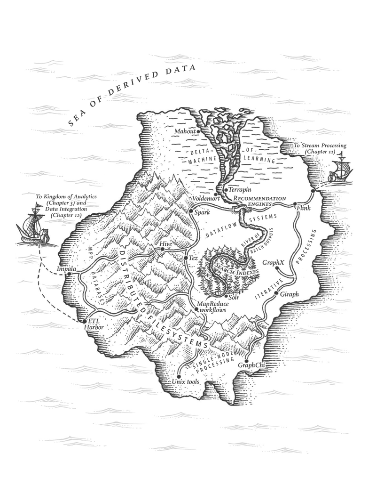
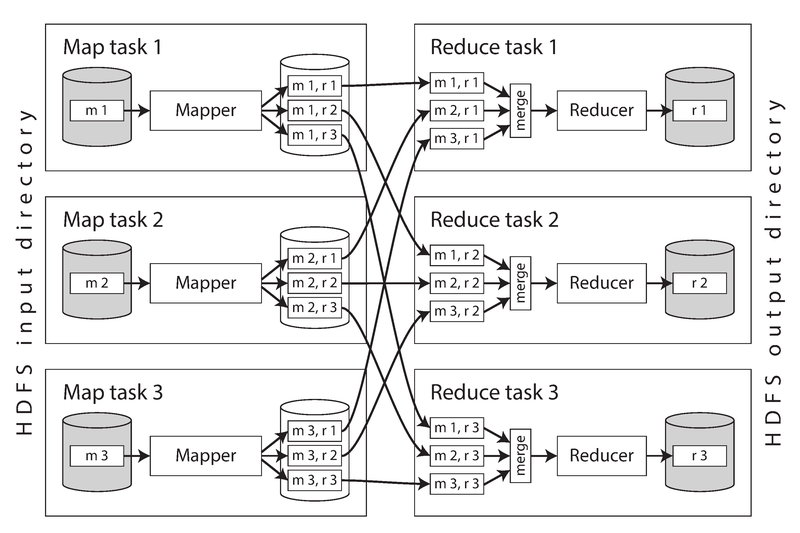
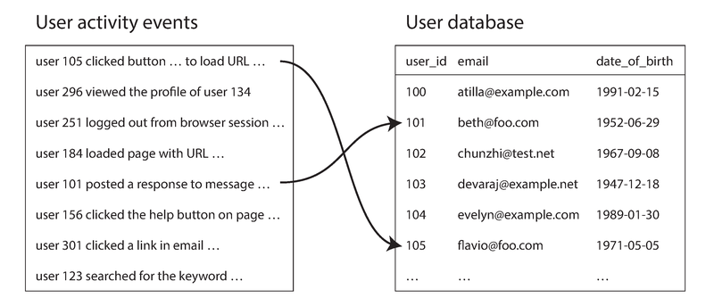
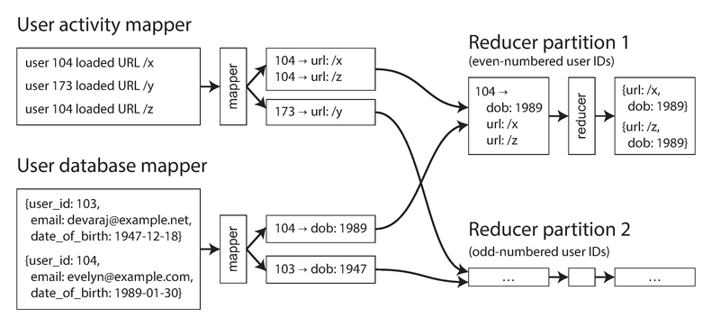

# 模块 10：批处理

> 对应 Chapter 10: Batch Processing
> Part III 派生数据

---

## 概念地图

- **核心概念** (必须内化): Unix 哲学与可组合性、MapReduce 编程模型、Shuffle 与分区、Reduce-side Join vs Map-side Join、中间状态物化问题、Dataflow 引擎（Spark/Tez/Flink）
- **实操要点** (动手时需要): Sort-merge join 实现机制、Broadcast hash join / Partitioned hash join 选择条件、批处理输出策略（构建索引 vs 写 KV 存储）、热键（skew）处理
- **背景知识** (扩展理解): Pregel 图处理模型、MPP 数据库与 Hadoop 对比、声明式 API 的演进方向



> **图说**：Martin Kleppmann 画的"派生数据之海"地图。岛屿的南端是 Unix tools 和单机处理（GraphChi），中部山脉是分布式文件系统（HDFS），山中有 MapReduce workflows、Hive、Tez、Spark。北部海岸通往流处理（Chapter 11），西侧 ETL Harbor 连接分析王国（Chapter 3）和数据集成（Chapter 12）。右侧半岛是迭代处理区（Giraph、GraphX）。

---

## 概念讲解

### 1. 三种系统类型：在线、离线、近实时

本章开篇，Kleppmann 把所有数据系统分为三类：

| 类型 | 英文 | 核心指标 | 特点 |
|------|------|---------|------|
| **在线服务** | Online / Services | 响应时间（Response Time） | 用户等待结果，追求低延迟 |
| **批处理** | Batch / Offline | 吞吐量（Throughput） | 处理有界数据集，没人等结果，追求处理速率 |
| **流处理** | Stream / Near-real-time | 延迟 + 吞吐 | 介于两者之间，处理无界数据流 |

批处理是一种非常古老的计算范式——从 1890 年美国人口普查的 Hollerith 打孔卡片机，到 1940-50 年代的 IBM 卡片分类机，再到 Google 2004 年发表的 MapReduce 论文。历史总在重复。

> 📎 **关联**：Ch1 中讨论的"描述性能"指标（延迟 vs 吞吐）在这里变成了区分系统类型的关键维度。Ch11 将讨论流处理——批处理的"近实时"对应物。

---

### 2. Unix 哲学与批处理的起源

#### 2.1 一个日志分析的例子

假设你要从 nginx 访问日志中找出最热门的 5 个页面。用 Unix 管道一行搞定：

```bash
cat /var/log/nginx/access.log |
  awk '{print $7}' |       # 提取第 7 个字段（URL）
  sort |                    # 按 URL 字母排序
  uniq -c |                 # 合并相邻重复行并计数
  sort -r -n |              # 按计数降序排列
  head -n 5                 # 取前 5 行
```

输出：
```
4189 /favicon.ico
3631 /2013/05/24/improving-security-of-ssh-private-keys.html
2124 /2012/12/05/schema-evolution-in-avro-protocol-buffers-thrift.html
1369 /
 915 /css/typography.css
```

同样的逻辑也可以用 Ruby 写一个程序——用 Hash 表在内存中计数。两种方案的关键区别：

| 维度 | Unix 管道（sort） | Ruby 脚本（Hash 表） |
|------|------------------|---------------------|
| 工作集 | 取决于输入大小（sort 自动分片到磁盘） | 取决于不同 URL 的数量（必须全放内存） |
| 大数据扩展 | 好——GNU sort 自动溢写磁盘、多核并行 | 差——URL 太多就 OOM |
| 小数据效率 | 有排序开销 | 更快——O(n) vs O(n log n) |

> **关键洞察**：Unix `sort` 工具是"做好一件事"的典范——它比大多数编程语言标准库的排序实现更强（支持磁盘溢写、多线程并行），而且完全可以和其他工具组合使用。

#### 2.2 Unix 哲学的四条原则

Doug McIlroy（Unix 管道的发明者）在 1964 年提出了管道的概念，后来演化为 Unix 哲学（1978 年总结）：

1. **每个程序只做好一件事**——要做新工作就写新程序，而不是给老程序加"功能"
2. **每个程序的输出都能成为另一个程序的输入**——不要用花哨的格式，不要强制交互式输入
3. **尽早设计和构建软件**——不要犹豫扔掉笨重的部分重写
4. **优先用工具而非人力**——哪怕需要绕路去造工具

> **作者观点**：这些原则——自动化、快速原型、增量迭代、友好实验——听起来和今天的 Agile/DevOps 一模一样。四十年来真正变化的东西出人意料地少。

#### 2.3 Unix 的三大支柱

**统一接口**：在 Unix 中，一切都是文件（file descriptor）——文件、管道、socket、设备驱动都使用同一个字节序列接口。按惯例，大多数工具把输入视为 `\n` 分隔的 ASCII 文本行。这种统一性使得**任何程序都能和任何程序组合**。

**逻辑与接线分离**：程序使用 `stdin`/`stdout`，不关心数据从哪来、到哪去。Shell 用户负责"接线"——把一个程序的输出接到另一个程序的输入。这是一种**松耦合/控制反转**。

**透明性与可实验性**：
- 输入文件是不可变的——随便跑多少次都不会破坏输入
- 管道任何位置都可以 `| less` 检查中间结果
- 中间结果可以写到文件，后续步骤可以从文件重新开始

> **Unix 最大的局限**：只能在**单台机器**上运行。这就是 Hadoop 和 MapReduce 登场的原因。

---

### 3. MapReduce 与分布式文件系统

MapReduce 就像 Unix 工具的分布式版本——粗暴、直接，但效果惊人。

- Unix 工具：stdin/stdout 是输入/输出接口
- MapReduce：**分布式文件系统**（HDFS）是输入/输出接口

#### 3.1 HDFS 架构

HDFS（Hadoop Distributed File System）是 Google File System (GFS) 的开源实现。核心特征：

- **Shared-nothing 架构**：每台普通机器都贡献自己的磁盘，不需要专用存储设备
- **NameNode**：中央服务器，记录哪些文件块存在哪些机器上
- **DataNode**：每台机器上的守护进程，提供文件存储服务
- **容错**：文件块被**复制到多台机器**（或使用 Reed-Solomon 纠删码），类似 RAID 但跨机器

> 📎 **关联**：Ch5（复制）讨论了数据复制的原理。HDFS 的副本策略本质上和 Ch5 的多副本思路一致。

> **2026 年更新**：在云原生时代，对象存储（Amazon S3、Azure Blob Storage、Google Cloud Storage）在很大程度上取代了自建 HDFS 集群。Spark、Flink 等引擎现在可以直接读写 S3，不再需要维护 HDFS。但 HDFS 的设计思想——数据分块、副本容错、计算靠近数据——仍然是理解分布式存储的基础。

#### 3.2 MapReduce 作业执行

MapReduce 的数据处理模式和 Unix 管道高度类似：

| 步骤 | Unix 管道等价 | MapReduce |
|------|-------------|-----------|
| 1. 读输入，拆分为记录 | `cat` 读文件 | 读 HDFS 文件块，按行拆分 |
| 2. 调用 mapper，提取 key-value | `awk '{print $7}'` | 用户自定义 mapper 函数 |
| 3. 按 key 排序 | `sort` | **隐式排序**（框架自动完成） |
| 4. 调用 reducer，处理排序后的数据 | `uniq -c` | 用户自定义 reducer 函数 |

**Mapper**：对每条输入记录调用一次，提取 key-value 对。不保存状态，每条记录独立处理。
**Reducer**：接收相同 key 的所有 value 的迭代器，输出聚合结果。



> **图说**：一个包含 3 个 mapper 和 3 个 reducer 的 MapReduce 作业。左侧从 HDFS input directory 读取输入，每个 mapper (m1, m2, m3) 处理一个文件块。mapper 的输出按 key 的 hash 分区，排序后写到本地磁盘。reducer 从所有 mapper 拉取属于自己分区的数据，合并排序后调用 reducer 函数，输出写入 HDFS output directory。

**分布式执行的关键细节**：

1. **计算靠近数据**（putting the computation near the data）：scheduler 尽量把 map task 调度到存储输入文件副本的机器上，减少网络传输
2. **Shuffle**：mapper 输出按 key hash 分区 → 本地排序 → reducer 远程拉取并归并排序。这个"分区、排序、拷贝"的过程叫 **Shuffle**（虽然名字叫洗牌，但其实毫无随机性）
3. **map 任务数**由输入文件块数决定；**reduce 任务数**由用户配置
4. **输出原子性**：只有作业成功完成后输出才可见，失败则全部丢弃

#### 3.3 MapReduce 工作流

单个 MapReduce 作业能力有限（比如能统计每个 URL 的访问次数，但不能直接排出最热门 URL）。实际中通常需要**多个 MapReduce 作业串联**成工作流——前一个作业的输出目录就是下一个作业的输入目录。

与 Unix 管道的区别：MapReduce 工作流更像是"每个命令写临时文件，下一个命令读临时文件"，而不是真正的流式管道。这个设计有利有弊——详见后文"中间状态物化"。

> 工作流调度器：Oozie、Azkaban、Luigi、**Airflow**、Pinball。在大型组织中，50-100 个 MapReduce 作业的工作流（比如推荐系统）很常见。

> **2026 年更新**：Apache Airflow 已成为事实上的工作流编排标准。Oozie 和 Azkaban 基本退出历史舞台。新兴的 Prefect、Dagster 也在崛起。

---

### 4. Reduce-Side Join（归约侧 Join）

> 📎 **关联**：Ch2 讨论了 Join 的概念和必要性；Ch6 讨论了分区策略。本节展示 Join 在批处理中的具体实现。

#### 4.1 为什么需要批处理 Join？

MapReduce 没有索引——它做的是**全表扫描**（full table scan）。在分析场景下（对大量记录做聚合），全表扫描是合理的，而且可以跨多台机器并行。

#### 4.2 用户行为分析示例



> **图说**：左侧是用户活动事件日志（事实表），右侧是用户数据库（维度表）。箭头表示事件通过 user_id 关联到用户记录。分析任务需要同时访问两侧的数据，比如"哪个年龄段最常访问哪些页面"。

**最朴素的方案**：每遇到一条事件就去远程查询用户数据库。问题：网络往返延迟拖垮吞吐量，大量并发查询可能压垮数据库，而且远程数据可能在作业运行中途发生变化（非确定性）。

**正确的做法**：把用户数据库的快照通过 ETL 导入 HDFS，和事件日志放在同一个分布式文件系统中，然后用 MapReduce 来 Join。

#### 4.3 Sort-Merge Join（排序-归并 Join）

这是 reduce-side join 的核心算法：



> **图说**：两组 mapper 分别处理用户活动事件和用户数据库。两者都以 user_id 为 key 输出 key-value 对。MapReduce 框架按 key 分区并排序后，同一 user_id 的所有记录（活动事件 + 用户信息）汇聚到同一个 reducer。Reducer 先读到用户基本信息（通过 secondary sort 保证顺序），然后遍历该用户的所有活动事件，输出 (url, age) 对。

**执行步骤**：
1. **Mapper A**：扫描活动事件，输出 `(user_id, activity_event)`
2. **Mapper B**：扫描用户数据库，输出 `(user_id, date_of_birth)`
3. **框架**：按 user_id 分区 + 排序（secondary sort 确保用户记录在活动事件之前）
4. **Reducer**：对每个 user_id，先读用户记录存到局部变量，再遍历活动事件输出结果

关键优势：reducer 只需保存一条用户记录在内存中，不需要网络请求，吞吐量极高。

**"把相关数据带到同一个地方"**——这是 MapReduce Join 的核心思想。mapper 就像在"发消息"给 reducer：key 是地址，所有相同 key 的消息被送到同一个 reducer 手中。MapReduce 框架把网络通信的复杂性和部分故障的处理藏在了幕后。

#### 4.4 GROUP BY

GROUP BY 和 Join 在 MapReduce 中的实现几乎一样——都是"把相同 key 的记录聚到同一个地方"。常见用途：

- 计数 `COUNT(*)`
- 求和 `SUM(field)`
- 取 Top-K
- **Sessionization（会话化）**：把某用户在多台 Web 服务器上的散落日志汇总到一起，还原用户行为序列（用于 A/B 测试分析等）

#### 4.5 处理数据倾斜（Skew / Hot Keys）

"把所有相同 key 的记录送到同一 reducer" 在热键场景下会崩溃——比如社交网络中明星用户的数百万条关联记录全送到一个 reducer，形成严重倾斜（hot spot）。一个作业的完成时间取决于最慢的那个 reducer。

**解决方案**：

| 方案 | 框架 | 原理 |
|------|------|------|
| **Skewed Join** | Pig | 先采样找出热键，然后把热键记录随机分散到多个 reducer，同时把 join 另一侧的热键记录复制到所有相关 reducer |
| **Sharded Join** | Crunch | 类似 Pig，但需要手动指定热键 |
| **Skewed Join Optimization** | Hive | 热键记录用 map-side join，其余走 reduce-side join |
| **两阶段聚合** | 通用 | 第一阶段随机分散 + 局部聚合，第二阶段再合并 |

> 📎 **关联**：Ch6 "Skewed Workloads and Relieving Hot Spots" 讨论了分区数据库中类似的热键问题，使用了同样的随机化策略。

---

### 5. Map-Side Join（映射侧 Join）

Reduce-side join 的缺点：所有数据都要经过排序、跨网络拷贝、归并——**代价高昂**。如果能对输入数据做一些假设，就可以用更快的 map-side join——**没有 reducer，没有排序，mapper 直接输出结果**。

#### 5.1 Broadcast Hash Join（广播哈希 Join）

**适用条件**：一个大数据集 Join 一个**足够小到放进内存**的数据集。

**原理**：每个 mapper 启动时，把小数据集读入内存构建哈希表。然后扫描大数据集的每条记录，查哈希表完成 Join。

- "Broadcast"：小数据集被广播到所有 mapper
- "Hash"：使用哈希表做查找

**变种**：如果小数据集不够小，可以放到本地磁盘的只读索引中（常用部分会被操作系统 page cache 缓存）。

> 不同框架中的名字：Pig 叫 "replicated join"，Hive 叫 "MapJoin"，Impala 也支持。

#### 5.2 Partitioned Hash Join（分区哈希 Join）

**适用条件**：两个数据集用**相同的 key、相同的 hash 函数、相同的分区数**进行了分区。

**原理**：每个 mapper 只需要处理一个分区——把小数据集对应分区读入哈希表，扫描大数据集对应分区做 Join。每个 mapper 加载的数据量更小。

> Hive 中叫 "bucketed map join"。

#### 5.3 Map-Side Merge Join（映射侧归并 Join）

**适用条件**：两个数据集不仅分区方式相同，而且**按相同的 key 排序**。

**原理**：mapper 可以像 reducer 一样做归并操作——顺序读两个已排序文件，按 key 匹配。**不需要数据放进内存**。

#### 5.4 Join 策略对比总结

| Join 策略 | 在哪执行 | 数据假设 | 网络开销 | 内存需求 |
|-----------|---------|---------|---------|---------|
| Sort-merge join | Reduce side | 无 | 高（shuffle） | 低 |
| Broadcast hash join | Map side | 一侧足够小 | 低（广播小表） | 高（小表放内存） |
| Partitioned hash join | Map side | 同分区方式 | 低 | 中（每分区的小表放内存） |
| Map-side merge join | Map side | 同分区 + 同排序 | 低 | 低 |

> **实际选择**：在 Hive、Spark 等高级框架中，查询优化器会根据输入数据的大小和分区元数据**自动选择**最优 Join 策略。HCatalog / Hive metastore 存储了数据集的分区和排序信息。

---

### 6. 批处理工作流的输出

一个重要但容易被忽略的问题：这些批处理作业最终**产出什么**？

#### 6.1 构建搜索索引

Google 最初使用 MapReduce 就是为了构建搜索引擎索引（5-10 个 MapReduce 作业的工作流）。mapper 把文档集按需分区，每个 reducer 构建其分区的索引（term dictionary + postings list），输出不可变的索引文件到 HDFS。

> 📎 **关联**：Ch3 "Full-text search and fuzzy indexes" 描述了 Lucene 的索引结构。

#### 6.2 构建 Key-Value 存储

批处理常用于构建推荐系统、分类器等 ML 模型的输出数据库。**错误做法**：在 mapper/reducer 中直接写远程数据库（慢、可能压垮数据库、破坏 all-or-nothing 保证）。

**正确做法**：在批处理作业内部构建数据库文件，写到 HDFS。然后服务端从 HDFS 拷贝文件到本地，**原子切换**到新数据。旧文件保留用于回滚。

支持这种模式的系统：Voldemort、Terrapin、ElephantDB、HBase（bulk loading）。因为是只读数据库，数据结构简单，不需要 WAL。

#### 6.3 批处理输出的哲学

批处理输出的哲学和 Unix 哲学一脉相承：

- **输入不可变**：不修改输入数据
- **输出完全替换**：新输出取代旧输出，没有其他副作用
- **代码有 bug？**——回滚到上一版代码重跑即可。这在读写型数据库中做不到（buggy 代码写了脏数据，回滚代码不能修复数据）
- **任务失败？**——框架自动重试。因为输入不可变、输出丢弃失败结果，重试是安全的
- **同一份输入可被多个作业使用**——包括监控作业、A/B 对比作业等
- **逻辑与接线分离**——和 Unix 一样，一个团队写好作业，另一个团队决定何时何地运行

> **作者观点**：最小化不可逆性（minimizing irreversibility）对 Agile 开发非常有利——能快速回滚就能快速迭代。这个思想被称为 "human fault tolerance"。

---

### 7. Hadoop vs MPP 数据库

MapReduce 论文发表时，所有的并行 Join 算法和处理模式在 **MPP（Massively Parallel Processing）数据库**（如 Teradata、Gamma）中已经实现了十多年。Hadoop 到底有什么不同？

| 维度 | MPP 数据库 | Hadoop (MapReduce + HDFS) |
|------|-----------|---------------------------|
| **定位** | 并行执行分析型 SQL | 通用的分布式操作系统 |
| **存储多样性** | 必须按特定 Schema 导入 | 原始字节序列，任何格式（Schema-on-Read） |
| **处理多样性** | SQL | 任意代码（ML、NLP、图像分析...） |
| **数据入库** | 需要 careful modeling 后导入 | 先 dump 再说（"数据湖" / "寿司原则：raw data is better"） |
| **故障处理** | 查询失败就重跑整个查询 | 任务级别重试（一个 map/reduce task 失败不影响整个作业） |
| **内存使用** | 尽量把数据放内存（hash join） | 积极写磁盘（为容错和超大数据集设计） |

**为什么 MapReduce 要容忍频繁的任务终止？**

不是因为硬件不可靠，而是因为 Google 的混合使用数据中心：在线服务（高优先级）和批处理作业（低优先级）共享同一集群。当高优先级进程需要资源时，低优先级的 MapReduce 任务会被**抢占**（preempted）。Google 的数据显示：一个运行 1 小时的 MapReduce 任务有约 **5% 的概率**被终止。如果一个作业有 100 个任务各跑 10 分钟，**超过 50% 的概率**至少有一个任务被终止。

> 因此 MapReduce 的任务级重试不是保守设计，而是在资源超售环境下的**必要选择**。

---

### 8. 超越 MapReduce

#### 8.1 中间状态物化的问题

MapReduce 的每个作业都是独立的——输出写到 HDFS，下一个作业再读入。这种中间状态的完全物化（materialization）有三大问题：

1. **阻塞等待**：后续作业必须等前一个作业**所有任务**完成才能开始。少数 straggler 任务拖慢整个工作流
2. **冗余 mapper**：很多时候 mapper 只是读上一个 reducer 的输出再做简单转换——本可以直接链接 reducer
3. **不必要的副本**：中间数据写入 HDFS 意味着要跨多台机器复制——对临时数据来说太浪费

对比 Unix 管道：管道是增量流式传输，用小内存缓冲区就够了。MapReduce 更像是"每个命令写临时文件，下一个命令读临时文件"。

#### 8.2 Dataflow 引擎：Spark、Tez、Flink

为了解决 MapReduce 的上述问题，新一代**数据流引擎**（Dataflow Engine）应运而生：

| 引擎 | 特点 |
|------|------|
| **Spark** | 大框架，自带网络通信层、调度器、高级 API（RDD, DataFrame） |
| **Tez** | 薄包装库，依赖 YARN shuffle service |
| **Flink** | 大框架，尤其擅长流处理，也支持批处理 |

**核心改进**——把整个工作流视为**一个作业**（而非独立子作业），用灵活的 **operator**（算子）取代固定的 map/reduce 角色：

处理函数不必严格交替 map → reduce → map → reduce，而是可以自由组合为 DAG（有向无环图）。框架提供三种连接 operator 的方式：

1. **重分区 + 排序**：等价于 MapReduce 的 shuffle（用于 sort-merge join）
2. **重分区不排序**：跳过排序步骤（用于 partitioned hash join，建哈希表不需要排序）
3. **广播**：一个 operator 的输出发送到所有下游 operator 分区（用于 broadcast hash join）

**相比 MapReduce 的优势**：

- **排序只在需要时才做**——不是每个阶段都默认排序
- **消除冗余 mapper**——mapper 的工作可以融入前一个 reduce operator
- **调度器全局优化**——知道所有数据依赖，可以做 locality 优化（把消费数据的 task 放在产生数据的机器上）
- **中间状态保留在内存或本地磁盘**——不写入 HDFS，不做跨机器复制
- **operator 可以流水线执行**——不必等前一阶段全部完成（除非涉及排序）
- **JVM 进程复用**——不像 MapReduce 为每个 task 启动新 JVM

> **2026 年更新**：Spark 已成为批处理的事实标准。MapReduce 几乎已退出生产环境。Flink 在流处理领域占据主导，同时也支持批处理（统一流批处理）。Tez 作为 Hive on YARN 的执行引擎仍在使用，但独立使用的场景很少。

#### 8.3 Dataflow 引擎的容错

MapReduce 容错简单——中间状态写在 HDFS，任务失败重跑即可。Dataflow 引擎的中间状态在内存中，怎么办？

**重新计算**（Recomputation）：如果机器失败，从上游可用数据（或原始输入）重新计算丢失的中间状态。

- **Spark**：通过 **RDD（Resilient Distributed Dataset）** 追踪数据的血缘关系（lineage）——知道每个分区是从哪些输入、经过哪些操作产生的
- **Flink**：通过 **checkpoint** 定期保存 operator 状态，故障后从最近的 checkpoint 恢复

**确定性要求**：如果 operator 是非确定性的（如依赖随机数、系统时钟、哈希表遍历顺序），重新计算可能产生不同结果，导致下游矛盾。解决方案：要么保证确定性（如用固定 seed 的伪随机），要么 kill 下游一起重跑。

**何时该物化？**如果中间数据比源数据小得多，或计算非常 CPU 密集，物化到文件比重算更划算。

#### 8.4 讨论：物化的光谱

```
Unix 管道 ←──────────────────────────────────────→ MapReduce
(纯流式, 小内存缓冲)    Dataflow 引擎    (完全物化到 HDFS)
                    (内存/本地磁盘, 按需物化)
```

Flink 尤其接近管道理念——增量传递 operator 输出，不等输入全部完成（但排序操作必须等全部输入）。

无论用哪种引擎，**最终输入和输出仍然是 HDFS 上的文件**——输入不可变，输出完全替换。

---

### 9. 图处理与迭代计算

> 📎 **关联**：Ch2 "Graph-Like Data Models" 讨论了图数据模型在 OLTP 场景的使用。本节关注图的批处理——对整个图做离线分析。

**问题**：很多图算法（如 PageRank）需要反复遍历边、传播信息，直到收敛。但 MapReduce **只做一次遍历**，不支持迭代。

**朴素方案**：用外部调度器反复运行 MapReduce 作业。缺点：每轮都要读/写整个图，即使只有一小部分发生变化。

#### 9.1 Pregel 模型（Bulk Synchronous Parallel）

Pregel 是 Google 提出的图处理模型，核心思想是 **"像顶点一样思考"**（thinking like a vertex）：

- 每个顶点可以给其他顶点"发消息"（通常沿边发送）
- 每轮迭代中，每个顶点处理收到的消息，更新自身状态，发出新消息
- 顶点**记住自己的状态**——只处理新消息，无需重新扫描全部数据
- 如果图的某部分不再有消息传递，就不做任何工作

> 类似 Actor 模型（Ch4 "Distributed actor frameworks"），但有固定的轮次同步，而且状态和消息是持久化的、可容错的。

**容错**：定期 checkpoint 所有顶点状态到持久存储。故障后回滚到最近 checkpoint 重新计算。

**实际问题**：图的分区很难优化——随机按 vertex ID 分区导致大量跨机器消息传递。如果图能放进单机内存，单机算法通常比分布式图处理更快。

实现：Apache Giraph、Spark GraphX、Flink Gelly。

> **注意区分**：Dataflow 引擎中的 DAG 和图处理是两回事。DAG 描述的是 **operator 之间的数据流**，数据本身是关系型 tuple；图处理中，**数据本身就是图**。

---

### 10. 高级 API 与声明式演进

#### 10.1 从手写 MapReduce 到高级 API

直接用 MapReduce API 编程非常痛苦——连 Join 都要从头实现。因此诞生了一系列高级抽象：

**第一代**（MapReduce 之上的 DSL）：Pig、Hive、Cascading、Crunch、FlumeJava
**第二代**（Dataflow 引擎自带 API）：Spark RDD/DataFrame API、Flink DataSet/Table API

这些 API 使用关系式构建块：**join、group by、filter、aggregate**——内部自动选择对应的 Join 算法和执行策略。

#### 10.2 声明式查询的回归

一个有趣的演进：MapReduce 起初强调"任意代码"的灵活性，但实践中发现，越来越多的处理逻辑可以用声明式方式表达。

**声明式的好处**：
- 查询优化器可以**自动选择 Join 算法**（sort-merge、broadcast hash、partitioned hash）
- 可以自动**调整 Join 顺序**以最小化中间数据量
- 可以利用**列式存储**——只读需要的列
- **向量化执行**（vectorized execution）：紧凑内循环，CPU cache 友好，避免函数调用开销
- Spark 可以生成 JVM bytecode，Impala 用 LLVM 生成原生机器码

> 📎 **关联**：Ch2 讨论了声明式 vs 命令式查询语言——从 CODASYL 到 SQL，历史反复证明声明式总是赢。本章的演进（手写 MapReduce → Hive SQL → Spark DataFrame）是同一主题在批处理领域的再现。

**最终趋势**：批处理框架越来越像 MPP 数据库（有查询优化器、列式存储、向量化执行），MPP 数据库越来越灵活（支持 UDF、可编程扩展）。两者在**趋同**。

> **2026 年更新**：这个趋势已完全实现。Spark SQL + DataFrame 已经是主流用法，很少有人再写原始 RDD 代码。Apache Iceberg、Delta Lake、Apache Hudi 等 Lakehouse 格式让数据湖上的 SQL 查询达到了接近 MPP 数据库的性能。"数据湖仓一体"（Lakehouse）概念成为主流架构。

#### 10.3 领域特化

除了通用的关系操作，批处理引擎也在特定领域提供标准化实现：

- **机器学习**：Mahout（MapReduce/Spark/Flink 上的 ML 库）、MADlib（MPP 数据库内的 ML）
- **空间算法**：k-nearest neighbors（多维相似搜索）
- **基因组分析**：近似字符串匹配

> **2026 年更新**：Spark MLlib 仍在使用，但大规模 ML 训练已转向专用框架（PyTorch + Distributed Training、Ray）。批处理引擎在 ML 领域的角色更多是**特征工程和数据预处理**，而非模型训练本身。

---

## 重点标记

1. **批处理 = 分布式的 Unix 管道**：输入不可变、输出替换旧数据、没有副作用——这使得重试安全、回滚容易、实验成本低。
2. **MapReduce 的核心是 Shuffle**：mapper 输出按 key hash 分区 → 排序 → 发送到 reducer → 归并。所有 Join 和 GROUP BY 都建立在这个机制之上。
3. **Join 策略的选择取决于数据特征**：小表 → broadcast hash join；同分区 → partitioned hash join；无假设 → sort-merge join。
4. **MapReduce 的根本问题是中间状态物化**：每个作业写 HDFS → 等全部完成 → 下个作业读 HDFS。Dataflow 引擎（Spark/Flink）用内存管道和灵活 operator DAG 解决了这个问题。
5. **容错策略的权衡**：MapReduce 写磁盘 → 容错简单但慢；Dataflow 引擎不写磁盘 → 快但故障时需要重算。Spark 的 RDD lineage 和 Flink 的 checkpoint 是两种不同的重算策略。
6. **声明式查询总是赢**：从手写 MapReduce → Pig/Hive → Spark DataFrame/SQL，越来越声明式。查询优化器自动选 Join 算法、调整 Join 顺序、利用列式存储。
7. **批处理的输出不应该直接写数据库**：正确做法是在作业内部构建不可变数据文件，然后原子切换。这保持了"无副作用"的哲学。

---

## 自测：你真的理解了吗？

**Q1（场景题）**：你的推荐系统需要把用户行为日志（100TB）和商品信息表（500MB）做 Join。你会选择 reduce-side join 还是 map-side join？具体用哪种 map-side join？为什么？

**Q2（故障场景）**：一个 Spark 作业在运行到第 5 个 stage 时，某台机器宕机，丢失了第 3 个 stage 的中间结果。Spark 会怎么处理？如果用的是 MapReduce，处理方式会有什么不同？

**Q3（设计决策）**：你的团队在 Spark 作业中直接使用 JDBC 把结果写入 PostgreSQL。为什么这是一个坏主意？你会怎么改进？

**Q4（数据倾斜）**：你在做社交网络的好友推荐，需要对 user_id 做 GROUP BY 聚合。发现作业跑了 2 小时，99% 的 reducer 早已完成，只有一个 reducer 还在处理某明星用户的上亿条记录。你有哪些解决办法？

**Q5（架构选择）**：你的公司同时需要：(a) 每天跑一次全量用户画像计算（批处理），(b) 实时计算用户最近 1 小时的活跃度（流处理）。如果只用一个框架，你会选 Spark 还是 Flink？各自的优劣是什么？
