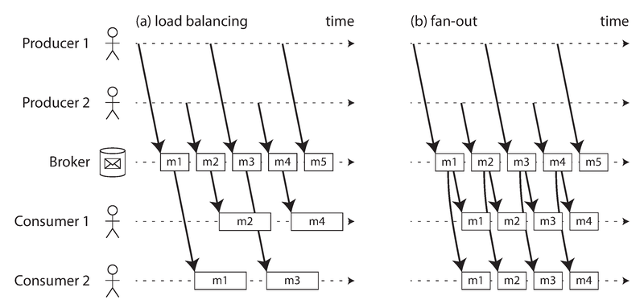
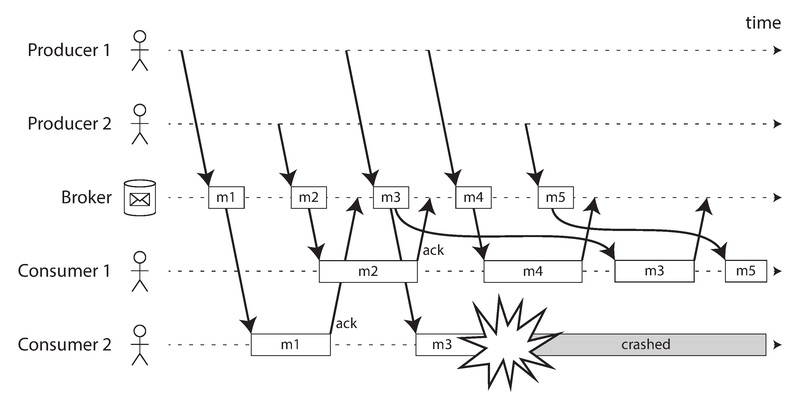
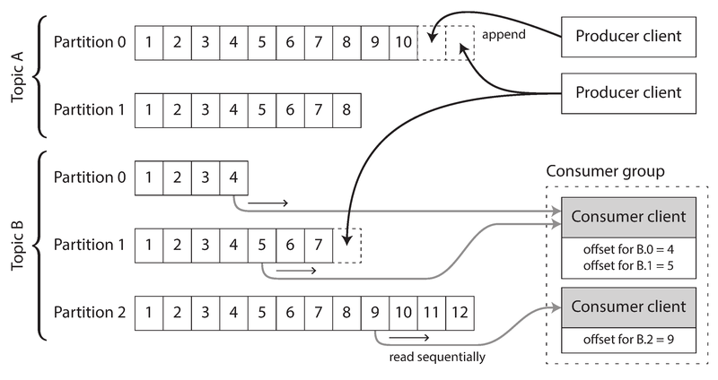
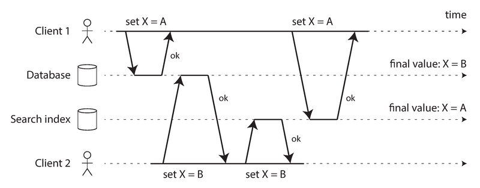
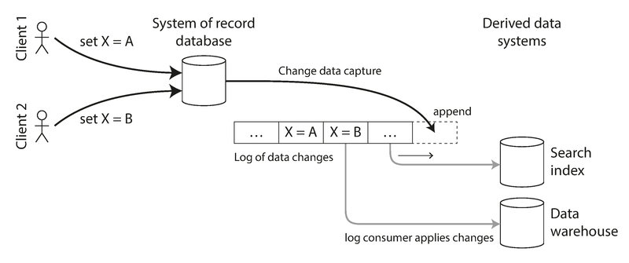
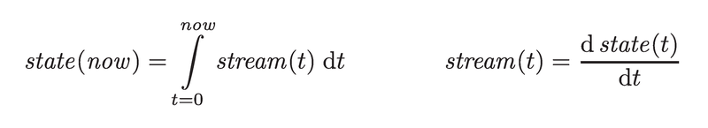
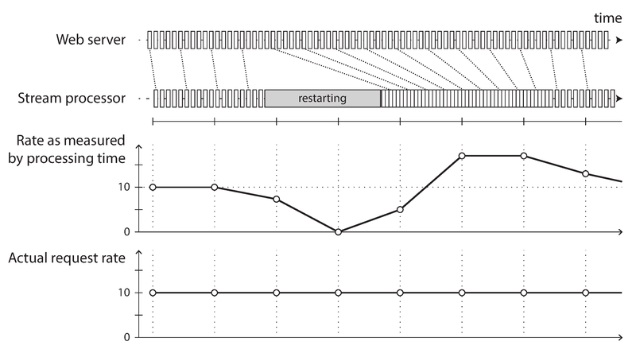

# 模块 11：流处理

> 对应 Chapter 11: Stream Processing
> Part III 派生数据

---

## 概念地图

- **核心概念** (必须内化): 基于日志的消息代理（Log-based Message Broker）与传统消息代理的本质区别、变更数据捕获 CDC 与 Event Sourcing 的设计哲学、流处理的容错语义（exactly-once / idempotency）
- **实操要点** (动手时需要): Kafka 分区日志模型与 consumer offset 管理、三种流式 Join（stream-stream / stream-table / table-table）的实现方式、窗口类型选择（tumbling / hopping / sliding / session）
- **背景知识** (扩展理解): 复杂事件处理 CEP、CQRS 模式、状态与流的微积分类比、slowly changing dimension (SCD)

---

## 概念讲解

### 1. 从批处理到流处理：为什么需要流？

> 📎 **关联**：本章是 Ch10 批处理的自然延伸。Ch10 假设输入是有界的（bounded），本章处理的是无界数据（unbounded）。

Ch10 讨论的批处理有一个根本假设：**输入是有界的**——文件大小已知，处理完就结束。但现实世界的数据是无界的：用户持续产生行为，传感器持续发送读数，除非你倒闭，否则数据流永不停止。

批处理的做法是人为切割——每天跑一次、每小时跑一次。问题是延迟太高：今天的变化明天才能在输出中体现。如果你把切割粒度缩小到每秒、甚至完全连续处理，这就是**流处理（Stream Processing）**的思路。

**流**的定义：数据随时间增量到达。这个概念在很多地方出现——Unix 的 stdin/stdout、TCP 连接、音视频传输、编程语言中的惰性列表。本章关注的是**事件流（Event Stream）**作为数据管理机制。

**事件（Event）**：一个小的、自包含的、不可变的对象，描述在某个时间点发生的事情。例如用户浏览页面、温度传感器读数、CPU 使用率指标。事件可以编码为文本、JSON 或二进制格式。

核心模式与批处理完全对称：

| 批处理 | 流处理 |
|--------|--------|
| 输入是文件 | 输入是事件流 |
| 文件写一次，多个 job 读 | 事件由 producer 生成一次，多个 consumer 消费 |
| 文件名标识一组记录 | topic（主题）将相关事件分组 |
| 输出是新文件 | 输出是新的事件流或派生数据 |

---

### 2. 传输事件流：消息系统

当你从批处理转向连续处理时，第一个问题就是：**事件怎么从 producer 传给 consumer？**

轮询（polling）数据库是最直接的方式，但效率很差——越频繁轮询，空查询比例越高、开销越大。更好的方式是在新事件出现时**通知**消费者。这正是消息系统（Messaging System）要做的事情。

设计消息系统时，有两个关键问题需要回答：

1. **producer 发得比 consumer 快怎么办？** 三种选择：丢消息、排队缓冲、背压（backpressure，即阻塞 producer）
2. **节点崩溃了消息会丢吗？** 需要写磁盘和/或复制来保证持久性，这会牺牲吞吐和延迟

是否能接受丢消息取决于场景：传感器周期性读数偶尔丢一个问题不大（反正马上有下一个），但如果你在计数事件，每丢一条就意味着计数不准确。

#### 2.1 直接消息传递（Direct Messaging）

不经过中间节点，producer 直接向 consumer 发送：

- **UDP 多播**：金融行业的股票行情流，追求极低延迟
- **无代理消息库**：ZeroMQ、nanomsg，在 TCP/IP 多播之上实现 pub/sub
- **StatsD/Brubeck**：用不可靠的 UDP 收集指标——计数器只有在所有消息都收到时才准确
- **Webhooks**：consumer 暴露 HTTP 端点，producer 直接 POST 推送

这些方案的共同限制：**要求 producer 和 consumer 同时在线**。consumer 离线期间的消息可能丢失。producer 崩溃时未重试的消息也会丢失。

#### 2.2 消息代理（Message Broker）

更通用的方案是引入**消息代理**（也叫消息队列）——本质上是一种针对消息流优化的数据库。它运行为独立服务，producer 和 consumer 作为客户端连接。

消息代理的好处：
- **解耦**：客户端可以随时上下线，持久性问题由代理解决
- **异步**：producer 发送消息只需等代理确认缓冲，不必等 consumer 处理完

**消息代理 vs 数据库——关键差异**：

| 维度 | 数据库 | 传统消息代理 |
|------|--------|-------------|
| 数据生命周期 | 保留到显式删除 | 成功投递后删除 |
| 工作集假设 | 可以很大 | 假设队列较短 |
| 数据访问 | 二级索引、任意查询 | 订阅 topic 的模式匹配 |
| 查询模式 | 时间点快照 | 新数据到达时通知 |

典型实现：RabbitMQ、ActiveMQ、HornetQ、IBM MQ、Azure Service Bus、Google Cloud Pub/Sub。标准协议包括 JMS 和 AMQP。

#### 2.3 多消费者模式

当多个 consumer 读同一个 topic 时，有两种基本模式：



> **图说**：左图是负载均衡（Load Balancing）——每条消息只发给一个 consumer，消费者之间分摊工作；右图是扇出（Fan-out）——每条消息发给所有 consumer，就像批处理中多个 job 读同一个输入文件。两种模式可以组合使用。

- **负载均衡（Load Balancing）**：每条消息投递给组内某一个 consumer。适用于消息处理昂贵、需要并行化的场景。AMQP 中通过多个客户端消费同一个 queue 实现，JMS 中叫 shared subscription
- **扇出（Fan-out）**：每条消息投递给所有 consumer。各 consumer 独立处理，互不影响。JMS 中通过 topic subscription 实现，AMQP 中通过 exchange binding 实现

#### 2.4 确认与重投递

消费者可能崩溃在处理消息的过程中。为确保消息不丢失，消息代理使用**确认机制（Acknowledgment）**：consumer 显式告知代理"我处理完了"，代理才删除消息。如果连接断开且未收到确认，代理将消息重投递给另一个 consumer。



> **图说**：Consumer 2 正在处理 m3 时崩溃，同时 Consumer 1 已在处理 m4。未确认的 m3 被重投递给 Consumer 1，导致 Consumer 1 的处理顺序变为 m4, m3, m5。**负载均衡 + 重投递 = 消息乱序**。

**关键问题**：负载均衡与重投递组合时，消息顺序不可保证。如果消息之间有因果依赖，这就是大问题。解决方案：每个 consumer 用独立队列（放弃负载均衡），或者使用分区日志。

---

### 3. 分区日志（Partitioned Logs）——日志型消息代理

> 📎 **关联**：日志的概念在 Ch3（日志结构存储引擎）和 Ch5（复制日志）中反复出现。

传统消息代理有一个根本性的思维方式：**消息是瞬态的**——投递完就删除。这导致了几个问题：

1. **不可重放**：消息一旦被消费并确认就消失了，你无法像批处理那样重跑同一个 consumer 看结果
2. **新消费者看不到历史**：新加入的 consumer 只能收到注册之后的消息
3. **消费是破坏性操作**：和数据库/文件的"只读"形成对比

能不能把数据库的持久存储和消息系统的低延迟通知结合起来？这就是**基于日志的消息代理（Log-based Message Broker）**。

#### 核心设计

**日志（Log）**：一个追加写的记录序列。producer 将消息追加到日志末尾，consumer 从日志中顺序读取。读到末尾就等待新消息到达的通知——就像 Unix 的 `tail -f`。

为了扩展吞吐量，日志被**分区（Partition）**：不同分区可以放在不同机器上，每个分区是一个独立的日志。一个 **topic** 就是一组承载同类消息的分区。



> **图说**：上方是两个 topic，各有多个分区。每个分区内的消息有单调递增的 offset（偏移量）。分区内消息完全有序，但不同分区之间没有顺序保证。下方展示了一个 consumer group 的两个 consumer 如何各自负责一部分分区，并通过 offset 跟踪消费进度。

每条消息在分区内有一个单调递增的**偏移量（offset）**——类似于数据库复制中的日志序列号（Log Sequence Number）。

代表实现：**Apache Kafka**、Amazon Kinesis Streams、Twitter DistributedLog。

> **2026 年更新**：Kafka 已经发展成为事实上的流处理基础设施标准。Kafka 3.x 版本完全移除了对 ZooKeeper 的依赖（KRaft 模式），简化了部署和运维。Confluent 推出的 Kafka-native 方案（Confluent Platform / Confluent Cloud）将 Schema Registry、Kafka Connect、ksqlDB 整合为一体化平台。Apache Kafka 4.0 (2025) 进一步强化了 KRaft 并增强了分层存储（Tiered Storage）支持，使日志保留成本大幅降低。

#### 日志型 vs 传统消息代理

| 维度 | 传统消息代理 (AMQP/JMS) | 日志型消息代理 (Kafka) |
|------|------------------------|----------------------|
| 负载均衡粒度 | 单条消息级 | 分区级（整个分区分配给一个 consumer） |
| 消息顺序 | 负载均衡 + 重投递会破坏顺序 | 分区内严格有序 |
| 并行度上限 | 无硬性上限 | 最多 = 分区数 |
| 消费模型 | 消费是破坏性的（确认后删除） | 消费是只读的（只移动 offset） |
| 历史回放 | 不支持（消息已删除） | 支持（重置 offset 即可） |
| 适用场景 | 消息处理昂贵、需要细粒度并行、顺序不重要 | 高吞吐、消息处理快、顺序重要 |

**日志型的两个限制**：
1. 消费一个 topic 的节点数最多等于分区数（因为分区是分配的最小单位）
2. 单条消息处理慢会阻塞同分区后续消息（队头阻塞，head-of-line blocking）

**分区与顺序**：需要保持顺序的消息必须路由到同一个分区。例如，同一用户的事件可以按 user ID 作为分区键（partitioning key）路由，保证该用户的事件在分区内严格有序。

#### Consumer Offset 管理

日志型代理跟踪消费进度的方式极其简洁：**只需记录每个 consumer 在每个分区的当前 offset**。offset 以下的消息都已处理，offset 以上的消息都未处理——不需要逐条确认。

这与数据库复制中的日志序列号完全一样：follower 断线重连后，从上次的序列号继续，不会跳过任何写操作。

> 📎 **关联**：Ch5 "Setting Up New Followers" 讨论了数据库复制中的日志序列号机制，与此处的 consumer offset 本质相同。

**故障恢复**：consumer 节点失败时，组内另一个节点接管其分区，从上次记录的 offset 继续消费。如果失败节点已处理了更多消息但尚未记录 offset，那些消息会被重复处理——后面会讨论如何处理这个问题。

#### 磁盘空间与消息保留

日志不能无限增长。实际中日志被分段（segment），旧段定期删除或归档。效果上相当于一个**基于磁盘的环形缓冲区（circular buffer）**。

粗略估算：6 TB 磁盘、150 MB/s 顺序写入 ≈ 约 11 小时的缓冲。实际部署中写入速率远低于磁盘极限，通常可以缓冲数天甚至数周的消息。关键是：**无论保留多久，吞吐量基本不变**——因为每条消息都写磁盘。这与传统消息代理形成对比：后者默认内存队列，队列溢出才写磁盘，此时性能骤降。

#### 消费者跟不上时怎么办

日志型代理相当于"大容量固定缓冲 + 丢弃最旧消息"。如果一个 consumer 落后到 offset 指向已删除的段，它会丢失消息——但只影响这一个 consumer，不影响其他消费者。这是巨大的运维优势：你可以安全地添加一个实验性 consumer 来消费生产日志，不用担心影响其他服务。

#### 重放旧消息

这是日志型消息代理最强大的特性。消费是只读操作，offset 由 consumer 控制。你可以：
- 重置 offset 到昨天，重新处理最近一天的消息
- 用修改后的处理逻辑重新跑一遍
- 多次重复，直到结果满意

这使得流处理具备了批处理的核心优势：**派生数据与输入数据清晰分离，转换过程可重复**。

---

### 4. 数据库与流

> 📎 **关联**：本节将 Ch5 的复制日志和 Ch3 的日志结构存储与事件流统一起来。

数据库和消息系统看似不同领域，但深层高度相关：**数据库的复制日志就是一种事件流**——leader 处理事务时产生写事件流，follower 消费这个流来保持一致。这正是状态机复制原则（state machine replication）：如果每个副本以相同顺序处理相同的事件，它们最终状态一致。

#### 4.1 保持系统同步（Keeping Systems in Sync）

现实中没有一个系统能满足所有需求。典型架构会同时使用 OLTP 数据库、缓存、全文索引、数据仓库——每个系统存储同一份数据的不同视图。这些视图需要保持同步。

**Dual Writes（双写）**的陷阱：应用代码显式写多个系统（先写数据库，再更新索引，再失效缓存）。两个严重问题：



> **图说**：Client 1 设 X=A，Client 2 设 X=B。由于请求交错，数据库先收到 A 再收到 B（最终 B），而搜索索引先收到 B 再收到 A（最终 A）。两个系统**永久不一致**，且没有任何错误发生。

1. **竞态条件**：两个客户端并发更新同一项，由于网络延迟不同，两个系统可能收到相反的写入顺序，导致永久不一致（如图 11-4）
2. **部分失败**：一个写成功另一个失败，两个系统不一致。要保证"全部成功或全部失败"就是原子提交问题，代价很高

> 📎 **关联**：竞态条件的检测可参考 Ch5 "Detecting Concurrent Writes" 的版本向量方法；原子提交参见 Ch9 "Atomic Commit and Two-Phase Commit (2PC)"。

根本解决思路：如果只有**一个 leader**（比如数据库），让其他系统（搜索索引、缓存）都作为 follower 跟随，就不会有冲突。这就是变更数据捕获的出发点。

#### 4.2 变更数据捕获 CDC（Change Data Capture）

**CDC 是什么**：观察数据库的所有写入操作，将它们提取为一个有序的变更流，然后复制到其他系统。CDC 让数据库成为 leader，其他派生系统成为 follower。



> **图说**：所有写入先进入 System of Record 数据库。数据库的变更日志被捕获为有序的事件流，然后由日志消费者应用到搜索索引、数据仓库等派生系统。这保证了所有系统看到相同顺序的写入。

**CDC 的实现方式**：

| 方式 | 优点 | 缺点 |
|------|------|------|
| 数据库触发器（Trigger） | 逻辑灵活 | 脆弱、性能开销大 |
| 解析复制日志（Replication Log Parsing） | 更健壮 | 需要处理 schema 变化 |

具体工具生态：
- PostgreSQL：Bottled Water（解析 WAL）
- MySQL：Maxwell、Debezium（解析 binlog）
- MongoDB：Mongoriver（读取 oplog）
- Oracle：GoldenGate
- 统一框架：Kafka Connect 提供各种数据库的 CDC 连接器

> **2026 年更新**：Debezium 已成为开源 CDC 领域的事实标准，支持 PostgreSQL、MySQL、MongoDB、SQL Server、Oracle 等主流数据库。Debezium 2.x 增加了增量快照（Incremental Snapshotting）能力，解决了初始化时的全量快照问题。云原生方面，AWS DMS、Google Datastream、Azure CDC 均提供托管 CDC 服务。

CDC 通常是**异步的**：源数据库不等变更被消费者应用就提交。这意味着添加慢消费者不会拖垮源库，但也意味着存在复制延迟。

> 📎 **关联**：CDC 的异步特性导致的复制延迟问题与 Ch5 "Problems with Replication Lag" 完全一致。

**初始快照（Initial Snapshot）**：如果你不能保留完整的变更历史（通常不能），新建派生系统时需要先加载一个数据库快照，然后从快照对应的日志位点开始消费变更流。

**日志压缩（Log Compaction）**：保留每个 key 的最新值，丢弃旧版本。这样新消费者可以从 offset 0 开始读取被压缩的 topic，获得数据库的完整当前状态——不需要单独做快照。

> 📎 **关联**：日志压缩的原理与 Ch3 "Hash Indexes" 中讨论的日志结构存储引擎的 compaction 完全一致。

**API 支持**：越来越多的数据库原生支持变更流——RethinkDB 支持查询结果变更订阅，Firebase/CouchDB 基于变更 feed 同步数据，MongoDB oplog 可用于订阅变更。VoltDB 甚至允许事务以流的形式连续导出数据。

#### 4.3 Event Sourcing（事件溯源）

Event Sourcing 与 CDC 看似类似——都是把所有变更存为事件日志——但抽象层次不同：

| 维度 | CDC | Event Sourcing |
|------|-----|----------------|
| 抽象层次 | 低级（数据库行的增删改） | 高级（用户意图、业务事件） |
| 应用感知 | 应用不感知 CDC 的存在 | 应用显式围绕不可变事件构建 |
| 事件含义 | "enrollments 表删了一行" | "学生取消了课程注册" |
| 日志压缩 | 可以（同一 key 只保留最新值） | 通常不可以（后续事件不覆盖前序事件） |

Event Sourcing 的价值在于：**记录用户意图**比记录状态变化更有意义。"学生取消注册"这个事件是中性的、可扩展的——未来可以基于它触发新的副作用（如"将名额给候补名单的下一个人"），而不需要修改原始事件。

**Command vs Event 的区分**：
- **Command（命令）**：用户请求，可能被拒绝（如座位已被预订）
- **Event（事件）**：验证通过后的事实，不可变、不可拒绝

验证必须在 command 变为 event 之前同步完成——可以用串行化事务来原子性地验证 command 并发布 event。

> 📎 **关联**：command 的验证可参考 Ch9 "Fault-Tolerant Consensus" 和 "Implementing linearizable storage using total order broadcast"。

**从事件日志派生当前状态**：用户通常想看的是当前状态（购物车里有什么），不是所有历史修改。Event Sourcing 应用需要把事件日志转换为当前状态视图，这个转换必须是确定性的。为了性能，通常会定期做状态快照，但完整的事件日志应当永久保留。

#### 4.4 状态、流与不可变性

**核心洞察**：可变状态和不可变事件日志是同一枚硬币的两面。

> The truth is the log. The database is a cache of a subset of the log.
> ——Pat Helland

任何当前状态都是其历史事件的累积结果。你的可用座位列表 = 所有预订事件的结果；你的账户余额 = 所有借贷事件的结果。

用数学类比：



> **图说**：state(now) = 对 stream(t) 从 t=0 到 now 的积分；stream(t) = state(t) 对时间的微分。状态是流的积分，流是状态的微分。（类比有局限——状态的二阶导数没有明显意义。）

**不可变事件的优势**：

1. **审计与调试**：就像会计不会用橡皮擦改账本——错了就记一笔冲正。不可变日志让你能追溯任何时刻的系统状态
2. **捕获更多信息**：用户把商品加入购物车又移除——在可变数据库中这条信息消失了，但在事件日志中它被保留（对分析有巨大价值）
3. **多视图派生**：从同一份事件日志可以派生出多个不同的读优化视图（搜索索引、分析数据库、缓存），新增视图只需从头消费日志即可
4. **简化并发控制**：单事件写入（追加日志）天然原子；如果事件日志和应用状态同分区，单线程消费者不需要并发控制

> 这就是 **CQRS**（Command Query Responsibility Segregation，命令查询职责分离）的核心思想：写入格式和读取格式可以不同，通过事件日志桥接。传统数据库设计的谬误在于假设数据必须以被查询的形式写入。

**不可变性的局限**：

- **高变更率的数据集**：不可变历史会快速膨胀，compaction 和 GC 的性能变得关键
- **法规要求删除数据**：GDPR 要求用户可以要求删除个人信息。仅仅追加一条"标记为已删除"的事件不够——你需要真正重写历史（Datomic 叫 excision，Fossil 叫 shunning）
- **真正删除数据出奇地困难**：存储引擎可能写到新位置而非覆盖、备份故意不可变——删除更像是"让数据更难获取"而非"让数据不可能获取"

**Event Sourcing / CDC 的并发控制挑战**：消费者通常是异步的，所以用户写入后立即读取可能看不到自己的写入。

> 📎 **关联**：这就是 Ch5 "Reading Your Own Writes" 讨论的问题。

---

### 5. 流处理的应用场景

拿到事件流之后能做什么？三大类用途：

1. **写入存储系统**（数据库、缓存、索引）——保持派生数据与源数据同步，即 CDC 的消费端
2. **推送给用户**——邮件提醒、推送通知、实时仪表盘
3. **处理输入流，产生输出流**——流处理 pipeline 中的 operator/job

本节关注第三类。流处理的 operator/job 与 MapReduce job 非常相似：只读消费输入流，追加写产出到输出。但核心区别是：**流永远不会结束**——因此排序不可能（sort-merge join 不能用），容错机制也不同。

#### 5.1 复杂事件处理 CEP（Complex Event Processing）

CEP 是 1990 年代发展起来的技术，允许你在事件流中搜索特定的**事件模式（pattern）**——类比正则表达式在字符串中搜索字符模式。

CEP 的核心思想是**查询与数据角色反转**：
- 普通数据库：数据持久存储，查询是临时的
- CEP 引擎：**查询是持久存储的**，事件流过查询；匹配到模式时发出"复杂事件"

实现：Esper、IBM InfoSphere Streams、Apama、TIBCO StreamBase。

#### 5.2 流式分析（Stream Analytics）

与 CEP 的区别：CEP 关注具体事件序列的匹配，流式分析关注**大量事件的聚合统计**——比如事件发生频率、滚动平均值、当前与历史的趋势对比。

统计通常在固定时间间隔（**窗口，window**）内计算。流式分析系统有时会使用概率算法（Bloom Filter 判断集合成员、HyperLogLog 估算基数、百分位估算算法），这些算法用更少的内存产出近似结果。但注意：**流处理本身不是近似的**——概率算法只是一种优化选择。

> **2026 年更新**：Apache Flink 已成为流处理领域的标杆框架。Flink 1.18/1.19/2.0 持续强化了其 SQL 层能力（Flink SQL），使得流式分析可以用标准 SQL 表达。Flink CDC 直接集成了 Debezium，一站式完成从数据库到流分析。Kafka Streams 作为轻量级库嵌入应用进程，适合不需要集群的场景。Apache Beam（Google Cloud Dataflow 的开源版）提供了统一的批流编程模型。

#### 5.3 维护物化视图（Materialized Views）

CDC 和 Event Sourcing 驱动的派生数据维护本质上就是**维护物化视图**。与流式分析不同，物化视图可能需要考虑**从时间起点开始的所有事件**（而不仅是某个窗口内的事件）。

> 📎 **关联**：物化视图的概念见 Ch3 "Aggregation: Data Cubes and Materialized Views"。

#### 5.4 流上的搜索（Search on Streams）

传统搜索引擎是先建索引，后执行查询。流搜索反过来：**查询被预先存储，文档（事件）流过查询**。例如房产网站——用户设定搜索条件，新房源上架时自动匹配并通知。Elasticsearch 的 Percolator 就是这个思路。

#### 5.5 消息传递与 RPC

Actor 模型也基于消息传递，但与流处理有本质区别：

| 维度 | Actor 模型 | 流处理 |
|------|-----------|--------|
| 首要目标 | 管理并发和分布式执行 | 数据管理 |
| 通信方式 | 临时的、一对一 | 持久的、多订阅者 |
| 拓扑结构 | 任意（包括循环） | 通常是无环 pipeline |

---

### 6. 时间推理（Reasoning About Time）

流处理经常需要基于时间做聚合（"最近 5 分钟的平均值"），但"时间"在流处理中远比想象的复杂。

#### 6.1 事件时间 vs 处理时间

在批处理中，使用事件内嵌的时间戳是理所当然的——处理发生在事后，看系统时钟毫无意义。但在流处理中，很多框架默认使用处理机器的本地时钟来划分窗口。只要事件创建到处理的延迟可忽略，这没问题。但如果存在显著延迟（网络故障、broker 拥塞、consumer 重启、bug 修复后重放历史事件），两个时间就会产生差异。



> **图说**：Web server 以稳定速率产生事件（下方图表：实际请求速率恒定为 10）。但 stream processor 重启了一段时间，恢复后要处理积压。按处理时间统计的速率（上方图表）先降到 0，然后出现虚假的尖峰——这不是真实的流量变化，只是处理延迟造成的伪影。

**混淆事件时间和处理时间会导致错误数据。**

#### 6.2 迟到事件（Straggler Events）

用事件时间划分窗口时，你永远无法确定某个窗口的所有事件是否都到齐了——总可能有迟到的事件。两种处理策略：

1. **忽略迟到事件**：监控丢弃数量，异常时告警
2. **发布更正值**：包含迟到事件的更新窗口结果，可能需要撤回之前的输出

有些系统使用特殊消息来声明"今后不会有时间戳早于 t 的消息了"，consumer 可以据此关闭窗口。但如果有多个 producer，consumer 需要分别跟踪每个 producer 的水位线（watermark）。

#### 6.3 谁的时钟？

移动端应用可能离线缓冲事件数小时甚至数天。设备时钟不可信（可能被故意或意外改错）。一个实用的方法是记录**三个时间戳**：

1. 事件发生时间（设备时钟）
2. 事件发送到服务器时间（设备时钟）
3. 服务器收到事件时间（服务器时钟）

用第 3 个减第 2 个，估算设备时钟与服务器时钟的偏差，再用这个偏差修正事件时间。

> 📎 **关联**：时钟不可靠性的详细讨论见 Ch8 "Clock Synchronization and Accuracy"。

#### 6.4 窗口类型

| 窗口类型 | 特征 | 示例 | 实现方式 |
|----------|------|------|----------|
| **滚动窗口（Tumbling Window）** | 固定长度，无重叠，每个事件属于恰好一个窗口 | 1 分钟窗口：10:03:00-10:03:59 一个窗口 | 时间戳向下取整 |
| **跳跃窗口（Hopping Window）** | 固定长度，窗口之间有重叠 | 5 分钟窗口、1 分钟步长 | 先计算 tumbling 窗口，再聚合相邻窗口 |
| **滑动窗口（Sliding Window）** | 包含彼此间隔不超过某个时长的所有事件 | 5 分钟滑动窗口 | 维护按时间排序的缓冲区 |
| **会话窗口（Session Window）** | 无固定长度，按用户活跃度分组 | 用户 30 分钟无操作则关闭会话 | 按用户分组，不活跃超时时关闭 |

---

### 7. 流式 Join

> 📎 **关联**：Ch10 讨论了批处理中的 join（reduce-side join、map-side join），本节是其流式对应。

在批处理中，join 是数据 pipeline 的核心操作。流处理同样需要 join，但因为新事件随时到达，流式 join 更具挑战。三种类型：

#### 7.1 Stream-Stream Join（窗口 Join）

**场景**：网站搜索系统——用户搜索产生搜索事件，用户点击结果产生点击事件。要计算每个搜索结果 URL 的点击率，需要把搜索事件和点击事件按 session ID 关联起来。

**难点**：点击可能在搜索后几秒到几周后才发生，甚至可能因为网络延迟，点击事件先于搜索事件到达。

**实现**：stream processor 维护一个状态——最近 N 小时内的所有搜索事件和点击事件，按 session ID 索引。每当收到新事件，在另一个索引中查找匹配。搜索事件过期但没匹配到点击时，发出"未点击"事件。

#### 7.2 Stream-Table Join（流式 Enrichment）

**场景**：用户活动事件流中只有 user ID，需要补充用户的 profile 信息（昵称、地区等）。

**实现**：stream processor 需要查询用户数据库。直接查远程数据库太慢且可能压垮数据库。更好的方式是在本地维护一份用户数据库的副本（内存哈希表或本地磁盘索引），通过 CDC 订阅数据库变更流来保持本地副本最新。

**本质**：这其实也是两个流的 join——活动事件流和 profile 变更流。区别是 profile 变更流的"窗口"从时间起点延伸到当前（无限窗口），且新记录覆盖旧记录。

> 📎 **关联**：本地副本的思路类似 Ch10 "Map-Side Joins" 中的 hash join。

#### 7.3 Table-Table Join（物化视图维护）

**场景**：Twitter Timeline——当用户 u 发推文时，需要添加到所有关注 u 的人的 timeline 中；当取消关注时，需要移除。

这本质上是在维护两张表（tweets 和 follows）的 join 结果的物化视图：

```sql
SELECT follows.follower_id AS timeline_id,
       array_agg(tweets.* ORDER BY tweets.timestamp DESC)
FROM tweets
JOIN follows ON follows.followee_id = tweets.sender_id
GROUP BY follows.follower_id
```

stream processor 需要维护 followers 数据库，当 tweets 流或 follows 流有变更时更新 timeline。

> 📎 **关联**：Twitter Timeline 的 fan-out 问题在 Ch1 "Describing Load" 中首次讨论。

#### 7.4 Join 的时间依赖性

三种 join 的共同点：stream processor 维护一个**状态**（来自一个 join 输入），然后用另一个 join 输入去查询该状态。

关键问题：**当状态随时间变化时，join 应该使用哪个时间点的状态？** 例如税率随时间变化，开票时的 join 应该用销售时刻的税率，而不是当前税率。

如果跨流事件的顺序不确定，join 就变成**不确定性的**——相同输入重新运行可能得到不同结果。在数据仓库中，这被称为**缓慢变化维度（Slowly Changing Dimension, SCD）**，通常通过为每个版本分配唯一标识符来解决（invoice 记录的是"销售时税率的版本 ID"，而非"当前税率"）。代价是 log compaction 不再可能，因为需要保留所有历史版本。

---

### 8. 容错（Fault Tolerance）

批处理的容错很简洁：task 失败就重启，丢弃部分输出，重新处理。因为输入不可变、输出只有在 task 完全成功后才可见，所以最终效果等同于**每条记录恰好处理一次（exactly-once semantics）**——虽然实际上可能重复处理了，但输出看起来只处理了一次。更准确的叫法是 **effectively-once**。

流处理的容错更复杂：流无限长，不能等"处理完"再输出，也不能从头重跑。

#### 8.1 微批处理（Microbatching）

将流切成小批次（通常约 1 秒），每个批次当作一个小型批处理 job。**Spark Streaming** 使用这种方法。

- 优点：复用批处理的容错语义
- 缺点：隐含了一个以批次大小为单位的 tumbling window（按处理时间），更大的窗口需要显式跨批次维护状态
- 权衡：批次越小 → 调度开销越大；批次越大 → 结果延迟越高

#### 8.2 检查点（Checkpointing）

**Apache Flink** 的方式：周期性地生成 operator 状态的快照，写入持久存储。如果 operator 崩溃，从最近的 checkpoint 重启，丢弃 checkpoint 之后产生的输出。Checkpoint 由消息流中的 barrier 触发，不强制固定窗口大小。

> **2026 年更新**：Flink 的 Checkpoint 机制在 1.x 到 2.x 的演进中持续优化。Unaligned Checkpoints（非对齐检查点）减少了背压场景下的 checkpoint 时间。Flink 2.0 进一步简化了状态后端配置，RocksDB 状态后端对大状态的支持更加成熟。Generalized Incremental Checkpoints 使得只有变更部分被持久化，大幅降低了 checkpoint 的 I/O 开销。

#### 8.3 微批处理和检查点的局限

在框架内部，这两种方法都能提供 exactly-once 语义。但如果输出离开了框架（写外部数据库、发邮件），框架就无法撤回已发出的输出。重启 task 会导致外部副作用重复执行。

#### 8.4 原子提交（Atomic Commit）

要在有外部副作用的情况下实现 exactly-once，需要确保：所有输出和副作用（发给下游的消息、数据库写入、operator 状态变更、输入消息的确认/offset 推进）要么全部生效，要么全部不生效。

这与分布式事务的原子提交类似，但现代流处理框架的实现比 XA 更高效——它们不尝试跨异构系统事务，而是把状态管理和消息传递限制在框架内部。Google Cloud Dataflow、VoltDB 和 Apache Kafka 都采用这种方式。事务开销可以通过在一个事务中处理多条消息来摊薄。

> 📎 **关联**：分布式事务和 XA 的问题详见 Ch9 "Distributed Transactions in Practice"。

#### 8.5 幂等性（Idempotence）

另一种实现 exactly-once 效果的方式：让操作本身是**幂等的**——执行多次和执行一次效果相同。

- **天然幂等**：SET key = value（覆盖写）
- **非幂等**：INCREMENT counter（重复执行会多加）

非天然幂等的操作可以通过额外元数据变成幂等的：把触发写入的消息 offset 一起写入外部数据库，写入前检查 offset 是否已处理过。

幂等性的前提：
1. 失败重启时必须以相同顺序重放相同消息（日志型消息代理天然满足）
2. 处理必须是确定性的
3. 没有其他节点并发更新同一个值

当从一个处理节点切换到另一个时，可能需要 **fencing**（防护）来防止"认为已死但实际还活着"的旧节点干扰。

> 📎 **关联**：Fencing 机制见 Ch8 "The leader and the lock"。

#### 8.6 失败后重建状态

有状态的流处理（窗口聚合、join 用的表/索引）必须确保状态可以在故障后恢复。方案：

| 方案 | 代表 | 优点 | 缺点 |
|------|------|------|------|
| 远程存储 + 复制 | — | 天然持久 | 每条消息都要远程查询，慢 |
| 本地状态 + 周期性快照到持久存储 | Flink | 快（本地访问） | 恢复时需要加载快照 |
| 本地状态 + 变更日志写入 Kafka topic | Samza, Kafka Streams | 快，且利用 log compaction | 恢复时重放日志 |
| 冗余处理（多节点同时处理相同输入） | VoltDB | 无需恢复 | 资源消耗翻倍 |
| 从输入流重建（短窗口聚合） | — | 无额外存储 | 只适用于短窗口 |

没有放之四海皆准的最优方案——取决于网络延迟 vs 磁盘延迟、网络带宽 vs 磁盘带宽的实际特性。

---

## 重点标记

1. **日志型消息代理 vs 传统消息代理是本章最核心的对比**：日志型（Kafka）将消息持久化为有序日志，消费是只读操作，支持重放；传统型（RabbitMQ）消费后删除，消息是瞬态的。选择取决于你是否需要顺序保证和历史回放
2. **CDC 让数据库成为 single leader**：所有派生系统（缓存、索引、仓库）通过消费变更流来保持同步，避免了双写的竞态条件和部分失败问题
3. **"The truth is the log"**：Pat Helland 的经典论断——事务日志是事实来源，数据库只是日志最新子集的缓存。这个视角统一了 CDC、Event Sourcing 和物化视图
4. **事件时间 != 处理时间**：混淆二者会导致虚假的统计尖峰/低谷。始终优先使用事件时间，并用三时间戳法修正设备时钟偏差
5. **Exactly-once 实际上是 effectively-once**：通过微批处理/检查点/原子提交/幂等性，让重复处理的效果等同于只处理一次，但实际处理可能发生多次
6. **三种流式 Join 的核心都是"一边维护状态，另一边查询"**：区别在于状态的时间范围——stream-stream 用有限窗口，stream-table 用无限窗口，table-table 两边都是无限窗口

---

## 自测：你真的理解了吗？

**Q1**：你的团队维护一个电商搜索系统。当前架构是：应用代码在更新商品数据库后，同步更新 Elasticsearch 索引（dual writes）。最近你发现某些商品在数据库中的价格已更新为 99 元，但 Elasticsearch 中仍显示旧价格 129 元。排查后发现没有任何错误日志。请分析可能的原因，并提出一个更可靠的架构方案。

<details>
<summary>思路提示</summary>

这正是 Figure 11-4 展示的双写竞态条件。两个并发请求可能以不同顺序到达数据库和 Elasticsearch，导致最终值不一致——且没有任何错误。

更可靠的方案是 CDC：让数据库作为 single source of truth，通过 Debezium 捕获 MySQL/PostgreSQL 的变更日志，推送到 Kafka，由 Kafka Connect 或自定义 consumer 更新 Elasticsearch。这保证了写入顺序与数据库一致。
</details>

**Q2**：你使用 Kafka 消费用户行为事件来计算实时 DAU（日活跃用户数）。某天凌晨流处理服务因 OOM 崩溃并重启，恢复后你发现当天早上 3:00-4:00 的 DAU 异常偏高。数据真的有问题吗？如果你用的是事件时间而非处理时间来计算，结果会怎样？

<details>
<summary>思路提示</summary>

如果用**处理时间**划分窗口，重启后积压的事件会在短时间内被大量处理，3:00-4:00 窗口会包含大量实际不属于该时段的事件——产生虚假尖峰（Figure 11-7 的场景）。

如果用**事件时间**，每个事件根据其原始时间戳归入正确的窗口，不会出现虚假尖峰。但需要处理好迟到事件——重启后处理的事件虽然事件时间正确，但到达时间远晚于窗口关闭时间，需要决定是丢弃还是发布更正值。
</details>

**Q3**：你的系统需要将用户活动事件流与用户 profile 数据库做 join，以便在活动事件上附加用户所在城市信息。方案 A 是每次收到活动事件时查询远程 PostgreSQL；方案 B 是在 stream processor 本地维护一份 profile 数据的副本，通过 CDC 保持更新。请分析两种方案的权衡，以及方案 B 中"用户修改了城市"时 join 结果的正确性问题。

<details>
<summary>思路提示</summary>

方案 A 简单但有两个问题：(1) 远程查询延迟高，成为瓶颈；(2) 大量查询可能压垮数据库。

方案 B（stream-table join）在本地维护副本，查询是本地操作，速度快且不影响源库。通过 CDC 订阅 profile 变更流保持本地副本最新。

关于正确性：当用户修改城市时，存在一个时间窗口——CDC 变更事件还未到达 stream processor，但新的活动事件已经到达。此时 join 会使用旧的城市信息。这是 stream-table join 的时间依赖性问题——join 使用的是"处理时刻的状态"，不一定是"事件发生时刻的状态"。在大多数场景中这个短暂不一致是可接受的。如果需要精确匹配，可以使用 SCD 技术为 profile 的每个版本分配唯一 ID。
</details>

**Q4**：你正在设计一个实时欺诈检测系统，需要在信用卡交易流中检测"同一张卡在 10 分钟内在两个不同城市刷卡"的模式。你会选择哪种窗口类型？如果用户在北京刷了一笔（事件时间 10:00），然后在上海刷了一笔（事件时间 10:08），但由于网络延迟，上海的事件先到达 stream processor，你的系统能正确检测吗？

<details>
<summary>思路提示</summary>

这是一个典型的 CEP / stream-stream join 场景。窗口类型应选择**滑动窗口（Sliding Window）**——因为你关心的是任意两笔交易之间的时间间隔不超过 10 分钟，而不是固定时间边界。

关于乱序到达：如果系统按处理顺序看，上海的交易先到、北京的后到，但两者都在 10 分钟滑动窗口内。只要 stream processor 维护了按 card ID 索引的近期交易状态，无论哪个先到，第二个到达时都能在状态中找到第一个并触发告警。关键是要用**事件时间**而非处理时间来判断窗口，并且要处理好迟到事件——如果北京的事件在窗口关闭后才到达，需要有补偿机制。
</details>

**Q5**：你的流处理 job 从 Kafka 消费事件，处理后将结果写入 Redis。某次 job 崩溃重启后，你发现 Redis 中某些计数器的值偏高。请解释原因，并提出至少两种解决方案。

<details>
<summary>思路提示</summary>

原因：job 在处理了一批消息并写入 Redis 后，还没来得及提交 Kafka consumer offset 就崩溃了。重启后从上次提交的 offset 继续消费，导致那批消息被重复处理——计数器被多加了一次（INCREMENT 不是幂等操作）。

解决方案：
1. **幂等写入**：在 Redis 中同时记录每条消息的 Kafka offset。写入前检查 offset 是否已处理过，如果已处理则跳过。这把非幂等的 INCREMENT 变成了"检查后有条件执行"
2. **原子提交**：使用 Kafka Transactions，将 offset 提交和结果写入放在同一个事务中——要么全部生效，要么全部回滚。Kafka 0.11+ 支持事务，但要求输出目标也在 Kafka 生态内（如 Kafka → Kafka）才能完全保证
3. **替换数据结构**：不用计数器（INCREMENT），而是用 HyperLogLog 或 Set 来去重计数。SET.ADD 是幂等的，天然容忍重复处理
</details>
