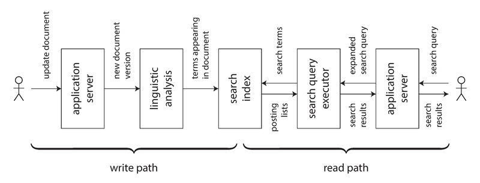

# 模块 12：数据系统的未来

> 对应 Chapter 12: The Future of Data Systems
> Part III 派生数据

> *"If the highest aim of a captain was to preserve his ship, he would keep it in port forever."*
> -- St. Thomas Aquinas

本章是全书的终章。Martin Kleppmann 从"描述现状"转向"展望未来"，以第一人称提出他对数据系统设计方向的看法。内容从技术架构一路延伸到伦理责任，是全书思想的汇聚点。

---

## 概念地图

- **核心概念** (必须内化): 数据集成与派生数据流、解绑数据库（Unbundling Databases）、端到端正确性（End-to-End Correctness）
- **实操要点** (动手时需要): Lambda 架构及其替代方案、基于日志的约束执行、写路径 vs 读路径的权衡、幂等性与请求去重
- **背景知识** (扩展理解): 联合数据库（Federated Database）vs 解绑数据库、数据伦理（隐私/监控/算法歧视）、审计与密码学完整性验证

---

## 概念讲解

### 1. 数据集成（Data Integration）

#### 1.1 为什么需要数据集成？

全书反复出现的一个主题：**没有一种工具能满足所有需求**。

> 📎 **关联**：模块 03 讨论了 LSM-Tree vs B-Tree 的取舍，模块 02 讨论了关系模型 vs 文档模型。每种工具都是为特定使用场景优化的。

在复杂应用中，同一份数据可能需要多种表示形式：OLTP 数据库、全文搜索索引、分析数据仓库、缓存、机器学习模型、推荐系统。这些系统需要保持同步——这就是**数据集成**问题。

> **作者观点**：Kleppmann 指出，很多工程师喜欢说"99% 的人只需要 X"，但这种说法更多反映说话者的经验局限，而非技术的实际适用范围。数据的使用方式千变万化。

#### 1.2 通过派生数据来组合专用工具

核心原则：**将所有用户输入汇入一个决定全局顺序的系统，再从中派生其他表示。**

```
用户写入
    ↓
  记录系统（System of Record）
    ↓ （CDC / 事件日志）
  ┌─────────────┬──────────────┬──────────────┐
  │ 搜索索引     │ 数据仓库      │ 缓存/物化视图  │
  └─────────────┴──────────────┴──────────────┘
```

> 📎 **关联**：模块 11 "变更数据捕获（CDC）" 和 "事件溯源（Event Sourcing）" 是实现此模式的核心技术。

**数据流推理的关键要求：**
- 明确数据首先写入哪里（输入）
- 明确哪些表示是从哪些来源派生的（输出）
- 通过 CDC 或事件日志确保所有派生系统按相同顺序处理变更

#### 1.3 派生数据 vs 分布式事务

保持多个数据系统一致有两种路线：

| 维度 | 分布式事务 | 基于日志的派生数据 |
|------|-----------|------------------|
| 排序机制 | 锁（2PL）实现互斥 | 日志保证全序 |
| 原子性保证 | 原子提交（2PC） | 确定性重试 + 幂等 |
| 一致性 | 线性一致性（Linearizability） | 最终一致性（异步） |
| 容错性 | 差——单点失败会扩散 | 好——故障隔离在局部 |
| 性能 | 差（XA 协议开销大） | 好（异步、松耦合） |

> **作者观点**：Kleppmann 认为 XA 协议的容错性和性能都不理想（参见模块 09 "分布式事务的实践困境"），基于日志的派生数据是目前最有前途的数据集成方案。但他同时反对"最终一致性无所谓"的态度——工程师不应该简单地让用户"自己去适应"。

> 📎 **关联**：模块 07 讨论了 2PL 和 2PC 的原理，模块 09 讨论了全序广播与共识的等价性。

#### 1.4 全序的局限

在小规模系统中，构建全序事件日志完全可行（单主复制就是这样做的）。但随着规模增长，问题出现：

- **吞吐量瓶颈**：全序要求所有事件经过单一领导节点
- **地理分布**：跨数据中心的同步协调延迟太高
- **微服务架构**：每个服务独立管理自己的状态，跨服务没有统一的事件顺序
- **离线客户端**：客户端和服务器可能看到不同的事件顺序

> 📎 **关联**：模块 08 讨论了网络延迟的不可预测性，模块 09 讨论了共识算法在单节点吞吐量上的扩展性限制。

**因果顺序的捕获**是一个仍在研究中的问题。Kleppmann 举了一个社交网络的例子：用户 A 先取消与 B 的好友关系，然后向其他朋友发送吐槽消息。如果好友状态和消息存在不同的系统中，通知服务可能在处理"取消好友"事件之前就把消息发给了 B。

部分解决方案包括：
- 逻辑时间戳（Lamport 时间戳）提供无需协调的全序
- 记录用户做决定时看到的系统状态，作为因果依赖
- 冲突解决算法（CRDTs 等）

#### 1.5 批处理与流处理的统一

**批处理和流处理是数据集成的两大工具：**
- **流处理**：低延迟反映输入变化到派生视图
- **批处理**：重新处理大量历史数据以生成新的派生视图

> 📎 **关联**：模块 10 详细介绍了 MapReduce 和数据流引擎（Spark、Flink），模块 11 介绍了流处理的原理。

**Lambda 架构**：同时运行批处理和流处理管道

```
                 ┌──→ 批处理层（精确但慢）──→ 批处理视图 ─┐
事件流 ──→ 不可变日志                                      ├→ 合并 → 查询服务
                 └──→ 流处理层（快速但近似）──→ 实时视图 ──┘
```

Lambda 架构的贡献在于普及了"从不可变事件流派生视图"的理念。但它有实际问题：

1. **双重维护负担**：同一逻辑需要在两套框架中实现
2. **合并困难**：批处理和流处理输出的合并在复杂场景（如 join、session 化）下非常棘手
3. **增量批处理的复杂度**：为避免每次重新处理全量数据，增量化批处理本身又变得像流处理

> **2026 年更新**：Lambda 架构已经大幅退潮。Apache Flink 和 Apache Beam（以及 Google Cloud Dataflow）证明了统一批流处理的可行性。Flink 在流引擎之上支持批处理，Spark Structured Streaming 也在向统一方向发展。Kafka Streams + ksqlDB 在很多场景下取代了传统 Lambda 架构。

**统一批流处理所需的特性：**
- 能够通过同一引擎回放历史事件和处理实时事件
- Exactly-once 语义（故障恢复后输出不变）
- 基于事件时间（event time）而非处理时间的窗口机制

---

### 2. 解绑数据库（Unbundling Databases）

#### 2.1 数据库是什么？一种"信息管理"系统

在最抽象的层面，数据库、Hadoop、操作系统做的事是一样的：**存储数据，允许查询和处理。** 区别在于抽象层次：

- **Unix 哲学**：低级硬件抽象，管道和字节流，简单但需要手动组合
- **关系数据库**：高级声明式抽象，SQL + 事务，强大但封闭

> **作者观点**：Kleppmann 将 NoSQL 运动解读为"将 Unix 式的低级抽象方法应用于分布式 OLTP 存储领域"。这两种哲学的张力持续了半个世纪，至今未解。

#### 2.2 组合数据存储技术

回顾数据库内部提供的功能：

| 数据库内置功能 | 等价的外部派生数据系统 |
|--------------|---------------------|
| 二级索引 | 搜索引擎（Elasticsearch） |
| 物化视图 | 预计算缓存（Redis） |
| 复制日志 | CDC 管道 |
| 全文索引 | 搜索服务 |

**核心洞察**：`CREATE INDEX` 本质上就是对现有数据集的重新处理（reprocessing），派生出一个新的视图。这与设置新的 CDC 消费者、建立新的 follower 副本是同一回事。

> 📎 **关联**：模块 03 讨论了 B-Tree 和 SSTable 索引的创建过程，模块 05 讨论了设置新 follower 的流程。

#### 2.3 联合数据库 vs 解绑数据库——两种组合路线

Kleppmann 提出两条组合异构数据系统的路线：

**联合数据库（Federated Database）：统一读**
- 提供跨多种存储引擎的统一查询接口
- 例如 PostgreSQL 的 Foreign Data Wrapper
- 遵循关系传统——高级查询语言 + 优雅语义

**解绑数据库（Unbundled Database）：统一写**
- 通过 CDC 和事件日志确保数据变更同步到所有系统
- 像"把数据库的索引维护功能拆开，分布到不同技术上"
- 遵循 Unix 传统——小工具各做一件事，通过统一接口（管道/日志）组合

> **作者观点**：Kleppmann 认为统一写是更困难的工程问题，也是他更关注的方向。传统的跨系统写同步依赖分布式事务，但他认为这是错误的方案——异步事件日志 + 幂等写才是更健壮、更可行的途径。

> **2026 年更新**：这一理念已在实践中大放异彩。Debezium（基于 Kafka Connect 的 CDC 工具）成为事实标准；Materialize 和 RisingWave 等流式物化视图引擎正在将"解绑数据库"的理念产品化；Confluent 推出的 Tableflow 将 Kafka 主题直接映射为 Iceberg 表，进一步模糊了流与存储的边界。

日志集成的两大优势：

1. **系统级**：异步事件流使系统整体更健壮——某个消费者出故障不影响其他组件
2. **团队级**：不同组件由不同团队独立开发维护，事件日志作为良定义的接口

**何时该用解绑方案？** 如果一个产品能满足所有需求，直接用就好——不要为了扩展性去过早拆分。解绑的价值在于"一个工具搞不定"的时候。

> **作者观点**：Kleppmann 坦言一个关键缺失——我们还没有"解绑数据库的 Unix shell"，即一种简单的声明式语言让你能写 `mysql | elasticsearch` 来自动设置 CDC 管道。

#### 2.4 围绕数据流设计应用

传统 Web 应用模型：

```
无状态应用服务器  ←→  数据库（可变共享变量）
      ↑                     ↑
   请求/响应            同步读写
```

数据流模型：

```
状态变更事件 → 流处理器 A → 状态变更事件 → 流处理器 B → 派生视图
```

这种"database inside-out（数据库由内而外）"的方法，借鉴了：
- **电子表格**的数据流编程——当输入变化时，依赖的公式自动重算
- **函数式响应编程**（FRP）——如 Elm、React/Redux
- **数据流语言**——如 Oz、Bloom

> **作者观点**：Kleppmann 指出，VisiCalc（1979 年的电子表格）在数据流方面的能力就已经超过了今天大多数主流编程语言。数据系统应该像电子表格一样——记录变了，索引和缓存自动更新，你不需要关心怎么更新。

**流处理 vs 微服务**：

| 微服务方式 | 数据流方式 |
|-----------|-----------|
| 同步请求汇率服务 | 订阅汇率更新流，存到本地 |
| 依赖远程服务可用性 | 依赖本地数据库 |
| 每次请求一次网络调用 | 零网络调用（查本地） |

> "最快最可靠的网络请求就是不发网络请求！" 数据流方式将微服务间的 RPC 替换为流-表连接（stream-table join）。

> 📎 **关联**：模块 11 讨论了 stream-table join 的原理。

#### 2.5 观察派生状态（Write Path vs Read Path）



> **图说**：在搜索索引中，写路径（左）和读路径（右）在索引处交汇。用户更新文档时，经过语言分析后写入索引（写路径）；用户搜索时，查询经过扩展后从索引中查找结果（读路径）。

**写路径（Write Path）**：数据写入时立即执行的预计算——主动（Eager）
**读路径（Read Path）**：查询时才执行的计算——被动（Lazy）

**派生数据集就是写路径和读路径的交汇点。**

索引、缓存、物化视图的角色：**将工作从读路径转移到写路径**——预计算结果以加快查询。

> 📎 **关联**：模块 01 开头的 Twitter 案例就是写路径/读路径权衡的经典例子——为名人用户用拉模式（读路径多做事），为普通用户用推模式（写路径多做事）。500 页之后，我们又回到了原点！

**有状态的离线客户端**：如果我们将数据流概念延伸到终端设备：

- 设备上的状态是服务器状态的**缓存/副本**
- 屏幕上的像素是客户端模型对象的**物化视图**
- 服务器通过 Server-Sent Events / WebSocket 主动推送状态变更
- 离线设备重连后像日志消费者一样"追上"错过的消息

> **2026 年更新**：这一预见已经在 Local-first 软件运动中成为现实。CRDTs（如 Yjs、Automerge）已被 Figma 等产品采用。LiveView（Phoenix）、TanStack Query、SWR 等工具让"订阅变更而非轮询"成为前端的主流范式。Replicache、PowerSync 等工具为移动端提供了"离线优先 + 实时同步"的开发体验。

**"读也是事件"（Reads Are Events Too）**：一个激进但有趣的想法——把读请求也作为事件流经处理器：

- 写入通过事件日志流入
- 读请求也作为事件发送到同一分区
- 这实际上是读查询与数据库之间的 stream-table join
- 好处：可以记录用户做决策时看到的系统状态（因果溯源）

---

### 3. 追求正确性（Aiming for Correctness）

#### 3.1 数据库的端到端论证（End-to-End Argument）

> **核心论点**：仅仅因为你使用了提供强安全属性的数据系统（如可串行化事务），并不意味着你的应用就不会丢数据或损坏数据。

这是经典的**端到端论证**（End-to-End Argument，Saltzer, Reed, Clark, 1984）：

> *"某项功能只有在通信系统的端点（即应用层）的参与下才能完全正确地实现。通信系统自身提供的该功能只能作为性能优化。"*

**举例：重复提交**

```
用户浏览器 --POST--> 应用服务器 --事务--> 数据库
                                     ↑
                                  TCP 去重仅在连接范围内有效
```

即使数据库事务保证原子性，如果用户的 HTTP POST 因网络问题超时后重试，同一笔转账可能执行两次（\$22 而非 \$11）。TCP 的去重只在单个连接范围内有效，数据库事务也只在单个事务范围内有效——都不足以实现端到端的"恰好一次"。

**解决方案：端到端的请求 ID**

```sql
ALTER TABLE requests ADD UNIQUE (request_id);

BEGIN TRANSACTION;
INSERT INTO requests
  (request_id, from_account, to_account, amount)
  VALUES('0286FDB8-D7E1-423F-B40B-792B3608036C', 4321, 1234, 11.00);
UPDATE accounts SET balance = balance + 11.00 WHERE account_id = 1234;
UPDATE accounts SET balance = balance - 11.00 WHERE account_id = 4321;
COMMIT;
```

客户端生成唯一请求 ID（UUID），数据库通过唯一约束拒绝重复插入。请求 ID 从端到端贯穿整个处理链路。

端到端论证同样适用于：
- **数据完整性**：TCP/TLS 校验和能检测网络损坏，但不能检测软件 bug 或磁盘损坏——需要端到端校验和
- **加密**：WiFi 密码防不了互联网攻击者，TLS 防不了服务器被入侵——只有端到端加密能全面保护

> 📎 **关联**：模块 08 讨论了 TCP 去重和"弱形式的拜占庭容错"，模块 07 讨论了事务隔离级别下 check-then-act 的幻读问题。

> **作者观点**：Kleppmann 感叹我们还没有找到合适的抽象来包装端到端容错——事务虽好但不够，放弃事务又意味着应用需要自己处理容错（大多数应用做不好）。这是一个开放问题。

#### 3.2 执行约束

在解绑数据库架构中如何执行约束（如唯一性约束）？

**唯一性约束需要共识。**

> 📎 **关联**：模块 09 证明了全序广播与共识等价。

**基于日志消息的唯一性检查**：

1. 将用户名注册请求编码为消息，按用户名哈希追加到对应日志分区
2. 流处理器顺序读取日志，用本地数据库记录已占用的用户名
3. 对每个请求输出成功/拒绝消息
4. 客户端监听输出流，等待自己请求的结果

这本质上就是"用全序广播实现线性化存储"，可以通过增加分区数来扩展吞吐量。

**跨分区处理**（以转账为例）：

```
步骤 1：客户端生成唯一请求 ID，写入请求日志（按请求 ID 分区）
步骤 2：流处理器读取请求，分别发出借记/贷记指令（按账号分区）
步骤 3：下游处理器消费借记/贷记流，按请求 ID 去重后更新余额
```

关键洞察：通过将一个跨分区事务拆解为两个不同分区策略的阶段，加上端到端请求 ID 去重，可以在**不使用原子提交协议**的情况下实现等效的正确性。

> 📎 **关联**：模块 07 讨论了 2PC 的性能代价，模块 06 讨论了分区策略。

#### 3.3 时效性与完整性（Timeliness vs Integrity）

Kleppmann 提出了一个重要的概念分离——"一致性"这个词混淆了两个不同的需求：

| | 时效性（Timeliness） | 完整性（Integrity） |
|--|---------------------|-------------------|
| 含义 | 用户看到的数据是最新的 | 数据没有丢失或损坏 |
| 违反后果 | 暂时的不一致——等一等就好了 | 永久的不一致——需要显式修复 |
| 口号 | "最终一致性" | "永久不一致" |
| 技术手段 | 线性一致性、读写一致性 | 原子性、持久性、幂等性 |

> **作者观点**：在大多数应用中，**完整性远比时效性重要**。你的信用卡账单晚 24 小时出现不是问题（时效性），但如果扣了两次钱那就是大问题（完整性）。

事件驱动的数据流系统可以解耦这两者：
- 放弃时效性（异步处理，不保证线性一致性）
- 保证完整性（通过以下机制组合）：
  1. 将写操作表示为单条消息（原子写入）
  2. 通过确定性派生函数产生所有状态更新
  3. 端到端请求 ID 实现去重和幂等
  4. 消息不可变 + 可重新处理

#### 3.4 宽松约束与道歉工作流

**很多业务场景其实不需要严格的约束检查。**

| 场景 | 严格约束 | 宽松约束（先执行再补偿） |
|------|---------|---------------------|
| 用户名注册 | 先检查再注册 | 两人同时注册同名：通知其中一人更换 |
| 库存 | 不允许超卖 | 超卖了：补货 + 道歉 + 打折 |
| 航班座位 | 一人一座 | 超售：升舱/退款/安排邻近酒店 |
| 银行取款 | 余额不足则拒绝 | 允许透支：收取透支费 |

> **作者观点**：Kleppmann 引用 Pat Helland 的"道歉工作流（Apology Workflow）"概念——即使是在现实世界，完美的约束也是不可能的（叉车可能压坏库存），所以道歉/补偿流程无论如何都是业务的一部分。既然如此，很多场景下不需要为了严格约束而付出线性一致性的高昂代价。

这意味着我们可以构建**避免协调的数据系统（Coordination-Avoiding Data Systems）**：
- 跨多个数据中心以多主模式异步复制
- 弱时效性保证（不是线性一致性的）
- 强完整性保证
- 只在真正需要的地方引入同步协调

> 另一个视角：协调减少了因不一致需要道歉的次数，但也增加了因服务不可用需要道歉的次数。目标是找到最佳平衡点。

#### 3.5 信任但验证（Trust, but Verify）

我们的系统模型总是假设某些事情会出错（网络、进程崩溃），而某些事情不会出错（磁盘 fsync 后数据不丢、CPU 乘法结果正确）。但现实中：

- 磁盘上的数据可能静默损坏
- 网络损坏可能绕过 TCP 校验
- Rowhammer 攻击可以翻转 DRAM 中的位
- 即使是成熟的数据库也有 bug（Kleppmann 亲眼见过 MySQL 唯一约束失效、PostgreSQL 可串行化隔离级别出现写偏斜）

> **作者观点**：Kleppmann 批评了 ACID 数据库文化带来的"盲目信任"倾向——因为事务机制大部分时候工作得很好，我们就忽略了审计的必要性。然后 NoSQL 来了，一致性保证更弱了，但我们的应用仍然基于盲目信任，这更危险了。

**解决方案：审计（Auditing）**

- 基于事件溯源的系统天然更易审计——每个状态变更都可溯源到不可变事件
- 用哈希校验事件存储的完整性
- 重新运行批处理/流处理管道来验证派生状态的正确性
- **端到端完整性检查**：检查范围越大，腐败越无处藏身

> **2026 年更新**：Kleppmann 对区块链技术保持了审慎的态度——他对 Merkle 树和密码学审计的数据完整性应用表示兴趣，但对比特币的工作量证明（Proof of Work）机制表示"极其浪费"。2025 年，他本人成为 Local-first 软件和 CRDTs 领域的核心推动者（Automerge 项目联合创始人），这正是本章中"离线优先 + 端到端数据流"理念的实际落地。

---

### 4. 做正确的事（Doing the Right Thing）——数据伦理

本章最后一节从技术转向伦理。这在一本技术书中并不常见，但 Kleppmann 认为这个话题"太重要了，不能忽视"。

> **作者观点**：每个系统都有目的，每个行动都有预期和非预期的后果。我们工程师有责任认真考虑这些后果。数据看似抽象，但很多数据集是关于**人**的——他们的行为、兴趣、身份。我们必须以人道和尊重的态度对待这些数据。

#### 4.1 预测分析与歧视

算法决策的问题：
- 用数据预测天气是一回事；预测一个人是否会犯罪、是否会还款、是否值得雇用是另一回事
- 被算法错误标记为"高风险"的人可能遭受系统性排斥——工作、保险、住房、金融服务——形成"**算法监狱**"
- 算法不一定比人类更公平：如果训练数据本身有偏见，算法会**学习并放大**这种偏见

> **作者观点**：Kleppmann 引用了一句尖锐的讽刺——"机器学习就是偏见的洗钱（Machine learning is like money laundering for bias）"。看似客观的数学模型，可能只是为已有的歧视披上了科学的外衣。

**反馈循环**（Feedback Loops）的危害：信用评分低 → 找不到工作 → 经济困难加剧 → 信用评分更低——"一个伪装成数学严谨的有毒螺旋"。

> **2026 年更新**：本章出版后的发展印证了 Kleppmann 的担忧。2018 年 GDPR 生效，确立了"解释权（Right to Explanation）"。2023-2025 年，生成式 AI 的爆发使算法伦理问题更加尖锐——AI 生成内容的偏见、deepfake、AI 用于大规模监控等问题引发了全球性监管讨论。欧盟 AI Act（2024 年生效）对高风险 AI 系统提出了强制性合规要求。

#### 4.2 隐私与监控

> **作者观点**：Kleppmann 提出了一个"思想实验"——把所有含"data"的短语中的"data"替换为"surveillance"。例如：
>
> "在我们的**监控**驱动型组织中，我们收集实时**监控**流并存储在**监控**仓库中。我们的**监控**科学家使用高级分析和**监控**处理来获取新洞察。"
>
> 这本书也可以叫做《设计**监控**密集型应用》。

**关键论点**：

1. **用户并非真正知情同意**：隐私政策更多是在遮掩而非阐明
2. **"隐私已死"是误解**：隐私不是保守秘密，而是**选择向谁透露什么的自由**——这是一种**决策权**
3. **隐私权从个人转移到了公司**：公司获取数据后，是公司在行使隐私决策权（为了利润最大化），而非用户
4. **不使用服务不是真正的自由选择**：当服务变成社会基础设施（如社交网络）时，不用它就意味着社会排斥
5. **数据是"有毒资产"**：不仅有价值，而且危险——泄露、被政府征用、公司破产后被拍卖

> **作者观点**：Kleppmann 将数据污染类比于工业革命时期的环境污染——引用 Bruce Schneier 的话：
>
> "数据是信息时代的污染问题，保护隐私是环保挑战。……我们的子孙后代回顾信息时代的早期时，会评判我们如何应对数据收集和滥用的挑战。"

> **2026 年更新**：GDPR（2018）的实施是 Kleppmann 所期待的"更新的法规"。此后 CCPA（加州）、LGPD（巴西）等隐私法规相继出台。2024-2025 年，关于生成式 AI 训练数据的版权和隐私争议成为焦点（纽约时报诉 OpenAI 等案件）。Kleppmann 后来倡导的 Local-first Software 理念——数据留在用户设备上、通过 CRDTs 点对点同步——正是对本章隐私关切的技术回应。

---

## 重点标记

### 必须记住的核心思想

| # | 思想 | 一句话总结 |
|---|------|----------|
| 1 | **单一全序日志是整合异构系统的关键** | 让所有写入先经过一个有序日志，其他系统从中派生——胜过分布式事务 |
| 2 | **解绑数据库 = 把数据库的内部机制拆到外部** | CDC + 流处理 = 分布式版的 `CREATE INDEX` |
| 3 | **端到端论证** | 低层保障（TCP 去重、DB 事务）无法替代应用层的端到端正确性措施（如请求 ID） |
| 4 | **完整性 >> 时效性** | 宁可暂时不一致（最终一致），也不能永久损坏（数据丢失/重复） |
| 5 | **道歉工作流** | 很多业务约束可以事后补偿，不必为绝对一致性付出协调的高昂代价 |

### 最易混淆的概念

| 容易混淆 | 区分要点 |
|---------|---------|
| 联合数据库 vs 解绑数据库 | 联合 = 统一读（查询接口聚合）；解绑 = 统一写（变更通过日志同步） |
| 时效性 vs 完整性 | 时效性 = "我看到最新数据了吗"；完整性 = "数据有没有丢/重复/损坏" |
| Lambda 架构 vs 统一批流 | Lambda 需要维护两套代码；统一批流用一套引擎处理实时和历史数据 |
| 严格约束 vs 宽松约束 | 严格 = 写前检查，需要协调；宽松 = 先写后检查，出错就补偿 |

### 跨章关联总览

本章是全书的总结章，几乎回引了前面所有章节的概念：

| 本章主题 | 关联的前序章节 |
|---------|-------------|
| 派生数据与 CDC | 模块 11（流处理）、模块 05（复制） |
| 全序广播与共识 | 模块 09（一致性与共识） |
| Lambda 架构 | 模块 10（批处理）、模块 11（流处理） |
| 端到端论证 | 模块 07（事务）、模块 08（分布式系统） |
| 幂等性与去重 | 模块 11（Exactly-once）、模块 07（ACID） |
| 写路径/读路径 | 模块 01（Twitter 案例） |
| 宽松约束 | 模块 05（冲突解决）、模块 09（线性一致性的代价） |
| 审计与不可变性 | 模块 11（事件溯源）、模块 05（复制与持久性） |

---

## 自测：你真的理解了吗？

### Q1：重复转账场景

你的支付系统通过 HTTP POST 提交转账请求到后端服务器，后端执行数据库事务。一个用户在弱网络下提交了转账请求，POST 发送成功但响应超时，用户点了重试。

- (a) 仅靠数据库的 ACID 事务能否防止重复转账？为什么？
- (b) 请设计一个端到端的去重方案。

<details>
<summary>参考答案</summary>

(a) **不能。** ACID 事务的原子性和隔离性只在单个事务范围内有效。用户的两次 POST 在数据库看来是两个独立的事务。TCP 的去重只在单个连接范围内有效，重试建立了新连接。这就是端到端论证的核心——底层机制无法完全解决高层问题。

(b) 客户端在提交表单时生成一个 UUID 作为请求 ID（比如放在隐藏表单字段中）。后端在事务中先尝试将该请求 ID 插入一个有唯一约束的 `requests` 表。如果 ID 已存在，INSERT 失败，事务中止——第二次请求被安全拒绝。这个请求 ID 从浏览器贯穿到数据库，实现了端到端的幂等性。

</details>

---

### Q2：搜索索引同步策略

你的系统使用 PostgreSQL 作为记录系统，Elasticsearch 作为搜索索引。目前应用代码同时写入两者。最近发现两者数据频繁不一致。

- (a) 为什么双写（Dual Write）会导致不一致？
- (b) 请用本章的理念提出一个更好的架构。

<details>
<summary>参考答案</summary>

(a) 双写的问题在于两个写入没有全局顺序保证。两个并发写入可能以不同顺序到达 PostgreSQL 和 Elasticsearch，导致它们最终状态不同（参见模块 11 "保持系统同步"中的图）。如果其中一个写入失败，另一个成功，两个系统也会不一致——没有跨系统的原子提交保证。

(b) 采用"解绑数据库"方案：PostgreSQL 作为唯一的记录系统，通过 CDC（如 Debezium）捕获其变更日志，将变更事件写入 Kafka。Elasticsearch 作为日志的消费者，按同样的顺序应用变更。这样 Elasticsearch 完全派生自 PostgreSQL，两者的顺序一致。如果 Elasticsearch 消费者暂时故障，Kafka 会缓冲消息，恢复后从上次位置继续消费，不丢数据。

</details>

---

### Q3：时效性 vs 完整性的取舍

你的电商平台需要做库存管理。产品经理要求"绝不超卖"。CTO 说"我们需要支持多区域部署和高可用"。

- (a) 严格的"不超卖"约束在分布式环境中意味着什么？有什么代价？
- (b) Kleppmann 会建议怎么做？

<details>
<summary>参考答案</summary>

(a) 严格的"不超卖"是一个唯一性/约束检查问题，需要在写入前验证。在分布式环境中，这要求同步协调（所有写入经过单一领导节点检查库存），意味着跨数据中心延迟增大、领导节点成为单点瓶颈、网络分区时必须拒绝写入——牺牲可用性来换取严格一致性。

(b) Kleppmann 会建议区分**时效性**和**完整性**，并采用"道歉工作流"方式：允许并发写入在短窗口内"乐观地"通过（宽松约束），异步检查库存。如果确实超卖了，启动补偿流程（通知客户、补货、退款、提供折扣）。这和航空公司超售机票的业务逻辑一样——补偿流程本来就是业务的一部分（叉车压坏库存也需要同样的流程）。这样系统可以多区域异步复制，获得高可用性，同时通过异步事件流保证完整性（不会凭空消失库存记录）。

</details>

---

### Q4：审计与数据损坏

一个同事说："我们用 PostgreSQL 的可串行化隔离级别，数据不可能损坏。" 根据本章内容，你怎么回应？

<details>
<summary>参考答案</summary>

你应该指出几个问题：

1. **应用 bug 不在事务保护范围内**：如果应用逻辑错误地删除或修改了数据，可串行化事务会忠实地执行这个错误操作。
2. **数据库本身可能有 bug**：Kleppmann 举了 MySQL 唯一约束失效和 PostgreSQL 可串行化隔离出现写偏斜的真实案例。Kyle Kingsbury 的 Jepsen 测试也揭示了很多数据库在故障场景下的安全保证不如宣称的那样。
3. **硬件也不完美**：磁盘静默损坏、内存位翻转（rowhammer）虽然罕见但确实存在。
4. **正确的态度是"信任但验证"**：在使用事务的同时，应该建立审计机制——定期验证备份可恢复、校验派生数据与源数据的一致性、使用端到端校验和。成熟的系统（如 HDFS、S3）都有后台进程持续验证数据完整性。

</details>

---

### Q5：数据伦理场景分析

你的团队正在开发一个信用评估系统，使用机器学习模型根据用户的社交媒体数据、地理位置和消费记录来预测违约概率。产品经理说这比传统信用评分更准确。

- (a) Kleppmann 会提出哪些伦理方面的担忧？
- (b) 你会建议哪些技术和流程上的改进？

<details>
<summary>参考答案</summary>

(a) Kleppmann 的关注点包括：

- **代理歧视**：地理位置高度关联种族和社会经济阶层；社交媒体数据可能关联性别、年龄、宗教等受保护特征。模型可能在名义上不用这些特征，但通过代理变量间接歧视。
- **反馈循环**：评分低 → 贷款被拒 → 经济困难加剧 → 评分更低——形成自我强化的恶性循环。
- **不透明性**：ML 模型的决策难以解释，用户无法理解为什么被拒，也无法有效申诉。
- **知情同意的缺失**：用户在使用社交媒体时并未同意其数据被用于信用评估。
- **统计谬误**："和你类似的人违约了"≠"你会违约"——群体统计不适用于个体判断。

(b) 建议的改进：

- 对模型进行公平性审计（如按受保护特征分组分析差异影响）
- 提供有意义的解释（符合 GDPR "解释权"要求）
- 建立人工审核和申诉通道
- 限制数据收集范围——只使用与借贷行为直接相关的数据
- 定期检测和打断反馈循环
- 设置模型输出的置信度阈值——低置信度案例转人工审核

</details>
