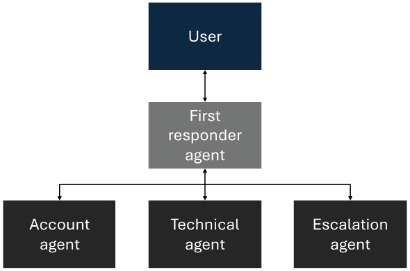
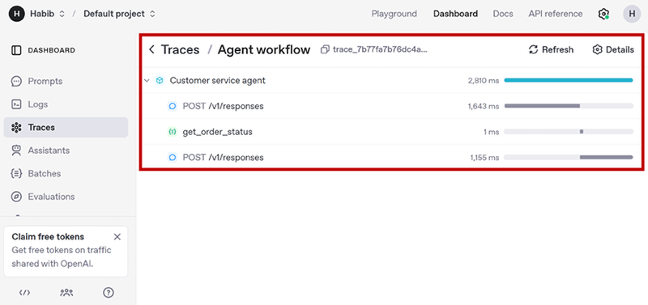

# 模块二：OpenAI Agents SDK 入门

> 对应 PDF 第 34-47 页（Chapter 2: Introduction to OpenAI Agents SDK）

---

## 概念讲解

### 1. 什么是 SDK？为什么需要 OpenAI Agents SDK？

**定义**：SDK（Software Development Kit）就是一组打包好的库、工具和文档，让开发者能站在前人的肩膀上，少写代码、专注业务。用作者的话说：每个开发者对 SDK 的期望就是 **write fewer lines of code**。

**核心思想**：好的 SDK 帮你把底层的线路连接、配置和模板代码全部搞定，你只需要关心你的应用有什么独特之处。

**OpenAI Agents SDK 的定位**：它是用来构建 AI Agent 的 SDK，设计哲学是 **"beautiful in simplicity"**。不给你搞一堆自定义配置语言或者深不见底的类继承层次，而是提供六个清晰的核心原语（primitives）--Agent、Runner、Tools、Handoffs、Guardrails、Tracing--全部用地道的 Python 实现。用这六块"乐高积木"，你就能在几分钟内搭出一个单 Agent 或多 Agent 原型。

---

### 2. 设计特性

#### 2.1 构建 AI Agent 的框架

**类比理解**：OpenAI Agents SDK 之于 AI Agent，就像 Django 之于 Web 开发。这些框架把底层的脏活累活抽象掉，让开发者专注于高层业务逻辑。

**极简示例**：几行代码就能创建一个 Agent：

```python
agent = Agent(name="Assistant", instructions="You are an AI agent", model="gpt-4o")
result = Runner.run_sync(agent, "Tell me a joke")
print(result.final_output)
```

这段代码做了什么：
1. 用 `Agent()` 实例化一个基础 AI Agent，指定使用 GPT-4o 模型和系统指令
2. Agent 的迭代推理控制逻辑（Agent Loop）已经内嵌在框架里，不需要你自己写
3. `Runner.run_sync()` 执行 Agent 对用户查询的处理
4. 打印最终输出

> **关键点**：如果没有这个 SDK，同样的功能需要 **数千行代码** 来编排，更不用说还需要额外数千行来实现 tracing 和 logging 系统，而 SDK 自带这些。

---

#### 2.2 多 Agent 编排（Multi-Agent Orchestration）

**背景**：多 Agent 编排是 SDK 的核心能力之一。SDK 的前身叫 **Swarm**，顾名思义就是让一群 Agent 像蜂群一样协作完成任务。核心理念是：对于特定任务，一个 Agent 干不了所有事，需要一个专业化 Agent 团队，各司其职，按需交接。

**经典示例 -- 客服工作流**：



> **图说**：用户请求首先进入 First Responder Agent，根据问题类型分发给 Account Agent（账户查询）、Technical Agent（技术问题）或 Escalation Agent（人工介入），实现专业化分工。

各 Agent 的职责：

| Agent | 职责 |
|-------|------|
| **First Responder Agent** | 接听来电，理解问题，处理简单 FAQ，按需分发给其他 Agent |
| **Account Agent** | 查询客户订单和状态 |
| **Technical Agent** | 修复用户认证 bug、配置新连接线路 |
| **Escalation Agent** | 最后手段，把人类接入进来 |

对最终用户来说，整个体验感觉就像一个连贯的对话。所有的上下文传递、角色切换、错误处理都在 SDK 的编排层内完成（通过 Handoff 原语）。配置也很简单：

```python
account_agent = Agent(name="Account agent")
technical_agent = Agent(name="Technical agent")
escalation_agent = Agent(name="Escalation agent")

first_responder_agent = Agent(
    name="First Responder Agent",
    handoffs=[account_agent, technical_agent, escalation_agent]
)
```

---

#### 2.3 最小抽象（Minimal Abstraction）

**设计哲学**：**"Few enough primitives to make it quick to learn."** -- 用尽可能少的原语，让学习曲线尽可能短。

SDK 只有六个核心原语：**Agents、Runner、Tools、Handoffs、Guardrails、Tracing**。

> **原文强调**：如果你能记住这六个核心原语及其工作方式，你就已经掌握了 **80%** 的框架。

**没有隐藏的元语言**：不存在不透明的运行时在背后生成你看不到的代码。你用纯 Python 组装 Agent，给几个函数加上 `@function_tool` 装饰器，然后点运行。大多数开发者午饭时间浏览一下文档或示例 notebook，下午就能搭出一个可运行的原型。

**与 LangChain 的对比**：

| 维度 | OpenAI Agents SDK | LangChain |
|------|-------------------|-----------|
| 设计理念 | 轻量级库，最小抽象 | 全面框架，大量集成 |
| 内置集成 | 不内置 document loaders、memory stores 等 | 内置数百个 turnkey 集成 |
| 学习曲线 | 短，几个原语搞定 | 长，概念和类较多 |
| 灵活性 | 高，但需要自己开发部分功能 | 高，开箱即用但有时过于复杂 |

---

#### 2.4 Pythonic、可扩展、开源

**Pythonic**：SDK 说的是"流利的 Python"。

- 没有 YAML 配置文件
- 没有专有的作用域需要记忆
- 没有元编程魔法隐藏真正的工作
- Agent = Python 对象，Tool = 带装饰器的普通 Python 函数
- 和 Flask、Pydantic 这类深受喜爱的极简库风格一致

**可扩展 -- 每个组件都可以热替换**：

| 组件 | 默认行为 | 可替换为 |
|------|---------|---------|
| **Model** | OpenAI GPT 系列 | 任何符合 Chat Completions 标准的 LLM，如 LLaMA |
| **Tools** | Python 函数 + 装饰器 | 任何 Python 函数、hosted API、MCP 服务器 |
| **Tracing** | OpenAI Traces Dashboard | Azure Monitor Logs、DataDog 等 |
| **Agent 执行循环** | 高层 Runner（自带重试、步数限制） | 手动调用 `agent.run_step()` 或 `agent.get_initial_state()` + `agent.step()` 实现完全控制 |

**进阶用法**：在 FastAPI 路由等异步环境中，你可以绕过高层 Runner，手动控制 Agent 的执行逻辑，实现对时序、并发和资源管理的完全掌控。

**开源**：完全透明，持续有开发者社区改进和增强。

---

### 3. 六大核心原语（Core Primitives）

> 类比：原语就是你的乐高积木。它们是最小的标准化零件，用来拼装任何东西。SDK 将来可能会提供预制方案（就像乐高说明书），但积木本身就是原语。

---

#### 3.1 Agent

**定义**：Agent 原语是 SDK 最基本的概念。它本质上是对 LLM 的一层高度可配置的封装（wrapper），让 LLM 变得"有 Agent 能力"--即赋予它人格/系统指令、工具接口和自主决策所需的各种设置。

**配置参数**：

| 参数 | 说明 |
|------|------|
| `name` | Agent 名称，通常仅用于标识 |
| `instructions` | 系统提示词（System Prompt），定义 LLM 的角色、目标、行为和人格 |
| `model` | 驱动 Agent 的底层 LLM |
| `tools` | Agent 可以调用的工具列表 |
| `handoffs` | 可以委派任务的其他 Agent 列表 |

**完整示例**：

```python
Customer_service_agent = Agent(
    name="Customer Service Agent",
    model="gpt-4o",
    instructions="""
    You are an AI agent that helps resolve customer issues in a positive
    cheerful manner.
    """,
    tools=[get_account_information, refund_customer_payment,
           track_customer_order],
)
```

**重要细节**：
- Agent 类还可以接受其他参数，如 guardrails、output type 等（后续章节覆盖）
- SDK 只提供 **一个 Agent 类** 用于所有 Agent 类型，不像某些框架有不同的类。Agent 的行为完全取决于配置，别无其他
- Agent 可以返回自然语言响应，也可以调用它拥有的工具

---

#### 3.2 Runner（Agent Loop）

**定义**：Runner 是 Agent 背后的引擎。它实现了 Agent 的迭代推理循环（Agent Loop），负责与 LLM 交互、管理工具调用、决定下一步做什么，然后重复整个过程。

**核心流程（伪代码）**：

```
读取用户目标，创建行动计划
对于计划中的每一步：
    创建行动输入
    执行行动
    获取结果
    将结果加入记忆
    如有必要，修改行动计划；如果目标未达成，继续
如果目标已达成：
    返回输出给用户
```

**为什么重要**：管理这个推理循环历来是构建 Agentic AI 最棘手的部分 -- 开发者必须自己捕获模型的思维链并实现循环逻辑。Runner 自动化了这一切，让开发者只需专注于定义 Agent 的高层行为（通过 instructions）和能力（通过 tools）。

**调用方式**：

```python
result = await Runner.run(agent, "My order number is XYZ - help me figure out where my order is")
```

> **安全阀 -- `max_turns` 参数**：`Runner.run()` 有一个关键参数 `max_turns`，用来限制 Agent 最多可以执行多少个循环。这是防止因配置错误或无解任务导致无限循环的安全机制。

---

#### 3.3 Tools

**定义**：Tool 原语让任何 Python 函数都能变成 Agent 可调用的工具，只需加一个 `@function_tool` 装饰器。SDK 会自动读取函数的名称、docstring 和参数，生成工具描述提供给 LLM。

**工作原理**：
1. 你写一个普通 Python 函数
2. 加上 `@function_tool` 装饰器
3. SDK 自动解析 docstring 和参数，作为系统指令提供给 LLM
4. LLM 决定何时调用、自动构造所需的参数

**示例**：

```python
@function_tool
def get_order_status(order_id: str) -> str:
    """Gets the order status based on order_id

    Args:
        order_id: the order_id of the order
    """
    # API call to get order status
    return order_status

Customer_service_agent = Agent(
    instructions="""
    You are an AI agent that helps resolve customer issues in a positive
    cheerful manner.
    """,
    tools=[get_order_status],
)
```

> **为什么说这是 SDK 最"美"的部分**：作者认为 Tools 是 SDK 中最 "well deployed" 的设计。一个装饰器搞定一切，无需手动写 schema、无需配置文件。

**三种工具类型**：

| 类型 | 说明 | 示例 |
|------|------|------|
| **Function Tools** | 用户自定义的 Python 函数 + `@function_tool` | `get_order_status()` |
| **Hosted Tools** | OpenAI 内置并托管的工具 | Web Search、File Search、Code Interpreter、Computer Use、Image Generation |
| **Agents as Tools** | 把已有的 Agent 转成工具 | 较少使用，因为 Agent 调用通常通过 Handoff 实现 |

---

#### 3.4 Handoffs

**定义**：Handoff 原语控制 Agent 之间的委派或控制权转移机制，是多 Agent 编排的关键。Handoff 是 SDK 前身 Swarm 的基石特性之一。

**示例 -- 研究报告工作流**：

```python
research_plan_agent = Agent(name="Research plan agent")     # 制定研究计划
web_search_agent = Agent(name="Web search agent")           # 搜索网络、提炼发现
final_report_agent = Agent(name="Final report agent")       # 生成最终报告

research_report_agent = Agent(
    name="Research report agent",
    handoffs=[research_plan_agent, web_search_agent, final_report_agent]
)
```

**Handoff vs Tool Call 的核心区别**：

| 维度 | Tool Call | Handoff |
|------|-----------|---------|
| **上下文传递** | 预定义的固定参数 | 完整的对话历史（conversation history） |
| **控制权** | 外包一个子任务，控制权留在原 Agent | 把"方向盘"交给新 Agent，新 Agent 全面接管 |
| **后续行为** | Tool 返回结果后，原 Agent 继续决策 | 新 Agent 可以调用自己的工具、再转交给另一个 Agent |
| **类比** | 打电话问同事一个问题 | 把整个项目移交给另一个人负责 |

---

#### 3.5 Guardrails

**定义**：Guardrails 是 SDK 中的安全机制原语，用于对用户输入和 Agent 输出进行验证。和 Tool 一样，通过装饰器实例化。

**工作机制 -- Tripwire（绊线）模式**：

```python
@input_guardrail
async def input_guardrail(
    ctx: RunContextWrapper[None], agent: Agent,
    input: str | list[TResponseInputItem]
) -> GuardrailFunctionOutput:
    # 判断输入是否与客服相关
    if is_customer_service_query:
        return GuardrailFunctionOutput(
            output_info="This is a customer query question",
            tripwire_triggered=False,      # 正常通过
        )
    else:
        return GuardrailFunctionOutput(
            output_info="This is NOT a customer query question",
            tripwire_triggered=True,       # 触发绊线！
        )
```

**Tripwire 触发后的处理**：

```python
try:
    await Runner.run(agent, "What is the meaning of the universe?")
except InputGuardrailTripwireTriggered:
    print("Please enter a customer service related inquiry, not a random question")
```

**为什么 Guardrails 重要**：
- 执行 Agent 和 Tool 可能在计算上或财务上代价高昂，Guardrail 可以在前置环节就拦截无效请求
- 任何非确定性的自主系统都需要 Guardrails 确保正确运行
- SDK 让实现这个机制变得简单

**两种装饰器**：

| 装饰器 | 作用时机 |
|--------|---------|
| `@input_guardrail` | 验证用户输入（在 Agent 执行前） |
| `@output_guardrail` | 验证 Agent 输出（在返回给用户前） |

> **进阶用法 -- Agent as Guardrail**：Guardrail 函数内部也可以调用另一个 Agent 来检查输入/输出是否符合标准。这意味着你不仅可以有 Agents as Tools，还可以有 **Agents as Guardrails**。

---

#### 3.6 Tracing

**定义**：Tracing 原语让开发者能观察和调试 Agent 系统的行为，通过捕获和记录运行期间的详细执行流。就像 Agent 推理循环的 **飞行数据记录仪（Flight Data Recorder）**。

**记录哪些信息**：

- 初始用户输入和系统指令
- 模型的内部推理（thoughts）
- 所有工具调用（包括参数和输出）
- 所有触发的 Handoff（包括完整上下文）
- 返回给用户的最终响应

**启用方式**：

```python
from agents import Runner, enable_tracing
await Runner.run(agent, "Please cancel my last order.")
```

**可视化界面**：



> **图说**：OpenAI Traces UI 展示了客服 Agent 的一次完整执行流：从 Customer service agent 发起请求（2,810ms），到两次 POST /v1/responses 调用，中间穿插了 `get_order_status` 工具调用（1ms），清晰展示了每一步的耗时和调用链。

**Tracing 输出去向**：

| 目标 | 说明 |
|------|------|
| OpenAI Traces UI | 默认内置，开箱即用 |
| 自定义后端 | 可接入 DataDog、Azure Monitor Logs 等 |
| 本地持久化 | 可保存到本地文件 |

> **最佳搭档**：Tracing + Guardrails 组合使用效果最强。当 Guardrail tripwire 被触发时，Tracing 能准确捕获是什么输入导致了问题、以及触发前执行了哪些步骤。这在敏感业务场景中对调优 Agent 和验证业务逻辑极为有用。

---

### 4. 六大原语速查表

| 原语 | 一句话说明 | 类比 |
|------|-----------|------|
| **Agent** | LLM 的可配置封装，赋予工具和指令 | 一个有技能和性格的员工 |
| **Runner** | 驱动 Agent 迭代推理的执行引擎 | 员工的工作流程管理器 |
| **Tools** | Agent 可调用的外部能力 | 员工的工具箱 |
| **Handoffs** | Agent 之间的控制权+上下文转移 | 项目交接给另一个团队 |
| **Guardrails** | 输入/输出的安全验证机制 | 门卫/质检员 |
| **Tracing** | 执行全流程的记录和可视化 | 飞行黑匣子 |

---

## 问答记录

> 待补充（学习后讨论时填写）

---

## 重点标记

1. **六个原语 = 80% 框架**：记住 Agent、Runner、Tools、Handoffs、Guardrails、Tracing 这六个概念，你就掌握了 SDK 的绝大部分。
2. **Handoff vs Tool Call 本质区别**：Tool 是"外包子任务"，Handoff 是"移交控制权"。Tool 返回结果后原 Agent 继续；Handoff 后新 Agent 全面接管。
3. **`@function_tool` 的优雅设计**：一个装饰器自动解析函数名、docstring、参数类型，无需手写 schema，这是 SDK "beautiful in simplicity" 的最佳体现。
4. **`max_turns` 是安全阀**：Runner 的 `max_turns` 参数防止 Agent 因错误配置或无解任务陷入无限循环，生产环境必须设置。
5. **Guardrails 前置拦截**：在 Agent 执行前通过 `@input_guardrail` 验证输入，避免浪费昂贵的计算和 API 调用资源。
6. **Tracing 是调试利器**：尤其在多 Agent 复杂工作流中，没有 Tracing 几乎无法理解 Agent 为什么得出某个结果。
7. **完全可替换的组件**：Model、Tools、Tracing 后端、甚至 Agent 执行循环本身都可以替换为自定义实现，框架不锁定任何技术栈。
8. **SDK 前身是 Swarm**：理解这个历史有助于理解 SDK 为什么把多 Agent 编排和 Handoff 作为核心特性。
