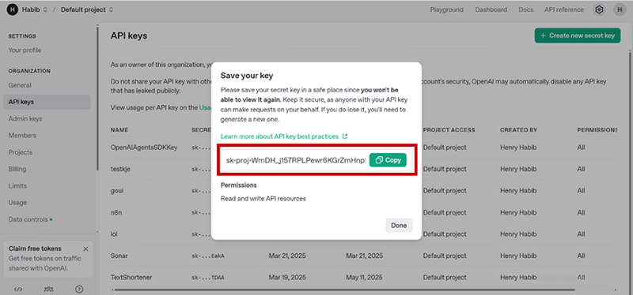
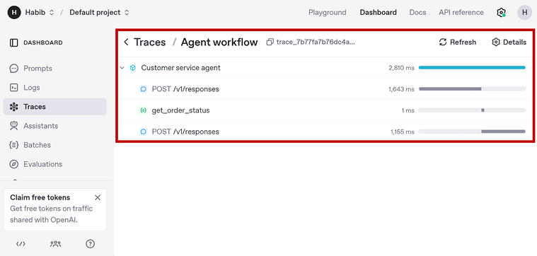
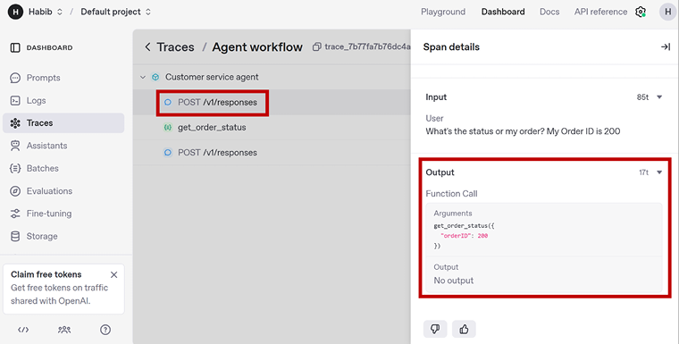
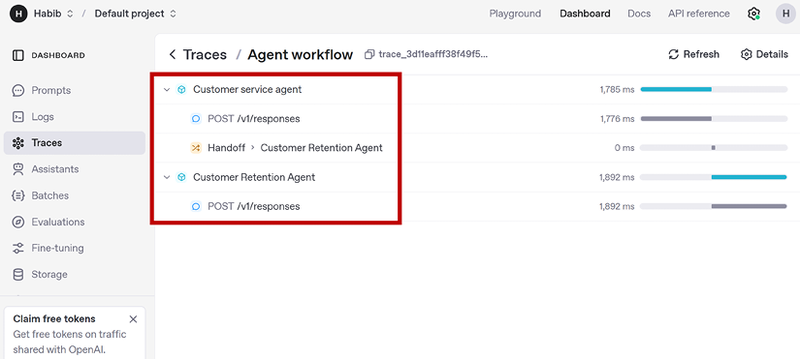

# 模块三：环境搭建与第一个 Agent

> 对应 PDF 第 48-69 页（Chapter 3: Environment Setup and Developing Your First Agent）

---

## 概念讲解

### 1. 环境搭建：从零到能跑 Agent

搭环境这件事看起来无聊，但 OpenAI Agents SDK 的环境其实很轻量——你只需要三样东西：Python、SDK 本身、和一把 API Key。

#### Python 版本要求

SDK 要求 **Python 3.9+**。在终端跑一下确认版本：

```bash
python --version
# 输出应该 >= 3.9，比如 Python 3.10.6
```

如果版本不够或者没装，去 [python.org/downloads](https://www.python.org/downloads/) 下载。Windows 用户记得把 Python 加到 PATH 环境变量里。

#### 创建项目结构和虚拟环境

推荐用虚拟环境（Virtual Environment）隔离依赖，避免和系统其他项目冲突：

```bash
# 创建项目目录
mkdir Root
cd Root
mkdir Chapter3 Chapter4

# 创建虚拟环境
python -m venv .venv

# 激活虚拟环境
# macOS / Linux:
source .venv/bin/activate
# Windows:
.venv\Scripts\activate
```

激活后终端前面会出现 `(.venv)` 前缀，说明你已经在虚拟环境里了。

> **注意**：每次打开新终端都需要重新激活虚拟环境，否则跑的是系统全局 Python。

#### 安装 SDK 和依赖

```bash
pip install openai-agents
pip install python-dotenv
```

`openai-agents` 是 SDK 本体，`python-dotenv` 用来安全地加载 `.env` 文件里的环境变量。

#### 配置 OpenAI API Key

API Key 是你调用 OpenAI 模型的"通行证"，获取步骤：

1. 去 [platform.openai.com](https://platform.openai.com/) 注册或登录
2. Settings -> Billing -> 充值至少 $10
3. Settings -> API keys -> Create new secret key
4. **立刻复制保存**——这是你唯一一次能看到完整 Key 的机会



> **图说**：OpenAI 平台的 API Key 管理界面。创建后只显示一次，务必立即复制保存。

**安全存储**：在项目根目录创建 `.env` 文件：

```
OPENAI_API_KEY="sk-..."
```

> **绝对不要**把 API Key 硬编码在代码里或提交到 Git 仓库。有人拿到你的 Key 就能花你的钱。如果怀疑泄露了，立刻去 OpenAI 后台 Revoke 掉那把 Key。

最终的项目目录结构：

```
Root/
├── .venv/           # 虚拟环境
├── .env             # API Key（不要提交到 Git）
├── Chapter3/
└── Chapter4/
```

#### 验证环境

写一个最小测试脚本 `verify_environment_setup.py`：

```python
import os
from dotenv import load_dotenv
from agents import Agent, Runner

# 加载 .env 文件中的环境变量
load_dotenv()

# 获取 API Key
api_key = os.getenv("OPENAI_API_KEY")

if not api_key:
    print("Error: OPENAI_API_KEY not found. Please set it in your .env file.")
else:
    print("API Key loaded successfully.")

# 创建一个最简单的 Agent 并运行
agent = Agent(name="Echo Agent", instructions="Return the words 'Setup successful'")
result = Runner.run_sync(agent, "Run setup")
print(result.final_output)
```

如果看到以下输出，说明环境搭建成功：

```
API Key loaded successfully.
Setup successful
```

---

### 2. Google Colab 替代方案

如果你不想在本地搭环境（比如电脑权限有限），可以用 Google Colab 作为替代。Colab 本质上是一个云端 Jupyter Notebook，Python 已经预装好了。

在 Colab 中使用 SDK 的步骤：

```python
# 第一个 cell：安装 SDK
!pip install openai-agents

# 第二个 cell：设置 API Key
import os
os.environ["OPENAI_API_KEY"] = "your-api-key-here"

# 之后就可以正常 import 和使用了
from agents import Agent, Runner
```

**优缺点**：

| 方面 | 本地开发 | Google Colab |
|------|----------|-------------|
| 环境搭建 | 需要手动配置 | 零配置 |
| 文件管理 | 完全控制 | 需通过 Files 面板上传 |
| 适用范围 | 所有场景 | 大部分场景，高级网络/系统功能受限 |
| 分享协作 | 需要 Git 等工具 | 一键分享 Notebook |

> **建议**：学习阶段用 Colab 很方便，但正式项目还是推荐本地开发，文件管理和调试体验更好。

---

### 3. Python 前置知识：SDK 为什么需要这些特性

OpenAI Agents SDK 是纯 Python 构建的，它巧妙利用了 Python 的几个特性来让 LLM "理解"你的工具。这不是普通的 Python 教程——这里讲的是 **SDK 为什么需要这些特性**。

#### 3.1 Type Hints（类型注解）

**定义**：Type Hints 是 Python 的可选类型标注，用来声明函数参数和返回值的类型。

**SDK 为什么需要它**：SDK 会**检查你函数的类型注解**，然后把类型信息传给 LLM，让 LLM 知道你的工具需要什么类型的参数、返回什么类型的结果。没有类型注解，LLM 就不知道该传 `int` 还是 `str`。

```python
def get_order_status(orderID: int) -> str:
    # orderID: int 告诉 SDK 和 LLM："这个参数必须是整数"
    # -> str 告诉 SDK："返回值是字符串"
    ...
```

**核心思想**：Type Hints 在普通 Python 里是"可选的好习惯"，但在 SDK 里是**功能性的必需品**——它直接影响 LLM 能否正确调用你的工具。

#### 3.2 Docstrings（文档字符串）

**定义**：Docstring 是写在函数定义之后的字符串，用来描述函数做什么。

**SDK 为什么需要它**：Docstring 会被 SDK 提取出来作为 **metadata** 传给 LLM，帮助 LLM 理解这个工具的用途、参数含义、返回值含义。简单说，Docstring 就是你写给 LLM 看的"工具说明书"。

```python
def get_order_status(orderID: int) -> str:
    """
    Returns the order status given an order ID
    Args:
        orderID (int) - Order ID of the customer's order
    Returns:
        string - Status message of the customer's order
    """
    ...
```

> **实际影响**：Docstring 写得好，LLM 就更准确地知道什么时候该用这个工具、怎么用。写得模糊或不写，LLM 可能误用或不用。

#### 3.3 Decorators（装饰器）

**定义**：装饰器是 Python 的一种语法糖，用 `@` 符号标记一个函数，给它"套上一层壳"来增强或修改行为。

**SDK 为什么需要它**：SDK 用 `@function_tool` 装饰器来**标记一个普通 Python 函数为工具**。加了这个装饰器，SDK 就知道这个函数可以被 Agent 调用，并自动提取它的名称、类型注解、docstring 等信息。

```python
@function_tool  # 这一行把普通函数变成了 Agent 可调用的工具
def get_order_status(orderID: int) -> str:
    """Returns the order status given an order ID"""
    ...
```

**一句话总结**：`@function_tool` = "这个函数是工具，Agent 可以用它"。

#### 3.4 三者合体的完整示例

下面这段代码展示了 decorator + type hints + docstring 如何在一个工具函数中协同工作：

```python
@function_tool  # 装饰器：标记为工具
def get_order_status(orderID: int) -> str:  # 类型注解：告诉 LLM 参数和返回类型
    """
    Returns the order status given an order ID
    Args:
        orderID (int) - Order ID of the customer's order
    Returns:
        string - Status message of the customer's order
    """  # 文档字符串：告诉 LLM 工具用途
    if orderID in (100, 101):
        return "Delivered"
    elif orderID in (200, 201):
        return "Delayed"
    elif orderID in (300, 301):
        return "Cancelled"
```

#### 3.5 Async/Await（异步编程）

**定义**：异步编程让程序可以在等待某个操作（如 API 调用）时去做别的事，而不是傻等。Python 通过 `async def` 和 `await` 关键字支持异步。

**SDK 为什么需要它**：Agent 工作流的本质是大量等待——等 LLM 响应、等工具执行、等 API 返回。如果用同步方式，每次等待都会阻塞整个程序。异步方式下，Agent 可以同时处理多个工具调用、多个 Agent 的并行运行。

```python
# 同步方式（简单场景够用）
result = Runner.run_sync(agent, "Hello")

# 异步方式（推荐，复杂场景必须）
async def main():
    result = await Runner.run(agent, "Hello")
    print(result.final_output)

import asyncio
asyncio.run(main())
```

**关键点**：

| 方式 | 语法 | 适用场景 |
|------|------|----------|
| 同步 `Runner.run_sync()` | 普通调用 | 单 Agent、简单任务、学习用 |
| 异步 `await Runner.run()` | `async def` + `await` | 多 Agent 并行、多工具并行、生产环境 |

> **实际建议**：书中前几章用 `Runner.run_sync()` 就够了，但养成写 async 的习惯，因为 SDK 的核心就是围绕异步设计的。

#### 3.6 Pydantic（数据验证库）

**定义**：Pydantic 是一个 Python 库，让你定义数据结构（Model），然后自动验证输入数据是否符合这个结构。

**SDK 中的三个用途**：

| 用途 | 说明 | 好处 |
|------|------|------|
| **工具的结构化输入** | 用 Pydantic Model 定义工具参数，替代简单的 type hints | 可以加验证规则（如 `ge=0, le=150`），LLM 能看到更清晰的 schema |
| **Agent 的结构化输出** | 强制 Agent 输出符合特定 Pydantic Model 的数据 | 保证输出格式一致，适合后续处理或 API 返回 |
| **Guardrails 验证** | 在 Agent 执行流程中用 Pydantic 做数据校验 | 发现不合规的数据时触发 guardrail |

```python
from pydantic import BaseModel, Field

# 定义结构化输入
class PersonInput(BaseModel):
    name: str = Field(..., description="The full name of the person")
    age: int = Field(..., ge=0, le=150, description="The age of the person in years")
    email: str = Field(..., description="The email address of the person")

# 用 Pydantic Model 作为工具参数
@function_tool
def process_person(input: PersonInput) -> str:
    """Processes a person's information and returns a summary."""
    return f"{input.name} is {input.age} years old. Contact: {input.email}"
```

> **什么时候用 Pydantic 而不是普通 type hints**：当参数比较复杂（多个字段、需要验证规则、多个 Agent 之间交换结构化数据）时，用 Pydantic。简单工具用 type hints 就够了。

---

### 4. 第一个 Agent：客服助手

终于到了写 Agent 的时候。我们从一个最简单的客服 Agent 开始，然后逐步加功能。

#### 4.1 最简版本：只有 LLM

```python
import os
from dotenv import load_dotenv
from agents import Agent, Runner

load_dotenv()
api_key = os.getenv("OPENAI_API_KEY")

# 定义 Agent
agent = Agent(
    name="Customer service agent",
    instructions="You are an AI Agent that helps respond to customer queries for a local paper company",
    model="gpt-4o"
)

# 运行 Agent
result = Runner.run_sync(agent, "How do I cancel my order?")
print(result.final_output)
```

输出示例：

```
To cancel your order, please contact our customer service team directly.
You can reach us by phone at [Your Phone Number] or email us at [Your Email Address].
Be sure to have your order number handy so we can assist you quickly.
```

**代码拆解**：

1. `Agent(name, instructions, model)` — 创建一个 Agent 实例。`instructions` 就是 system prompt，决定了 Agent 的"人格"和行为方式
2. `Runner.run_sync(agent, input)` — 同步运行 Agent。`Runner` 是 SDK 的控制逻辑框架（Control Logic Framework），负责管理整个 Agent 执行循环
3. `result.final_output` — 从 `RunResult` 对象中取出最终回复

此时这个 Agent 非常简单：没有工具、没有 Handoff，就是一个加了 system prompt 的 LLM 调用。

---

### 5. Runner Loop（控制逻辑框架）详解

这是理解 SDK 的**核心概念**。不管你的 Agent 多复杂，Runner 的循环逻辑都是一样的：

```
Runner 调用 LLM
    ↓
LLM 返回结果
    ↓
├── 返回 final_output → 结束循环，返回结果给用户
├── 返回 tool_call → 执行工具 → 结果追加到上下文 → 重新循环
└── 返回 handoff → 切换到目标 Agent → 重新循环
```

**用一个类比理解**：Runner 就像一个项目经理。他问员工（LLM）："这个任务你搞定了吗？" 员工可能说：
- "搞定了，这是结果"（final_output）→ 项目经理把结果交给客户
- "我需要查一下数据库"（tool_call）→ 项目经理帮他查，把结果拿回来给他，再问一遍
- "这个问题不归我管，应该找小王"（handoff）→ 项目经理把任务转给小王

这个循环会持续下去，直到得到 final_output 或者超过最大循环次数。

---

### 6. 添加工具（Tool）

接下来给 Agent 加一个工具——根据订单 ID 查询订单状态：

```python
from agents import Agent, Runner, function_tool

# 定义工具
@function_tool
def get_order_status(orderID: int) -> str:
    """
    Returns the order status given an order ID
    """
    if orderID in (100, 101):
        return "Delivered"
    elif orderID in (200, 201):
        return "Delayed"
    elif orderID in (300, 301):
        return "Cancelled"

# 定义 Agent，注意 tools 参数
agent = Agent(
    name="Customer service agent",
    instructions="You are an AI Agent that helps respond to customer queries for a local paper company",
    model="gpt-4o",
    tools=[get_order_status]
)

# 运行
result = Runner.run_sync(agent, "What's the status of my order? My Order ID is 200")
print(result.final_output)
```

输出：

```
Your order with ID 200 is currently delayed. If you have any further questions
or need assistance, feel free to let me know!
```

**添加工具只需要两步**：

1. 在函数上加 `@function_tool` 装饰器
2. 在 `Agent()` 的 `tools` 参数里传入函数列表

**Agent 会自己决定是否调用工具**。这是 Agentic AI 最重要的特性之一：工具选择不是确定性的（deterministic），而是基于上下文的。如果用户问的是 "How do I change my password?"，Agent 就不会去调 `get_order_status`。

#### 这次 Runner Loop 发生了什么

1. LLM 收到 system prompt + 用户输入 + 可用工具列表
2. LLM 判断："用户在问订单状态，我有 `get_order_status` 这个工具，需要调用它"
3. LLM 返回 tool_call：`get_order_status(orderID=200)`
4. Runner 执行工具，得到返回值 `"Delayed"`
5. Runner 把工具结果追加到上下文，再调一次 LLM
6. LLM 综合用户问题和工具结果，生成 final_output 返回

---

### 7. Tracing（追踪）：看清 Agent 的每一步

OpenAI 提供了一个非常好用的 Tracing UI，可以看到 Agent 运行的每一个细节——每次 LLM 调用、每次工具执行、每次 Handoff。

**查看方式**：

1. 登录 [platform.openai.com](https://platform.openai.com/)
2. Dashboard -> Traces
3. 找到最近的 trace 记录



> **图说**：OpenAI Traces UI 展示了一次完整的 Agent 运行过程。可以看到 Runner 先调用 LLM，LLM 决定调用 `get_order_status` 工具，工具返回 "Delayed"，然后 LLM 基于工具结果生成最终回复。



> **图说**：Trace 详情页面。点击每一步可以看到具体的输入输出——第一步 LLM 调用返回了 tool_call 而非 final_output；第二步工具执行返回 "Delayed"；第三步 LLM 综合所有信息生成最终回答。

Tracing 的价值在于**调试**：当 Agent 行为不符合预期时，你可以看到它在哪一步做了什么决定、为什么那样决定。后续章节会深入讲 Tracing。

---

### 8. 添加 Handoff（任务移交）

最后一个增强：让 Agent 在需要时把任务交给另一个专门处理客户挽留的 Agent。

**场景**：客户想取消订单/注销账户 -> 主 Agent 不直接处理 -> 交给"客户挽留 Agent"，后者被指示采用挽留策略、提供折扣等。

```python
# 定义客户挽留 Agent
customer_retention_agent = Agent(
    name="Customer Retention Agent",
    instructions="You are an AI agent that responds to customers that want to close their accounts and retains their business. Be very courteous, relatable, and kind. Offer discounts up to 10% if it helps",
    model="gpt-4.1"
)

# 主 Agent 加上 handoffs 参数
agent = Agent(
    name="Customer service agent",
    instructions="You are an AI Agent that helps respond to customer queries for a local paper company",
    model="gpt-4o",
    tools=[get_order_status],
    handoffs=[customer_retention_agent]
)

# 运行：用户要取消，触发 handoff
result = Runner.run_sync(agent, "I want to cancel my order and account. You delayed my order for the 3rd time!")
print(result.final_output)
```

输出：

```
I sincerely apologize for the repeated delays with your order. I understand how
frustrating and disappointing this experience has been, and I want to make things right.

While I know you're considering canceling, I'd love the opportunity to make it up
to you. As a thank you for your patience, I can offer you a 10% discount on your
order, and I will personally monitor your order to ensure there are no further issues.

If you still prefer to cancel, I will completely respect your decision and assist
with that right away. Please let me know how you'd like to proceed -- your
satisfaction is very important to us!
```

**Handoff 的工作原理**：

1. 主 Agent 收到用户输入
2. LLM 判断："用户要取消，我有一个专门处理挽留的 Agent，应该交给它"
3. LLM 返回 handoff（而非 final_output 或 tool_call）
4. Runner 把控制权切换到 `customer_retention_agent`，连带用户的对话上下文
5. 挽留 Agent 接管，处理请求，生成 final_output



> **图说**：Handoff 的 Tracing 视图。可以清楚地看到主 Agent 在第一步决定 handoff，然后控制权转移到 Customer Retention Agent，由后者完成最终回复。

**添加 Handoff 的关键代码**：

```python
# 1. 创建目标 Agent
customer_retention_agent = Agent(name="...", instructions="...", model="...")

# 2. 在主 Agent 中添加 handoffs 参数
agent = Agent(..., handoffs=[customer_retention_agent])
```

和工具一样，**Agent 自己决定什么时候 handoff**——如果用户问的是订单状态而不是要取消，就不会触发 handoff。

#### Agent 现在的完整能力

此时我们的 Agent 系统已经有三种行为模式：

| 用户意图 | Agent 行为 | Runner Loop 路径 |
|----------|-----------|-----------------|
| 一般问题（如"怎么改密码"） | 直接回答 | LLM -> final_output |
| 查询订单状态 | 调用工具 | LLM -> tool_call -> 执行工具 -> LLM -> final_output |
| 要取消订单/注销 | 移交给挽留 Agent | LLM -> handoff -> 挽留 Agent LLM -> final_output |

---

## 问答记录

> 待补充（学习后讨论时填写）

---

## 重点标记

1. **环境搭建三件套**：Python 3.9+ / `pip install openai-agents` + `python-dotenv` / `.env` 文件存 API Key
2. **Type Hints 是功能性的**：SDK 把你函数的类型注解传给 LLM，让 LLM 知道工具需要什么参数。不是可选的"好习惯"，而是必需品
3. **Docstring 是写给 LLM 的说明书**：SDK 提取 docstring 作为 metadata 传给 LLM，帮助它理解工具用途
4. **@function_tool 一行搞定**：任何 Python 函数加上这个装饰器就变成 Agent 可调用的工具
5. **Runner Loop 是核心循环**：LLM 调用 -> 返回 final_output / tool_call / handoff -> 执行 -> 追加上下文 -> 再循环，直到得到 final_output
6. **工具选择不是确定性的**：Agent 根据上下文决定是否调用工具，有工具不代表一定会用
7. **Handoff 实现 Agent 专业化**：每个 Agent 有自己的 persona 和能力，主 Agent 判断什么时候该交给谁
8. **Tracing 是调试利器**：OpenAI Traces UI 能看到每次 LLM 调用、工具执行、Handoff 的完整链路
9. **异步优先**：SDK 围绕 async 设计，简单场景可以用 `Runner.run_sync()`，但复杂场景推荐 `await Runner.run()`
10. **Pydantic 用于复杂场景**：简单工具用 type hints，复杂结构化输入/输出/验证用 Pydantic Model
