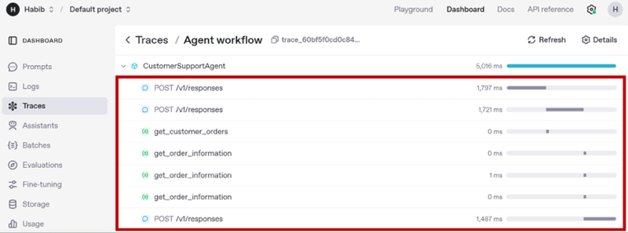
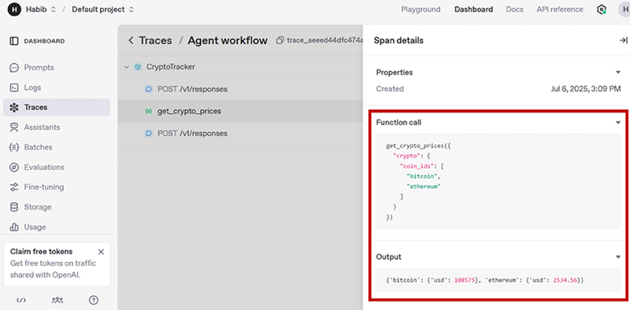
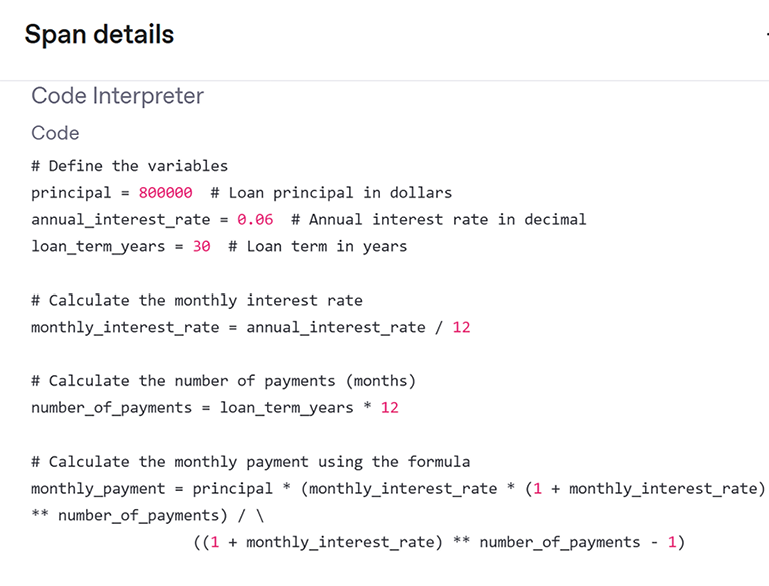
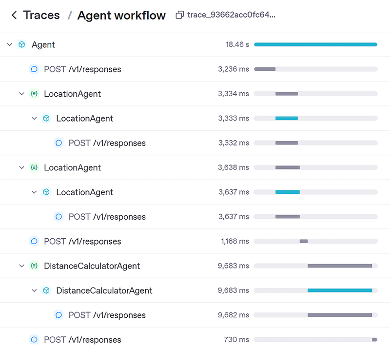

# 模块四：Agent 工具与 MCP

> 对应 PDF 第 70-102 页（Chapter 4: Agent Tools and MCPs）

---

## 概念讲解

### 1. 工具的三大类别

Agent 的核心价值在于"能做事"，而做事靠的就是工具（Tools）。SDK 把工具分成三类：

| 类别 | 说明 | 典型场景 |
|------|------|----------|
| **Function Tools** | 用 `@function_tool` 装饰器把普通 Python 函数变成工具 | 计算、数据库查询、API 调用 |
| **Hosted Tools** | OpenAI 官方预置的托管工具，零配置直接用 | Web 搜索、文件检索、代码执行、图片生成 |
| **Agents-as-Tools** | 把一个完整 Agent 包装成工具给另一个 Agent 调用 | 分工协作、层级编排 |

**核心思想**：工具是 Agent 与外部世界交互的唯一通道。没有工具的 Agent 只能聊天，有了工具的 Agent 才能"干活"。

---

### 2. Function Tools（自定义工具）

#### 基本定义

用 `@function_tool` 装饰器就能把任何 Python 函数注册为 Agent 可调用的工具。SDK 会自动从函数签名中提取三样东西：

- **工具名称**：来自函数名（如 `get_order_status`）
- **工具描述**：来自 docstring
- **输入参数 schema**：来自 type hints（如 `orderID: int`）

```python
from agents import Agent, Runner, function_tool

@function_tool
def get_order_status(orderID: int) -> str:
    """
    Returns the order status given an order ID
    Args:
        orderID (int) - Order ID of the customer's order
    Returns:
        string - Status message of the customer's order
    """
    if orderID in (100, 101):
        return "Delivered"
    elif orderID in (200, 201):
        return "Delayed"
    elif orderID in (300, 301):
        return "Cancelled"

agent = Agent(name="Customer service agent",
    instructions="You are an AI Agent that helps respond to customer queries",
    model="gpt-4o",
    tools=[get_order_status])
```

**为什么重要**：你不需要手写 JSON schema，SDK 自动从 Python 函数签名推导出来。写好函数名和 docstring 就行，因为 LLM 就是靠这些信息来决定"要不要调用这个工具"。

> **注意**：`@function_tool` 同时支持 `def` 和 `async def`。如果你的工具需要调外部 API 或数据库，建议用 async 版本。

#### 参数覆写

如果函数名不够直观，可以手动覆写工具的名称和描述：

```python
@function_tool(
    name_override="Get Status of Current Order",
    description_override="Returns the status of an order given the customer's Order ID",
    docstring_style="Args: Order ID in Integer format"
)
def get_order_status(orderID: int) -> str:
    ...
```

**适用场景**：函数名太通用、多个工具结构相似需要让 LLM 区分、需要本地化或格式规范化。

#### 使用 Pydantic 做复杂输入校验

当工具需要接收多个字段或嵌套结构时，用 Pydantic `BaseModel` 作为输入参数：

```python
from pydantic import BaseModel

class RefundRequest(BaseModel):
    order_id: str
    customer_email: str
    reason: str

@function_tool
def process_refund(request: RefundRequest) -> str:
    """Process a refund request and return confirmation."""
    return (f"Refund request for order {request.order_id} has been submitted. "
            f"A confirmation will be sent to {request.customer_email}.")
```

**Pydantic 的双重价值**：
1. 让 LLM 看到清晰的嵌套 JSON schema，更准确地构造输入
2. 自动做输入校验 -- 如果 LLM "幻觉"了（比如漏掉必填字段、类型错误），Pydantic 会抛 `ValidationError`，你可以捕获处理，而不是让程序默默出错

> **重点提醒**：LLM 调用工具时传的参数不是确定性的，它可能传错。Pydantic 校验是你的安全网。

---

### 3. Agent 与工具的行为控制

Agent 默认自主决定"要不要调工具、调哪个"。但有些场景你需要更精细的控制。SDK 提供两个关键设置：

#### tool_choice -- 控制"是否必须用工具"

| 值 | 行为 |
|----|------|
| `"auto"` | 模型自己决定是否用工具（默认） |
| `"required"` | 强制模型必须用工具，不允许直接回答 |
| `"none"` | 禁止模型用任何工具 |
| `"工具名"` | 强制调用指定工具（如 `"get_weather"`） |

```python
from agents import ModelSettings

agent = Agent(
    name="Strict customer service agent",
    instructions="You must always use the backend system to check order status.",
    tools=[get_order_status],
    model_settings=ModelSettings(tool_choice="required")
)
```

**适用场景**：金融/法律合规场景必须从数据源取数据、测试阶段隔离验证单个工具。

> **注意**：如果设了 `tool_choice="required"` 但没有合适的工具，模型会报错或拒绝回答。

#### tool_use_behavior -- 控制"工具调完后怎么办"

| 值 | 行为 |
|----|------|
| `"run_llm_again"` | 工具输出返回给 LLM 再处理（默认） |
| `"stop_on_first_tool"` | 第一个工具的输出直接作为最终回答 |
| `StopAtTools.stop_at_tool_names(["..."])` | 指定哪些工具触发后直接返回输出 |

```python
from agents import StopAtTools

agent = Agent(
    name="Invoice generator agent",
    instructions="Generate and return an invoice when requested.",
    tools=[create_invoice],
    stop=StopAtTools.stop_at_tool_names(["create_invoice"])
)
```

**适用场景**：工具输出本身就是最终答案（计算结果、发票文本、数据库响应），不需要 LLM 再"加工"一遍。好处是减少 LLM 调用、保证输出精确性。

---

### 4. 工具链式调用（Chained Tool Calls）

LLM 不仅能决定用哪个工具，还能自动编排**多步工具调用的顺序**。比如：

1. 先调 `get_customer_orders("CUST123")` 获取订单列表 `["ORD001", "ORD002", "ORD003"]`
2. 再逐个调 `get_order_information("ORD001")`、`get_order_information("ORD002")`...

```python
@function_tool
def get_customer_orders(customer_id: str) -> str:
    """Retrieve all order IDs associated with a given customer ID."""
    if customer_id == "CUST123":
        return ["ORD001", "ORD002", "ORD003"]

@function_tool
def get_order_information(order_id: str) -> str:
    """Fetch detailed information about a specific order."""
    status_map = {"ORD001": "Shipped", "ORD002": "Processing", "ORD003": "Delivered"}
    return f"Order {order_id} is currently {status_map.get(order_id, 'Unknown')}."

agent = Agent(
    name="CustomerSupportAgent",
    instructions="You are a customer service assistant.",
    tools=[get_customer_orders, get_order_information]
)
```



> **图说**：Traces 模块显示 Agent 先调了 `get_customer_orders`，再对每个订单分别调 `get_order_information`，整个编排完全由 LLM 自主完成。

**核心要点**：你不需要硬编码工作流，LLM 会根据中间结果动态决定下一步调哪个工具。SDK 的 Runner loop 负责编排。

---

### 5. OpenAI Hosted Tools（托管工具）

OpenAI 官方提供的一组预构建工具，托管在 OpenAI 服务器上，开箱即用。



> **图说**：Hosted Tools 包括 Web Search、File Search、Image Generation、Code Interpreter、Computer Use 等，均由 OpenAI 服务器运行。

| 工具 | 功能 | 典型用途 |
|------|------|----------|
| `WebSearchTool` | 实时搜索互联网 | 查最新消息、实时数据 |
| `FileSearchTool` | 在向量数据库中搜索文档 | 内部知识库问答（RAG） |
| `CodeInterpreterTool` | 在沙盒环境中写和执行 Python 代码 | 数据分析、复杂计算 |
| `ImageGenerationTool` | 根据文本提示生成图片 | 产品原型、创意设计 |
| `ComputerTool` | 操作电脑/浏览器 | 自动化操作 |
| `LocalShellTool` | 执行本地 shell 命令 | 本地系统管理 |

> **注意**：Hosted Tools 会产生 token 费用，且只能搭配 OpenAI 自家模型（GPT-4 及以上）使用，不支持第三方模型。

#### WebSearchTool

最简单也最常用的工具之一。核心参数：

- `user_location`：指定搜索位置（影响本地化结果）
- `search_context_size`：`"low"` / `"medium"` / `"high"`，控制检索深度

```python
from agents import Agent, Runner, WebSearchTool

websearchtool = WebSearchTool(user_location={
    "type": "approximate",
    "country": "CA",
    "city": "Toronto",
    "region": "Ontario",
})

agent = Agent(
    name="WebTool",
    instructions="You are an AI agent that answers web questions.",
    tools=[websearchtool]
)

result = Runner.run_sync(agent, "Who won the 2025 Stanley Cup?")
```


**适用场景**：需要实时信息、LLM 训练数据截止日期之后的事件、地理位置相关的查询。

#### FileSearchTool

本质是 OpenAI 托管的 RAG 方案。你先把文档上传到 OpenAI 平台创建 Vector Store，然后 Agent 就能通过语义搜索从文档中检索相关内容。

```python
from agents import Agent, Runner, FileSearchTool

filesearchtool = FileSearchTool(
    vector_store_ids=['vs_686ce7bc2ad081918f297d962afaee95']
)

agent = Agent(
    name="DocSearchAgent",
    instructions="You answer questions from the listed vector stores.",
    tools=[filesearchtool]
)
```

关键参数：
- `vector_store_ids`：必填，要搜索的向量数据库 ID 列表
- `max_num_results`：返回结果数量
- `include_search_results`：是否包含搜索结果全文

#### CodeInterpreterTool

让 Agent 自己写 Python 代码并在沙盒容器中执行。跟自定义计算工具的区别是：你不需要预先定义公式，Agent 自己推导。

```python
from agents import Agent, Runner, CodeInterpreterTool
from agents.tool import CodeInterpreter

tool_config = CodeInterpreter(
    container={"type": "auto"},
    type="code_interpreter"
)
codetool = CodeInterpreterTool(tool_config=tool_config)

agent = Agent(
    name="CodeTool",
    instructions="You write and run Python code to answer questions.",
    tools=[codetool]
)
```



> **图说**：Traces 模块中可以看到 Agent 写了计算抵押贷款月供的 Python 代码，在容器中执行后返回结果。

**适用场景**：数据分析、复杂数学计算、生成图表。简单说就是给 Agent 配了一个"初级数据分析师"。

#### ImageGenerationTool

让 Agent 根据文本 prompt 生成图片，返回图片 URL。

```python
from agents import Agent, Runner, ImageGenerationTool
from agents.tool import ImageGeneration

tool_config = ImageGeneration(type="image_generation")
imagetool = ImageGenerationTool(tool_config=tool_config)

agent = Agent(
    name="ImageTool",
    instructions="You are an AI agent that generates images.",
    tools=[imagetool]
)
```

> **注意**：图片生成比文本更容易"幻觉"，生成的图片可能跟输入 prompt 不一致。

---

### 6. Agents-as-Tools（把 Agent 当工具用）

**定义**：把一个完整的 Agent（有自己的 instructions、tools、model）包装成一个 `FunctionTool`，让另一个 Agent 像调普通工具一样调它。

这是一种**层级编排模式**：一个 Orchestrator（指挥者）协调多个 Worker（执行者），每个 Worker 是一个独立 Agent。

#### Handoff vs Agent-as-Tool 的关键区别

| | Handoff 模式 | Agent-as-Tool 模式 |
|---|---|---|
| **控制权** | 完全移交给下一个 Agent | Orchestrator 始终保持控制 |
| **类比** | 客服把你转接到另一个部门 | 客服让你等一下，自己去问同事后回来告诉你 |
| **适合场景** | 对话属于另一个 Agent 的领域 | 需要综合多个 Worker 的结果 |
| **可见性** | 中间过程不一定可见 | 全程可追踪 |

#### 使用方法

```python
from agents import Agent, Runner, WebSearchTool, CodeInterpreterTool

# Worker 1: 获取地理坐标
location_agent = Agent(
    name="LocationAgent",
    instructions="You search the web and get lat/lng for a city.",
    tools=[WebSearchTool()]
)

# Worker 2: 计算距离
distance_calculator_agent = Agent(
    name="DistanceCalculatorAgent",
    instructions="You write Python code to calculate distance between two points.",
    tools=[CodeInterpreterTool(...)]
)

# Orchestrator: 编排两个 Worker
agent = Agent(
    name="Agent",
    instructions="Calculate distance between two locations.",
    tools=[
        location_agent.as_tool(
            tool_name="LocationAgent",
            tool_description="Returns lat/lng for a location"
        ),
        distance_calculator_agent.as_tool(
            tool_name="DistanceCalculatorAgent",
            tool_description="Calculates distance between two lat/lng points"
        )
    ]
)

result = Runner.run_sync(agent, "What's the distance between Toronto and Vancouver?")
# 输出：approximately 3363.64 kilometers
```



> **图说**：Traces 模块显示 Orchestrator 先调了两次 LocationAgent（分别查 Toronto 和 Vancouver 的坐标），再调 DistanceCalculatorAgent 计算距离。

**核心价值**：模块化、可复用、中心化控制。每个 Worker Agent 可以独立开发和测试，Orchestrator 负责编排。

---

### 7. MCP（Model Context Protocol）

**定义**：MCP 是一个标准化协议，定义了 AI Agent 如何发现和调用外部服务器上的工具。你可以把它理解为 AI 工具的 "USB-C 接口" -- 不管谁做的工具，只要遵循 MCP 协议，就能即插即用。


> **图说**：MCP 定义了 Agent（客户端）与工具服务器之间的标准通信协议，实现跨框架的工具互操作。

**为什么需要 MCP**：以前每个 SDK（Agents SDK、LangGraph、CrewAI）连接工具的方式都不同。你在一个框架里写的工具没法直接搬到另一个框架。MCP 解决了这个互操作性问题 -- 写一次工具，到处用。

#### 在 Agents SDK 中使用 MCP

```python
from agents import Agent, Runner, HostedMCPTool
from agents.tool import Mcp

tool_config = Mcp(
    server_label="CryptocurrencyPriceFetcher",
    server_url="https://mcp.api.coingecko.com/sse",
    type="mcp",
    require_approval="never"
)
mcp_tool = HostedMCPTool(tool_config=tool_config)

agent = Agent(
    name="Crypto Agent",
    instructions="You are an AI agent that returns crypto prices.",
    tools=[mcp_tool]
)

result = Runner.run_sync(agent, "What's the price of bitcoin?")
```

**关键参数**：
- `server_label`：工具标签，帮助 LLM 识别
- `server_url`：MCP 服务器端点
- `type`：固定为 `"mcp"`
- `require_approval`：是否需要人工审批（`"never"` / `"always"`）

**工作原理**：Agent 连接到 MCP 服务器 -> 服务器返回可用工具列表 -> LLM 选择合适的工具 -> SDK 发请求到服务器执行 -> 结果返回给 LLM。注意工具逻辑是在远程服务器上执行的，不在本地。

> **安全提醒**：使用外部 MCP 服务器时要注意认证、速率限制和数据隐私。不要把敏感数据发给不可信的 MCP 服务器。

---

### 8. 工具最佳实践

| 实践 | 说明 |
|------|------|
| **清晰的 docstring** | 这是 LLM 判断"要不要用这个工具"的依据，必须准确描述功能和参数 |
| **Pydantic 校验** | 复杂输入用 BaseModel，同时获得 schema 自动生成和输入校验 |
| **错误处理** | 工具内部做好异常处理，不要让未捕获的异常直接传给 LLM |
| **工具粒度** | 一个工具做一件事。太粗粒度的工具 LLM 不知道何时用，太细粒度的又会增加调用复杂度 |
| **优先用 Hosted Tools** | 如果 OpenAI 已经提供了（如 Web 搜索），不要自己造轮子 |
| **指令配合工具** | 在 Agent 的 instructions 中明确引导 LLM 何时、如何使用工具 |

---

## 问答记录

> 待补充（学习后讨论时填写）

---

## 重点标记

1. **三类工具，各有分工**：Function Tools 做自定义逻辑，Hosted Tools 做通用能力，Agents-as-Tools 做分工编排
2. **@function_tool 自动推导 schema**：函数名 + docstring + type hints = LLM 能理解的工具定义，不需要手写 JSON
3. **Pydantic 是双保险**：既让 LLM 看到清晰 schema，又在运行时校验输入，防止幻觉导致的错误数据
4. **tool_choice + tool_use_behavior 组合**：前者控制"是否必须用工具"，后者控制"工具输出后是否还需 LLM 处理"
5. **Agent-as-Tool 不等于 Handoff**：前者 Orchestrator 保持控制，后者完全交接。选错了模式会导致架构问题
6. **MCP 是工具的通用适配器**：一次构建，跨框架使用。对接第三方工具生态的标准方式
7. **工具链式调用由 LLM 自主编排**：你只需提供工具，LLM 会根据中间结果自动决定调用顺序
