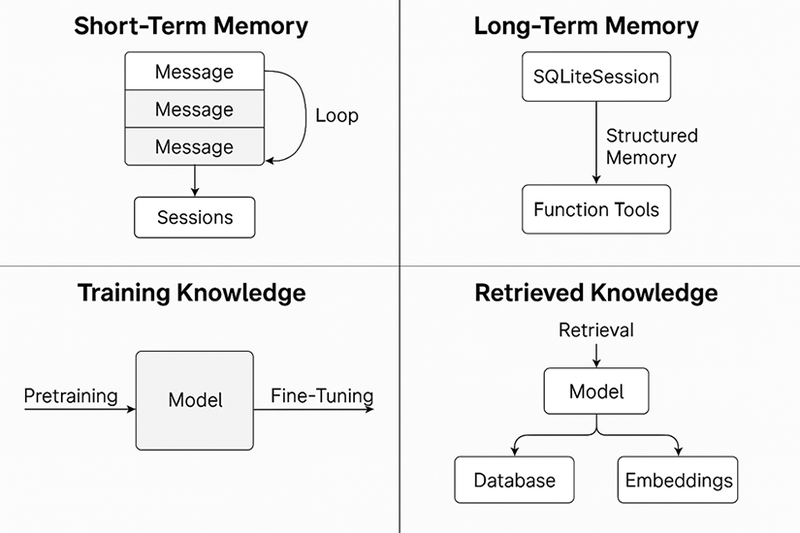
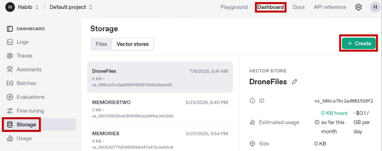
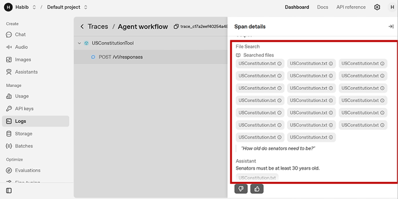

# 模块五：记忆与知识

> 对应 PDF 第 103-129 页（Chapter 5: Memory and Knowledge）

---

## 概念讲解

### 1. 四种记忆与知识模式总览

Agent 要从"无状态的一问一答"进化到"有记忆、有知识的智能助手"，需要理解四种模式：



> **图说**：该图展示了 Agent 记忆与知识的四种模式：短期记忆（Working Memory）、长期记忆（Long-term Memory）、训练知识（Training Knowledge）、检索知识（Retrieved Knowledge）。

| 模式 | 简单说 | 持久性 | 典型实现 |
|------|--------|--------|----------|
| **短期记忆** | 本次对话中"记住上下文" | 会话内 | 消息列表、Sessions 类 |
| **长期记忆** | 跨会话"记住用户偏好" | 跨会话 | SQLiteSession（持久化）、结构化记忆工具 |
| **训练知识** | 模型预训练时"学到的知识" | 永久（但有截止日期） | 模型权重本身 |
| **检索知识** | 运行时"去外面查资料" | 实时 | API 调用、数据库查询、RAG |

**核心思想**：记忆解决的是"上下文连贯性"问题，知识解决的是"信息来源"问题。两者结合，Agent 才能既"记得住"又"答得准"。

---

### 2. 短期记忆（Working Memory）

**定义**：短期记忆就是当前会话内的对话历史。它让 Agent 能理解"它"指的是什么、"之前说的"是哪句话。没有短期记忆的 Agent 就像一条金鱼，每次对话都是全新的。

**有状态 vs 无状态**：
- **无状态（Stateless）**：每次请求独立处理，不记住之前的交互。适合简单、一次性的任务。
- **有状态（Stateful）**：保留之前交互的信息用于后续处理。像 Netflix 记住你看过什么来推荐。聊天机器人必须是有状态的，否则用户体验很差。

#### 方式一：手动维护消息列表

最基础的方式 -- 自己维护一个 `messages` 列表，每次把用户输入和 Agent 响应都追加进去：

```python
from agents import Agent, Runner

agent = Agent(
    name="QuestionAnswer",
    instructions="You are an AI agent that answers questions.",
)

messages = []

# 第一轮
messages.append({"role": "user", "content": "How hot is the sun?"})
result = Runner.run_sync(agent, messages)
messages.append({"role": "assistant", "content": result.final_output})

# 第二轮 -- Agent 能理解 "it" 指的是太阳
messages.append({"role": "user", "content": "How big is it?"})
result = Runner.run_sync(agent, messages)
```

消息中的 `role` 字段有三种值：

| role | 含义 |
|------|------|
| `"system"` | 系统指令，优先级最高 |
| `"user"` | 用户消息 |
| `"assistant"` | 模型生成的回复 |

**动态对话版本**（循环输入）：

```python
messages = []
while True:
    question = input("You: ")
    messages.append({"role": "user", "content": question})
    result = Runner.run_sync(agent, messages)
    print("Agent: ", result.final_output)
    messages.append({"role": "assistant", "content": result.final_output})
```

> **小贴士**：SDK 提供了 `result.to_input_list()` 方法，可以直接获取格式化好的消息列表，代替手动 append assistant 消息。效果相同但代码更简洁。

#### 方式二：Sessions 类

SDK 内置的 `Sessions` 类自动管理消息历史，不需要你手动维护列表。只需指定一个 `session_id`：

```python
from agents import Agent, Runner, SQLiteSession

agent = Agent(
    name="QuestionAnswer",
    instructions="You are an AI agent that answers questions.",
)

session = SQLiteSession("first_session")

while True:
    question = input("You: ")
    result = Runner.run_sync(agent, question, session=session)
    print("Agent: ", result.final_output)
```

**优势**：代码更简洁，消息追踪完全自动化。不同用户/对话用不同的 `session_id`，就能维护独立的记忆上下文。

> **注意**：默认的 `SQLiteSession` 是内存模式（in-memory），程序重启后记忆就没了。要持久化需要加 `db_path` 参数，这个在长期记忆部分会讲。

---

### 3. 管理大型对话（防止上下文爆炸）

**为什么是个问题**：LLM 有固定的上下文窗口（context window），消息列表一直增长迟早会超限。而且长 prompt 还会拖慢响应速度、增加费用。

SDK 提供两种策略：

#### 滑动窗口（Sliding Message Window）

只保留最近 N 条消息，旧消息自动丢弃。实现简单，用 Python 的 `deque` 就行：

```python
from collections import deque

WINDOW_SIZE = 5
messages = deque(maxlen=WINDOW_SIZE)

while True:
    question = input("You: ")
    messages.append({"role": "user", "content": question})
    result = Runner.run_sync(agent, list(messages))
    print("Agent:", result.final_output)
    messages.append({"role": "assistant", "content": result.final_output})
```

| 优点 | 缺点 |
|------|------|
| 简单、成本低 | 会丢失早期重要信息（如用户名、偏好） |
| 响应速度稳定 | 窗口太小会导致上下文断裂 |

**适用场景**：Agent 只需要短期上下文的场景，比如处理单个客服工单。

#### 消息摘要（Message Summarization）

不是直接丢弃旧消息，而是用 LLM 把它们压缩成一段摘要。步骤：

1. 监控消息历史大小，超过阈值时触发
2. 取最早的 N 条消息，交给 LLM 做摘要
3. 用摘要替换原始的 N 条消息

| 优点 | 缺点 |
|------|------|
| 保留了关键信息 | 需要额外 LLM 调用（增加延迟和费用） |
| 上下文不会断裂 | 摘要可能丢失细节 |

**实践中的常见做法**：滑动窗口 + 摘要结合使用。用窗口清理近期消息，用摘要保留早期关键上下文。

---

### 4. 长期记忆（Long-term Memory）

**定义**：跨会话持久保存的记忆。让 Agent 在用户下次回来时还能记住"这个用户上次说过什么"。没有长期记忆的 Agent 就像每天都失忆的人，用户每次都要重新介绍自己。

#### 模式一：持久化消息日志（SQLiteSession + db_path）

最直接的方式 -- 把整个消息历史存到本地 SQLite 数据库：

```python
from agents import Agent, Runner, SQLiteSession

agent = Agent(
    name="QuestionAnswer",
    instructions="You are an AI agent that answers questions.",
)

session = SQLiteSession("first_session", db_path="messages.db")

while True:
    question = input("You: ")
    result = Runner.run_sync(agent, question, session=session)
    print("Agent: ", result.final_output)
```

**验证持久化**：
1. 运行程序，告诉 Agent "I'm Henry"
2. 按 Ctrl+C 退出
3. 重新运行程序，问 "What's my name?"
4. Agent 回答 "Henry" -- 跨会话记忆生效了

**局限性**：
- 消息日志越来越大，加载和处理变慢
- 存了所有对话细节，但真正有用的只是关键事实
- 长消息列表迟早还是会超 LLM 上下文窗口

#### 模式二：结构化记忆（Structured Memory Recall）

更聪明的做法 -- 不存所有消息，只存关键事实。用两个工具实现：

- `save_memory`：Agent 觉得某个信息重要时，调用这个工具存下来
- `load_memory`：需要回忆某类信息时，调用这个工具检索

```python
from agents import Agent, Runner, function_tool
import os, json

FILENAME = 'memory.json'
memory_default = {
    "user_profile": [],
    "order_preferences": [],
    "other": []
}

if not os.path.exists(FILENAME):
    with open(FILENAME, 'w') as f:
        json.dump(memory_default, f, indent=4)

@function_tool
def save_memory(memory_type: str, memory: str) -> str:
    """
    Saves a memory to a memory store.
    Args:
        memory_type: the type of memory to store.
            Choose between user_profile, order_preferences, or other.
        memory: the memory to save
    """
    with open(FILENAME, 'r') as f:
        data = json.load(f)
    data[memory_type].append(memory)
    with open(FILENAME, 'w') as f:
        json.dump(data, f, indent=4)
    return f"Memory ({memory}) saved"

@function_tool
def load_memory(memory_type: str) -> str:
    """
    Loads a set of memory from a memory store.
    Args:
        memory_type: the type of memory to load.
            Choose between user_profile, order_preferences, or other.
    """
    with open(FILENAME, 'r') as f:
        data = json.load(f)
    return "|".join(data[memory_type])

agent = Agent(
    name="QuestionAnswer",
    instructions="You have access to tools that save and load memories. "
                 "Save memories when you learn an important fact. "
                 "Load memories when something is asked about the user.",
    tools=[save_memory, load_memory]
)
```

**工作流程**：
1. 用户说 "I like to have orders sent to the office"
2. Agent 识别为重要偏好 -> 调用 `save_memory("order_preferences", "User prefers orders sent to office")`
3. 下次用户问 "Where do I like my orders sent?" -> Agent 调用 `load_memory("order_preferences")` -> 正确回答

**类比人类记忆**：你跟朋友聊天后，不会记住整段对话，只会记住"他喜欢吃寿司"这个关键事实。结构化记忆就是让 Agent 像人一样只存"摘要性事实"。

| 对比 | 持久化消息日志 | 结构化记忆 |
|------|--------------|-----------|
| 存什么 | 全部消息 | 只存关键事实 |
| 存储增长 | 快（每条消息都存） | 慢（只存提炼的信息） |
| 检索精度 | 低（全量加载） | 高（按类别检索） |
| 上下文窗口压力 | 大 | 小 |
| 适合场景 | 简单场景、短期使用 | 长期运行的个性化 Agent |

> **进阶思路**：示例中用 JSON 文件做存储，生产环境可以换成数据库。更高级的做法是把每条记忆做成向量 embedding 存到 Vector Store，实现语义检索式的记忆。

---

### 5. 训练知识（Training Knowledge）

**定义**：LLM 在预训练阶段从海量数据中"学到的"知识，直接编码在模型权重里。

**优点**：
- **检索速度快**：知识"烤进"了模型权重，响应速度只受计算速度限制
- **覆盖面广**：训练语料是互联网规模的文本，涵盖大量主题

**修改训练知识的方式 -- 微调（Fine-tuning）**：

在特定领域数据集上重新训练模型，更新模型权重。比如用医学病历数据微调，让模型更懂医学。

**微调的局限性**：

| 问题 | 说明 |
|------|------|
| **贵** | 通常起步 $10,000+，还不含模型托管费用 |
| **不灵活** | 基础模型更新了，微调要重做 |
| **知识冲突** | 新知识可能和原有训练数据矛盾，导致模型"两头不靠" |

**结论**：除非需要极深的领域专业化（如医学、法律），否则 RAG（检索增强生成）通常是更实际的选择。

---

### 6. 检索知识（Retrieved Knowledge）

**定义**：运行时根据用户请求从外部数据源实时获取的知识。跟训练知识的本质区别是 -- 检索知识是动态的、可更新的、独立于模型训练的。

检索知识分为两种类型：

#### 结构化数据检索

通过 API 调用或数据库查询获取结构化信息。我们在模块四已经做过很多例子了：

- 调 CoinGecko API 获取加密货币实时价格
- 查数据库获取客户工单历史

这些本质上都是 **工具 + 检索知识** 的组合。

#### 非结构化数据检索（RAG 模式）

当数据源是文档、文章、手册等非结构化文本时，需要用 RAG（Retrieval-Augmented Generation）模式：

**RAG 三步走**：

1. **Retrieve（检索）**：根据用户问题，从知识库中找到相关内容
2. **Augment（增强）**：把检索到的内容加入 LLM 的 prompt
3. **Generate（生成）**：LLM 基于增强后的 prompt 生成回答



> **图说**：RAG 流程图展示了从用户查询到文档检索、再到 LLM 生成回答的完整管道。

**RAG 背后的核心技术**：

| 概念 | 说明 |
|------|------|
| **Embeddings（嵌入向量）** | 把文本转成一串数字，捕获文本的"语义"。语义相近的文本，向量也相近 |
| **Semantic Search（语义搜索）** | 用向量之间的余弦相似度（Cosine Similarity）来衡量文本相关性，而不是关键词匹配 |
| **Vector Store（向量数据库）** | 专门存储文本及其 embedding 的数据库，支持高效的语义搜索 |
| **Chunking（分块）** | 把长文档切成小段，每段分别做 embedding。因为 LLM 的输入长度有限 |

**余弦相似度示例**：

| 基准文本 | 对比文本 | 相似度 |
|----------|----------|--------|
| "I like apples" | "I like bananas" | 0.90（高度相关） |
| "I like apples" | 美国宪法节选 | 0.71（不太相关） |
| "This is very difficult" | "Fitting a square peg into a round hole" | 0.88（语义相近，虽然没有共同关键词） |

**文档摄入（Document Ingestion）流程**：
1. **Chunking**：把文档分成小块
2. **生成 Embedding**：每块文本通过 embedding 模型转成向量
3. **存入 Vector Store**：向量和原文一起存储并建索引

> 这个摄入过程对每组文档只需做一次。

**检索流程**：
1. 把用户查询也转成 embedding
2. 在 Vector Store 中做语义搜索，找到最相似的 Top-N 文本块
3. 把这些文本块注入 LLM prompt -> 生成回答

---

### 7. FileSearchTool 实现 RAG

OpenAI Agents SDK 把整个 RAG 流程（文档摄入 + 检索）自动化了。你只需要：

1. 在 OpenAI 平台上传文档并创建 Vector Store
2. 在代码中使用 `FileSearchTool` 指向该 Vector Store



> **图说**：OpenAI Dashboard 的日志视图，展示了 FileSearchTool 检索到的文本块及其来源信息。

```python
from agents import Agent, Runner, FileSearchTool, SQLiteSession

filesearchtool = FileSearchTool(
    vector_store_ids=['vs_687ed4bb479c81919b530ab152f373d8']
)

agent = Agent(
    name="USConstitutionTool",
    instructions="You answer questions from the listed vector store, "
                 "which has the US Constitution. Answer in one sentence.",
    tools=[filesearchtool]
)

session = SQLiteSession("first_session")

while True:
    question = input("You: ")
    result = Runner.run_sync(agent, question, session=session)
    print("Agent: ", result.final_output)
```

**示例对话**：
```
You: How old do senators need to be?
Agent: Senators must be at least 30 years old.
```

**适用场景**：内部文档问答、知识库搜索、政策/法规查询 -- 任何"让 Agent 从一堆文档里找答案"的需求。

---

### 8. 检索知识的局限性

使用 RAG 时要注意三个常见陷阱：

| 陷阱 | 说明 | 应对 |
|------|------|------|
| **模糊提问** | 用户问 "What is your return policy?" 但没说哪种退货 | 让 Agent 反问确认 |
| **知识库没答案** | 知识库里确实没有相关内容，Agent 可能会编造答案 | 设 fallback 策略，明确告诉用户"我不知道" |
| **多源冲突** | 两份文档给出不同的退货期限 | 在文档元数据中标注优先级和时效性 |

---

## 问答记录

> 待补充（学习后讨论时填写）

---

## 重点标记

1. **有状态 Agent 靠消息列表实现**：手动维护 messages 列表或用 Sessions 类，核心都是把对话历史传给 LLM
2. **上下文窗口是硬约束**：消息列表无限增长会超限。滑动窗口丢旧消息，消息摘要压缩旧消息，实际中两者结合
3. **SQLiteSession + db_path 实现跨会话记忆**：最简单的长期记忆方案，但存全部消息不够高效
4. **结构化记忆是更聪明的做法**：只存关键事实（用户偏好、重要决策），用工具 save/load，像人类记忆一样提炼信息
5. **训练知识有截止日期**：模型只知道训练数据截止前的信息，微调虽能更新但成本高、不灵活
6. **RAG 是检索知识的标准模式**：Retrieve -> Augment -> Generate，适用于结构化和非结构化数据
7. **Embedding + 语义搜索是 RAG 的核心**：不靠关键词匹配，靠语义相似度找相关内容。余弦相似度越高越相关
8. **FileSearchTool 让 RAG 零代码**：上传文档到 OpenAI Vector Store，几行代码就能搭出知识库问答 Agent
