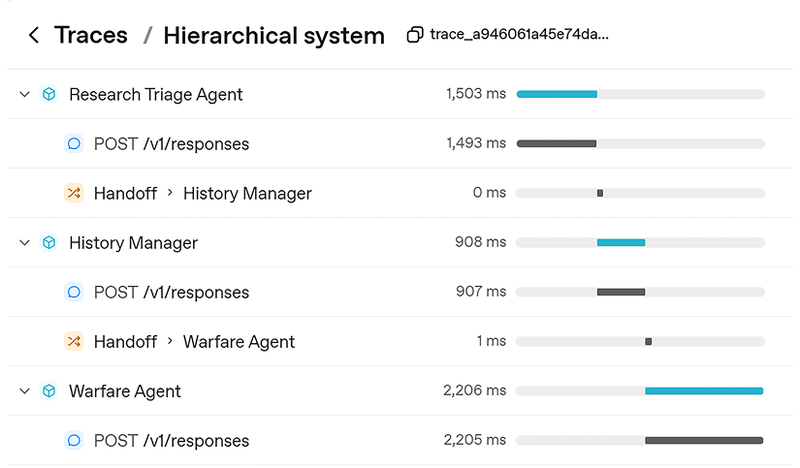
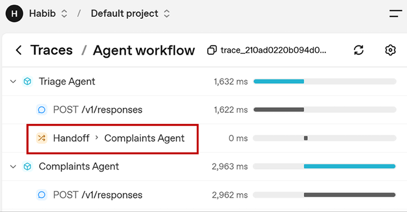
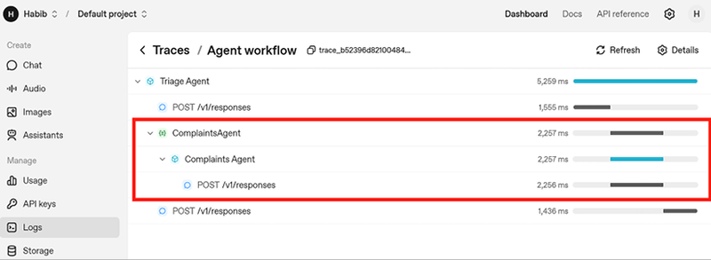
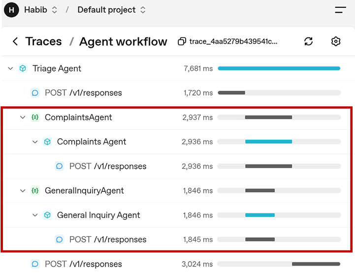
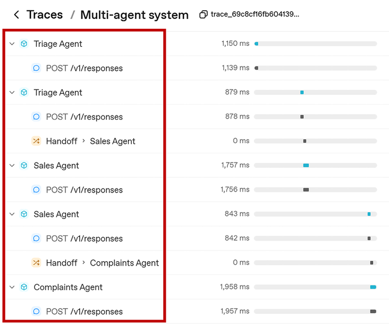
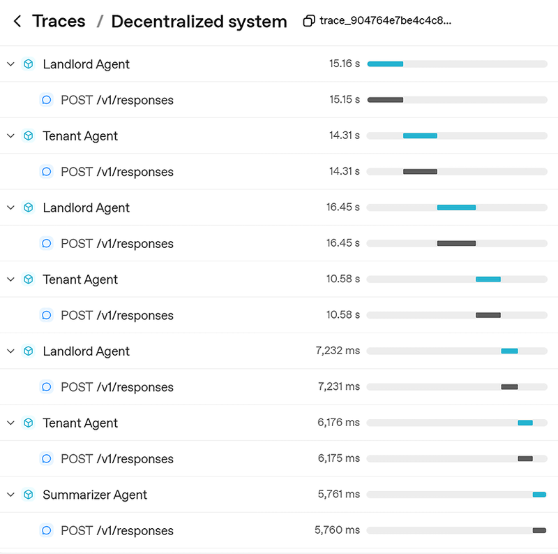

# 模块六：多 Agent 系统与 Handoff 机制

> 对应 PDF 第 130-158 页（Chapter 6: Multi-Agent Systems and Handoffs）

---

## 概念讲解

### 1. 为什么需要多 Agent 系统

**定义**：Multi-Agent System（多 Agent 系统）是指多个专门化的 Agent 协同工作来完成任务的架构。就像一家大公司不可能靠一个人运转——CEO、HR、工程师、销售各司其职——Agent 系统也是同理。

**核心思想**：单个 Agent 再强也有天花板。当问题跨越多个领域、需要不同专长、或者要并行处理时，一个 Agent 就搞不定了。

**单 Agent 的局限性**：

| 局限 | 说明 |
|------|------|
| **领域跨度** | 一个客服 Agent 可能搞得定简单咨询，但同时涉及财务分析、法律推理、技术排障就力不从心了 |
| **专业化不足** | 一个 Agent 塞太多指令，反而什么都做不精 |
| **可扩展性差** | 新增一种能力就得改全部逻辑，维护成本高 |

**多 Agent 的优势**：

- **更高准确度**：每个 Agent 专注自己的领域
- **可扩展性**：新增能力只需加一个专家 Agent
- **韧性**：某个 Agent 出问题不会拖垮整个系统

> **类比**：一个全栈工程师独自做项目 vs 一个团队（前端、后端、设计、测试）协作。后者能做的事情量级完全不同。

---

### 2. 编排方式：确定性 vs 动态

在构建多 Agent 系统之前，首先要决定**谁来控制 Agent 之间的流转**。这有两种根本不同的思路。

#### 2.1 确定性编排（Deterministic Orchestration）

**定义**：Agent 之间的流转逻辑是你**写死的**。哪个 Agent 处理哪类请求，全部用代码预先定义好。

**核心特点**：
- 100% 可预测，每次同样输入走同样路径
- 易于测试、审计、调试
- 成本和耗时可精确预估

**示例**：

```python
from agents import Agent, Runner

complaints_agent = Agent(
    name="Complaints Agent",
    instructions="Handle any customer complaints with empathy and clear next steps."
)
inquiry_agent = Agent(
    name="General Inquiry Agent",
    instructions="Answer general questions about our services promptly."
)

def orchestrate(user_message: str):
    # 写死的路由逻辑
    if ("complaint" in user_message.lower()
        or "problem" in user_message.lower()):
        chosen_agent = complaints_agent
    else:
        chosen_agent = inquiry_agent
    result = Runner.run_sync(chosen_agent, user_message)
    return result.final_output
```

**致命缺陷**：用户说 "my meal is too hot"（没用 complaint 这个词），系统就会路由到错误的 Agent。关键字匹配太脆弱了。

#### 2.2 动态编排（Dynamic Orchestration）

**定义**：把路由决策**交给另一个 LLM**，让它根据用户意图自行判断该转给谁。

**核心特点**：
- 能理解自然语言的意图，不依赖关键词
- 灵活性极强，能处理各种意料之外的表达
- 代价是不可预测——你不确定它会走哪条路、花多少 Token

**示例**：

```python
from agents import Agent, Runner

complaints_agent = Agent(
    name="Complaints Agent",
    instructions="Handle any customer complaints with empathy and clear next steps."
)
inquiry_agent = Agent(
    name="General Inquiry Agent",
    instructions="Answer general questions about our services promptly."
)

triage_agent = Agent(
    name="Triage Agent",
    instructions="Triage the user's request and call the appropriate agent",
    tools=[
        complaints_agent.as_tool(
            tool_name="ComplaintsAgent",
            tool_description="Handle customer complaints with empathy."
        ),
        inquiry_agent.as_tool(
            tool_name="GeneralInquiryAgent",
            tool_description="Answer general questions about our services."
        )
    ]
)
```

这样即使用户说 "my meal is too hot"，triage agent 也能理解这是投诉，路由到正确的 Agent。

**两种方式对比**：

| | 确定性编排 | 动态编排 |
|---|---|---|
| **控制方** | 你写的代码 | LLM 的推理 |
| **可预测性** | 高 | 低 |
| **灵活性** | 低 | 高 |
| **成本可控性** | 精确可算 | 不确定 |
| **适合场景** | 流程固定的工作流 | 开放式、意图多变的场景 |
| **类比** | 编排好的舞蹈 | 即兴表演 |

> **实践建议**：真实系统通常**两者混用**。关键路径用确定性编排保证可靠，模糊环节用动态编排提高灵活性。

---

### 3. Handoff 原语：Agent 间的控制权转移

**定义**：Handoff（移交）是 OpenAI Agents SDK 中实现多 Agent 协作的核心原语。简单说，就是一个 Agent 对另一个 Agent 说："这个任务你比我擅长，交给你了，连同到目前为止的所有上下文一起给你。"

**核心思想**：Handoff = **控制权转移** + **上下文传递**。发起 handoff 的 Agent 完全退出对话，接收方 Agent 全面接管。

**与 `as_tool()` 的关键区别**：

| | `as_tool()`（Agent 作为工具） | Handoff（控制权移交） |
|---|---|---|
| **控制权** | 调用方保持控制，子 Agent 只是"顾问" | 控制权完全转移给新 Agent |
| **对话流** | 调用方继续和用户对话 | 新 Agent 接管和用户的对话 |
| **类比** | 你问同事一个问题，同事回答后你继续干活 | 你把整个项目交给同事，自己退场 |
| **适合场景** | 需要子任务结果但主线不变 | 用户的需求换了方向，需要换专家 |



> **图说**：左侧是 Agent-as-Tool 模式，orchestrator 始终掌控全局，调用子 Agent 获取结果后继续；右侧是 Handoff 模式，控制权完全转移。

#### 3.1 基本用法

定义 handoff 非常简单——只需在创建 Agent 时传入 `handoffs` 参数：

```python
from agents import Agent, Runner

complaints_agent = Agent(
    name="Complaints Agent",
    instructions="Handle any customer complaints with empathy and clear next steps."
)
inquiry_agent = Agent(
    name="General Inquiry Agent",
    instructions="Answer general questions about our services promptly."
)

# 关键：handoffs 参数
triage_agent = Agent(
    name="Triage Agent",
    instructions="Triage the user's request and call the appropriate agent",
    handoffs=[complaints_agent, inquiry_agent]
)
```

Triage Agent 就像办公室的前台：来了客户，看看是什么需求，把人领到对应的同事那里。

**Triage Agent 怎么知道该 handoff 给谁？** 跟 Tool 一样，SDK 会把各个子 Agent 的 `name` 和 `instructions` 暴露给 triage agent，它据此判断应该把任务移交给哪个 Agent。



> **图说**：Traces 模块显示 triage_agent 将任务 handoff 给了 complaints_agent，complaints_agent 完全接管了后续对话。

#### 3.2 多 Agent 互相切换

单向 handoff 有个问题：一旦控制权转到了 complaints_agent，对话就被锁死在那里了。如果用户话题一转想聊销售问题呢？

解决方案：**让每个 Agent 都能 handoff 到其他 Agent**，形成一个网状结构。

```python
from agents import Agent, Runner, SQLiteSession, trace

complaints_agent = Agent(
    name="Complaints Agent",
    instructions="Introduce yourself as the complaints agent. Handle complaints."
)
sales_agent = Agent(
    name="Sales Agent",
    instructions="Introduce yourself as the sales agent. Answer questions promptly."
)
triage_agent = Agent(
    name="Triage Agent",
    instructions="Answer general questions. Triage the user's request.",
)

# 关键：互相 handoff
complaints_agent.handoffs = [sales_agent, triage_agent]
sales_agent.handoffs = [complaints_agent, triage_agent]
triage_agent.handoffs = [complaints_agent, sales_agent]

# 用 SQLiteSession 保持多轮对话的状态
session = SQLiteSession("first_session")
last_agent = triage_agent

with trace("Multi-agent system"):
    while True:
        question = input("You: ")
        result = Runner.run_sync(last_agent, question, session=session)
        print("Agent: ", result.final_output)
        last_agent = result.last_agent  # 记住当前是谁在对话
```

**关键点**：
- `last_agent = result.last_agent` 让下一轮对话从当前活跃的 Agent 开始，而不是每次都回到 triage
- `SQLiteSession` 保证跨轮对话的上下文不丢
- 这样就形成了一个**真正动态的多 Agent 系统**——Agent 之间可以随时根据用户需求互相切换

#### 3.3 自定义 Handoff

SDK 提供了 `handoff()` 函数，让你对 handoff 行为做精细控制：

```python
from agents import Agent, handoff
from pydantic import BaseModel

class NameOfAgentToBeHandedOff(BaseModel):
    name_of_agents_to_be_handed_off: str

# 自定义回调函数
def log(ctx, name_of_agent):
    msg = f"The system has transferred you to another agent: {name_of_agent.name_of_agents_to_be_handed_off}"
    print(msg)

# 用 handoff() 函数创建自定义 handoff
complaints_handoff = handoff(
    agent=complaints_agent,
    on_handoff=log,
    input_type=NameOfAgentToBeHandedOff
)
```

**`handoff()` 函数可配置的属性**：

| 属性 | 作用 |
|------|------|
| `agent` | 目标 Agent |
| `tool_name_override` | 覆盖 Traces 中显示的名称（默认是 "transfer to X"） |
| `tool_description_override` | 覆盖 handoff 的描述 |
| `on_handoff` | 回调函数——handoff 发生时触发，可用于日志、通知、分析 |
| `input_type` | 结构化输入类型（Pydantic model），告诉 LLM 转交时要附带什么信息 |
| `input_filter` | 过滤/裁剪传递给新 Agent 的上下文（比如只传最近 5 条消息） |

> **实践场景**：`on_handoff` 回调在生产环境中特别有用——记录每次 handoff 的日志、触发通知、做审计追踪。`input_filter` 用来控制上下文大小，避免传太多历史消息导致 Token 开销膨胀。

#### 3.4 上下文传递

**默认行为**：SDK 在 handoff 时会自动传递**完整的对话历史**——包括用户输入、系统指令、前一个 Agent 的所有消息和操作。新 Agent 拿到的上下文和原 Agent 一模一样。

> **一句话**：用户不需要重复说过的话，新 Agent 已经"知道"之前发生了什么。

#### 3.5 Handoff 提示词最佳实践

SDK 提供了一个推荐的提示词前缀 `RECOMMENDED_PROMPT_PREFIX`：

```python
from agents.extensions.handoff_prompt import RECOMMENDED_PROMPT_PREFIX

triage_agent = Agent(
    name="Triage Agent",
    instructions=f"{RECOMMENDED_PROMPT_PREFIX}. Triage the user's request.",
    handoffs=[complaints_agent, inquiry_agent]
)
```

这个前缀会告诉 Agent：
- 你处于一个多 Agent 系统中
- 可以通过调用 `transfer_to_<agent_name>` 来移交任务
- 移交过程对用户透明，不要提及 "我现在把你转给另一个 Agent" 这种话

**其他提示词建议**：
- **明确 handoff 条件**：比如 "如果用户问销售相关问题，转给 sales agent"
- **明确各 Agent 职责**：每个 Agent 的 instructions 要清楚写明自己负责什么，帮助 triage agent 做路由判断

---

### 4. 多 Agent 架构模式

书中总结了四种多 Agent 架构模式，分为两大类：集中式和去中心化。

#### 4.1 集中式系统（Centralized System）

**定义**：有一个中央 "管理者" Agent 负责接收所有请求，然后路由到对应的专家 Agent。这是最常见的模式。

**结构**：
```
用户 → Triage Agent → Specialist A
                    → Specialist B
                    → Specialist C
```

**优势**：
- 职责分明：triage 只管路由，specialist 只管解答
- 易于扩展：新增专家 Agent 只需加到 triage 的 handoffs 列表
- 类似公司组织架构：前台（triage）→ 各部门（specialists）

**劣势**：
- 单点故障：triage 路由错了，整个系统就废了
- 专家之间不能直接沟通，只能通过 triage 中转

**适合场景**：客服系统、企业内部助手（HR/IT/设施咨询）

#### 4.2 层级式系统（Hierarchical System）

**定义**：集中式的升级版——不只一层管理者，而是像金字塔一样有多层。类似 CEO → VP → Manager → Engineer 的公司组织架构。



> **图说**：层级式系统中，顶层 triage agent 分流到中间层 manager agents，manager 再细分到底层的 specialist agents。



> **图说**：实际 Traces 中的层级传递——用户提问经过 Research Triage Agent → History Manager → Warfare Agent 的逐级路由。

**示例**：

```python
from agents import Agent, Runner, SQLiteSession, trace

# 底层专家
physics_agent = Agent(name="Physics Agent", instructions="Answer questions about physics.")
chemistry_agent = Agent(name="Chemistry Agent", instructions="Answer questions about chemistry.")
medical_agent = Agent(name="Medical Agent", instructions="Answer questions about medical science.")

politics_agent = Agent(name="Politics Agent", instructions="Answer questions about political history.")
warfare_agent = Agent(name="Warfare Agent", instructions="Answer questions about wars.")
culture_agent = Agent(name="Culture Agent", instructions="Answer questions about cultural history.")

# 中层管理者
science_manager = Agent(
    name="Science Manager",
    instructions="Manage science-related queries.",
    handoffs=[physics_agent, chemistry_agent, medical_agent]
)
history_manager = Agent(
    name="History Manager",
    instructions="Manage history-related queries.",
    handoffs=[politics_agent, warfare_agent, culture_agent]
)

# 顶层入口
triage_agent = Agent(
    name="Research Triage Agent",
    instructions="Triage: science or history?",
    handoffs=[science_manager, history_manager]
)
```

**优势**：适合处理复杂大任务——逐层拆解，每层聚焦更窄的领域。
**劣势**：层数多了，延迟高、成本大、调试困难。如果任务简单却用了层级结构，就是杀鸡用牛刀。



> **图说**：一次完整的层级式对话追踪——多轮中 Agent 之间的动态切换清晰可见。

#### 4.3 去中心化系统（Decentralized System）

**定义**：没有中央管理者，所有 Agent 平等协作。像圆桌讨论，没有主持人，大家自由发言。

**示例**——辩论系统：

```python
from agents import Agent, Runner, SQLiteSession, trace

landlord_agent = Agent(
    name="Landlord Agent",
    instructions="Argue against rent control from the landlord's perspective."
)
tenant_agent = Agent(
    name="Tenant Agent",
    instructions="Argue in favor of rent control from the tenant's perspective."
)
summarizer_agent = Agent(
    name="Summarizer Agent",
    instructions="Summarize the arguments from both sides neutrally."
)

conversation_history = []
landlord_turn = True

for _ in range(6):  # 6 轮辩论
    agent = landlord_agent if landlord_turn else tenant_agent
    prompt = "\n".join([f"{msg['role']}: {msg['content']}" for msg in conversation_history])
    response = Runner.run_sync(agent, prompt or "Debate starting now.")
    conversation_history.append({"role": agent.name, "content": response.final_output})
    landlord_turn = not landlord_turn

# 最终由 summarizer 汇总
summary_prompt = "\n".join([f"{msg['role']}: {msg['content']}" for msg in conversation_history])
result = Runner.run_sync(summarizer_agent, summary_prompt)
print(result.final_output)
```



> **图说**：去中心化辩论系统的 Traces 记录——Landlord Agent 和 Tenant Agent 交替发言，最后由 Summarizer 汇总。

**优势**：激发创意、多角度思考、适合头脑风暴和辩论
**劣势**：需要确定性编排来控制发言顺序（SDK 不支持自动调度），缺少协调机制

**适合场景**：辩论、头脑风暴、创意生成、谈判模拟

#### 4.4 Swarm 系统（群体智能）

**定义**：去中心化的子集——大量简单 Agent 并行工作，通过**涌现性（Emergent Properties）**产生智能。类比你身体里的细胞：每个细胞很简单，但数百万个合起来就是一个智能系统。

**示例**——梦想城市设计：

```python
roles = ["Urban Planner", "Artist", "Chef", "Engineer", "Teacher",
         "Doctor", "Mechanic", "Lawyer", "Historian", "Environmentalist"]

city_agents = [
    Agent(
        name=f"{role} Agent",
        instructions=f"You are a {role.lower()}. Answer: 'Design your dream city.'"
    ) for role in roles
]

summary_agent = Agent(
    name="City Design Aggregator",
    instructions="Read 10 responses from different citizens. Consolidate into one city plan."
)

# 每个 Agent 独立回答
conversation_history = []
for agent in city_agents:
    result = Runner.run_sync(agent, "Design your dream city from scratch.")
    conversation_history.append(f"{agent.name}: {result.final_output}")

# 汇总
combined = "\n\n".join(conversation_history)
final = Runner.run_sync(summary_agent, combined)
print(final.final_output)
```

**优势**：可以并行、高扩展性、没有单点故障
**劣势**：成本高（大量 Agent 同时运行）、不一定能涌现出有意义的结果

#### 四种模式对比总表

| 模式 | 中央控制 | Agent 间通信 | 适合场景 | 复杂度 |
|------|----------|-------------|----------|--------|
| **集中式** | 有 triage | 只通过 triage | 客服、路由分发 | 低 |
| **层级式** | 有多层 manager | 逐层传递 | 复杂研究、深度任务 | 中高 |
| **去中心化** | 无 | 直接对话 | 辩论、头脑风暴 | 中 |
| **Swarm** | 无 | 独立工作，最后汇总 | 创意生成、多方案探索 | 高 |

---

### 5. Agents-as-Tools vs Handoffs 深入对比

这两种方式是多 Agent 系统中最核心的两个交互机制，选错了会导致架构问题。

**Agents-as-Tools**（`as_tool()`）：
- 子 Agent 被封装成一个 Tool
- 调用方 Agent **保持控制权**
- 子 Agent 执行完返回结果，调用方继续
- 适合：需要某个子任务的结果，但主流程不变

**Handoffs**：
- 控制权**完全转移**给新 Agent
- 原 Agent 退出对话
- 适合：用户需求方向变了，需要换一个专家来接管

```python
# Agents-as-Tools 方式
triage_agent = Agent(
    name="Triage Agent",
    tools=[
        complaints_agent.as_tool(tool_name="ComplaintsAgent", tool_description="..."),
        inquiry_agent.as_tool(tool_name="GeneralInquiryAgent", tool_description="...")
    ]
)

# Handoff 方式
triage_agent = Agent(
    name="Triage Agent",
    handoffs=[complaints_agent, inquiry_agent]
)
```

> **决策指南**：问自己一个问题——"调用完子 Agent 之后，还需要原来的 Agent 继续处理吗？" 如果是，用 `as_tool()`；如果不需要，用 handoff。

**一个 `as_tool()` 的额外优势**：triage agent 可以一次调用多个子 Agent。比如用户说 "我的饭太烫了，另外怎么拿收据？"，triage agent 可以同时调 complaints_agent 和 inquiry_agent 的 tool，合并结果后一次性回复用户。Handoff 做不到这一点——它只能转给一个 Agent。

---

## 问答记录

> 待补充（学习后讨论时填写）

---

## 重点标记

1. **多 Agent 的核心价值**：专业化分工 + 可扩展性 + 系统韧性，单 Agent 做不到的事交给团队
2. **确定性 vs 动态编排**：写死逻辑可靠但脆弱，LLM 驱动灵活但不可预测——真实系统通常混用
3. **Handoff = 控制权转移 + 上下文传递**：一个 Agent 把整个对话连同上下文一起交给另一个 Agent
4. **`handoffs=[agent_b]` 就够了**：最简单的 handoff 只需在 Agent 创建时传入目标 Agent 列表
5. **`handoff()` 函数做精细控制**：`on_handoff` 回调、`input_filter` 裁剪上下文、`input_type` 结构化输入
6. **四种架构模式**：集中式（最常用）→ 层级式（复杂任务）→ 去中心化（创意协作）→ Swarm（群体智能）
7. **`as_tool()` vs Handoff 选择**：需要子任务结果且保持控制 → `as_tool()`；需要换专家接管 → Handoff
8. **`last_agent = result.last_agent`**：多轮对话中记住当前活跃 Agent，避免每次回到 triage 重新开始
