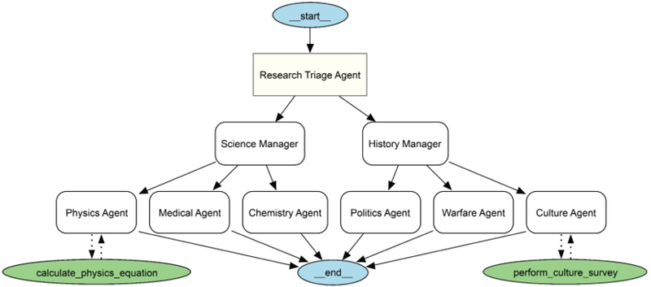
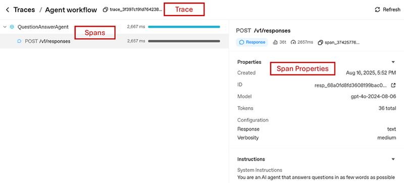
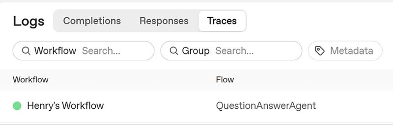
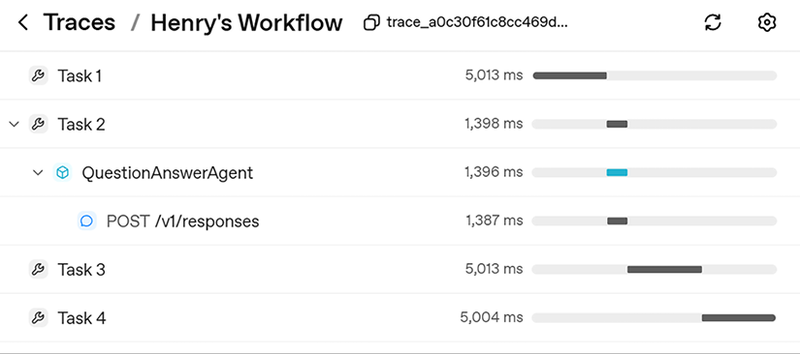
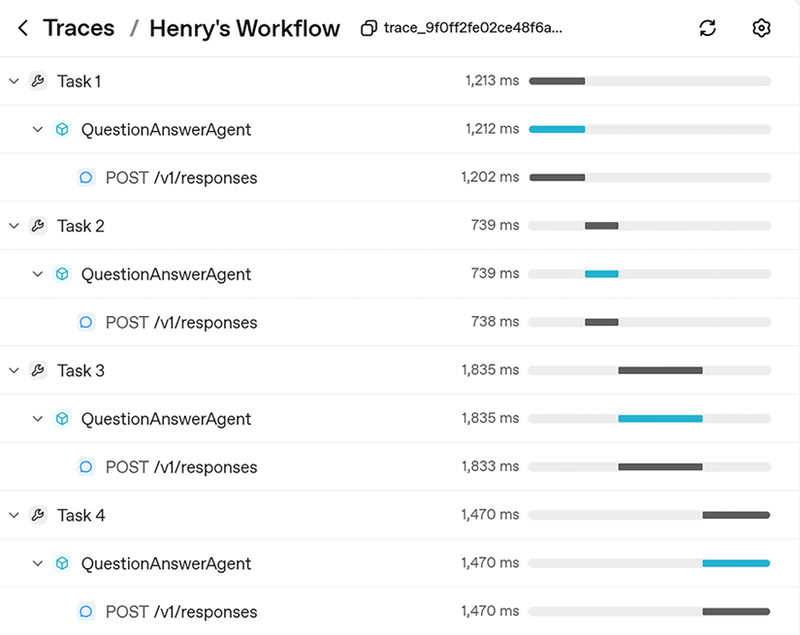
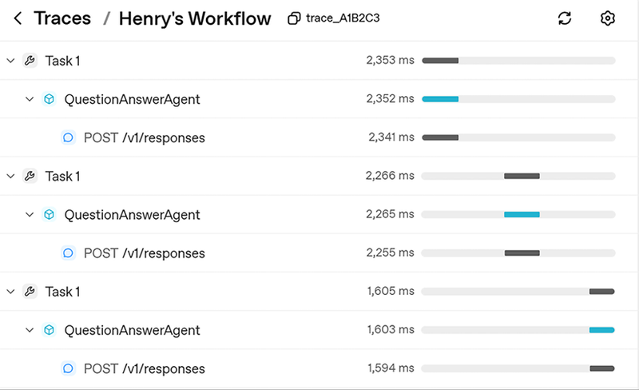
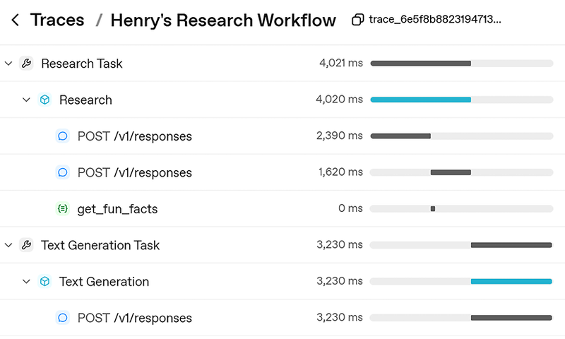
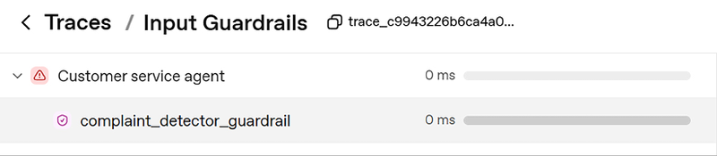

# 模块八：Agent 系统管理

> 对应 PDF 第 168-194 页（Chapter 8: Agent System Management）

---

## 概念讲解

### 1. 为什么需要系统管理

当你的 Agent 系统从"一个 Agent + 一个工具"变成"多个 Agent + 多个工具 + Handoff + Guardrails"的组合体时，你会发现一个问题：**你已经看不清楚整个系统到底在干什么了**。

Agent 系统管理就是为了解决这个问题。OpenAI Agents SDK 在这一层提供了四大能力：

| 能力 | 解决什么问题 |
|------|-------------|
| **Agent Visualization** | 系统太复杂看不清 → 画一张图 |
| **Guardrails** | 输入/输出不安全 → 拦截验证 |
| **Logging / Tracing / Observability** | 系统跑起来黑箱 → 全链路追踪 |
| **Agent Testing** | Agent 行为不确定 → 系统化测试 |

> **一句话记住**：建 Agent 是第一步，让 Agent 可控、可观测、可测试才是生产级的要求。

---

### 2. Agent 可视化（Visualization）

**定义**：用 `draw_graph()` 函数自动生成多 Agent 系统的架构图，把 Agent、Tool、Handoff 的关系一目了然地画出来。

**安装依赖**：

```bash
pip install "openai-agents[viz]"
```

**使用方式**：

```python
from agents.extensions.visualization import draw_graph

# 把顶层 agent 传入，自动递归画出整个系统
draw_graph(triage_agent, filename="graph_visualization")
```

**图中的元素**：

| 元素 | 图形 | 含义 |
|------|------|------|
| Agent | 方框（box） | 一个 Agent 节点 |
| Tool | 椭圆（ellipse） | 一个工具节点 |
| 实线箭头 | → | Agent 到 Agent 的 Handoff |
| 虚线箭头 | ⇢ | Agent 到 Tool 的调用 |
| Start 节点 | | Agent 流程入口 |
| End 节点 | | Agent 流程可能的出口 |


> 图：一个层级化多 Agent 系统的可视化示例。Research Triage Agent 在顶部，下面分 Science Manager 和 History Manager，再分到具体的专业 Agent。

**为什么有用**：
- **调试**：如果发现某个 Tool 没连上，或者某个 Handoff 缺失，图上一看就知道
- **沟通**：给团队成员、产品经理展示系统架构，比看代码直观得多
- **文档**：自动生成的图可以直接当架构文档用

---

### 3. Guardrails 深度讲解

**定义**：Guardrails 是 OpenAI Agents SDK 的一个核心原语，用来对 Agent 系统的**输入和输出做验证检查**。简单说就是在 Agent 处理请求之前（Input Guardrail）和返回结果之后（Output Guardrail）各加一道关卡。

**核心思想**：Agent 的能力越强，"自由度"越大，也就越需要约束。Guardrails 就是那个约束机制——让 Agent 既能发挥，又不会乱来。

**共同模式**（Input 和 Output Guardrails 都遵循这个流程）：

1. **定义 Guardrail 函数**：返回一个 `GuardrailFunctionOutput` 对象
2. **在函数内写检测逻辑**：决定是否触发 tripwire（拉闸）
3. **优雅处理异常**：捕获对应的 `TripwireTriggered` 异常，给用户一个友好提示

---

#### 3.1 Input Guardrails（输入守卫）

**定义**：在用户输入进入 Agent 系统之前进行拦截检查。就像机场安检——只有合格的"乘客"才能登机。

**核心组件**：

| 组件 | 作用 |
|------|------|
| `@input_guardrail` 装饰器 | 标记一个函数为输入守卫 |
| `GuardrailFunctionOutput` | 守卫函数必须返回的对象 |
| `tripwire_triggered` | 布尔值，`True` = 拉闸拦截 |
| `InputGuardrailTripwireTriggered` | 拉闸时抛出的异常 |

**最简实现——关键词匹配**：

```python
from agents import (
    GuardrailFunctionOutput, InputGuardrailTripwireTriggered,
    input_guardrail, RunContextWrapper, TResponseInputItem
)

@input_guardrail
def complaint_detector_guardrail(
    ctx: RunContextWrapper[None],
    agent: Agent,
    prompt: str | list[TResponseInputItem]
) -> GuardrailFunctionOutput:
    tripwire_triggered = False
    if "complaint" in prompt:
        tripwire_triggered = True
    return GuardrailFunctionOutput(
        output_info="The word Complaint has been detected",
        tripwire_triggered=tripwire_triggered,
    )
```

**挂载到 Agent**：

```python
agent = Agent(
    name="Customer service agent",
    instructions="You are an AI Agent...",
    tools=[get_order_status],
    input_guardrails=[complaint_detector_guardrail]
)
```

**优雅处理异常**：

```python
with trace("Input Guardrails"):
    while True:
        try:
            question = input("You: ")
            result = Runner.run_sync(agent, question)
            print("Agent: ", result.final_output)
        except InputGuardrailTripwireTriggered:
            print("The tripwire has been triggered. Please call us instead.")
```


> 图：Input Guardrail 在 Traces 模块中的可视化。可以清楚看到 guardrail 检查发生在 agent 运行之前。

> **重要细节**：Input Guardrails 只在多 Agent 系统的**第一个 Agent** 上执行。它是整个系统的"入口安检"，不会在每次 Handoff 后重复检查。

---

#### 3.2 Output Guardrails（输出守卫）

**定义**：在 Agent 生成结果之后、返回给用户之前进行拦截检查。就像飞机落地后的出关检查——确保"出去的东西"符合标准。

**核心组件**：

| 组件 | 作用 |
|------|------|
| `@output_guardrail` 装饰器 | 标记一个函数为输出守卫 |
| `GuardrailFunctionOutput` | 守卫函数必须返回的对象 |
| `OutputGuardrailTripwireTriggered` | 拉闸时抛出的异常 |

**关键区别**：Output Guardrail 的函数签名中，第三个参数不是 `prompt`，而是 `output`（Agent 的输出对象）。如果 Agent 有 `output_type`，这里拿到的就是对应的结构化对象。

**实现示例**：

```python
from agents import (
    GuardrailFunctionOutput, OutputGuardrailTripwireTriggered,
    output_guardrail, RunContextWrapper
)
from pydantic import BaseModel

class MessageOutput(BaseModel):
    response: str

class GuardrailTrueFalse(BaseModel):
    is_relevant_to_customer_service: bool

# 用另一个 Agent 来判断输出是否合规
guardrail_agent = Agent(
    name="Guardrail check",
    instructions="Check if the agent response is relevant to customer service and not hallucinating",
    output_type=GuardrailTrueFalse
)

@output_guardrail
async def relevant_detector_guardrail(
    ctx: RunContextWrapper[None],
    agent: Agent,
    output: MessageOutput
) -> GuardrailFunctionOutput:
    result = await Runner.run(guardrail_agent, input=output)
    tripwire_triggered = False
    if result.final_output.is_relevant_to_customer_service == False:
        tripwire_triggered = True
    return GuardrailFunctionOutput(
        output_info="",
        tripwire_triggered=tripwire_triggered
    )

# 挂载到 Agent
agent = Agent(
    name="Customer service agent",
    instructions="...",
    output_guardrails=[relevant_detector_guardrail]
)
```


> 图：Output Guardrail 的 Trace 可视化。

**使用场景**：
- 确保每次输出都包含合规的订单状态信息
- 验证输出是否符合预期 schema
- 自动过滤敏感信息（PII）
- 防止幻觉内容到达用户

> **设计哲学**：Output Guardrail 是"最后一道安全网"。即使前面的组件出了问题，这里也能兜底，确保用户看到的内容是安全的、合规的、对齐业务需求的。


> 图：Guardrail 在 Traces 模块中的完整流程视图。

---

#### 3.3 Agent as Guardrail（用 Agent 当守卫）

**定义**：不用硬编码的关键词匹配，而是用**另一个 Agent**（通常是更便宜的模型）来判断输入/输出是否合规。这是 Guardrail 最强大也最灵活的实现方式。

**为什么需要它**：关键词匹配太脆弱了。用户说"complaint"你能拦住，说"I'm unhappy with your service"你就拦不住了。让另一个 Agent 来判断，它能理解语义，覆盖面大得多。

**实现模式**：

```python
from pydantic import BaseModel

class GuardrailTrueFalse(BaseModel):
    is_relevant_to_customer_service_orders: bool

# 专门用于判断的轻量级 Agent
guardrail_agent = Agent(
    name="Guardrail check",
    instructions="You are an AI agent that checks if the user's prompt is relevant to answering customer service and order related questions",
    output_type=GuardrailTrueFalse,
)

@input_guardrail
async def relevant_detector_guardrail(
    ctx: RunContextWrapper[None],
    agent: Agent,
    prompt: str | list[TResponseInputItem]
) -> GuardrailFunctionOutput:
    result = await Runner.run(guardrail_agent, input=prompt)
    tripwire_triggered = False
    if result.final_output.is_relevant_to_customer_service_orders == False:
        tripwire_triggered = True
    return GuardrailFunctionOutput(
        output_info="The prompt is not relevant",
        tripwire_triggered=tripwire_triggered
    )
```


> 图：Agent 作为 Guardrail 时的 Trace 视图。可以看到 guardrail agent 的调用出现在主 agent 之前。


> 图：Guardrail Trace 详情 1。


> 图：Guardrail Trace 详情 2。

**实际效果**：

```
You: What's the meaning of life?
This comment is irrelevant to customer service
```

无论用户怎么变换措辞，只要语义上不属于客服范畴，guardrail agent 都能识别并拦截。

> **重要细节**：当 guardrail 函数内部要调用另一个 Agent 时，必须声明为 `async` 函数，因为 `Runner.run()` 是异步的。

---

#### 3.4 Guardrail 策略对比

| 策略 | 优点 | 缺点 | 适用场景 |
|------|------|------|---------|
| **关键词匹配** | 快、便宜、零延迟 | 太脆弱，容易绕过 | 简单过滤（脏话、敏感词） |
| **LLM-based 分类** | 语义理解强，覆盖面广 | 有额外 Token 成本和延迟 | 意图分类、合规检查 |
| **Agent as Guardrail** | 最灵活，可配合工具 | 成本最高 | 复杂场景、需要推理判断 |

> **实践建议**：在生产系统中，通常会组合使用多种策略。先用关键词做第一层快速过滤，再用轻量 Agent 做语义判断。这样既控制成本，又保证覆盖面。

---

### 4. Logging、Tracing 与 Observability

**核心思想**：Agent 系统的一大挑战是"黑箱"——你不知道它内部做了什么决定、调了哪些工具、花了多长时间。Tracing 模块就是打开这个黑箱的工具。

**好消息**：OpenAI Agents SDK 默认**自动启用** Tracing，不需要写任何额外代码。所有 Agent 运行都会记录到 OpenAI Dashboard 的 Traces 模块。

#### 4.1 Trace 与 Span 的区别

这两个概念是 Tracing 的基石，必须搞清楚：

| 概念 | 类比 | 说明 |
|------|------|------|
| **Trace** | 一场完整的比赛 | 代表一次完整的 Agent 执行流程，从用户提问到最终返回 |
| **Span** | 比赛中的一个回合 | Trace 内的一个具体操作步骤（有开始时间和结束时间） |

**Trace 和 Span 的关系**：一个 Trace 包含多个 Span，Span 之间可以嵌套。

**自动记录的 Span 类型**：
- Model calls（LLM 调用）
- Tool calls（工具调用）
- Handoffs（Agent 移交）
- Guardrail triggers（守卫触发）

**举例**：你可以在 Traces Dashboard 看到这样的信息——整个 Trace 花了 3.2 秒，其中 LLM 推理 1.5 秒，数据库工具调用 0.5 秒，guardrail 检查 0.3 秒，其余是网络开销。

#### 4.2 Custom Trace（自定义 Trace）

**使用场景**：给 Trace 一个自定义名称，方便在 Dashboard 中搜索和识别。

```python
from agents import Agent, Runner, trace

agent = Agent(
    name="QuestionAnswerAgent",
    instructions="You are an AI agent that answers questions in as few words as possible"
)

with trace("Henry's Workflow"):
    result = Runner.run_sync(agent, "Where is the Eiffel Tower?")
    print(result.final_output)
```


> 图：自定义 Trace 名称在 Dashboard 中的显示效果。

#### 4.3 Custom Span（自定义 Span）

**使用场景**：把复杂工作流拆分成可观测的小段，精确定位瓶颈。

```python
from agents import Agent, Runner, trace, custom_span
import time

agent = Agent(
    name="QuestionAnswerAgent",
    instructions="..."
)

with trace("Henry's Workflow"):
    with custom_span("Task 1"):
        time.sleep(5)
    with custom_span("Task 2"):
        result = Runner.run_sync(agent, "Where is the Eiffel Tower?")
    with custom_span("Task 3"):
        time.sleep(5)
    with custom_span("Task 4"):
        time.sleep(5)
```

在 Dashboard 中可以分别看到每个 Span 的耗时，一目了然哪个步骤是瓶颈。

#### 4.4 Grouping——把多次运行合并到一个 Trace

**场景一**：同一段代码里多次 `Runner.run_sync()`，想合并为一个 Trace：

```python
with trace("Henry's Workflow"):
    with custom_span("Task 1"):
        result = Runner.run_sync(agent, "Where is the Statue of Liberty?")
    with custom_span("Task 2"):
        result = Runner.run_sync(agent, "Where is the Eiffel Tower?")
    with custom_span("Task 3"):
        result = Runner.run_sync(agent, "Where is the Notre Dame?")
```

**场景二**：跨进程甚至跨机器的运行也能合并——通过 `trace_id` 参数：

```python
with trace("Henry's Workflow", trace_id="A1B2C3"):
    with custom_span("Task 1"):
        result = Runner.run_sync(agent, "Where is the Statue of Liberty?")
```

同一个 `trace_id` 的所有运行，无论何时何地执行，都会合并在 Dashboard 同一个 Trace 下。这对**分布式系统**和**长时间运行的工作流**非常有价值。

#### 4.5 Nested Spans（嵌套 Span）

Span 可以嵌套，用来表示"大任务 → 子任务"的层级关系：

```python
with trace("Henry's Research Workflow"):
    with custom_span("Research Task"):
        result = Runner.run_sync(research_agent, "The Eiffel Tower")
    with custom_span("Text Generation Task"):
        result = Runner.run_sync(text_generation_agent, result.final_output)
```

在 Dashboard 中，Research Task 和 Text Generation Task 会分别显示，各自包含内部的 model calls 和 tool calls。

#### 4.6 禁用 Tracing

有些场景（合规要求、敏感数据）需要关闭 Tracing：

```python
import os
os.environ["OPENAI_AGENTS_DISABLE_TRACING"] = "1"
```

---

### 5. Agent 测试

**核心挑战**：Agent 是 **non-deterministic（非确定性的）**——同样的输入可能产生不同的输出。这让传统的"断言输出等于期望值"的测试方式失效了。

OpenAI Agents SDK 提供两种测试思路：

#### 5.1 End-to-End Testing（端到端测试）

**思路**：定义输入和期望输出，让另一个 Agent（或 LLM）来判断实际输出是否"符合期望"。

**实现步骤**：

1. 定义测试场景（Scenario）：

```python
from pydantic import BaseModel

class Scenario(BaseModel):
    scenario: str
    input: str
    expected_output: str

list_of_scenarios = [
    Scenario(
        scenario="Delivered example",
        input="Hi there, could you check my customer order? It's 101",
        expected_output="The order is delivered"
    ),
    Scenario(
        scenario="Delayed",
        input="My order ID is two hundred, why has my package not been delivered yet?",
        expected_output="The order is delayed"
    ),
    Scenario(
        scenario="Order does not exist",
        input="What's the status of my Order? Its number is 400",
        expected_output="No status or order can be found"
    )
]
```

2. 创建测试 Agent：

```python
class OutputTrueFalse(BaseModel):
    test_succeeded: bool

testing_agent = Agent(
    name="Testing agent",
    instructions="You are an AI Agent that tests expected outputs from desired outputs of an agentic AI system",
    output_type=OutputTrueFalse
)
```

3. 运行测试：

```python
for scenario in list_of_scenarios:
    print(f"Running scenario {scenario.scenario}")
    result = Runner.run_sync(
        testing_agent,
        f"Input: {scenario.input} ||| Expected Output: {scenario.expected_output}"
    )
    print(result.final_output)
```

**输出**：

```
Running scenario Delivered example
test_succeeded=True
---
Running scenario Delayed
test_succeeded=True
---
Running scenario Order does not exist
test_succeeded=True
```

> **核心洞察**：用 Agent 测 Agent——既然输出是非确定性的，那就用另一个 LLM 来做语义级别的"模糊匹配"，而不是严格的字符串比较。

#### 5.2 Unit Testing（单元测试）

**思路**：不检查最终输出，而是检查 Agent 的**中间行为**——它调了哪些工具？做了哪些 Handoff？触发了哪些 Guardrail？

**关键工具**：`result.new_items` 属性 + `ToolCallItem` 类型检查。

```python
from agents import ToolCallItem

result = Runner.run_sync(agent, "Please provide me the status of order 101")

# 检查 Agent 调用了哪些工具
items = result.new_items
print("Tool calls made during this run:")
for item in items:
    if isinstance(item, ToolCallItem):
        print(f"- {item.raw_item.name} was called")

# 断言特定工具被调用
if any(
    item.raw_item.name == "get_order_status"
    for item in items if isinstance(item, ToolCallItem)
):
    print("get_order_status was called as expected")
else:
    print("get_order_status was not called")
```

**可以测试的中间行为**：

| 测试目标 | 怎么检查 |
|---------|---------|
| 某个 Tool 是否被调用 | 遍历 `result.new_items` 找 `ToolCallItem` |
| Handoff 是否发生 | 检查 `result.last_agent` 是否是预期的 Agent |
| Guardrail 是否触发 | 检查是否抛出 `TripwireTriggered` 异常 |

> **实践建议**：Unit Test 比 End-to-End Test 更有针对性，能精确定位问题。两者配合使用效果最佳。

---

### 6. 生产级最佳实践总结

| 方面 | 建议 |
|------|------|
| **错误处理** | 所有 Guardrail 异常都要 `try-except` 优雅处理，给用户友好提示 |
| **日志记录** | 利用 custom trace 和 custom span 对关键步骤打标 |
| **性能监控** | 通过 Span 的耗时定位瓶颈 |
| **成本控制** | Guardrail Agent 用便宜模型，主 Agent 用强模型 |
| **安全性** | Input Guardrail 做入口安检，Output Guardrail 做出口检查 |
| **可测试性** | 端到端测试 + 单元测试结合，覆盖行为和结果 |
| **合规要求** | 必要时用 `OPENAI_AGENTS_DISABLE_TRACING` 禁用日志 |
| **分布式追踪** | 用 `trace_id` 将跨服务、跨时间的运行关联起来 |

---

## 问答记录

**Q1：Input Guardrail 和 Output Guardrail 能同时用吗？**

可以。它们是独立的机制。Input Guardrail 挂在 `input_guardrails` 参数上，Output Guardrail 挂在 `output_guardrails` 参数上。一个 Agent 可以同时配置两种。推荐在生产系统中两端都加。

**Q2：Guardrail Agent 和主 Agent 用同一个模型吗？**

不建议。Guardrail Agent 的任务很简单（判断一个布尔值），用便宜模型就够了。主 Agent 才需要强模型。这是成本优化的核心策略。

**Q3：trace_id 是自动生成的还是手动指定的？**

默认自动生成。但你可以通过 `trace("name", trace_id="your_id")` 手动指定。手动指定的好处是可以跨进程、跨机器合并 Trace，对分布式系统很有价值。

**Q4：如果 Guardrail 本身出错了（比如 guardrail agent 调用失败），会怎样？**

需要做好异常处理。Guardrail 函数内部的错误如果没有被捕获，会直接中断 Agent 的执行。建议在 guardrail 函数内部也加 try-except。

**Q5：end-to-end 测试用 Agent 来判断对不对，那 Agent 判断错了怎么办？**

这确实是一个限制。可以通过以下方式缓解：(1) 用更强的模型做测试 Agent；(2) 多跑几次取多数票；(3) 对关键场景仍然做人工审核。自动化测试是减少人工工作量，不是完全替代人工。

---

## 重点标记

1. **Guardrails 的三步模式**：定义函数 → 写检测逻辑 → 处理异常。Input 和 Output 都遵循这个模式
2. **Input Guardrail 只在第一个 Agent 执行**——它是整个多 Agent 系统的入口安检
3. **Agent as Guardrail 是最灵活的方案**：用轻量 Agent 做语义级判断，比关键词匹配覆盖面大得多
4. **Trace = 完整流程，Span = 单个步骤**：这是可观测性的核心概念
5. **trace_id 可跨进程合并 Trace**：分布式系统中非常有用
6. **custom_span 用来定位瓶颈**：把工作流拆成可度量的步骤
7. **非确定性系统的测试策略**：用另一个 Agent 做语义级比较（端到端），用 `result.new_items` 检查中间行为（单元测试）
8. **成本优化核心思路**：Guardrail Agent 用便宜模型拦截无效请求，主 Agent 用强模型处理有效请求
