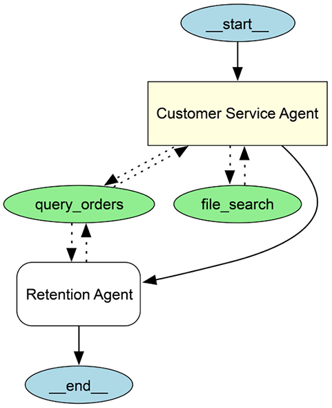
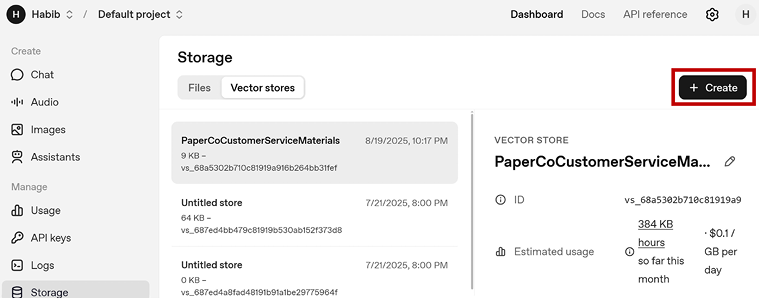
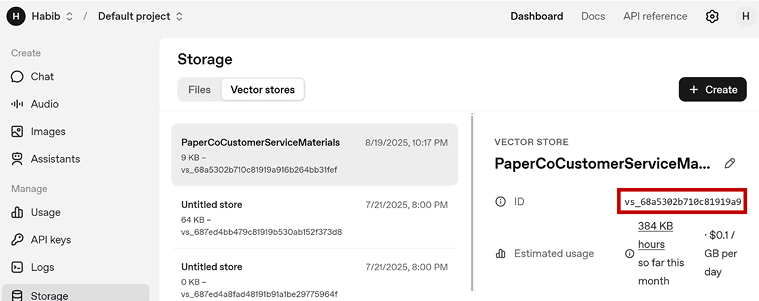
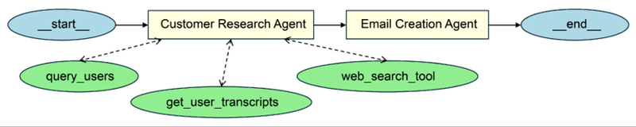
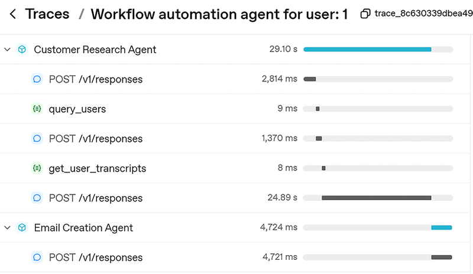

# 模块九：端到端 Agent 系统构建

> 对应 PDF 第 195-220 页（Chapter 9: Building AI Agents and Agentic Systems）

---

## 概念讲解

### 1. 本章定位：从零件到成品

前面八章你学了 Agent 的所有"零件"——Agent、Tool、Memory、Session、Handoff、Model Settings、Context、Guardrails、Tracing。这一章的任务是**把所有零件组装成一个完整的产品**。

书中给了两个端到端项目：

| 项目 | 类型 | 核心特点 |
|------|------|---------|
| **Project 1: Customer Service Agent** | 交互式 chatbot | 数据库工具 + 知识库搜索 + Input Guardrail + Handoff |
| **Project 2: Multi-Agent Pipeline** | 自动化工作流 | 两个 Agent 串联、研究 → 生成、结构化输出 |

> **设计方法论**：不要一步到位。先写最简单的 Agent → 加工具 → 加记忆 → 加 Guardrails → 拆分为多 Agent。每一步都验证再往下走。

---

### 2. Project 1：PaperCo 客服 Agent（完整实战）

#### 2.1 系统架构

这是一个虚构公司 PaperCo（纸制品供应商）的 AI 客服系统。用户通过 chatbot 提问，系统自动处理各种客服场景。


> 图：PaperCo 客服 Agent 的系统架构。主 Agent 连接数据库工具、知识库搜索工具，配有 Input Guardrail，并可以 Handoff 到 Retention Agent。

**五大组件**：

| 组件 | 功能 | SDK 原语 |
|------|------|---------|
| **Order Database + Query Tool** | 查订单状态，需要 authorization_key | `@function_tool` |
| **Knowledge Base Search** | 查公司政策/FAQ，向量检索 | `FileSearchTool` |
| **Input Guardrail** | 过滤无关问题 | `@input_guardrail` + Guardrail Agent |
| **Retention Agent** | 处理取消服务的客户 | `Agent` + `handoffs` |
| **Main Customer Service Agent** | 入口，整合所有组件 | `Agent` |

---

#### 2.2 数据库搭建

第一步：创建 SQLite 数据库存储订单数据。

```python
import sqlite3

conn = sqlite3.connect("paper_data.db")
cursor = conn.cursor()

cursor.execute("DROP TABLE IF EXISTS orders")
cursor.execute("""
    CREATE TABLE IF NOT EXISTS orders (
        order_id INTEGER PRIMARY KEY,
        authorization_key TEXT,
        order_status TEXT
    )
""")

orders_data = [
    (1001, "154857", "shipped"),
    (1002, "154857", "processing"),
    (1003, "958542", "delivered"),
    (1004, "445720", "cancelled"),
]

cursor.executemany(
    "INSERT OR IGNORE INTO orders (order_id, authorization_key, order_status) VALUES (?, ?, ?)",
    orders_data
)
conn.commit()
conn.close()
```

---

#### 2.3 Function Tool：查询订单

这个工具的亮点在于**安全设计**——它不是直接执行用户的 SQL，而是在查询中自动注入 authorization_key 过滤条件。

```python
@function_tool
def query_orders(sql_query: str, authorization_key: str):
    """
    Executes the given SQL query on the orders table and returns the result.
    You must provide the authorization_key.
    Table: orders
        order_id INTEGER PRIMARY KEY,
        authorization_key TEXT,
        order_status TEXT
    Only rows matching the provided authorization_key will be accessible.
    """
    db_path = "paper_data.db"
    try:
        conn = sqlite3.connect(db_path)
        cursor = conn.cursor()
        # 关键：把 orders 表替换为带 authorization_key 过滤的子查询
        sub_query = f"(SELECT * FROM orders where authorization_key = {authorization_key}) a"
        filtered_query = sql_query.replace("orders", sub_query)
        cursor.execute(filtered_query)
        result = cursor.fetchall()
        conn.close()
        return result
    except Exception as e:
        return f"Error querying orders.db: {e}"
```

**原理**：假设 Agent 生成了 `SELECT * FROM orders WHERE order_id = 1003`，这个函数会把它变成 `SELECT * FROM (SELECT * FROM orders WHERE authorization_key = 958542) a WHERE order_id = 1003`。只有 authorization_key 匹配的数据才能被访问。

> **生产注意**：这个示例中直接拼接 SQL 存在注入风险。真正的生产系统应该用参数化查询、OAuth、RBAC 等更安全的方式。


> 图：Agent 执行时的 Trace 视图，可以看到 Tool 调用的详细信息。

---

#### 2.4 向量知识库搜索（FileSearchTool）

除了查订单，客户还会问"你们退货政策是什么？""批量折扣怎么算？"这类 FAQ 问题。这些答案存在一份客服政策文档里，通过 OpenAI 的向量存储和 `FileSearchTool` 来检索。

**设置步骤**：
1. 在 OpenAI Platform → Dashboard → Storage → Vector stores 创建向量存储
2. 上传客服材料文档（如 PaperCoCustomerServiceMaterials.docx）
3. 获取 vector store ID

**代码**：

```python
from agents import FileSearchTool

file_search_tool = FileSearchTool(
    vector_store_ids=['<your_vector_store_id>']
)
```

就这么简单。Agent 在需要回答通用客服问题时，会自动调用这个工具进行向量搜索。


> 图：向量搜索在 Agent Trace 中的呈现。

---

#### 2.5 Input Guardrail：拦截无关问题

使用 Agent as Guardrail 模式，创建一个轻量 Agent 判断用户问题是否与客服相关：

```python
from pydantic import BaseModel

class GuardrailTrueFalse(BaseModel):
    is_relevant_to_customer_service: bool

guardrail_agent = Agent(
    name="Guardrail check",
    instructions="You are an AI agent that checks if the user's prompt is relevant to answering customer service and order related questions",
    output_type=GuardrailTrueFalse,
)

@input_guardrail
async def relevant_detector_guardrail(
    ctx: RunContextWrapper[None],
    agent: Agent,
    prompt: str | list[TResponseInputItem]
) -> GuardrailFunctionOutput:
    result = await Runner.run(guardrail_agent, input=prompt)
    tripwire_triggered = False
    if result.final_output.is_relevant_to_customer_service == False:
        tripwire_triggered = True
    return GuardrailFunctionOutput(
        output_info="",
        tripwire_triggered=tripwire_triggered
    )
```

---

#### 2.6 Retention Agent：留存专家

当客户说"我要取消服务"时，主 Agent 不处理，而是 Handoff 给专门的 Retention Agent。这个 Agent 被设计为有同理心的、会主动提供留存激励（最高 $100 信用）的角色。

```python
retention_agent = Agent(
    name="Retention Agent",
    instructions=(
        "You are a retention agent. Your goal is to encourage the customer not to cancel their service, "
        "understand their pain points, and empathize with their situation. If the customer insists on cancelling, "
        "you may offer up to $100 credit on their account as a retention incentive."
    ),
    tools=[query_orders],
)
```

---

#### 2.7 组装：主客服 Agent

把所有零件组装到一个 Agent 上：

```python
customer_service_agent = Agent(
    name="Customer Service Agent",
    instructions=(
        "Introduce yourself as the complaints agent."
        "Handle any customer complaints with empathy and clear next steps."
        "Use the file_search_tool to get general answers to questions"
        "For specific order related queries, you the query_orders function_tool"
        "To use the query_order tool, you will need the user's authorization key"
    ),
    tools=[query_orders, file_search_tool],
    input_guardrails=[relevant_detector_guardrail],
    handoffs=[retention_agent]
)
```

**参数解读**：

| 参数 | 值 | 作用 |
|------|---|------|
| `tools` | `[query_orders, file_search_tool]` | 两个工具：查订单 + 查知识库 |
| `input_guardrails` | `[relevant_detector_guardrail]` | 入口安检，过滤无关问题 |
| `handoffs` | `[retention_agent]` | 遇到取消请求时移交给留存专家 |

---

#### 2.8 Runner：对话循环

用 `SQLiteSession` 维护多轮对话状态，用 `last_agent` 追踪当前活跃的 Agent（因为 Handoff 后活跃 Agent 会变）：

```python
session = SQLiteSession("session")
last_agent = customer_service_agent

with trace("Customer service agent"):
    while True:
        try:
            question = input("You: ")
            result = Runner.run_sync(last_agent, question, session=session)
            print("Agent: ", result.final_output)
            last_agent = result.last_agent  # 关键：Handoff 后更新活跃 Agent
        except InputGuardrailTripwireTriggered:
            print("This comment is irrelevant to customer service.")
```

> **关键细节**：`result.last_agent` 会返回最终处理请求的 Agent。如果发生了 Handoff，这里就不再是 `customer_service_agent`，而是 `retention_agent`。下一轮对话就会直接发给 Retention Agent，保持上下文连贯。

---

#### 2.9 测试验证

四个测试场景，覆盖了系统的全部能力：

**场景一：Guardrail 拦截**
```
You: What's 5 + 15?
This comment is irrelevant to customer service.
```

**场景二：订单查询（需要 authorization_key）**
```
You: What's the status of my order? It's 1002
Agent: To check the status of your order, I'll need your authorization key. Could you please provide that?
You: Sure, it's 154857
Agent: Your order with ID 1002 is currently in the "processing" status.
```

**场景三：知识库搜索**
```
You: How much do I need to order to qualify for the bulk discount?
Agent: To qualify for a bulk discount, you need to place an order over $500. This qualifies for a 5% discount which is applied automatically.
```

**场景四：Handoff 到 Retention Agent**
```
You: I want to cancel my account
Agent: I'm sorry to hear you're considering canceling your account. Could you let me know what's prompting this decision?
You: It's just too expensive
Agent: I understand how important it is to manage expenses. To help with that, I can offer you a $100 credit on your account.
```

> 四个场景完美展示了 Agent 系统的完整能力：Guardrail 过滤、工具调用（带安全控制）、知识库检索、多 Agent Handoff。

---

### 3. Project 2：多 Agent 自动化工作流（Pipeline）

#### 3.1 业务场景

PaperCo 想给每个客户发一封**个性化的营销邮件**。人工做的话要：查客户信息 → 读历史聊天记录 → 搜索客户兴趣相关的新闻 → 写邮件。这个流程完全可以用两个 Agent 串联来自动化。


> 图：工作流自动化的架构。Customer Research Agent 收集信息，传递给 Email Creation Agent 生成邮件。

#### 3.2 两个 Agent 的分工

| Agent | 角色 | 输入 | 输出 | 工具 |
|-------|------|------|------|------|
| **Customer Research Agent** | 研究员 | user_id | 客户档案报告（文本） | query_users, get_user_transcripts, WebSearchTool |
| **Email Creation Agent** | 写手 | 客户档案报告 | 结构化邮件（EmailOutput） | 无（纯生成） |

---

#### 3.3 数据准备

**客户数据库**：

```python
import sqlite3

conn = sqlite3.connect("customer_details.db")
cursor = conn.cursor()

cursor.execute("""
    CREATE TABLE IF NOT EXISTS users (
        user_id INTEGER PRIMARY KEY,
        first_name TEXT,
        last_name TEXT,
        email TEXT,
        location TEXT,
        business_type TEXT,
        phone_number TEXT
    )
""")

users_data = [
    (1, "Emily", "Clark", "emily.clark@example.com", "New York", "Retail", "555-1234"),
    (2, "Michael", "Nguyen", "michael.nguyen@example.com", "San Francisco", "E-commerce", "555-5678"),
    (3, "Sophia", "Patel", "sophia.patel@example.com", "Chicago", "Wholesale", "555-8765"),
    (4, "David", "Martinez", "david.martinez@example.com", "Houston", "Manufacturing", "555-4321"),
]

cursor.executemany(
    "INSERT OR IGNORE INTO users (user_id, first_name, last_name, email, location, business_type, phone_number) VALUES (?, ?, ?, ?, ?, ?, ?)",
    users_data
)
conn.commit()
conn.close()
```

**客户聊天记录**（JSON 文件）：

```json
{
  "conversations": [
    {
      "user_id": 1,
      "date": "2024-06-01",
      "transcripts": "Hi, I have a question about my order... I'm a big fan of the New York Knicks..."
    },
    {
      "user_id": 2,
      "date": "2024-06-02",
      "transcripts": "Can I change my delivery address?... I'm a sushi fan... also I love the San Francisco Giants..."
    }
  ]
}
```

> **设计巧思**：聊天记录里客户提到了自己的兴趣爱好（球队、食物等），Agent 会利用这些信息做个性化。

---

#### 3.4 工具创建

**查询客户信息**：

```python
@function_tool
def query_users(sql_query: str):
    """
    Executes the given SQL query on the users table and returns the result.
    Table: users
        user_id, first_name, last_name, email, location, business_type, phone_number
    """
    db_path = "customer_details.db"
    try:
        conn = sqlite3.connect(db_path)
        cursor = conn.cursor()
        cursor.execute(sql_query)
        result = cursor.fetchall()
        conn.close()
        return result
    except Exception as e:
        return f"Error querying users: {e}"
```

**提取客户聊天记录**：

```python
@function_tool
def get_user_transcripts(user_id: int) -> str:
    """
    Extracts and returns all transcripts for the given user_id
    from customer_transcripts.json as one long string.
    """
    json_path = "customer_transcripts.json"
    try:
        with open(json_path, "r", encoding="utf-8") as f:
            data = json.load(f)
        transcripts = [
            conv["transcripts"]
            for conv in data.get("conversations", [])
            if conv.get("user_id") == user_id
        ]
        return "\n\n".join(transcripts) if transcripts else ""
    except Exception as e:
        return f"Error reading transcripts: {e}"
```

**网页搜索**：

```python
from agents import WebSearchTool

web_search_tool = WebSearchTool()
```

---

#### 3.5 Customer Research Agent

这个 Agent 的任务是把散落在各处的客户信息汇总成一份报告：

```python
customer_research_agent = Agent(
    name="Customer Research Agent",
    instructions=(
        "You are an AI agent that performs research on customers to create a customer profile."
        "Given a customer ID, you should create a customer report that:"
        "- retrieves customer details"
        "- reads previous customer transcripts on the customer interests, to be used to personalize emails"
        "- summarized latest news (search the web) on things related to their interests they've noted in the transcript"
    ),
    tools=[web_search_tool, query_users, get_user_transcripts]
)
```

**Agent 的工作流**（自主决定）：
1. 用 `query_users` 查客户基本信息
2. 用 `get_user_transcripts` 读历史聊天，提取兴趣爱好
3. 用 `web_search_tool` 搜索与兴趣相关的最新新闻
4. 汇总成一份报告

---

#### 3.6 Email Creation Agent

这个 Agent 拿到研究报告后，生成一封结构化的个性化邮件：

```python
from pydantic import BaseModel

class EmailOutput(BaseModel):
    to_email: str
    from_email: str
    subject: str
    html_email: str

email_creation_agent = Agent(
    name="Email Creation Agent",
    instructions=(
        "You are an AI agent that generates emails to keep in touch with customers of PaperCo."
        "Your goal is to create an email given the information provided from another agent."
        "Use the information in a subtle way, like sharing a news story related to their interests."
        "The goal is to be personable and let them know about our newest offer on Paper Products."
        "The newest offer includes a premium subscription plan where all their orders are 10 percent off."
        "The email should be very concise, just a few sentences, and to the point."
    ),
    output_type=EmailOutput,
    model="gpt-4.1-2025-04-14"
)
```

**几个设计决策**：

| 决策 | 原因 |
|------|------|
| 使用 `output_type=EmailOutput` | 确保输出是结构化的 JSON，可直接用于发邮件 |
| 使用 `model="gpt-4.1-2025-04-14"` | 写邮件需要更强的写作能力，用更高端模型 |
| Instructions 很详细 | 明确告知语气（personable）、内容（新闻 + 产品推广）、长度（简短） |

---

#### 3.7 工作流编排

把两个 Agent 串联起来，遍历所有客户：

```python
import json

for user_id in ["1", "2", "3", "4"]:
    with trace(f"Workflow automation agent for user: {user_id}"):
        # Step 1: 研究 Agent 收集客户信息
        result = Runner.run_sync(customer_research_agent, input=user_id)
        print(result.final_output)

        # Step 2: 邮件 Agent 生成个性化邮件
        email = Runner.run_sync(email_creation_agent, result.final_output)
        print(email.final_output)

        # Step 3: 保存邮件到 JSON 文件
        with open(f"{user_id}.json", "w", encoding="utf-8") as f:
            json.dump(email.final_output.dict(), f, ensure_ascii=False, indent=2)
```

> **注意**：这里不是 Handoff！两个 Agent 是通过代码编排串联的——第一个 Agent 的输出作为第二个 Agent 的输入。这是 "Orchestrator 模式"而非 Handoff 模式。


> 图：完整工作流在 Traces 模块中的视图。可以看到 Research Agent 和 Email Agent 的分步执行。

---

#### 3.8 实际输出示例

**Research Agent 的报告**（user 1: Emily Clark）：

```
Customer Profile: Emily Clark
Personal Information:
  Name: Emily Clark
  Email: emily.clark@example.com
  Location: New York
  Business Type: Retail

Customer Interests:
  Based on previous interactions, Emily has expressed a strong interest in
  basketball, particularly as a fan of the New York Knicks.

Recent News Related to Interests:
  - Mikal Bridges' Contract Extension (四年 $150M)
  - Appointment of Head Coach Mike Brown
  - Karl-Anthony Towns' Impact (单场 44 分 13 篮板)
```

**Email Agent 生成的邮件**：

```json
{
  "to_email": "emily.clark@example.com",
  "from_email": "hello@paperco.com",
  "subject": "Big Knicks News & Exclusive PaperCo Offer!",
  "html_email": "<p>Hi Emily,</p><p>Exciting times for Knicks fans—Mikal Bridges just signed a new contract extension, and Coach Mike Brown is now at the helm!</p><p>As you gear up for fall, we wanted to share our newest PaperCo premium subscription: enjoy 10% off every order.</p><p>Stay energized and Go Knicks!<br/>The PaperCo Team</p>"
}
```

> **效果分析**：Agent 自主从数据库获取客户信息，从聊天记录中发现客户是 Knicks 球迷，然后上网搜了 Knicks 最新新闻，最后把新闻和产品推广自然地融合到邮件中。整个过程完全自动化。

---

### 4. 设计方法论：渐进式构建

这两个项目展示了一个通用的 Agent 系统构建方法论：

```
Step 1: 最简 Agent（instructions only）
  ↓
Step 2: 加 Function Tools（连数据库、连 API）
  ↓
Step 3: 加 Hosted Tools（知识库搜索、网页搜索）
  ↓
Step 4: 加 Memory / Session（多轮对话、状态持久化）
  ↓
Step 5: 加 Guardrails（Input + Output 验证）
  ↓
Step 6: 多 Agent（Handoff / 编排）
  ↓
Step 7: 调模型和参数（不同 Agent 用不同模型）
  ↓
Step 8: 加 Tracing & Testing（可观测 + 可测试）
```

> **核心原则**：每一步加一层复杂度，每一步都验证。不要试图一步到位设计出完美系统。

---

### 5. 生产级考量

#### 5.1 错误处理

| 错误类型 | 处理方式 |
|---------|---------|
| `InputGuardrailTripwireTriggered` | try-except 捕获，返回友好提示 |
| Tool 执行失败 | 在 tool 函数内 try-except，返回错误信息让 Agent 处理 |
| LLM 调用超时/失败 | 设置重试机制和 fallback |
| 结构化输出解析失败 | Pydantic validation error，需要重新生成 |

#### 5.2 成本管理

| 策略 | 说明 |
|------|------|
| **Guardrail Agent 用便宜模型** | 拦截无效请求，省下主 Agent 的 token 费 |
| **Research Agent 和 Writing Agent 用不同模型** | 研究用标准模型，写作用高端模型 |
| **设置 max_tokens** | 避免 Agent 输出过长浪费 token |
| **Input Guardrail 前置** | 在花钱之前先判断这个请求值不值得处理 |

#### 5.3 测试策略

| 层级 | 方法 | 覆盖什么 |
|------|------|---------|
| **单元测试** | 检查 `result.new_items` 中的 ToolCallItem | 确保正确的工具被调用 |
| **集成测试** | 检查 `result.last_agent` | 确保 Handoff 发生在正确的场景 |
| **端到端测试** | 用 Testing Agent 做语义比较 | 确保最终输出符合期望 |
| **Guardrail 测试** | 发送各种边界输入 | 确保 Guardrail 能正确拦截/放行 |

#### 5.4 可扩展方向

两个项目都可以继续扩展：

| 项目 | 扩展方向 |
|------|---------|
| **客服 Agent** | 加 Output Guardrail 防幻觉、加更多专业 Agent（技术支持、计费等）、接真实 CRM 系统 |
| **邮件 Pipeline** | 加 SMTP 工具自动发送、加选客 Agent 智能选择目标客户、加 A/B 测试 Agent 优化邮件效果 |

---

### 6. 全书核心 SDK 原语回顾

| 原语 | 作用 | 在本章的体现 |
|------|------|-------------|
| **Agent** | AI 代理的核心容器 | customer_service_agent, retention_agent, research_agent, email_agent |
| **Runner** | 执行引擎 | `Runner.run_sync()` 驱动所有 Agent |
| **@function_tool** | 自定义工具 | query_orders, query_users, get_user_transcripts |
| **FileSearchTool** | 向量搜索工具 | 查公司政策文档 |
| **WebSearchTool** | 网页搜索工具 | 搜索客户兴趣相关新闻 |
| **Handoff** | Agent 间移交 | Customer Service → Retention Agent |
| **@input_guardrail** | 输入验证 | 过滤非客服问题 |
| **SQLiteSession** | 会话持久化 | 多轮对话记忆 |
| **trace / custom_span** | 可观测性 | 工作流追踪和调试 |
| **output_type (Pydantic)** | 结构化输出 | EmailOutput, GuardrailTrueFalse |
| **model / ModelSettings** | 模型管理 | email_agent 用 GPT-4.1 |
| **RunContextWrapper** | 上下文注入 | Guardrail 函数的上下文传递 |

---

## 问答记录

**Q1：Project 1 的 Handoff 和 Project 2 的 Agent 串联有什么区别？**

Handoff 是 SDK 内置的机制——Agent 自己决定什么时候移交，控制权完全交给下一个 Agent。Project 2 的串联是代码层面的编排——你在代码里显式地把 Agent 1 的输出传给 Agent 2。前者适合"同一个对话中根据情况切换专家"，后者适合"流水线式的自动化工作流"。

**Q2：为什么 query_orders 要用 authorization_key 做过滤而不是直接查询？**

安全考虑。Agent 可以自主生成 SQL（这本身就有风险），如果不加限制，它可能查到不属于当前用户的订单。通过在工具层面强制 authorization_key 过滤，即使 Agent 的 SQL 写得不对，也不会泄露其他用户的数据。不过生产中应该用更安全的方式（参数化查询、RBAC 等）。

**Q3：为什么 email_creation_agent 用了不同的模型？**

不同任务对模型能力的要求不同。Research Agent 主要是调工具、汇总信息，标准模型就够了。Email Agent 要写出自然、有温度、有说服力的邮件，需要更强的语言生成能力，所以用了 GPT-4.1。这就是模块七讲的"为每个 Agent 选择合适的模型"。

**Q4：如果 Research Agent 的输出质量不好，会影响 Email Agent 吗？**

会，而且这是 Pipeline 模式的核心风险——"垃圾进，垃圾出"。解决方案：(1) 在两个 Agent 之间加一个 Output Guardrail 验证研究报告的质量；(2) 给 Research Agent 更详细的 instructions；(3) 用更强的模型。

**Q5：`result.last_agent` 在实际中有什么用？**

在多轮对话中至关重要。如果用户说了"我要取消服务"，Agent 做了 Handoff 到 Retention Agent，那下一轮用户的输入应该直接发给 Retention Agent 而不是重新走主 Agent。`result.last_agent` 就是用来追踪"当前活跃的 Agent 是谁"的。

---

## 重点标记

1. **渐进式构建**：先最简 Agent → 加工具 → 加记忆 → 加 Guardrails → 多 Agent。每一步验证再往下走
2. **两种 Agent 协作模式**：Handoff（SDK 内置，Agent 自主决定移交）vs Pipeline 编排（代码层面串联）
3. **安全设计要在工具层面做**：`query_orders` 通过 authorization_key 过滤是一个典型范例
4. **不同 Agent 用不同模型**：研究用标准模型，写作用高端模型，Guardrail 用便宜模型
5. **`result.last_agent` 是多轮 Handoff 的关键**：用它来追踪当前活跃的 Agent
6. **Pydantic output_type 让 Agent 输出可编程**：EmailOutput 直接可以 `.dict()` 序列化为 JSON
7. **FileSearchTool + WebSearchTool 是两种知识获取方式**：前者查内部文档，后者查互联网
8. **Pipeline 模式的风险是"垃圾进垃圾出"**：上游 Agent 的输出质量直接影响下游，需要中间验证
