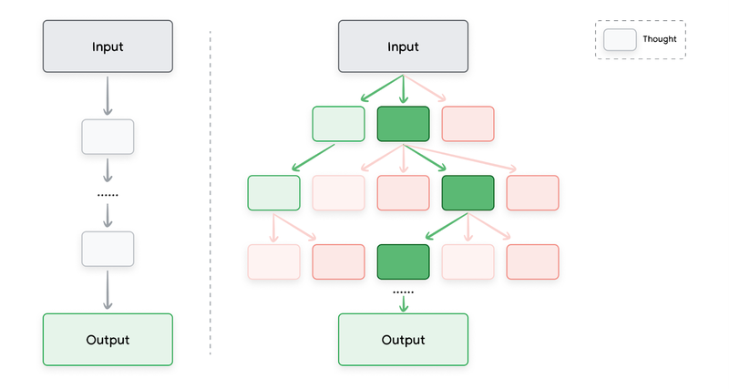

# 模块三：高级推理技术

> 对应 PDF 第 25-41 页

---

## 概念地图

- **核心概念** (必须内化): Chain of Thought (CoT)、ReAct
- **实操要点** (动手时需要): Step-back Prompting、Self-consistency、Automatic Prompt Engineering (APE)
- **背景知识** (扩展理解): Tree of Thoughts (ToT)

---

## 概念讲解

### 前言：为什么需要"高级"技术

前两个模块讲的 zero-shot、few-shot、system/role/contextual prompting 解决的是"怎么把任务说清楚"。但有些任务光说清楚不够——LLM 需要**推理**。比如数学题、多步骤逻辑、需要查外部信息的问题。

本模块的六种技术，核心都是一个思路：**让 LLM 不要直接跳到答案，而是先"想一想"**。区别在于"想"的方式不同：

| 技术 | 核心思路 | 复杂度 |
|------|----------|--------|
| Step-back | 先想一般性问题，再回到具体问题 | 低 |
| CoT | 一步一步推理，线性思维链 | 低 |
| Self-consistency | 同一个问题推理多次，投票选最多的答案 | 中 |
| ToT | 同时探索多条推理路径，像搜索树一样 | 高 |
| ReAct | 推理 + 行动循环，能调用外部工具 | 高 |
| APE | 用 LLM 生成和优化 prompt 本身 | 元技术 |

### 1. Step-back Prompting（后退提示）

**一句话说清**：遇到具体问题时，先让 LLM 回答一个更**一般性**的问题，用这个回答作为上下文，再回来解决具体问题。

**为什么在乎**：直接回答具体问题时，LLM 可能只调用了和具体细节相关的知识。先"后退一步"问一个更宏观的问题，能激活 LLM 参数中更广泛的背景知识和推理过程，从而提升最终回答的质量。类似于人类做题时先回顾基本原理，再解具体题目。

**怎么工作——两步走**：

**第一步：后退提问**（获取一般性知识）

```
Prompt:
Based on popular first-person shooter action games, what are
5 fictional key settings that contribute to a challenging and
engaging level storyline in a first-person shooter video game?

Output:
1. Abandoned Military Base: A sprawling, post-apocalyptic
   military complex crawling with mutated soldiers...
2. Cyberpunk City: A neon-lit, futuristic urban environment...
3. Alien Spaceship: A vast alien vessel stranded on Earth...
4. Zombie-Infested Town: A desolate town overrun by hordes...
5. Underwater Research Facility: A deep-sea laboratory...
```

**第二步：带上下文的具体提问**

```
Prompt:
Context: 5 engaging themes for a first person shooter video game:
[上面的 5 个主题]

Take one of the themes and write a one paragraph storyline
for a new level of a first-person shooter video game that is
challenging and engaging.

Output:
In the heart of a murky abyss, lies a dilapidated underwater
research facility... The player, an elite marine equipped with
advanced diving gear and experimental weaponry, is tasked with
venturing into this aquatic realm of terror...
```

**对比效果**：不用 step-back 直接写 `Write a one paragraph storyline for a new level...`，得到的是一个泛泛的、缺乏特色的故事；用了 step-back 后，模型基于具体的主题设定（水下实验室）生成了更有深度和氛围感的内容。

**什么时候用**：
- 创意任务需要更有深度的输出
- 技术问题需要先回顾基础原理
- 直接提问得到的答案太泛泛或太浅
- **减轻偏见**：通过聚焦一般性原则而非具体细节，step-back 可以帮助减轻 LLM 响应中的偏见

**什么时候不需要**：
- 任务本身就很具体直接（"翻译这段话"）
- 答案不需要背景知识支撑

### 2. Chain of Thought — CoT（思维链）

**一句话说清**：让 LLM 在给出最终答案之前，**先展示推理步骤**。

**为什么在乎**：LLM 在数学和逻辑推理上出了名地不靠谱。不是因为它"笨"，而是因为它被训练成直接预测答案——跳过了中间推理过程。CoT 的洞察是：**如果你让模型把推理步骤写出来，它在预测每一步时都会参考前面的步骤，从而大幅提升准确率**。

**直觉建立**：

你让一个小学生口算 `37 × 24`，他可能直接猜一个答案（很可能错）。但如果你说"把你的计算过程写在纸上"，他会写 `37 × 20 = 740`，`37 × 4 = 148`，`740 + 148 = 888`——正确率大幅提升。CoT 对 LLM 的作用和这个一模一样。

> **类比边界**：小学生写过程是因为大脑工作记忆有限需要外部辅助，LLM 写过程则是因为每一步的输出会成为下一步预测的输入上下文，改变了概率分布。机制不同，但效果类似。

**用起来什么样**：

**不用 CoT（直接回答，答错了）**：

```
Prompt:
When I was 3 years old, my partner was 3 times my age.
Now, I am 20 years old. How old is my partner?

Output: 63 years old   ← 错误！
```

**用 CoT（加一句 "Let's think step by step"）**：

```
Prompt:
When I was 3 years old, my partner was 3 times my age.
Now, I am 20 years old. How old is my partner?
Let's think step by step.

Output:
1. When I was 3, my partner was 3 × 3 = 9 years old.
2. Age difference: 9 - 3 = 6 years.
3. Now I am 20, so my partner is 20 + 6 = 26 years old.
The answer is 26.   ← 正确！
```

仅仅加了一句 `Let's think step by step.`，模型就从错误答案变成了正确答案。

> **有趣观察**：模型的推理路径和人类直觉不一定相同。上面的例子中，模型计算的是"年龄增加了 17 年"（20-3=17，然后 9+17=26），而人类通常会直接算年龄差（9-3=6，然后 20+6=26）。两种路径都能得到正确答案，但推理过程不同。这说明 CoT 让模型"展示思路"，但这个思路是模型自己找到的，未必和你预期的一样。

**CoT + Few-shot 组合（更稳定）**：

Zero-shot CoT（只加 "Let's think step by step"）有时不够稳定。结合 few-shot，给一个带推理过程的示例，效果更好：

```
Q: When my brother was 2 years old, I was double his age.
Now I am 40 years old. How old is my brother?
Let's think step by step.
A: When my brother was 2 years, I was 2 * 2 = 4 years old.
That's an age difference of 2 years and I am older.
Now I am 40 years old, so my brother is 40 - 2 = 38 years old.
The answer is 38.

Q: When I was 3 years old, my partner was 3 times my age.
Now, I am 20 years old. How old is my partner?
Let's think step by step.
A:
```

模型看到了示例的推理模式（计算年龄差 → 加到当前年龄），会模仿同样的推理结构。

**CoT 的优势和代价**：

| 优势 | 代价 |
|------|------|
| 低门槛——加一句话就行，不需要微调模型 | 输出 token 更多 = 更贵、更慢 |
| 可解释——能看到推理过程，方便 debug | — |
| 跨模型稳定——不同 LLM 版本间 prompt 表现漂移更小 | — |

**什么时候用**：任何可以"把解题过程说出来"的任务——数学、逻辑、代码生成（先分解需求再写代码）、合成数据生成。

### 3. Self-consistency（自洽性）

**一句话说清**：同一个 prompt 跑多次（高 temperature），收集多个推理路径和答案，**投票选出出现次数最多的答案**。

**为什么在乎**：CoT 用的是贪心解码（或低 temperature），只走一条推理路径。但一条路径可能刚好走偏了。Self-consistency 的思路是：**多条路径如果多数指向同一个答案，那个答案大概率是对的**。它提供了一种"伪概率"来评估答案的可靠性。

**怎么工作**：

```
步骤 1：同一个 CoT prompt → 高 temperature → 发送 N 次
步骤 2：从每次响应中提取最终答案
步骤 3：投票，选出现最多的答案
```

**实际案例——邮件分类**：

一封邮件看似友好地报告了网站 bug，但其中暗藏 XSS 攻击迹象（`inv0k3d` JavaScript alert box），发件人自称 "Harry the Hacker"。用 CoT 分类这封邮件：

| 尝试 | 推理路径 | 结论 |
|------|----------|------|
| 第 1 次 | 识别到 JavaScript 注入风险 → 可能是攻击 → **IMPORTANT** | IMPORTANT |
| 第 2 次 | 语气轻松、无紧迫性、无行动要求 → **NOT IMPORTANT** | NOT IMPORTANT |
| 第 3 次 | 识别到安全风险、发件人可疑 → **IMPORTANT** | IMPORTANT |

投票结果：IMPORTANT（2票） > NOT IMPORTANT（1票） → 最终答案：**IMPORTANT**

这个例子很好地展示了 self-consistency 的价值：第 2 次推理被邮件的友好语气"骗"了，但多数路径还是识别出了安全风险。

**代价**：显而易见——需要调用 LLM N 次，成本是单次的 N 倍。适合高价值、对准确率要求极高的场景。

### 4. Tree of Thoughts — ToT（思维树）

**一句话说清**：CoT 是一条线性推理链，ToT 把它扩展为一棵**推理树**——同时探索多条路径，可以回溯和剪枝。

**为什么在乎**：有些复杂任务（博弈、规划、创意探索）不适合线性推理——你需要在多个方向上尝试，发现某条路走不通时回头换一条。ToT 让 LLM 模拟这种"探索式思考"。



> **图说**：左侧为 Chain of Thought（线性推理链），每步只有一条路径；右侧为 Tree of Thoughts（树状推理），每步可以分支出多条路径，支持回溯和剪枝。

**怎么工作**：

```
                [问题]
               /      \
          [思路A]    [思路B]
          /    \        |
      [A-1]  [A-2]   [B-1]
        ✗      ✓       ✓
              [答案]  [答案]
```

- 每个节点是一个"thought"（连贯的语言序列，作为中间推理步骤）
- 从不同节点分支出去，探索不同推理方向
- 评估每个分支的前景，剪掉不靠谱的
- 最终汇聚到最佳答案

**与 CoT 和 Self-consistency 的关系**：

| 技术 | 推理结构 | 路径数 | 能否回溯 |
|------|----------|--------|----------|
| CoT | 线性链 | 1 条 | 不能 |
| Self-consistency | 多条独立链 | N 条 | 不能（各走各的） |
| ToT | 树状 | 多条 + 分支 | 能（剪枝回溯） |

**什么时候用**：需要探索性推理的复杂任务——策略规划、创意方案设计、数学证明。对于大多数常规任务，CoT 或 Self-consistency 已经够用。

### 5. ReAct（推理与行动）

**一句话说清**：LLM 不仅能"想"，还能"做"——在推理过程中调用外部工具（搜索引擎、代码解释器、API），获取真实信息后继续推理。

**为什么在乎**：LLM 的知识是训练时冻结的，不知道"今天天气如何"、"Metallica 乐队成员各有几个孩子"这类实时信息。ReAct 让 LLM 变成了一个**会查资料的推理者**——这是通向 Agent（智能体）的第一步。

**直觉建立**：

想象一个人在解决一个复杂问题。普通 CoT 就像这个人坐在空房间里，只靠脑子里的知识推理。ReAct 就像这个人坐在有电脑的房间里——遇到不确定的信息可以上网搜一搜，然后继续推理。

> **类比边界**：人类查资料后可能改变推理方向，ReAct 的 LLM 也是如此。但人类对信息的判断力更强，LLM 可能被不准确的搜索结果误导。

**怎么工作——Thought-Action-Observation 循环**：

```
Thought: 我需要知道 Metallica 有几个成员
Action:  Search("Metallica band members")
Observation: Metallica has 4 members

Thought: 需要查每个成员的孩子数。先查 James Hetfield
Action:  Search("How many kids does James Hetfield have?")
Observation: three children

Thought: 1/4 成员查完，已有 3 个孩子。继续查 Lars Ulrich
Action:  Search("How many kids does Lars Ulrich have?")
Observation: 3

Thought: 2/4 成员查完，共 6 个孩子。继续查...
...

Thought: 4/4 成员查完，总共 10 个孩子
Final Answer: 10
```

**代码实现**（使用 LangChain + VertexAI）：

```python
from langchain.agents import load_tools, initialize_agent, AgentType
from langchain.llms import VertexAI

prompt = "How many kids do the band members of Metallica have?"
llm = VertexAI(temperature=0.1)
tools = load_tools(["serpapi"], llm=llm)
agent = initialize_agent(
    tools, llm,
    agent=AgentType.ZERO_SHOT_REACT_DESCRIPTION,
    verbose=True
)
agent.run(prompt)
```

**关键实现细节**：
- ReAct 实际上是不断把之前的 prompt + 响应重新发给模型（含 thought/action/observation 历史）
- 每轮需要做 prompt 裁剪，去掉多余生成内容
- 需要为模型设置好工具使用的示例/指令
- Temperature 建议设低（0.1），因为推理需要确定性

**什么时候用**：
- 需要实时/外部信息的任务
- 多步骤问题，中间步骤需要查询外部数据
- 构建 Agent 系统的基础范式

**什么时候不需要**：
- 任务只需要模型内部知识
- 不需要外部工具支持的纯推理任务

### 6. Automatic Prompt Engineering — APE（自动提示工程）

**一句话说清**：用 LLM 来生成和优化 prompt 本身——**写 prompt 的 prompt**。

**为什么在乎**：手动写 prompt 费时费力，而且人类的直觉不一定能找到最优 prompt。APE 让模型自己探索 prompt 空间，可能发现人类想不到的高效表达方式。

**怎么工作——三步循环**：

```
步骤 1：生成候选
    让 LLM 生成同一任务的多种 prompt 变体

步骤 2：评估
    用评估指标（BLEU、ROUGE 等）给每个候选 prompt 打分

步骤 3：选择 + 迭代
    选最高分的 prompt，可以进一步微调后再评估
```

**实际案例——T 恤网店聊天机器人**：

目标：为一个乐队 T 恤网店训练聊天机器人，需要覆盖用户各种下单表达方式。

```
Prompt:
We have a band merchandise t-shirt webshop, and to train a
chatbot we need various ways to order: "One Metallica t-shirt
size S". Generate 10 variants, with the same semantics but
keep the same meaning.

Output:
1. I'd like to purchase a Metallica t-shirt in size small.
2. Can I order a small-sized Metallica t-shirt?
3. I'd like to buy one Metallica t-shirt in small.
4. One Metallica shirt, size small, please.
5. I want one Metallica t-shirt in size small.
...
```

然后用 BLEU/ROUGE 等指标评估这些变体的质量，选出最佳版本用于实际系统。

**什么时候用**：
- 需要大量 prompt 变体（训练数据、A/B 测试）
- 手动 prompt 优化已经到瓶颈，想让模型自动探索
- 批量生成合成训练数据

---

## 六种技术速查对比

| 技术 | 核心机制 | 调用次数 | 需要外部工具 | 适用复杂度 | 成本 |
|------|----------|----------|-------------|-----------|------|
| Step-back | 先问一般问题再回到具体 | 2 次 | 否 | 低-中 | 低 |
| CoT | 展示推理步骤 | 1 次 | 否 | 中 | 低 |
| Self-consistency | 多次推理 + 投票 | N 次 | 否 | 中 | 高 |
| ToT | 树状探索多路径 | 多次 | 否 | 高 | 高 |
| ReAct | 推理 + 行动循环 | 多次 | **是** | 高 | 高 |
| APE | 用 LLM 生成/优化 prompt | 多次 | 否（可选） | 元技术 | 中 |

---

## 重点标记

1. **CoT 是性价比最高的推理增强技术**：加一句 "Let's think step by step" 就能显著提升数学/逻辑任务的准确率，几乎零成本。
2. **Self-consistency 用成本换准确率**：适合高价值场景，通过多次推理投票提升可靠性。
3. **ReAct 是 Agent 的雏形**：让 LLM 能调用外部工具，是从"只会想"到"能做事"的关键跨越。
4. **Step-back 是最容易被忽视的技术**：在创意和知识密集型任务中，先后退一步问基础问题往往能显著提升输出深度。
5. **CoT 的 temperature 应该设为 0**：推理任务需要确定性，高 temperature 会让推理步骤出错。Self-consistency 反过来需要高 temperature 来产生多样化路径。
6. **APE 适合批量场景**：手写一个 prompt 去优化 → 不值得用 APE；批量生成/优化几十个 prompt → APE 价值显现。

---

## 自测：你真的理解了吗？

**Q1**：你需要让 LLM 解一道多步数学应用题。你会用哪种技术？如果答案不稳定（同一题有时对有时错），你会怎么升级策略？

**Q2**：你的任务是让 LLM 查询"2026 年奥斯卡最佳影片是什么"并生成一段影评。Zero-shot、CoT、ReAct——你应该选哪个？为什么其他两个不行？

**Q3**：同事说"Self-consistency 就是把 CoT 跑 5 遍取平均"。这句话哪里不准确？

**Q4**：你在用 CoT 做一个分类任务，Temperature 设为 0.8。一个前辈告诉你"CoT 的 temperature 应该设 0"。为什么？如果你同时还想用 self-consistency 呢？

**Q5**：Step-back prompting 和 Contextual prompting 有什么联系？Step-back 的第二步本质上是在做什么？
