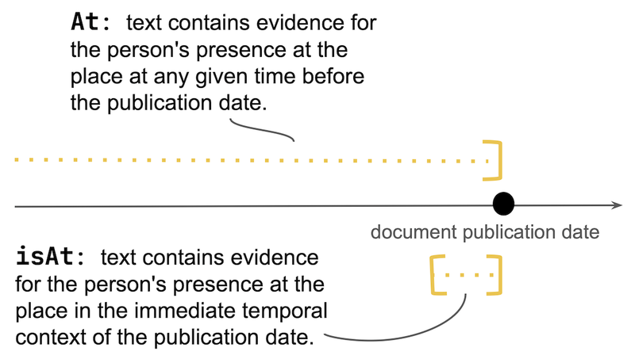

# 论文精读：从多语言历史文本中评估人物-地点关系抽取的准确性与效率

> **原标题**：CLEF HIPE-2026: Evaluating Accurate and Efficient Person-Place Relation Extraction from Multilingual Historical Texts
> **作者**：Juri Opitz, Corina Raclé, Emanuela Boros, Andrianos Michail, Matteo Romanello, Maud Ehrmann, Simon Clematide
> **机构**：苏黎世大学、SARI（瑞士艺术研究基础设施）、洛桑联邦理工学院（EPFL）
> **发表**：arXiv 2602.17663v1, 2026 年 2 月
> **链接**：https://arxiv.org/abs/2602.17663v1
> **论文类型**：评测/共享任务（Shared Task Description）

---

## 1. 一句话总结

HIPE-2026 定义了一个新的评测任务：从嘈杂的多语言历史文档中，判断某个人物是否曾经在某个地点出现过（`at`）以及在文档发表时是否正在该地点（`isAt`），并首次将计算效率纳入关系抽取的评测维度。

---

## 2. 为什么值得关注

**历史文档数字化正在加速**，但数字化产出的文本往往充满 OCR 噪声、多语言混杂、时间跨度大（横跨 200 年）。从这些文本中自动挖掘"谁在哪里、什么时候"的结构化信息，对数字人文、知识图谱构建、历史人物传记重建都有直接价值。

**现有的关系抽取（RE）评测存在明显缺口**：主流基准如 TACRED 和 DocRED 只覆盖现代、干净的英文文本，不涉及 OCR 噪声、多语言、历史语境。HIPE 系列的前两轮（2020、2022）解决了命名实体识别和链接（NER/NEL），但停留在"识别出谁和哪里"这一步，还没有触及"他们之间是什么关系"。

**HIPE-2026 补上了这最后一环**：从"识别实体"推进到"抽取关系"，而且在评测设计上做了一个很有前瞻性的决定——把计算效率和跨领域泛化能力跟准确率放在同等地位来评估。这在当下 LLM 成本飙升的背景下尤其有意义。

---

## 3. 核心贡献

1. **定义了一个新任务**：人物-地点关系抽取（Person-Place RE），包含两种时间维度不同的关系类型（`at` 和 `isAt`）
2. **三维评测框架**：首次在 RE 评测中同时考量准确率、计算效率和领域泛化能力
3. **跨语言+跨时代数据集**：覆盖法语、德语、英语、卢森堡语的 19-20 世纪报纸，以及 16-18 世纪法语文学文本作为"意外领域"测试

---

## 4. 方法直觉

### 任务设计：不只是"共同出现"

这个任务的核心不是简单的共现检测（"人名和地名出现在同一篇文章里"），而是要做**推理**：

- **`at` 关系**（三值：true / probable / false）：在文档发表日期之前的任何时间点，这个人是否曾在这个地方？
- **`isAt` 关系**（二值：+ / -）：在文档发表前后的时间窗口内，这个人是否正在这个地方？

两者的关系：`isAt` 是 `at` 的时间精化版。如果 `isAt=+`，逻辑上 `at` 应该是 true 或 probable。

> **图说**：`at` 覆盖从过去到发表日期的整个时间跨度，`isAt` 只关注发表日期附近的时间窗口。

### 为什么引入"probable"？

论文借用了 Hobbs 的"溯因推理"（Interpretation as Abduction）框架：语言理解不只是读取字面意思，还包括推断"说话人为什么要这么说"所需的最小假设集合。

**具体例子**：1960 年美国报纸报道一位 Gruenwald 上校在空军基地的露营活动上发表了演讲——

| 人物 | 地点 | at | isAt | 推理依据 |
|------|------|-----|------|---------|
| Gruenwald 上校 | Myrtle Beach 空军基地 | true | + | 文中明确说他是该基地指挥官 |
| Gruenwald 上校 | Clear Pond | true | + | 他在此地的露营活动上演讲，间接推断 |
| Gruenwald 上校 | Myrtle Beach（城市） | probable | - | 他是基地军官，很可能去过该城市，但文中没有直接证据 |
| Gruenwald 上校 | Conway | false | - | 仅作为地理参考点提及，无任何关联证据 |

这个例子很好地展示了三个标签的区分度：同一个人对不同地点，因证据强度不同，标注从 true 到 probable 到 false 逐级递减。

### 评测三维度

| 评测维度 | 核心指标 | 适合什么系统 |
|----------|---------|------------|
| **准确率** | Macro Recall（宏平均召回率） | 大模型、高级 prompting、Agent 系统 |
| **准确率-效率** | 准确率 + 参数量/模型大小的综合排名 | 轻量 LLM、专用分类器 |
| **泛化能力** | 在"意外领域"（16-18 世纪文学文本）上的 Macro Recall | 所有系统 |

选择 Macro Recall 而非 F1 的原因：确保每个标签（true/probable/false）权重相等，不受类别不平衡影响。

---

## 5. 关键发现与数据

这是一篇任务定义论文，主要实验结果来自**先导研究（Pilot Study）**：

- **标注一致性**：3 名标注者对 119 个人物-地点对进行标注
  - `at` 关系：Cohen's kappa 0.7-0.9（高一致性）
  - `isAt` 关系：Cohen's kappa 0.4-0.9（波动较大）——说明判断"此刻是否在场"比判断"历史上是否去过"更主观

- **GPT-4o 基线表现**：
  - `at` 关系：与金标准的一致性最高达 0.8（表现不错）
  - `isAt` 关系：一致性 0.2-0.7（波动大，表现不稳定）
  - 论文特别指出 LLM 的**推理成本很高**，因为候选人物-地点对的数量随实体数二次增长

- **数据集规模**：
  - Test Set A：4 种语言（法/德/英/卢森堡语），19-20 世纪报纸
  - Surprise Test Set B：16-18 世纪法语文学文本（只评 `at` 关系）
  - 数据和评测工具在 GitHub 上以 CC-BY 4.0 协议发布

---

## 6. 局限与开放问题

**作者承认的局限**：
- `isAt` 关系的标注一致性明显低于 `at`，说明任务定义在时间边界的判断上仍有模糊空间
- 目前只有先导研究数据，正式评测尚未完成（这是任务定义论文，不是结果论文）

**读者视角的局限**：
- 任务只聚焦**人物-地点**这一种关系类型，未覆盖人物-人物、人物-事件等同样重要的历史关系
- "probable"标签的判断高度依赖标注者的背景知识——论文虽然用溯因推理框架来理论化这一点，但实操中的主观性仍然难以消除
- 对 LLM 的效率评测依赖参赛队伍自报参数量，缺乏统一的计算成本度量标准（如 FLOPs 或能耗）

**开放问题**：
- LLM 在 OCR 噪声文本上的鲁棒性如何？噪声对关系推理的影响是否比对 NER 更大？
- 效率和准确率之间的最优平衡点在哪里？小模型微调能否接近大模型 zero-shot 的效果？
- 跨领域泛化（从 19 世纪报纸到 16 世纪文学）的难点到底是语言变化还是体裁差异？

---

## 7. 启发与关联

**对 NLP 领域的启发**：
- **效率作为一等公民**：这是 RE 评测中少见的将计算效率提升到与准确率同等地位的设计。在 LLM 推理成本持续上涨的今天，这种评测哲学值得其他任务借鉴——不是"能不能做到"，而是"能不能高效地做到"。
- **任务对 LLM 友好**：任务被框架为分类问题（给定文档和人物-地点对，输出标签），天然适合 LLM 的 in-context learning 和 agent 方式处理，降低了参与门槛。

**对数字人文的启发**：
- 如果这个任务的参赛系统表现足够好，意味着可以大规模自动重建历史人物的移动轨迹——"谁在什么时候去了哪里"。这对历史学、传记研究、社会网络分析都有直接应用。

**相关工作关联**：
- HIPE 系列（2020 NER → 2022 NEL → 2026 RE）是一个从浅到深的渐进体系，如果对历史文本的 NLP 处理感兴趣，可以回溯前两轮的论文
- 如果对关系抽取的通用进展感兴趣，论文引用的 Ali et al. (2025) 多语言 RE 综述是很好的起点
- GLiREL（Boylan et al., 2025）作为零样本 RE 的通用模型，可能是参加这个评测的实际工具选择

---

## 关键术语

| 术语 | 解释 |
|------|------|
| Relation Extraction（RE，关系抽取） | 从文本中自动识别实体之间的语义关系 |
| CLEF | 欧洲信息检索评测会议，组织多个共享任务 |
| Shared Task（共享任务） | 学术界常用的竞赛式评测：统一数据、统一指标，多支队伍提交系统进行对比 |
| `at` 关系 | 三值标签（true/probable/false）：人物在发表日期前是否曾在该地点 |
| `isAt` 关系 | 二值标签（+/-）：人物在发表时间附近是否在该地点 |
| Macro Recall（宏平均召回率） | 对每个标签分别计算召回率再取平均，确保类别不平衡时每个标签权重相等 |
| Cohen's Kappa | 衡量标注者之间一致性的指标，排除了偶然一致的因素，>0.7 通常认为高一致性 |
| Abductive Reasoning（溯因推理） | 从观察到的现象推断最可能的解释，区别于演绎（从规则推结论）和归纳（从样本推规则） |
| OCR 噪声 | 光学字符识别产生的错误，历史文档中尤为严重（字体古旧、纸张老化、排版复杂） |
| Distant Supervision（远程监督） | 利用已有知识库自动为文本标注关系标签，可大规模生成训练数据但引入噪声 |
| Domain Generalization（领域泛化） | 模型在训练领域之外的新领域上保持性能的能力 |
